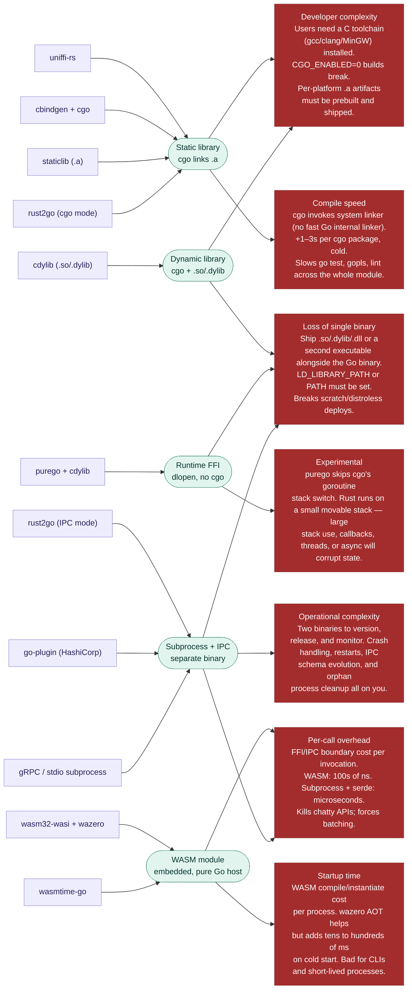

<!-- Design Documents often contain forward-looking statements -->
<!-- vale gitlab.FutureTense = NO -->

## 状態

**提案中。**

## コンテキスト

LabKit Go は、約 6 年間にわたってネイティブ Go ライブラリとして実装されています。
GitLab の Go コンポーネントの大部分で本番運用され、
API サーフェスは成熟しており、
実装言語の変更には相応のコストがかかります。

Developer Experience チームは、言語をまたいで LabKit を所有しています
（[LabKit North Star 戦略](/handbook/engineering/architecture/design-documents/labkit_north_star_strategy/)を参照）。
また、チームの専門性は Go に集中しています。
LabKit Go の保守、サポート、アーキテクチャの進化は、
Go を最も得意とするエンジニアが担います。

Theseus が LabKit に依存していることで、LabKit の構築方法と提供方法を変更した場合の重要性が増します。

非ネイティブなすべての代替案に伴う欠点は、
GitLab の全エンジニアの生産性に影響します。

複数の言語バインディング間で作業を重複させずに済むという理由から、
Go 以外のコア（一般には Rust）と実装を共有する案が定期的に話題になります。
この ADR は、LabKit Go でその経路を選ばない理由を記録します。

## 決定

**LabKit Go はネイティブ Go ライブラリとして実装します。**
リファレンス実装には純粋な Go（`go.mod`、慣用的な Go パッケージ）を使用し、
`cgo` は避けられないシステムバインディングにのみ使用します。

FFI、動的リンク、サブプロセス + IPC、WASM を介して利用する Go 以外の LabKit ランタイムは、
LabKit Go の対象から明示的に**除外**します。

この決定の対象は LabKit Go です。
LabKit Ruby や、今後別の言語向けに実装される LabKit を制約するものではありません。
これらの言語では、単一の共有ランタイムコンポーネントを採用する方が
適切な可能性も十分にあります。

## 結果

### メリット

1. **チームの既存スキルセットで保守できます。**
   Developer Experience チームがすでに運用している言語で LabKit Go を進化させるため、
   2 つ目のコアエコシステムへ並行して投資する必要がありません。
1. **利用側のツールチェーンに回帰がありません。**
   LabKit に依存するすべてのコンポーネントで、`go build`、`go test`、`go mod`、`CGO_ENABLED=0`、
   `go install` のセマンティクスを変更せずに利用し続けられます。
1. **単一ファイルのバイナリを引き続き作成できます。**
   LabKit に依存するコンポーネントは、共有オブジェクト、プラグインプロセス、WASM ランタイムを
   一緒に提供しなくても、静的で scratch イメージに対応する Go バイナリを引き続き生成できます。
1. **ランタイムの動作を予測できます。**
   FFI のスタック切り替えによる予期しない問題、管理すべきサブプロセスのライフサイクル、
   呼び出しごとの WASM コールドスタートコストはありません。

### デメリット

1. **LabKit-Go と LabKit-Ruby の実装は並行して進化します。**
   言語間の動作の同等性は調整上の課題となり、
   コンパイラで強制できません。
1. **Go 以外の実装を本当に必要とする機能は、
   ケースごとに正当化する必要があります。**
   たとえば、Go 以外の形でしか利用できない FIPS 検証済みの暗号プリミティブには、
   LabKit のコア全体を境界の向こうへ移すのではなく、
   明確なオーナーを持つ独自の限定的な例外が必要です。
1. **言語横断の重複排除は、コンパイル時の利点にはなりません。**
   FFI を介して Go と Ruby で単一のコアを共有する案は、LabKit Go では恒久的に除外されます。
   代わりに、仕様、テストスイート、適合性ハーネスを共有します。

## これは双方向ドアの意思決定です

これが重要だと判断した場合は、後の段階で、単一の
バイナリへ移行できます。

## 検討した代替案

考えられる各代替案には、いくつかの欠点があります。

## 参考資料

- [セクション 3.2 — Platform-as-a-product のコミットメント](../#32-platform-as-a-product-commitments) —
  LabKit をプラットフォームの標準ライブラリとして位置付ける原則 6。
- [Theseus ADR 001 — 推奨スキーマ言語としての Protobuf](001_protobuf_as_preferred_schema_language.md) —
  LabKit Go に依存する型付き構成サーフェス。
- [LabKit North Star 戦略](/handbook/engineering/architecture/design-documents/labkit_north_star_strategy/) —
  ガバナンスモデルと言語ごとのオーナーシップ。
- [LabKit リポジトリ](https://gitlab.com/gitlab-org/labkit) —
  標準実装。
- [`purego`](https://github.com/ebitengine/purego)、
  [`wazero`](https://wazero.io/)、
  [`go-plugin`](https://github.com/hashicorp/go-plugin)、
  [`uniffi-rs`](https://github.com/mozilla/uniffi-rs) —
  上記で調査したバインディング技術。
