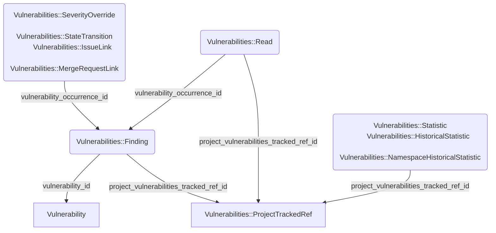

このページには今後予定されている製品・機能・機能性に関する情報が含まれています。ここに示す情報は参考目的のみです。購入・計画の決定にこの情報を使用しないでください。製品・機能・機能性の開発、リリース、タイミングは変更または延期される可能性があり、GitLab Inc. の独自の判断に委ねられています。

<table class="w-full text-sm border-collapse">
<thead>
<tr class="bg-gray-100 text-left">
<th class="px-3 py-2 border border-gray-300">Status</th>
<th class="px-3 py-2 border border-gray-300">Authors</th>
<th class="px-3 py-2 border border-gray-300">Coach</th>
<th class="px-3 py-2 border border-gray-300">DRIs</th>
<th class="px-3 py-2 border border-gray-300">Owning Stage</th>
<th class="px-3 py-2 border border-gray-300">Created</th>
</tr>
</thead>
<tbody>
<tr>
<td class="px-3 py-2 border border-gray-300">ongoing</td>
<td class="px-3 py-2 border border-gray-300"><a href="https://gitlab.com/ghavenga" class="text-blue-600 hover:underline">@ghavenga</a></td>
<td class="px-3 py-2 border border-gray-300"><a href="https://gitlab.com/theoretick" class="text-blue-600 hover:underline">@theoretick</a></td>
<td class="px-3 py-2 border border-gray-300"></td>
<td class="px-3 py-2 border border-gray-300">~group::security_infrastructure</td>
<td class="px-3 py-2 border border-gray-300">2025-02-28</td>
</tr>
</tbody>
</table>

## 概要

GitLab において現在最も需要の高い Sec 機能の一つが、[複数ブランチにわたる脆弱性をトラッキングする](https://gitlab.com/groups/gitlab-org/-/epics/3430)機能です。GitLab の脆弱性管理機能の現在の実装は多くの機能を提供していますが、実装が非常に柔軟性に欠けています。その結果、古いリリースや修正されたバージョンなど、アプリケーションの異なるバージョンを実行するワークフローでは、コードを別々のプロジェクトに完全にフォークしない限り脆弱性をトラッキングすることができません。

残念ながら、GitLab の現在のコードはこのニーズを満たすように構築されていないため、システムの安定性を損なうことなくこれを可能にするための変更を検討する必要があります。

## 動機

複数ブランチにわたる脆弱性のトラッキングを求めるユーザーが挙げる主な例の一つは、ユーザーが同時に複数のバージョンのシステムや製品をデプロイまたは提供することがよくあるということです。

このモデルでは、古いバージョンのバグとセキュリティ修正を提供し続ける可能性があるアプリケーションでは、GitLab の統合を使用して複数のサポートされているバージョンのコードの脆弱性を簡単に管理することができません。これにより、ユーザーはセキュリティスキャンを収容するために意図しない方法で GitLab を使用することを余儀なくされるか、この不便さを避けるために他のスキャンツールを使用することを選択するかのどちらかになります。

### 目標

- マルチブランチの脆弱性監視と履歴トラッキングを実現する
- この機能をシンプルで一貫性があり、まとまりのある方法で提供する
- この機能が適切に設計されており、現在または長期的に GitLab の安定性にリスクをもたらさないことを保証する

## 実装

### Ref トラッキング

静的 ref トラッキングの意図は、GitLab がデフォルトブランチの脆弱性をトラッキングする現在の方法論を維持しながら、この動作を追加のブランチに拡張することです。基本的に、この新しいデータパラダイムをサポートするために、コアテーブルの一部に実質的な変更を加える必要があります。具体的には、一部のテーブルの目的が若干再定義され、脆弱性のためにどの git ref がトラッキングされるかを保存できるようにする必要があります。

また、これらの相互作用がブランチを明確に区別する必要があるため、同一の脆弱性を保持するブランチを考慮するために大量のコードを更新する必要があります。

これを可能にするために必要な主要な変更点は以下のようにまとめられます：

- `security_project_refs` という新しいテーブルが作成されます。このテーブルは、プロジェクトとその中で脆弱性がトラッキングされる ref 名の間の結合関係として機能します。その ID は、他のテーブルがブランチ/タグの関係を定義するコンテキストになります。
- `vulnerability_occurrences` テーブルは、特定のブランチで発生する脆弱性の表現になります。そのため、`security_project_refs` テーブルへの参照を持つことになります。
- `vulnerabilities` テーブルは、複数のブランチにわたってさまざまな形で存在する可能性がある脆弱性という概念の高レベルな表現になります。
- `vulnerability_severity_overrides` や `vulnerability_state_transitions` などのサポート情報テーブルは、これらの詳細が脆弱性が発生するコンテキストに固有であるため、`vulnerability`（脆弱性）ではなく `vulnerability_occurrence`（脆弱性の発生）に関連付けられます。
- 脆弱性に固有の/固有でない情報は、このパラダイムシフトを反映するために `vulnerabilities` と `vulnerability_occurrences` の間で移動されます。
- `vulnerability_reads` は `vulnerability_occurrences` の反映になり、脆弱性レポート専用に最適化するための追加のサポート情報とインデックスが含まれます。これは、より正規化されたデータを真実の情報源として作成し、特定の機能をサポートするために最適化された非正規化のテーブルを持つという新しいスキーマの意図と一致します。
- パイプラインがトラッキングされた ref 上で実行されたかどうかを考慮し、そうであれば、そのブランチに関連付けられた指定されたパイプラインの脆弱性を取り込むよう、脆弱性の取り込みプロセスを更新します。
- 適切なレコードが更新されるよう、相互作用する脆弱性のブランチコンテキストを考慮するようすべてのインタラクションサービスを更新します。
- ブランチコンテキストで脆弱性情報を検索、フィルタリング、提示できるよう、現在脆弱性情報を提示するすべての API とインターフェースを更新します。
- 拡張されたブランチトラッキング数によりおそらく両方のテーブルが Postgres の vacuum が単一テーブルを効果的に処理できるサイズを超えるため、`vulnerabilities` と `vulnerability_occurrences` のパーティショニングを行います。

注意: 実装は作業が進むにつれてより深い理解に基づいて変更される可能性があるため、DB 設計をここで網羅的にリストアップすることが目的ではなく、どのように構成されるかとその理由の高レベルな理解を提供することを意図しています。具体的な実装の詳細については、epics/issues を参照してください。

#### 脆弱性と発生の差別化の例

概念的に、脆弱性（Vulnerability）はどこで見つかったかに関係なく脆弱性の定義を表すことを意図しており、発生（Occurrence/Finding）は特定の ref で見つかった脆弱性のインスタンスを表すことを意図しています。これは以下の例のように見えます。

---

脆弱性（Vulnerability）:

- ID: 1
- 主要識別子: CVE-2025-49007
- タイトル: Rack::Multipart handle_mime_head の ReDoS 脆弱性
- 説明: Lorem Ipsum Dolor
- 深刻度: Critical
- CVSS: ...
- スキャナー: SAST
- 解決策: ...
- CVE: ...
...

---

発見（Finding/Occurrence）

- 脆弱性 ID: 1
- UUID: '00000000-0000-0000-0000-000000000000'
- 場所: app/services/user_auth_service.rb
- Ref: 'development'
- 状態: :detected
- 初期/最新パイプライン: 123
...

---

この差別化により、真実の情報源テーブルに対して単一の脆弱性の発生ごとのデータ複製量を制限できますが、このデータに依存する機能をサポートするために必要な任意のビューパターンを構築できます。

### クエリ

この情報は、それぞれのブランチにおける脆弱性の存在と状態に関する真実の情報源として効果的に機能します。しかし、この情報をユーザーに提示し、クエリやフィルタリングを可能にするためには、効果的にインデックス化およびフィルタリングできる状態に情報を具現化する必要があります。パフォーマンスの問題の歴史から、現在の脆弱性レポートは `vulnerability_reads` という高度に非正規化されたテーブルによって機能しており、単一の行に脆弱性に関連するすべての情報が含まれているため、効果的なインデックス作成とフィルタリングが可能です。

オンデマンドで処理する必要がある量を最小化するために、同様の方法で異なるブランチの脆弱性レポートを保存し、ユーザーがフィルタリングおよびクエリするための出力を効果的に「キャッシュ」する必要があります。これは既存の Vulnerability::Reads パラダイムを使用して実現可能ですが、これを可能にするために非正規化されたレコードの実質的なストレージが必要であることを認識する必要があります。プロジェクトのトラッキングしたい各追加ブランチは、ブランチ固有の差異を加減した上で、その脆弱性の本体全体を複製する必要があります。

これは、データベース構造に以下の変更を加えることで実現できます：

- 脆弱性レポートテーブルのパーティショニング。
  - 特定のサイズを超えるテーブルはさまざまなパフォーマンスの問題に直面し始めます。現在の `vulnerability_reads` のサイズはすでにこれらの問題に直面し始めるしきい値を超えているため、前進するための安定したパフォーマンスを確保するためにパーティショニングが必要です。
  - さらに、特定のサイズを超えるテーブルへのカラムとインデックスの追加に関する GitLab の制限に従うと、`vulnerability_reads` は現在両方の条件に違反しています。そのため、パーティショニングはそういった意味でオプションではありません（追加のカラムを追加するための承認を求める必要があるかもしれませんが）。
- ブランチでフィルタリングできるよう、脆弱性レポートテーブルに `project_vulnerability_tracked_ref_id` カラムを追加します。
- `vulnerability_reads` テーブルに `partition_number` を追加します。
  - これにより `vulnerability_reads` にスライディングリストパーティション戦略を使用でき、GitLab がスケールしてユーザーが脆弱性管理機能をより広く採用するにつれて、動的に新しいパーティションを追加できます。
  - パーティション番号はデータの断片化を最小限に抑えるためにプロジェクト/ネームスペース/Organization ごとに割り当てる必要があります。最後のパーティションが 75GB を超えたときに新しいパーティション番号を使用する必要があります。これにより、すでに割り当てられたプロジェクトが 100GB を超えることなく成長できます。
  - 必要であれば、特定の割り当てが重くなりすぎた場合のパーティションの再バランスも可能です。
  - 代替のパーティショニング戦略をまだ検討中です。パーティショニングの実装に関する最新情報については、それぞれの [Issue](https://gitlab.com/groups/gitlab-org/-/epics/16174) を参照してください。

### スケーラビリティ、ストレージ、パフォーマンス

複数ブランチにわたる脆弱性のトラッキングは、サポートするためにすべてを N 倍必要とします。脆弱性レポートのために脆弱性を具現化して効果的にインデックス化およびフィルタリングできるようにするには、デフォルトブランチの脆弱性をトラッキングするのにかかったスペースと同じくらいの `vulnerability_reads` テーブルのスペースが再び必要になります（新しい ref カラムと関連するインデックスへの変更のために少し多く）。

パイプラインからのセキュリティレポートの取り込みに関連して、脆弱性を更新するための取り込みは引き続きイテレーティブな更新プロセスであるため、その観点から必要な処理は最小限です。

ただし、コスト上の理由から、すべてのプロジェクトのすべてのブランチに対してレポートの具現化を常時保持することは望ましくないでしょう。これを緩和するために、アクティブにトラッキングされる ref の数を制限し、パフォーマンス、スケーラビリティ、コストに対する安心度に基づいてこれを拡大することができます。

ユーザーが一時的にしか必要としない可能性がある場合に冗長な脆弱性レポートデータを永遠に保持することを避けるための緩和策として、脆弱性の履歴を使用して必要なときに ref のレポートをオンデマンドで生成し、処理中にユーザーに待つように依頼する UI/UX 要素を使用できます。これにより、短期間しか必要としない可能性がある場合に過剰なデータを保持する必要性が緩和されます。

ブランチカバレッジと関連するストレージコストのトレードオフ方法はいくつかあります。このトレードオフは現在この設計ドキュメントの範囲外です。ブランチカバレッジの正当な開始点を選択し、後日立場を見直します。

`vulnerability_reads` は本質的に真実の情報源テーブルからの情報の具現化されたビューにすぎないため、（ユーザーを中断させない限り）それを破壊して再構築することは危険ではありません。そのため、使用がこの非正規化情報の専用ストレージが必要なほどに拡大した場合、このテーブルは専用のデータベースに非常に簡単に分解できます。

### 保持

GitLab で現在非常に重要なテーマの一つが、未使用の情報の永続的なストレージを避けるためのデータへの保持ポリシーの適切な適用です。私たちはすでに脆弱性の経過時間に基づいた[脆弱性の保持ポリシー](https://gitlab.com/groups/gitlab-org/-/epics/12229)の実装を進めています。

脆弱性の保持に対するこの新しいアプローチにより、現在意図している 12 ヶ月の保持ポリシーへの影響はないはずです。任意のブランチでの脆弱性の検出は、コードベースでの脆弱性の存在を更新し、その保持期限を更新します。

### ブランチの変更に対する履歴の処理方法

ブランチが何らかの理由（手動またはマージ時の自動化）で削除された場合、そのブランチの脆弱性情報は歴史的なものになります。プロジェクトが引き続き ref 名を脆弱性のためにトラッキングするよう設定している限り、標準の保持ポリシーに従ってこのデータを維持する必要があります。ユーザーがブランチのトラッキングを停止するよう依頼した場合、ブランチの履歴を削除することを警告し、先にアーカイブできるようにします。

### パッケージアドバイザリのための SBOM 依存関係トラッキング

複数のブランチでパッケージアドバイザリから脆弱性をトラッキングするためには、トラッキングされたすべての ref に存在する依存関係もトラッキングする必要があります。これは複数の ref にわたる脆弱性トラッキングの完全に実現された実装を提供するための重要な部分であると判断されています。

SBOM 依存関係は `sbom_components` と `sbom_occurrences` によって表されており、`vulnerabilities` と `vulnerability_occurrences` と同様の方法です。コンポーネントは依存関係の名前であり、発生はそのコンポーネントの特定バージョンの特定の発生を表します。しかし、SBOM レコードは ref 間で実質的に変わりません。その結果、ブランチごとに固有の発生を個別にトラッキングするために新しいレコードを使用すると、価値のない大量の重複データが生じます。そのため、このデータをより良く正規化し冗長性を避けるために、新しい `sbom_occurrence_refs` 結合テーブルを導入します。

この結合が導入されたら、[`security_project_refs`](https://gitlab.com/gitlab-org/gitlab/-/issues/555971) テーブルで ref がトラッキング対象として設定されている場合に、ブランチごとに依存関係レポートを取り込み始めることができます。

依存関係レポートとグラフは、脆弱性と同様の方法でトラッキングされた ref ごとに表示できるようになり、パッケージアドバイザリなどの後続機能は SBOM の発生をループして、現在のデフォルトブランチに対して行うのと同じ方法でブランチごとに必要な脆弱性レポートを提供できます。

ブランチが脆弱性トラッキング ref リストから削除された場合、そのグラフの SBOM 依存関係データは削除されます。SBOM データにはユーザーの直接的なインタラクションがないため、一時的なものとして扱うことができます。ユーザーは、ref をトラッキング対象として設定してからパイプラインを実行してデータの取り込みをトリガーすることで、オンデマンドでこのデータを再生成できます。

#### SBOM モデル分割の例

脆弱性モデルの分割とは異なり、以下は `sbom_components`、`sbom_occurrences`、`sbom_occurrence_refs` の間で依存関係の定義とコンテキスト上の発生情報の関係を表すために追跡されることが期待されるデータの違いの例です。

これは方向性を示すための例にすぎません。最終的な実装の詳細については、[epic](https://gitlab.com/groups/gitlab-org/-/epics/18587) を参照してください。

---

SBOM コンポーネント:

- ID: 1
- コンポーネント名: Active Record
- ライセンス: [MIT]
- 祖先: [x, y, z]
...

SBOM 発生

- 依存関係 ID: 1
- 入力ファイルパス: gemfile.lock
- コミット SHA: xyz
- パッケージマネージャー: Bundler
- コンポーネントバージョン: 7.1
- UUID: '00000000-0000-0000-0000-000000000000'
...

SBOM 発生 Ref:

- Ref: 'development'
- コミット SHA: xyz
- パイプライン ID: 123

---

## なぜこのアプローチなのか？

複数ブランチにわたる脆弱性のトラッキングのアーキテクチャを検討し始めた当初、CPU アクティビティとデータベースストレージの観点からデータベースへの影響を非常に懸念していました。その結果、静的ブランチトラッキングと、コミット履歴の脆弱性の入退点（Entry/Exit）を追跡するという代替提案との間のリスクとメリットを理解するために、実質的な議論が行われました。

Entry/Exit トラッキングは、保存および維持する必要があるレコードの数を減らすという点で有望に見え、DB の CPU とストレージの懸念をある程度解決するように見えました。しかし、さらなる調査により、実装においてスキャンとコミット履歴が完全に一致しない場合に関連するさまざまなコーナーケースを処理するために、実質的な量の新しいシステムロジックが必要であることが分かりました。例えば、単一のプッシュに複数のコミットが含まれている場合、特定の脆弱性のエントリポイントになったものを簡単に特定することはできません。

さらに、静的ブランチトラッキングのデータへの影響をいくつか予測し、保存する必要があるデータの量は非常に大きくなるものの、Sec データベース分解によって提供される成長余地がその成長を実現可能な範囲に収めることができると判断しました。その結果、静的ブランチ分析を安全に進めることができます。

静的ブランチトラッキングアプローチを使用することで、トラッキングするブランチ数に適用する制限と、効果的なデータ正規化を確保するためのモデル設計において慎重かつ意図的に行動する限り、実装のリスクが低減されます。パフォーマンスとストレージを良好な状態に保ちます。

Entry/Exit トラッキングに関連する懸念と複雑さについての詳細なコンテキストは、[このスレッド](https://gitlab.com/gitlab-com/content-sites/handbook/-/issues/498#note_2572581685)を参照してください。
