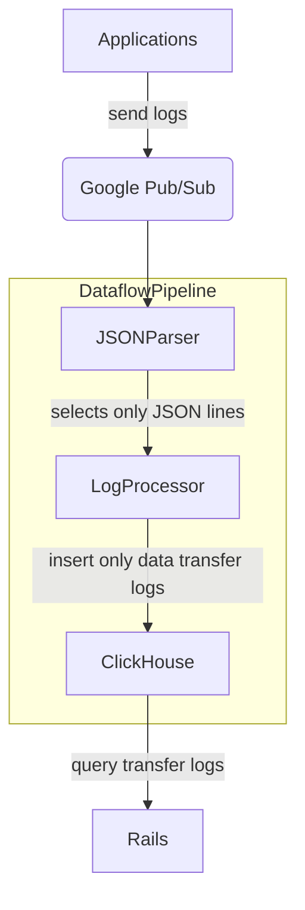




## 概要

GitLab はすでに使用量クォータの透明性をユーザーに提供しています。

現在表示しているデータ:

- 使用済みライセンスシート数
- 使用済みストレージ
- CI/CD 分数の使用状況

しかし、転送データ（アプリケーションのさまざまな部分によって発生するエグレストラフィック）を収集・提示していません。

クライアント、顧客、サービス間で転送されたバイト数のデータを収集することで、新しい効率化を発見し、運用リスクを軽減できます。私たちはアプリケーションスタック全体のデータ転送パターンをより深く理解したいと考えています。

このブループリントの目的は、成果を達成するために必要なステップを説明することです。

### 目標

アプリケーションスタック全体にわたる転送データを保存・処理・提示するためのさまざまなソリューションを検討します。

## 提案

転送データにはさまざまな種類があります。

| 種類            | 説明                                                        |
| --------------- | ----------------------------------------------------------- |
| `Repository`    | Git の `fetch` 操作（pull、clone）に関連するエグレスデータ  |
| `Artifacts`     | ダイレクトおよびプロキシ経由のエグレスによるアーティファクト転送 |
| `Pages`         | Pages のエグレス（Artifacts API に依存）                    |
| `Packages`      | パッケージレジストリのエグレス                              |
| `Registry`      | コンテナレジストリのエグレス                                |
| `Uploads`       | オブジェクトストアのエグレス                                |

各種類は異なる実装を持ち、個別に計測できますが、メタデータ／データ転送テレメトリの収集とその消費・可視化は、同一の抽象化の上に構築する必要があります。

## アーキテクチャ概要



### アプリケーション

すべてのアプリケーションは構造化形式でログを生成します。データ転送リクエストに関連するログには、転送バイト数、ルート名前空間 ID、プロジェクト ID、エグレスイベントのタイムスタンプを含むメタデータフィールドがあります。

### Google Pub/Sub

アプリケーションログは収集され、Google Pub/Sub に送信されます。Pub/Sub はトピックへのサブスクライブと受信ログの読み取りを可能にします。

### Dataflow パイプライン

[Dataflow](https://cloud.google.com/dataflow/docs/overview) は、サーバーレスで高速かつコスト効率に優れた Google Cloud の統合ストリームおよびバッチデータ処理サービスです。オープンソースの [Apache Beam](https://beam.apache.org/) プロジェクト上に構築されています。

Dataflow パイプラインは、Java、Python、または Go で記述できるデータ処理抽象化を提供します。

Dataflow パイプラインは処理ロジックのコアです。Dataflow のストリーミング実装に依存しています。パイプラインは Pub/Sub トピックをサブスクライブし、ログを読み取り・処理して ClickHouse データベースに挿入します。

### ClickHouse

ClickHouse は大量のデータセットを高速に処理するよう設計されています。顧客が動的な時間枠で集計データをクエリできるようにします。

ClickHouse はログの抽象的なストアです。Dataflow パイプラインはさまざまな入力ソースを、ClickHouse に保存するための一貫した構造に変換します。これにより、ClickHouse に保存された時系列データに影響を与えることなく、さまざまな入力とフォーマットをサポートできます。

ClickHouse テーブルスキーマ

```sql
CREATE TABLE transfer_data
(
    created_at DateTime,
    bytes UInt64,
    project_id UInt64,
    root_namespace_id UInt64,
    type String
)
ENGINE = MergeTree
PRIMARY KEY (project_id, root_namespace_id)
```

- `created_at` - イベントのタイムスタンプ
- `bytes` - 転送バイト数
- `project_id` - プロジェクト ID
- `root_namespace_id` - ルート名前空間 ID
- `type` - エグレスの種類（`git`、`container_registry` など）

### Rails

Rails アプリケーションは [ClickHouse に接続してクエリするための gem](https://docs.gitlab.com/ee/development/database/clickhouse/clickhouse_within_gitlab.html) を使用します。顧客はダッシュボードで転送データの詳細を確認できます。名前空間全体または特定のプロジェクトの転送データレポートをリクエストできます。

## 実装案

- [リポジトリエグレス](repository.md)
