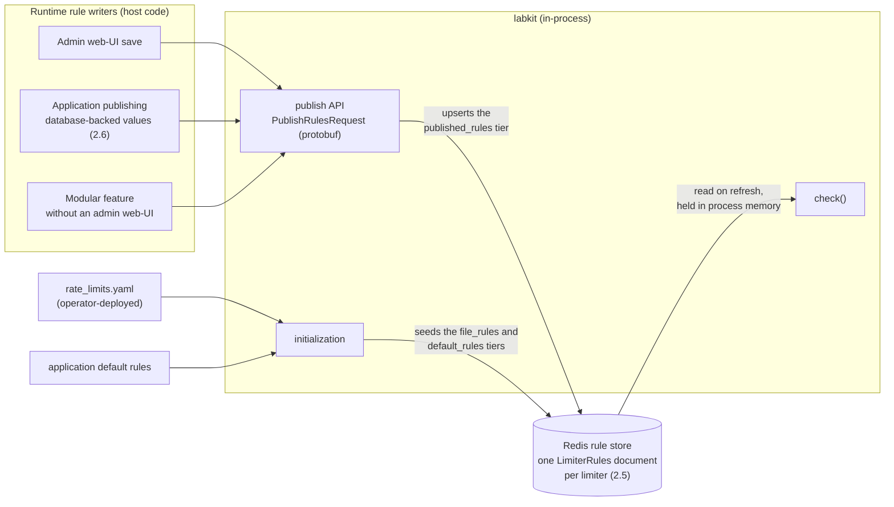

<!-- vale gitlab.FutureTense = NO -->



## 概要

GitLab のアプリケーションレベルのレート制限には、すべての実装（RackAttack、ApplicationRateLimiter、将来のサービス）で機能する単一の設定モデルが必要です。このドキュメントでは、共有 SDK として [labkit](https://gitlab.com/gitlab-org/labkit) を使用し、3 つのフェーズでそこに到達する方法を説明します。

1. 既存のレート制限（RackAttack、ApplicationRateLimiter）を、破壊的変更なしに labkit 経由にします。設定は引き続きデータベースから取得するか、アプリケーションから渡されます。
2. labkit が読み込む設定ファイルを追加します。ファイル内のルールはアプリケーションのデフォルトを上書きします。フォーマットは [LabKit 設定管理](../labkit_configuration/) の protobuf スキーマに従います。
3. 識別子に基づいて、リクエストごとにルールを返す外部サービスを追加します。これにより、顧客ごと、階層ごとのカスタマイズが可能になります。

これは [次世代レート制限アーキテクチャ](../rate_limiting/)のブループリントと、[レート制限設定の簡素化](../rate_limiting_simplification/)デザインドキュメントを土台にしています。実装は [Phase 2 エピック](https://gitlab.com/groups/gitlab-com/gl-infra/-/work_items/2021) で追跡されています。

## モチベーション

GitLab アプリケーションのレート制限は、RackAttack、ApplicationRateLimiter、いくつかの小さな実装に分散しています。それぞれが独自の設定メカニズム、独自のカウント、独自の可観測性を持っています。実際には、すべてのレート制限を同じ方法で設定できないこと、ドライランやバイパスの挙動がばらつくこと、新しいエンドポイントが制限なしでリリースされること、インシデント時に何がなぜ制限されているのかを誰もすばやく判断できないことを意味します。

[レート制限設定の簡素化](../rate_limiting_simplification/)ドキュメントでは、フェーズ化されたアプローチを説明しています。Phase 1（エッジネットワーク）は完了しています。このドキュメントでは、Phase 2（アプリケーションレベルの統一）の技術設計を扱い、Phase 3（外部化された設定と動的サービス）の概要を示します。

## Phase 1: アプリケーションレベルの統一

すべてのアプリケーションレート制限は、`labkit-ruby` の単一 API を通ります。呼び出し元（Rack ミドルウェアまたはアプリケーションコード）は識別子を構築し、一連のルールとともに labkit に渡し、結果を受け取ります。既存の設定（ApplicationSettings、環境変数、ハードコードされたデフォルト）はそのまま機能します。呼び出し元は自身の設定を解決し、それを渡します。

*可能になること:* アプリケーション全体で制限を定義し、観測する一貫した方法。ルールの追加や変更には引き続きコード変更とデプロイが必要ですが、すべての制限が同じ方法で動作し、同じ方法で計装されるようになります。古い制限は移行され、新しい制限は自動的に同じ利点を得ます。

### 1.1 labkit レート制限 API

`Labkit::RateLimit::Limiter` がメインのエントリーポイントです。レート制限チェックポイントごとに 1 つ（リクエストごとではなく起動時に）構築し、再利用します。内部の `Evaluator` はキャッシュされます。

```ruby
limiter = Labkit::RateLimit::Limiter.new(
  name: "rack_request",
  rules: [...]
)

result = limiter.check(identifier)
```

この API は 3 つの操作で構成されます。`check` はカウントして判定を返し、`peek` はカウントせずに同じ判定を返し、`clear` は 1 つの識別子に対するリミッターの状態を破棄します（[1.5](#15-action-semantics)を参照）。

`name` はすべての Redis カウンターキーの先頭に付与されるため、1 つのサービス内の異なるリミッターがカウンターを共有することはありません。リミッター名はアプリケーションごとの静的設定で、そのサービスの `available_limiters`（Phase 2）で宣言されるため、同じサービス内の 2 つのリミッターが誤って衝突することはありません。

名前はサービスをまたいで繰り返せます。`rack_request` が複数のサービスに存在しても問題ありません。各サービスは自身の Redis ストレージ（GitLab Rails の場合は専用のレート制限 Redis）でカウントするため、共有された名前が共有カウンターを意味することはありません。

### 1.2 言語 SDK

SDK は Ruby 固有ではありません。サポート対象の各言語は、同じモデルのネイティブ SDK を持ちます。リミッターを一度構築し、リクエストごとに識別子を構築し、`check` を呼び出し、結果に基づいて動作します。このドキュメントの例では簡潔さのために Ruby を使用しますが、Go API もそれに対応する必要があります。両方の SDK は同じ設定ファイル（Phase 2）を読み込み、同じ外部サービス（Phase 3）と通信するため、一度定義されたルールは、どの言語から呼び出されても同じことを行います。

<table>
<thead>
<tr><th width="50%">Ruby (<code>labkit-ruby</code>)</th><th width="50%">Go (<code>labkit/v2/ratelimit</code>)</th></tr>
</thead>
<tbody>
<tr>
<td>

```ruby
limiter = Labkit::RateLimit::Limiter.new(
  name: "rack_request",
  rules: [
    Labkit::RateLimit::Rule.new(
      name: "authenticated_api",
      characteristics: [:user],
      limit: 200,
      period_s: 60,
      action: :limit
    )
  ]
)

result = limiter.check(
  user: "user:123",
  request_type: "api"
)

case result.action
when :block then render_429
when :allow then # proceed
end
```

Ruby SDK には、アプリケーションの境界にあるミドルウェアに `429` のレンダリングを任せたい呼び出し箇所のために、例外を発生させる `check!` という便利メソッドもあります。最初の Rails イテレーションでは、呼び出し箇所側で結果とレスポンスコードを処理し（[1.6](#16-result-object) を参照）、呼び出し箇所が許すところで `check!` を採用します。

</td>
<td>

```go
limiter := ratelimit.New(ratelimit.Config{
    Name: "rack_request",
    Rules: []ratelimit.Rule{
        {
            Name:            "authenticated_api",
            Characteristics: []string{"user"},
            Limit:           200,
            Period:          60 * time.Second,
            Action:          ratelimit.ActionLimit,
        },
    },
})

result, err := limiter.Check(ctx, ratelimit.Identifier{
    "user":         "user:123",
    "request_type": "api",
})

switch result.Action {
case ratelimit.ActionBlock:
    renderTooManyRequests(w)
case ratelimit.ActionAllow:
    // proceed
}
```

</td>
</tr>
</tbody>
</table>

設定ではなくプログラムでルールを定義することは、原則ではなく例外であるべきです。ただし、このサポートは必要です。これがないと、この用途のためにデータベースに設定を持っている可能性がある Self-Managed 設定を壊してしまうためです。

### 1.3 識別子

識別子は、呼び出し元がリクエストについて知っている情報で構築するキーと値のハッシュです。リミッターごとに異なる形を持ちます。

**Rack ミドルウェア:**

```ruby
{
  request_type: "api",
  user: "user:123",        # or "<anonymous>" for unauthenticated
  ip: "203.0.113.42",
  path: "/api/v4/projects/1/merge_requests",
  namespace: 345,
  namespace_plan: "premium",
  endpoint: "GET /api/v4/:id/merge_requests"
}
```

**ApplicationRateLimiter:**

```ruby
{
  user_id: 42,
  project_id: 789,
  namespace_id: 345
}
```

`<anonymous>` は山括弧を使用するため、実際のユーザー名と衝突できません。未認証ルールは `user: "<anonymous>"` にマッチし、`[:ip]` でカウントします。認証済みルールはこの値にマッチしないため、フォールバックとして動作し、`[:user]` でカウントします。

### 1.4 ルールとマッチング

各ルールは以下を持ちます。

- **`name`** — Redis キー、ログ、メトリクスで使用される安定した識別子
- **`match`** — ルールを適用するために識別子にすべて存在している必要があるキーと値の組。等価マッチングと、`Matcher` オブジェクトを介した正規表現マッチングをサポートします（[#28855](https://gitlab.com/gitlab-com/gl-infra/production-engineering/-/work_items/28855)）。Matcher の設計では、言語をまたいで YAML を往復変換できることを保証するために、明示的な型マーカー（`{ regex: "..." }`）を使用します。
- **`characteristics`** — Redis カウンターキーの導出に使用される識別子キー。リミッター名は常に先頭に付与されます。
- **`limit`** — 閾値。静的な整数、またはデータベース由来の値のための呼び出し可能オブジェクト（チェック時に解決）にできます。
- **`period_s`** — 秒単位の時間窓。これも呼び出し可能オブジェクトにできます。
- **`action`** — ルールが何をするか。`limit`、`log`、`skip` のいずれかです（[1.5](#15-action-semantics)を参照）。
- **`ban_for_s`** — オプション。カウントするルールで、制限を超えた後にブロックを継続する時間です（[1.5](#15-action-semantics)を参照）。

### 1.5 アクションのセマンティクス {#15-action-semantics}

各ルールは、それが何をするかを説明する `action` を持ちます。呼び出し元に返される結果は、その結果、つまり呼び出し元が何をすべきかを説明します。

| ルールのアクション | 何をするか | 超過? | 結果のアクション | 終端? |
|---|---|---|---|---|
| `limit` | 制限に対してカウントする | いいえ | `allow` | いいえ — 次のルールへ継続 |
| `limit` | 制限に対してカウントする | はい | `block` | はい — 評価を停止 |
| `log` | 制限に対してカウントする（可観測性のみ） | いいえ | `allow` | いいえ — 継続 |
| `log` | 制限に対してカウントする（可観測性のみ） | はい | `allow` | いいえ — 継続 |
| `skip` | カウントしない（回避） | 該当なし | `allow` | はい — 評価を停止 |

終端アクションはルール評価を停止します。非終端アクションは次にマッチするルールへ継続します。

単一のリミッター内に複数の `:limit` ルールがある場合、リクエストを通すにはそれらすべてが成功する必要があります（例: 組織ごとの制限とユーザーごとの制限）。`:log` ルールは、その後の `:limit` ルールに影響を与えずに、低い閾値をシャドーテストできます。リストの先頭にある `:skip` ルールは回避を処理します。

ルールは順序どおりに評価されます。より具体的なルールを、より一般的なルールより前に置いてください。

#### 禁止: 時間窓より長いブロック

一部の制限では、時間窓より大きな代償を課す必要があります。繰り返される認証失敗が典型例です。1 分間に 10 回パスワードを間違えたからといって、次の 1 分間に新しい許容量を得られるべきではありません。

ルールは `limit` と `period_s` に加えて `ban_for_s` を持てます。これは独立したアクションではなく、カウントするアクションの修飾子であるため、他のすべてと同じ方法で `limit` および `log` と組み合わせられます。

| ルールのアクション | `ban_for_s` を使用する場合 | 超過? | 結果のアクション | 終端? |
|---|---|---|---|---|
| `limit` | 禁止がすでに有効でない限りカウントし、制限を超えたら禁止を開始する | はい、または禁止が有効 | `block` | はい — 評価を停止 |
| `log` | 禁止の書き込みも含め、`limit` と同じようにカウントする | はい | `allow` | いいえ — 継続 |

禁止はカウンターとは別の状態であり、独自の有効期間を持ちます。一度開始すると、カウントの時間窓が期限切れになってカウンターが消えた後も、呼び出し元は `ban_for_s` 秒間ブロックされます。これが目的です。カウンターは「直近 1 分間に何回か」に答え、禁止は「さらに次の 15 分間は利用できない」に答えます。

明記しておくべき結果が 3 つあります。

- **禁止はカウントを抑制します。** 禁止が有効な間、ルールは値を増加させずにブロックするため、呼び出し元は再試行を続けて自身の禁止を延長できず、禁止は予測可能な時刻に解除されます。
- **`reset_at` は時間窓ではなく禁止の期限を報告します。** 禁止中は、その時刻になれば呼び出し元が有効に再試行できます。
- **禁止が有効でもカウントが制限を下回ることがあります。** 時間窓が期限切れになるとカウンターは消えますが禁止は残るため、`exceeded` はカウントではなく禁止に従います。

禁止は、リミッターが保持する状態のうち、呼び出し元が早期に終了させる必要のある最初のものです。ログインが成功したら、その前の失敗を破棄するべきです。それ以外のカウンターは時間窓の期限が切れたときにのみ消えるため、SDK は `clear(identifier)` を公開します。これは、シャドー禁止を含む 1 つの識別子に対するリミッターのカウンターと禁止を破棄します。成功後に状態を消去する呼び出し元が知っているのは誰が成功したかであり、途中でどのルールにマッチしたかではないため、単一のルールではなくリミッターと識別子をスコープにします。

**シャドーは実際のカウントを行います。** `ban_for_s` を持つ `log` ルールは、`limit` 版とまったく同じようにカウントし、独自の禁止を書き込み、その禁止が有効な間はカウントを停止します。省略するのはブロックだけです。そのため、生成される数値は概算ではなく、強制時に生成されるはずの数値になります。

シャドーデータを読む際に知っておくべき相違点が 1 つあります。成功時には `clear` が呼ばれてシャドー禁止が破棄されますが、強制時には呼び出し元が拒否されるため、その成功は起こり得ません。したがって、同じ識別子の背後にいる誰かが認証に成功するとシャドー禁止は早く終了します。これは共有アドレスで特に重要です。強制時には正当なユーザーがロックアウトされますが、シャドーは静かに自身を解除します。シャドーは影響を過大ではなく過小に評価します。

### 1.6 結果オブジェクト {#16-result-object}

結果には判定と解決済みの値が含まれます。

```ruby
result = limiter.check(identifier)

result.action               # :allow or :block — what the caller should do
result.exceeded?            # whether the count exceeded the limit
result.rule                 # the most constraining evaluated Rule
result.error?               # true if Redis was unavailable (fail-open)
result.info.resolved_limit  # the resolved limit as Integer
result.info.resolved_period # the resolved period in seconds as Integer
result.info.reset_at        # when the caller may retry
```

解決済みの値は `info` 配下にあり、`skip` やエラーなど、カウンターを持たない結果では `nil` です。

`reset_at` はカウント時間窓の終了時刻ですが、禁止が有効な間は禁止の有効期限です。これは呼び出し元が待つべき時刻であり、`Retry-After` ヘッダーはこの値から構築するべきです。

呼び出し元は結果を処理する責任があります。例を示します。

```ruby
result = limiter.check(identifier)
case result.action
when :block then render_429
when :allow then # proceed
end
```

最終的には、labkit が一般的なケース向けのデフォルトハンドラーを提供するべきです。`RateLimit-*` ヘッダーを付けて 429 を返す Rack ミドルウェア、gRPC インターセプター、Sidekiq ミドルウェアなどです。これらは、エンドポイントごとの調整なしに暴走する消費を防ぐ、汎用的なリソース単位の制限（例: ユーザーごとの `db_duration_s`、ユーザーごとの Gitaly スコア）を置く自然な場所でもあります。それまでは、呼び出し元が結果を自分で処理します。

### 1.7 設定のパススルー {#17-configuration-passthrough}

Self-Managed インストールを壊すことはできません。そのため、設定は呼び出し箇所で渡されます。呼び出し元は既存のソース（ApplicationSettings、環境変数、ハードコードされたデフォルト）から制限を解決し、ルールとして labkit に渡します。

ルール上の `limit` と `period_s` は呼び出し可能オブジェクトにできます。これにより、データベース由来の設定を、ルールオブジェクトを再構築せずにチェック時に解決できます。

```ruby
Rule.new(
  name: "authenticated_api",
  limit: -> { ApplicationSetting.current.throttle_authenticated_api_requests_per_period },
  period_s: -> { ApplicationSetting.current.throttle_authenticated_api_period_in_seconds },
  characteristics: [:user],
  action: :limit
)
```

Self-Managed と GitLab.com は引き続き機能します。呼び出し可能オブジェクトはこれまでと同じ設定を読み取ります。誰かが明示的に再設定しない限り、制限は変わりません。

呼び出し可能オブジェクトは Phase 1 の互換性を確保する一時的な基盤であり、最終状態ではありません。ホットパスで labkit がホストコードを呼び出し、対応する各言語で「呼び出し可能オブジェクト」という概念を持つ必要がありますが、これは Ruby 以外へうまく移植できません。[2.6](#26-dynamic-limits)では、これを置き換えるものと既存の呼び出し可能オブジェクトを廃止する方法を説明します。

計画では、`ApplicationRateLimiter` の現在の `rate_limits` ハッシュを、唯一の信頼できる情報源としての静的な labkit `Limiter` オブジェクトに置き換えます（[#29054](https://gitlab.com/gitlab-com/gl-infra/production-engineering/-/work_items/29054)）。

最終状態では、データベースはレート制限のホットパスから外れますが、管理者用 Web UI は取り上げません。クリック操作を好む管理者はそれを維持できます。変わるのは UI の書き込み先です。リミッターがすべてのリクエストで読む `ApplicationSettings` 行ではなく、UI はルールオブジェクトを labkit に公開し、labkit はそれを Redis ルールストアに保存します（[2.4](#24-redis-backed-rules-web-ui-configuration)を参照）。GitLab.com は設定ファイルと外部サービスに依存します。Self-Managed には Redis 経由 UI の経路を提供し、既存のデータベース値を Redis ストアに移すマイグレーションを用意します。

より広い設定の進化は [#28853](https://gitlab.com/gitlab-com/gl-infra/production-engineering/-/work_items/28853) で追跡されています。

### 1.8 移行: ApplicationRateLimiter（ステージ 2a）

フィーチャーフラグの背後で、`ApplicationRateLimiter.throttled?` は内部のカウント戦略ではなく labkit の `Limiter` に委譲します。公開 API は変わりません。コントローラーとサービスはこれまでどおり `.throttled?` を呼び出し続けます。

5 〜 10 個のレート制限キーからなるコホートごとに移行します。各キーには 2 つのフィーチャーフラグを用意します。`_use_labkit_<key>`（シャドーモード）と `_<key>_enforce`（強制適用）です。強制適用に切り替える前に、シャドー検証は 24 時間で判定の相違が 0.5% 未満という条件を満たす必要があります。

- [#28808](https://gitlab.com/gitlab-com/gl-infra/production-engineering/-/work_items/28808) — 反復可能なプロセスを含む全体の移行 Issue
- [#28803](https://gitlab.com/gitlab-com/gl-infra/production-engineering/-/work_items/28803) — コホート 1（5 個のキー: `pipelines_create`、`notes_create`、`search_rate_limit`、`users_get_by_id`、`user_sign_in`）
- [#28809](https://gitlab.com/gitlab-com/gl-infra/production-engineering/-/work_items/28809) — コホート 2（残りの IncrementPerAction キー）
- [#28810](https://gitlab.com/gitlab-com/gl-infra/production-engineering/-/work_items/28810) — コホート 3（`.peek` の呼び出し元、labkit の `Limiter#peek` 待ち）
- [#28811](https://gitlab.com/gitlab-com/gl-infra/production-engineering/-/work_items/28811) — コホート 4（IncrementPerActionedResource、Set 戦略待ち）
- [#28812](https://gitlab.com/gitlab-com/gl-infra/production-engineering/-/work_items/28812) — コホート 5（IncrementResourceUsagePerAction、浮動小数点コスト戦略待ち）
- [#28876](https://gitlab.com/gitlab-com/gl-infra/production-engineering/-/work_items/28876) — ロールアウト後のフィーチャーフラグ整理
- [#29054](https://gitlab.com/gitlab-com/gl-infra/production-engineering/-/work_items/29054) — `rate_limits` ハッシュを静的な labkit リミッターオブジェクトに置き換える

### 1.9 移行: RackAttack（ステージ 2b）

新しいミドルウェアは既存の RackAttack ミドルウェアと並行して実行されます。RackAttack は強制適用を継続します。新しいミドルウェアはログモードから始めて、並行して実行されます。

リミッターは次の 2 つです。

1. **`rack_request`** — すべての一般的なレート制限（API、Web、Git、パッケージ）。認証済みと未認証の区別は、`<anonymous>` センチネルと異なる特性（`[:ip]` と `[:user]`）を使い、ルール内で処理されます。
2. **`rack_request_protected_paths`** — 保護されたパスのレート制限のみ。

これらは一般的なレート制限と重なります（保護された API パスへの POST は両方を発火します）ので、別のリミッターによる独立したカウンターが必要です。

4 つではなく 2 つのリミッターにする理由は次のとおりです。

- 認証済み／未認証の区別は特性（何でカウントするか）であり、リミッターの境界ではありません
- Git レート制限は API／Web レート制限と相互排他的です
- フィーチャーフラグが少なくなります（8 ではなく 4）
- 豊かな識別子を持つ汎用リミッターにより、後で外部設定を注入しやすくなります（[#28853](https://gitlab.com/gitlab-com/gl-infra/production-engineering/-/work_items/28853)）

[#28852](https://gitlab.com/gitlab-com/gl-infra/production-engineering/-/work_items/28852) で追跡されています。

### 1.10 可観測性

**Prometheus メトリクス** — カウンターメトリクスは、非終端ルールチェーンをカバーするために 2 つの粒度に分割されます。

| メトリクス | 型 | ラベル | 目的 |
|---|---|---|---|
| `gitlab_labkit_rate_limiter_checks_total` | カウンター | `rate_limiter`, `action`, `matched`, `error` | フェイルオープンになる呼び出しを含め、`check` の呼び出しごとに正確に 1 回増加。`action` は呼び出し元向けの判定（`allow`\|`block`）、`matched` と `error` は真偽値フラグです。カーディナリティは低く、レート制限全体の健全性を示します。 |
| `gitlab_labkit_rate_limiter_rule_evaluations_total` | カウンター | `rate_limiter`, `rule`, `action`, `result` | 評価されたルールごとに 1 回増加。非終端チェーン内のすべてのルールを捕捉します。`action` は設定されたルールアクション（`limit`\|`log`\|`skip`）、`result` は評価で決定された内容（`allow`\|`block`\|`log`\|`skip`\|`banned` — 超過した `log` ルールは `result="log"` と報告し、禁止が有効なルールはアクションにかかわらず `result="banned"` と報告するため、個別の `exceeded` ラベルは不要です）。 |
| `gitlab_labkit_rate_limiter_peeks_total` | カウンター | `rate_limiter`, `error` | フェイルオープンになる呼び出しを含め、`peek` の呼び出しごとに正確に 1 回増加。`error` は真偽値フラグです。 |
| `gitlab_labkit_rate_limiter_limit` | ゲージ (`:max`) | `rate_limiter`, `rule` | 設定された閾値。 |
| `gitlab_labkit_rate_limiter_period_seconds` | ゲージ (`:max`) | `rate_limiter`, `rule` | 設定された期間。 |

> **実装メモ:** メトリクスの分割は [#29519](https://gitlab.com/gitlab-com/gl-infra/production-engineering/-/work_items/29519)で実装され、[#29052](https://gitlab.com/gitlab-com/gl-infra/production-engineering/-/work_items/29052)の提案を改良しています。チェックごとのカウンターは、`calls_total` の形を変えたものではなく新しいメトリクス（`checks_total`）です。prometheus-client-mmap はメトリクス名ごとに 1 つのラベルシグネチャしか許可せず、旧形と新形を同時に出力できないため、新しい名前によって追加的なロールアウトを維持します。分割前のカウンターである `calls_total` と `errors_total`（[#28798](https://gitlab.com/gitlab-com/gl-infra/production-engineering/-/work_items/28798)）は、新しいカウンターとともに 1 リリースの間出力され、ランブックの移行（SLI、ダッシュボード、アラート）が完了して動作確認された後、破壊的変更を含む labkit リリースで削除されました。`peeks_total` も同じリリースで追加されました。`peek` は `checks_total` を出力しないため、`errors_total` を削除すると `peek` にエラーメトリクスがなくなるからです。`clear` は引き続きログのみです。

**追加の可観測性作業:**

- [#28799](https://gitlab.com/gitlab-com/gl-infra/production-engineering/-/work_items/28799) — 既存のリクエストごとのログメッセージにレート制限状態を含める
- [#28831](https://gitlab.com/gitlab-com/gl-infra/production-engineering/-/work_items/28831) — Rate Limiting Overview ダッシュボードを更新する
- [#28832](https://gitlab.com/gitlab-com/gl-infra/production-engineering/-/work_items/28832) — デフォルト SLI アラートのためにメトリクスカタログに登録する
- [#28807](https://gitlab.com/gitlab-com/gl-infra/production-engineering/-/work_items/28807) — 移行のための Redis クラスターの余裕を調査する
- [#28827](https://gitlab.com/gitlab-com/gl-infra/production-engineering/-/work_items/28827) — Redis 操作を単一の Lua EVAL 呼び出しに統合する

### 1.11 コストを考慮したレート制限

`GET /api/v4/user` と複雑な GraphQL クエリは同じものではありませんが、単純なリクエストカウンターはそれらを同等に扱います。`check` の `cost:` パラメーターにより、実際のリソース消費量に基づいてカウントできます:

```ruby
result = limiter.check(identifier)                         # default cost: 1
result = limiter.check(identifier, cost: db_duration_s)    # cost = actual DB time
```

Rack ミドルウェアはこれを使って、ルート名前空間ごとのデータベース時間を制限できます。各リクエストの完了後に、実際にかかったコストを加算します。

```ruby
limiter = RESOURCE_LIMITERS[:db_utilization]
result = limiter.check(
  { root_namespace: request.root_namespace, user: request.user },
  cost: request.db_duration_s
)
```

以下のようなルールを使います。

```ruby
Rule.new(
  name: "db_seconds_per_namespace",
  characteristics: [:root_namespace],
  limit: 300,      # 300 seconds of DB time per period
  period_s: 60,
  action: :limit
)
```

特性はスコープ（ユーザーごと、プロジェクトごと、名前空間ごと）を選びます。コストは何を測定するかを選びます。同じパターンは、Gitaly 呼び出し時間、オブジェクトストレージのバイト数、Sidekiq ジョブの重みにも適用できます。

作業を行う前にコストがわからない場合は、まず `peek` します。

```ruby
result = limiter.peek(identifier)
if result.action == :block
  return error("rate limited, retry after #{result.reset_at}")
end

cost = do_expensive_work

limiter.check(identifier, cost: cost)
```

これにより、追加の操作が 1 つ通る可能性があります（`peek` は「問題なし」と判定したものの、コストは想定より大きかった場合です）。その後の次のリクエストはブロックされます。

`cost:` と `ban_for_s` を組み合わせる際は注意してください。1 回の高コストな呼び出しが単独で制限を超える可能性があり、禁止が付いている場合、呼び出し元には 1 回のリクエスト拒否ではなく禁止の全期間が課されます。上記の、先に `peek` してから `check` するパターンにも同じエッジケースがあります。意図的に通す操作が禁止を開始するには十分なのです。禁止は、可変コストのリソース制限よりも、不正な資格情報など個別の失敗をカウントする場合に適しています。

内部的には、`cost:` は Lua EVAL 内で `INCRBYFLOAT` を使用します（[#28827](https://gitlab.com/gitlab-com/gl-infra/production-engineering/-/work_items/28827)）。`1` を指定した `INCRBYFLOAT` は `INCR` と同じように振る舞うため、整数コストと浮動小数点コストのために別々のカウント戦略はありません。

## Phase 2: 外部化された設定

Labkit は、アプリケーションが提供するデフォルトを上書きする設定を読み込みます。フォーマットは [LabKit 設定管理](../labkit_configuration/)デザインドキュメントに従います。protobuf スキーマが構造を定義し、YAML がシリアライズ形式になります。スキーマが共有されるため、同じファイルは `labkit-ruby`、`labkit-go`、それを消費するサービスで同じように読み込まれます。

*可能になること:* 設定を通じたルールの追加と変更。ルール変更は、アプリケーション全体のビルドとデプロイなしに展開されます。

### 2.1 2 種類の設定 {#21-two-kinds-of-configuration}

2 つの設定ドキュメントがあります。

1. **利用可能なリミッター**は運用者（Production Engineering）が所有する契約です。どのレートリミッターが存在するか、どの識別子プロパティにマッチしてカウントできるか、各リミッターがどのデフォルトルールを持って同梱されるかを一覧にします。アプリケーション開発者もこれに貢献します。自分たちのコードが公開するリミッターを宣言し、デフォルトを提案しますが、契約は運用者側でレビューされ所有されます。これはアプリケーションとともに同梱され、他のツールが読み取れます。
2. **レート制限**は、デフォルトを上書きまたは追加するルールを保持します。これはアプリケーションのリリースなしに変更できます。

Labkit はレート制限ドキュメントを利用可能なリミッターのドキュメントに対して検証します。ルールは、アプリケーションが実際に公開するプロパティにのみマッチまたはカウントでき、存在するリミッターのみを対象にできます。

レート制限ドキュメントは 2 つのレベルで書かれます。運用者はグローバルルールを設定します。すべてのリクエストに適用されるデフォルトと、プラットフォーム全体の保護です。これらのデフォルトルールは、アプリケーション間で共有されるリミッター（Rack ミドルウェア、gRPC インターセプターなど）向けに定義されます。

サービス所有者は、自分たちがオンコールで担当するサービスの制限を上げ下げするために、リミッターにスコープを絞ったルールを追加します。チームは自身のサービスの制限を管理する自由を持ちます。Infrastructure は、共有 Redis や下流サービスへの圧力増加など、横断的な影響がある変更に意見を出します。

チームが自由にできないことの 1 つはリミッターの回避です。Phase 1 では既存の回避を維持する必要があるため、フレームワークは `skip` ルールを許可しますが、回避はそれを追加するチーム以外にも影響します。`skip` ルールを追加できる人にガードレールを設け、無チェックで導入されないようにします。そのガードレールがどういう形になるか（レビュー、許可リスト、検証ステップ）は、実装時の判断です。

### 2.2 利用可能なリミッター {#22-available-limiters}

このドキュメントは、各リミッターが何をいつ適用するか、デフォルトルールは何かを宣言します。

```yaml
# available_limiters.yaml — shipped with the application
available_limiters:
  pipelines_create:
    description: "Rate limit enforced before a pipeline is allowed to be created"
    available_properties: # values the identifier can carry, usable in match/characteristics
      - project_path
      - username
      - root_namespace_path
      - root_namespace_plan
      - sha
    default_rules: # optional: documents the in-application defaults
      - name: limit_pipelines_created_by_project_user_sha
        characteristics: [username, project_path, sha]
        limit: 10
        period_s: 60
        action: limit
  user_sign_in:
    description: "Enforced before a session is created for a specific user"
    available_properties:
      - ip
      - username
    default_rules:
      - name: limit_user_sign_ins_by_username
        characteristics: [username]
        limit: 5
        period_s: 600
        action: limit
        ban_for_s: 900      # the shipped default is itself a ban
  rack_request:
    description: "Enforced in the Rack middleware, for every web, API and Git request"
    available_properties:
      - ip
      - path
      - request_type
    default_rules:
      - name: limit_sign_in_attempts_by_ip
        characteristics: [ip]
        limit: 20
        period_s: 60
        action: limit
        match:
          path: /users/sign_in
      - name: limit_rack_requests_by_ip # no match: every request the middleware sees
        characteristics: [ip]
        limit: 1000
        period_s: 60
        action: limit
```

`default_rules` は、アプリケーションがデフォルトで適用する内容を文書化します。各ルールのスキーマは、下記のレート制限ルールのフィールドのサブセットで、`match` も含まれます。`match` のないデフォルトルールは、そのリミッターが受け取るすべてのリクエストに適用されます。`user_sign_in` のように単一のチェックポイントを保護するリミッターでは、それで十分です。汎用リミッターには、さらに設定が必要です。`rack_request` はサービスが処理するすべてのリクエストを受け取るため、単一の包括的な数値は適切なデフォルトではありません。それぞれのデフォルトルールには、対象となるトラフィックにスコープを絞るための `match` があり、すべてのリクエストに対する制限よりも `/users/sign_in` に厳しい制限を設けます。

`name` はルールの識別子であるため必須です。labkit はこれを Redis カウンターキーのセグメントとして使用し、同じ名前を再利用するより優先順位の高いルールが、このルールを置き換えます（[2.5](#25-rule-sources-and-precedence)）。ルールの名前を変更するとカウンターは放棄されます。また、この名前が上書きの対象になります。

Labkit に汎用リミッターを実装する際、これらのデフォルト設定は copier テンプレートに置けます。そのため変更時には、利用する各サービスが次に `copier update` したときに更新する [copier マイグレーション](https://copier.readthedocs.io) を提供します。Rack ミドルウェアや gRPC インターセプター内のような新しい共有リミッターは、各サービスが個別に書くのではなくテンプレートからデフォルトを取得し、そのデフォルトへの後続変更も同じ方法で展開されます。`rate_limits` ファイルもテンプレートから生成されます。

以下は対応する protobuf です。検証ルールはスキーマにありますが、例を読みやすく保つため、ここでは 2 つだけ追加しています。これらの `.proto` ファイルは [`labkit-spec`](https://gitlab.com/gitlab-org/quality/tooling/labkit-spec/) に置かれます。

```proto
edition = "2026";
package gitlab.ratelimit.config.v1;

import "buf/validate/validate.proto";

message AvailableLimiters {
  map<string, LimiterSpec> available_limiters = 1
    [(buf.validate.field).map.min_pairs = 1];
}

message LimiterSpec {
  string description = 1 [(buf.validate.field).string.min_len = 1];
  repeated string available_properties = 2;
  repeated DefaultRule default_rules = 3;
}

message DefaultRule {
  repeated string characteristics = 1;
  uint32 limit = 2;
  uint32 period_s = 3;                   // seconds
  Action action = 4;
  optional uint32 ban_for_s = 5;         // see 1.5; the default itself may be a ban
  string name = 6 [(buf.validate.field).string.pattern = "^[a-z0-9_]{1,64}$"];
  map<string, MatchValue> match = 7;     // optional; empty matches every request
}

enum Action {
  ACTION_UNSPECIFIED = 0;
  ACTION_LIMIT = 1;
  ACTION_LOG = 2;
  ACTION_SKIP = 3;
}
```

### 2.3 レート制限 {#23-rate-limits}

運用者とサービス所有者はここでルールを設定します。各ルールは、適用先のリミッター、対象リクエストを選択する `match`、実行するアクションを指定します。

```yaml
# rate_limits.yaml — global rules from operators, service-scoped rules from service owners
rate_limits:
  pipelines_create:
    - name: pipelines_create_free_plan
      description: "pipelines per project per 10 minutes for free users"
      limit: 100
      period_s: 600
      action: limit
      characteristics: [project_path]
      match:
        root_namespace_plan: free
    - name: pipelines_create_ultimate_plan
      description: "pipelines per project per 10 minutes for ultimate users"
      limit: 1000
      period_s: 600
      action: limit
      characteristics: [project_path]
      match:
        root_namespace_plan: ultimate
    - name: pipelines_create_per_user_hourly
      description: "limit pipelines a single user can create per hour"
      limit: 60
      period_s: 3600
      action: limit
      characteristics: [username]
      match: {}
    - name: pipelines_create_skip_app_defaults
      description: "skip any application-defined rules"
      action: skip
      match: {}
  user_sign_in:
    - name: user_sign_in_distinct_users_per_ip
      description: "distinct users attempting to sign in from a single IP"
      limit: 10
      period_s: 3600
      characteristics: [ip]
      count_distinct: username
      match: {}
    - name: user_sign_in_ban_ip_after_failures
      description: "ban an IP for 15 minutes after 10 failed sign-ins in a minute"
      limit: 10
      period_s: 60
      ban_for_s: 900
      action: limit
      characteristics: [ip]
      match: {}
```

ファイル内のルールは、アプリケーションが提供するルールより**前**に評価されます。末尾の終端 `skip` ルール（`match: {}` ですべてにマッチ）と組み合わせると、このファイルをリミッターの唯一の信頼できる情報源にできます。その `skip` に到達したリクエストは、アプリケーションのデフォルトを完全に回避します。Phase 3 では、外部サービスから返されるルールがファイルのルールより前に来ます。

`name` はリミッター内で一意でなければなりません。アプリケーションがすでに定義しているルールと同じ名前を付けると、ルールを追加するのではなく*置き換え*ます。2 つの結果は、選ぶ名前によってのみ区別されます（[2.5](#25-rule-sources-and-precedence)）。上記のルールはすべて新しい名前を使用するため、アプリケーションが提供するものに階層として追加されます。

必須フィールドは `action` によって異なります。`limit`/`log` ルールには `limit` と `period_s` が必要で、`skip` ルールにはどちらも必要ありません。`ban_for_s` は前者 2 つでは任意で、後者では拒否されます。protobuf の 1 つの CEL 制約がこれを強制します。

```proto
message RateLimits {
  map<string, RuleList> rate_limits = 1;
}

message RuleList {
  repeated Rule rules = 1;
}

message Rule {
  string description = 1;
  Action action = 2 [(buf.validate.field).required = true];
  repeated string characteristics = 3;
  map<string, MatchValue> match = 4;     // equality or { regex: "..." } markers
  optional uint32 limit = 5;
  optional uint32 period_s = 6;          // seconds
  string count_distinct = 7;             // count unique values of this property
  optional uint32 ban_for_s = 8;         // keep blocking this long once the limit is crossed

  // Rule identity: part of the Redis counter key, and what an override targets.
  string name = 9 [(buf.validate.field).string.pattern = "^[a-z0-9_]{1,64}$"];

  // limit and period_s are required unless the rule only skips (ACTION_SKIP = 3).
  option (buf.validate.message).cel = {
    id: "limit_requires_threshold"
    message: "limit and log rules require limit and period_s"
    expression: "this.action == 3 || (has(this.limit) && has(this.period_s))"
  };

  // Banning on a distinct-value counter is not defined, so the two do not mix.
  option (buf.validate.message).cel = {
    id: "ban_excludes_count_distinct"
    message: "ban_for_s cannot be combined with count_distinct"
    expression: "!has(this.ban_for_s) || this.count_distinct == ''"
  };

  // ban_for_s needs a limit to cross, so it is not valid on skip rules.
  option (buf.validate.message).cel = {
    id: "ban_requires_threshold"
    message: "ban_for_s is not valid on skip rules"
    expression: "!has(this.ban_for_s) || this.action != 3"
  };
}
```

`match` の値は labkit の `Matcher` オブジェクトと同じ明示的な型マーカーを使用するため、等価マッチングと正規表現マッチングは YAML と両 SDK をまたいで往復変換できます:

```yaml
match:
  root_namespace_plan: free                  # equality
  path:
    regex: "^/api/v\\d+/projects"            # regex
```

上記の `rate_limits.yaml` が読み込まれると、プランごとの `pipelines_create` ルールはアプリケーションのデフォルトルールより前に評価されます。Free プランのプロジェクトは 10 分あたり 100、Ultimate は 10 分あたり 1000 になります。末尾の `skip` により、ファイルが存在する場合はアプリケーションデフォルトが適用されないことが保証されます。

### 2.4 Redis ベースのルール（Web UI 設定） {#24-redis-backed-rules-web-ui-configuration}

Self-Managed の一部の管理者は、ディスク上のファイルではなく管理者用 Web UI からレート制限を編集し続けたいと考えています。データベースをホットパスに戻さずに、それをサポートできます。[2.3](#23-rate-limits) と同じルールスキーマを使用して、UI 管理のルールを Redis に保存します。

UI は Redis と直接やり取りしません。UI は [2.6](#26-dynamic-limits) で定義する公開用 protobuf を labkit に渡し、labkit がそれをルールストア内のリミッターごとのキー（[2.5](#25-rule-sources-and-precedence)）へシリアライズします。これは labkit がカウンターにすでに使用している同じ Redis インスタンスです。

Labkit はチェックごとにそのキーを読みません。ルールは人間の時間尺度（管理者がフォームを保存する、運用者がファイルをデプロイする）で変わるため、リクエストごとに読むと何時間も前に最後に変わったことを学び直すために往復処理を費やします。各プロセスはデシリアライズされた文書をメモリに保持し、複製が短い間隔より古くなると更新します。これはリクエストごとではなく、間隔ごとにリミッターごと・プロセスごとに 1 回の読み取りです。

管理者用 Web UI は複数ある書き込み元の 1 つであり、特権を持つものではありません。すべての書き込み元が同じ labkit の公開 API を通り、Redis キーに触れるのは labkit だけです。



管理者用 Web UI を持たない新しいモジュール式の機能も、UI と同じ方法でこれを使用します。設定モデルのコールバック、バックグラウンドジョブ、マイグレーションなど、設定が変わる場所から公開 API を呼び出します。[2.6](#26-dynamic-limits) は、ホストのためにこれをまとめる `register`/`publish_all!` パターンを定義します。実行時の設定がまったくない機能は何も公開しません。デフォルトを同梱し、運用者は引き続き設定ファイルから上書きできます（[2.3](#23-rate-limits)）。

これらのルールはアプリケーションデフォルトの上に積み重なるのではなく、それを置き換えます。アプリケーションデフォルトと名前を共有する公開済みルールはそれを上書きし、誰もルールを公開していないリミッターはデフォルトを維持します。いずれも [2.5](#25-rule-sources-and-precedence) の階層の順序を通じて行われます。すべてのリミッターはアプリケーションから設定可能なままで、何も設定されていない場合はデフォルトがフォールバックです。

レートリミッターを完全に無効化するには、デフォルトより優先順位の高い階層に `skip` ルールを追加できます。

これは Phase 3 外部サービスのローカル版です。同じ「このリクエストのルールを返す」という考え方を、リモートサービスではなく Redis キーをバックエンドとして実現します。Self-Managed に提供したいものですが、Phase 3 をブロックするものではなく、両者は独立してリリースできます。

**データベースからの移行。** 運用者はすでに設定済みの制限を再入力する必要があるべきではありません。ロールアウト時のバックフィルはスキーママイグレーションではなく、冪等な `publish_all!` 照合ジョブ（[2.6](#26-dynamic-limits)）の最初の実行です。これは登録済みの `ApplicationSetting` 由来の値をすべて読み取り、それぞれを `Rule` に変換して同じ契約から公開します。Redis に書き込むマイグレーションは、失敗が Postgres とトランザクション処理されず、ロールバックもできないアップグレード経路に Redis を置くことになります。リミッターの値がストアに入ると、そのリミッターの [1.7](#17-configuration-passthrough) の呼び出し元にある呼び出し可能オブジェクトは廃止でき、ストアが値を最新に保ちます（[2.6](#26-dynamic-limits)）。

### 2.5 ルールソースと優先順位 {#25-rule-sources-and-precedence}

ルールは 4 か所で生成されます。アプリケーションがデフォルトを同梱し、運用者が設定ファイルをデプロイし、管理者 UI が変更を保存し、（Phase 3 では）リモートサービスがリクエストごとにルールを返します。Phase 3 のサービスだけはチェック時に別途照会されます（[3.1](#31-service-design)）。それ以外はすべて 1 つの実行時ストアに集約されます。labkit は Redis からルールを読み、他の仕組みはすべてそのストアへの*書き込み元*です。

- **初期化時**に、labkit は設定ファイル（存在する場合）とアプリケーションデフォルトをストアに読み込みます。
- **実行時**に、ホストは labkit の公開 API を呼び出します。管理者 UI（[2.4](#24-redis-backed-rules-web-ui-configuration)）とデータベース由来の値を公開するアプリケーション（[2.6](#26-dynamic-limits)）は同じ呼び出しです。

公開契約は [2.6](#26-dynamic-limits) で定義する protobuf メッセージです。Redis 自体が API になることはありません。キーの配置は labkit の非公開の実装詳細であり、キーに書き込むのは labkit だけです。Labkit は文書を持つリミッターのインデックスも保持するため、ストアを列挙し、アプリケーションから削除されたリミッターをガベージコレクションできます（[2.6](#26-dynamic-limits)）。

優先順位は、ルールを読み込んだコード経路ではなく、ルールが保存された文書のどこにあるかで決まります。リミッターごとの値は階層ごとに 1 つのスロットを保持し、書き込み元は自身の階層のみを置き換えます。

```proto
// The per-limiter document labkit keeps in the rule store.
message LimiterRules {
  RuleList file_rules = 1;       // init: from rate_limits.yaml
  RuleList published_rules = 2;  // runtime: via the publish API
  RuleList default_rules = 3;    // init: from the application defaults
}
```

```plaintext
┌─────────────────────────────────┐
│ file_rules (highest)            │  ← Written at init from the YAML config file
├─────────────────────────────────┤
│ published_rules                 │  ← Admin web-UI, or published by the app (2.6)
├─────────────────────────────────┤
│ default_rules (fallback)        │  ← Written at init from the application
└─────────────────────────────────┘
```

チェック時、labkit は [2.4](#24-redis-backed-rules-web-ui-configuration) で説明するプロセス内の複製からリミッターの文書を取得します。これは短い間隔で Redis から更新され、リクエストごとには読み取られません。labkit は階層を順に連結するため、上位階層のルールが先に評価されます。

2 つの階層が同じ `name` のルールを提供する場合、上位の階層が優先され、もう一方は除外されます。名前は Redis カウンターキーの一部であるため、上書きしたルールはそのカウンターを継承します。制限を下げても、すでにリクエストがカウントされた時間窓はリセットされません。異なる名前で公開されたルールは、下位階層のルールを置き換えるのではなく、そのルールと並んで追加されます。

各書き込み元は 1 つの階層を所有するため、書き込みは互いを上書きできません。起動時には、UI またはアプリケーションが公開したものに触れずに、ファイルとデフォルトの階層を再投入します。UI での保存は、運用者のファイルルールを置き換えられません。公開済みの階層内では、公開時にルールの `name` ごとに追加または更新します。ルールの削除は、後の公開で省略するのではなく明示的な操作です。

更新が失敗した場合、labkit は何も提供しないのではなく、更新期限を過ぎてもすでに持っている複製を提供し続けます。何も提供しなければ、設定済みのすべてのルールがなくなり、短い Redis 障害が全フリートにわたる静かな制限変更になります。一度も読み取りに成功していないプロセス（Redis が停止中に起動した場合）、または文書のないリミッター（[2.6](#26-dynamic-limits) の照合ジョブが再投入する前にストアがフラッシュされた場合）は、プロセスにコンパイル済みのアプリケーションデフォルトにフォールバックします。

つまり、次のようになります。

- GitLab.com は、アプリケーションデフォルトを上書きするプラットフォームレベルのルール（設定ファイル由来）を持てます
- Self-Managed 管理者は Web UI からルールを管理できます。それらのルールは、対象リミッターについてアプリケーションデフォルトを置き換えます
- ファイルをデプロイせず何も公開しない Self-Managed インストールはアプリケーションデフォルトを維持するため、挙動は変わりません
- リクエストにマッチするプラットフォームルールはデフォルトより優先され、コード変更なしに顧客ごと、階層ごとの上書きが可能になります
- より具体的なサービス所有者のルールは運用者のグローバルルールより前に並ぶため、チームはグローバルデフォルトに触れずに自分たちのサービスの制限をチューニングできます
- `skip` ルールは上位階層が下位階層を回避できるようにします。そのため、これを追加することにはガードレールが適用されます（[2.1](#21-two-kinds-of-configuration) を参照）

### 2.6 動的な制限 {#26-dynamic-limits}

静的な YAML ファイルは数値を保持できます。「300、ただし管理者が変更した場合を除く」は保持できません。モノリスの制限の大部分はまさにこれです。labkit のレート制限レジストリにある 140 ルールのうち 61 は、均一な形で `ApplicationSetting` カラムから制限を解決します。

```ruby
limit: -> { Gitlab::CurrentSettings.current_application_settings.autocomplete_users_limit }
```

Labkit は現在、呼び出し可能オブジェクトを受け入れ、チェックごとにそれを呼び出すことでこれをサポートしています（[1.7](#17-configuration-passthrough)）。これは機能しますが、他の labkit 実装やモノリス以外の形をしたアプリケーションにはスケールしません。

1. **Ruby の形をしています。** `labkit-ruby` はダックタイピングによりこれらを解決します。値が `call` に応答するかを確認します。Go には引数数の内省がないため、同等の機能は言語ごとに異なる API になります。
2. **ホストの形を仮定します。** モノリスは最初の利用者であり、唯一ではありません。`CurrentSettings` やデータベースカラムの名前付きレジストリを切り出すものは、次の利用者が使用できない仕組みです。

設定が変わると、アプリケーションは数値を解決してルールを公開します。Labkit はすでに持っているストアから通常の整数を読み、それらがどこから来たかを知りません。ホストが送るものはすべて protobuf で定義され、labkit が保存します。同じバイト列はすべての SDK で同じ意味を持ちます。

```proto
message PublishRulesRequest {
  map<string, RuleList> rate_limits = 1 [
    (buf.validate.field).map.keys.string.pattern = "^[a-z0-9_]{1,64}$"
  ];
}
```

ペイロードをリミッターからルールへのマップとして保持することで、単一の変更とフリート全体の `publish_all!` は、エントリが 1 つか 61 かの同じメッセージになります。バッチに*含まれない*リミッターは消去されず、そのままです。[2.5](#25-rule-sources-and-precedence) の削除は省略ではなく明示的であるというルールは、リミッターのレベルにも適用されます。そうでない場合、起動時の `publish_all!` は、アプリケーションが登録しないリミッターのために管理者 UI（[2.4](#24-redis-backed-rules-web-ui-configuration)）が公開したすべてのルールを消去します。Labkit はバッチを 1 つの操作として適用し、その背後にあるリミッターごとのキー配置は labkit の非公開の実装詳細のままです。

Ruby では、`Labkit::RateLimit::Rule` とリクエストは生成された protobuf クラスなので、メッセージの構築は通常のホストコードのように見えます。

```ruby
class ApplicationSetting < ApplicationRecord
  after_commit :publish_rate_limits

  def publish_rate_limits
    Labkit::RateLimit.rule_store.publish(
      Labkit::RateLimit::PublishRulesRequest.new(
        rate_limits: {
          "autocomplete_users" => Labkit::RateLimit::RuleList.new(rules: [
            Labkit::RateLimit::Rule.new(
              name: "limit_user_autocompletes_by_user",
              characteristics: [:user],
              limit: autocomplete_users_limit,
              period_s: 60,
              action: :limit
            )
          ])
        }
      )
    )
  end
end
```

公開済みルールはアプリケーションデフォルトと同じルール名を再利用するため、[2.5](#25-rule-sources-and-precedence) の上書き動作を通じてそのデフォルトの位置を引き継ぎ、呼び出し可能オブジェクトには到達できなくなります。これが 61 個の呼び出し可能オブジェクトの廃止経路です。公開し、検証し、次にラムダを削除します。

**書き込まれるもの。** リミッターごとに 1 つの Redis キーがあり、[2.5](#25-rule-sources-and-precedence) の `LimiterRules` 文書のみを保持します。リミッター名がキーです。上記の公開により、文書の公開済み階層にデータが追加または更新されます。

```yaml
# key:  labkit:ratelimit:rules:autocomplete_users <= this is the limiter name
# the stored LimiterRules document, shown as YAML for readability
default_rules:                                   # seeded at init from the application
  rules:
    - name: limit_user_autocompletes_by_user
      characteristics: [user]
      limit: 300
      period_s: 60
      action: limit
      match: {}
published_rules:                                 # written by the publish above
  rules:
    - name: limit_user_autocompletes_by_user     # same name → shadows the default
      characteristics: [user]
      limit: 25
      period_s: 60
      action: limit
      match: {}
```

機械が書き込み、機械が読むため JSON として保存されます。

```json
{"default_rules":{"rules":[{"name":"limit_user_autocompletes_by_user","limit":300,"period_s":60,"action":"limit","characteristics":["user"],"match":{}}]},"published_rules":{"rules":[{"name":"limit_user_autocompletes_by_user","limit":25,"period_s":60,"action":"limit","characteristics":["user"],"match":{}}]}}
```

設定ファイル、公開ペイロード、保存された文書は、1 つのスキーマをシリアライズしたものです。ファイルと `PublishRulesRequest` はどちらもリミッターからルールへのマップであり、`LimiterRules` の各階層は正確に `RuleList` です。新しいメッセージは保存されたエンベロープだけで、`Rule` 自体は共有されます。これにより、管理者 UI が書き込んだルール、アプリケーションが公開したルール、ファイルでデプロイされたルールはすべて、各 SDK の 1 つのコード経路を通じてデシリアライズされます。

**リミッターの廃止。** ルールキーには有効期限がないため、アプリケーションから削除されたリミッターは文書を永久に残します。そのため Labkit は、文書自体と同じ操作で書き込まれる、文書を持つリミッター名のインデックスを保持します。

起動時に labkit は、そのインデックスと `available_limiters.yaml`（[2.2](#22-available-limiters)）の差分を求めます。これはアプリケーションが持つものの正式な一覧であり、比較の唯一の正しい基準です。labkit が初期化時に投入したものは基準になりません。そこでは `default_rules` は任意のため、デフォルトを同梱せずファイルルールもないリミッターには初期データがない一方、管理者 UI が公開した文書は存在する可能性があります。

文書を削除すると回復不能な設定が破壊されるため、スイープは意図的に慎重に実行します。

- リミッター一覧が存在しないか読み取れない場合、GC はまったく実行されません。
- 孤立エントリには初回検出時のタイムスタンプが記録され、デプロイとロールバックを合わせた期間より長い時間窓の後にのみスイープされます。

**各利用者ではなく Labkit が公開を担います。** ホストが委譲できないのは対応付けです。Labkit には、`autocomplete_users_limit` が特定ルールの制限であることを知る方法がありません。そのためホストがそれを一度宣言し、labkit が残りを行います。

```ruby
Labkit::RateLimit.publisher.register(
  limiter: "autocomplete_users",
  name: "limit_user_autocompletes_by_user",
  characteristics: [:user],
  period_s: 60,
  action: :limit,
  limit: -> { ApplicationSetting.current.autocomplete_users_limit }
)

Labkit::RateLimit.publisher.publish_all!
```

`publish_all!` は冪等に実装するべきです。

**このコスト:**

- **ホストは公開のトリガーを覚えておく必要があります。** モデルのコールバックは一括更新や直接 SQL で見落としやすいため、`publish_all!` を呼び出す定期的な照合ジョブは書き込みフックの代わりではなく、それと並べて配置します。その最初の実行は [2.4](#24-redis-backed-rules-web-ui-configuration) で説明したロールアウト時のバックフィルでもあります。運用者はすでに設定した制限を再入力せずに維持できます。
- **アプリケーション設定は永続的なレコードのままです。** 照合ジョブは、labkit がチェック時に呼び出し可能オブジェクトを決して呼び出さなくても、実行ごとに登録済みの呼び出し可能オブジェクトを解決します。これによりフラッシュされたストアが再投入され、このフェーズは Postgres をシステムからではなくホットパスから外します（[2.4](#24-redis-backed-rules-web-ui-configuration)）。
- **Redis キーは設定を保持するため有効期限を持ちません。** 有効期限のあるルールキーは、制限が変わったと示すログを何も残さず、リミッターをアプリケーションデフォルトに静かに戻します。これはレート制限用 Redis がキャッシュではなく永続ストアとして運用されるため機能します。文書のプロセスローカルな複製は期限切れになりますが（[2.4](#24-redis-backed-rules-web-ui-configuration)）、そこでの有効期限は再読み取りの契機になるだけです。消えてはならないのは保存された文書です。

### 2.7 デプロイ

- **Self-Managed:** 設定ファイルは任意です。存在しない場合、既存の挙動は変わりません。管理者はカスタムレート制限のために設定ファイルを提供するか、Web UI からルールを管理できます（Redis に保存）。
- **GitLab.com:** 設定ファイルは Helm チャートまたは運用設定経由でデプロイされます。プラットフォームレベルのルールは Production Engineering が管理します。
- **Dedicated:** 設定ファイルは Dedicated 運用者が管理します。ファイル経由のテナントごとのカスタマイズは技術的には可能ですが、推奨されません。
- **Cells:** 個別の設定ファイルによる Cell ごとの設定が可能です。

### 2.8 GitLab モノリスのフロー

- レート制限機能の Phase 2 の最初の利用者であり、私たちの最初の実装でもあるのは、すでに含まれている `labkit-ruby` 依存関係を介した GitLab Rails モノリスです。
- `protos` には、利用可能なリミッターとレート制限の両方に対する protobuf 定義が含まれます。これが定義の唯一の信頼できる情報源です。
  - `protos` には `buf generate` を実行し、その後に下流の labkit ライブラリで MR を開く新しいスクリプトがあります。
  - GitLab モノリスには、新しい protobuf 定義をモノリスの `available_limiters.yaml` に対して確認する CI ジョブがあります。**無効な場合は CI が失敗し、マージがブロックされます。**
    - YAML の形式は正しいか。
    - `protovalidate` に対して有効か。**Ruby は現在これをサポートしていないため、スキップする必要がある可能性があります。**
  - `rate_limits.yaml` はアプリケーション内には保存されず、Helm または同様のものを介して `ConfigMap` で注入される可能性が高いです。*(GitLab モノリスのソース管理にはありません。)*
    - GitLab.com では、これを `gl-infra/{somewhere}` に保存し、Helm でデプロイできます。
    - Omnibus Self-Managed インストールでは、存在しない場合に無視される任意の設定ファイルです。例となる `rate_limits.example.yaml` と使用方法の手順を同梱します。
- すべての言語の `labkit` には、宣言された `rate_limits.yaml` ファイルがアプリケーションの `available_limiters.yaml` ファイルに対して有効かどうかを実行時に確認する、新しい検証スクリプトが必要です。

#### 2.8.1 生成と公開

```text
protos (or labkit-spec?)  (single source of truth)
|
+-- rate_limit/proto/gitlab/ratelimit/config/v1/config.proto [maybe we split this in to two?]
|                                                    
+-- cmd/<cli>        [PROPOSED]  generate + open MRs, mirrors `labkit fields`
        |
        |   buf generate  ->  open MRs
        |
        +------------------>  gitlab-org/labkit    (Go)
        |
        +------------------>  labkit-ruby          (Ruby)

```

#### 2.8.2 検証

```text
    available_limiters.yaml                   rate_limits.yaml
    ships WITH the application                deployed via Helm / ops config
    operators own, app devs contribute        changes with NO app release (redeploy probably necessary)
             |                                         |
             v                                         |
 +=====================================+               |   never passes
 |  APP CI                             |               |   through app CI
 |  Go binary, language-agnostic       |               |
 |   * YAML well-formed?               |               |
 |   * protojson parse   (structural)  |               |
 |   * protovalidate     (rules + CEL) |               |
 |                                     |               |
 |   FAIL -> red pipeline              |               |
 +=====================================+               |
             |                                         |
             |   publish available_limiters as an      |
             |   artifact -> the pipeline holding      |
             |   rate_limits.yaml can fetch it and     |
             |   run the cross-document check here     |
             |                                         |
             +------------------+----------------------+
                                |
                                v
    +---------------------------------------------------------+
    |  RUNTIME  -  labkit, in-process                         |
    |                                Go app      Ruby app     |
    |                                                         |
    |  1. YAML -> proto                ok          ok         |
    |  2. protovalidate rules          ok          CEL FAILS  |
    |                                              OPEN       |
    |  3. cross-document check       labkit       labkit      |
    |     rules may only reference limiters and               |
    |     available_properties the app exposes                |
    |     -> NOT expressible in protovalidate,                |
    |        hand-written in each SDK                         |
    |                                                         |
    |  violation -> raise -> catch -> log                     |
    +---------------------------------------------------------+
                                ^
                                |
     same rule schema feeds in:   Redis web-UI rules (2.4)
                                  Phase 3 external service
```

## Phase 3: 動的外部サービス

外部サービスは、リクエスト識別子に基づいてレート制限ルールを動的に提供します。これにより、それぞれのケースに静的な設定ファイルを維持せずに、顧客ごと、階層ごと、名前空間ごとのカスタマイズを実現できます。

*可能になること:* 顧客ごとに異なるルールと、デプロイなしのほぼ即時の変更の展開。

### 3.1 サービス設計 {#31-service-design}

サービスは Phase 1 の識別子を受け取り、そのリクエストのルールを返します。これらはローカルルールストアのすべての階層より前に評価されます（[2.5](#25-rule-sources-and-precedence)）。

```plaintext
┌─────────────────────────────────────┐
│ External service rules (highest)    │  ← Dynamic, per-request
├─────────────────────────────────────┤
│ Redis rule store (one doc/limiter)  │
│   file_rules                        │  ← Written at init from the config file
│   published_rules                   │  ← Admin web-UI / published by the app
│   default_rules (fallback)          │  ← Written at init from the application
└─────────────────────────────────────┘
```

サービスはレートリミッター名と識別子を受け取ります。この 2 つにより、サービスが判断に必要とするすべての情報、つまりレート制限チェックポイント、リクエストタイプ、ユーザー、名前空間、プラン、エンドポイントが渡されます。

サービスはリミッター名をキーにするため、同じ名前が異なるサービスでは異なる意味を持つことを考慮する必要があります。これは、`rack_request` が意図的にあらゆる場所で再利用される汎用リミッター（Rack ミドルウェア、gRPC インターセプター）で特に重要です。サービスは、呼び出し元サービスとリミッター名の両方でルールのスコープを絞るため、あるサービス向けの動的ルールが、たまたま同じ名前を共有する別のサービスに漏れることはありません。

### 3.2 機能

名前空間ごと、プランごとの閾値は、設定ファイル（`namespace_plan` や `root_namespace` にマッチするルール）を通じて Phase 2 ですでに可能です。外部サービスは、静的設定では提供できない機能を追加します。

- 現在の負荷や不正利用パターンに基づく動的な調整
- GitLab 外で管理される契約や利用資格に結び付いた顧客ごとの制限
- 設定ファイルを再デプロイせずに変更されるルール
- Terraform 経由で設定でき、アプリケーションのレート制限を Cloudflare や他のエッジルールと同じリポジトリに保持できること

### 3.3 フェイルオープンとキャッシュ

サービスに到達できない場合、labkit はローカルルールストアにフォールバックします。ファイル階層、次に公開済み階層、次にアプリケーションデフォルトの順です（フェイルオープン）。識別子ごと、名前空間ごと、プランごとにキャッシュすることで、リクエストごとのオーバーヘッドを減らします。

ルールはメモリにキャッシュされるため、変更は実行された瞬間ではなくキャッシュ期間内に伝播します。その期間が、新しいルールの展開速度の実質的な上限です。何時間ではなく、数分です。正確な値は実装時のチューニングで決定します。

ローカルルールストアもメモリにキャッシュされます（[2.4](#24-redis-backed-rules-web-ui-configuration)）。異なるのは粒度です。サービスキャッシュはリクエストの形（識別子ごと、名前空間ごと、プランごと）をキーにするため、プロセスが見たすべての形に対するエントリを保持します。ローカルストアはリミッターごとに 1 文書で、タイマーで更新されるプロセスごとの少数のエントリです。どちらも即時ではありませんが、ローカルの間隔はより短く固定されているため、緊急の変更はサービスではなくファイルまたは公開に属します。

### 3.4 GATE との関係

識別子は拡張可能です。[GATE](../new_auth_stack/) は `workload_identity` と `ambient_credential` の識別子タイプを導入しますが、これらは識別子内の新しいキーにすぎません。外部サービスは labkit 自体を変更せずにそれらを使用できます。

## 主な設計判断

| 決定 | 根拠 | 参照 |
|---|---|---|
| 非終端 `:log` によるルール評価 | 強制適用を妨げずに新しい閾値をシャドーテストする | [#28890](https://gitlab.com/gitlab-com/gl-infra/production-engineering/-/work_items/28890) |
| アクションモデル: `limit`/`log`/`skip` | 強制適用、可観測性、回避のセマンティクスを明確に分離する | [#29052](https://gitlab.com/gitlab-com/gl-infra/production-engineering/-/work_items/29052) |
| 結果の `action` が結果であり、呼び出し元が処理する | Labkit はライブラリであってフレームワークではありません — 呼び出し元が応答方法を決めます | — |
| 未認証リクエストの `<anonymous>` センチネル | 山括弧を使うセンチネルが実際のユーザー名と衝突することを避け、ルールレベルの認証済み／未認証の区別を可能にする | [#28852](https://gitlab.com/gitlab-com/gl-infra/production-engineering/-/work_items/28852) |
| TTL ベースの固定時間窓（クロックに合わせた divmod との比較） | 未決定 — TTL はより単純で境界でのバーストを避けます。divmod は現在の ApplicationRateLimiter と一致します | [#28830](https://gitlab.com/gitlab-com/gl-infra/production-engineering/-/work_items/28830) |
| Redis プールの `.with` インターフェース | Puma のマルチスレッドワーカーで接続プールを適切に使用する | — |
| RackAttack に 4 つではなく 2 つのリミッター | 認証済み／未認証は特性であってリミッターの境界ではありません。フラグが少なく、将来の外部設定に備えられます | [#28852](https://gitlab.com/gitlab-com/gl-infra/production-engineering/-/work_items/28852) |
| Redis 操作の Lua EVAL | INCR + EXPIRE + TTL を 1 回の往復処理で行います。アトミックで Ruby のオーバーヘッドが少ないです | [#28827](https://gitlab.com/gitlab-com/gl-infra/production-engineering/-/work_items/28827) |
| パターンマッチングの Matcher オブジェクト | YAML 互換（明示的な `{ regex: "..." }` 型マーカー）で、言語をまたいで利用できます | [#28855](https://gitlab.com/gitlab-com/gl-infra/production-engineering/-/work_items/28855) |
| `rate_limits` ハッシュを置き換える静的なリミッターオブジェクト | 唯一の信頼できる情報源。リクエストごとの割り当てはありません。呼び出し可能オブジェクトは Phase 1 のみでデータベース由来の値を運びます（以下を参照） | [#29054](https://gitlab.com/gitlab-com/gl-infra/production-engineering/-/work_items/29054) |
| Redis は単一の実行時ルールストアであり、他のすべてのソースはそこに書き込む | ソースごとではなく SDK ごとに 1 つの読み取り経路。ファイルとアプリケーションデフォルトは初期化時に投入され、UI とホストは実行時に公開します。Phase 3 のサービスだけがチェック時に個別に照会されます | — |
| 公開契約は言語 API ではなく protobuf メッセージ | ホストは `PublishRulesRequest` を送信し、labkit が Redis の配置を所有するため、Redis が API になることはありません。保存される `LimiterRules` の階層ごとのスロットは書き込み元同士が互いを上書きするのを防ぎます | — |
| 高い優先順位のルールはルール名で上書きする | ルールの Redis カウンターキーを再利用するため、制限を変更しても実行中の時間窓はリセットされません。新しい名前で追加すると階層として追加されます。ローダーで置換か追記かの意味を持たせる必要がなくなります | — |
| `name` はすべてのルールで必須かつ安定したフィールド | これはルールの識別子です。Redis カウンターキーのセグメントであり、上書きの対象です。名前の変更は実行中のカウンターを放棄するため、位置や説明から導出できません | — |
| ファイル、公開ペイロード、ストアに 1 つのルールスキーマ | ファイルは `RateLimits`（リミッター → ルール）、公開は `RuleList` を運び、保存された `LimiterRules` の各階層は `RuleList` です。ファイル、管理者 UI、アプリケーションのルールは SDK ごとに 1 つのコード経路でデシリアライズされます | — |
| データベース由来の制限は labkit が取得するのではなくホストがプッシュする | Labkit は利用者の設定の形を仮定できず、呼び出し可能オブジェクトの解決は Ruby を超えて移植できません。ホストは書き込み時に解決して静的なルールを公開し、labkit は整数を読みます | — |
| リクエストごとの値はルールソースではなく `rule_context` から届く | リクエストごとに異なる値（PlanLimits 由来の Webhook 制限）には設定する単一の値がありません。呼び出し元の単純なマップは、コールバックが使えない場所でも言語に依存しません | — |
| Prometheus ゲージのマルチプロセスモード `:max` | Puma ワーカー下で N 個の重複した複製を避けます。すべてのワーカーが同じ設定値をセットします | [#28798](https://gitlab.com/gitlab-com/gl-infra/production-engineering/-/work_items/28798) |
| 設定の進化: 呼び出し可能オブジェクト → 設定ファイル → 外部サービス | 後方互換性のあるマイグレーション経路。どのフェーズでも Self-Managed に破壊的変更はありません | [#28853](https://gitlab.com/gitlab-com/gl-infra/production-engineering/-/work_items/28853) |
| ルールは短い更新間隔でプロセスメモリに保持 | ルールは人間の時間尺度で変わるため、チェックごとの Redis 読み取りは何も得ません。代わりに一定間隔ごとにリミッターごと・プロセスごとに 1 回読み取り、伝播はその間隔で制限されます。カウンターは変更されず、引き続きチェックごとに Redis へアクセスします | — |
| Web UI ルールはデータベースではなく Redis に保存 | Self-Managed のクリック操作を維持しながらデータベースをホットパスから外し、カウンターにすでに使用している Redis インスタンスを再利用し、すべての実行時変更と同じ公開契約を通じて書き込みます | — |
| 運用者が契約とグローバルルールを所有し、サービス所有者が自身のリミッターをチューニングする | チームはオンコールで担当するサービスの制限を管理する自律性を持ち、横断的な変更にはインフラストラクチャが意見を出します。回避には引き続きガードレールが適用されます | — |

## 参考文献

### デザインドキュメント

- [次世代レート制限アーキテクチャ](../rate_limiting/) — 制限を定義して強制適用するフレームワークのための、元の 2022 年の設計図
- [レート制限設定の簡素化](../rate_limiting_simplification/) — フェーズ化されたロードマップ（Phase 1: エッジネットワーク、Phase 2: アプリケーション、Phase 3: インターフェース）
- [LabKit 設定管理](../labkit_configuration/) — labkit サービスのための protobuf 優先の設定スキーマ

### 外部参考資料

- [Cloudflare のレート制限ルール — サポートされるアクション](https://developers.cloudflare.com/ruleset-engine/rules-language/actions/#supported-actions) — アクションのセマンティクスモデルの着想元

### 追跡

- [Phase 2 エピック](https://gitlab.com/groups/gitlab-com/gl-infra/-/work_items/2021) — すべての実装作業の親エピック
- [設定の進化](https://gitlab.com/gitlab-com/gl-infra/production-engineering/-/work_items/28853) — 呼び出し可能オブジェクト、優先順位、静的設定に関する設計上の議論
