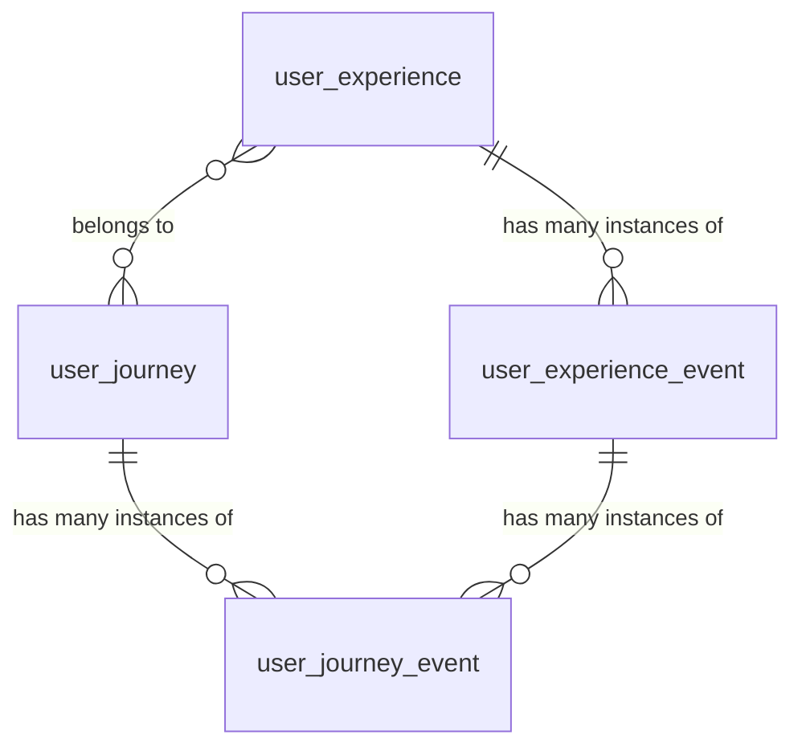
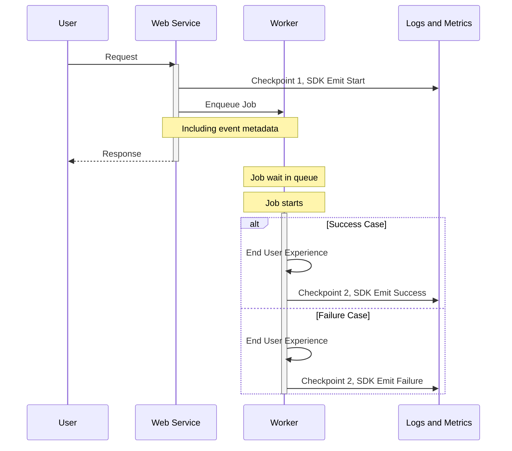

<!-- vale gitlab.FutureTense = NO -->

<!-- This renders the design document header on the detail page, so don't remove it-->

このページには今後予定されている製品・機能・機能性に関する情報が含まれています。ここに示す情報は参考目的のみです。購入・計画の決定にこの情報を使用しないでください。製品・機能・機能性の開発、リリース、タイミングは変更または延期される可能性があり、GitLab Inc. の独自の判断に委ねられています。

<table class="w-full text-sm border-collapse">
<thead>
<tr class="bg-gray-100 text-left">
<th class="px-3 py-2 border border-gray-300">Status</th>
<th class="px-3 py-2 border border-gray-300">Authors</th>
<th class="px-3 py-2 border border-gray-300">Coach</th>
<th class="px-3 py-2 border border-gray-300">DRIs</th>
<th class="px-3 py-2 border border-gray-300">Owning Stage</th>
<th class="px-3 py-2 border border-gray-300">Created</th>
</tr>
</thead>
<tbody>
<tr>
<td class="px-3 py-2 border border-gray-300">implemented</td>
<td class="px-3 py-2 border border-gray-300"><a href="https://gitlab.com/hmerscher" class="text-blue-600 hover:underline">@hmerscher</a></td>
<td class="px-3 py-2 border border-gray-300"><a href="https://gitlab.com/reprazent" class="text-blue-600 hover:underline">@reprazent</a>, <a href="https://gitlab.com/andrewn" class="text-blue-600 hover:underline">@andrewn</a></td>
<td class="px-3 py-2 border border-gray-300"></td>
<td class="px-3 py-2 border border-gray-300">~team::Observability</td>
<td class="px-3 py-2 border border-gray-300">2025-02-03</td>
</tr>
</tbody>
</table>

## 用語集

- **SLI**: [サービスレベル指標](https://en.wikipedia.org/wiki/Service_level_indicator)（Service Level Indicator）は、サービスプロバイダーが顧客に提供するサービスレベルの指標です。
- **アプリケーション SLI**: アプリケーション側で定義された SLI です。アプリケーションが apdex とエラー率に対して何が「良好」かを決定します。SLI はランブックリポジトリでの監視のためにサービスに関連付けられています。https://docs.gitlab.com/ee/development/application_slis/
- **Apdex（アプリケーションパフォーマンスインデックス）**: GitLab のユーザーエクスペリエンス SLI のコンテキストでは、許容できる時間内に何かが完了することです。例えば、プッシュの変更が 30 秒以内にマージリクエスト上で表示されること。
- **ユーザージャーニー**: ユーザーが製品、サービス、ブランドに関与する際に経験するすべてのチェックポイント、インタラクション、感情を示す包括的な可視化またはマップです。初期認知から購入以降までを含みます。GitLab では、ユーザーがアプリケーション内で行う旅を指します。複数のエクスペリエンスを含む場合があります。例: プロジェクトの作成 → Issue の作成 → マージリクエストの作成。
- **カバードエクスペリエンス**: SLA によってカバーされているユーザーエクスペリエンスの一部。現在、すべてのカバードエクスペリエンスがユーザーエクスペリエンス SLI として定義されているわけではありません。これを改善することを目指す必要があります。
- **ユーザーエクスペリエンス SLI**: 複数のサービスにまたがる可能性のあるユーザーインタラクションのエンドツーエンドフローを表す SLI の実装。
- **マルチアクションエクスペリエンス**: 完了前に複数のユーザーインタラクションから構成されるユーザージャーニーです。例えば、Issue の作成は 2 つのチェックポイントから構成されます: 新規レンダリング、フォーム送信。ユーザーエクスペリエンス SLI の最初のイテレーションでは、これをサポートしません。
- **シングルアクションエクスペリエンス**: 単一のユーザーインタラクションから構成されるユーザージャーニーです。例えば「Issue を表示する」または「Issue にコメントを追加する」。
- **マルチサービスエクスペリエンス**: 正常に完了するために複数のサービスに依存するジャーニーです。例: プッシュが GitLab-shell で受信され、Rails、Gitaly、Sidekiq を呼び出します。マルチサービスエクスペリエンスはシングルアクションエクスペリエンスである場合があり、エクスペリエンスの完了に必要なユーザーアクションは 1 つだけですが、完了するために複数のサービスにまたがります。
- **基準**: 各エクスペリエンスは、成功を測定するために使用できる 1 つ以上の基準を持つことができます。例: 「Issue が正常に作成された」AND「Issue が十分速く作成された」。
- **ユーザーエクスペリエンス定義**: `user_experience_id` で識別されるユーザーエクスペリエンスの仕様。例: user_experience_id="create_merge_request"。
- **ユーザーエクスペリエンスイベント**: ユーザーエクスペリエンスの 1 つのインスタンス。プロパティ `user_experience_id` と `correlation_id` で識別されます。例: user_experience_id="create_merge_request" & correlation_id="01G65Z755AFWAKHE12NY0CQ9FH"。
- **ユーザーエクスペリエンスチェックポイント**: エクスペリエンス内でイベントを 1 つ発行する瞬間です: リクエストの開始、ジョブの開始、リクエストの終了、ジョブの終了など。ユーザーエクスペリエンスイベント内にこれらのうち少なくとも 1 つがありますが、複数ある場合もあります。

## 動機

GitLab は SLI フレームワークを通じて堅牢なサービスレベルメトリクスを持っていますが、現在、複数のサービスにまたがるユーザーエクスペリエンスを体系的に追跡・測定する方法がありません。既存の SLI は個別のサービスパフォーマンスの測定に優れていますが、エンドツーエンドのユーザーインタラクションの成功/失敗率とパフォーマンスを効果的に追跡できません。このギャップにより、以下の課題があります:

- サービス境界を越えた真のユーザーエクスペリエンスの理解
- 複雑なユーザーインタラクションに対するユーザー中心の SLO の設定と監視
- マルチサービスフローのボトルネックの特定
- 顧客とユーザーへのインシデントの信頼性と影響の測定

## 目標

GitLab サービス全体のユーザーエクスペリエンスを追跡・測定し、プロダクトチームがユーザーエクスペリエンス SLI を定義・監視するためのフレームワークを確立します。

### ユーザーエクスペリエンス SLI とカバードエクスペリエンス

どちらの概念もユーザー向け機能の測定に関連していますが、異なる目的を果たします:

- **カバードエクスペリエンス**は、SLA コミットメントでカバーされているユーザーエクスペリエンスの部分を表していますが、特定の SLI 実装がまだない場合があります。
- **ユーザーエクスペリエンス SLI**は、定義された成功基準と監視を持つ、測定可能でインストルメントされたエクスペリエンスの技術的な実装です。

私たちの目標は、時間をかけてすべてのカバードエクスペリエンスにユーザーエクスペリエンス SLI を実装することでこのギャップを埋めることです。
これは、顧客の SLA を違反する前に、カバードエクスペリエンスの問題についての早期通知を得る一つの方法です。

### ユーザーエクスペリエンスはユーザージャーニーとどう関係するか

ユーザーエクスペリエンスは、ユーザーがプラットフォーム上で行う小さなインタラクションです。ユーザーエクスペリエンスは、SLI を通じて追跡・監視できる単一アクションに特に焦点を当てています。一方、ユーザージャーニーはユーザーがアプリケーション内で取る包括的なエンドツーエンドのパスを表します。ユーザージャーニーは多くのユーザーエクスペリエンスから構成でき、単一のユーザーエクスペリエンスは多くのユーザージャーニーの一部になることができます。

2 つの概念間の主な関係:

- **スコープ**: ユーザージャーニーは複数のユーザーエクスペリエンスを包含する場合があります。例えば、「プロジェクトにコードをコントリビュートする」というユーザージャーニーには、「git push」、「マージリクエストの作成」、「CI パイプラインの実行」などの複数のユーザーエクスペリエンスが含まれる場合があります。
- **測定可能性**: ユーザーエクスペリエンスは、明確な成功基準としきい値を持つ SLI フレームワークを通じて測定できるように設計されています。ユーザージャーニー全体でユーザーが行う決定による曖昧さを含めるべきではありません。
- **実装**: ユーザージャーニーはしばしば概念的であり、プロダクト計画に使用されます。ユーザーエクスペリエンスは、インストルメンテーション、メトリクス、アラートを伴う具体的な技術実装を持ちます。

プロダクトはユーザージャーニーを定義し、エンジニアリングと協力してどのユーザーエクスペリエンスがそれらのジャーニーの一部であるかを指定します。こちらがグラフィカルな表現です:

[グラフのソース](https://lucid.app/lucidchart/e911c437-dbdf-4540-bf44-23962e048661/edit)

## すること

- プロダクトチームが重要なユーザーエクスペリエンス SLI を構造化された方法で定義するためのフレームワークを作成する
- エンジニアがユーザーエクスペリエンスをインストルメントしやすくする SDK を開発する
- GitLab.com と Dedicated のデプロイの両方をサポートする
- メトリクスとログを通じてユーザーエクスペリエンスの成功/失敗率と所要時間の測定を可能にする
- 既存のアラートフレームワークを通じて指定されたしきい値でアラートを可能にする SLI を通じてユーザーエクスペリエンスのパフォーマンスを通知する

## しないこと

- 汎用の分散トレーシングソリューションの構築
- クライアント側のタイミングとクライアントへのワイヤー上の時間の追跡。将来的には、私たちが構築するクライアント（IDE 拡張機能、フロントエンド）のサポートを追加したいと考えていますが、最初のイテレーションではスコープ外としています。
- リアルタイムのユーザーエクスペリエンスの可視化またはデバッグツール
- ログとメトリクスはセルフマネージドから発行されますが、そのような環境を制御できないため、それらのインスタンスからの情報の取り込みを公式にサポートしません

## スコープ外

1. 他のプロジェクトはユーザーエクスペリエンス SLI の恩恵を受ける可能性がありますが、この提案のスコープには含まれません。例えば:
    - 重要なユーザーパスが十分にテストされ監視されていることを確保する（例: https://gitlab.com/groups/gitlab-org/quality/-/epics/144）。ユーザーエクスペリエンス SLI は、重要なユーザーパスのエンドツーエンドテストカバレッジのギャップを特定するのに役立つデータを提供できます。
    - ユーザーエクスペリエンスを使用してサービスレベルアグリーメントに情報提供する（https://gitlab.com/gitlab-com/gl-infra/mstaff/-/issues/423）
2. ユーザーエクスペリエンストラッカーの実装。新しいサービスを実装するための[提案](next_step.md)があります。

PS: 次のステップを以下の[エピック](https://gitlab.com/groups/gitlab-com/gl-infra/observability/-/work_items/10)で収集・計画しています。

## スコープ

実装は以下のコンポーネントで構成されます:

1. [ユーザーエクスペリエンス定義フレームワーク](#user-experience-sli-definition)
2. [LabKit SDK](#sdk-requirements)

プロジェクトの作業アイテムは[エピック #1539](https://gitlab.com/groups/gitlab-com/gl-infra/-/epics/1539)にスコープされています。

[ユーザーエクスペリエンス定義](#user-experience-sli-definition)は各ユーザーエクスペリエンス SLI の仕様を提供し、[SDK](#sdk-requirements)はサービスをインストルメントしてイベント（メトリクスとログ）を発行するために使用されます。

例:

### ユーザーエクスペリエンス SLI 定義 {#user-experience-sli-definition}

- プロダクトチームが作成する YAML ベースのユーザーエクスペリエンス SLI 定義
- 成功基準の指定のサポート

ユーザーエクスペリエンス定義には以下のフィールドが含まれます:

| フィールド          | 型     | 必須 | 説明                                                                                                          | 例                             |
|--------------------|--------|------|---------------------------------------------------------------------------------------------------------------|--------------------------------|
| user_experience_id | string | はい | ユーザーエクスペリエンスの識別子                                                                              | "merge_request_creation"       |
| description        | string | はい | 人間が読める説明                                                                                              | "User creates a merge request" |
| feature_category   | string | はい | [GitLab の機能カテゴリ](https://docs.gitlab.com/development/feature_categorization/#feature-categorization)    | "source_code_management"       |
| urgency            | string | はい | ユーザーの期待に基づいてプロセスがどのくらい速く完了する必要があるか                                          | "sync_fast"                    |

サポートされる緊急度の非網羅的なリスト:

| しきい値     | 説明                                                                                                                                                             | 例                                                                             | 値    |
|--------------|------------------------------------------------------------------------------------------------------------------------------------------------------------------|--------------------------------------------------------------------------------|-------|
| `sync_fast`  | ユーザーがアクションを続行する前に返される必要がある同期レスポンスを待っている                                                                                  | フルページのレンダリング                                                       | 2s    |
| `sync_slow`  | ユーザーがアクションを続行する前に返される必要がある同期レスポンスを待っているが、より遅いレスポンスを受け入れる可能性がある                                    | エンターテイメントアニメーションを表示しながら全文検索レスポンスを表示         | 5s    |
| `async_fast` | ユーザーのユーザージャーニーの続行をブロックする可能性がある非同期プロセス                                                                                      | git push 後の MR diff の更新                                                   | 15s   |
| `async_slow` | ユーザーをブロックせず、すぐに遅いとは気付かれない非同期プロセス                                                                                                | 割り当て後の通知                                                               | 5m    |

プロダクトチームがより多くのユーザーエクスペリエンス SLI を実装するにつれて、さまざまなシナリオに対応するために緊急度のリストは拡大します。

例:

| user_experience_id     | description                  | feature_category       | urgency     |
|------------------------|------------------------------|------------------------|-------------|
| merge_request_creation | User creates a merge request | source_code_management | "sync_fast" |
| git_push               | User pushes commits to a repository | source_code_management | "async_fast" |

アプリケーション SLI は現在 [Rails モノリス](https://gitlab.com/gitlab-org/gitlab)に実装されているため、ユーザーエクスペリエンス SLI の定義を保存するための[レジストリ](https://gitlab.com/gitlab-com/gl-infra/observability/team/-/issues/4099)として最初は機能します。

### SDK 要件 {#sdk-requirements}

- [LabKit](https://gitlab.com/gitlab-org/ruby/gems/labkit-ruby) への実装
- ユーザーエクスペリエンスイベントとチェックポイントを送信するための DSL

SDK は各チェックポイント（フロー全体の各インタラクション）で 1 つのイベントを発行します:

**gitlab_user_experience_checkpoint_total**

| ラベル              | 例                                                                                                                                                                           | メトリクス | ログ |
|---------------------|------------------------------------------------------------------------------------------------------------------------------------------------------------------------------|--------|-----|
| user_experience_id  | security_scan                                                                                                                                                                | yes    | yes |
| correlation_id      | f93ae47de7f848343cf85511b47923ce                                                                                                                                             | no     | yes |
| feature_category    | vulnerability_management                                                                                                                                                     | yes    | yes |
| checkpoint          | start \| intermediate \| end                                                                                                                                                 | yes    | yes |
| checkpoint_category | e.g. authorize (impose limited cardinality)                                                                                                                                  | no     | yes |
| type                | web                                                                                                                                                                          | yes    | yes |
| meta                | { "relevant attributes": "tailored for the specific event" }   i.e. https://docs.gitlab.com/development/logging/#logging-context-metadata-through-rails-or-grape-requests | no     | yes |

フローの終わりに、エラーと成功を示すためにさらに 2 つのイベントが発行されます:

**gitlab_user_experience_total**

| ラベル                | 例                                                                                                                                                                           | メトリクス | ログ |
|-----------------------|------------------------------------------------------------------------------------------------------------------------------------------------------------------------------|--------|-----|
| user_experience_id | security_scan                                                                                                                                                                | yes    | yes |
| correlation_id        | f93ae47de7f848343cf85511b47923ce                                                                                                                                             | no     | yes |
| feature_category      | vulnerability_management                                                                                                                                                     | yes    | yes |
| error                 | true \| false                                                                                                                                                                | yes    | yes |
| type                  | sidekiq                                                                                                                                                                      | yes    | yes |
| meta                  | { "relevant attributes": "tailored for the specific event" }   i.e. https://docs.gitlab.com/development/logging/#logging-context-metadata-through-rails-or-grape-requests | no     | yes |

**gitlab_user_experience_apdex_total**

| ラベル                | 例                                                                                                                                                                                       | メトリクス | ログ |
|-----------------------|------------------------------------------------------------------------------------------------------------------------------------------------------------------------------------------|--------|-----|
| user_experience_id | security_scan                                                                                                                                                                            | yes    | yes |
| correlation_id        | f93ae47de7f848343cf85511b47923ce                                                                                                                                                         | no     | yes |
| feature_category      | vulnerability_management                                                                                                                                                                 | yes    | yes |
| success               | true \| false                                                                                                                                                                            | yes    | yes |
| type                  | sidekiq                                                                                                                                                                                  | yes    | yes |
| meta                  | { "relevant attribute to the event": "tailored for the specific event" }   i.e. https://docs.gitlab.com/development/logging/#logging-context-metadata-through-rails-or-grape-requests | no     | yes |

## 代替ソリューション

1. 何もしない
   メリット:
   - 実装コストがない

   デメリット:
   - エンドツーエンドのユーザーエクスペリエンスの可視性と測定が引き続き欠如する
   - 意味のある SLO を設定しにくい
   - 認識されたユーザーエクスペリエンスとテストカバレッジのより良い把握の機会を逃す

## 歴史

ユーザーエクスペリエンス SLI はかつてカバードエクスペリエンス SLI と呼ばれていました。[名称が変更された](https://gitlab.com/gitlab-com/gl-infra/observability/team/-/issues/4347)のは、私たちの[サービスレベルアグリーメント](/handbook/engineering/infrastructure-platforms/service-level-agreement/)でも使用されている業界 SLA 用語との衝突を避けるためです。
