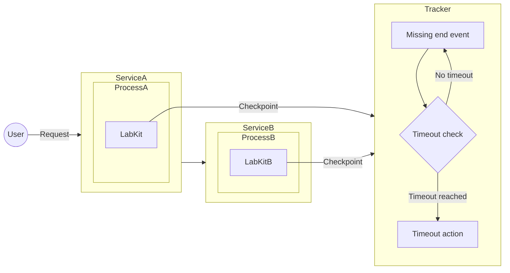
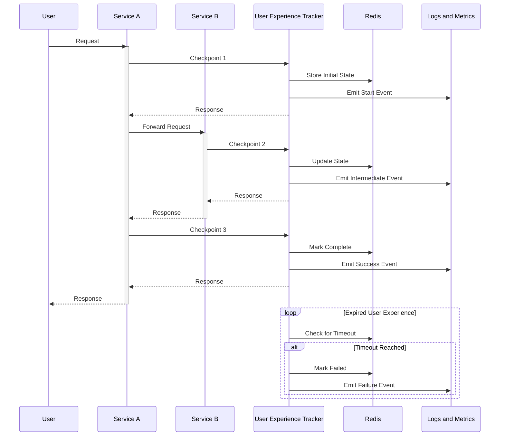
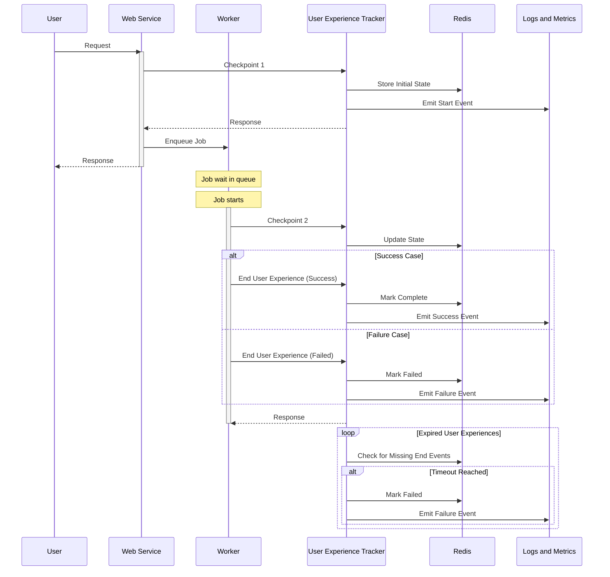

<!-- vale gitlab.FutureTense = NO -->

<!-- This renders the design document header on the detail page, so don't remove it-->



## 動機

[ユーザーエクスペリエンス SLI](index.md)からの作業を継続して、この補足資料はユーザーエクスペリエンストラッカーという新しいサービスを導入することで、ユーザーエクスペリエンスフレームワークの拡張に焦点を当てています。このサービスにより、途中でエラーが発生して完了しない（またはその期待される生存期間内に完了しない）ユーザーエクスペリエンスを追跡する機能が追加されます。

これは変更される可能性があるため、メインのブループリントとは別に保持されています。ここに提示されている内容は志向的なものにすぎません。

## スコープ

[ユーザーエクスペリエンストラッカー](#user-experience-sli-tracker)は、ユーザーエクスペリエンスのタイムアウト検証を担当します——特に非同期ユーザーエクスペリエンス SLI の追跡に関連しています。

SDK が統合されたら、イベント発行の機能をこのサービスに移動して一元化し、SDK からの複雑さを取り除くことができます。

プロジェクトは以下で構成されます:

1. [ユーザーエクスペリエンス SLI トラッカー](#user-experience-sli-tracker)
2. [LabKit SDK](#sdk-requirements)

例:

プロジェクトの作業アイテムは[エピック #1540](https://gitlab.com/groups/gitlab-com/gl-infra/-/epics/1540)にスコープされています。

## ユーザーエクスペリエンス SLI トラッカー {#user-experience-sli-tracker}

- 一元化されたユーザーエクスペリエンス SLI 状態追跡
- ユーザーエクスペリエンスの期間に対する合理的な TTL（Time to Live）しきい値
- 状態は Redis に保存・管理されます。設定されたしきい値後にタイムアウトする古くなったユーザーエクスペリエンスのクエリを可能にします。
- [認証](#authentication)
- デプロイ:
  - GitLab.com 向けの Runway サービス
  - Dedicated 向けの Runway ホスティングサービス

クライアントが生成したペイロードに応答するエンドポイントを提供します:

| フィールド          | 型                | 必須               | 説明                                                                                                          | 例                                 |
|---------------------|-------------------|--------------------|---------------------------------------------------------------------------------------------------------------|------------------------------------|
| correlation_id      | string (ULID)     | はい               | ユーザーエクスペリエンスの一意識別子                                                                          | "01JP0EM7HB39WSJNR4662MYZ6V"       |
| user_experience_id  | string            | はい               | ユーザーエクスペリエンスの識別                                                                                | "http_request"                     |
| checkpoint          | string            | はい               | ライフサイクルのどのステップか                                                                                | "start" \| "end" \| "intermediate" |
| checkpoint_category | string            | いいえ             | チェックポイントのドメイン固有のカテゴリ。TBD: 限定的なカーディナリティを課す。                               | "authorize"                        |
| type                | string            | はい               | イベントを生成するサービス/コンポーネント                                                                     | "web", "database"                  |
| feature_category    | string            | はい               | [GitLab の機能カテゴリ](https://docs.gitlab.com/development/feature_categorization/#feature-categorization)    | "source_code_management"           |
| urgency             | string            | はい               | ユーザーの期待に基づいてプロセスがどのくらい速く完了する必要があるか                                          | "sync_fast"                        |
| client_timestamp    | string (ISO-8601) | はい               | イベントが発生したときのタイムスタンプ                                                                        | "2025-02-06T14:30:00Z"             |
| server_timestamp    | string (ISO-8601) | いいえ（レスポンスのみ） | サーバー処理タイムスタンプ                                                                               | "2025-02-06T14:30:00.123Z"         |
| meta                | object            | いいえ             | i.e. https://docs.gitlab.com/development/logging/#logging-context-metadata-through-rails-or-grape-requests    |                                    |

バックグラウンドプロセスがすべての古いユーザーエクスペリエンス SLI を確認し、クリアして失敗イベントを発行します。

同期ユーザーエクスペリエンスが与えられたコンポーネントのインタラクション:

非同期ユーザーエクスペリエンスが与えられたコンポーネントのインタラクション:

### 認証 {#authentication}

SDK とユーザーエクスペリエンス SLI トラッカー間の認証は、GitLab 機能の信頼性メトリクスを歪める可能性がある予期しないイベントの送信を防ぐために必要です。
例: ai-gateway の[認証と認可](https://gitlab.com/gitlab-org/modelops/applied-ml/code-suggestions/ai-assist/-/blob/884ec8a1e92c1db13f12a1b0093e4e82aa50cad7/docs/auth.md)。

## SDK 要件 {#sdk-requirements}

- 直接イベントをプッシュするのではなく、トラッカーに向けてイベントをトリガーする
- ユーザーエクスペリエンス SLI トラッカーへのイベント送信に指数バックオフを使用した自動リトライ
