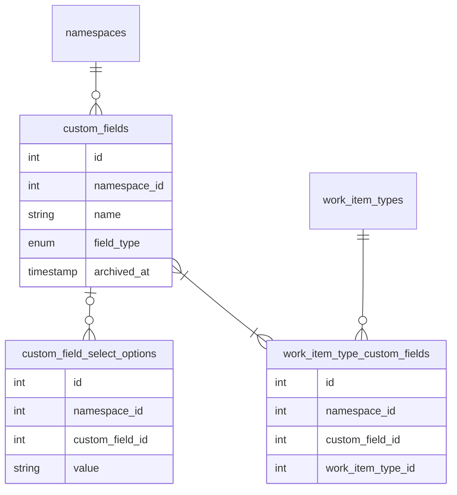
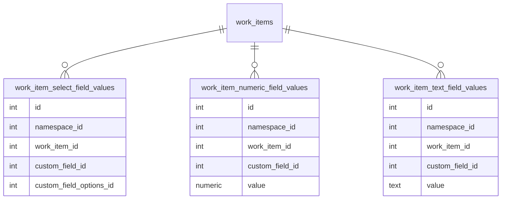

<!-- Design Documents often contain forward-looking statements -->
<!-- vale gitlab.FutureTense = NO -->

<!-- This renders the design document header on the detail page, so don't remove it-->


<div class="my-3 border-l-4 border-blue-500 bg-blue-50 px-4 py-3 rounded-r text-sm text-blue-800">
このページには今後予定されている製品・機能・機能性に関する情報が含まれています。ここに示す情報は参考目的のみです。購入・計画の決定にこの情報を使用しないでください。製品・機能・機能性の開発、リリース、タイミングは変更または延期される可能性があり、GitLab Inc. の独自の判断に委ねられています。
</div>

<div class="overflow-x-auto my-4">
<table class="w-full text-sm border-collapse">
<thead>
<tr class="bg-gray-100 text-left">
<th class="px-3 py-2 border border-gray-300">Status</th>
<th class="px-3 py-2 border border-gray-300">Authors</th>
<th class="px-3 py-2 border border-gray-300">Coach</th>
<th class="px-3 py-2 border border-gray-300">DRIs</th>
<th class="px-3 py-2 border border-gray-300">Owning Stage</th>
<th class="px-3 py-2 border border-gray-300">Created</th>
</tr>
</thead>
<tbody>
<tr>
<td class="px-3 py-2 border border-gray-300"><span class="inline-block rounded px-2 py-0.5 text-xs font-medium bg-gray-100 text-gray-700">ongoing</span></td>
<td class="px-3 py-2 border border-gray-300"><a href="https://gitlab.com/fernanda.toledo" class="text-blue-600 hover:underline">@fernanda.toledo</a></td>
<td class="px-3 py-2 border border-gray-300"></td>
<td class="px-3 py-2 border border-gray-300"><a href="https://gitlab.com/donaldcook" class="text-blue-600 hover:underline">@donaldcook</a>, <a href="https://gitlab.com/gweaver" class="text-blue-600 hover:underline">@gweaver</a></td>
<td class="px-3 py-2 border border-gray-300"><span class="inline-block rounded px-2 py-0.5 text-xs font-medium bg-gray-100 text-gray-700">~devops::plan</span></td>
<td class="px-3 py-2 border border-gray-300">2025-05-13</td>
</tr>
</tbody>
</table>
</div>


## 概要

このドキュメントでは、GitLab のワークアイテムに対して[柔軟なカスタムフィールドシステム](https://gitlab.com/groups/gitlab-org/-/epics/235)を実装するアプローチを説明します。
標準のワークアイテムフィールド/ウィジェットを拡張し、チームがワークフローに固有の特定情報を記録できるカスタマイズ可能なフィールドを導入します。

このソリューションでは、**ルート**グループレベルで設定し、さまざまなワークアイテムタイプに適用できるユーザー作成のカスタムフィールドを導入します。Premium および Ultimate ユーザーは、グループ、サブグループ、プロジェクト全体でこれらのカスタムフィールドを作成、管理、使用できます。

このイニシアティブにより、ユーザーは情報の記録と報告方法を標準化でき、プロジェクト全体の一貫性が生まれ、より強力なフィルタリングと報告機能をサポートします。

## タイムラインとステータス更新

1. カスタムフィールド MVC1 は FY26Q1 の Plan ステージの最高優先事項であり、フィーチャーフラグ `custom_fields_feature` とともに GitLab 17.11 で導入されました。GitLab.com、GitLab セルフマネージド、GitLab Dedicated で有効化されました。
2. 機能 MVC1 はフィーチャーフラグが削除されて GitLab 18.0 で一般提供（GA）になりました。
3. MVC2 と MVC3 は優先順位付けが保留中であり、ステータス更新は[カスタムフィールドエピック](https://gitlab.com/groups/gitlab-org/-/epics/235)にあります。

## 用語集

### 既存の概念と用語

1. **ワークアイテムタイプ:** 関連するウィジェットを通じてワークアイテムの利用可能な機能と動作を決定する分類。
2. **ウィジェット:** ワークアイテムタイプに特定の機能を提供する機能コンポーネント（例: 「担当者」や「ラベル」）。
3. **名前空間:** GitLab では、名前空間はプロジェクトをホストするユーザーまたはグループの一意の名前です。

### 新しい概念と用語

1. **カスタムフィールド:** 標準フィールド以外の特殊な情報を記録するためにワークアイテムに追加できるユーザー定義フィールド。
2. **フィールドタイプ:** カスタムフィールドのデータ型であり、その動作と制約を決定します（シングルセレクト、マルチセレクト、数値、テキスト）。
3. **セレクトオプション:** シングルセレクトまたはマルチセレクトフィールドで選択できる定義済みの値。
4. **カスタムフィールドウィジェット:** ワークアイテム詳細ビューのサイドバーにカスタムフィールドを表示し、ワークアイテムの値をユーザーが変更できるコンポーネント。
5. **フィールド値:** 特定のワークアイテムのカスタムフィールドに保存されたデータ。

## 動機

GitLab の標準フィールドはワークアイテム管理の確固たる基盤を提供していますが、多くのチームがワークフロー固有の情報を追跡するために追加の特殊フィールドを必要としています。これは数年にわたって文書化された長期にわたって要望されている機能であり、エピック [#235](https://gitlab.com/groups/gitlab-org/-/epics/235) や Issue [#8988](https://gitlab.com/gitlab-org/gitlab-foss/-/issues/8988) などに記録されています。カスタムフィールドでワークアイテムを強化する機能により、組織は GitLab を特定の計画ニーズに合わせてカスタマイズし、プロジェクト間の一貫性を生み出すことができます。

この実装以前は、ラベルを使用したり説明に情報を保存したりするような、あまり構造化されていないアプローチに頼らざるを得ませんでした。これにより、フィルタリング、報告、標準化の機能が制限されていました。カスタムフィールドは、ワークアイテム全体に一貫して適用できるさまざまなフィールドタイプを持つ構造化されたデータストレージを提供することで、これらの問題を解決します。

### 目標

1. チームが標準フィールド以外のカスタマイズされたメタデータをワークアイテムに追加できるようにする
2. さまざまなデータ要件に対応するためのさまざまなフィールドタイプを提供する（テキスト、数値、シングル/マルチセレクト）
3. グループ、サブグループ、プロジェクト全体で一貫したデータ収集と報告を可能にする
4. カスタムフィールド値に基づいたフィルタリング機能を改善する
5. チーム全体でのワークフローの標準化をサポートする
6. ワークアイテムアーキテクチャを使用して、サポートされているすべてのワークアイテムタイプにカスタムフィールド機能を拡張する
7. サブグループとプロジェクトへの継承を伴うグループレベルでのフィールド設定を許可する

### 非目標

1. フィールド間の複雑な検証ルールや依存関係
2. ワークアイテムフレームワーク外のエンティティのカスタムフィールド

## 提案

GitLab のワークアイテムに対して包括的なカスタムフィールドシステムを開発することを提案します。以下の主要な要素を中心としています:

1. カスタムフィールドは Premium および Ultimate のお客様に提供されます。
2. 初期は 4 つのフィールドタイプをサポートします: シングルセレクト、マルチセレクト、数値、テキスト。
3. フィールドはトップレベルグループで設定され、すべてのサブグループとプロジェクトに継承されます。
4. フィールドは特定のワークアイテムタイプ（Issue、エピックなど）に割り当てられます。
5. フィールド値は issues テーブルに保存されます。
6. フィールドは過去データを保存するために削除ではなくアーカイブできます。
7. システムはワークアイテムフレームワークとウィジェットの概念を GraphQL API で使用します。

注意: これは初期の提案であり、将来的にはより多くの設定オプションとフィールドタイプを提供する予定です。

## 設計と実装の詳細

このセクションでは、GitLab のワークアイテムカスタムフィールドシステムのコアコンセプト、実装アーキテクチャ、リリース計画について詳述します。

### コアコンセプト

#### カスタムフィールド

カスタムフィールドはトップレベルグループで定義され、複数のワークアイテムタイプにリンクできます。
各フィールドには、その動作と制約を定義する特定のタイプがあります:

- **シングルセレクト:** ユーザーが定義済みリストから 1 つのオプションを選択できます
- **マルチセレクト:** ユーザーが定義済みリストから複数のオプションを選択できます
- **数値:** ユーザーが数値を入力できます
- **テキスト:** ユーザーが自由形式のテキストを入力できます（1024 文字に制限）

カスタムフィールドはアクティブまたはアーカイブ済みにできます。アーカイブされたフィールドは過去データを保存しますが、新しいワークアイテムや編集にはもはや利用できません。

トップレベルグループあたりのアクティブなカスタムフィールドの上限は `50` です。

#### セレクトオプション

シングルセレクトおよびマルチセレクトフィールドの場合、セレクトオプションが利用可能な選択肢を定義します。オプションには名前と表示順序を決定する位置があります。

シングルセレクトまたはマルチセレクトフィールドには最大 `50` のセレクトオプションを設定できます。

#### フィールド値

フィールド値はワークアイテムの各カスタムフィールドの実際のデータを保存します。フィールドタイプによって異なる値タイプが使用されます:

- `TextFieldValue:` テキストフィールドの文字列値を保存
- `NumberFieldValue:` 数値フィールドの数値を保存
- `SelectFieldValue:` シングルセレクトおよびマルチセレクトフィールドの選択されたオプション(複数可)を保存

#### ワークアイテムタイプとのフィールドの関連付け

カスタムフィールドは多対多の関係を通じて特定のワークアイテムタイプに関連付けられます。これにより、異なるワークアイテムタイプが異なるフィールドセットを持てるようになります。

ワークアイテムタイプには最大 `10` のカスタムフィールドを割り当てられます。

### 実装アーキテクチャ

#### データベーススキーマ

##### カスタムフィールドの設定について



注意:

- `field_type` はセレクト、マルチセレクト、数値、テキストなどになります。
- `custom_field_select_options` はセレクト/マルチセレクトタイプのオプションを保存するために使用されます
- これはワークアイテムウィジェットの定義から切り離されており、デフォルトタイプへの追加が容易になり、MR やカスタムオブジェクトにも将来再利用できます。

##### ワークアイテムカスタムフィールド値の保存について



注意:

- 参照整合性を維持するための外部キーを持てるように、各カスタムフィールドタイプは独自のテーブルを使用します。

#### モデルと関連付け

カスタムフィールドシステムは以下の主要なモデルで実装されています:

- `Issuables::CustomField`: フィールド定義（名前とフィールドタイプを含む）を保存
- `Issuables::CustomFieldSelectOption`: シングルセレクトおよびマルチセレクトフィールドのオプションを保存
- `WorkItems::TypeCustomField`: カスタムフィールドをワークアイテムタイプにリンク
- `WorkItems::TextFieldValue`、`WorkItems::NumberFieldValue`、`WorkItems::SelectFieldValue`: 特定のワークアイテムのフィールド値を保存

#### カスタムフィールドウィジェット

ワークアイテムでカスタムフィールド値を表示・管理するために `CUSTOM_FIELDS` ウィジェットを使用します。
このウィジェットはカスタムフィールドをサポートするすべてのワークアイテムタイプに追加されます。

ウィジェットはフィールドタイプに基づいてさまざまな入力コンポーネントをレンダリングします:

- テキストフィールドはテキスト入力コンポーネントを使用します
- 数値フィールドは数値入力コンポーネントを使用します
- シングルセレクトおよびマルチセレクトフィールドはドロップダウンコンポーネントを使用します

#### API 設計

この機能は既存のワークアイテム GraphQL API を使用し、ワークアイテムウィジェットフレームワークを拡張して、`CUSTOM_FIELDS` ウィジェットからカスタムフィールドデータを返します。

利用可能なフィールドに関するメタデータを取得するには、ワークアイテムタイプと名前空間コンテキストの両方を指定してウィジェット定義エンドポイントをクエリできます。

トップレベルグループからすべてのカスタムフィールドを取得する GraphQL クエリの例:

```graphql
query groupCustomFields($fullPath: ID!, $active: Boolean!) {
  group(fullPath: $fullPath) {
    id
    customFields(active: $active) {
    count
    nodes {
      id
      name
      fieldType
      active
      createdAt
      updatedAt
      selectOptions {
        id
        value
      }
      workItemTypes {
        id
        name
      }
    }
    }
  }
}
```

変数の例:

```graphql
{
  "fullPath": "gitlab-org",
  "active": true
}
```

ワークアイテムのカスタムフィールドを取得する GraphQL クエリの例:

```graphql
query namespaceWorkItem($fullPath: ID!, $iid: String!) {
  workspace: namespace(fullPath: $fullPath) {
    id
    workItem(iid: $iid) {
    id
    widgets {
      type
      ... on WorkItemWidgetCustomFields {
        type
        customFieldValues {
        customField {
          id
          name
          fieldType
        }
        ... on WorkItemNumberFieldValue {
          value
        }
        ... on WorkItemTextFieldValue {
          value
        }
        ... on WorkItemSelectFieldValue {
          selectedOptions {
            id
            value
          }
        }
        }
      }
    }
    }
  }
}
```

変数の例:

```graphql
{
  "fullPath": "gitlab-org",
  "iid": "235"
}
```

#### 権限

- カスタムフィールドを作成、編集、アーカイブ、アーカイブ解除するには、グループに対して少なくとも Maintainer ロールが必要です。
- ワークアイテムのカスタムフィールド値を設定するには、ワークアイテムのプロジェクトまたはグループに対して少なくとも Planner ロールが必要です。Guest ロールがある場合、ワークアイテムを作成するときのみカスタムフィールドを設定できます。

#### カスタムフィールドの管理

トップレベルグループの設定ページで、ユーザーはそのグループ、サブグループ、プロジェクトのワークアイテムで利用可能なカスタムフィールドを設定できます。

そのページでは、どのワークアイテムタイプにカスタムフィールドを関連付けるかも定義できます。カスタムフィールドが作成されてワークアイテムタイプにリンクされると、そのワークアイテムタイプページに表示されます。

トップレベルグループのカスタムフィールドの管理方法については、[ガイド](https://docs.gitlab.com/user/work_items/custom_fields/#configure-custom-fields-for-a-group)を参照してください。

##### カスタムフィールドのアーカイブ

カスタムフィールドを削除するかわりに、過去データを保存するためのアーカイブをサポートしています。フィールドがアーカイブされると:

1. `archived_at` タイムスタンプでマークされます
2. フィールド選択 UI に表示されなくなります
3. 新しいワークアイテムには利用できなくなります
4. 既存のフィールド値は過去の参照のために保存されます

フィールドを再び利用可能にするためにアーカイブを解除できます。カスタムフィールドのアーカイブまたはアーカイブ解除の方法については、[ガイド](https://docs.gitlab.com/user/work_items/custom_fields/#archive-a-custom-field)を参照してください。

#### カスタムフィールドでのフィルタリング

ユーザーはグループおよびプロジェクトのリストページでカスタムフィールド値によってワークアイテムをフィルタリングできます。これは既存の検索・フィルター機能を使用して実装されており、カスタムフィールドタイプの拡張があります:

- テキストフィールド: 特定のテキストコンテンツを含むワークアイテムを検索
- 数値フィールド: 数値でフィルタリング
- シングルセレクトフィールド: 選択されたオプションでフィルタリング
- マルチセレクトフィールド: 1 つの選択されたオプションでフィルタリング（現在）

以下のページで現在フィルタリングが利用可能:

- グループ/Issue リスト（[例](https://gitlab.com/groups/gitlab-org/-/issues)）
- グループ/Issue ボード（[例](https://gitlab.com/groups/gitlab-org/-/boards)）
- プロジェクト/Issue リスト（[例](https://gitlab.com/gitlab-org/gitlab/-/issues)）
- プロジェクト/Issue ボード（[例](https://gitlab.com/gitlab-org/gitlab/-/boards)）

### フィーチャーフラグとライセンス機能

開発全体を通じてフィーチャーフラグ `custom_fields_feature` を使用しました。フィーチャーフラグは、機能が一般提供（GA）になった GitLab 18.0 で削除されました。

機能は Premium および Ultimate ティアでのみ利用可能なため、ライセンス機能と見なします。機能名は `custom_fields` です。

### 実装とリリース計画

このイニシアティブのフェーズを特定しました:

#### MVC1: コア機能と基本フィールド（GitLab 17.11）

- カスタムフィールドのデータベーススキーマを実装する
- カスタムフィールド管理のための GraphQL API を作成する
- どのワークアイテムタイプがどのフィールドを表示するかを制御するワークアイテムタイプの関連付けを追加する
- グループレベルでカスタムフィールドを作成・管理するための UI を構築する
- ワークアイテム詳細ページのカスタムフィールドウィジェットを実装する
- ワークアイテム作成ページのカスタムフィールドウィジェットを実装する
- 4 つのフィールドタイプすべてのサポート（テキスト、数値、シングルセレクト、マルチセレクト）
- Issue リストとボードの基本的なフィルタリング機能
- カスタムフィールドのアーカイブとアーカイブ解除を実装する
- カスタムフィールドの変更に対するシステムノート
- フィーチャーフラグを削除し、機能を一般提供（GA）にする

#### 次のイテレーション

- MVC1 の機能強化
- MVC2 の初期計画: 日付カスタムフィールド、クイックアクションによるカスタムフィールドの更新と他の機能強化（[エピック](https://gitlab.com/groups/gitlab-org/-/epics/16332)）
- MVC3 の初期計画: 既存の GitLab オブジェクトをフィールド値として使用するスマートフィールド（[エピック](https://gitlab.com/groups/gitlab-org/-/epics/16333)）

## 代替ソリューション

### 何もせずラベルを引き続き使用する

**メリット:**

- 開発コストがない
- ラベルはすでにユーザーに馴染みがある
- ラベルには色コードを付けられる

**デメリット:**

- ラベルは構造化されたデータではない
- ラベルはフィルタリングと報告の面でより強力ではない
- ラベルは異なるデータタイプ（数値、セレクトリストなど）をサポートしない
- ラベルは検証やフォーマットを許可しない
- ラベルはワークアイテムタイプ別に整理されていない

## 意思決定レジストリ

1. カスタムフィールド値を保存するために EAV データモデルを使用します。主な利点は参照整合性と型検証です。
2. カスタムフィールドはカスタムワークアイテムタイプに依存するべきではありません。既存のデフォルトタイプにカスタムフィールドを作成できるべきです。
3. ルート名前空間への設定を制限します。設定はすべてのサブグループと子孫プロジェクトに適用されます。サブグループのカスタムフィールドの設定は将来のイテレーションで計画されています。
4. 初期カスタムフィールドタイプ: セレクトフィールド、数値、テキスト入力
5. カスタムフィールドを削除するかわりに、過去データを保存するためのアーカイブをサポートすることを決定しました。
6. エピックボードへのカスタムフィールドフィルタリングは優先順位付けのために追加されませんでした。エピックボードがワークアイテムを使用するように更新されると、デフォルトで機能するはずです。

## リソース

1. [このイニシアティブのトップレベルエピック（#235）](https://gitlab.com/groups/gitlab-org/-/epics/235)
2. [カスタムフィールドガイド](https://docs.gitlab.com/ee/user/work_items/custom_fields.html)
3. [GitLab 17.11 リリースアナウンス](https://about.gitlab.com/releases/2025/04/17/gitlab-17-11-released/)

## チーム

このドキュメントに関連するすべての MR で現在のチームに言及してください。全員に承認を求めるわけではありません。

```text
@gweaver @donaldcook @nickleonard @fernanda.toledo @psimyn @engwan @stefanosxan
```
