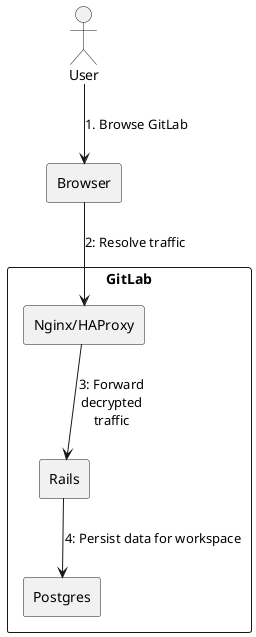
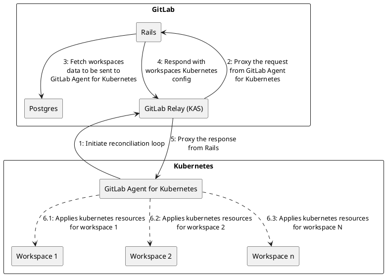
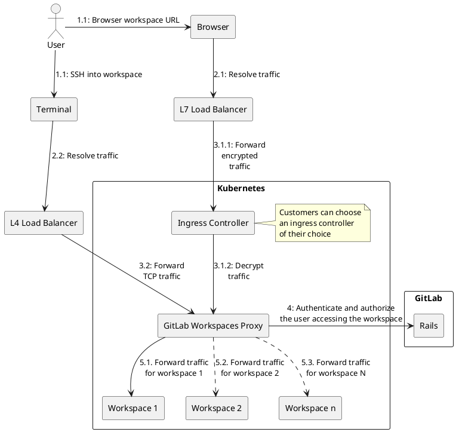
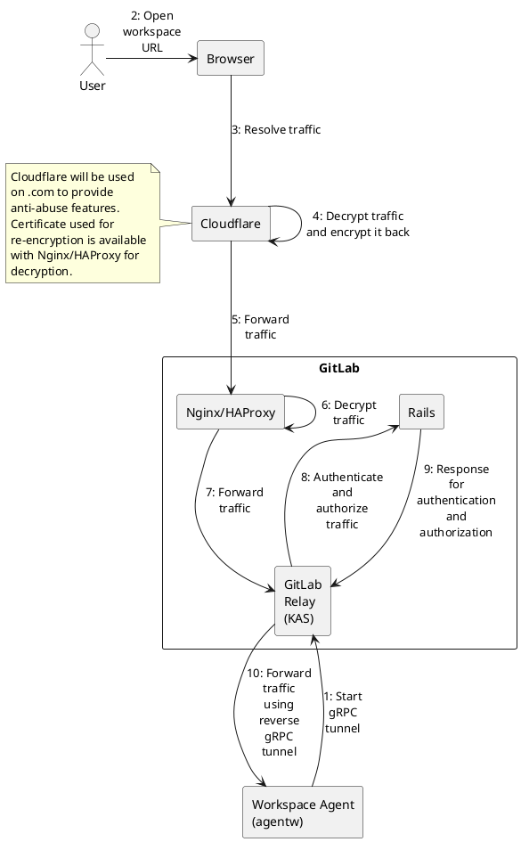
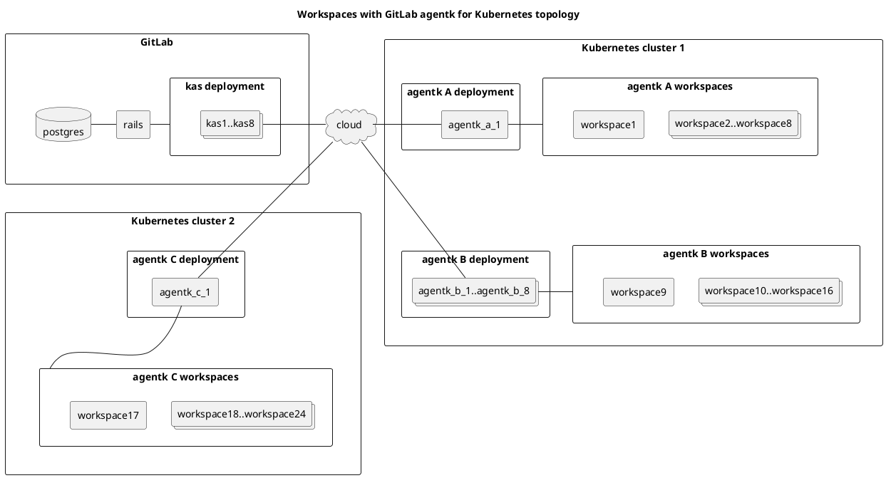
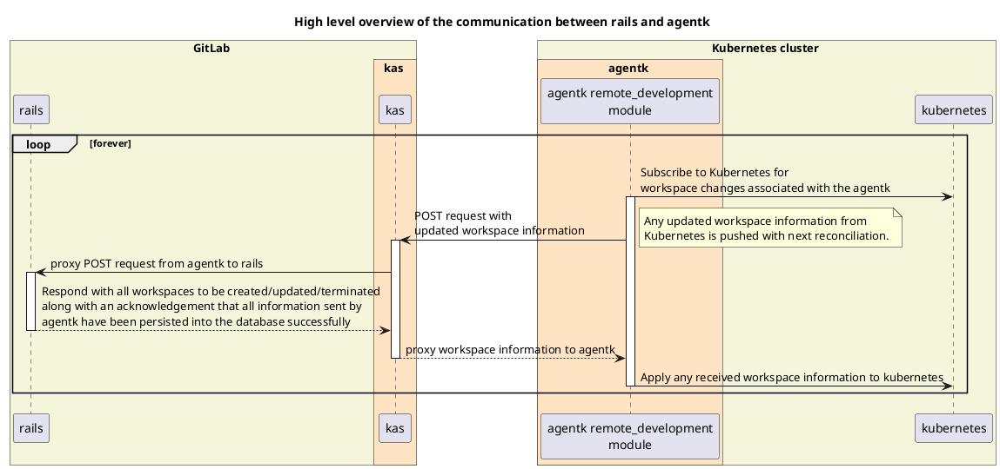

## 概要

Workspaces は [GitLab agentk for Kubernetes](https://docs.gitlab.com/user/clusters/agent/index.html) プロジェクト内のモジュール（`remote_development`）として提供されます。
このアーキテクチャの全体的な目標は、Kubernetes クラスターで動作するすべてのワークスペースの **実際の状態** が、ユーザーが設定した **望ましい状態** と一致するよう調整し続けることです。

これは以下の方法で実現されます:

1. ワークスペースの望ましい状態は、GitLab UI または API でのユーザー操作から取得され、Rails データベースに保存されます。
1. agentk と Rails の間に調整ループが存在し、次の動作を行います:
   - agentk を通じて Kubernetes クラスターからワークスペースの実際の状態を取得し、保存するために Rails に送信します。
   - Rails は実際の状態と望ましい状態を比較し、すべてのワークスペースについて実際の状態を望ましい状態に合わせるためのアクションを返します。

## システム設計

### ワークスペースの作成/更新/削除に対するユーザーアクション



### GitLab Agent for Kubernetes の Rails との調整



### ワークスペースへのユーザーアクセス

#### GitLab Workspaces Proxy を使用する場合



#### GitLab Agent for Workspaces（agentw）を使用する場合

NOTE: 以下の図は HTTP トラフィックのフローのみを示しています。SSH トラフィックのフローは調査が必要であり、https://gitlab.com/groups/gitlab-org/-/epics/13984 に依存します。



## GitLab Agent for Kubernetes のトポロジー

- Kubernetes API はこの図には示されていませんが、agentk を通じてワークスペースを管理していることを前提としています。
- 各 Kubernetes クラスター内のコンポーネント数は任意です。



## Rails と agentk 間の通信のハイレベル概要



## Rails と agentk 間のメッセージ種別

agentk は Rails にさまざまな種類のメッセージを送信して、異なる情報を伝えることができます。agentk が送信するメッセージの種類によって、Rails の応答内容が変わります。

メッセージの種類は以下のとおりです:

- `reconcile` - ワークスペースの現在の状態を保存するために Rails に送信されるメッセージ。`update_type` フィールドで指定される更新の種類は `full` と `partial` の 2 種類があります。どちらの更新種類でもペイロードのスキーマは同じです。
  - `full`
    - agentk が行うアクション:
      - agentk が管理する Kubernetes クラスター内のすべてのワークスペースの現在の状態を送信します。
      - agentk と Rails 間の一貫性を保つために、agentk は完全な調整サイクルのたびにこのメッセージを送信します。完全な調整サイクルは以下のタイミングで発生します:
        - agentk の起動または再起動時
        - リーダー選出後
        - 完全調整間隔の設定（デフォルト: 1 時間ごと）に従った定期的なタイミング
        - agentk の設定が更新されたとき
    - Rails が行うアクション:
      - 現在の状態で Postgres を更新し、agentk が管理するすべてのワークスペースと Rails が Postgres に保存した最新のリソースバージョンを返します。
      - 保存されたリソースバージョンを agentk に返すことで、そのワークスペースの更新が Rails 側で正常に処理されたことを確認します。
      - この保存済みリソースバージョンは、`partial` 更新種別の `reconcile` メッセージで agentk から Rails に最新のワークスペース変更のみを送信するためにも役立ちます。
  - `partial`
    - agentk が行うアクション:
      - Postgres にまだ保存されていない最新のワークスペース変更を Rails に送信します。この保存済みリソースバージョンにより、agentk から Rails への最新のワークスペース変更のみの送信が可能になります。
    - Rails が行うアクション:
      - 現在の状態で Postgres を更新し、Kubernetes クラスターで作成/更新/削除すべきワークスペースと Rails が Postgres に保存した最新のリソースバージョンを返します。
      - 作成/更新/削除すべきワークスペースは、`desired state updated at >= agentk info reported at` というフィルターによって大まかに算出されます。
      - 保存されたリソースバージョンを agentk に返すことで、そのワークスペースの更新が Rails 側で正常に処理されたことを確認します。

## イベント駆動ポーリングと完全・部分調整の比較

当初、次の調整ループを待たずに agentk に即座にポーリングするよう指示できることが望ましいと考えられていました。これにより以下のメリットが期待されていました:

1. オンデマンドで完全調整をトリガーする機能が得られ、agentk のモジュール状態をオンデマンドで復旧/リセットできます。
1. アーキテクチャをよりイベント駆動かつリアルタイムにするだけでなく、調整ポーリングの間隔を長くしてインフラへの負荷を軽減するのにも役立ちます。

しかし、想定される解決策を評価した結果、この機能を必要とするケースは非常に少なく/まれであるとの結論に至りました。特に実現可能な選択肢の複雑さを考慮するとなおさらです。ほとんどのケースでは状態の最終的な調整で十分であり、定期的に実施される完全調整（部分調整と比べて長い間隔）によって単純に実現できます。

詳細はこちらの [Issue](https://gitlab.com/gitlab-org/gitlab/-/issues/387090) と [結論コメント](https://gitlab.com/gitlab-org/remote-development/gitlab-remote-development-docs/-/merge_requests/13#note_1282495106) をご覧ください。

## ワークスペースの状態

- `CreationRequested` - ワークスペースの初期状態。ユーザーによる作成リクエストがまだ処理されていない状態
- `Starting` - 使用可能になる準備中
- `Running` - 使用可能な状態
- `Stopping` - スケールダウン処理中
- `Stopped` - 永続ストレージは残っているがワークスペースはスケールダウンされた状態
- `Failed` - `agentk` によって Kubernetes リソースが適用されたが、さまざまな理由（コンテナのクラッシュなど）で準備ができていない状態
- `Error` - `agentk` による Kubernetes リソースの適用が失敗した状態
- `RestartRequested` - ユーザーがワークスペースの再起動をリクエストしたが、まだ正常に再起動されていない状態
- `Terminating` - ユーザーがワークスペースの終了をリクエストし、アクションが開始されたがまだ完了していない状態
- `Terminated` - 永続ストレージが削除されワークスペースがスケールダウンされた状態
- `Unknown` - ワークスペースの実際の状態を把握できない状態

### `actual_state` の取り得る値

`actual_state` の値は、agentk がリッスンして Rails に送信する Kubernetes デプロイメント変更の `status` 属性から決定されます。

以下の図は、agentk から受信した `status` 値に基づいた `Workspace` レコードの `actual_state` 値の典型的なフローを示しています。`status` は異なる条件に基づいてワークスペースの `actual_state` を導出するために解析されます。

ただし、agentk からの受信が何らかの理由（急速な状態遷移、イベント送信の失敗など）で行われなかった過渡的な `status` 更新があった場合、これらの状態のいずれかがスキップされることがあります。

```plantuml
[*] --> CreationRequested
CreationRequested : Initial state before\nworkspace creation\nrequest is sent\nto kubernetes
CreationRequested -right-> Starting : status=Starting
CreationRequested -right-> Error : Could not create\nworkspace

Starting : Workspace config is being\napplied to kubernetes
Starting -right-> Running : status=Running
Starting -down-> Failed : status=Failed\n(container crashing)

Running : Workspace is running
Running -down-> Stopping : status=Stopping
Running -down-> Failed : status=Failed\n(container crashing)
Running -down-> Terminating : status=Terminating
Running -right-> Error : Could not\nstop/terminate\nworkspace

Stopping : Workspace is stopping
Stopping -down-> Stopped : status=Stopped
Stopping -left-> Failed : status=Failed\n(could not\nunmount volume\nand stop workspace)

Stopped : Workspace is Stopped\nby user request
Stopped -left-> Failed : status=Failed\n(could not\nunmount volume\nterminate workspace)
Stopped -right-> Error : Could not\nstart/terminate\nworkspace
Stopped -down-> Terminating : status=Terminating

Terminating : Workspace is terminating
Terminating -down-> Terminated : status=Terminated

Terminated: Workspace has been deleted

Failed: Workspace is not ready due to\nvarious reasons(for example, crashing container)
Failed -up-> Starting : status=Starting\n(container\nnot crashing)
Failed -right-> Stopped : status=Stopped
Failed -down-> Terminating : status=Terminating
Failed -down-> Error : Could not\nstop/terminate\nworkspace

Error: Kubernetes resources failed to get applied
Error -up-> Terminating : status=Terminating

Unknown: Unable to understand the actual state of the workspace
```

### `desired_state` の取り得る値

`desired_state` の値はユーザーの Rails へのリクエストから決定され、Rails から agentk に送信されます。

`desired_state` は `actual_state` のサブセットで、`Running`、`Stopped`、`Terminated`、`RestartRequested` の値のみを持ちます。
Rails の状態調整ロジックは、ワークスペースが回復不能な状態にない限り、`actual_state` を `desired_state` の値に継続的に遷移させようとします。

`desired_state` のみで有効な追加状態として `RestartRequested` があります。
この値は `actual_state` では有効ではありません。Rails が起動中のワークスペースの再起動を開始するために必要です。agentk から `Stopped` の `status` が受信されるまで（再起動リクエストが成功して進行中または完了したことを示す）、この状態は継続します。
この時点で、ワークスペースを再び起動するために `desired_state` が自動的に `Running` に変更されます。
ワークスペースの再起動に失敗して `Stopped` ステータスを受信しなかった場合、新しい `desired_state` が指定されるまで `desired_state` は `RestartRequested` のままになります。

```plantuml
[*] --> Running
Running : Workspace is running
Running -down-> Stopped : status=Stopped
Running -left-> Terminated : status=Terminated

Stopped : Workspace is Stopped\nby user request
Stopped -up-> Running : status=Running
Stopped -down-> Terminated : status=Terminated

Terminated: Workspace has been deleted

RestartRequested : User has requested a workspace restart.\n**desired_state** will automatically change\nto **'Running'** if actual state\nof **'Stopped'** is received.
RestartRequested -left-> Running : status=Running
```
