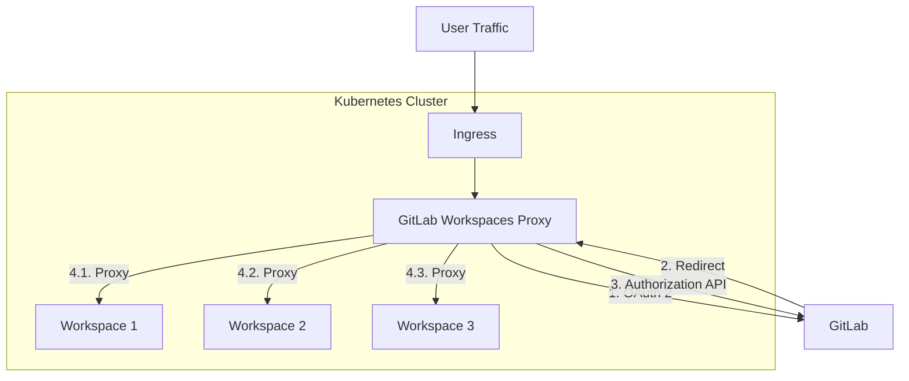
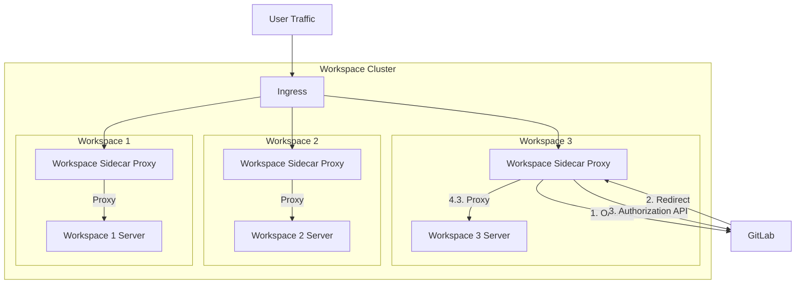

## コンテキスト

[002: ワークスペースのコンピュートとストレージのプロビジョニング](./002_provision_compute_and_storage.md) で、必要なすべてのインフラはユーザーが用意し、GitLab Agent for Kubernetes にエージェントモジュールを追加することで GitLab と統合されることを決定しました。

[003: ワークスペースの作成とアクセスに関するユーザー認可](./003_authorizing_user_to_create_and_access_workspace.md) で、ワークスペースにアクセスできるのはその作成者のみとすることを決定しました。

ユーザーのインフラでこれらの認可ルールを適用する方法が必要です。

## 決定

ユーザーの Kubernetes クラスターにデプロイされる新しいサービスを作成します。
このサービスは、それぞれのワークスペースにプロキシする前に、すべてのユーザートラフィックの認証と認可を担当します。

特定のドメインで Kubernetes クラスターに入ってくるすべてのトラフィックは `gitlab-workspaces-proxy` に転送され、そのトラフィックをどのように処理するかを決定します。

詳細は [こちら](https://gitlab.com/groups/gitlab-org/-/epics/9940) をご覧ください。

## 結果

ユーザーは Workspaces をセットアップするために、GitLab Agent for Kubernetes と共に Kubernetes クラスターに別のコンポーネントをインストールする必要があります。

## 代替案

サイドカープロキシアプローチの使用を検討しました。このアプローチでは、トラフィックをプロキシするアプリケーションが各ワークスペースに注入され、ワークスペースへのすべてのトラフィックがこのプロキシを通じて流れます。プロキシは単一のワークスペースのトラフィックのみを処理します。Kubernetes の Ingress コントローラーが適切なプロキシに転送します。プロキシと Kubernetes Pod 内にある同じネットワーク名前空間を共有するため、プロキシはループバックインターフェース（localhost）経由でワークスペースと通信できます。

集中型アプローチの方が変更/アップグレードを容易に行えるため、このアプローチは採用しませんでした。

また、[Kubernetes Ingress](https://kubernetes.io/docs/concepts/services-networking/ingress/) リソースに認証 [アノテーション](https://kubernetes.io/docs/concepts/overview/working-with-objects/annotations/) を追加して、[Ingress コントローラー](https://kubernetes.io/docs/concepts/services-networking/ingress-controllers/)（例: `ingress-nginx`）が認証と認可を別のプロセスに委任できるようにすることも検討しました。課題は、これらのアノテーションが標準化されていないことです。[Ingress 仕様](https://kubernetes.io/docs/concepts/services-networking/ingress/) の一部ではなく、異なる Ingress コントローラーでサポートされていない場合があります。各 Ingress コントローラーに対して認証プロバイダーをセットアップするプロセスをドキュメント化する必要があります。このためこのアプローチは採用しませんでした。
