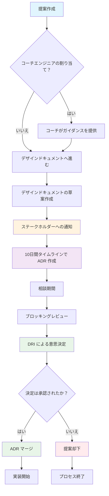

GitLab のエンジニアとして、私たちはソフトウェアの**進化**を主導し、プロアクティブな作業、リアクティブな作業、イノベーションの適切なバランスを常に模索しています。GitLab について最もよく知る人たちの知識を活用し、全員の生産性を高めることができるものに取り組むよう人々をエンパワーしながら、何が重要な作業で何がそうでないかを判断するよう努めています。実験とイノベーションは私たちの作業の核心であり、**コラボレーション、成果、イテレーションに集中して**目標を達成します。

成長とともに、複雑さが増します。作業への有機的なアプローチは、最も効率的であることを確保するためにときに助けを必要とします。助けは、技術的アプローチの検証、チームと部門間の組織的な整合の確保、主要な意思決定者への優先事項の推進という形で現れることがあります。**テクニカルエンジニアリングリーダーは、エンジニアがこれらの課題を乗り越えるのを助ける任務を担っています**。**アーキテクチャデザインワークフロー**は、複雑な問題を技術的・組織的の両面から解決するためのガイダンス、影響力の増幅、イテレーションフレームワーク、追加の可視性を提供することを意図しています。

## デザインドキュメント

デザインドキュメントは、ワークフローが中心に置くプライマリアーティファクトです。このハンドブック[ユーザー向けドキュメント](https://gitlab.com/gitlab-com/content-sites/handbook/-/tree/main/content/handbook/engineering/architecture/design-documents)としてバージョン管理された文書であり、[公開されているものの一覧](design-documents/)もそちらで確認できます。デザインドキュメントの一部は、設計文書が機密である必要がある場合やカスタムプロジェクト設定が必要な場合に別のリポジトリに存在します。例については [GCP 統合デザイン文書](https://gitlab.com/gitlab-org/architecture/gitlab-gcp-integration/design-doc)を参照してください。

内部デザインドキュメントと追加リソースについては、[内部デザインドキュメント](https://internal.gitlab.com/handbook/engineering/architecture/)を参照してください。

フィーチャーまたはメンテナンスタスクのいずれかで、単一のマイルストーンよりも長い長期的なイテレーションは、焦点、コンセンサス、概念的整合性、アーキテクチャの一貫性、または何かをなぜどのように行っているかの整合を失いやすいため、困難です。

デザインドキュメントは、前進するにつれて実装を導く技術的ビジョン、一連の原則、主要なアーキテクチャ上の意思決定を説明します。これはチームの整合を保つためのガードレールとして機能します。デザインドキュメントは、各イテレーション後に新しい洞察と知識で継続的に更新され、時間とともにさらに有用になります。

1段落のデザインドキュメントから始め、途中で学ぶことに応じて探索的な作業を進めながらコンテンツを発展させることができます。デザインドキュメントは実装を開始する前に事前に書かれた完全で詳細なブループリントである必要はありません。

### なぜデザインドキュメントはマージリクエストで追跡されるのか？

デザインドキュメントはバージョン管理されたアーティファクトとして追跡されます。これにより、誰でもマージリクエストの形で変更を提案できます。マージリクエストはマージ前にレビューおよび承認できます。エンジニアは通常、マージリクエストの差分にコメントを残すことでコードレビュープロセスでフィードバックを提供します。ここでも同じプロセスを使用しています。そうすることで、次のことを確保できます:

- 特定の提案の現在の状態を表す単一のドキュメントが常に存在する
- 方向性を理解するために複数の Issue やスレッド化された議論を横断する必要がない
- フィードバックは具体的な提案やコメントの形で与えられ適用できる
- 提案/変更/決定は「コードとしての設計」ワークフローを使用してマージリクエストで行われる

### アーキテクチャデザインワークフローを使用する必要があるか？

ワークフローの使用は、以下の条件のいずれかを満たす変更に推奨されます:

- 複数の機能、チーム、部門間での調整が必要
- システム全体の安定性、可用性、パフォーマンスに影響を与える可能性がある
- 複数のマイルストーンにわたって複数のチームメンバーが関与している
- GitLab を重大な方法で変更する
- GitLab の運用に大幅に影響する
- ディストリビューションとデプロイメント間で特別な処理を導入する
- Rails モノリスの外部に新しいサービス、または追加のデータソースを追加する

以下の場合、このワークフローの起動は不要です:

- 不安定なテストの修正
- コードの軽微なリファクタリング
- 小さなパフォーマンス改善
- 依存関係のバージョンアップグレード

アーキテクチャデザインワークフローの起動は、豊富な経験があり、GitLab で何度も行ってきた複雑なことを行っている場合にも不要です。そのような場合、コーチを関与させてワークフローを使用することに利点がない可能性があります。

ワークフローを使用するか、通常の軽量設計プロセスを使用するかを決定する際には、コスト（プロセスオーバーヘッド）/利益（ガイダンス、コーチング、可視性）の比率を考慮した実用的なアプローチを使用してください。

## アーキテクチャデザインワークフロー

### 概要

1. デザインドキュメントの作成を始めましょう！コンテンツが[SAFE](/handbook/legal/safe-framework/)かどうかによって、最初はプライベートスペースで行うことをお勧めします。何から始めるか分からない場合は[テンプレート](https://gitlab.com/gitlab-com/content-sites/handbook/-/blob/main/content/handbook/engineering/architecture/design-documents/_template.md?plain=1)を使用できます。いくつかの提案とステータス追跡に使用する Markdown フロントマターがあります。
1. まだ行っていない場合で SAFE であれば、[マージリクエスト](https://gitlab.com/gitlab-com/content-sites/handbook/-/tree/main/content/handbook/engineering/architecture/design-documents)を作成してください。
1. 追加の可視性と透明性のために、デザインドキュメントへのリンクと簡単な説明を Slack の内部[`#architecture`](https://gitlab.slack.com/archives/CJ4DB7517)チャンネルに投稿してください。
1. デザインドキュメントが複数のマイルストーンにわたる複雑な取り組みを説明する場合、デザインドキュメントに技術ビジョンを説明するプロセス全体を通じてサポートしてくれる[コーチエンジニア](#コーチエンジニア)（通常は Principal+ エンジニア）を関与させることをお勧めします。
1. セキュリティに敏感なコンポーネントには、デザインドキュメントに予備的な[脅威モデル](/handbook/security/product-security/security-platforms-architecture/application-security/threat-modeling/)を含めてください。これは主要なセキュリティ境界、潜在的な攻撃ベクトル、セキュリティの仮定、緩和戦略を特定する必要があります。ガイダンスについては既存の[脅威モデルの例](https://gitlab.com/gitlab-com/gl-security/product-security/appsec/threat-models/-/tree/master)を参照してください。
1. ステークホルダーと[ドメインエキスパート](#ドメインエキスパート)と協力して、設計をレビューしてもらいコメントを受け取りましょう。デザインドキュメントは最初のイテレーションで包括的または完全である必要はありません。重要な設計の側面、基本的な設計領域、主要な決定を発見するにつれて、イテレーションで洗練・充実させることができます。初期のデザインドキュメントをできるだけ早くマージすることをお勧めします。
1. 探索、研究、実装を始めましょう！できるだけ早くコードの作成を始めましょう！
1. 新しい詳細を発見し、基本的な設計上の決定を下し、実装の進め方についてより詳しく学ぶにつれて、並行してデザインドキュメントをイテレートしてください。ドキュメントのコンテンツを頻繁に洗練してください。
1. 既存のデザインドキュメントを見て、ワークフローで成功したエンジニアの過去の経験から学びましょう。
1. 次回全員がより生産的になるようなことを学んだ場合は、ワークフローを改善してください！

### ロール

#### 著者

元の著者として、あなたはデザインドキュメントの作成を担当する主要な DRI です。

著者はデザインドキュメントを作成するプロセスを推進する責任を持つ DRI です。プロセス中にコーチ、エンジニアリングマネジメントリーダー、プロダクトマネジメントリーダー、ドメインエキスパート、機能エキスパートと協力できます。

#### コーチエンジニア

コーチはメンターおよびコーチとして著者をプロセス全体でガイドできる、複雑な技術的取り組みにすでに関与していた Principal+ エンジニアです。

デザインドキュメントの作成プロセスにコーチを関与させる目的は、複雑なアーキテクチャ変更の導入について最もよく知る人々が知識と視点を共有し、組織的な課題を乗り越えるのを助け、提案がロードマップと整合していることを確保し、エンジニアリングリーダーが作業を優先するのを助けることです。

**コーチエンジニアの関与はオプションです**が、以下の場合には強く関与することを勧めます:

1. デザインドキュメントに概説された提案を受け入れることが、実装に6つ以上のマイルストーンを費やす必要があることを意味する場合。
1. チームや部門から複数の人々が長期間実装に関与する必要がある場合。
1. 単一のチームでは設計文書に記述されたビジョンを実装するには不十分なクロスファンクショナルまたは基盤的な取り組みである場合。
1. チームが提案をデザインドキュメントで説明するのに苦労していて、コーチのガイダンスとメンタリングから大きく恩恵を受ける場合。

#### エンジニアリングマネジメントリーダー

コーチは提案を評価するための適切な経営エンジニアリングリーダーを特定するのを助けることができます。マネージャーは主要な意思決定者であり、最終的には提案が承認・資金調達されるための組織的な複雑さを乗り越えるのを助けます。

#### プロダクトマネジメントリーダー

エンジニアリングマネジメントリーダーとコーチは、提案で協力するための適切なプロダクトマネージャーを特定するのを助けることができます。PM は、常に進行中の作業の流れに提案を含めるのを助ける意思決定者です。PM はまた、達成するために新しい人材を採用する必要があると考える場合や、それに取り組むことができる人を見つける他のプロセスを起動する場合に、提案への資金調達を助けることができます。

#### ドメインエキスパート

[ドメインエキスパート](https://docs.gitlab.com/ee/development/code_review.html#domain-experts)は、1つ以上の特定の領域について深い理解を持つエンジニアです。ドメインエキスパートは:

1. グループ/ステージ/セクションが取り組んでいるフィーチャーと変更の概念的整合性を確保するのを助けます
1. EM、PM、他のエンジニアと協力して、関心領域での作業の質を確保するのを助けます
1. 関心領域でのレバレッジとなる必要なアーキテクチャ的・概念的変更を計画・草案するのを助けます
1. [Application Security](/handbook/security/product-security/security-platforms-architecture/application-security/#contacting-us) はセキュリティに敏感なコンポーネントが関与する場合に脅威モデルのガイダンスとレビューを提供できます。

ドメインエキスパートは通常、コードベースとドメインの具体的な側面について最もよく知るエンジニアであり、通常は個人コントリビューターですが、複雑なアーキテクチャ変更を導入するプロセスについての深い理解はまだ欠けているかもしれません。そのため、ドメインエキスパートとコーチの間のコラボレーションは非常に有用かもしれません。

#### 機能エキスパート

機能エキスパートは、[Security](/handbook/security/#-contacting-the-team)、QA、Database、インフラを含む特定の機能領域にわたる深い知識を持つエンジニアです。デザインドキュメントの作成中には、サイクルの早い段階で認識を生み出し、インプットを提供できるよう、これらの機能エキスパートを関与させることを常に検討すべきです。

### デザインドキュメントの構造

デザインドキュメントは通常、複数のセクションに分かれています:

1. はじめに
1. ビジネス目標
1. 高レベル概要
1. ゴールと主要な成果
1. 現在の状態のポインター
1. 基本設計領域
1. 主要な設計上の決定
1. 脅威モデル
1. 実装詳細
1. まとめと参考文献

著者はデザインドキュメントに含めるセクションを決定します。マージされたデザインドキュメントは[公開ハンドブック](design-documents/)に公開されます。

#### はじめに

はじめには、なぜ何かを行うのか、その達成方法へのアプローチを説明する高レベルのエグゼクティブサマリーです。ここでのオーディエンスは非常に広いため、過度な技術的言語を避けることが重要です。

#### 目標

アーキテクチャデザインワークフローが使用されているということは、達成しようとしていることが非自明で会社にとって費用がかかると思われることを意味します。このような投資には確固としたビジネス上の正当性が必要であり、どのようなビジネスへの影響があるかを把握している必要があります。デザインドキュメントに予想されるビジネス成果に関するメモを追加することをお勧めします。

#### 概要

デザインドキュメントの主なコンテンツは通常、何かをどのように実装したいかについての高レベルな概要です。

デザインドキュメントの書き方には多くの方法があります。デザインドキュメントの作成に実用的なアプローチを取ることを奨励します: あなたのケースでうまく機能する方法を選択してください。よく使われる方法の1つは、概要セクションを短く保ち、最新の状態に保つことです。どのように書けるかをよりよく理解するために、有用であることが証明された既存のドキュメントを見つけてください。

#### 決定

デザインドキュメントの基本的な側面に関して行われた主要な決定を文書化することを強く推奨します。これらの決定は実装中の重要なチェックポイントとなり、新しい人々に方向性についての明確さをもたらします。

決定を文書化するには、軽量なプロセスを使用できます:

- 基本的な設計上の問題を特定してメモする。
- 必要に応じて複雑な決定をより小さなものに分解する。
- 何について決定する必要があるかのコンテキストを説明する。
- 考慮された利点、トレードオフ、代替案を文書化する。
- 特定のソリューションが選ばれた理由を文書化する。

軽量なアーキテクチャ決定記録（ADR）を使用できます。
[こちらに例があります](https://gitlab.com/gitlab-org/gitlab/-/merge_requests/132129)。ADR をサブページとして追加し、デザインドキュメントのメインページの `Decision` セクションからリンクすることをお勧めします。ADR には通常いくつかの主要なセクションがあります: コンテキスト、決定、結果、考慮された代替案。

重要な設計領域の例は「クライアント-サーバー通信プロトコル」であり、決定の例は「データシリアライゼーション形式として Protocol Buffers を使用する」です。

チームメンバーはしばしば**不変の ADR**を書きます。決定を変更する必要がある場合は、それが置き換えられたことをメモし、新しい決定とともに新しい ADR を作成できます。これにより、デザインドキュメントを最新の状態に保つために必要な作業が削減されます。例については [GCP 統合](https://gitlab.com/gitlab-org/architecture/gitlab-gcp-integration/design-doc)デザインドキュメントを参照してください。

まだ決定を下していないが、下す必要があることが分かっている既知のエンジニアリング領域を文書化することも理にかなうことがあります。これらを「基本設計領域」と呼びます。

#### 実装詳細

実装を進め、プロジェクトをイテレートするにつれて、各イテレーション後に得られたフィードバックを継続的に取り込み、デザインドキュメント自体に追加することがよくあります。技術的な詳細は、デザインドキュメントのメインページ（[概要](#概要)のある）を短く読みやすく保つためにサブページに入れることができます。実装詳細は Issue/エピックに抽出することもできます。

### 完遂するために

各デザインドキュメントには DRI が必要です。DRI は、[ワーキンググループ](/handbook/company/working-groups/)などの既知の組織ツールとフレームワークを使用して、デザインドキュメントをどのように進め、実装するかを決定します。

通常、WG か、デザインドキュメントの実行に集中する専任チームのいずれかで進めます。

#### 増幅

誰でも取り組むべきと思う変更を提案できます。これらの変更が単一の個人コントリビューターが処理するには複雑すぎる場合（複雑なバックステージ改善、アーキテクチャ変更、生産性や効率性の改善）や、複数のイテレーションやチームにまたがる場合、提案をデザインドキュメントに取り込むためにアーキテクチャデザインワークフローを使用することが役立つ場合があります。提案の著者はコーチエンジニアと協力し、適切な人々を関与させて提案が適切に説明され、実装を検討される可能性を確保します。

複雑な変更やフィーチャーを、何ヶ月あるいは何年もかけて実装することの課題を認識しています。そのような作業を始め、長期的に資金を調達し、実装が進む中での破壊的な気散じを避けることは困難です。

デザインドキュメントは個々のエンジニアによって書かれることがよくありますが、これらのドキュメントは通常、遠大なビジョンを説明しています。そのようなビジョンを実装するには時間がかかり、資金調達が必要な場合があります。アーキテクチャデザインワークフローは、チームがこの種の作業を完遂するのをより良くサポートするために構築されました。成功の可能性を高めるために確立されたいくつかの関連プロセスがあります。

支援のために設計されたプロセスの一つは、エンジニアリングフェローとエンジニアリングリーダーシップなどとの月次アーキテクチャエボリューション同期ミーティングです。このミーティングの目的は:

- 主要なデザインドキュメントの可視性と認識を高める。
- 組織全体の大規模なイニシアチブを調整する。
- 最も重要なイニシアチブについての状況更新を提供する。
- スタッフィングと資金調達に関するガイダンスを受ける。

#### イテレーション

アーキテクチャデザインワークフローは、プロダクションコードの作成を始める前に設計フェーズにどれだけの時間を費やすべきかを指示しません。デザインドキュメントの作成とコードの作成をほぼ同時に始めることをお勧めしますが、特定のケースでは、実際の実装が始まる前に注意深い設計により多くの時間を費やし、その後実現可能性調査を行うことが有益な場合があります。前者の場合、デザインドキュメントは実際のソリューションを構築するのと並行して進化する技術的アーティファクトです。後者の場合、実装が始まる前に実装提案を行い、前進するにつれて必要に応じてデザインドキュメントを洗練します。いずれの場合も、デザインドキュメントは変化し続けます。デザインドキュメントを書いて、その過程で何も変えずに実装することはほとんど不可能です。実用的なアプローチを使用してください。必要に応じてコーチエンジニアを関与させてください。[ここに正解も不正解もありません](https://docs.google.com/document/d/1UKAK51eyy7dOA9pRWz_VDEVhO6c2VBHoQ6MUB0RdvM8/edit#bookmark=id.9x1w2dmm4v52)。

## 意思決定プロセス

### ADR レビュータイムライン

- ADR は限られたレビュー期間を持ちます（通常10日間）。
- 期限はすべてのステークホルダーに事前に伝えられます。
- 期日に、決定が下され ADR がマージされます。

### DRI の責任

- DRI（Directly Responsible Individual）は最終的に決定に責任を持ちます。
- DRI は関連するステークホルダーと相談する必要がありますが、最終的な権限を持ちます。
- DRI はエピックの担当者およびデザインドキュメントの著者として識別される必要があります。
- DRI はスコープと影響に基づいて誰と相談する必要があるかを決定します。

### 相談権限 vs. ブロック権限

- **相談権限**: 相談すべきだがブロックできないグループ（例: ドメインエキスパート、機能エキスパート）。
- **ブロック権限**: 提案をブロックできるグループ（例: セキュリティ関連の変更に対する App Sec）。
- この区別はデザインドキュメントで明確にすべきです。

## ステークホルダーコミュニケーション

### 早期通知

- デザインドキュメントが提案されたらすぐにステークホルダーに通知すべきです。
- MR でのすべてのステークホルダーをレビュアーとして追加し、主要なコミュニケーションチャンネルとして GitLab の Todo とレビューシステムを使用してください。
- 追加の可視性のために関連する Slack チャンネルに投稿してください。
- レビュー期間と決定日の明確なタイムラインを含めてください。

### 意思決定の透明性

- すべての決定と根拠は ADR に文書化されるべきです。
- ステークホルダーは意思決定がなされた理由を理解すべきです。
- フィードバックは取り込まれなくても認められるべきです。

## ビジュアルワークフロー

以下の図はアーキテクチャデザインワークフローのプロセスを示しています:

### 主要なプロセスのポイント

1. **提案作成**: 誰でもアーキテクチャの変更を提案できます
2. **コーチの割り当て**: 複雑なイニシアチブには推奨されますがオプションです
3. **ステークホルダーへの通知**: 早期のコミュニケーションにより透明性が確保されます
4. **ADR タイムライン**: 明確な期日を持つ10日間のレビュー期間
5. **相談 vs. ブロッキング**: 助言的役割とブロッキング役割の明確な区別
6. **DRI の決定**: 最終的な権限は Directly Responsible Individual にあります

### 最後に

作業が完了すると、デザインドキュメントはもはや将来を見通すビジョンを表すものではなく、代わりにコンテンツは完了した作業と行われた決定を説明します。そのため、デザインドキュメントはより有用な知識共有アーティファクトになるよう更新され、新しいエンジニアやコントリビューターが設計決定とアーキテクチャの選択に素早く慣れ親しむのを助けるべきです。不変のアーキテクチャ決定ログ（ADR）を使用している場合、デザインドキュメントの更新はそれほど手間がかからないはずです。代わりに、ドキュメントとして使用することが意味ある目的に役立たない場合はデザインドキュメントをアーカイブできます。

### デザインドキュメントのステータス定義

アーキテクチャワークフロー全体で明確さと一貫性を提供するために、以下のステータスを使用して各デザインドキュメントの現在の状態を示します:

- `proposed`: 設計が草案され、レビューまたはフィードバックを待っています。まだ正式に受け入れられていません。
- `accepted`: 設計がレビューされ承認されました。この設計に基づいて作業を開始できます。
- `ongoing`: 設計に基づく作業が積極的に実装されています。
- `implemented`: 作業が完了し、設計が完全に実装されました。
- `rejected`: 設計はレビューされましたが受け入れられませんでした。現在の形では実装されません。

これらのステータスはアーキテクチャ設計のライフサイクルを追跡し、現在の状態への可視性を提供します。
