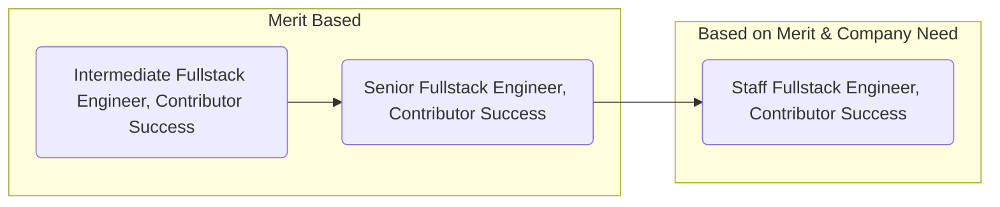
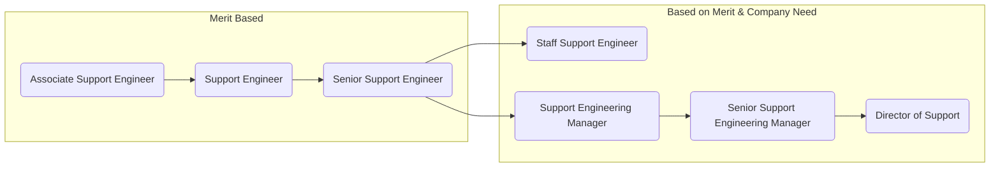

## キャリア開発の3つの要素

キャリアを発展させるための重要な要素が3つあります:

### 構造

昇進のトラックに乗っている（または乗りたい）チームメンバーは、マネージャーとのキャリアコーチング会話に参加すべきです。このプロセスに関するいくつかの基本情報は[People Ops](/handbook/people-group/learning-and-development/career-development/#career-mapping-and-development)ハンドブックにあります。会話を始めるための具体的なコーチングプランテンプレートを以下に示します:

- [シニアエンジニア](https://docs.google.com/document/d/11xZpY2RuTldp1g6bHRFYKwwlQjNjYaPquLPo5uD6hrg/edit#)
- （他は追って追加予定）

これらのドキュメントをエンジニアリングのキャリアマトリックスを中心に構築したいと考えています。このキャリアマトリックスはまだ開発中のため、これらのドキュメントは現在[職務要件](/job-description-library/engineering/)に基づいています。

開発中の最初のキャリアマトリックスは[エンジニアリングの個人コントリビューター](/handbook/engineering/careers/matrix/)向けです。

チームメンバーが昇進の準備ができていると判断された場合、マネージャーは[People によって概説されている昇進プロセス](/handbook/people-group/promotions-transfers/)に従う必要があります。

コーチングプロセスはチームメンバーがチームのより上位のポジションに備えるために何をする必要があるかを理解するのに役立つことを覚えておいてください。昇進プロセスはエンジニアがチームのより上位のポジションに値することを既に実証していることを文書化します。2つのプロセスは関連していますが、互いの代替ではありません。

### 個人のイニシアチブ

ほとんどのキャリア機会は、非公式または公式なリーダーシップの立場に踏み出すことを伴います。そのため、個人のイニシアチブは必要な要素であるとともに資格でもあります。ただし、インクルージョンのために、マネージャーには個人が利用可能な道筋を知り、それを追求する励ましを受けられるよう定期的に昇進の可能性を持ち出すようにお願いしています。マネージャーと個人コントリビューターは少なくとも四半期に一度のキャリア開発の会話を持つよう努力すべきです。

### 機会

GitLab エンジニアリングキャリアトラックは、個人がコントリビュートするための完全な機会パスを提供しています。昇進が発生する前にポジションが利用可能になる必要があるシナリオがあります。エンジニアリングトラックでは、シニアエンジニアからスタッフエンジニアまたはエンジニアリングマネージャーへの昇進（選択したパスに応じて）には、ニーズのあるポジションが存在する必要があります。これらのタイプのロール（例: シニアエンジニア）を超えた進展は役割での在籍期間によって保証されるものではありません。ロールには正当化できる必要性があり、候補者はこれらのロールで活躍できることの実証されたレベルの能力を持っている必要があります。

これらの次のレベルの機会は保証されておらず、キャリアを制限するものとして見るべきではありません。繰り返しになりますが、シニアエンジニアリングロールを例として使用すると、GitLab 内での重要なロールです。シニアレベルで活躍することは成果であり、そのように祝福されるべきです。

## モビリティ原則

エンジニアリングモビリティ原則は会社のモビリティガイドラインへの追加です。このセクションでカバーされていないケースについては、[People Ops 内部モビリティガイドライン](/handbook/people-group/promotions-transfers/#internal-mobility)を参照してください。

キャリアモビリティはキャリア開発の一部であり、ビジネス目標、現在のビジネスチームのキャパシティ、予算の制約への意識的な影響を維持・決定しながら、チームメンバーの開発と機会を支援・奨励します。以下のステップに従う必要があります:

- 内部モビリティはレベル変更のための昇進よりも容易なパスであってはならない
- すべての新しいロールは、すべての潜在的な内部候補者に利用可能にするためのインクルーシブな採用ガイドラインに従って投稿されます（オファーが行われる前に最低5日間オープンである必要があります）
- すべての新しいロールには、特定の予算に対して期待される投資対効果によって決定される推奨レベルがあります。与えられたロールの上下の候補者を検討したいマネージャーは、関心を持つ内部候補者に以下の2つのオプションを提供できます:
  - この変更が会社にどのような利益をもたらすかのビジネス上の正当性でロールを再レベリングする。
    - [テンプレート（Google ドキュメント）](https://docs.google.com/document/d/1BAIty-x7otBpohe5w6Kl8DKD-C2nUS9MCm4JwognfVI/edit#heading=h.5onpwyv1o0vg)が提供されています。コピーを作成してビジネス上の正当性を記入してください。
  - 一定の期間内に期待される基準を満たす候補者の準備の可能性を評価した後、最長6ヶ月の暫定期間に候補者を受け入れ、暫定期間終了時にレベル変更の準備と影響を評価する。
- キャリアパス間の移籍（IC->EM、EM->IC）は、変更を正式に昇進/評価の根拠とともに永続的にする前に4〜6ヶ月の[暫定/代行](/handbook/engineering/careers/#types-of-interim-roles)ベースで利用可能なロールに移動する必要があります
- すべてのロール変更は、ロードマップへの影響と変更が対応するための追加予算を必要とする場合の予算への影響の緩和を含め、毎週 R&D リーダーシップによってレビューされます。
- すべての内部異動候補者は、前チームへの影響に対処するための整合した移行とコミュニケーション計画を持つ必要があります。バックフィルのための計画を確定し、すでに進行中のマイルストーンを完了することを含みます。

## 個人コントリビューション vs. マネジメント

最も重要なのは、純粋に技術的な作業とチームの管理の分岐点です。エンジニアリングマネージャーは自発的にそのトラックを選択し、プレッシャーを感じないことが重要です。私たちはマネジメントが他の同様のクラフトであり、専念を必要とすると信じています。また、すべての人が自分のクラフトに情熱を持つマネージャーに値すると信じています。

シニアレベルのロールに達し、進展を望む場合、純粋に技術的な道に留まるか技術チームの管理を追求するかを決める必要があります。マネージャーは、両方のトラックのタスクを試す機会を提供できます。スタッフレベルのロールとエンジニアリングマネージャーのロールは基本給と評価の面で同等です。GitLab でのスタッフレベルのエンジニアとは何かについての詳細は[エンジニアリング IC リーダーシップページ](/handbook/engineering/careers/ic-leadership/)をご覧ください。

### マネジメントトラックを試してみる

チームメンバーがピープルマネジメントトラックに関心を持っている場合、コミットする前に試す機会を持つことが重要です。マネージャーは利用可能なまたは近々発生するマネージャーロールへの移行を検討しているシニアおよびスタッフエンジニアに複数の機会を提供できます。例としては、グループ会話のホスト、インターンポジションの採用マネージャーとしての行動、重要な成果物の一連のデモ会議の進行などがあります。マネジメント機能を試すこれらの機会は有用であり、マネジメントへの移行を検討している個人に良いコーチング機会を提供できます。一部のエンジニアはこれらの経験を通じて技術的なパスに留まる方が適していると気付き、移行に大幅な時間を投資する前に決断できます。

移行を促進するために、個人コントリビューターロールからエンジニアリングマネージャーロールへ移行する人には、マネージャーと協力して集中した移行計画を作成することをお勧めします。目標は、ロールが自分に合わない場合は IC トラックに戻れるという理解のもと、ピープルマネジメントの責任と課題に集中的に見ていくことです。そのような計画を構築する良い例は[この記事](https://review.firstround.com/this-90-day-plan-turns-engineers-into-remarkable-managers/)にあります。重要なキャリアパスの会話の準備ができたときのもう一つの良いリソースは[この30分のビデオ](https://www.youtube.com/watch?reload=9&v=hMz6QDURQOM&list=PLBzScQzZ83I8H8_0Qete6Bs5EcW3p0kZF&index=6)です。

### 一時的なマネジメントポジション

組織的な必要性がある場合に一時的なマネジメントポジションを作成し、これを会社の組織図に記録します。これらは、ロールに移行している人（[代行マネージャー](/handbook/engineering/careers/#interim-manager)）、キャリア開発パスを決める際にロールを試している人（[代行マネージャー](/handbook/engineering/careers/#interim-manager)または[代理マネージャー](/handbook/engineering/careers/#acting-manager)）、または採用中の空席を埋めているだけで長期的にエンジニアリングマネージャーロールを追求することに関心がない人（[代理マネージャー](/handbook/engineering/careers/#acting-manager)）によって埋められる場合があります。この違いは、一時的なロールが作成される前に個人とチームメンバーに明示すべきです。詳細については[一時的ロールの種類](#types-of-interim-roles)を参照してください。

誰かが一時的なロールを担う場合、会社へのサービスを提供し、おそらく自身の貴重なキャリア開発機会を得ています。そのため、それらの職務に対する低いパフォーマンスは解雇の理由にはなりません。最悪の場合、その人は以前の責任に戻ることになります。ただし、例えば一時的なポジションに就いている間に前の責任または会社の行動規範・倫理への違反を犯した場合など、個人が雇用終了から免除されるわけではありません。

一時的なマネジメントロールを担うよう指定されると、現在のマネージャーはすべての直属の部下を Workday で職務情報変更リクエストで更新し、Workday での代行マネージャーアクセスを付与するためのアクセスレベルリクエストを作成する必要があります。Workday の直属の部下は一般的に[代理マネージャーには移動しません](/handbook/people-group/promotions-transfers/#acting)。

これらのロールに関心のある人は:

- マネジメントへの関心を示す
- 管理対象となる個人コントリビューターロールでの経験がある
- GitLab に少なくとも6ヶ月間勤務し、リモートのみのコンテキストで活躍している
- [GitLab バリュー](/handbook/values/)の模範を示す
- 代理マネージャーロールの場合: 任命期間に応じてタレントレビューを受ける
- 代行マネージャーロールの場合: [Greenhouse](/handbook/people-group/promotions-transfers/#greenhouse-process-requirements)から応募し、選考プロセスを経る

選考プロセス:

- 近々の代行および代理マネージャーロールは、スタッフ/部門会議および/または部門 Slack チャンネルを通じて議論されます。
- リーダーシップは近々のロールへの関心をチームメンバーから集めることができます。
- 上記の基準に基づいて評価が行われ、最も適切なチームメンバーがロールに選ばれます。

#### 一時的ロールの種類 {#types-of-interim-roles}

##### 代理マネージャー

[代理マネージャー](/handbook/people-group/promotions-transfers/#acting)は、一定の時間または他の条件の後に元のロールに戻ることになる、一時的にロールを担う人です。代理マネージャーはキャリア開発パスを決める際にロールを試している場合や、採用中に空席のロールを埋めている場合があります。

##### 代行マネージャー

チームメンバーが長期的にピープルマネージャーロール（マネージャーレベル以上）を追求している場合、以下のインスタンスで代行期間を適用します:

| 現在のレベル | 希望するレベル | 以前のマネジメント経験（3ヶ月以上） | 代行期間の適用 |
|--------------------|----------------|--------------------------------------------|-------------------------------|
| シニア | マネージャー | なし | あり |
| | | あり | あり |
| スタッフ | マネージャー | なし | あり |
| | | あり | なし |
| マネージャー | シニアマネージャー | なし（マネージャー管理） | あり |
| | | あり（マネージャー管理） | なし |
| マネージャー/シニアマネージャー | ディレクター | なし（マネージャー管理） | あり |
| | | あり（マネージャー管理） | なし |

*`以前のマネジメント経験`は前の組織でのマネジメント経験、または GitLab でのマネジメント経験を指します。採用マネージャーが評価するように、代行ロールのスコープと影響が代行期間として同様であった場合、GitLab での[「代理」](/handbook/people-group/promotions-transfers/#acting)ロールのマネジメント経験も3ヶ月の閾値に向けてカウントできます。*

##### 例外

ディレクター以上のポジションには代行は必要ありません。

例外は、代理ロールを務め、恒久的なロールの面接プロセスに合格したチームメンバーの準備状況に応じてケースバイケースでレビューすることもできます。

#### 一時的ロールのタイムライン

一時的ロールの設定タイムラインは3ヶ月であり、この期間を超えないことをお勧めします。

以下の成功基準が3ヶ月経過前に達成された場合、または新しいロール開始前（例えば代理ロールを通じて）にチームメンバーが経験を積んでいた場合など、3ヶ月未満の代行ロールが必要ない状況があるかもしれません。この場合、部門長と People ビジネスパートナーに連絡してレビューを依頼してください。

マネージャーが代行ポジションでチームメンバーの準備を評価するために*3ヶ月以上*必要だと感じる例外的なケースがある場合、部門長と People ビジネスパートナーとこれについて相談すべきです。

代理ロールの場合、期間に対する設定タイムラインはありません。これはケースバイケースでレビューできます。

##### 一時的ロールの成功基準

GitLab での代行マネージャーの主な成功基準は、1回の採用成功です。その人が30日後に採用が真に成功したかどうかを評価できるよう、正式な昇進はその人の採用から30日前には発生しません。新入社員の成功が30日時点で不確定の場合は、確固とした決定が下されるまでレビューを継続します。新入社員が成功しなかった場合でも、代行マネージャーが最終的にフルタイムのロールに移行できなくなるわけではありません。

場合によっては、実用的でなかったり、代行タイムラインや人員計画が代行マネージャーに新規採用を許可しない場合があります。この場合、代行マネージャーとその上司はロールの要件に基づいた成功基準に合意すべきです。採用できないことよりも3ヶ月を超えない代行期間が優先されるべきです（他の成功基準が整っている限り）。他の成功基準の例（複数選択可）:

- マネージャーのコンピテンシー/スコアカードに関するチームマネジメントについて部門リーダーとの面接に成功する；
- [People ビジネスパートナー](/handbook/people-group/people-business-partners/#people-business-partner-alignments)とのチームメンバーリレーションズケースロールプレイに成功する；
- 直属の部下とのキャリア開発会話を成功裏に実施する；
- マネージャーのマネージャーと[タレントアセスメント](/handbook/people-group/talent-assessment/)を実施してロールへの準備を決定する；
- Culture Amp を通じて360度フィードバックを収集する。

代行マネージャーの最初の新入社員が GitLab に30日間在籍した後、または合意された他の成功基準が満たされた後、代行マネージャーとマネージャーは一緒に[昇進ドキュメント](/handbook/people-group/promotions-transfers/#for-managers-requesting-a-promotion-or-compensation-change)を作成して承認のために提出できます。

成功基準に加えて、フルタイムポジションに移行する前に、代行マネージャーは[マネージャーになる](https://gitlab.com/gitlab-com/people-group/Training/-/blob/master/.gitlab/issue_templates/becoming-a-gitlab-manager.md)トレーニングを開始することを要求します。最長3ヶ月の代行ポジションでのハンズオン経験は、ピープルマネジメントトラックが自分に合っているかどうかを判断するのに役立ちますが、この期間中に多くのシチュエーションとプロセスがカバーされません。`マネージャーになる` Issue は、潜在的なマネージャーがロールの一部として管理するポリシー、プロセス、シチュエーションについてより完全な見通しを持てるようにします。`マネージャーになる` トレーニングは3ヶ月にわたって分散されるよう設計されています。代行期間は最大3ヶ月であるため、代行期間が終了する前にトレーニングを完全に完了させることは実行可能でない場合があります。要件は、恒久的なポジションに移行する前にトレーニング Issue がオープンで進行中であること、そして3ヶ月のトレーニング期間に合わせて完了することです。

代行または代理期間の終了の物流の詳細については、[昇進と異動ページ](/handbook/people-group/promotions-transfers/#interim-and-acting-roles)を参照してください。

## キャリア開発リソース

### トレーニングとラーニング

セキュアコーディングのベストプラクティス、Ruby on Rails のパフォーマンス、フロントエンド開発、GraphQL、エンジニアリングマネージャーおよびスタッフ以上のエンジニア向けリソースを含む[トレーニングリソース](/handbook/engineering/careers/training/)を探索してください。

### IC リーダーシップ

GitLab での[エンジニアリング IC リーダーシップ](/handbook/engineering/careers/ic-leadership/)について学んでください。スタッフ以上のロールの4つのアーキタイプと[テックリードロール](/handbook/engineering/careers/ic-leadership/tech-lead/)を含みます。

### エンジニアリングマネジメント

採用、キャリア開発、プロジェクト管理、チームレトロスペクティブを含む[エンジニアリングマネジメント](/handbook/engineering/careers/management/)のリソースを探索してください。

## ロール

### 開発部門

```mermaid
  graph LR;
  %% frontend roles
  eng:tfe(Intern Frontend Engineer);
  click eng:tfe "https://handbook.gitlab.com/job-description-library/engineering/development/frontend/#intern-frontend-engineer";

  eng:afe(Associate Frontend Engineer);
  click eng:afe "https://handbook.gitlab.com/job-description-library/engineering/development/frontend/#associate-frontend-engineer";

  eng:ife(Intermediate Frontend Engineer);
  click eng:ife "https://handbook.gitlab.com/job-description-library/engineering/development/frontend/#intermediate-frontend-engineer";

  eng:sfe(Senior Frontend Engineer);
  click eng:sfe "https://handbook.gitlab.com/job-description-library/engineering/development/frontend/#senior-frontend-engineer";

  eng:stfe(Staff Frontend Engineer);
  click eng:stfe "https://handbook.gitlab.com/job-description-library/engineering/development/frontend/#staff-frontend-engineer";

  eng:sstfe(Senior Staff Frontend Engineer);
  click eng:sstfe "https://handbook.gitlab.com/job-description-library/engineering/development/frontend/#senior-staff-frontend-engineer";

  %% backend roles
  eng:tbe(Intern Backend Engineer);
  click eng:tbe "https://handbook.gitlab.com/job-description-library/engineering/development/backend/#intern-backend-engineer";

  eng:abe(Associate Backend Engineer);
  click eng:abe "https://handbook.gitlab.com/job-description-library/engineering/development/backend/#associate-backend-engineer";

  eng:ibe(Intermediate Backend Engineer);
  click eng:ibe "https://handbook.gitlab.com/job-description-library/engineering/development/backend/#backend-engineer";

  eng:sbe(Senior Backend Engineer);
  click eng:sbe "https://handbook.gitlab.com/job-description-library/engineering/development/backend/#senior-backend-engineer";

  eng:stbe(Staff Backend Engineer);
  click eng:stbe "https://handbook.gitlab.com/job-description-library/engineering/development/backend/#staff-backend-engineer";

  eng:sstbe(Senior Staff Backend Engineer);
  click eng:sstbe "https://handbook.gitlab.com/job-description-library/engineering/development/backend/#senior-staff-backend-engineer";

  %% fullstack roles
  eng:tfs(Intern Fullstack Engineer);
  click eng:tfs "https://handbook.gitlab.com/job-description-library/engineering/development/fullstack/#intern-fullstack-engineer";

  eng:afs(Associate Fullstack Engineer);
  click eng:afs "https://handbook.gitlab.com/job-description-library/engineering/development/fullstack/#associate-fullstack-engineer";

  eng:ifs(Intermediate Fullstack Engineer);
  click eng:ifs "https://handbook.gitlab.com/job-description-library/engineering/development/fullstack/#intermediate-fullstack-engineer";

  eng:sfs(Senior Fullstack Engineer);
  click eng:sfs "https://handbook.gitlab.com/job-description-library/engineering/development/fullstack/#senior-fullstack-engineer";

  eng:stfs(Staff Fullstack Engineer);
  click eng:stfs "https://handbook.gitlab.com/job-description-library/engineering/development/fullstack/#staff-fullstack-engineer";

  eng:sstfs(Senior Staff Fullstack Engineer);
  click eng:sstfs "https://handbook.gitlab.com/job-description-library/engineering/development/fullstack/#senior-staff-fullstack-engineer";

  %% Engineering Manager
  eng:em(Engineering Manager);
  click eng:em "https://handbook.gitlab.com/job-description-library/engineering/development/management/engineering-manager/";

  %% engineering leadership
  eng:sme(Senior Engineering Manager);
  click eng:sme "/job-description-library/engineering/engineering-management/#senior-manager-development";

  eng:dir(Director of Engineering);
  click eng:dir "/job-description-library/engineering/engineering-management/#director-development";

  eng:pre(Principal Engineer);
  click eng:pre "/job-description-library/engineering/engineering-management/#principal-engineer";

  eng:dis(Distinguished Engineer);
  click eng:dis "/job-description-library/engineering/engineering-management/#distinguished-engineer";

  eng:sde(Senior Director of Engineering);
  click eng:sde "/job-description-library/engineering/engineering-management/#senior-director-development";

  eng:vpd(VP of Development);
  click eng:vpd "/job-description-library/engineering/engineering-management/#vp-of-development";

  eng:fel(Engineering Fellow);
  click eng:fel "/job-description-library/engineering/engineering-management/#engineering-fellow";

  %% career progression
  subgraph Based on Merit & Company Need
  eng:sfe-->eng:stfe-->eng:sstfe & eng:em;
  eng:sbe-->eng:stbe-->eng:sstbe & eng:em;
  eng:sfs-->eng:stfs-->eng:sstfs & eng:em;

  eng:em-->eng:sme-->eng:dir-->eng:sde-->eng:vpd;
  eng:sstbe & eng:sstfe & eng:sstfs-->eng:pre-->eng:dis-->eng:fel;
  end
  subgraph Merit Based
  eng:tfe-->eng:afe-->eng:ife-->eng:sfe;
  eng:tbe-->eng:abe-->eng:ibe-->eng:sbe;
  eng:tfs-->eng:afs-->eng:ifs-->eng:sfs;
  end
```

### Infrastructure

> ℹ️ 注: Software Engineer in Test（SET）ロールは Backend Engineer に移行しました。以前の Senior SET は、技術パスを通じて Staff Backend Engineer に進むか、マネジメントパスを通じて Engineering Manager, Infrastructure に進むことができます。最新の情報については [Backend Engineer キャリアマトリックス](/handbook/engineering/careers/matrix/infrastructure/) を参照してください。

### サポート部門

### インフラ部門

```mermaid
  graph LR;

  subgraph Merit Based
  %% Backend Engineers
    eng:abe(Intern, Backend Engineer)-->eng:be(Senior Backend Engineer);
    eng:be(Backend Engineer)-->eng:sbe(Senior Backend Engineer);
  %% Site Reliability Engineer
    eng:asre(Intern, Site Reliability Engineer)-->eng:sre(Site Reliability Engineer);
    eng:sre(Site Reliability Engineer)-->eng:srsre(Senior Site Reliability Engineer);
  %% Database Reliability Engineer track
    eng:adbre(Intern, Database Reliability Engineer)-->eng:dbre(Database Reliability Engineer);
    eng:dbre(Database Reliability Engineer)-->eng:srdbre(Senior Database Reliability Engineer);
  %% Infrastructure Analyst
    eng:ia(Infrastructure Analyst)
  end

subgraph Based on Merit & Company Need
  %% Backend Engineers
    eng:sbe(Senior Backend Engineer)-->eng:stbe(Staff Backend Engineer);
    eng:stbe(Staff Backend Engineer)-->eng:pei(Principal Engineer Infrastructure);
    eng:pei(Principal Engineer Infrastructure)-->eng:dei(Distinguished Engineer Infrastructure);
    eng:dei(Distinguished Engineer Infrastructure)-->eng:efi(Engineering Fellow Infrastructure);

  %% Site Reliability Engineer
    eng:srsre(Senior Site Reliability Engineer)-->eng:stsre(Staff Site Reliability Engineer);
    eng:stsre(Staff Site Reliability Engineer)-->eng:pei(Principal Engineer Infrastructure);

  %% Database Reliability Engineer track
    eng:srdbre(Senior Database Reliability Engineer)-->eng:stdbre(Staff Database Reliability Engineer);
    eng:stdbre(Staff Database Reliability Engineer)-->eng:pei(Principal Engineer Infrastructure);

    %% Management
    eng:sbe(Senior Backend Engineer)-->eng:em(Engineering Manager);
    eng:srsre(Senior Site Reliability Engineer)-->eng:em(Engineering Manager);
    eng:srdbre(Senior Database Reliability Engineer)-->eng:em(Engineering Manager);
    eng:em(Engineering Manager)-->eng:sem(Senior Engineering Manager);
    eng:sem(Senior Engineering Manager)-->eng:di(Director of Infrastructure);
    eng:di(Director of Infrastructure)-->eng:vpi(VP of Infrastructure);

    %% Infrastructure Analyst
    eng:ia(Infrastructure Analyst)-->eng:vpi(VP of Infrastructure);
  end

  %% Backend engineer
  click eng:abe "/job-description-library/engineering/infrastructure/backend-engineer/";
  click eng:be "/job-description-library/engineering/infrastructure/backend-engineer/";
  click eng:sbe "/job-description-library/engineering/infrastructure/backend-engineer/";
  click eng:stbe "/job-description-library/engineering/infrastructure/backend-engineer/";

  %% Site Reliability Engineer
  click eng:asre "/job-description-library/engineering/infrastructure/site-reliability-engineer/";
  click eng:sre "/job-description-library/engineering/infrastructure/site-reliability-engineer/";
  click eng:srsre "/job-description-library/engineering/infrastructure/site-reliability-engineer/";
  click eng:stsre "/job-description-library/engineering/infrastructure/site-reliability-engineer/";

  %% Database Reliability Engineer
  click eng:adbre "/job-description-library/engineering/infrastructure/database-reliability-engineer/";
  click eng:dbre "/job-description-library/engineering/infrastructure/database-reliability-engineer/";
  click eng:srdbre "/job-description-library/engineering/infrastructure/database-reliability-engineer/";
  click eng:stdbre "/job-description-library/engineering/infrastructure/database-reliability-engineer/";

  %% Infrastructure Management
  click eng:em "/job-description-library/engineering/infrastructure/engineering-management/";
  click eng:sem "/job-description-library/engineering/infrastructure/engineering-management/";
  click eng:di "/job-description-library/engineering/infrastructure/engineering-management/";
  click eng:vpi "/job-description-library/engineering/infrastructure/engineering-management/";

  %% Individual contributors
  click eng:ia "/job-description-library/engineering/infrastructure/analyst";
  click eng:dei "/job-description-library/engineering/infrastructure/distinguished-engineer/";
  click eng:efi "/job-description-library/engineering/infrastructure/engineering-fellow/";
```

## ラーニングのためのアプレンティスシップ

通常、アプレンティスシップは短期間で特定のポジションや分野の概要を個人に提供します。これはまだ関心を模索し、どのオプションを追求したいかを決めているチームメンバーを対象とした表面的な学習です。関心のある分野、その分野の主題の専門家、および詳しく学びたい部門がこの取り組みをサポートできる場合、インターンシップの良い機会を提供します。プロセスの詳細については、[ラーニングのためのインターンシップ](/handbook/people-group/learning-and-development/internship-for-learning/)に関するハンドブックのセクションを参照してください。

資格基準:

- ロールで優秀な実績を上げている（パフォーマンスの問題がない）
- GitLab でフルタイムで少なくとも6ヶ月間勤務している

アプレンティスは以下に同意します:

- 現在のロールを引き続きサポートし、現在のマネージャーに報告する
- アプレンティスシップロールに予め決められた割合の時間を費やす
- アプレンティスシップ全体で明確なタイムラインと成果物を持つ
- 両部門に対して業務と可用性を明確に伝える

その見返りとして、インターンしている部門は以下に同意します:

- アプレンティスにガイダンスとサポートを提供する
- アプレンティスに意義のあるプロジェクトを提供する
- アプレンティスがプライマリチームを引き続きサポートし、適切なワークロードを担えるよう柔軟に対応する

デフォルトでは、アプレンティスシップは6ヶ月続きます。6ヶ月が終わった時点で、インターンと部門の両方がタイムラインをさらに延長することが理にかなっているかどうかを決定します。

エンジニアリングチームとのアプレンティスシップを希望する場合は、マネージャーとの会話から始めてください。

**重要**: ラーニングのためのアプレンティスシッププログラムは、変化するビジネスニーズの結果として実際の一時的または永続的な[再整合/再デプロイ/出向](/handbook/people-group/promotions-transfers/#department-transfers)がある状況とは異なるべきです。状況がラーニングのためのアプレンティスシッププログラムと一致しているか、リソースの再整合に当てはまるかどうか不確かな場合は、担当の[People ビジネスパートナー](/handbook/people-group/people-business-partners/#people-business-partner-alignments)と相談してください。

## アソシエイトエンジニア

アソシエイトエンジニアに提供するキャリアとスキル成長のサポートについては[こちら](/handbook/hiring)で詳しくご覧ください。

2024年現在、これは現在 Core Development および Expansion サブ部門でパイロット中です。

## シニアエンジニア

特定のセクションを設けているのは、[シニアエンジニア](/job-description-library/engineering/backend-engineer/#senior-backend-engineer)がすべてのエンジニアの技術的な発展における重要なステップだからです。しかし、「シニア」はここの任意のロールにオプションで適用でき、優れたパフォーマンスを示します。ただし、エンジニア以外のロールについては「シニア」を経由することは必須ではありません。

シニアエンジニアロールは最も多くのコントリビューションが必要な重要なロールです。また、目的地のロールと考えるべきです。スタッフまたはマネジメントへの次のロールに自然に進むことは当然ではありません。次のロールには異なるニーズと期待があります。GitLab では個人の成長と進展がサポート・奨励されていますが、シニアエンジニアリングロールを超えた進展は可用性とニーズにかかっています。スタッフやマネジメントポジションの必要性がない場合があります。

シニアエンジニアは通常、マージリクエストでよりコメントが少なくなります。細部への注意は私たちにとって非常に重要です。また、アプリケーションアーキテクチャを理解して実証済みのパターンから選択するため、*重大な*コメントも少なくなります。また、シニアエンジニアには複雑な問題に対するよりシンプルなソリューションを生み出すことが期待されます。複雑さを管理することが彼らの作業の鍵です。[スタッフ](/job-description-library/engineering/backend-engineer/#staff-backend-engineer)および[ディスティングイッシュド](/job-description-library/engineering/infrastructure/distinguished-engineer/)ポジションはシニアエンジニアロールを拡張します。

## 昇進

パフォーマンスと[昇進](/handbook/people-group/promotions-transfers/)に関して、可能な限り明確な期待値を設定しようとしています。それでも、いくつかの側面は定性的です。定量化が難しい属性の例は、コミュニケーションスキル、メンタリング能力、説明責任、会社文化へのポジティブな貢献、チームでの心理的安全感です。これらの属性については、主にマネージャーの経験と[360フィードバック](/handbook/people-group/360-feedback/)プロセス（特にピアレビュー）に頼っています。マネージャーはフィードバックと改善や開発の機会を提供しますが、実際にはチームが個人を高める存在であると信じています。

### エンジニアリング昇進率

People Operations は会社全体および各部門別に[昇進率](/handbook/people-group/people-success-performance-indicators/#promotion-rate)をトラッキングしています。目標は年間15%です。このメトリクスはリーダーが採用している意思決定の質とプロセスの公平性に対する組織の健全性指標として扱われます。FY21 にエンジニアリングは12%の目標に正確に達していました。そのため、現在は全体的な割合に基づいて個々の昇進をブロックすることは考慮していません。もしそれが変わり、エンジニアリングが外れ値になった場合は再評価します。会社全体の[プロセス](/handbook/people-group/promotions-transfers/)はこちらです。

#### 異動オプション

以下の表は各レベルでの可能な横移動オプションのいくつかを概説していますが、この表に限定されない柔軟性があります。各ポジションのレベリングを決定するために Compa Ratio が個人ごとに異なる場合があります。

| 開始ロール | 横移動オプション |
|---------------------|---------------------------|
| Frontend Engineer   | Product Designer          |
| Product Designer    | Frontend Engineer         |
| Backend Engineer    | Production Engineer       |
| Production Engineer | Backend Engineer          |
| Backend Engineer    | Support Engineer          |
| Support Engineer    | Backend Engineer          |
| Support Engineer    | Solutions Architect       |
| Support Engineer    | Customer Success Manager |
| Support Engineer    | Implementation Specialist |
| Automation Engineer | Backend Engineer          |
| Backend Engineer    | Automation Engineer       |

バックエンドチーム間の横移動もオプションです。これらのチームには Distribution、Create、Verify、Release、Geo、Monitoring、Gitaly などが含まれます。

## 別チームへの出向チームメンバー

チームメンバーはさまざまな理由で別チームに「出向」することがあります。これは[暫定](#types-of-interim-roles)ロールよりも正式でなく、異なる方法で処理されます。このような場合、以下をお勧めします:

- チームが使用するすべての Slack チャンネルにチームメンバーを招待する。（Slack チャンネルの過負荷を心配しないでください。チームメンバーは役に立たないと感じた場合は購読解除できます。）
- チームが使用するスタンドアップ活動にチームメンバーを招待する。タスクの過負荷を避けるために、チームメンバーは元チームのスタンドアップへの参加をやめることを選択できます。
- チームのマネージャーは出向チームメンバーとの週次 1-1 ミーティングをスケジュールすべきです。チームメンバーは元チームのマネージャーとの週次 1-1 をやめることを選択できます。

別チームに出向したチームメンバーは、レトロスペクティブでこれらのベストプラクティスを文書化しました。
