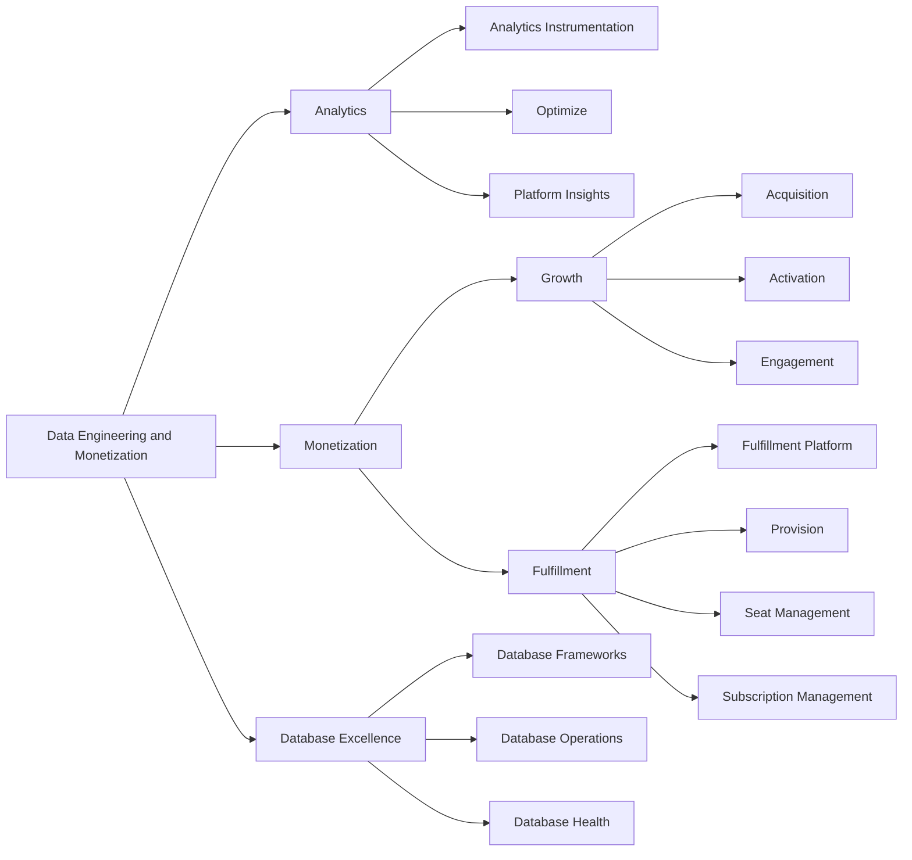

## ミッション

私たちは、あらゆる展開モデルで GitLab をスケールし、インテリジェントなマネタイゼーションを実現する、運用・分析両面の統合データ基盤を構築します。断片化されたシステムをシームレスで低タッチなエコシステムに接続し、移行とアップグレード時のデータ問題をゼロにすることで、顧客が新機能をより速く採用できるようにし、カスタマージャーニー全体にわたるリーディングインジケーターにローデータを変換して成長と競争優位を加速させます。

## ビジョン

私たちは GitLab が Developer-Led Economy（開発者主導の経済）を定義することを目指しています: エージェントとデータ駆動型プラットフォームによって力を与えられたソフトウェア開発者が、20 世紀の石油が産業の力を定義したのと同様に、イノベーション・成長・競争優位のコアドライバーとなるグローバルな転換です。

## 組織構造

