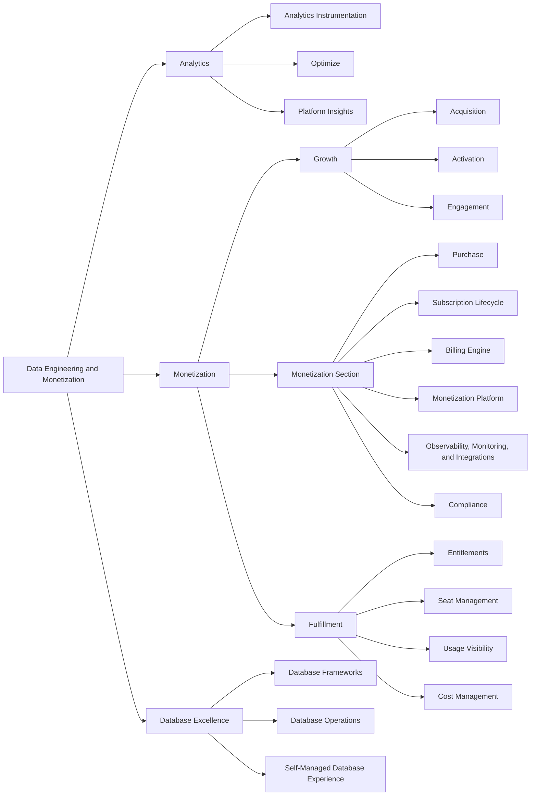

## ミッション {#mission}

私たちは、あらゆる展開モデルで GitLab をスケールし、インテリジェントなマネタイゼーションを実現する、運用・分析両面の統合データ基盤を構築します。断片化されたシステムをシームレスで低タッチなエコシステムに接続し、移行とアップグレード時のデータ問題をゼロにすることで、顧客が新機能をより速く採用できるようにし、カスタマージャーニー全体にわたるリーディングインジケーターにローデータを変換して成長と競争優位を加速させます。

## ビジョン {#vision}

私たちは GitLab が Developer-Led Economy（開発者主導の経済）を定義することを目指しています: エージェントとデータ駆動型プラットフォームによって力を与えられたソフトウェア開発者が、20 世紀の石油が産業の力を定義したのと同様に、イノベーション・成長・競争優位のコアドライバーとなるグローバルな転換です。

## 組織構造 {#organization-structure}

```mermaid
flowchart LR
    DEAM[Data Engineering and Monetization]
    click DEAM "/handbook/engineering/data-engineering/"

    DEAM --> AN[Analytics]
    click AN "/handbook/engineering/data-engineering/analytics"
    DEAM --> MON[Monetization]
    DEAM --> DE[Database Excellence]
    click DE "/handbook/engineering/data-engineering/database-excellence/"

    AN --> AI[Analytics Instrumentation]
    click AI "/handbook/engineering/data-engineering/analytics/analytics-instrumentation"
    AN --> Optimize
    click Optimize "/handbook/engineering/data-engineering/analytics/optimize"
    AN --> PI[Platform Insights]
    click PI "/handbook/engineering/data-engineering/analytics/platform-insights"

    MON --> Growth
    click Growth "/handbook/engineering/development/growth"
    MON --> MONS[Monetization Section]
    click MONS "/handbook/engineering/development/monetization"
    MON --> Fulfillment
    click Fulfillment "/handbook/engineering/development/fulfillment"

    MONS --> PUR[Purchase]
    MONS --> SUBL[Subscription Lifecycle]
    MONS --> BE[Billing Engine]
    MONS --> MP[Monetization Platform]
    MONS --> OMI[Observability, Monitoring, and Integrations]
    MONS --> COMP[Compliance]

    Fulfillment --> ENT[Entitlements]
    Fulfillment --> SEATM[Seat Management]
    Fulfillment --> UV[Usage Visibility]
    Fulfillment --> CM[Cost Management]

    Growth --> Acquisition
    click Acquisition "/handbook/engineering/development/growth"
    Growth --> Activation
    click Activation "/handbook/engineering/development/growth"
    Growth --> Engagement
    click Engagement "/handbook/engineering/development/growth"

    DE --> DBF[Database Frameworks]
    click DBF "/handbook/engineering/data-engineering/database-excellence/database-frameworks"
    DE --> DBO[Database Operations]
    click DBO "/handbook/engineering/data-engineering/database-excellence/database-operations"
    DE --> SMDX[Self-Managed Database Experience]
    click SMDX "/handbook/engineering/data-engineering/database-excellence/self-managed-database-experience"
```

## 私たちの働き方 {#how-we-work}

- [四半期計画](/handbook/engineering/data-engineering/quarterly-planning/)：Search and Data Platform が四半期を計画する方法です。作業可能量の上限内で優先順位と規模を適切に設定した重点施策、14 日ごとの 20 分間のレビュー、入れ替えと優先順位引き下げのルール、四半期末の say/do スコアを扱います。
- [優先事項トラッカーガイド](/handbook/engineering/data-engineering/priorities-tracker/)：トラッカーのスプレッドシートに対応するリファレンスです。タブ、Two-pager、各行の列、作業可能量の計算、計画確定前に各行が満たす必要があるチェック項目を説明します。
- [リリース前のプレモーテム](/handbook/engineering/data-engineering/pre-mortems/)：リリース日より前に、そのリリースに固有のリスクを洗い出すための、任意の 45 分間の取り組みです。実施するかどうかはリリースの DRI が決定します。
