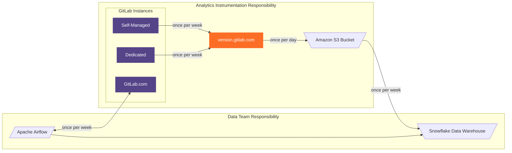
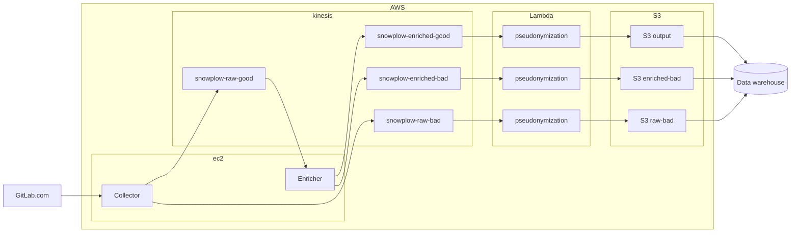

## Service Ping

[ドキュメント](https://docs.gitlab.com/ee/development/internal_analytics/service_ping/)では、Service Ping の目的についての概要を確認できます。

Service Ping を収集するプロセスには、5つの独立したシステムが関与しています。
Analytics Instrumentation チームが管理する 3つのシステムは次のとおりです:

- Service Ping ペイロードを生成・送信する GitLab インスタンス
- Service Ping ペイロードを受信・保存する [version.gitlab.com](https://gitlab.com/gitlab-org/gitlab-services/version.gitlab.com)
- version.gitlab.com が Service Ping ペイロードを展開する AWS S3 バケット

Data チームが管理する 2つのシステムは次のとおりです:

- Service Ping ペイロードをアクセス可能にするデータウェアハウス Snowflake
- データ量の多さからService Ping を自動送信しない唯一のインスタンスである GitLab.com からService Ping を収集するために使用される Airflow

## Snowplow

Snowplow イベントは、GitLab SaaS や [customers.gitlab.com](https://gitlab.com/gitlab-org/customers-gitlab-com)、[AI gateway](https://gitlab.com/gitlab-org/modelops/applied-ml/code-suggestions/ai-assist) などの他プロジェクトから送信され、GitLab が管理する AWS パイプラインを通過します。

セルフマネージドインスタンスは、必要に応じて GitLab が管理しないカスタム Snowplow コレクターにレポートするよう[設定できます](https://docs.gitlab.com/ee/development/internal_analytics/internal_event_instrumentation/local_setup_and_debugging.html#remote-event-collector)。

### AWS パイプライン内のイベントフロー

すべてのイベントは、コレクター、エンリッチャー、および疑似匿名化 Lambda を通過します。その後、イベントは S3 ストレージにダンプされ、Snowflake データウェアハウスによって取得されます。

インフラストラクチャのデプロイと管理は、現在の [Terraform リポジトリ](https://gitlab.com/gitlab-com/gl-infra/config-mgmt/-/tree/master/environments/aws-snowplow) で Terraform を使用して自動化されています。

コレクターとエンリッチャーの仕組みについては、Snowplow 独自のドキュメントと概要として [Snowplow technology 101](https://github.com/snowplow/snowplow/#snowplow-technology-101) をご参照ください。

### 疑似匿名化

典型的な Snowplow パイプラインとは異なり、エンリッチメント後、GitLab の Snowplow イベントは S3 ストレージに保存される前に、AWS Lambda サービスの形式での[疑似匿名化サービス](https://gitlab.com/gitlab-org/analytics-section/analytics-instrumentation/snowplow-pseudonymization)を通過します。

#### イベントを疑似匿名化する理由

GitLab は、ユーザーのプライバシーを保護するため、[コミュニティへの義務](/handbook/product/product-processes/analytics-instrumentation-guide/service-usage-data-commitment/)と[法的規制](/handbook/legal/privacy/customer-product-usage-information/)に従う必要があります。

GitLab はビジネス上の意思決定に役立つ洞察を提供する必要があり、また異なるユーザーの行動パターンをより深く理解する必要があります。
疑似匿名化プロセスは、これら 2つの要件の間の妥協点を見つける助けとなります。

疑似匿名化は Snowplow イベント内の個人を特定できる情報を不可逆的な方法で処理し、
与えられた入力に対して確定的な出力を維持しながら、その入力との関連を隠蔽します。

#### イベントの疑似匿名化方法

疑似匿名化は、デフォルトでプライバシーを保護するアローリストを使用します。そのため、
Snowplow イベントの一部として受信された各属性は、その属性が許可された例外でない限り疑似匿名化されます。

疑似匿名化は HMAC-SHA256 鍵付きハッシュアルゴリズムを使用して行われます。
各属性は秘密のソルトと組み合わせられ、識別可能な情報をすべて仮名に置き換えます。

### S3 バケットデータレイクから Snowflake へ

データが Snowflake データウェアハウスにどのように取り込まれるかについては、[Data チームの Snowplow 概要](/handbook/enterprise-data/platform/snowplow/)を参照してください。
