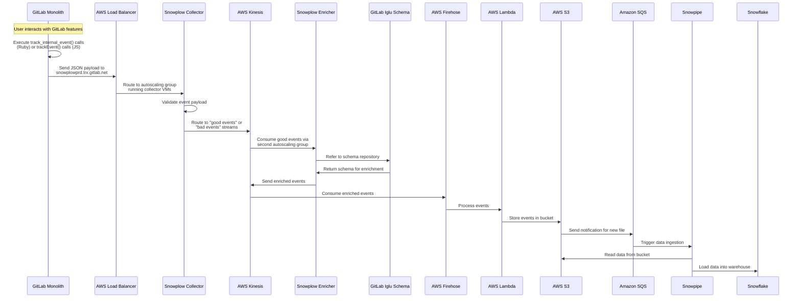
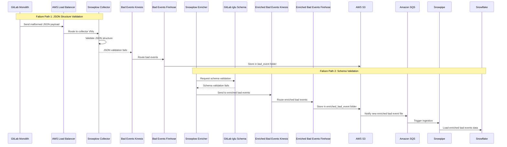

## 概要

内部イベントのデータフローは、以下の要素によって異なります:

**デプロイメントタイプ:**

- **セルフマネージド**: お客様がホストする GitLab インスタンス
- **GitLab Dedicated**: GitLab が管理するシングルテナントクラウドインスタンス
- **GitLab.com (SaaS)**: マルチテナントクラウドオファリング

**サービス:**

- **[GitLab モノリス](https://gitlab.com/gitlab-org/gitlab)**: コア GitLab アプリケーションおよびプライマリサービス
- **[AI Gateway](https://gitlab.com/gitlab-org/modelops/applied-ml/code-suggestions/ai-assist)**: AI 機能とリクエストを処理するサービス
- **[GitLab Language Server](https://gitlab.com/gitlab-org/editor-extensions/gitlab-lsp)**: 言語サポートとコードインテリジェンスサービス
- **[Switchboard](https://gitlab.com/gitlab-com/gl-infra/gitlab-dedicated/switchboard)**: GitLab Dedicated のお客様がテナント環境を管理できるサービス

## セルフマネージドインスタンスのデータフロー（GitLab モノリス）

### 正常パスのデータフロー

以下のシーケンス図は、セルフマネージド GitLab インスタンスにおける内部イベントデータが機能使用からデータウェアハウスまでどのように流れるかを示しています:

### データフローの説明

内部イベントトラッキングには GitLab 18.0+ が必要で、セルフマネージドインスタンスではお客様のオプトインが必要です。

**イベント生成**: インストルメントされた機能とのユーザーインタラクションにより、Ruby では `track_internal_event()` 呼び出し、JavaScript では `trackEvent()` 呼び出し（Ruby メソッドを API 経由でラップしたもの）がトリガーされます。

**収集**: イベントは JSON ペイロードとして `snowplowprd.trx.gitlab.net` の Snowplow コレクターに送信されます。エンドポイントはオートスケーリンググループで動作する Snowplow コレクター VM にトラフィックをルーティングする AWS ロードバランサーです。

**検証とルーティング**: コレクターは JSON 構造を検証し、有効なデータの「良好なイベント」と無効なデータの「不良なイベント」の AWS Kinesis ストリームにイベントをルーティングします。

**エンリッチメント**: Snowplow エンリッチャー VM を実行する 2番目のオートスケーリンググループが Kinesis から良好なイベントを消費し、GitLab Iglu スキーマリポジトリを参照して検証とエンリッチメントを行い、処理済みイベントを Kinesis に返します。

**ストレージパイプライン**: AWS Firehose がエンリッチされた Kinesis イベントを消費し、Lambda 関数でそれらを処理し、最終的に Firehose がトランスフォームされたデータを S3 バケットに書き込みます。

**データウェアハウス**: S3 へのファイル到着により Amazon SQS に送信されたイベント通知が生成され、Snowpipe がデータを自動的に Snowflake にロードするよう起動されます。

### 失敗パスのデータフロー

以下の図は、イベント処理中に発生する可能性のある 2つの検証失敗パスを示しています:

#### 失敗パスの説明

内部イベントパイプラインには 2つの検証失敗ポイントがあります:

**JSON 構造検証の失敗**: 1番目のオートスケーリンググループ（コレクター）は受信ペイロードの基本的な JSON 構造を検証します。検証が失敗すると、イベントは専用の「不良なイベント」Kinesis ストリームにルーティングされ、Firehose によって処理されて S3 の `bad_event` フォルダーに保存されます。`bad_event` フォルダーに保存されたペイロードは Snowflake に取り込まれません。

**スキーマ検証の失敗**: 2番目のオートスケーリンググループ（エンリッチャー）は、GitLab の Iglu スキーマリポジトリに対してイベントを検証します。スキーマ検証が失敗すると、イベントは「エンリッチされた不良なイベント」Kinesis ストリームに送信され、Firehose で処理されて S3 の `enriched_bad_event` フォルダーに保存されます。これらのイベントは下流の処理パイプラインに従います。S3 通知が SQS 経由で Snowpipe を起動し、分析とデバッグのためにエンリッチされた不良なイベントデータが Snowflake に取り込まれます。
