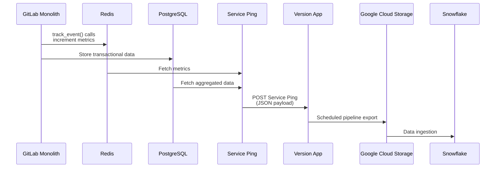

## 概要

このドキュメントは、GitLab のさまざまなデプロイメントタイプとメトリクスソース全体で Service Ping データがどのように流れるかを示しています。Service Ping は、GitLab インスタンスから使用状況分析と運用メトリクスを収集・集計するための GitLab のメカニズムです。

データフローは、2つの主要な観点で異なります:

**デプロイメントタイプ:**

- **GitLab.com (SaaS)**: マルチテナントクラウドオファリング
- **セルフマネージド**: お客様がホストする GitLab インスタンス
- **GitLab Dedicated**: GitLab が管理するシングルテナントクラウドインスタンス

**メトリクスソースタイプ:**

- **Database**: GitLab データベースからの集計されたカウントと統計
- **Redis HLL**: ユニークカウントトラッキングのために Redis に保存される HyperLogLog カウンター
- **System**: システムレベルのメトリクスと設定データ
- **Internal Events**: イベントベースのトラッキングとアナリティクス
- **Redis**: 汎用的な Redis ベースのカウンターとメトリクス
- **License**: サブスクリプションとライセンス情報
- **Prometheus**: インフラストラクチャとアプリケーションパフォーマンスのメトリクス

## セルフマネージドインスタンスのデータフロー

以下のシーケンス図は、セルフマネージド GitLab インスタンスにおける Service Ping データが機能使用からデータウェアハウスまでどのように流れるかを示しています:

### データフローの説明

セルフマネージドインスタンスの Service Ping データフローは、多段階のプロセスに従います:

1. **データ生成**: ユーザーが GitLab の機能を操作すると、2種類のデータが生成されます:
   - **アナリティクストラッキング**: Ruby コードは `track_event()` 呼び出しを実行し、JavaScript コードは `trackEvent()` 呼び出し（`track_event()` をラップする API エンドポイントに送信）を実行して、Redis クラスターに保存されるメトリクスをインクリメントします。
   - **トランザクションデータ**: システムとの通常のユーザーインタラクション（Issue の作成、コミットなど）は、通常のアプリケーション操作の一部として PostgreSQL データベースに保存されます。

2. **定期的な収集**: 週次スケジュールで、Service Ping プロセスは Redis と PostgreSQL の両方からメトリクスを取得します。これには、カウンター、集計された統計、その他の使用状況データの取得が含まれます。

3. **ペイロードの構築**: 収集されたデータは、ソースタイプ（database、redis_hll、system、internal events、redis、license、prometheus）別に整理されたすべてのメトリクスを含む構造化された JSON ペイロードに組み立てられます。

4. **送信**: JSON ペイロードは HTTP POST を介して Version App エンドポイントに送信されます。Version App はすべての GitLab インスタンスからの Service Ping データの中央収集ポイントとして機能します。

5. **ストレージとエクスポート**: Version App は受信したデータをデータベースに保存します。スケジュールされたパイプラインジョブがこのデータを Google Cloud Storage にエクスポートし、さらなる処理のために利用可能にします。

6. **データウェアハウスへの取り込み**: 最終的に、データは Google Cloud Storage から Snowflake に取り込まれ、アナリティクス、レポーティング、ビジネスインテリジェンスに利用できるようになります。
