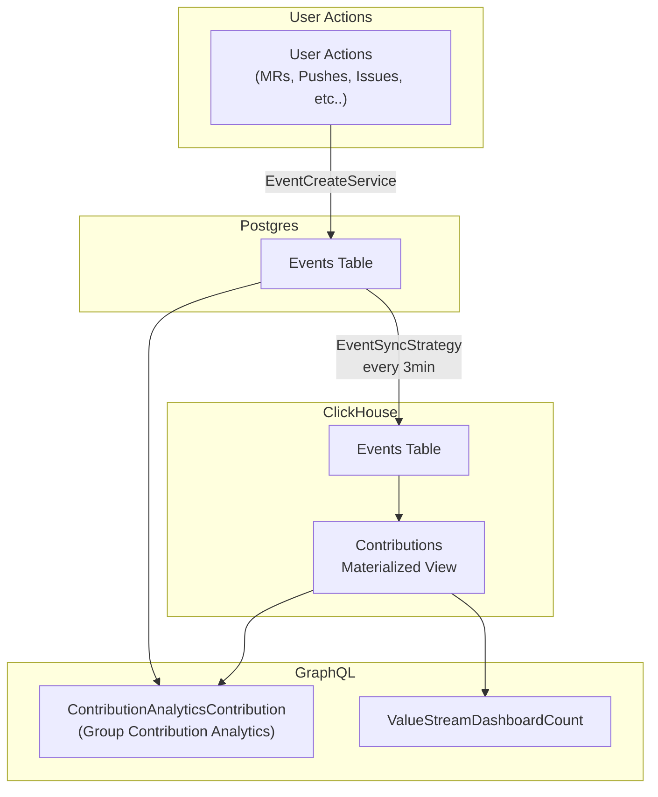
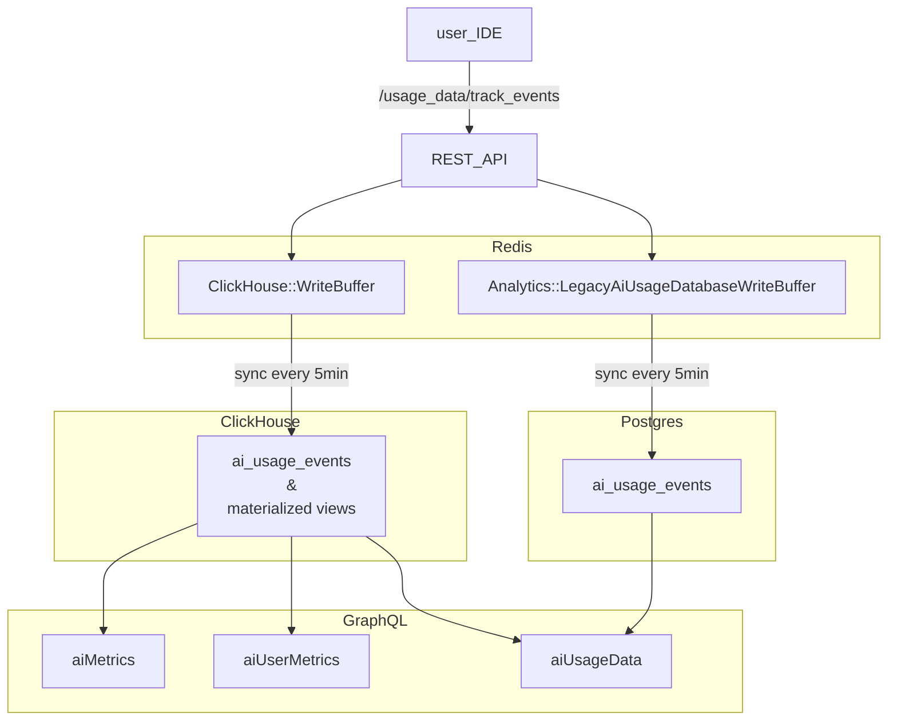

## Analytics:Optimize

**[Optimize グループの方針とロードマップ](https://gitlab.com/groups/gitlab-org/analytics-section/optimize-group/-/wikis/Optimize-Group-Direction-and-Roadmap)**

### 私たちの働き方

- 私たちの [GitLab の価値観](/handbook/values/) に従って。
- 透明に: ほぼすべてが公開されており、可能な限りミーティングを記録します。
- 取り組みたいことに取り組む機会がある。
- 誰もが貢献でき、サイロは存在しない。
  - 目標は、プロダクトが最初からエンジニアリングとデザインに方針と Issue 定義に関与する機会を与えることです。
- Slack でチームに連絡できます: [#g_analytics_optimize](https://gitlab.enterprise.slack.com/archives/CJZR6KPB4)
  - すべての Optimize チームメンバーは、質問の性質に関係なく、チーム Slack チャンネルでリクエストをトリアージし応答することが奨励されています。

#### 優先度設定

私たちの優先事項は、[Product の全体的なガイダンス](/handbook/product/product-processes/) に従うべきです。これは、スケジュール済みの Issue の priority ラベルに反映されるべきです:

| 優先度 | 説明 | マイルストーンで出荷される確率 |
| ------ | ------ | ------ |
| priority::1 | **緊急**: 指定されたマイルストーンで達成するための最優先事項。これらの Issue はリリースの最も重要な目標であり、最初に作業されるべきです。一部は時間が重要であるか、依存関係をブロック解除する可能性があります。 | ~100% |
| priority::2 | **高**: ビジネスや技術的負債に対する重大な肯定的な影響を持つ重要な Issue。重要だが、時間が重要でも他をブロックしているわけでもない。  | ~75% |
| priority::3 | **通常**: 既存機能への段階的な改善。これらは重要なイテレーションだが、重要ではないと判断される。 | ~50% |
| priority::4 | **低**: 将来のリリースに延期しても許容できるストレッチ Issue。 | ~25% |

一般的なガイドラインとして、私たちは次のように各リリースを計画しようとします:

- **バグ**: 25%
- **機能**: 50%
- **メンテナンス**: 25%

これらの目標は、各リリース後に [レトロスペクティブ](https://gitlab.com/gl-retrospectives/manage-stage/optimize/-/issues) 中に [毎月レビューされます](/handbook/product/product-processes/)。

#### Optimize 機能間のデータフローの SSoT

##### Contribution analytics 用のデータフロー

**[グループ Contribution Analytics](https://docs.gitlab.com/ee/user/group/contribution_analytics) と [Group value stream dashboard contributions](https://docs.gitlab.com/ee/user/analytics/value_streams_dashboard.html) のデータフロー**



##### GitLab Duo および SDLC トレンド用のデータフロー

**[グループ/プロジェクト GitLab Duo および SDLC トレンド](https://docs.gitlab.com/user/analytics/duo_and_sdlc_trends/) のデータフロー**



#### 作業の整理

私たちは一般的に [製品開発フロー](/handbook/product-development/how-we-work/product-development-flow/#workflow-summary) に従います:

1. `workflow::problem validation` - 解決すべき問題の明確化が必要
1. `workflow::design` - 明確な提案 (および視覚的側面のモックアップ) が必要
1. `workflow::solution validation` - エンジニアリングからのリファインメントと受け入れが必要
1. `workflow::planning breakdown` - Weight 見積もりが必要
1. `workflow::scheduling` - マイルストーンの割り当てが必要
1. `workflow::ready for development`
1. `workflow::in dev`
1. `workflow::in review`
1. `workflow::verification` - コードが本番にあり、DRI エンジニアによる検証を保留している
1. `workflow::complete` - コードが検証され、作業が完了している。Issue はクローズされるべき

一般的に言って、Issue は 2 つの状態のいずれかにあります:

- ディスカバリー/リファインメント: 開発を開始することを妨げる質問にまだ答えている、
- 実装: Issue がエンジニアの作業を待っているか、積極的に構築されている。

Basecamp はこれらの段階を [丘の登りと下り](https://basecamp.com/#features) との関係で考えます。

個々のグループは、[製品開発フロー](/handbook/product-development/how-we-work/product-development-flow/#workflow-summary) のワークフローにおいて、有用と感じる数のステージを自由に使用できますが、Issue がディスカバリー/リファインメントから実装にどう移行するかについては、ある程度規範的であるべきです。

##### チームの成果物の価値を測定する

お客様への価値のフローを可視化するために、計画から本番までにかかる時間を測定するために [Value Stream Analytics](https://gitlab.com/groups/gitlab-org/-/analytics/value_stream_analytics?value_stream_id=1022&project_ids[]=278964&label_name[]=group%3A%3Aoptimize) を [dogfooding](/handbook/engineering/development/principles/#dogfooding) しています。

##### バックログ管理

バックログ管理は非常に挑戦的ですが、私たちはラベルとマイルストーンを使って行おうとします。

###### リファインメント

**最終目標が定義され、** すべての直接的なステークホルダーが「はい、これは開発の準備ができています」と言う状態です。一部の Issue はそこに早く到達し、一部は前後にいくつかのパスを必要として把握します。

目標は、エンジニアがバイインを持ち、ロードマップとつながりを感じることです。エンジニアリングを早期に含めることで、プロセスははるかに自然でスムーズになることができます。

そうするには、エンジニアリングマネージャー、エンジニア、デザイナーが Issue から直接 ping されることができます。私たちは現在、グループメンバーをより簡単に ping できるようにグループを作成できる [Manage プロジェクトをグループに変換すること](https://gitlab.com/gitlab-org/manage/-/issues/16983) を探索しています。

リファインメントが必要な Issue を見つけるには、[Next Up](#next-up) ラベルとその目的を参照してください。

###### Next Up

- リファインメントが必要な Issue を特定するために、"Next Up" ラベルを使用します。
  - "Next Up" ラベルの目的は、`workflow::ready for development` より前の _任意の_ ワークフローステージにある Issue を特定することです。ワークフローラベルに加えてこの "Next Up" ラベルを使用することで、何がリファインされているかを正確に確認できます (例: 問題、デザイン、ソリューション)。これは、どの Issue がスケジュールの準備に近いかを特定するのに役立ちます。
- Issue は、Product と Engineering の両方から 👍 を受けるまで、特定のリリース (例: 13.0) のマイルストーンを受け取るべきではありません。これはまた、Issue が `workflow::ready for development` としてラベル付けされるべきでないことを意味します。
  - Product の承認は、Issue が `workflow::planning breakdown` に移動することで表されます。
  - Engineering の承認は、その複雑さを測定する Issue の weight によって表されます。

##### Issue を分解または昇格させる

Issue の複雑さによっては、Issue を分解または昇格させる必要があるかもしれません。いくつかのサンプルシナリオは次のようになります:

- 他の何もする前にデザインに対してディスカバリーを行う必要がある。「Discovery:」の Issue がここで最もうまく機能するかもしれません。デザイン思考とディスカッションをそこに含めるのに役立ち、最終結果は「Implementation:」の Issue に移されます。これらのプレフィックスは、親 Issue または Epic にリンクされている場合に、それらがどんな種類の Issue であるかを整理するのにも役立ちます。
- 作業のスコープが予想よりも大きく、さらに分解する必要があります (例: 現在 5 より高い weight があります)。元々提案された全体的な機能を提供するために発生する必要のある作業の異なるイテレーションまたはフェーズをリストするためのより小さな Issue に分解するために、その Issue を Epic に昇格させるのが適切かもしれません。
- 作業のスコープは明確ですが、1 つの Issue には少し扱いにくいです。指定された Issue をそのまま保ち、会話とアクティビティをすべての人に見えるようにし、より細かい進捗を追跡するために別個の子のデザイン、バックエンド、フロントエンドの Issue を作成するのが理にかなっているかもしれません。

上記のいずれも適用されない場合、Issue はおそらくそのままで問題ありません! その場合、この Issue の weight は非常に低い、例えば 1-2 である可能性があります。

##### Issue 内のディスカッション、情報、決定、アクションアイテムの管理

[Issue の分解または昇格](#breaking-down-or-promoting-issues) の一部として、指定された Issue に大量のスレッドとコメントがあることに気付くかもしれません。

提案の詳細、保留中のアクションアイテム、決定が、Issue に来るステークホルダーに簡単に見えるようにすることが非常に重要です。したがって、Issue の説明を最新に保つこと、または上記のセクションに従って分解または昇格することが最重要です。

#### 見積もり

Issue で作業を開始する前に、最初に予備的な調査の後に見積もる必要があります。

指定された Issue の作業範囲がいくつかの分野 (ドキュメント、デザイン、フロントエンド、バックエンドなど) に触れ、それらにまたがる重要な複雑さを伴う場合、各分野の別々の Issue を作成することを検討してください ([例](https://gitlab.com/gitlab-org/gitlab-ee/issues/9288))。

weight のない Issue には "workflow::planning breakdown" ラベルが割り当てられるべきです。

開発作業を見積もるときは、Issue に適切な weight を割り当ててください:

| Weight | 説明 (エンジニアリング) |
| ------ | ------ |
| 1 | 最も単純な変更。副作用がないと確信している。 |
| 2 | 簡単な変更 (最小限のコード変更)。すべての要件を理解している。 |
| 3 | 簡単な変更だが、コードのフットプリントが大きい (例: 多くの異なるファイル、または影響を受けるテスト)。要件は明確である。 |
| 5 | コードベースの複数のエリアに影響する、より複雑な変更。リファクタリングが含まれる可能性もある。要件は理解されているが、途中でいくつかのギャップがある可能性があると感じる。この Issue をより小さなピースに分解するよう自分自身に挑戦すべきです。 |
| 8 | 複雑な変更で、コードベースの多くに関わるか、要件を決定するために他者からの多くのインプットを必要とする。これらの Issue はしばしば `~workflow::ready for development` になる前に、さらなる調査やディスカバリーが必要であり、複数のより小さな Issue から利益を得る可能性が高い。 |
| 13 | 依存関係 (他のチームまたはサードパーティ) があり、すべての要件をまだ理解していない可能性がある重要な変更。これをマイルストーンにコミットすることはまずなく、好ましくは要件をさらに明確化したり、より小さな Issue に分解したりすることが好ましい。 |

見積もりの一部として、Issue がエンジニアが作業を開始するのに適切な状態だと感じる場合、~"workflow::ready for development" ラベルを追加してください。あるいは、エンジニアが容易に解決できないと感じる、まだ定義する必要のある要件や答える必要のある質問がある場合は、~"workflow::blocked" ラベルを追加してください。`workflow::blocked` ラベルの付いた Issue は、私たちのプランニングボードの独自の列に表示され、それらがさらに注意を必要としていることを明確にします。`workflow::blocked` ラベルを適用するときは、ブロックされた Issue の DRI にコメントを残して ping し、可視性を上げるためにブロッキング Issue をリンクするようにしてください。

##### 実装アプローチ

エンジニアの場合、Issue を `~workflow::planning breakdown` から移動するときに実装アプローチを作成したい場合があります。提案された実装アプローチに従う必要はありませんが、記録された weight を正当化するのに役立ちます。

`workflow::planning breakdown` の DRI として、見張りの終わりとスケジューリングへの移行のための Issue の準備状況をシグナルするために、以下の例に従うことを検討してください。すでに分解されたより単純な Issue はより短いフォーマットを使用するかもしれませんが、計画は (最低限) 常に見積もりの背後にある「なぜ」を正当化するべきです。

以下は [https://gitlab.com/gitlab-org/gitlab/-/issues/247900#implementation-plan](https://gitlab.com/gitlab-org/gitlab/-/issues/247900#implementation-plan) からの実装アプローチの例です。Issue が作業の各部分のために、より小さなサブ Issue に分解されるべきであることを示しています:

```md
### Implementation approach

~database

1. Add new `merge_requests_author_approval` column to `namespace_settings` table (The final table is TBD)

~"feature flag"

1. Create new `group_merge_request_approvers_rules` flag for everything to live behind

~backend

1. Add new field to `ee/app/services/ee/groups/update_service.rb:117`
1. Update `ee/app/services/ee/namespace_settings/update_service.rb` to support more than just one setting
1. *(if feature flag enabled)* Update the `Projects::CreateService` and `Groups::CreateService` to update newly created projects and sub-groups with the main groups setting
1. *(if feature flag enabled)* Update the Groups API to show the settings value
1. Tests tests and more tests :muscle:
1. Create a seed script to generate data

~frontend

1. *(if feature flag enabled)* Add new `Merge request approvals` section to Groups general settings
1. Create new Vue app to render the contents of the section
1. Create new setting and submission process to save the value
1. Tests tests and more tests :muscle:
1. Update storybook stories for new and existing components
```

DRI は、Issue が複数の分野 (例えばバックエンドとフロントエンド) をカバーする場合、Issue を `workflow::scheduling` に移動する前に関連するカウンターパートまたはドメインエキスパートに ping することを **強く** 推奨します。これにより、
ドメインエキスパートは作業開始前に実装プランを承認したり、潜在的な落とし穴や
懸念を提起したりする機会を持ちます。

Issue が見積もられたら、`workflow::scheduling` に移動してマイルストーンを割り当て、最後に `workflow::ready for development` になります。

#### プランニング

私たちは [製品開発タイムライン](/handbook/engineering/workflow/#product-development-timeline) に従って月次サイクルで計画します。このタイムラインを満たすかどうかは、個々のグループの裁量に委ねられています。典型的な Optimize のプランニングサイクルは以下のようになります:

- 4 日までに、Product は次のリリースのために [Optimize Group Admin プロジェクト](https://gitlab.com/gitlab-org/analytics-section/optimize-group/admin/-/issues) でグループのプランニング Issue を作成しているべきです。
  - この Issue にはリリースの暫定的な計画と、マイルストーンの提案された作業を表すボードへのリンクが含まれるべきです。
  - 今後の Issue をキャプチャするために、`Next 1 - 3 releases` マイルストーンでフィルタリングされたボードが使用されます。
  - ステージの戦略に特に重要な Issue は `direction` でマークされるべきです。
- 12 日までに、次のリリースのために提案されたすべての Issue がエンジニアリングによって weight 割り当てされて見積もられるべきです (`workflow:ready for development`)。
  - キャパシティプランニングを支援するために、エンジニアごとに 10 weight のキャパシティから始め、休暇、チームの日、オンコールスケジュール、その他のアクティビティに基づいて差し引きます。EM はプランニング Issue で期待されるキャパシティをキャプチャします。
  - 前のリリースからスリップすることがわかっている Issue は、残りの努力に対して再 weight 付けされ、次のリリースに再スケジュールされるべきです。
- 15 日までに、Product と Engineering は `Next 1 - 3 releases` ボードで Issue のリストを順序付けしているべきです。
  - 可用性に応じて、Product または Engineering がキャパシティを考慮に入れて、各タイプカテゴリの上位 Issue を次のリリースに割り当てます。
  - エンジニアリングマネージャーは、コミットされた作業に ~Deliverable ラベルを割り当てます。
  - プランニングプロセス全体は非同期ですが、Product と Engineering が追加のコラボレーションを必要とする場合、最終的なリリーススコープをレビューするための同期ミーティングはオプションです。

##### Deliverable と Stretch の Issue

`Deliverable` とラベル付けされた Issue は、現在のマイルストーンにスケジュールされています。これらは最優先と見なされ、リリースに間に合うように完了することが期待されます。

`Stretch` とラベル付けされた Issue は、現在のマイルストーンで提供するためのストレッチ目標です。これらの Issue が現在のリリースで完了しなかった場合、次のリリースで強く検討されます。

##### コミュニティコントリビューション

以前に同意され、`Community contribution` としてラベル付けされた Issue は、以下を確認するために [トリアージ](/handbook/product-development/how-we-work/issue-triage/) されるべきです:

- 明確な [実装プラン](/handbook/engineering/devops/create/remote-development/community-contributions/#treat-wider-community-as-primary-audience)。
- 関連する weight 見積もり。
- `Seeking community contributors` ラベルが割り当てられている。

トリアージされたら、Issue は `backlog` に追加され、アサインされないままにすることができます。Issue をアサインすることは、コミュニティメンバーが持っている可能性のある時間制約とコードベースへの精通度のさまざまなレベルを考えると、アサインされた人が積極的に Issue に取り組んでいることを示します。MR が進行中であれば、Issue をアサインすることが最善です。

Issue がより早く処理される必要がある明確な必要性がある場合、適切な priority ラベルが割り当てられたマイルストーンに Issue をスケジュールして、Optimize チームメンバーがそれを計画できるようにすることを検討してください。

コミュニティメンバーが Issue を取り上げることに関心を示した場合、関連する Optimize チームメンバーは、Issue の説明と実装プランが正確で、最新の決定を反映し、すべてのラベルが最新であることを確認し、貢献者が追加の支援を必要とする場合や続けられない場合に備えて進捗を監視するべきです。

##### セルフアサインメント

プランニング中、EM は意味がある場合に個々のエンジニアに Issue を割り当てることができますが、一般的に Issue はアサインされないままにされ、プランニングが確定したらエンジニアがセルフアサインできるよう残されます。

役割別の期待:

- EM はプランニングが確定したらプランニング Issue でエンジニアに ping する。
- エンジニアはリリース開始前に Issue をセルフアサインする。
- EM は週次チームコール中にアサインされていない Issue をハイライトする。

#### リリース中

- リリース中に Issue が導入された場合、計画外の作業を考慮するために同等の weight を削除する必要があります。
- 開発は、見積もられて weight が与えられる前に Issue で開始されるべきではありません。
- 15 日までに、エンジニアリングのマージリクエストがマージされるべきです。言い換えれば、15 日以降にマージされたコードはリリースに含まれないと仮定します。これにより、リリースを確定する時間が確保され、関連する [リリース投稿](/handbook/marketing/blog/release-posts/) が 17 日までにマージされます。(これは [13.11 から始まる実験](https://gitlab.com/gitlab-org/manage/general-discussion/-/issues/17330) です。)

#### リリース投稿

詳細にアナウンスする必要がある Issue については、Issue を使ってリリース投稿を自動的に作成できます。
Issue を作業しているときに、プランニング、デザイン、開発中のいずれかで、
[リリース投稿アイテムジェネレーター](/handbook/marketing/blog/release-posts/#release-post-item-generator)
を使ってリリース投稿を作成し、関連するすべての人に通知することができます。

Issue にリリース投稿を持たせたくない場合は、Issue にリリースノートのセクションがないことを確認するか、`release post item::` ラベルを使用してください。

#### Proof-of-concept MR

私たちは [イテレーション](/handbook/values/#iteration) と小さなピースで価値を提供することを強く信じています。イテレーションは、特にプロダクトのコンテキストが不足している場合や、特にリスクの高い/複雑なコードベースの部分で作業している場合は困難な場合があります。Issue を見積もることや、それが実現可能かどうかを判断するのに苦労している場合は、最初に proof-of-concept MR を作成するのが適切かもしれません。proof-of-concept MR の目標は、計画中の主要な仮定を取り除き、早期のフィードバックを提供することで、将来の実装からのリスクを減らすことです。

- `PoC:` がプレフィックスされた MR を作成する。
- PoC MR が解決しようとしている問題を MR の説明で説明する。
- タイムボックスする。2-3 日以内に実現可能性または計画を決定できるか?
- この期間の終わりにフィードバックを提供するレビュアーを特定する。
- MR をクローズする。PoC から学んだ要約を元の Issue で提供し、プロダクトとパフォーマンスの影響を含める。
  - 実装に進むことができるかどうかを述べる。
  - Issue はクローズしないでください。

proof-of-concept MR の必要性は、私たちのコードベースまたはプロダクトの一部が過度に複雑になっていることを示している可能性があります。将来このステップを避ける方法を議論できるよう、レトロスペクティブの一部として MR を議論することは常に価値があります。

#### Issue トリアージ

私たちは一般的に [Issue トリアージ](/handbook/product-development/how-we-work/issue-triage) ガイドラインに従います。

役割別の期待:

- PM が `type::feature` の DRI
- EM が `type::bug` の DRI
- UX は `UX`、`Deferred UX`、`SUS` の Issue に対する severity ラベルの決定をサポート
  - UX の severity と PM/EM の severity が異なる場合、私たちは [2 つのうち高い方の severity](/handbook/product-development/how-we-work/issue-triage/#examples-of-severity-levels) を取ります。
- エンジニアは参加を奨励される

週次ベースで、できるだけ多くの Issue をトリアージすることを目指します。トリアージが必要な Issue に対して [完全なトリアージ](/handbook/product-development/how-we-work/issue-triage/#complete-triage) を実行することを努めます。

### スケジュール外の Issue で作業する

GitLab の誰もが、結果を測定し、時間を測定しないため、自分の作業を適切と思う方法で管理する自由があります。
この一部は、定期的な月次リリースの一部としてスケジュールされていない項目で作業する
機会です。これは主にハンドブックの他の場所にある項目の繰り返しであり、
それらを明示的にするためにここにあります:

1. 私たちは人々が [自分自身のマネージャー](/handbook/values/#managers-of-one) であることを期待し、私たちは [GitLab を自分自身で使用](/handbook/values/#dogfooding) します。重要だと考えるものを見つけたら、それをスケジュールするように要求できる、または
   _他の優先事項を考慮しながら_、[提案を自分で作業](/handbook/values/#dont-wait) することができます。
1. 時々、GitLab チームメンバーが参加できる
   [issue bash](https://about.gitlab.com/community/issue-bash/) のようなイベントがあります。誰もが
   これらに参加することが歓迎されます。

作業するものを選ぶときは、以下を行ってください:

1. 標準のワークフローに従い、自分自身にアサインする。
1. [透明性](/handbook/values/#transparency) を奨励するために `#g_analytics_optimize` で共有する

### 追加の考慮事項

#### キャパシティプランニング

プランニング中、私たちはチームのキャパシティの 100% を各マイルストーンの deliverable な作業に投入する計画ではありません。代わりに、調査とスコープの作業のためにより多くの時間を確保するために、チームメンバーあたり 15% のバッファを予約します。

#### ドキュメント

ドキュメントは、私たちの [definition of done](https://docs.gitlab.com/ee/development/contributing/merge_request_workflow.html#definition-of-done) の重要な部分です。技術ライティングが必要な変更については、documentation ラベルを追加します。documentation ラベルは backend/frontend ラベルに加えて使用されるべきです。機能が別々のバックエンドとフロントエンドの Issue を正当化する場合、documentation ラベルは該当する場合に各 Issue に適用されるべきです。Issue は、すべての作業がマージされた場合、つまり技術的な部分とドキュメントの変更があった場合にのみ解決される可能性があります。

#### データシーディングスクリプト

Optimize スコープ内の機能は、機能性を検証し、開発中にテストするための適切なデータが必要です。データシーディングスクリプトは、私たちの開発プロセスの一部として作成および/または更新されるべきです。

データシーディングスクリプトの考慮事項:

- 該当する場合、グループまたはプロジェクト ID の指定を可能にするスクリプトをパラメータ化するようにする
- スクリプトが失敗なく繰り返し実行できることを確認する

#### フィーチャーフラグ

私たちはお客様にエンタープライズレベルのユーザー体験を提供するために、[必要に応じてフィーチャーフラグを使用](/handbook/product-development/how-we-work/product-development-flow/feature-flag-lifecycle/) します。不要なフィーチャーフラグは避け、導入するときはその目的が明確であることを確認し、ロールアウトの依存関係とタイムラインが最新の状態に保たれるようにします。可能な限り長期間生きているフィーチャーフラグを最小化するよう努め、変更を伝えます。

私たちが所有するフィーチャーフラグに関連する役割と責任は次のとおりです:

- [DRI](/handbook/people-group/directly-responsible-individuals/) のアサイン
  - フィーチャーフラグを導入する作者がフィーチャーフラグロールアウトの DRI です。
- 監査とクリーンアップ
  - EM はステージ内で所有されているフィーチャーフラグの監査の DRI であり、フィーチャーフラグの DRI と共同でクリーンアップをスケジュールします。
- プロセス改善
  - プロセス改善に向けて貢献することは誰もが奨励されています。

## ミーティング

私たちは非同期コミュニケーションを優先しますが、同期ミーティングは必要であり、[コミュニケーションガイドライン](/handbook/communication/#video-calls) に従うべきです。Manage で行われるいくつかの定期的なミーティングは:

| 頻度 | ミーティング                              | DRI         | 可能なトピック                                                                                        |
|-----------|--------------------------------------|-------------|--------------------------------------------------------------------------------------------------------|
| 週次    | グループレベルミーティング                  | エンジニアリングマネージャー | ボードを歩いて現在のリリースが順調に進んでいることを確認、特定の Issue のブロックを解除                       |
| 月次   | プランニングミーティング                    | プロダクトマネージャー         | [プランニング](/handbook/engineering/devops/plan/) セクションを参照 |

トピック特化型の一度限りのミーティングについては、これらのコールを録画し共有することを常に検討してください (または [一般公開された文書](https://docs.google.com/document/d/1kE8udlwjAiMjZW4p1yARUPNmBgHYReK4Ks5xOJW6Tdw/edit) でメモを取る)。

アジェンダ文書と録画は、信頼できる単一の情報源として [共有 Google ドライブ](https://drive.google.com/drive/u/0/folders/0ALpc3GhrDkKwUk9PVA) (内部のみ) に配置できます。

1:1 ではないミーティングや機密のトピックをカバーするミーティングは、Manage Shared カレンダーに追加されるべきです。

すべてのミーティングは、少なくとも 12 時間前にアジェンダが準備されているべきです。そうでない場合、ミーティングに出席する義務はありません。ミーティングの開始時刻までにアジェンダがない場合、キャンセルされたとみなしてください。

## グループメンバー

以下のメンバーはグループの常任メンバーです:



## リンクとリソース {#links}

- [マイルストーンレトロスペクティブ](https://gitlab.com/gl-retrospectives/analytics/optimize/-/work_items?sort=created_date&state=opened&label_name%5B%5D=retrospective&first_page_size=20)
- 私たちの Slack チャンネル
  - Analytics:Optimize [#g_analytics_optimize](https://gitlab.slack.com/messages/CJZR6KPB4)
- Issue ボード
  - Optimize [build board](https://gitlab.com/groups/gitlab-org/-/boards/1401511) と [refinement board](https://gitlab.com/groups/gitlab-org/-/boards/1874426)ֿ
- Optimize グループの計画とビジョンに関する詳細については、[Groups ページ](/handbook/product/categories/) を参照してください
