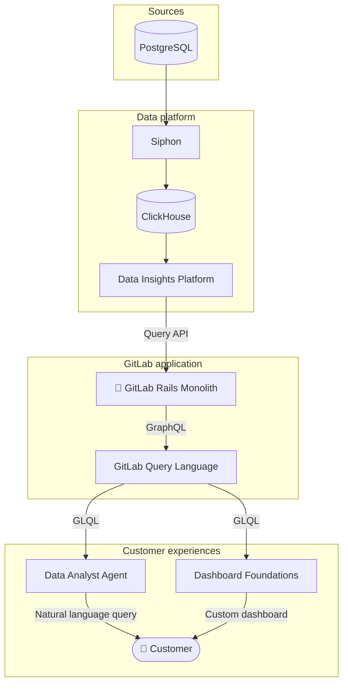

## ビジョン

Platform Insights グループは Analytics セクションの一部です。私たちは、AI を活用してスケーラブルなデータインフラストラクチャに支えられた包括的な「ダッシュボード・アズ・ア・サービス」フレームワークを構築することで、GitLab の顧客が自身のアナリティクスをセルフサービスで利用できるようにすることに注力しています。

私たちの **[FY27 の方向性とロードマップ](https://gitlab.com/groups/gitlab-org/analytics-section/platform-insights/-/wikis/Platform-Insights-Direction-and-Roadmap)** は、何を構築しているのか、なぜ構築しているのかについての唯一の信頼できる情報源です。

## 主要なイニシアチブ

これらは、チームがオーナーまたは主要な貢献者となっている主なイニシアチブです:

- [Dashboard Foundations](https://gitlab.com/groups/gitlab-org/-/work_items/18072)
- [Data Analyst Agent](https://gitlab.com/groups/gitlab-org/-/work_items/19499)
- [GitLab Query Language (GLQL)](https://gitlab.com/gitlab-org/glql)
- [Data Insights Platform (DIP)](https://gitlab.com/gitlab-org/analytics-section/platform-insights/core)
- [Siphon data replication](https://gitlab.com/gitlab-org/analytics-section/siphon)

下記の図は、ソースから顧客までの典型的なデータフローを非常に高いレベルで示しています。

アナリティクスプラットフォームに加えて、このグループには[検索チーム](/handbook/engineering/ai/search/)が含まれ、[クラシック検索](https://docs.gitlab.com/user/search/)機能を担当しています。

## チーム



### Stable counterparts



### 私たちの価値観と原則

- 私たちは [GitLab の価値観](/handbook/values/) に従って働いています。
- チーム内および Analytics セクション内の双方で、緊密に協力しています。
- 私たちは自分たちのプロダクトとロードマップに対してオーナーシップを持っています。
- 私たちは行動を強く志向します。
- 私たちはデータに基づいた意思決定を行います。

### コミュニケーション

私たちが透明性を持ってコミュニケーションを行い、連絡を取ることができる Slack チャネル:

- メイン: [#g_monitor_platform_insights](https://gitlab.enterprise.slack.com/archives/C02Q93U8J07)
- スタンドアップ: [#g_monitor_platform_insights_standup](https://gitlab.enterprise.slack.com/archives/C02VAHG10HW)
- 内部用: [#g_monitor_platform_insights_internal](https://gitlab.enterprise.slack.com/archives/C02QLQUB0JZ)

### ミーティング

- **週次チームシンク:** 進行中の作業や、ロールアウトやより大規模なイニシアチブなど特定の取り組みを整理することと、重要なアップデートの共有に焦点を当てています。
- **Dev sync:** エンジニアが主催するミーティングで、IC が EM や PM を必要とせず技術的な問題を議論したり、技術的な作業を調整したりできます。
- **1:1 コーヒーチャット:** チームメンバーは、数週間ごとにチーム内および広範な Analytics セクション内の他のメンバーすべてとコーヒーチャットをスケジュールすべきです。仕事の話題でも、仕事以外の話題でも歓迎します。タイムゾーンが障壁になる場合は、非同期 Slack スレッドでも構いません。目標は 1:1 のつながりです。

## 私たちの働き方

私たちは会社の [プロダクト開発フロー](/handbook/product-development/how-we-work/product-development-flow/) に基づいてワークフローを構築しています。ワークフローの適用方法に関する変更や明確化については、以下に詳述します。

### マイルストーンプランニング

私たちは月次リリースサイクルに合わせた GitLab マイルストーンで作業しています。FY27 ロードマップ wiki が計画された優先事項の唯一の信頼できる情報源です。各マイルストーンの開始前に、チームは利用可能なキャパシティに合わせて Issue を精査し、スコープを決めます。

### 非同期スタンドアップ

チームメンバーは毎週金曜日に [Geekbot](https://geekbot.com/) を使用して週次スタンドアップを提出します。私たちはこれらの非同期スタンドアップを使って、達成したこと、現在のブロッカー、次に取り組む予定について連携します。

### レトロスペクティブ

私たちは 2 種類のレトロスペクティブを実施しています:

**1. マイルストーンレトロスペクティブ (自動化)**

すべてのマイルストーンが終了した後に自動的に実行されます。マイルストーン全体について、うまくいったこと、つらかったこと、次回違うやり方をしたいことをチームで構造的に振り返るタイミングを提供します。

**2. 機能またはインシデントのレトロスペクティブ (必要に応じて)**

主要な機能のリリース後または重大なインシデント発生後にチームによって企画されます。機能ローンチの場合は、何を達成したかを把握し、スケジュールする必要のあるフォローアップの技術的負債や品質修正を表面化させる機会となります。インシデントの場合は、責任を割り当てることなく何がうまくいかなかったかに焦点を当て、再発をどう防ぐか、そしてアクションするべき修復策や監視の改善に焦点を当てます。

### ClickHouse データストア

アナリティクス機能はビッグデータと書き込み重視の要件を持ち、Postgres や Redis には適しません。これらの機能要件を満たすために [ClickHouse](https://github.com/ClickHouse/ClickHouse) が選定されました。ClickHouse はオープンソースの列指向データベース管理システムです。大量の行に対してフィルタリング、集計、合計を効率的に実行できるため、これらのユースケースに魅力的です。ClickHouse は GitLab のスタックで Postgres や Redis を置き換えるためのものではありません。

最初は自前でホストする ClickHouse インスタンスを管理していましたが、メンテナンスとスケーラビリティを Clickhouse に委ねてチームがより速く動けるようにするため、Clickhouse Cloud への移行を決定しました。

詳細はこちら: [Clickhouse Datastore Working Group](/handbook/company/working-groups/clickhouse-datastore/)
