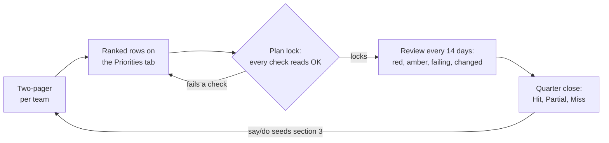

## 最低限読んでおくこと {#if-you-read-nothing-else}

- 各チームは、四半期の優先事項 3〜5 件に順位を付け、指標を伴う成果として記述し、作業可能量の 70% 以内に収まる規模にして、[トラッカー](/handbook/engineering/data-engineering/priorities-tracker/)の Priorities タブに入力します。このタブにないものは確約ではありません。
- 確約項目の行は 80% の確信度で計画し、不明点がない場合に限り 90% とします。100% はありません。それ以外はすべて挑戦項目です。
- すべての行に 1 人のオーナーを置き、優先順位の付いた組織の重点施策へのリンクを記載し、依存先の行とそれを引き受けた人を明示し、中止判断のシグナルと確認期限を設定します。
- 14 日ごとに 20 分間レビューします。赤の行は、阻害要因を解消するか、入れ替えるか、優先順位を下げた状態でレビューを終えます。決めることがないレビューは中止します。
- 四半期末には、すべての行を Hit（達成）、Partial（一部達成）、Miss（未達）で評価します。確約項目の健全な達成率は 80%〜90% です。

## プロセスの概要 {#high-level-summary-of-the-process}

各四半期に、各 EM は優先順位を付けた 3〜5 件の優先事項を書き出し、作業可能量の上限に照らして規模を設定し、優先事項トラッカーという 1 か所で確約します。13 週間にわたって 14 日ごとにこれらの行をレビューし、四半期末にすべての行を評価します。

このページは、Search and Data Platform 向けに、GitLab の全社計画プロセスの下位に位置する組織レベルの取り組みを定めるものです。全社プロセスが最優先事項を決め、このページは、各チームがそれらを優先順位付きで規模を正直に見積もった重点施策に落とし込み、実行し、そこから学ぶ方法を定めます。

トラッカーの Priorities タブが計画です。このタブにない作業は確約ではありません。エピックには作業を、トラッカーには約束を記録します。

このページで扱わないこと:

- **イテレーションやマイルストーンのプロセスではありません。** スプリント単位の計画は各チームに委ねます。
- **2 つ目の進捗報告ではありません。** 日々の進捗はエピックに記載します。トラッカーが 14 日ごとに問うのは、「その約束は今も成り立っているか」という 1 点です。

このページのすべてのルールは、チームがより早く、またはより少ない手続きで何かを決めるのに役立つ必要があります。そうでないルールがあれば、削除するためのマージリクエストを作成してください。

## 原則 {#principles}

作業に必要なプロセスの量は、どれほどの問題が起こり得るか、どれほど不確実かによって決まります。外部に約束した期日があるチーム横断の重点施策には、単一チームの改善よりも整った仕組みが必要です。以下の原則は、その考え方を適用したものです。

1. **各重点施策に順位を付けます。** 各チームは自分たちの行に 1 から n までの順位を付け、トラッカーのオーナーは組織の重点施策に順位を付けます。作業可能量はその順位に従って配分します。[チーム間の優先順位付け](#prioritizing-across-teams)を参照してください。
1. **アウトプットではなく成果を扱います。** 「X を提供する」はタスクです。「[日付] までに、[誰が] [何をする]、[指標] で測定する」が重点施策です。すべての行に成果、指標、ベースライン、目標値を記載します。
1. **作業可能量は固定の前提です。** 確約する作業は、チームの作業可能量の 70% 以内に収めます。残りの 30% は予備枠です。継続運用のための作業（KTLO）、インシデント、オンコール、すでに予想できている依頼に充てます。作業可能量を 100% 埋める計画は、最初のインシデントで崩れます。
1. **1 行につきオーナー 1 人と組織の重点施策 1 件を設定します。** すべての行に 1 人のオーナーの氏名を記載し、組織の重点施策へのリンクを付けるか、`None` と記載します。どの重点施策にもひも付かない確約作業は、最初の削減候補です。
1. **断ることを明言します。** すべての計画に、今四半期に取り組まないこと、依頼者、相手に伝えた内容を明示的に一覧にします。チームに代わって書面で断ることは、このプロセスがエンジニアにもたらす最も有用な働きの 1 つです。
1. **依存事項は確約です。** 提供側のチームが氏名を記入して引き受けて初めて、依存事項として扱います。
1. **すべての行に中止の判断基準を設け、中止も決定として扱います。** 各行に中止判断のシグナルと確認期限を記載します。第 12 週に突然発覚するのではなく、第 4 週に優先順位を下げる判断ができるようにするためです。理由を記録して早めに中止することは、良い成果と見なします。
1. **レビューでは決定を下し、決めることがなければ中止します。** すべての赤の行は、阻害要因を解消して緑に戻る道筋を付けるか、入れ替えるか、優先順位を下げた状態でレビューを終えます。ただ見守るためだけに、赤の行を次のレビューへ持ち越すことはありません。

## GitLab の全社プロセスとの関係 {#how-this-fits-gitlabs-company-process}

このページの上位には、2 つの全社プロセスがあります。それらを重複させず、その下位に収まるように設計しています。

**GitLab Operating Model。** 全社目標、e-group の指標、各部門リーダーのイニシアチブを、`FY27-Q4` のような会計四半期ラベル付きの 3 階層のエピックで追跡します。出典: [GitLab Operating Model](https://internal.gitlab.com/handbook/company/gitlab-operating-model)（社内ハンドブック）。

**R&D Interlock。** [R&D Interlock](/handbook/product-development/how-we-work/r-and-d-interlock/)は、各四半期の少数の大規模な部門横断の項目について、Product、UX、Engineering の認識を揃えます。優先度の区分を定義しています（Engineering の確信度は P1/E1 が 100%、P2/E2 が 80%、P3/E3 が 50%）。

インターロックは計画の入口にある最上位の項目を決め、確約までを扱います。このページは、その後を扱います。チームが自分たちの行をどう選んで規模を決めるか、**依存事項をどう調整するか、確約した作業をどう実行して締めくくるか**です。

**重複させないこと。** 2 つ目のロードマップも、2 つ目の優先順位の体系も作りません。今週の作業の進捗は、健全性ラベルと金曜日の短い報告によって、すでにエピックでわかります。トラッカーは 14 日ごとに、指標の現在値から判断して、約束を果たす見通しが今も順調かという別の問いに答えます。全社の資料にすでに事実が記載されている場合は、コピーせずリンクします。

## トラッカー {#the-tracker}

[優先事項トラッカー](https://docs.google.com/spreadsheets/d/1KsFyxZg3qT7BQMBGJd_qDde6MG2GEsy4tpwPf-u8I1U/edit)（社内用、GitLab チームメンバー限定）は、四半期ごとに 1 つのスプレッドシートです。組織の重点施策、計画となる Priorities タブ、各チームの作業可能量、Two-pager テンプレート、レビューログを保持し、レビューの議題と say/do スコアを計算します。[優先事項トラッカーガイド](/handbook/engineering/data-engineering/priorities-tracker/)では、すべてのタブ、行の書き方、作業可能量の計算、計画確定前に各行が満たすべきチェック項目を説明しています。

## サイクル {#the-cycle}

1. **四半期の前。** 各 EM が Two-pager テンプレートのタブをコピーし、チーム名に変更して、黄色のセルを記入します。印刷して 2 ページ以内です。PM が成果と指標に共同署名します。
1. **行。** EM は、チームの優先順位付きの優先事項を Priorities タブに入力します。優先事項ごとに 1 行、チームごとに 3〜5 行です。
1. **計画確定。** 計画確定日には、すべての行の [Checks 列](/handbook/engineering/data-engineering/priorities-tracker/#checks-the-tracker-enforces)が `OK` となり、すべてのチームが Capacity タブの上限内に収まり、すべての依存事項に引き受けた人の氏名が記載されている状態にします。チェックに失敗した行は確定できません。計画確定後は[入れ替えルール](#swap-and-deprioritize-rules)が適用されます。
1. **14 日ごと。** EM はレビューを行う金曜日の正午までに行を更新します。レビュー自体は 20 分間です。赤の行、黄色の行、チェックに失敗した行、前回のレビュー以降に変更された行の順に確認します。決めることがないレビューは中止し、記録します。詳細は、後述の「四半期の運営」を参照してください。
1. **四半期の締め処理。** すべての行を Hit、Partial、Miss で評価し、すべての確約項目の行に締めくくりの 3 行を記入します。say/do スコアを次の四半期の Two-pager の材料にします。詳細は、後述の「四半期の締め処理と say/do」を参照してください。

### 四半期カレンダー {#quarter-calendar}

計画は暦年の四半期、つまり 1〜3 月、4〜6 月、7〜9 月、10〜12 月を単位に立てます。各四半期は 13 週間です。計画確定日は、四半期の最初の完全な週の金曜日です。そのため Two-pager の提出期限はその前の金曜日で、調整レビューもその週に行います。レビューは計画確定日から 14 日ごとに実施するため、奇数週の金曜日となり、Thanksgiving、Christmas、New Year を避けられます。それでも会社の休日と重なる場合、トラッカーのオーナーが事前に中止し、Review log に記録します。休暇明け最初のレビューでは、すべての確認期限を見直して設定し直します。

各四半期の 2 つの日付には、特別な意味があります。GitLab の会計四半期は 2 月 1 日、5 月 1 日、8 月 1 日、11 月 1 日に始まり、暦年の各四半期の開始から 1 か月後に当たります。その日以降の最初のレビューで、全社 OKR、予算、人員数の変更を計画に取り込みます。取り込みは必ず入れ替えで行い、追加はしません。四半期末日は評価日であり、リリース日ではありません。10〜12 月の四半期では、リリースできる最終日は 12 月 18 日です。12 月 31 日を期日とする確約成果は、それまでに実現している必要があります。

| レビュー | 時期 | マイルストーン |
|---|---|---|
| Two-pager 提出期限 | 計画確定の前の金曜日 | 全チームの Two-pager が提出され、Priorities タブに行が入力されている |
| 調整 | 計画確定の前週 | ポートフォリオのレビュー。組織の重点施策に順位を付け、過大な確信度を問い直し、チームの上限に収まらない行を調整する |
| 1 | 第 1 週の金曜日 | 計画確定。すべての行が `OK`、全チームが上限内、すべての依存事項が受諾済み |
| 2 | 第 3 週 | 通常のレビュー。計画確定後にインターロックで変更された事項は、入れ替えで取り込む |
| 3 | 第 5 週 | 1 か月目の再計画と全社変更の取り込み。空いた作業可能量に挑戦項目を昇格させ、見込みのなくなった項目の優先順位を下げ、会計四半期の変更を入れ替えで取り込む |
| 4 | 第 7 週 | 通常のレビュー |
| 5 | 第 9 週 | 通常のレビュー |
| 6 | 第 11 週 | 通常のレビュー |
| 7 | 第 13 週 | その四半期に実施日がある場合の最終レビュー |
| 締め処理 | 四半期の最終日 | 全行を評価し、確約項目の行ごとに 3 行を記入し、使用した予備枠を記録し、次の四半期の Two-pager の材料にする |

## 役割分担 {#who-does-what}

各行には 1 人のオーナーを置きます。各チームでは、EM 1 人と PM 1 人が計画に責任を持ちます。PM が割り当てられていない場合は、EM がその役割も担います。

| 役割 | 計画確定前 | 四半期中 | 四半期末 |
|---|---|---|---|
| **トラッカーのオーナー**（組織の Engineering リーダー、現在は Saurabh Chopra） | Org bets タブを記入して順位を付け、各重点施策の投入上限を設定。組織レベルで取り組まないことの一覧を作成。調整レビューを実施。四半期設定を行い、計画を確定 | 20 分間のレビューを実施。確約項目の行の入れ替えや優先順位引き下げのすべてに同意 | say/do スコアに署名。実際に使用した予備枠から次の四半期の上限を調整 |
| **Engineering Manager** | チームの [Two-pager](/handbook/engineering/data-engineering/priorities-tracker/#the-two-pager)を作成。行を入力して順位を付ける。Capacity タブのエンジニア数と不在期間を確認。すべての依存事項について引き受けた人の氏名を得る | 毎サイクル Current value、Status、Last update、Change log を更新。挑戦項目の行を開始、中止、並べ替え。入れ替えを提案。予備枠を守る | チームの行を評価。実際に使用した予備枠を記録。次の Two-pager のセクション 3 を作成 |
| **Product Manager** | 成果、指標、ベースライン、目標値に共同署名（Two-pager のセクション 3 と 4）。P トラックの項目のインターロックエピックを作成 | ステークホルダーとの「明示的に取り組まないこと」の対話を担当。行内のスコープ調整を決定 | 指標に照らして Final value を確認 |
| **行のオーナー**（エンジニアまたは EM の 1 人の氏名） | 行の成果、中止判断のシグナル、確認期限を記述 | エピックを最新に維持。レビューを待たず、中止判断のシグナルが発生したときに伝える | 締めくくりの 3 行を記述 |

決定は、その結果に責任を持てる最も現場に近い人が行います。行のオーナーはスコープを調整し、EM はチーム内の挑戦項目の行を入れ替え、トラッカーのオーナーはチーム間で確約項目の行を入れ替えます。組織外まで決定を持ち出すのは、インターロックでの確約だけです。

## チーム間の優先順位付け {#prioritizing-across-teams}

チーム内の順位が並べるのは、1 つのチーム内の作業だけです。あるチームの最上位の行が、別のチームの 3 番目の行よりも組織にとって重要かどうかはわかりません。以下のルールは、2 つ目の優先順位体系を作らずにこれを調整するためのものです。作業可能量と上限は[トラッカーガイド](/handbook/engineering/data-engineering/priorities-tracker/#capacity-and-the-committed-ceiling)で定義しています。

**組織の優先順位は、組織の重点施策から決まります。** トラッカーのオーナーは、組織の重点施策を B1、B2、B3 の順に順位付けし、それぞれの投入上限を設定します。これは、今四半期にその重点施策へ組織として何エンジニア週を投入する用意があるかを示します。行の組織優先度は、まず重点施策の順位、次にチーム内の順位で決まります。`None` にひも付く行は最後に並べます。別のチーム横断優先度ラベルは設けません。チームが自分たちの作業に付ける優先度は、他のチームの行に対して影響力を持ちません。影響するのは重点施策の順位だけです。

**確信度と重要度は別のものです。** インターロックの P1 と P2、トラッカーの 90% と 80% は、提供できる確信の強さを示し、作業の重要さを示すものではありません。すべての行が 80% のチームは、90% の行があるチームより優先度が低いわけではありません。チーム間の決定には組織優先度を使い、確信度は区分を決めるためだけに使います。

**調整レビュー。** 計画確定の前週に、トラッカーのオーナー、EM、PM が、組織優先度順に並べた Priorities タブを 45 分間レビューします。答える問いは 3 つです。確信度が過大なチームはないか、投入上限を超えている重点施策やリソース不足の重点施策はないか、採用候補の行のうちチームの上限に収まらないものはどれか。決定は各行に記録します。これはチーム間のトレードオフを決める唯一の会議で、四半期に 1 回行います。

**再配分の手順。** 組織優先度が高い行がチームの上限に収まらない場合、トラッカーのオーナーは次の順に検討し、最初に機能する方法で止めます。行のスコープを縮小して収める。同じチームの下位の行と入れ替える。余力と適切なスキルを持つチームに行を移す。四半期中エンジニアを貸し出し、Capacity タブで貸し出すチームには不在、受け入れるチームには作業可能量として記録する。挑戦項目にする。延期する。チームに追加作業を吸収するよう求めることは、意図的にこの一覧に含めていません。そうすると、最初のインシデントが起こる前に予備枠を使い果たしてしまうためです。

**依存先は、それを利用する側の優先度を引き継ぎます。** あるチームの行に、別のチームのより優先度の高い行が依存している場合、その高い優先度を引き継ぎます。提供側のチームが順位を見直すまで、Checks 列は優先度の逆転に警告を表示します。

## 区分、確信度、ステータス {#tiers-confidence-and-status}

### 区分と確信度 {#tiers-and-confidence}

すべての行は確約項目か挑戦項目のどちらかで、四半期全体の確約作業は上限内に収めます。

| 区分 | 確信度 | 意味 |
|---|---|---|
| Committed（確約） | 80% | 確約項目の行のデフォルトです。これを前提に計画し、その結果で評価を受けます |
| Committed（確約） | 90% | 以前に実施した経験があり、不明点がありません。使用は慎重にします。インターロックの P1/E1 項目はここに入ります |
| Aspirational（挑戦枠） | 50% | 実質的な重点施策で、確約作業が順調な場合にのみ開始します。EM は Change log の 1 行で開始、中止、順序変更ができます |

トラッカーに 100% の選択肢はありません。実際には、100% の確約は、見積もりを水増ししているか、リスクを無視しているかのどちらかを意味します。どれほど重要に感じられても、80% の確信を持つ人がいない行は挑戦項目です。

インターロックの項目は、第 4 の区分を追加するのではなく、これらの区分に対応付けます。P1 または E1 の項目は会社に対する 100% の確約であり、トラッカー内では最上位の区分である 90% の行として計画します。100% は外部に対して行う約束、90% は計画の前提とする予測です。P2 と E2 の項目は 80% の行で、P3 と E3 の項目は 50% の挑戦項目です。

### ステータスの意味 {#what-status-means}

| ステータス | 意味 |
|---|---|
| **On track（順調）**（緑） | 指標が目標に向かって進んでおり、中止判断のシグナルが何も発生していない |
| **At risk（リスクあり）**（黄） | 何かが遅延し、Change log に日付付きの回復計画がある。計画のない黄色は赤 |
| **Off track（計画から逸脱）**（赤） | 中止判断のシグナルが発生した、依存事項が期日を過ぎた、または信頼できる回復計画がない。次のレビューで、阻害要因の解消、入れ替え、優先順位引き下げのいずれかによって必ず解決する |
| **Done（完了）** | 目標を達成し、デモではなく指標で検証済み |
| **Deprioritized（優先順位引き下げ）** | 意図的に中止し、何を想定していたか、何を学んだか、代わりに何をするかを Change log に 3 行記載 |

## 四半期の運営 {#running-the-quarter}

四半期は 2 つの周期で運営します。全社プロセスですでに求められている毎週のエピック更新と、14 日ごとの 20 分間のレビューです。

**毎週、エピック上で。** インターロックおよび Operating Model のエピックのオーナーは、それぞれのプロセスで求められる `health::` ラベルと金曜日の短い進捗報告を継続します。それらをトラッカーへコピーすることはありません。

**14 日ごとに、トラッカー上で。** レビューを行う金曜日の正午までに、各 EM はチームの各行の Current value、Status、Last update、Change log を更新します。その後、以下の順でレビューします。

1. **赤の行。** 各行は、阻害要因を解消するか、入れ替えるか、優先順位を下げた状態でレビューを終えます。決定は後日のスレッドではなく、そのレビューで行います。
1. **黄色の行。** Change log に日付付きの回復計画がありますか。計画がない黄色は赤になります。
1. **チェックに失敗している行。** 確認期限を過ぎて決定が必要、誰も引き受けていない依存事項がある、更新期限内に誰も更新していない、といった行です。
1. **前回のレビュー以降に変更された行。**

Summary タブが議題と件数を生成するので、手作業で準備する必要はありません。赤も黄色も変更もないレビューは中止し、Review log にその旨を 1 行記録します。Summary タブは常に今日の数値を示す一方、各レビュー時に確認した件数を Review log に手入力し、記録として残します。

**1 か月目の再計画。** 第 4 週後の最初のレビュー、上のカレンダーのレビュー 3 を、明確な再計画の時点とします。会計四半期の切り替わり後の最初のレビューでもあるため、全社変更をここで受け取り、入れ替えによって取り込みます。空いた確約分の作業可能量に挑戦項目の行を昇格させたり、意義を失った確約項目の行の優先順位を学びの記録とともに下げたり、取り組まないことの一覧を増やしたりできます。ここで唯一あってはならないのは、誰も記録していない遅延です。

**休暇明け。** 休暇明け最初のレビューでは、すべての確認期限を見直して設定し直します。

**意図的に行わないこと。** 週次の進捗会議、Slack スレッドやスライドでの進捗報告、単一チームの行に対する別個のプログラムレビューは行いません。

## 入れ替えと優先順位引き下げのルール {#swap-and-deprioritize-rules}

四半期の途中で計画が変わるのは想定内です。黙って変えることは想定していません。

1. **挑戦項目の行**は、EM が Change log の 1 行で開始、中止、順序変更できます。承認は不要です。
1. **計画確定後に確約項目の行を追加する**には、同じチームから同等以上の投入上限を持つ行を 1 つ外し、両方の行の Change log に日付付きで記録し、トラッカーのオーナーの同意を得ます。
1. **インターロックでの確約を変更する**場合は、タイムライン、スコープ、コスト、優先度、品質、リスクのいずれの変更でも、全社の [Commitment Change Request](/handbook/product-development/how-we-work/r-and-d-interlock/#commitment-change-requests) も経由します。重要な変更かどうか迷ったら、重要な変更として扱います。
1. **行の優先順位を下げること**は失敗ではなく決定です。早めに行ってください。中止判断のシグナルは、作業可能量の振り向け先を変える時間がまだある第 4 週に判断できるようにするためのものです。オーナーは Change log に 3 行（何を想定していたか、何を学んだか、代わりに何をするか）を記入し、ステータスを Deprioritized に変更します。適切な判断だった場合は、レビューでそのことを認めます。

どの変更にも使える確認方法があります。四半期末に Change log を読む人が、何がいつ変わり、誰がなぜ決めたのかを理解できるでしょうか。できなければ、その変更は完了していません。

## 四半期の締め処理と say/do {#quarter-close-and-saydo}

四半期の締め処理では、計画確定時に約束したことに照らして四半期を評価します。振り返りの前にスコアを書き出し、振り返りでは数値について議論するのではなく、原因に時間を使えるようにします。

1. すべての行に Final value と結果（Hit、Partial、Miss）を記入します。
1. すべての確約項目の行に、何を想定していたか、何を学んだか、次に何をするかの 3 行を記入します。
1. 各 EM は、計画した 30% に対して実際に使用した予備枠を記録します。
1. Summary タブが組織全体の say/do を、Capacity タブがチームごとの say/do を計算します。
1. 各チームは、say/do と 3 行の記録を、次の四半期の Two-pager のセクション 3 に引き継ぎます。

スコアの読み方:

| 測定項目 | 目標 | 未達が意味すること |
|---|---|---|
| 確約項目の達成率（say/do） | 80%〜90% | 70% 未満は計画が不適切だったことを意味する。挑戦項目の行に手を付けず 100% だった場合、目標設定が低すぎたことを意味する |
| 挑戦項目の達成率 | 約 50% | チームがすべての挑戦項目を達成した場合、確約項目の目標設定が低すぎた |
| 意図的に優先順位を下げた行 | いくらかあり、早い時期に実施 | 第 4 週の優先順位引き下げは良い兆候。第 12 週ではそうではない |
| 実際に使用した予備枠 | 約 30% | 使用量が計画を上回った場合、チームに説教するのではなく、次の四半期の上限を下げる |

## 機密性 {#confidentiality}

このページはプロセスを説明するもので、公開されています。その背景にある数値は公開しません。作業可能量、エンジニア数、お客様とデザインパートナーの名前、ARR は、[SAFE フレームワーク](/handbook/legal/safe-framework/)とインターロックのページのガイダンスに従い、GitLab チームメンバーだけが閲覧できるトラッカー、またはエピックの[内部メモ](https://docs.gitlab.com/user/discussions/#add-an-internal-note)に記録します。実装自体を非公開にする必要がある場合は、エピックを機密にします。

## 関連ページ {#related-pages}

[優先事項トラッカーガイド](/handbook/engineering/data-engineering/priorities-tracker/)、[R&D Interlock](/handbook/product-development/how-we-work/r-and-d-interlock/)、[GitLab Operating Model](https://internal.gitlab.com/handbook/company/gitlab-operating-model)（社内）、[Data Team の計画プロセス](/handbook/enterprise-data/how-we-work/planning/)、[GitLab Dedicated の四半期計画](/handbook/engineering/infrastructure-platforms/gitlab-dedicated/environment-automation/#quarterly-planning-process)、[リリース前のプレモーテム](/handbook/engineering/data-engineering/pre-mortems/)。
