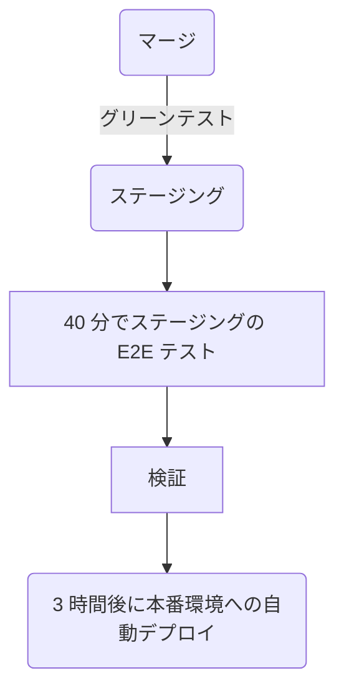

- [Direction](/handbook/product/groups/fulfillment/direction/fulfillment_section/)
- [Groups](/handbook/product/categories/#fulfillment-section)
- [Team](/handbook/engineering/development/fulfillment/#team-members)

## ビジョン

私たちが構築するプロダクトを通じて、お客様に世界クラスの購買体験を提供する [ハイパフォーマンスチーム](/handbook/leadership/#strategies-to-build-high-performing-teams) です。私たちのチームは、喜びを感じられる、パフォーマンスの高い、信頼できる、信頼性の高い体験を構築することを目指しています。

## ミッション

Fulfillment は以下の分野における機能とメトリクスの改善に注力しています:

- [Platform](/handbook/product/categories/#fulfillment-platform-group): [Team](/handbook/engineering/development/fulfillment/fulfillment-platform/#team-members)
- [Provision](/handbook/product/categories/#provision-group): [Team](/handbook/engineering/development/fulfillment/provision/#team-members)
- [Seat Management](/handbook/product/categories/#seat-management-group): [Team](/handbook/engineering/development/fulfillment/seat-management/#team-members)
- [Subscription Management](/handbook/product/categories/#subscription-management-group): [Features](/handbook/product/groups/fulfillment/direction/subscription_management/)
- [Utilization](/handbook/engineering/development/fulfillment/utilization/): [Team](/handbook/engineering/development/fulfillment/utilization/#team-members)

## 方向性

[Fulfillment プロダクト方向性](/handbook/product/groups/fulfillment/direction/fulfillment_section/) に加えて、Fulfillment Development サブ部門は以下を目指しています:

- Fulfillment インフラの信頼性と可用性を向上させる
- Fulfillment システムのアーキテクチャとデータモデルに対する基盤的な技術改善を行う
- より良いツールとドキュメントを通じて Fulfillment エンジニアの開発者体験を向上させる

## チームメンバー

Fulfillment セクションおよびサブグループのチームメンバーの一覧は https://handbook.gitlab.com/handbook/product/categories/#fulfillment-section を参照してください。

## 安定したカウンターパート

### Sales & Go-To-Market


<p class="my-3 text-sm text-gray-600 italic">チームメンバー情報は <a href="https://handbook.gitlab.com/handbook/engineering/development/fulfillment/" rel="external noopener">原文 (英語)</a> を参照してください。</p>


### Finance & IT


<p class="my-3 text-sm text-gray-600 italic">チームメンバー情報は <a href="https://handbook.gitlab.com/handbook/engineering/development/fulfillment/" rel="external noopener">原文 (英語)</a> を参照してください。</p>


### Support Engineering


<p class="my-3 text-sm text-gray-600 italic">チームメンバー情報は <a href="https://handbook.gitlab.com/handbook/engineering/development/fulfillment/" rel="external noopener">原文 (英語)</a> を参照してください。</p>


### Office of the CEO


<p class="my-3 text-sm text-gray-600 italic">チームメンバー情報は <a href="https://handbook.gitlab.com/handbook/engineering/development/fulfillment/" rel="external noopener">原文 (英語)</a> を参照してください。</p>


### Product Technical Program Management


<p class="my-3 text-sm text-gray-600 italic">チームメンバー情報は <a href="https://handbook.gitlab.com/handbook/engineering/development/fulfillment/" rel="external noopener">原文 (英語)</a> を参照してください。</p>


## プロジェクト管理プロセス

- [GitLab バリュー](/handbook/values/) に従います
- 透明性をもって: ほぼすべてが公開されており、可能な限り会議を録画・ライブ配信します
- 自分たちが取り組みたいことに取り組む機会があります
- 誰もが貢献できます。サイロはありません

### SAFE

GitLab で [SAFE な方法で](/handbook/legal/safe-framework/) 働くことは全員の責任です。私たちと Sales・Billing の安定したカウンターパートは、機密情報や財務情報に触れる可能性があり、ビジネス全体に影響を与える可能性のあるプロダクト領域に貢献しています。そのため、Fulfillment チームメンバーは、私たちが作成する SAFE なエピック・Issue・動画・MR・その他の成果物を機密に保つことを確認することが重要です。

場合によっては、SAFE な議論が行われている可能性のある公開 Issue の説明に、以下のような文言を含めることが適切な場合があります。

> このページには、今後提供予定のプロダクト、機能、機能性に関する情報が含まれている場合があります。
> 提示されている情報は情報提供のみを目的としていることに注意してください。
> そのため、購入または計画目的でこの情報に依存しないでください。他のすべてのプロジェクトと同様に、
> このページに記載されている項目は変更または遅延される可能性があり、製品・機能・機能性の開発、リリース、
> タイミングは GitLab Inc. の単独の裁量に委ねられています。

同様に、すべての情報をパブリックなハンドブックに含めるべきではありません。この SAFE な情報には代わりに [プライベートな内部ハンドブック](https://internal.gitlab.com/) を使用してください。

詳細については、[将来のバージョンにおける機能の約束](https://docs.gitlab.com/ee/development/documentation/styleguide/availability_details.html#promising-features-in-future-versions) に関するドキュメントを参照してください。

### 計画

[プロダクト開発タイムライン](/handbook/engineering/workflow/#product-development-timeline) に従い、月次サイクルで計画を立てます。
次のリリースのスコープは `1日` までに確定する必要があります。

`26日` 前後: プロダクトがエンジニアリングマネージャーと事前 Issue レビューのために会合を持ちます。Issue にはマイルストーンがタグ付けされ、最初の見積もりが行われます。

**計画 Issue**

- [Subscription Management](https://gitlab.com/gitlab-org/fulfillment/meta/-/issues/?label_name%5B%5D=Planning%20Issue&label_name%5B%5D=group%3A%3Asubscription%20management&sort=created_date&state=opened)
- [Fulfillment Platform](https://gitlab.com/gitlab-org/fulfillment/meta/-/issues/?label_name%5B%5D=Planning%20Issue&label_name%5B%5D=group%3A%3Afulfillment%20platform&sort=created_date&state=opened)
- [Provision](https://gitlab.com/gitlab-org/fulfillment/meta/-/issues/?label_name%5B%5D=Planning%20Issue&label_name%5B%5D=group%3A%3Aprovision&sort=milestone_due_desc&state=opened)
- [Utilization](https://gitlab.com/gitlab-org/fulfillment/meta/-/issues/?label_name%5B%5D=Category%3AUtilization&label_name%5B%5D=Planning%20Issue&scope=all&state=opened)

### 受付リクエスト

Fulfillment ロードマップに作業を追加するリクエストをする場合は、[このリンク](https://gitlab.com/gitlab-org/fulfillment-meta/-/issues/new?issue&issuable_template=intake) から Issue を作成し、Fulfillment プロダクトマネージャーの一人にタグ付けしてください。

Fulfillment プロダクトマネージャーがリクエストをレビューし、スコープと影響の評価を開始するために割り当てられます。チームの状況によっては時間がかかる場合があります。評価後、PM は:

1. 受付 Issue から関連する詳細を取り込んだ新しいエピックを作成します。
1. この新しいエピックを Fulfillment ロードマップに追加します。
1. 受付 Issue の説明を新しいエピックへのリンクで更新します。
1. 受付 Issue をクローズします。

私たちは、この受付リクエストプロセスを厳格に遵守し、対応する前にリクエストの完全な詳細を確実に把握できるようにします。プロダクトマネージャーがこのリクエストを受け取った後、リクエスターと協力して問題と要件を十分に理解します。その後、リクエストを [優先順位付け](/handbook/engineering/development/fulfillment/#prioritization) します。

### 優先順位付け

私たちは [優先順位付けフレームワーク](/handbook/product/product-processes/#prioritization) に従い、[クロスファンクショナル優先順位付けガイドライン](/handbook/product/product-processes/cross-functional-prioritization/) を含め、月次でバックログを優先順位付けします。R&D チームは、SLA、OKR、[Fulfillment 向けの L&R サポート優先 Issue リスト](/handbook/support/license-and-renewals/workflows/managing_product_issues/#supports-issue-for-fulfillment)、技術的負債など、様々なインプットとセンシングメカニズムを使用して優先順位を設定します。

私たちは新しい取り組みと技術的負債への短期・中期・長期の投資のバランスを取ることでビジネス価値を最大化することを目指しています。GitLab では、新製品開発に 60%、技術的負債とメンテナンスに 40% という全社的な配分目標を設定しています。ただし、この 60/40 の分割は柔軟であり、時間の経過とともにグループやセクションによって異なる場合があります。

Fulfillment セクションでは、OKR に焦点を当てた作業と、信頼性と効率性を向上させるためのエンジニアリングイニシアチブへの優先順位付けのバランスが取れたアプローチを確保するためのガイドラインとして 60/40 比率を採用しています。計画と実行においては適応力を保ち、これらの割合に硬直的に固執することを避けます。代わりに、OKR に反映されている会社のニーズの包括的な評価に基づいて作業を優先順位付けします。各グループが OKR の適切なバランスを見つけることに委ねています。グループ内で合意に達しない場合は、セクションレベルにエスカレーションして決定します。

グループレベルの月次マイルストーン計画では、OKR に合わせてアクティビティを最適化し、60/40 の分割からの逸脱を柔軟に許可します。また、[優先順位付けフレームワーク](/handbook/product/product-processes/#prioritization-framework) に従い、強制的な優先順位付けが必要な場合は SLA 内で確実に完了します。

すべてのチームが毎月 [クロスファンクショナルダッシュボードレビュー](/handbook/engineering/development/#cross-functional-dashboard-reviews) のために [月次優先順位付けテンプレート](https://gitlab.com/gitlab-org/fulfillment-meta/-/blob/master/.gitlab/issue_templates/monthly-prioritization.md) を使用します。

### 見積もり

Issue の作業を開始する前に、予備的な調査の後に見積もりを行う必要があります。これは通常、月次計画会議で行われます。

| ウェイト | 説明（エンジニアリング）|
| ------ | ------ |
| 1 | 最も単純な変更。副作用はないと確信している。 |
| 2 | シンプルな変更（コード変更は最小限）で、すべての要件を理解している。 |
| 3 | シンプルな変更だが、コードのフットプリントが大きい（例: 多くの異なるファイル、またはテストに影響する）。要件は明確。 |
| 5 | コードベースの複数の領域に影響する、より複雑な変更で、リファクタリングも含まれる場合がある。要件は理解しているが、途中でギャップが生じる可能性がある。 |
| 8 | コードベースの多くの部分を含む、または要件を決定するために多くの人からのインプットが必要な複雑な変更。 |
| 13 | 依存関係（他のチームまたはサードパーティ）がある可能性があり、まだすべての要件を理解していない重大な変更。マイルストーンでのコミットメントはおそらく行わず、要件をさらに明確にするか、より小さな Issue に分割することが好まれる。 |

計画と見積もりにおいて、私たちは [予測可能性よりも速度を](/handbook/engineering/development/principles/#velocity) 重視します。計画と見積もりの主な目標は、[MVC](/handbook/values/#minimal-valuable-change-mvc) に焦点を当て、盲点を明らかにし、過度な最適化なしにある程度の予測可能性を達成することです。GitLab の一般的な部門では [70% の予測可能性] を目標としていますが、Fulfillment サブ部門では、私たちの作業が通常クロスファンクショナルであり、他の部門と足並みを揃える必要があるため、80% の予測可能性を目標としています。

- Issue に多くの不明点があり、1 か 5 かが不明な場合は、慎重に高め（5）に見積もります。
- Issue に多くの不明点がある場合は、2 つの Issue に分割できます。最初の Issue はリサーチ（[スパイク](https://en.wikipedia.org/wiki/Spike_(software_development)) とも呼ばれる）で、不明点のリスクを低減し、潜在的な解決策を探ります。2 つ目の Issue は実装用です。
- 最初の見積もりが不正確で調整が必要な場合は、すぐに見積もりを修正してプロダクトマネージャーに通知します。プロダクトマネージャーとチームは、マイルストーンのコミットメントを調整する必要があるかどうかを決定します。

**見積もりテンプレート**

以下は、Issue の見積もりへの貢献を検討する際にエンジニアが考慮すべきメンタルフレームワークのガイドです。

```markdown
### 精査 / 重み付け

<!--
開発の準備ができているとは、以下の質問に「はい」と答えることを意味します：

- この Issue は十分に小さいですか? そうでない場合は、より小さな Issue に分割してください
- 正しいドメイン（例：フロントエンド、バックエンド）に割り当てられていますか? そうでない場合は、それぞれのドメインの 2 つの Issue に分割してください
- Issue は明確で理解しやすいですか? そうでない場合は、さらなる明確化を求め、回答を受け取ったら説明を更新してください

2 つ以上の MR が必要な場合は、説明に次のようなテーブルを追加することを検討してください（例：`実装計画` の下）。

| 説明 | MR |
|-|-|
|||

ステータスの追跡に役立ちます。
-->

- [ ] 開発の準備ができている
- [ ] ウェイトが割り当てられている
- [ ] MR の数が記載されている
- [ ] テストの考慮事項が必要
- [ ] ドキュメントの更新が必要

**理由：**

<!--
この Issue をどのように分解するかについての初期的な考えを追加してください。箇条書きで構いません。

これはおそらく以下のようなコード変更が必要になります：

- ヘックスドライバーをソニックスクリュードライバーに置き換える
- バックアップを磁気テープに書き直す
- セマフォフラグを上げて他の人に警告する

以前の例へのリンク。先行技術についての議論。提案されたデザインのシンプルさ/複雑さの例に注目する。
-->
```

### 作業の選択

エンジニアは [チームの計画 Issue を見つけて開いてマイルストーンボードを確認し](https://gitlab.com/gitlab-org/fulfillment-meta/-/issues/?sort=priority_desc&state=opened&label_name%5B%5D=Planning%20Issue&first_page_size=100)、`deliverable` ラベルが付いたものから優先的に作業を開始できます。

deliverable が完了したら、エンジニアはマイルストーンの残りの Issue から任意に選択できます。エンジニアに特に好みがない場合は、トップから次に利用可能な Issue を選択できます。

### ワークフロー

私たちは一般的に [プロダクト開発フロー](/handbook/product-development/how-we-work/product-development-flow/#workflow-summary) に従い、そこで定義されているワークフローラベルを使用します。

一般的に、Issue は 2 つの状態のいずれかにあります:

- 発見/精査: まだ開発の開始を妨げる質問に答えている段階
- 実装: エンジニアが取り組むのを待っているか、積極的に構築中

Basecamp はこれらのステージを [丘の登りと下り](https://basecamp.com/hill-charts) との関係で考えています。

個々のグループは [プロダクト開発フロー](/handbook/product-development/how-we-work/product-development-flow/#workflow-summary) ワークフローのステージをそれぞれの用途に応じて自由に使用できますが、Issue が発見/精査から実装へと移行する方法については、ある程度規定する必要があります。

### ユーザーエクスペリエンス

私たちはすべてのワークフローで優れた使いやすさを提供し、ユーザーとビジネスのニーズのバランスを取ることを目指しています。プロダクトデザイナーはプロダクトマネージャーとエンジニアと密接に連携します。

#### 作業方法

- ハンドブックの [プロダクトデザイン](/handbook/product/ux/) セクションに記載されている [プロダクトデザイナーワークフロー](/handbook/product/ux/product-designer/) および [UX リサーチャーワークフロー](/handbook/product/ux/experience-research/) に従います。
- [UX スコアカード](/handbook/product/ux/ux-scorecards/) を使用して進捗を測定します。
- 四半期ごとに最も重要なプロジェクトを優先し、Fulfillment プロダクトデザイナーは [グループではなくプロジェクトをサポート](#product-designer-focus-areas) します。
- [[UX] Issue](#ux-issue-management-and-weights) をデザインの SSOT として使用します。実装 Issue はデザインの詳細の SSOT を維持するために [UX] Issue にリンクする必要があります。
- ラベルを使用して Issue を追跡します:
  - `UX`、`devops::fulfillment`、`section::fulfillment`、および `group::`。
  - [プロダクト開発フロー](/handbook/product-development/how-we-work/product-development-flow/) における Issue の位置を示す `workflow::` ラベル
  - リサーチ活動のための `UX Problem Validation` と `UX Solution Validation`
  - UX Issue の重みのための `design weight::`

#### プロダクトデザイナーのフォーカスエリア

Fulfillment チームはプロジェクト重視であり、多くのプロジェクトがグループをまたぐため、ユーザーエクスペリエンスにギャップが生じたり、頻繁なデザイナーの借用リクエストが発生したりします。これを避けるために、デザイナーをプロジェクト領域に割り当て、OKR 計画中に四半期ごとに見直します。

- Fulfillment UX チームの優先事項は [優先順位付け Issue](https://gitlab.com/gitlab-org/fulfillment/meta/-/issues/?label_name%5B%5D=Fulfillment%20UX%20Priorities) に文書化されています。
  - 優先事項はチームが四半期ごと、または新しい優先プロジェクトが特定された際に見直す必要があります。
- 誰でも Issue でデザインフォーカスのために特定されたプロジェクトを提案できます。プロダクトマネージャーはプロダクトデザイナーおよびプロダクトデザインマネージャーと協力して優先順位をランク付けする必要があります。複数の PM がプロジェクトに貢献している場合は、1 人を UX 計画の担当として指定する必要があります。
  - デザインサポートなしで進めるプロジェクトの優先判断が必要な場合は、Issue にそれらの決定をリストしてください。
- デザイナーはまだ割り当てられたプロジェクト以外の Issue を引き受けることができます。これらは SUS 影響 Issue やバグなどの重要な UX Issue であるべきです。必要に応じてトレードオフを議論するために Issue の重みを使用できます。
- 誰でも #s_fulfillment_ux Slack チャンネルを使用してサポートを求めることができます。

ベストプラクティス

- ワークロードを管理するために、デザイナーは通常、一度に 1 つの大きいプロジェクトと 1 つの小さい/中規模のプロジェクト、または 3〜4 つの小さい/中規模のプロジェクト（または Issue の重みで同等のもの）に割り当てるべきです。
- デザイナーは最良の判断を用い、チームと協力してどのミーティングに参加するかを決定する必要があります。デザイナーは同時に複数のチームのチームシンクミーティングに参加することは期待されていません。
- プロダクトデザイナーは、サポートしているプロジェクトの [UX MR レビュー](/handbook/product/ux/product-designer/mr-reviews/) に割り当てられる必要があります。
  - デザイナーが割り当てられていないプロジェクトの一部である MR で UX レビューが必要な場合は、#s_fulfillment_ux Slack チャンネルにリクエストを投稿してください。Slack チャンネルでの UX MR レビューリクエストは、帯域に基づいて対応されます。

#### UX Issue の管理と重み

複数の開発 Issue を実装するのに 1 つ以上かかる中・大規模プロジェクト（エンドツーエンドのフロー、複雑なロジック、エンジニアリングによっていくつかの実装 Issue に分割される複数のユースケース/状態など）には、別の [UX] Issue を使用します。UX Issue には [UX] というプレフィックスを付ける必要があります。

実装が 1 つの Issue で行えるほど小さい作業の場合は、別の [UX] Issue は必要なく、デザイナーは自分を Issue に割り当て、デザインフェーズにあることを示すためにワークフローラベルを使用する必要があります。

- [UX] Issue はデザイン目標、デザイン草案、デザインの会話と批評、および実装されるデザインの方向性の SSOT です。実装 Issue は SSOT として [UX] Issue のデザインにリンクする必要があります。
- プロダクト要件の議論は、できる限りメインの Issue またはエピックで継続する必要があります。
- プロダクトデザイナーがデザインが ~"workflow::planning breakdown" の準備ができていることを示したい場合は、このラベルを Issue に適用し、PM と EM に通知し、Issue をクローズする必要があります。
- Issue の重みはラベルの定義に従い、~'design weight:' ラベルを使用して適用されます。

### 作業の承認とマージ

CustomersDot では承認ルールが有効になっているため、`main` を対象とするすべての MR には少なくとも 1 つの承認（著者/コミッターとは異なる人物から）が必要です。
MR は以下の基準を満たす必要があります:

- **少なくとも 2 人の異なるレビュワー**（うち 1 人はメンテナー）が必要です。ただし、**ロジックに変更がない些細な MR の場合は 1 人のレビュワーで十分**であり、そのような変更（例: マイナーな依存関係の更新、テストの修正、単純なリバート）は最初のレビューをスキップできます。
- 少なくとも 1 つの承認を受ける必要があります。
- メンテナーのレビューが必要です。

承認ルールに加えて、MR は [Danger ボット](https://docs.gitlab.com/ee/development/dangerbot.html) が提案する追加のレビューが必要な場合があります:

1. DB への変更はデータベースレビュワーとメンテナーの承認が必要です
1. セキュリティ関連の Issue（認証への変更など）は [セキュリティレビュー](/handbook/security/product-security/security-platforms-architecture/application-security/appsec-reviews/#adding-features-to-the-queue--requesting-a-security-review) が必要です
1. SFDC API への変更は [Sales チーム](/handbook/sales/field-operations/sales-systems/) によるレビューが必要です
1. Zuora API への変更は [EntApps チーム](/handbook/business-technology/enterprise-applications/) によるレビューが必要です
1. ユーザーエクスペリエンスへの変更は [UX レビュー](/handbook/product/ux/product-designer/mr-reviews/) が必要です。

### 週次非同期 Issue 更新

毎週、各エンジニアは以下のテンプレートを使用して割り当てられた Issue にコメントすることで、クイックな非同期 Issue 更新を提供することが期待されます:

```markdown
<!---
以下のいずれか（状態を最もよく表すもの）に Issue のワークフローラベルを更新してください：
- ~"workflow::In dev"
- ~"workflow::In review"
- ~"workflow::verification"
- ~"workflow::blocked"
-->
### 非同期 Issue 更新

1. 現在の状態の簡単な要約を提供してください（1 文）
    -
1. これが現在のマイルストーンに含まれるとどのくらい確信していますか？
    - [ ] 確信していない
    - [ ] やや確信している
    - [ ] 非常に確信している
1. Issue またはマージリクエストをさらに小さなピースに分割する機会がありますか（該当する場合）？
    - [ ] はい
    - [ ] いいえ
1. 以前の更新からの期待に応えられましたか？そうでない場合は、理由を説明してください。
    - [ ] はい
    - [ ] いいえ、___
1. 関連する Issue は最新の状態ですか？この Issue にリンクできるエピック内の欠けている Issue をリンクしてください
    - [ ] はい
    - [ ] いいえ

/health_status [on_track, needs_attention, at_risk]
```

これは、チームが非同期でのコラボレーションをより積極的に行い、コミュニティや他のチームメンバーが積極的に取り組んでいる Issue の進捗を把握できるようにするためです。

### 非同期プロジェクト更新

このテンプレートは、リーダーシップとクロスファンクショナルパートナーと共有するための大規模プロジェクトの進捗状況の更新に使用します。

リーダーシップが関心を持っていること

1. プロジェクトは進んでいますか？ --> 週ごとの完了率を確認してください
2. 解消が必要なブロッカーはありますか？ --> リスクとブロッカーを確認してください
3. 次のイベントはいつ予定されていますか？ --> 主要な日付を確認してください

このテンプレートはガイドラインであり、特定のプロジェクトのニーズに合わせて変更することができます。テンプレートから逸脱する前に、リーダーシップが複数のプロジェクトのステータス更新を確認していることを念頭に置いてください。プロジェクト間の一貫性が高いほど、リーダーシップがステータスを正確に理解しやすくなります。

```markdown
## XXXX-XX-XX 時点のステータス更新

### 要約

1. **主要リソース**
  * **_TBD_ このセクションはオプションです**

2. **完了率**: `X%`

3. **ステータス**: `順調 または 遅延` （これは主要日付に向けての完了率のトレンドに基づいて決定されます -- 主要日付に合わせるために十分に進んでいますか？）

4. **主要日付**:

 * デザイン完了 - マイルストーン XX.X
 * 開発完了 - マイルストーン XX.X
 * 本番環境でのロールアウト - XXXX-XX-XX

### リスクとブロッカー

| リスクとブロッカー | 緩和アプローチ |
|------------------|---------------------|
| **_新規!_** |  |

### 結果/課題/学習

_あらゆる種類の成果物をリストしてください。例: マージされた MR、解決策の合意、コピー/デザインの完成_


1.

**FYI** 関係者へのタグ付け

```

### デモ

一部の作業は数マイルストーンにわたって完了するまでに時間がかかることがあります。定期的な非同期 Issue 更新とともに、デモを設定することが役立ちます。利点は以下の通りです:

- フィードバックサイクルの短縮
- 作業の可視性の向上
- 作業と進捗のコミュニケーションの改善

MR のレビュープロセスを容易にするためにデモと録画を提供することはすでに奨励されていることに注意してください。

この目的のために、YouTube プレイリストが作成されています: [Fulfillment デモ](https://www.youtube.com/playlist?list=PL05JrBw4t0KpOKxufy-slaR-6swIfkDLP)（一部のコンテンツは内部専用）。デモをアップロードするには、[こちらで説明されているプロセス](/handbook/engineering/workflow/demos/) に従ってください。動画が作成されたら、[Fulfillment デモ](https://www.youtube.com/playlist?list=PL05JrBw4t0KpOKxufy-slaR-6swIfkDLP) プレイリストにリンクしてください。説明に以下の情報を追加することを検討してください:

- エピック/Issue へのリンク
- MR へのリンク（ある場合）
- アップロードした人の名前とプロフィールへのリンク（オプション）

[例](https://www.youtube.com/playlist?list=PL05JrBw4t0KpOKxufy-slaR-6swIfkDLP) はこちら（内部専用）

### 品質

GitLab の品質は全員の責任です。

#### エンドツーエンドテスト - 書き方、タイミング、理由

エンドツーエンドテスト（しばしば e2e テストと呼ばれる）は、エンドユーザーが経験するフルまたは部分的なフローをカバーします。テストレベルの詳細情報は [こちら](https://docs.gitlab.com/ee/development/testing_guide/testing_levels.html) で確認できます。

これらのフローの例:

- GitLab.com の名前空間向けの SaaS サブスクリプションの購入。
- セルフマネージドの GitLab インスタンス向けの新しいサブスクリプションの購入。

これらのテストは高速ではなく、フレーキーになりやすいため、エンドツーエンドテストでカバーするものと下位レベルのテストに委ねるものの優先順位を考慮する必要があります。

Fulfillment のテストは [GitLab プロジェクト](https://gitlab.com/gitlab-org/gitlab/-/tree/master/qa/qa/specs/features/ee/browser_ui/11_fulfillment) と [CustomersDot プロジェクト](https://gitlab.com/gitlab-org/customers-gitlab-com/-/tree/main/qa) の両方に存在します。テストを書く際にどちらのプロジェクトを使用するかを決定するには、以下のガイドを使用してください:

- テストが CustomersDot ポータルを開いてアクションを実行する必要がある場合は CustomersDot を選択し、そうでない場合は GitLab が正しいプロジェクトです。
- 将来的には、CustomersDot はバックエンドサービスのみになり、UI エンドツーエンドテストは GitLab のみに存在する予定です。

#### GitLab

GitLab エンドツーエンドテストガイドは [こちら](https://gitlab.com/gitlab-org/gitlab/-/blob/master/doc/development/testing_guide/end_to_end/beginners_guide.md) で確認できます。

GitLab プロジェクトの計画済み・自動化された Fulfillment テストケースは [こちら](https://gitlab.com/gitlab-org/gitlab/-/quality/test_cases?state=opened&sort=created_desc&page=1&label_name%5B%5D=devops%3A%3Afulfillment) で確認できます。

#### CustomersDot

CustomersDot エンドツーエンドのビギナーズガイドは [こちら](https://gitlab.com/gitlab-org/customers-gitlab-com/-/blob/main/qa/doc/beginners_guide.md) で確認できます。

CustomersDot プロジェクトの計画済み/自動化されたテストケースは [こちら](https://gitlab.com/gitlab-org/customers-gitlab-com/-/quality/test_cases) で確認できます。

### テスト

CustomersDot では異なる種類のテストが実行されています:

1. リンティングと [rubocop](https://github.com/rubocop/rubocop) ジョブ
1. ユニットテスト（スペック、コントローラースペックなど多くの種類がある）
1. インテグレーションテスト（スペック、外部呼び出しをモック）
1. フロントエンドテスト
1. [Watir 経由の](https://github.com/watir/watir) E2E インテグレーションテスト

また、デフォルトで Zuora への外部呼び出しをモックする `VCR` フラグがあります。毎日 UTC 9 時に、フラグを設定した状態で [日次パイプライン](https://gitlab.com/gitlab-org/customers-gitlab-com/pipeline_schedules) が実行され、API 呼び出しが Zuora サンドボックスにヒットし、失敗（潜在的な API 変更による）が通知されます。

テストの失敗はパイプラインへのリンクと共に #s_fulfillment_status に通知されます。パイプラインの失敗はステージングと本番環境へのデプロイを妨げます。

### セキュリティ

#### アクセスレビュー

Fulfillment Engineering のエンジニアリングマネージャーとシニアリーダーシップは、Fulfillment システム（例: CustomersDot）のアクセスレビューを四半期ごとに行う責任があります。[アクセスレビュー](/handbook/security/security-assurance/security-compliance/access-reviews/) を実施するために、`システムへのアクセスはジョブロールと部門に基づいてレビューされます` というガイダンスを使用します。そのため、レビュワーは現在のロールと部門との関連性を評価しながら、現在アクセス権を持つチームメンバーのリストを評価する際に最善の判断を使用します。

以下のリストには、アクセスを保持すべき標準的な部門とチームが含まれています:

**読み取り専用アクセス**

- Sales チーム

**書き込みアクセス**

- AppSec チーム
- Billing チーム
- Fulfillment サブ部門（エンジニアリング、プロダクト、品質、その他のカウンターパート）
- IT ヘルプデスク
- サポートチーム

迷った場合は、アクセスを拒否する側に立ってください。別の [アクセスリクエスト](/handbook/security/corporate/end-user-services/access-requests/access-requests/) を通じて簡単に復元できます。

### デプロイ

#### 収益に影響する変更

Fulfillment はエンジニアリングにおいてユニークな存在です。なぜなら、私たちの変更が直接収益に影響する可能性があるからです。収益に影響する変更や特にリスクの高い変更は、Fulfillment 以外のチームからの意見を含む、より広い精査が必要な場合があります。PM はこれらの決定の DRI であり、Sales、Enterprise Applications、Marketing、Finance、Customer Support などのステークホルダーからインプットを受けます。

変更が潜在的に高いリスクをもたらす場合でも、私たちはできる限りイテレーティブであることを目指しています。

以下は、多くのチーム間の調整が必要になる可能性があるため、高リスクになりうる変更の例です:

- 価格変更
- 課金変更
- 新しい有料機能のリリース
- 既存の有料機能の廃止
- 利用規約および関連する契約変更
- リソースの消費量の計算または表示方法の変更（例: ユーザー数、コンピュート分数）

以下は、低リスクになりうることが多い変更です:

- フロントエンドでまだ使用されていないバックエンドの拡張
- フィーチャーフラグの後ろにあるフロントエンドとバックエンドの拡張
- フィーチャーフラグの後ろにはないが、「ベータ」または「実験的」としてラベル付けされているフロントエンドの拡張

高リスクな変更については、以下のプロセスに従う必要があります:

- 新しい/更新された動作のフィーチャードキュメントを更新し、関連するステークホルダーと共有する
- これらの変更には機密 Issue を使用する
- リリース日に有効化できるようにフィーチャーフラグの下で変更をリリースする
- リリース日のロールアウト Issue を作成し、すべての関係者がプロセスについて知っていることを確認する。[例](https://gitlab.com/gitlab-org/gitlab/-/issues/299068)
- 変更をイテレーティブにテストできるように、一部のお客様に対してのみ有効化することを検討する
- 機密 MR が改善されるまで（[1](https://gitlab.com/groups/gitlab-org/-/epics/1175), [2](https://gitlab.com/groups/gitlab-org/-/epics/264)）、Issue が機密の場合でも通常の MR プロセスを使用する

#### CustomersDot

[CustomersDot](https://gitlab.com/gitlab-org/customers-gitlab-com/) には CD（継続的デプロイ）を使用しており、MR が `staging` ブランチにマージされると、以下のステージを経ます:



`検証` ステージで何か問題が発生した場合は、`production::blocker` ラベルを持つ Issue を作成でき、それにより本番環境へのデプロイが阻止されます。Issue は機密にできません。

本番環境ブロッカーが設置されている場合に修正の MR が必要な場合は、その MR の本番環境デプロイを早めることができます。
3 時間の遅延をスキップし、`production::blocker` ラベルを削除またはIssueをクローズした直後に手動デプロイがトリガーされるように、本番環境へのデプロイジョブのスケジュールを解除する必要があります。

大きな変更を含む MR の場合は、[フィーチャーフラグ](https://gitlab.com/gitlab-org/customers-gitlab-com/#feature-flags-unleash) の使用を検討するか、`production::blocker` ラベルを持つ Issue を作成してデプロイを一時停止し、より長いテストを可能にする必要があります。

#### フィーチャーフリーズ

Fulfillment のフィーチャーフリーズは、通常マイルストーンが終わる金曜日の周辺に、会社の残りの部分と同時に発生します。

| アプリ | フィーチャーフリーズ (*) | マイルストーン終了 |
| ---      |  ------  |----------|
| GitLab.com   | マイルストーンが終わる金曜日からリリース日まで | フリーズと同じ |
| Customers/Provision   | マイルストーンが終わる金曜日からリリース日まで | フリーズと同じ |

(*) フィーチャーフリーズは [auto-deploy ドキュメント](https://gitlab.com/gitlab-org/release/docs/-/blob/master/general/deploy/auto-deploy.md) によって変わる場合があります。

フィーチャーフリーズ後に現在のマイルストーンでマージされなかった Issue は、次のものに移す必要があります（優先度も変わる場合があります）。

#### 本番環境変更ロック（PCL）

GitLab は、主要な世界的な祝日などの特定のイベント中に本番環境の変更を一時的に停止する場合や、GitLab チームメンバーの可用性が大幅に低下する場合があります。PCL の詳細については、[このインフラハンドブックページ](/handbook/engineering/infrastructure-platforms/change-management/#production-change-lock-pcl) で確認できます。

これらの PCL の期間中、特に年末には、CustomersDot での PCL は [PCL テンプレートを使用した](https://gitlab.com/gitlab-org/customers-gitlab-com/-/tree/main/.gitlab/issue_templates/Pcl.md) Issue を作成することで管理されます。この Issue には、`production::blocker` ラベルの追加または削除のための DRI とターゲット時刻とともにチェックリストの指示を含める必要があります。PCL が終了したら、Issue をクローズできます。

##### Zuora ブロック期間

Zuora は [リリースカレンダー](/handbook/business-technology/enterprise-applications/pmo/#release-calendar) に従い、変更リクエストが不可能または追加の承認が必要なブロック期間があります。

### インシデント管理

進行中の [Fulfillment Platform](/handbook/engineering/development/fulfillment/fulfillment-platform/) の作業は、すべての Fulfillment システムへのより大きな可観測性を提供します。それまでの間、[CustomersDot health](https://customersdot.cloudwatch.net/) などのツールがあり、Slack の [#s_fulfillment_status](https://gitlab.slack.com/archives/CL7SX4N86) に投稿されます。場合によっては、ライブネスプローブチェックの失敗、無効な SSL 証明書、またはその他のアプリケーションエラーなど、重大なシステム的な問題の報告があります。エラー解決に貢献できる方法については、以下のサブセクションを参照してください。

[GitLab モニタリング](/handbook/engineering/monitoring/) および [インシデント管理](/handbook/engineering/infrastructure-platforms/incident-management/) の詳細については、このハンドブックページを参照してください。

#### インシデントやアウテージのエスカレーションプロセス

**Tier 2 SME オンコールエスカレーション**

Fulfillment は、インシデント対応のために [Tier 2 SME オンコールローテーション](https://gitlab.com/gitlab-com/gl-infra/production-engineering/-/issues/27741) を実装しています。このプロセスは、Fulfillment チーム内の対象分野の専門家への構造化されたエスカレーションを提供します。

**Tier 2 がページングされる場合:**

- インシデントやアウテージの際、Engineer on Call (EOC) は incident.io を通じて Fulfillment Tier 2 SME オンコールローテーションにエスカレーションできます
- Tier 2 SME ローテーションは [定義されたエスカレーションパス](/handbook/engineering/infrastructure-platforms/incident-management/on-call/tier-2/) に従います:
  - **レベル 1**: スケジュールローテーション（EMEA、AMER、または APAC）に基づく現在の SME オンコール
  - **レベル 2**: レベル 1 が 15 分以内に確認されない場合、すべてのチームメンバーへのラウンドロビンでエスカレーション
  - **レベル 3**: [James Lopez](https://gitlab.com/jameslopez) へのさらなるエスカレーション

**アウテージの追加の自動通知:**

- アウテージが発生すると、Slack の `#s_fulfillment_status` に通知が届き、[James Lopez](https://gitlab.com/jameslopez) と [Vitaly Slobodin](https://gitlab.com/vitallium) が自動電話ページを受信します

**一般的なインシデント報告:**

1. アウテージが発生すると、[SRE オンコール](/handbook/engineering/on-call/) が自動的に通知されます。インシデントは [手動で報告](/handbook/engineering/infrastructure-platforms/incident-management/#reporting-an-incident) することもできます。
1. 必要な場合、SRE オンコールまたはインシデント報告者は Slack で `@fulfillment-engineering` をピングしてチームから通知とヘルプを得ることができます

#### 緊急 Issue のエスカレーションプロセス

ほとんどの場合、MR は上記で説明したレビュー、メンテナーレビュー、マージ、デプロイの標準プロセスに従う必要があります。本番環境が壊れている場合:

1. まず [Rapid Engineering Response](/handbook/engineering/workflow/#rapid-engineering-response) プロセスに従うべきかどうかを判断します。これは可用性と状況の重大性によって異なります。
1. ステージングと本番環境の自動デプロイ間の 3 時間の待機は、メンテナーによる手動デプロイでバイパスできます。
1. プロジェクトメンテナーが利用できない場合（[CustomersDot](/handbook/engineering/projects/#customers-app)）、メンテナーアクセスを持つ別の GitLab チームメンバーに支援を依頼できます。

これらの場合には以下を確認してください:

1. [Rapid Engineering Response](/handbook/engineering/workflow/#rapid-engineering-response) に従い、エスカレーションの理由を説明する Issue があること。関連する [Growth/Fulfillment チーム](https://gitlab.com/gitlab-org/growth) に '@' メンションすることを検討してください。
1. 変更が [#s_fulfillment](https://gitlab.slack.com/archives/CMJ8JR0RH) チャンネルで発表されていること。

#### 調査

- [こちら](https://customersdot.cloudwatch.net/) でヘルスチェックインスタンスを確認できます。ログイン資格情報は [1Password の _Subscription portal_ ボールト](https://gitlab.1password.com/vaults/27nafqigafgxfjpjkl2wvzs26y/allitems/jdeumqscahayoxvcfazbzdv22u) で確認できます。CustomersDot の本番環境とステージングの両方のサービスが表示されます。
- CustomersDot の例外は [Sentry](https://sentry.gitlab.net/gitlab/customersgitlabcom/) で捕捉されます。
- [Kibana / Elasticsearch](https://log.gprd.gitlab.net/) でログを検索できます。GitLab での [Kibana の使用方法](/handbook/support/workflows/kibana/) については、こちらのリンクを参照してください。
- Grafana には GitLab に対して一般的に適用できる [トリアージダッシュボード](https://dashboards.gitlab.net/d/RZmbBr7mk/gitlab-triage?orgId=1&refresh=5m) がありますが、InfraDev の作業が完了するまで Fulfillment システムの特定の可観測性メトリクスは含まれていません。
- 本番環境の可用性アラートを報告するブラックボックスプローブは [Slack の #production](https://app.slack.com/client/T02592416/C101F3796/) に報告されます

#### インシデントの宣言

[インシデントの申し上げ](/handbook/engineering/infrastructure-platforms/incident-management/#report-an-incident-via-slack) は、ブロッキング問題への即時の対応が必要な場合に常に選択肢となります。

ブロッキング問題の例:

- ステージングまたはテスト環境でのサービス中断を引き起こす期限切れの証明書

本番環境のアウテージなどの重大な問題は迅速に提起する必要があります。インシデントを提起する前に [#incident_management](https://gitlab.slack.com/archives/CB7P5CJS1) を確認できます。

- CustomersDot のアウテージ
- CustomersDot のデプロイ失敗

#### Grafana ダッシュボード

これらのダッシュボードは、機能カテゴリで作業しているすべての人に、コードが GitLab.com スケールでどのように動作するかについての洞察を提供するように設計されています。

- [Provision](https://dashboards.gitlab.net/d/stage-groups-provision/stage-groups-group-dashboard-fulfillment-provision)
- [Utilization](https://dashboards.gitlab.net/d/stage-groups-subscription/stage-groups-group-dashboard-fulfillment-utilization)

### カスタマーエスカレーション

ライセンス問題（サポートまたは営業から）でプロダクト管理やエンジニアリングへのエスカレーションが必要な場合は、[サポートハンドブックページ](/handbook/support/internal-support/#regarding-licensing-and-subscriptions) の `ライセンス Issue に関するサポート` に記載されているプロセスを通じて Issue を作成してください。Slack やその他の方法でのエスカレーションの代わりにこれを行ってください。

Fulfillment のプロダクト管理とエンジニアリングのリーダーは、作成された時に気づけるように `License Issue High ARR` ラベルをサブスクライブします。これは [ラベル検索](https://gitlab.com/gitlab-com/support/internal-requests/-/labels?subscribed=&search=license%20issue%20high%20arr) で行い、`License Issue High ARR` ラベルの「サブスクライブ」をクリックします。

### ふりかえり

#### 月次ふりかえり

`8日` 以降、Fulfillment チームは [非同期ふりかえり](/handbook/engineering/careers/management/group-retrospectives/) を実施します。Fulfillment の現在および過去のふりかえりは [https://gitlab.com/gl-retrospectives/fulfillment/issues/](https://gitlab.com/gl-retrospectives/fulfillment/issues/) で確認できます。

##### ふりかえりへの貢献

全員が非同期ふりかえりの Issue に参加することが奨励されています。これはチームメンバーのフィードバックのための安全な空間です。ただし、同期ふりかえりの議論でコメントや懸念を述べたり、マネージャーや他の部門のリーダーシップと共有したりすることも歓迎されています。効率的で安全なふりかえりを実施するために [このガイダンス](engineering/management/group-retrospectives/) に従います。

念頭に置くべきこと:

- 共有された項目は、記念碑的な成功や失敗である必要はありません。ふりかえり Issue の「うまくいったこと」と「うまくいかなかったこと」のセクションに小さな項目も含めることを検討してください。
- 部門全体には関連性が薄いと感じる項目を共有するには、チーム固有のスレッドを使用してください。
- インスピレーションのためにチームシンクアジェンダアイテムの「勝利」や「課題」から引き出してください。
- コンピュータの限界を見つけ、マイルストーン全体で現在のふりかえり Issue を開いたままにしてください。

##### 非同期ふりかえりの同期ディスカッション

非同期ふりかえりのコメント期間が終わってから約 1 週間後（翌月の 26 日）に、次のステップ、アクションアイテム、プロセスの改善について議論するための同期ミーティングを開催します。このミーティングは EM と IC の両方が進行できます。APAC、AMER、EMEA フレンドリーな時間帯のローテーションでミーティングをスケジュールすることで、タイムゾーンに配慮することを目指しています。このミーティングは録画され、Fulfillment の全員の利益のために共有されます。

#### イテレーションふりかえり

GitLab にはイテレーション能力を向上させるためのいくつかのリソースがあります:

- [エンジニアリングイテレーションドキュメント](/handbook/engineering/workflow/iteration/)
- [プロダクトイテレーションドキュメント](/handbook/product/product-principles/#iteration)
- [セルフガイドイテレーショントレーニング Issue](https://gitlab.com/gitlab-com/Product/-/issues/new?issuable_template=iteration-training)
- [イテレーションオフィスアワー](/handbook/ceo/#iteration-office-hours)
- [マイルストーンふりかえり](/handbook/engineering/development/fulfillment/#retrospectives)
- [イテレーションふりかえり](#iteration-retrospectives)

アジャイルソフトウェア開発の実践では、`イテレーションふりかえり` というフレーズを使用して、[マイルストーンふりかえり](/handbook/engineering/development/fulfillment/#retrospectives) で実施することを説明します。マイルストーンふりかえりは私たちがどのように改善できるかを理解するために不可欠ですが、複数のチームにまたがる広い焦点を持っています。それは、継続・修正・改善できることについての反省を通じて誰もが貢献できる安全な空間です。

GitLab バリューの意味でここで使用しているイテレーションふりかえりは、**成功または失敗した** イテレーションの試みの具体的な例（またはいくつかの例）に焦点を当てています。つまり、将来的によりイテレーティブかつ効率的にするために何が異なる方法でできたかを深く理解するために調べることができる Issue、エピック、またはマージリクエストです。これらのふりかえりは、イテレーティブなマインドセットを開発する成長の機会を提供します - 構築し、その後より良く構築する。

各グループは独自のイテレーションふりかえりを実施する必要がありますが、チームメイトや他のチームがあなたの調査から学べるようにできる限り透明に共有してください。

**頻度**

イテレーションふりかえりは四半期ごとに実施する必要があります。

**準備**

エンジニアリングマネージャーまたは他のチームメンバーは、イテレーションふりかえりの良い挑戦的な候補 Issue を見つけるために現在または過去のマイルストーンをレビューする必要があります。提案から 1 つ（または関連する 2 つ）を選択し、ふりかえり Issue を作成します。

効果的なふりかえりのために [これらのルール](/handbook/engineering/careers/management/group-retrospectives/) を確認してください。

**参加**

誰もが非同期でディスカッションに貢献できます。また、すべきです。レビューのために選択した Issue で述べられた問題を分解するための代替的な方法やメカニズムに関するアイデアを提示してください。問題の分解が適切だった場合は、プロセスや他の改善についての提案も歓迎されます。

議論に固執しないでください。参加は 1 週間のタイムボックスにすべきです。テンプレートには 1 週間の期限クイックアクションが利用できます。

この回顧から得た結論からの学びについて、ハンドブックの更新、プロセスの変更、情報の共有を検討してください。

**テンプレート（オプション）**

```markdown
イテレーションは GitLab の 6 つのバリューの 1 つですが、非常に難しいものでもあります。過去にどのようにイテレーションがうまくいったか、うまくいかなかったかに焦点を当てることで、より速くイテレーションできるようになります。以下の[イテレーションふりかえり](#ハンドブックページへのリンク)に貢献してください。

## 要約

<!--
Issue の簡単な要約を含めてください。主な成果、重要な変更、影響について検討してください。
-->

`Issue の要約`

## 詳細

<!--
Issue を作成する際に以下の詳細を完成させてください。
-->

- チームはイテレーションの目標を達成しましたか？なぜ、またはなぜ達成しなかったのですか？
- イテレーションを完了するためにいくつの MR が作成されましたか？
- この Issue に関連する MR のマージまでの日数は何日でしたか？
- ピアや安定したカウンターパートとのコラボレーションに関して成功または改善の機会がありましたか？
- 元の Issue をより小さなコンポーネントに分解できましたか？
- MR をより小さなコンポーネントに分解できましたか？

## タスク

**読む**

- [イテレーションバリュー](/handbook/values/#iteration)
- [エンジニアリングイテレーション](/handbook/engineering/workflow/iteration/)
- [なぜイテレーションがマージリクエスト率を向上させるのに役立つのか](https://about.gitlab.com/blog/2020/05/06/observations-on-how-to-iterate-faster/)

**見る**

- [Christopher と Sid とのエンジニアリングにおけるイテレーションについてのインタビュー](https://www.youtube.com/watch?v=tPTweQlBS54)
- [CEO とのイテレーションオフィスアワー](https://www.youtube.com/watch?v=liI2RKqh-KA)


**貢献する**

以下のスレッドで以下を検討してください:

- なぜ（非）成功したのか？成功した場合、[MVC](/handbook/product/product-principles/#the-minimal-valuable-change-mvc) の定義をどのように満たしたか？
- 例がどのように [MVC](/handbook/product/product-principles/#the-minimal-valuable-change-mvc) の定義を満たさなかったか？どのような方法で異なるイテレーションができたか？具体的な例をリストアップしてください。
- プロセスとワークフローに組み込めるチームの改善点を特定する。

効果的なふりかえりのために [これらのルール](/handbook/engineering/careers/management/group-retrospectives/) に従ってください。

すべてのタスクが完了したら、完了リストに名前をチェックしてください。

**完了**

<!--
この Issue を作成する際に、人のプレースホルダーをチームメンバーで置き換え、適切に安定したカウンターパートを選択してください。
-->

- [ ] 人
- [ ] 人
- [ ] 人
- [ ] 人

**次のステップ**

- [ ] エンジニアリングマネージャーがイテレーションを改善するために組み込んだアイデアと改善でチームのハンドブックページを更新する。

## スレッドプロンプト

<!--
会話スレッドを開始するためにこれらのプロンプトまたは類似のものを使用してください。
-->

1. Issue/エピックと結果の MR のどの側面がイテレーションの非常に良い/悪い例でしたか、なぜですか？
1. この作業がどのように分解できたかについて代替のアイデアはありますか？
1. チームとしてのイテレーションを改善できるプロセスや作業方法に変更できることはありますか？


/due in 1 week
/label ~"Iteration Retrospective"
```

### プロジェクトケイデンス

この表は、プロジェクト管理プロセスの一部である定期的なアクティビティをリストしています。明確に定義されたケイデンスを持つことで、チームがどのアクティビティがいつ起きているかを理解することが容易になります。リストされたアクティビティは [会社のケイデンス](/handbook/company/cadence/) に密接に従います。このマークダウンテーブルを編集するには [このスプレッドシート](https://docs.google.com/spreadsheets/d/16mPUmFe7g8VWC-b137mWiCcy6s3e_JbD6i4nE1igSOM/edit#gid=0) を使用してください。

| アクティビティ | ケイデンス | タイプ | 関係チーム |
|---|---|---|---|
| [GitLab.com デプロイ](/handbook/engineering/releases/#gitlabcom-deployments) | 継続的 | 非同期 | Delivery Engineering |
| [CustomersDot デプロイ](https://gitlab.com/gitlab-org/customers-gitlab-com#deployments) | 継続的 | 非同期 | Fulfillment Engineering |
| [Issue 更新](/handbook/engineering/development/fulfillment/#weekly-async-issue-updates) | 週次 | 非同期 | Fulfillment セクション |
| [Fulfillment 週次更新](https://gitlab.com/gitlab-org/fulfillment-meta/-/issues?sort=created_date&state=all&label_name[]=weekly+update) | 週次 | 非同期 | Fulfillment PM、EM、QEM、UXM |
| [Fulfillment グループシンク](https://calendar.google.com/calendar/u/0/embed?src=gitlab.com_7199q584haas4tgeuk9qnd48nc@group.calendar.google.com&ctz=America/Bogota) | 週次 | 同期 | Fulfillment Utilization、Provision、InfraDev グループ |
| [Fulfillment PM シンク](https://docs.google.com/document/d/1t1KHlpjIEEzG02Gqth6uttQ0Vc3-pFo7yScTgvHWgeQ/edit) | 週次 | 同期 | Fulfillment PM |
| [Fulfillment、Growth、AI Assisted EM シンク](https://docs.google.com/document/d/1amVctQAmAVIXijxfyLxJNsdR2OqP6IXAK1sqD2pQMi4/edit) | 週次 | 同期 | Fulfillment、Growth、AI Assisted EM |
| [Fulfillment PM / EM / QEM / UXM シンク](https://docs.google.com/document/d/1UBfHiGK6BgJY76sFJ1qqlsRbtYhbBZETpaA4ftX_BBc/edit) | 週次 | 同期 | Fulfillment PM、EM、QEM、UXM |
| OKR チェックイン | 週次 | 非同期 | Fulfillment PM、EM、QEM、UXM |
| [月次セルフマネージドリリース](/handbook/engineering/releases/#self-managed-releases) | 月次 | 非同期 | Delivery Engineering |
| [月次リリースポスト](/handbook/marketing/blog/release-posts/) | 月次 | 非同期 | プロダクトとマーケティング機能 |
| [マイルストーン計画](/handbook/engineering/development/fulfillment/#planning) | 月次 | 非同期 | Fulfillment Utilization、Provision、InfraDev グループ |
| ロードマップ計画 | 月次 | 同期 | Fulfillment PM、EM、QEM、UXM |
| [ふりかえり Issue](https://gitlab.com/gl-retrospectives/fulfillment/-/issues/) | 月次 | 非同期 | Fulfillment セクション |
| [ふりかえりディスカッション](https://docs.google.com/document/d/1eL1QLtIGGxqYfaVQXIWhxAUvqTMw1OQLVQ68ZYib40g/edit) | 月次 | 同期 | Fulfillment セクション |
| [方向性レビュー](/handbook/product/groups/fulfillment/direction/fulfillment_section/) | 四半期 | 非同期 | Fulfillment PM、プロダクトリーダーシップ |
| OKR 計画 | 四半期 | 非同期 | Fulfillment PM、EM、QEM、UXM、スタッフエンジニア |
| [取締役会ミーティング](/handbook/board-meetings/#board-meeting-schedule) | 四半期 | 非同期 | Fulfillment PM、E-Group、取締役会 |

## ワーキンググループとクロスファンクショナルイニシアチブ

この表は [ワーキンググループとクロスファンクショナルイニシアチブ](/handbook/company/working-groups/) の一部である定期的なアクティビティをリストしています。このマークダウンテーブルを編集するには [このスプレッドシート](https://docs.google.com/spreadsheets/d/16mPUmFe7g8VWC-b137mWiCcy6s3e_JbD6i4nE1igSOM/edit#gid=463091797) を使用してください。

| アクティビティ | ケイデンス | タイプ | 関係チーム |
|---|---|---|---|
| [購入信頼性ワーキンググループ](https://docs.google.com/document/d/1m6sozlyvEIEKcEIPF2_nujrYTOV3IPpx_jaPXD1hPpU/edit) | 週次 | 同期 | Fulfillment Engineering、Infrastructure、IT、CEO、Office of the CEO |
| [GTM プロダクト使用データワーキンググループ](https://docs.google.com/document/d/1riUXq1GdavnSWJklrebBeZnzcAl6XATyLod9tR6-AlQ/edit) | 週次 | 同期 | Fulfillment PM、Analytics Instrumentation、Data、Customer Success、Sales |
| [GitLab Order to Cash Technical Fusion チーム](https://docs.google.com/document/d/17tJraRunjge5nI-qBEjWlhcKWYLXwGW4uhhu-Sf5464/edit) | 週次 | 同期 | Fulfillment PM、Fulfillment Engineering、EntApps、Sales Systems |
| [R&D チーム向けデータ＆分析プログラム](https://docs.google.com/document/d/1CRIGdNATvRAuBsYnhpEfOJ6C64B7j8hPAI0g5C8EdlU/edit) | 2 週間ごと | 同期 | Fulfillment PM、Analytics Instrumentation、Growth、Data |
| [Cloud Licensing エグゼクティブステータス更新](https://docs.google.com/document/d/1bjjD36uayT9Zd29qnmT20HJMYLRvF1XIS6YqCWEFJB4/edit) | 2 週間ごと | 同期 | Cloud Licensing プログラムマネージャー、E-Group |
| [Ramps / 注文 隔週](https://docs.google.com/document/d/17uClbaVWMJSFULYlw6-G5twWsF7FK0yO94g3fCANu08/edit) | 2 週間ごと | 同期 | Provision、EntApps、Channel Ops、Field Ops、Support、Finance、Legal |
| [プロダクト ARR ドライバーシンク](https://docs.google.com/document/d/1TxcJqOPWo4pP1S48OSMBnb4rysky8dRrRWJFflQkmlM/edit) | 月次 | 同期 | Customer Success、Sales、プロダクトリーダーシップ |
| [Distributor E-Marketplace](https://docs.google.com/document/d/1uCMf9tYp5QlPwIrSkZdJ11HwpcbqsZayN8dk90pKGLI/edit) | 月次 | 同期 | Provision、EntApps、Channel Ops、Field Ops、Finance、Legal |

## ダイバーシティ、インクルージョン、ビロンギング

DIB イニシアチブ（Fulfillment のソーシャルイベントを含む）の詳細については、[Fulfillment セクション DIB ページ](/handbook/engineering/development/fulfillment/dib/) を参照してください。

## パフォーマンス指標

[Fulfillment セクションパフォーマンス指標](https://internal.gitlab.com/handbook/company/performance-indicators/product/fulfillment-section/#regular-performance-indicators) および [中央集権型エンジニアリングダッシュボード](/handbook/product/groups/product-analysis/engineering/dashboards/) を参照してください。

## 知識共有

- テストライセンスの生成、GitLab への追加、GitLab データベースからの検索と削除
  - [メモのドキュメント](https://docs.google.com/document/d/1AvGz5MaU0nYt-q_dC8IjXxnWFHyAQhPb8QgPkzS3eZI/edit)
  - [録画](https://drive.google.com/file/d/1cIkm2anBaN1ToPBjNYujJXGC4X4avnAj/view?usp=sharing)
- Sentry との新しいインテグレーション
  - [メモのドキュメント](https://docs.google.com/document/d/1rC1cOGCnVMBSHpc1BAgz10p62M1lACAB6Nk1bJnRcHc/edit#heading=h.y7egyzvjh7bg)
  - [録画](https://drive.google.com/file/d/1mN4Q776SxhNON8UIm55YrXXqPQl2VaDR/view?usp=sharing)
- Vue Apollo を使用した GitLab での FE GraphQL 入門
  - [スライド](https://docs.google.com/presentation/d/1lOTisAIWn2u1pcZUgkXZkhCOr3kAVnoyNUyZ17T5GFI/edit#slide=id.g29a70c6c35_0_68)
  - [録画](https://drive.google.com/file/d/1jgyb02XE3sznojdx3RjRFn8QAfF90YIf/view?usp=sharing)
- [CustomersDot リソースビデオライブラリ](https://gitlab.com/gitlab-org/customers-gitlab-com/-/blob/staging/doc/resource_videos.md)
- [Zuora University 特定トピック](https://university.zuora.com/series/courses-by-topic#filter-by-9-keys_integrations)
- [機密 Issue Git Pre-push フック](https://gitlab.com/gitlab-org/gitlab/-/issues/332471) - 開発者が _機密 Issue_ に取り組む際に GitLab Security 以外のリモートへの誤ったプッシュを防ぐ。参考: [Git フックのカスタマイズ方法](https://git-scm.com/book/en/v2/Customizing-Git-Git-Hooks)
- [Fulfillment でのペアプログラミング](https://gitlab.com/gitlab-org/fulfillment/meta/-/tree/master/docs/pair_programming.md)
  - セクションのエンジニア間で知識を共有する素晴らしい方法は、特定の Issue で一緒に作業することです。ペアリングセッションのリクエスト方法のメリットと方法については、ドキュメントで詳細を確認してください。

## マネージャーと直属の部下

この表は、マネージャーとその部下の間の定期的なアクティビティをリストしています。これらのアクティビティのほとんどは、[リーダーシップ](/handbook/leadership/) と [People Group](/handbook/people-group/) のページにも記載されています。このマークダウンテーブルを編集するには [このスプレッドシート](https://docs.google.com/spreadsheets/d/16mPUmFe7g8VWC-b137mWiCcy6s3e_JbD6i4nE1igSOM/edit#gid=797662565) を使用してください。

| アクティビティ | ケイデンス | タイプ | 関係者 |
|---|---|---|---|
| [1-1 ミーティング](/handbook/leadership/1-1/) | 週次 | 同期 | マネージャー、部下 |
| [キャリア開発の会話](/handbook/people-group/learning-and-development/career-development/) | 四半期 | 同期 | マネージャー、部下 |
| [スキップレベルミーティング](/handbook/leadership/skip-levels/) | 四半期 | 同期 | マネージャーのマネージャー、部下 |
| [昇進計画](/handbook/engineering/careers/#promotion) | 年次 | 同期 | マネージャー、部下、機能リーダーシップ、PeopleOps |
| [タレントアセスメント](/handbook/people-group/talent-assessment/) | 年次 | 同期 | マネージャー、部下、機能リーダーシップ、PeopleOps |
| [年次報酬レビュー](/handbook/total-rewards/compensation/compensation-review-cycle/) | 年次 | 同期 | マネージャー、部下、機能リーダーシップ、PeopleOps |

## Google グループ

Google グループは、グループのメンバーに簡単にカレンダー招待を送るために使用できます。

| グループ名 |
| --- |
| [fulfillment-engineering](https://groups.google.com/a/gitlab.com/g/fulfillment-engineering/) |

## Slack でのコミュニケーション

### チャンネルリスト

| チャンネル名 | 目的 |
| -------------|---------|
| [s_fulfillment](https://app.slack.com/client/T02592416/CMJ8JR0RH) | プロダクト、エンジニアリング、Fulfillment プロセスに関する質問に使用します。 |
| [s_fulfillment_fyi](https://app.slack.com/client/T02592416/C042N0EET9N) | Fulfillment サブ部門に関連するお知らせに使用します。 |
| [s_fulfillment_engineering](https://app.slack.com/client/T02592416/C029YFPUA6M) | Fulfillment サブ部門のエンジニアリングチームが内部コミュニケーションと内部エンジニアリング関連クエリの解決に使用します。他の Fulfillment エンジニアからのペアプログラミングセッションのリクエストもここで行えます。 |
| [s_fulfillment_daily](https://app.slack.com/client/T02592416/C01BNLX4085) | 日次スタンドアップの更新を共有するために使用します。 |
| [s_fulfillment_status](https://app.slack.com/client/T02592416/CL7SX4N86) | [CustomersDot](https://gitlab.com/gitlab-org/customers-gitlab-com/) ヘルスモニタリングチャンネル。 |

### s_fulfillment Slack チャンネルでの質問ガイドライン

1. [s_fulfillment](https://app.slack.com/client/T02592416/CMJ8JR0RH) Slack チャンネルは、すべてのプロダクト、エンジニアリング、Fulfillment プロセス関連の質問に使用できます。
1. 質問に回答された場合は、元の質問に ✅ (`:white_check_mark:`) Slack 絵文字でリアクションし、チームメンバーが回答済みであることを確認し、もう確認する必要がないことを知らせてください。
1. 緊急のサポート Issue については、[STAR エスカレーション](/handbook/support/internal-support/support-ticket-attention-requests/) 戦略に従ってください。
1. ライセンス、サブスクリプション、トライアル、または顧客が関係するリクエストに関する [内部サポートリクエスト](/handbook/support/internal-support/#internal-requests) については、[内部リクエストフォーム](https://support-super-form-gitlab-com-support-support-op-651f22e90ce6d7.gitlab.io/) に入力してください。
1. 一般的なライセンスとサブスクリプションの質問については、[#support_licensing-subscription](https://app.slack.com/client/T02592416/C018C623KBJ) Slack チャンネルを参照してください。

## 共通リンク

- [プロダクトビジョン](/handbook/product/groups/fulfillment/direction/fulfillment_section/)
- [Fulfillment セクション](/handbook/product/categories/#fulfillment-section)
- [すべてのオープン Fulfillment エピック](https://gitlab.com/groups/gitlab-org/-/epics?scope=all&utf8=%E2%9C%93&state=opened&label_name[]=devops%3A%3Afulfillment)
- [Issue トラッカー](https://gitlab.com/gitlab-org/fulfillment-meta/issues)
- [Slack チャンネル #s_fulfillment](https://gitlab.slack.com/app_redirect?channel=s_fulfillment)
- [日次スタンドアップ Slack チャンネル #s_fulfillment_daily](https://gitlab.slack.com/app_redirect?channel=s_fulfillment_daily)
- [Fulfillment お知らせ Slack チャンネル #s_fulfillment_fyi](https://gitlab.slack.com/app_redirect?channel=s_fulfillment_fyi)
- [チームカレンダー](https://calendar.google.com/calendar/embed?src=gitlab.com_7199q584haas4tgeuk9qnd48nc%40group.calendar.google.com)
- [Fulfillment 技術的負債ステータス（Tableau への移行予定）](https://gitlab.com/gitlab-data/tableau/-/issues/685)
