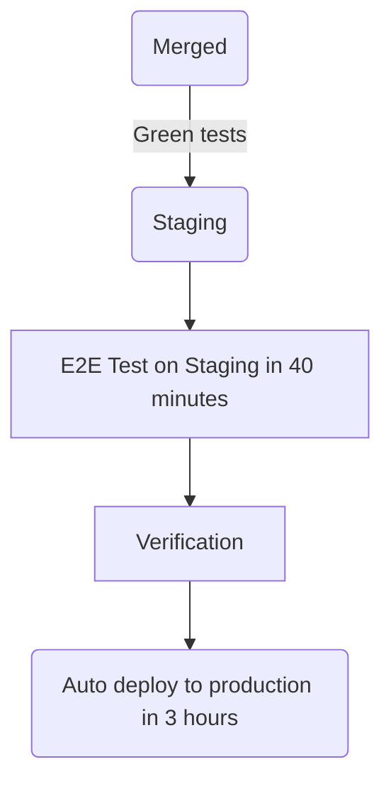

- [Direction](/handbook/product/groups/fulfillment/direction/fulfillment_section/)
- [Groups](/handbook/product/categories/#fulfillment-section)
- [Team](/handbook/engineering/development/fulfillment/#team-members)

## ビジョン

私たちが構築するプロダクトを通じて、お客様に世界クラスの購買体験を提供する [ハイパフォーマンスチーム](/handbook/leadership/#strategies-to-build-high-performing-teams) です。私たちのチームは、喜びを感じられる、パフォーマンスの高い、信頼できる、信頼性の高い体験を構築することを目指しています。

## ミッション

Fulfillment は以下の分野における能力とメトリクスの改善に注力しています:

- [Platform](/handbook/product/categories/#fulfillment-platform-group): [Team](/handbook/engineering/development/fulfillment/fulfillment-platform/#team-members)
- [Provision](/handbook/product/categories/#provision-group): [Team](/handbook/engineering/development/fulfillment/provision/#team-members)
- [Seat Management](/handbook/product/categories/#seat-management-group): [Team](/handbook/engineering/development/fulfillment/seat-management/#team-members)
- [Subscription Management](/handbook/product/categories/#subscription-management-group): [Features](/handbook/product/groups/fulfillment/direction/subscription_management/)
- [Utilization](/handbook/engineering/development/fulfillment/utilization/): [Team](/handbook/engineering/development/fulfillment/utilization/#team-members)

## 方向性

[Fulfillment プロダクト方向性](/handbook/product/groups/fulfillment/direction/fulfillment_section/) に加えて、Fulfillment Development サブ部門は以下を目指しています:

- Fulfillment インフラの信頼性と可用性を向上させる
- Fulfillment システムのアーキテクチャとデータモデルに対する基盤的な技術改善を行う
- より良いツールとドキュメントを通じて Fulfillment エンジニアの開発者体験を向上させる

## チームメンバー

Fulfillment セクションおよびサブグループのチームメンバー一覧は https://handbook.gitlab.com/handbook/product/categories/#fulfillment-section を参照してください。

## 安定したカウンターパート

### Sales & Go-To-Market



### Finance & IT



### Support Engineering



### Office of the CEO



### Product Technical Program Management



## プロジェクト管理プロセス

- [GitLab バリュー](/handbook/values/) に従います
- 透明性をもって: ほぼすべてが公開されており、可能な限り会議を録画・ライブ配信します
- 自分たちが取り組みたいことに取り組む機会があります
- 誰もが貢献できます。サイロはありません

### SAFE

GitLab において [SAFE な方法](/handbook/legal/safe-framework/) で働くことは、全員の責任です。私たちは Sales と Billing の安定したカウンターパートと共に、機密情報や財務情報に触れる可能性があり、ビジネス全体に影響を及ぼし得るプロダクトの領域に貢献しています。そのため Fulfillment のチームメンバーは、私たちが生み出す SAFE エピック・Issue・動画・MR・その他の成果物を機密に保つよう徹底することが重要です。

場合によっては、SAFE 議論が行われる可能性のある公開 Issue の説明文に、次のような文言を含めることが賢明です。

> このページには、今後のプロダクト・機能・機能性に関連する情報が含まれている可能性があります。
> 提示されている情報は情報提供のみを目的としていることに注意することが重要であり、
> 購入や計画の目的で情報に依拠しないでください。すべてのプロジェクトと同様に、
> ページに記載された項目は変更や遅延の対象となる場合があり、プロダクト・機能・
> 機能性の開発、リリース、タイミングは GitLab Inc. の単独の裁量にあります。

同様に、すべての情報を公開のハンドブックに含めるべきではありません。代わりに、SAFE 情報については [プライベートな内部ハンドブック](https://internal.gitlab.com/) を使用してください。

詳しくは、[将来のバージョンで実現予定の機能](https://docs.gitlab.com/ee/development/documentation/styleguide/availability_details.html#promising-features-in-future-versions) に関するドキュメントを参照してください。

### 計画

私たちは [プロダクト開発タイムライン](/handbook/engineering/workflow/#product-development-timeline) に沿って、月次サイクルで計画を立てます。
今後のリリースのスコープは `1 日` までに確定する必要があります。

`26 日` 前後: プロダクトはエンジニアリングマネージャーと予備的な Issue レビューを行います。Issue にはマイルストーンが付与され、最初の見積もりが行われます。

**計画 Issue**

- [Subscription Management](https://gitlab.com/gitlab-org/fulfillment/meta/-/issues/?label_name%5B%5D=Planning%20Issue&label_name%5B%5D=group%3A%3Asubscription%20management&sort=created_date&state=opened)
- [Fulfillment Platform](https://gitlab.com/gitlab-org/fulfillment/meta/-/issues/?label_name%5B%5D=Planning%20Issue&label_name%5B%5D=group%3A%3Afulfillment%20platform&sort=created_date&state=opened)
- [Provision](https://gitlab.com/gitlab-org/fulfillment/meta/-/issues/?label_name%5B%5D=Planning%20Issue&label_name%5B%5D=group%3A%3Aprovision&sort=milestone_due_desc&state=opened)
- [Utilization](https://gitlab.com/gitlab-org/fulfillment/meta/-/issues/?label_name%5B%5D=Category%3AUtilization&label_name%5B%5D=Planning%20Issue&scope=all&state=opened)

### インテイクリクエスト

Fulfillment ロードマップに作業を追加するようリクエストするには、[このリンク](https://gitlab.com/gitlab-org/fulfillment-meta/-/issues/new?issue&issuable_template=intake) から Issue を作成し、Fulfillment プロダクトマネージャーのいずれかにタグ付けしてください。

Fulfillment のプロダクトマネージャーがリクエストをレビューし、スコープと影響の評価を開始するためにアサインされます。チームのキャパシティに応じて、しばらく時間がかかる場合があります。評価が完了したら、PM は次のことを行います:

1. 新しいエピックを作成し、インテイク Issue から関連する詳細を取り込みます。
1. この新しいエピックを Fulfillment ロードマップに追加します。
1. 新しいエピックへのリンクをインテイク Issue の説明文に追加します。
1. インテイク Issue をクローズします。

リクエストに対して行動する前にその全詳細を捕捉するため、私たちはこのインテイクリクエストプロセスを厳守しています。プロダクトマネージャーがこのリクエストを受け取ったら、リクエスター（要求者）と協力して、問題と要件を完全に理解できるようにします。その後、リクエストの [優先順位付け](/handbook/engineering/development/fulfillment/#prioritization) を行います。

### 優先順位付け

私たちは [優先順位付けフレームワーク](/handbook/product/product-processes/#prioritization) に従い、[クロスファンクショナル優先順位付けガイドライン](/handbook/product/product-processes/cross-functional-prioritization/) を含めて、月次でバックログの優先順位を付けます。R&D チームは、SLA、OKR、[Fulfillment 向け L&R サポート優先 Issue リスト](/handbook/support/license-and-renewals/workflows/managing_product_issues/#supports-issue-list-for-fulfillment)、技術的負債など、さまざまなインプットとセンシングメカニズムを使用して優先順位を設定します。

私たちは、新規イニシアチブと技術的負債にわたって、短期・中期・長期の投資のバランスを取ることでビジネス価値を最大化することを目指しています。GitLab では、新規プロダクト開発に 60%、技術的負債およびメンテナンスに 40% という全社的な配分を目標としています。ただし、この 60／40 の比率は柔軟であり、グループやセクションによって時期に応じて変動する可能性があります。

Fulfillment セクションでは、OKR に焦点を当てた作業に対するバランスの取れたアプローチを確保するとともに、信頼性と効率性を向上させるためのエンジニアリングイニシアチブにも十分な優先度を与えるためのガイドラインとして 60／40 の比率を採用しています。私たちは計画と実行において柔軟性を保ち、これらのパーセンテージへの厳密な遵守を避けます。代わりに、OKR に反映されるとおり、企業のニーズに対する包括的な評価に基づいて作業の優先順位を付けます。OKR における適切なバランスは各グループに任せます。グループ内で合意に至らない場合は、セクションレベルにエスカレートして決定します。

グループレベルでの月次マイルストーン計画では、活動を OKR と整合するように最適化し、柔軟性を保ち、60／40 の分割からの逸脱を許容します。また、必要に応じて、[優先順位付けフレームワーク](/handbook/product/product-processes/#prioritization-framework) に従って、強制的な優先順位付けがあった場合には SLA 内で完了することも徹底します。

すべてのチームは毎月 [クロスファンクショナルダッシュボードレビュー](/handbook/engineering/development/#cross-functional-dashboard-reviews) のために [月次優先順位付けテンプレート](https://gitlab.com/gitlab-org/fulfillment-meta/-/blob/master/.gitlab/issue_templates/monthly-prioritization.md) を使用します。

### 見積もり

Issue の作業を開始する前に、まず予備調査の後に見積もりを行う必要があります。これは通常、月次計画ミーティングで行われます。

| ウェイト | 説明（エンジニアリング） |
| ------ | ------ |
| 1 | 最も単純な変更。副作用がないことに自信があります。 |
| 2 | 単純な変更（最小限のコード変更）で、すべての要件を理解しています。 |
| 3 | 単純な変更ですが、コードのフットプリントは大きいです（例: 多数の異なるファイルに影響する、テストへの影響など）。要件は明確です。 |
| 5 | コードベースの複数の領域に影響する、より複雑な変更で、リファクタリングを伴う可能性もあります。要件は理解されていますが、進める中で何らかのギャップが生じる可能性があると感じています。 |
| 8 | コードベースの大部分に関わる、または要件を判断するために他者からのインプットを多く必要とする複雑な変更。 |
| 13| 依存関係（他のチームやサードパーティ）がある可能性のある重要な変更で、要件をまだすべて理解していない可能性が高いです。マイルストーンでこれにコミットすることはまず無く、要件をさらに明確化したり、より小さな Issue に分解したりすることが望ましいです。 |

計画と見積もりにおいて、私たちは [予測可能性よりも速度](/handbook/engineering/development/principles/#velocity) を重視します。私たちの計画と見積もりの主な目標は、[MVC](/handbook/values/#minimal-valuable-change-mvc) に焦点を当て、盲点を発見し、過剰最適化することなくベースラインレベルの予測可能性を達成することです。一般的に GitLab の各部門は [70% の予測可能性] を目指しますが、Fulfillment サブ部門では、私たちの作業は通常クロスファンクショナルであり、他の部門と歩調を合わせる必要があるため、80% の予測可能性を目指します。

- 1 か 5 か不明な未知が多数ある Issue については、慎重を期して高めに（5 と）見積もります。
- 未知が多数ある場合、Issue を 2 つに分割できます。1 つ目は調査用の Issue で、[スパイク](https://en.wikipedia.org/wiki/Spike_(software_development)) とも呼ばれ、未知のリスクを下げ、潜在的な解決策を探索します。2 つ目の Issue は実装用です。
- 初期の見積もりが正しくなく、調整が必要な場合は、すぐに見積もりを修正してプロダクトマネージャーに通知します。プロダクトマネージャーとチームは、マイルストーンへのコミットメントを調整する必要があるかどうかを判断します。

**見積もりテンプレート**

以下は、エンジニアが Issue の見積もりに貢献する際に考慮すべきガイディングメンタルフレームワークです。

```markdown
### Refinement / Weighting

<!--
Ready for development means replying yes to the following questions:

- Is this issue sufficiently small enough? If not, break it into smaller issues
- Is it assigned to the correct domain (e.g. frontend, backend)? If not, break it into two issues for the respective domains
– Is the issue clear and easy to understand? If not, try asking further clarification questions and update the description once they are received

If more than 2 MRs are needed, consider adding a table like the following to the description (e.g. under `Implementation plan`).

| Description | MR |
|-|-|
|||

It will help track the status.
-->

- [ ] Ready for development
- [ ] Weight is assigned
- [ ] Number of MRs listed
- [ ] Needs testing considerations
- [ ] Needs documentation updates

**Reasoning:**

<!--
Add some initial thoughts on how you might break down this issue. A bulleted list is fine.

This will likely require the code changes similar to the following:

- replace the hex driver with a sonic screwdriver
- rewrite backups to magnetic tape
- send up semaphore flags to warn others

Links to previous examples. Discussions on prior art. Notice examples of the simplicity/complexity in the proposed designs.
-->
```

### 取り組む対象を選ぶ

エンジニアは [自分のチームの計画 Issue を開いてマイルストーンボードを確認](https://gitlab.com/gitlab-org/fulfillment-meta/-/issues/?sort=priority_desc&state=opened&label_name%5B%5D=Planning%20Issue&first_page_size=100) し、まず `deliverable` ラベルが付いたものから作業を始めることができます。

デリバラブルが完了したら、エンジニアはマイルストーンの残りの Issue から好きなものを選ぶことができます。エンジニアに特に希望がない場合は、上から次に利用可能な Issue を選ぶことができます。

### ワークフロー

私たちは一般的に [プロダクト開発フロー](/handbook/product-development/how-we-work/product-development-flow/#workflow-summary) に従い、そこで定義されているワークフローラベルを使用します。

一般的に、Issue は以下の 2 つの状態のいずれかにあります:

- ディスカバリー／リファインメント: 開発開始を妨げる質問にまだ答えている段階、
- 実装: Issue がエンジニアの作業を待っているか、能動的に構築されている。

Basecamp はこれらのステージを [丘の登りと下り](https://basecamp.com/hill-charts) との関連で考えています。

個々のグループは [プロダクト開発フロー](/handbook/product-development/how-we-work/product-development-flow/#workflow-summary) ワークフローのうち有用と思うステージを自由に使えますが、Issue がディスカバリー／リファインメントから実装にどう遷移するかについては、ある程度規範的であるべきです。

### ユーザー体験

私たちはすべてのワークフローで優れた使いやすさを提供するように努め、ユーザーとビジネスのニーズの間でバランスを作り出します。プロダクトデザイナーはプロダクトマネージャーやエンジニアと密接に協力します。

#### 私たちの働き方

- 私たちは、ハンドブックの [プロダクトデザインセクション](/handbook/product/ux/) で説明されている [プロダクトデザイナーのワークフロー](/handbook/product/ux/product-designer/) と [UX リサーチャーのワークフロー](/handbook/product/ux/experience-research/) に従います。
- 私たちは [UX スコアカード](/handbook/product/ux/ux-scorecards/) を使用して進捗を測定します。
- 四半期ごとに最も重要なプロジェクトを優先順位付けし、Fulfillment のプロダクトデザイナーは [グループではなくプロジェクトをサポート](#product-designer-focus-areas) します。
- 私たちは [[UX] Issue](#ux-issue-management-and-weights) をデザインの SSOT として使用します。実装 Issue は SSOT を維持するために、デザインの詳細について [UX] Issue にリンクすべきです。
- 私たちは Issue を追跡するためにラベルを使用します:
  - `UX`、`devops::fulfillment`、`section::fulfillment`、`group::`。
  - Issue が [プロダクト開発フロー](/handbook/product-development/how-we-work/product-development-flow/) のどこにあるかを示す `workflow::` ラベル
  - 調査の取り組みのための `UX Problem Validation` と `UX Solution Validation`
  - UX Issue ウェイトのための `design weight::`

#### プロダクトデザイナーの注力領域

Fulfillment チームはプロジェクト中心であり、多くのプロジェクトはグループをまたぐため、ユーザー体験のギャップやデザイナーの貸し借りリクエストの頻発につながります。これを避けるため、デザイナーをプロジェクト領域に割り当て、OKR 計画時に四半期ごとに見直します。

- Fulfillment UX チームの優先順位は [優先順位付け Issue](https://gitlab.com/gitlab-org/fulfillment/meta/-/issues/?label_name%5B%5D=Fulfillment%20UX%20Priorities) にドキュメント化されています。
  - 優先順位はチームによって四半期ごと、または新たに優先プロジェクトが特定された時にレビューされる必要があります。
  - 誰でもデザインフォーカスのために特定されたプロジェクトを Issue で提案できます。プロダクトマネージャーはプロダクトデザイナーおよびプロダクトデザインマネージャーと協力して優先順位をランク付けすべきです。複数の PM がプロジェクトに貢献している場合は、UX 計画用に 1 名を指定すべきです。
  - 優先順位の判断として、デザインサポートなしで進めるプロジェクトを決めなければならなかった場合は、その決定を Issue にリストしてください。
- デザイナーは割り当てられたプロジェクト以外の Issue も拾うことができます。これらは SUS に影響する Issue やバグなど、重要な UX Issue である必要があります。必要に応じてトレードオフを議論するために、Issue ウェイトを利用できます。
- 誰でも #s_fulfillment_ux Slack チャンネルを使ってアシスタンスを依頼できます。

ベストプラクティス

- 作業負荷を管理するため、デザイナーは一般的に同時に大規模 1 件と小／中規模 1 件、または小／中規模 3〜4 件（あるいは Issue ウェイトでの相当量）以上を担当しないようにします。
- デザイナーは最善の判断を行い、チームと協力してどのミーティングに出席するかを決めるべきです。デザイナーが同時に複数チームのチームシンクミーティングに出席することは期待されていません。
- プロダクトデザイナーは、サポートしているプロジェクトに対して [UX MR レビュー](/handbook/product/ux/product-designer/mr-reviews/) にアサインされるべきです。
  - 担当デザイナーがいないプロジェクトの一部である MR で UX レビューが必要な場合は、#s_fulfillment_ux Slack チャンネルにリクエストを投稿してください。Slack チャンネルでの UX MR レビューリクエストはバンド幅に応じて拾われます。

#### UX Issue 管理とウェイト

実装するために 1 件以上の開発 Issue が必要となる中規模／大規模プロジェクト（例: エンドツーエンドフロー、複雑なロジック、エンジニアリングが複数の実装 Issue に分解する複数のユースケース／状態）には、別個の [UX] Issue を使用します。UX Issue には [UX] のプレフィックスを付ける必要があります。

実装が単一の Issue で完了できるほど作業が小さい場合は、別の [UX] Issue は不要であり、デザイナーは自身を Issue にアサインし、ワークフローラベルを使ってデザインフェーズにあることを示すべきです。

- [UX] Issue は、デザイン目標、デザインドラフト、デザインに関する会話と批評、および実装される選定デザイン方向性の SSOT です。実装 Issue は SSOT として [UX] Issue 内のデザインにリンクすべきです。
- プロダクト要件の議論は、可能な限りメインの Issue やエピックで継続して行うべきです。
- プロダクトデザイナーがデザインが ~"workflow::planning breakdown" に進む準備ができたことを示したいときは、このラベルを Issue に適用し、PM と EM に通知し、Issue をクローズすべきです。
- Issue ウェイトはラベル定義に従い、~'design weight:" ラベルを使って適用すべきです。

### 作業の承認とマージ

CustomersDot で承認ルールを有効にしているため、`main` をターゲットとするすべての MR には、少なくとも 1 件の承認（作成者／コミッターとは異なる人物）が必要です。
MR は以下の基準を満たす必要があります:

- **少なくとも 2 名の異なるレビュアー** が必要で、そのうち 1 名はメンテナーである必要があります。ただし、**ロジック変更のない些細な MR の場合は、レビュアーは 1 名で十分** であり、そのような変更（例: マイナーな依存関係の更新、テストの修正、シンプルなリバート）については初回レビューをスキップできます。
- 少なくとも 1 件の承認を受ける必要があります。
- メンテナーのレビューが必須です。

承認ルールに加えて、MR は [Danger bot](https://docs.gitlab.com/ee/development/dangerbot.html) によって示唆される追加のレビューを必要とする場合があります:

1. DB への変更にはデータベースレビュアーとメンテナーの承認が必要
1. セキュリティ関連の Issue（例: 認証への変更）には [セキュリティレビュー](/handbook/security/product-security/security-platforms-architecture/application-security/appsec-reviews/#adding-features-to-the-queue--requesting-a-security-review) が必要
1. SFDC API への変更には [Sales チーム](/handbook/sales/field-operations/sales-systems/) のレビューが必要
1. Zuora API への変更には [EntApps チーム](/handbook/business-technology/enterprise-applications/) のレビューが必要
1. ユーザー体験への変更には [UX レビュー](/handbook/product/ux/product-designer/mr-reviews/) が必要

### 週次の非同期 Issue 更新

毎週、各エンジニアは、以下のテンプレートを使ってアサインされている Issue にコメントすることで、簡潔な非同期 Issue 更新を提供することが期待されています:

```markdown
<!---
Please be sure to update the workflow labels of your issue to one of the following (that best describes the status)"
- ~"workflow::In dev"
- ~"workflow::In review"
- ~"workflow::verification"
- ~"workflow::blocked"
-->
### Async issue update

1. Please provide a quick summary of the current status (one sentence)
    -
1. How confident are you that this will make it to the current milestone?
    - [ ] Not confident
    - [ ] Slightly confident
    - [ ] Very confident
1. Are there any opportunities to further break the issue or merge request into smaller pieces (if applicable)?
    - [ ] Yes
    - [ ] No
1. Were expectations met from a previous update? If not, please explain why.
    - [ ] Yes
    - [ ] No, ___
1. Are the related issues up to date? Please link any missing issues in the epic that could be linked to this issue
    - [ ] Yes
    - [ ] No

/health_status [on_track, needs_attention, at_risk]
```

私たちはチームのコラボレーションをよりに非同期的に促し、コミュニティや他のチームメンバーが、現在能動的に取り組んでいる Issue の進捗を知ることができるようにするためにこれを行います。

### 非同期プロジェクト更新

このテンプレートは、リーダーシップやクロスファンクショナルなパートナーと共有する、より大規模なプロジェクト進捗ステータス更新で使うためのものです。

リーダーシップは以下に関心があります

1. プロジェクトは進捗しているか? --> 週ごとの完了率の推移を確認
2. クリアすべきブロッカーはあるか? --> Risks & Blockers を確認
3. 次のイベントはいつ期待できるか? --> Key dates を確認

このテンプレートはガイドラインであり、特定のプロジェクトのニーズに合わせて自由に変更してください。テンプレートから逸脱する前に、リーダーシップは複数のプロジェクトにわたるステータス更新を見ていることを念頭に置いてください。プロジェクト間の整合性が高ければ高いほど、リーダーシップがステータスを正確に理解しやすくなります。

```markdown
## Status update as of XXXX-XX-XX

### Summary

1. **Key Resources**
  * **_TBD_ this section is optional**

2. **% Complete**: `X%`

3. **Status**: `On Track or Behind` (this is determined based on your how your % complete is trending to your key dates -- are you far enough along to hit your key dates?)

4. **Key Dates**:

 * Design complete - Milestone XX.X
 * Development complete - Milestone XX.X
 * Rolled out in production - XXXX-XX-XX

### Risks & Blockers

| Risks & Blockers | Mitigation Approach |
|------------------|---------------------|
| **_New!_** |  |

### Results/Challenges/Learnings

_List any type of deliverable, e.g. merged MRs, alignment on solution, copy/designs were completed._


1.

**FYI** TAG FOLKS

```

### デモ

完了するのに数マイルストーンかかる作業もあります。定期的な非同期 Issue 更新と合わせて、デモを設定することは有用です。利点は以下のとおりです:

- フィードバックサイクルを短縮する
- 作業の可視性を高める
- 作業と進捗のコミュニケーションを改善する

なお、MR でのレビュープロセスを楽にするために、デモや録画の提供はすでに推奨されています。

この目的のために、YouTube プレイリストが作成されています: [Fulfillment Demos](https://www.youtube.com/playlist?list=PL05JrBw4t0KpOKxufy-slaR-6swIfkDLP)（一部のコンテンツは内部限定）。デモをアップロードするには、[ここで説明されているプロセス](/handbook/engineering/workflow/demos/) に従えます。動画が作成されたら、[Fulfillment Demos](https://www.youtube.com/playlist?list=PL05JrBw4t0KpOKxufy-slaR-6swIfkDLP) プレイリストにリンクします。説明文に以下の情報を追加することを検討してください:

- エピック／Issue へのリンク
- MR へのリンク（あれば）
- アップロードした人のプロフィールへの名前とリンク（任意）

[例](https://www.youtube.com/playlist?list=PL05JrBw4t0KpOKxufy-slaR-6swIfkDLP) はこちら（内部限定）

### 品質

GitLab の品質は全員の責任です。

#### エンドツーエンドテスト - どのように、いつ、なぜ書くか

エンドツーエンドテスト（しばしば e2e テストと呼ばれます）は、エンドユーザーが通る完全または部分的なフローをカバーします。テストレベルに関する詳細情報は [こちら](https://docs.gitlab.com/ee/development/testing_guide/testing_levels.html) を参照してください。

これらのフローの例:

- GitLab.com 上のネームスペースの SaaS サブスクリプションの購入。
- セルフマネージド GitLab インスタンス向けの新規サブスクリプションの購入。

これらのテストは高速ではなく、フレーキーになりやすいため、エンドツーエンドテストでカバーすべき内容と、より低レベルのテストに委ねるべき内容の優先順位付けを考慮する必要があります。

Fulfillment のテストは、[GitLab プロジェクト](https://gitlab.com/gitlab-org/gitlab/-/tree/master/qa/qa/specs/features/ee/browser_ui/11_fulfillment) と [CustomersDot プロジェクト](https://gitlab.com/gitlab-org/customers-gitlab-com/-/tree/main/qa) の両方に存在します。テスト作成時にどちらのプロジェクトを使うかを判断するには、以下のガイドを参照してください:

- テストが CustomersDot ポータルでアクションを開いて実行することを必要とする場合は CustomersDot を選んでください。それ以外の場合は GitLab が正しいプロジェクトです。
- 将来的には CustomersDot は単なるバックエンドサービスとなり、UI のエンドツーエンドテストは GitLab にのみ存在することが計画されています。

#### GitLab

GitLab エンドツーエンドテストガイドは [こちら](https://gitlab.com/gitlab-org/gitlab/-/blob/master/doc/development/testing_guide/end_to_end/beginners_guide.md) で見つけられます。

GitLab プロジェクトでの計画済み・自動化された Fulfillment テストケースは [こちら](https://gitlab.com/gitlab-org/gitlab/-/quality/test_cases?state=opened&sort=created_desc&page=1&label_name%5B%5D=devops%3A%3Afulfillment) で見つけられます。

#### CustomersDot

CustomersDot エンドツーエンド初心者向けガイドは [こちら](https://gitlab.com/gitlab-org/customers-gitlab-com/-/blob/main/qa/doc/beginners_guide.md) で見つけられます。

CustomersDot プロジェクトでの計画済み／自動化されたテストケースは [こちら](https://gitlab.com/gitlab-org/customers-gitlab-com/-/quality/test_cases) で見つけられます。

### テスト

CustomersDot では異なる種類のテストが実行されています:

1. Lint と [rubocop](https://github.com/rubocop/rubocop) ジョブ
1. ユニットテスト（spec、コントローラー spec など多くの種類があります）
1. 統合テスト（外部呼び出しをモックする spec）
1. フロントエンドテスト
1. [Watir 経由](https://github.com/watir/watir) の E2E 統合テスト

また、`VCR` フラグを持っており、これはデフォルトで Zuora への外部呼び出しをモックします。フラグを設定した状態で 9AM UTC に実行される [日次パイプライン](https://gitlab.com/gitlab-org/customers-gitlab-com/pipeline_schedules) があり、API 呼び出しが Zuora サンドボックスに届き、（潜在的な API 変更による）失敗があれば通知されます。

テストの失敗は、パイプラインへのリンクとともに #s_fulfillment_status に通知されます。パイプラインの失敗はステージングおよび本番への展開を妨げます。

### セキュリティ

#### アクセスレビュー

Fulfillment Engineering のエンジニアリングマネージャーとシニアリーダーシップは、四半期ごとに Fulfillment システム（例: CustomersDot）のアクセスレビューに責任を負います。私たちは [アクセスレビュー](/handbook/security/security-assurance/security-compliance/access-reviews/) を実施するために以下のガイダンスを使用します。`システムへのアクセスは、職務役割と部門に基づいてレビューされます`。そのため、レビュアーは現在のチームメンバーのアクセスリストを評価する際に、現在の役割と部門との関連を踏まえつつ最善の判断を行います。

以下のリストには、アクセスを保持すべき標準的な部門とチームの一部が含まれています:

**読み取り専用アクセス**

- Sales チーム

**書き込みアクセス**

- AppSec チーム
- Billing チーム
- Fulfillment サブ部門（エンジニアリング、プロダクト、品質、その他のカウンターパート）
- IT ヘルプデスク
- サポートチーム

迷った場合は、別の [アクセスリクエスト](/handbook/security/corporate/end-user-services/access-requests/access-requests/) を通じて簡単に復元できるため、アクセスを拒否する側に倒してください。

### デプロイメント

#### 収益に影響する変更

Fulfillment は、私たちの変更が収益に直接影響する可能性があるという点でエンジニアリングの中で独特です。収益に影響する、または別の意味でリスクの高い変更には、Fulfillment 外のチームからのインプットを含む、より広範な精査が必要となる場合があります。これらの決定では PM が DRI となり、Sales、エンタープライズアプリケーション、マーケティング、ファイナンス、カスタマーサポートなどのステークホルダーからのインプットを取り入れます。

私たちは、変更が潜在的に高リスクを伴う場合でも、可能な限り反復的（イテレーティブ）であることを目指しています。

以下は、多くのチーム間の調整を必要とする可能性があるため高リスクとなり得る変更の例です:

- 価格変更
- Billing の変更
- 新しい有料機能のローンチ
- 既存の有料機能の非推奨化
- 利用規約と関連契約の変更
- リソース消費の計算または表示方法の変更（例: ユーザー数、コンピュート分数）

以下はしばしば低リスクとなり得る変更です:

- まだフロントエンドで使用されていないバックエンド拡張
- フィーチャーフラグ配下にあるフロントエンドおよびバックエンドの拡張
- フィーチャーフラグ配下にはないが「ベータ」または「実験的」とラベル付けされているフロントエンド拡張

高リスクの変更については、以下のプロセスに従う必要があります:

- 新規／更新された動作の機能ドキュメントを更新し、関連するステークホルダーと共有する
- これらの変更には機密 Issue を使用する
- リリース日に有効化できるようフィーチャーフラグの下で変更をリリースする
- リリース日のためのロールアウト Issue を作成し、すべての関係者がプロセスについて知らされるようにする。[例](https://gitlab.com/gitlab-org/gitlab/-/issues/299068)
- 変更を反復的にテストできるよう、サブセットの顧客に有効化することを検討する
- 機密 MR が改善されるまで（[1](https://gitlab.com/groups/gitlab-org/-/epics/1175)、[2](https://gitlab.com/groups/gitlab-org/-/epics/264)）、Issue が機密であっても通常の MR プロセスを使用する

#### CustomersDot

私たちは [CustomersDot](https://gitlab.com/gitlab-org/customers-gitlab-com/) に CD（継続的デプロイメント）を使用しており、MR は `staging` ブランチへマージされた時点から以下の段階を経ます:



`Verification` 段階で何かがうまくいかない場合、`production::blocker` ラベルを付けた Issue を作成すれば、本番への展開を防止できます。この Issue は機密にはできません。

production blocker が設定されており、それを取り除くために修正の MR が必要な場合、その MR の本番デプロイは迅速化できます。
本番デプロイのジョブは、3 時間の遅延をスキップするためにスケジュールを解除し、`production::blocker` ラベルを取り除く、もしくは Issue をクローズした直後に手動でトリガーしてデプロイする必要があります。

重要な変更を含む MR については、[フィーチャーフラグ](https://gitlab.com/gitlab-org/customers-gitlab-com/#feature-flags-unleash) の使用を検討するか、デプロイメントを一時停止してより長いテストを可能にするために `production::blocker` ラベル付きの Issue を作成することを検討してください。

#### フィーチャーフリーズ

Fulfillment のフィーチャーフリーズは、通常マイルストーンが終了する金曜日頃、会社の他の部分と同じタイミングで行われます。

| アプリ | フィーチャーフリーズ (*) | マイルストーン終了 |
| ---      |  ------  |----------|
| GitLab.com   | マイルストーンが終わる金曜日からリリース日まで | フリーズと同じ |
| Customers／Provision   | マイルストーンが終わる金曜日からリリース日まで | フリーズと同じ |

(*) フィーチャーフリーズは [auto-deploy ドキュメント](https://gitlab.com/gitlab-org/release/docs/-/blob/master/general/deploy/auto-deploy.md) によって異なる場合があります。

フィーチャーフリーズ後に現在のマイルストーンでマージされていない Issue は、次のマイルストーンに移動する必要があります（それらに対して優先度も変わる可能性があります）。

#### Production Change Lock（PCL）

GitLab では、主要なグローバルホリデーや、その他 GitLab チームメンバーの可用性が大幅に低下する時期など、特定のイベント中に本番変更を一時的に停止することがあります。PCL の詳細は [このインフラストラクチャハンドブックページ](/handbook/engineering/infrastructure-platforms/change-management/#production-change-lock-pcl) で見つけられます。

これらの PCL の期間中、最も顕著なのは年末ですが、PCL は CustomersDot で [PCL テンプレート](https://gitlab.com/gitlab-org/customers-gitlab-com/-/tree/main/.gitlab/issue_templates/Pcl.md) を使った Issue を作成することで管理されます。この Issue には、`production::blocker` ラベルを追加または削除するための DRI とターゲット時刻に加えて、指示のチェックリストを含める必要があります。PCL が終了したら、Issue はクローズできます。

##### Zuora ブロック期間

Zuora は [リリースカレンダー](/handbook/business-technology/enterprise-applications/pmo/#release-calendar) に従っており、変更リクエストが不可能、もしくは追加の承認を必要とするブロック期間があります。

### インシデント管理

進行中の [Fulfillment Platform](/handbook/engineering/development/fulfillment/fulfillment-platform/) の作業によって、すべての Fulfillment システムに対する観測可能性が高まります。一方、現時点では、[CustomersDot health](https://customersdot.cloudwatch.net/) のようなツールがあり、Slack の [#s_fulfillment_status](https://gitlab.slack.com/archives/CL7SX4N86) に投稿します。場合によっては、Liveness probe チェックの失敗、無効な SSL 証明書、その他のアプリケーションエラーといった、システム的なクリティカルなトラブルの報告があります。エラー解決に貢献する方法については、以下のサブセクションを参照してください。

[GitLab モニタリング](/handbook/engineering/monitoring/) と [インシデント管理](/handbook/engineering/infrastructure-platforms/incident-management/) の詳細については、このハンドブックのページを参照してください。

#### インシデントや障害のエスカレーションプロセス

**Tier 2 SME オンコールエスカレーション**

Fulfillment はインシデント対応のために [Tier 2 SME オンコールローテーション](https://gitlab.com/gitlab-com/gl-infra/production-engineering/-/issues/27741) を導入しました。このプロセスは、Fulfillment チーム内のサブジェクトマターエキスパートに対する構造化されたエスカレーションを提供します。

**Tier 2 がページを受け取るとき:**

- インシデントや障害の間、Engineer on Call（EOC）は incident.io を介して Fulfillment Tier 2 SME オンコールローテーションにエスカレーションできます
- Tier 2 SME ローテーションは [定義されたエスカレーション経路](/handbook/engineering/infrastructure-platforms/incident-management/on-call/tier-2/) に従います:
  - **Level 1**: スケジュールローテーション（EMEA、AMER、または APAC）に基づく現行の SME オンコール
  - **Level 2**: Level 1 が 15 分以内に確認されない場合、エスカレーションは全チームメンバーへのラウンドロビン経由で進みます
  - **Level 3**: [James Lopez](https://gitlab.com/jameslopez) へのさらなるエスカレーション

**障害時の追加自動通知:**

- 障害が発生すると、Slack の `#s_fulfillment_status` が通知され、[James Lopez](https://gitlab.com/jameslopez) と [Vitaly Slobodin](https://gitlab.com/vitallium) が自動電話ページを受け取ります

**一般的なインシデントの報告:**

1. 障害が発生すると、[SRE オンコール](/handbook/engineering/on-call/) が自動的に通知されます。インシデントは [手動でも報告](/handbook/engineering/infrastructure-platforms/incident-management/#reporting-an-incident) できます。
1. 必要な場合、SRE オンコールやインシデント報告者は、Slack で `@fulfillment-engineering` をピングしてチームに通知し助けを得ることができます

#### 緊急 Issue のエスカレーションプロセス

ほとんどの場合、MR は上記で概説した通常のレビュー、メンテナーレビュー、マージ、デプロイのプロセスに従う必要があります。本番が壊れている場合:

1. まず、[Rapid Engineering Response](/handbook/engineering/workflow/#rapid-engineering-response) プロセスに従うべきかどうかを判断します。これは可用性と状況の重要度によって異なります。
1. ステージングと本番自動デプロイの間の 3 時間の待機は、メンテナーによる手動デプロイで回避できます。
1. プロジェクトメンテナー（[CustomersDot](/handbook/engineering/projects/#customers-app)）が誰も対応できない場合、メンテナーアクセスを持つ追加の GitLab チームメンバーに支援を依頼できます。

これらのケースでは、以下を確認してください:

1. [Rapid Engineering Response](/handbook/engineering/workflow/#rapid-engineering-response) のとおり、エスカレーションの理由を記述した Issue があること。関連する [Growth／Fulfillment チーム](https://gitlab.com/gitlab-org/growth) を「@」メンションすることを検討してください。
1. 変更が [#s_fulfillment](https://gitlab.slack.com/archives/CMJ8JR0RH) チャンネルでアナウンスされていること。

#### 調査

- 私たちのヘルスチェックインスタンス [こちら](https://customersdot.cloudwatch.net/) にアクセスできます。ログイン認証情報は [1Password の _Subscription portal_ ボールト](https://gitlab.1password.com/vaults/27nafqigafgxfjpjkl2wvzs26y/allitems/jdeumqscahayoxvcfazbzdv22u) で見つけられます。CustomersDot の本番とステージングの両方のサービスが見えます。
- CustomersDot の例外は [Sentry](https://sentry.gitlab.net/gitlab/customersgitlabcom/) でキャプチャされます。
- ログは [Kibana / Elasticsearch](https://log.gprd.gitlab.net/) でクエリできます。[GitLab での kibana の使用](/handbook/support/workflows/kibana/) について読むには、このリンクを使用してください
- Grafana には GitLab 全般に適用可能な [トリアージダッシュボード](https://dashboards.gitlab.net/d/RZmbBr7mk/gitlab-triage?orgId=1&refresh=5m) がありますが、InfraDev の作業が完了するまで、Fulfillment システム向けの特定の観測可能性メトリクスは含まれていません。
- 本番可用性アラートを報告する Blackbox プローブは、[Slack の #production](https://app.slack.com/client/T02592416/C101F3796/) に報告されます

#### インシデントの宣言

ブロッキングしている問題に直ちに注意が必要な場合、[インシデントの提起](/handbook/engineering/infrastructure-platforms/incident-management/#report-an-incident-via-slack) は常に選択肢となります。

ブロッキングしている問題の例:

- ステージングまたはテスト環境でのサービス中断を引き起こす期限切れ証明書

本番障害のような重大な問題は、迅速に提起する必要があります。インシデントを提起する前に [#incident_management](https://gitlab.slack.com/archives/CB7P5CJS1) を確認できます。

- CustomersDot の障害
- CustomersDot のデプロイ失敗

#### Grafana ダッシュボード

これらのダッシュボードは、機能カテゴリで作業しているすべての人に、私たちのコードが GitLab.com スケールでどのように動作するかについての洞察を与えるよう設計されています。

- [Provision](https://dashboards.gitlab.net/d/stage-groups-provision/stage-groups-group-dashboard-fulfillment-provision)
- [Utilization](https://dashboards.gitlab.net/d/stage-groups-subscription/stage-groups-group-dashboard-fulfillment-utilization)

### カスタマーエスカレーション

プロダクトマネジメントやエンジニアリングへのエスカレーションが必要なライセンス Issue（サポートまたは販売から）がある場合は、`Assistance with License Issue` の下にある [サポートハンドブックページ](/handbook/support/internal-support/#regarding-licensing-and-subscriptions) でドキュメント化されているプロセスを通じて Issue を作成してください。Slack やその他の方法でエスカレーションする代わりに、これを行ってください。

プロダクトマネジメントとエンジニアリングの Fulfillment リーダーは `License Issue High ARR` ラベルを購読し、それらが作成されたときに認識できるようにします。これは [ラベル検索](https://gitlab.com/gitlab-com/support/internal-requests/-/labels?subscribed=&search=license%20issue%20high%20arr) を介して、`License Issue High ARR` ラベルの「subscribe」をクリックすることで行えます。

### レトロスペクティブ

#### 月次レトロスペクティブ

`8 日` 以降、Fulfillment チームは [非同期レトロスペクティブ](/handbook/engineering/careers/management/group-retrospectives/) を実施します。Fulfillment の現在および過去のレトロスペクティブは [https://gitlab.com/gl-retrospectives/fulfillment/issues/](https://gitlab.com/gl-retrospectives/fulfillment/issues/) で見つけられます。

##### レトロスペクティブへの貢献

非同期レトロスペクティブ Issue への参加は全員に推奨されます。これはチームメンバーのフィードバックのための安全な空間です。ただし、コメントや懸念を、同期レトロスペクティブの議論に持ち込んだり、マネージャーやその他の部門リーダーシップと共有したりすることも歓迎します。私たちは効率的で安全なレトロスペクティブを生み出すために [このガイダンス](engineering/management/group-retrospectives/) に従います。

留意すべき点:

- 共有される項目は、記念碑的な成功や失敗である必要はありません。レトロスペクティブ Issue の「うまくいったこと」「うまくいかなかったこと」のセクションには、小さな項目でも含めることを検討してください。
- 部門全体には関連性が低いと感じる項目を共有するために、チーム固有のスレッドを使用してください。
- インスピレーションを得るために、チームシンクのアジェンダ項目「wins」または「challenges」から引き出してください。
- お使いのコンピュータの限界を見極め、現在のレトロスペクティブ Issue をマイルストーン中ずっと開いたままにしてください。

##### 非同期レトロスペクティブの同期ディスカッション

非同期レトロスペクティブのコメント期間が終了してから約 1 週間後（翌月の 26 日）、私たちは次のステップ、アクションアイテム、プロセスへの改善について議論するための同期ミーティングを開催します。このミーティングは EM や IC のいずれが進行することもできます。私たちは APAC、AMER、EMEA に好都合な時間帯のローテーションでミーティングをスケジュールすることで、タイムゾーンに包括的であろうとしています。このミーティングは録画され、Fulfillment 全員の利益のために共有されます。

#### イテレーションレトロスペクティブ

GitLab には、私たちのイテレーション能力を向上させるためのリソースがいくつかあります:

- [エンジニアリングイテレーションドキュメント](/handbook/engineering/workflow/iteration/)
- [プロダクトイテレーションドキュメント](/handbook/product/product-principles/#iteration)
- [自己進行型イテレーショントレーニング Issue](https://gitlab.com/gitlab-com/Product/-/issues/new?issuable_template=iteration-training)
- [イテレーションオフィスアワー](/handbook/ceo/#iteration-office-hours)
- [マイルストーンレトロスペクティブ](/handbook/engineering/development/fulfillment/#retrospectives)
- [イテレーションレトロスペクティブ](#iteration-retrospectives)

アジャイルソフトウェア開発の慣行では、`イテレーションレトロスペクティブ` というフレーズを、私たちが [マイルストーンレトロスペクティブ](/handbook/engineering/development/fulfillment/#retrospectives) で実施することの説明として使用しています。マイルストーンレトロスペクティブは私たちがどう改善できるかを理解するうえで欠かせませんが、複数のチームにわたる広い焦点を持っています。これは、誰もが、続けられること、修正できること、改善できることについて振り返ることで貢献できる、安全な空間です。

ここで使用している意味での GitLab バリューにおけるイテレーションレトロスペクティブは、特定の **成功または不成功** のイテレーション試行の例（あるいは少数の例）に焦点を当てたものです。つまり、将来より反復的かつ効率的になるために何を変えられるかを深く理解できる Issue、エピック、またはマージリクエストです。これらのレトロスペクティブは、反復的なマインドセット — まず作る、その後より良く作る — を発達させるための成長機会を提供します。

各グループは独自のイテレーションレトロスペクティブを実施すべきですが、仲間や他のチームがあなたの調査から学ぶのを助けるため、可能な限り透明性を持って共有してください。

**頻度**

イテレーションレトロスペクティブは四半期ごとに実施すべきです。

**準備**

エンジニアリングマネージャーまたは他のチームメンバーは、現在または過去のマイルストーンを見直し、イテレーションレトロスペクティブにふさわしい、良い、挑戦的な候補 Issue を見つけるべきです。提案から 1 つ（あるいは関連していれば 2 つ）を選び、レトロスペクティブ Issue を作成してください。

効果的なレトロスペクティブのために [これらのルール](/handbook/engineering/careers/management/group-retrospectives/) を確認してください。

**参加**

誰もが議論に非同期に貢献でき、また貢献すべきです。レビュー対象に選ばれた Issue で述べられている問題を分解する代替手法やメカニズムについてアイデアを提示してください。問題の分解が問題なかった場合、プロセスやその他の改善案も歓迎します。

要点を引き延ばさないようにし、参加は 1 週間にタイムボックスする必要があります。1 週間の期日を設定するクイックアクションが、以下のテンプレートで利用できます。

このレトロスペクティブの後、ハンドブックの更新、プロセス変更、結論からの情報の引き上げを検討してください。

**テンプレート（任意）**

```markdown
Iteration is one of six GitLab Values, but also really difficult. By focusing how we have iterated well in the past and how we have not will help us iterate faster. Please contribute the following [Iteration Retrospective](#link-to-handbook-page).

## Summary

<!--
Include a brief summary of the issue. Consider including key outcomes, significant changes, and impact.
-->

`Summary of the Issue`

## Details

<!--
Complete the following details when creating the issue.
-->

- Did the team meet the iteration goals? Why or why not?
- How many MRs were created to complete the Iteration?
- What were the Days to Merge for the MRs related to the this issue?
- Are there successes or opportunities for improvement with respect to collaboration with peers or stable counterparts?
- Could the original issue have been broken down into smaller components?
- Could the MR(s) have been broken down into smaller components?

## Tasks

**Read**

- [Iteration Value](/handbook/values/#iteration)
- [Engineering Iteration](/handbook/engineering/workflow/iteration/)
- [Why iteration helps increase the merge request rate](https://about.gitlab.com/blog/2020/05/06/observations-on-how-to-iterate-faster/)

**Watch**

- [Interview about iteration in engineering with Christopher and Sid](https://www.youtube.com/watch?v=tPTweQlBS54)
- [Iteration Office Hours with CEO](https://www.youtube.com/watch?v=liI2RKqh-KA)


**Contribute**

In the threads below consider the following:

- Why was it (un)successful? If successful, how did it meet the definition of an [MVC](/handbook/product/product-principles/#the-minimal-valuable-change-mvc)?
- How did the example not meet the definition of an [MVC](/handbook/product/product-principles/#the-minimal-valuable-change-mvc)? In what ways could you have iterated differently? List specific examples.
- Identify areas of improvement for the team that can be incorporated into our processes and workflows.

Follow [these rules](/handbook/engineering/careers/management/group-retrospectives/) for an effective retrospective.

Check your name off the completed list when all tasks are complete.

**Completed**

<!--
When creating this issue replace the person placeholders with teamembers and select stable counterparts as you see fit.
-->

- [ ] Person
- [ ] Person
- [ ] Person
- [ ] Person

**Next Steps**

- [ ] Engineering Manager to update your team's handbook page with ideas and improvements you've incorporated to improve iteration.

## Thread Prompts

<!--
Use these prompts or similar to start conversation threads.
-->

1. What aspects of the Issue/Epic and resulting MR(s) were very good/bad examples of Iteration and why?
1. Does anyone have alternative ideas for how this work could have been broken down?
1. Is there anything that we can change in our processes or the way we work that could improve our iteration as a team?


/due in 1 week
/label ~"Iteration Retrospective"
```

### プロジェクトケイデンス

この表には、私たちのプロジェクト管理プロセスの一部として繰り返される活動を一覧表示しています。明確に定義されたケイデンスを持つことで、チームはどの活動がいつ行われているかを簡単に理解できます。記載された活動は、私たちの [会社のケイデンス](/handbook/company/cadence/) に密接に従っています。この markdown 表の編集には [このスプレッドシート](https://docs.google.com/spreadsheets/d/16mPUmFe7g8VWC-b137mWiCcy6s3e_JbD6i4nE1igSOM/edit#gid=0) を使用してください。

| 活動                                                                                                                                                         | ケイデンス      | タイプ  | 関与チーム                                                  |
|------------------------------------------------------------------------------------------------------------------------------------------------------------|--------------|-------|-----------------------------------------------------------------|
| [GitLab.com デプロイ](/handbook/engineering/releases/#gitlabcom-deployments)                                                          | 継続的 | 非同期 | Delivery Engineering                                            |
| [CustomersDot デプロイ](https://gitlab.com/gitlab-org/customers-gitlab-com#deployments)                                                                       | 継続的 | 非同期 | Fulfillment Engineering                                         |
| [Issue 更新](/handbook/engineering/development/fulfillment/#weekly-async-issue-updates)                                               | 週次       | 非同期 | Fulfillment セクション                                             |
| [Fulfillment 週次更新](https://gitlab.com/gitlab-org/fulfillment-meta/-/issues?sort=created_date&state=all&label_name[]=weekly+update)                     | 週次       | 非同期 | Fulfillment PM、EM、QEM、UXM                                |
| [Fulfillment グループ同期](https://calendar.google.com/calendar/u/0/embed?src=gitlab.com_7199q584haas4tgeuk9qnd48nc@group.calendar.google.com&ctz=America/Bogota) | 週次       | 同期  | Fulfillment Utilization、Provision、InfraDev グループ |
| [Fulfillment PM 同期](https://docs.google.com/document/d/1t1KHlpjIEEzG02Gqth6uttQ0Vc3-pFo7yScTgvHWgeQ/edit)                                                     | 週次       | 同期  | Fulfillment PM                                                 |
| [Fulfillment、Growth、AI Assisted EM 同期](https://docs.google.com/document/d/1amVctQAmAVIXijxfyLxJNsdR2OqP6IXAK1sqD2pQMi4/edit)                                 | 週次       | 同期  | Fulfillment、Growth、AI Assisted の EM                             |
| [Fulfillment PM／EM／QEM／UXM 同期](https://docs.google.com/document/d/1UBfHiGK6BgJY76sFJ1qqlsRbtYhbBZETpaA4ftX_BBc/edit)                                    | 週次       | 同期  | Fulfillment PM、EM、QEM、UXM                                |
| OKR チェックイン                                                                                            | 週次       | 非同期 | Fulfillment PM、EM、QEM、UXM                                |
| [月次セルフマネージドリリース](/handbook/engineering/releases/#self-managed-releases)                                                   | 月次      | 非同期 | Delivery Engineering                                            |
| [月次リリース投稿](/handbook/marketing/blog/release-posts/)                                                                         | 月次      | 非同期 | プロダクトおよびマーケティング機能                                 |
| [マイルストーン計画](/handbook/engineering/development/fulfillment/#planning)                                                            | 月次      | 非同期 | Fulfillment Utilization、 Provision、InfraDev グループ |
| ロードマップ計画                                                                                      | 月次      | 同期  | Fulfillment PM、EM、QEM、UXM                                |
| [レトロスペクティブ Issue](https://gitlab.com/gl-retrospectives/fulfillment/-/issues/)                                                                                | 月次      | 非同期 | Fulfillment セクション                                             |
| [レトロスペクティブディスカッション](https://docs.google.com/document/d/1eL1QLtIGGxqYfaVQXIWhxAUvqTMw1OQLVQ68ZYib40g/edit)                                                 | 月次      | 同期  | Fulfillment セクション                                             |
| [方向性レビュー](/handbook/product/groups/fulfillment/direction/fulfillment_section/)                                                                                              | 四半期    | 非同期 | Fulfillment PM、Product Leadership                             |
| OKR 計画                                                                                             | 四半期    | 非同期 | Fulfillment PM、EM、QEM、UXM、Staff Engineer               |
| [取締役会](/handbook/board-meetings/#board-meeting-schedule)                                                                       | 四半期    | 非同期 | Fulfillment PM、E-Group、取締役会                                 |

## ワーキンググループとクロスファンクショナルなイニシアチブ

この表には、[ワーキンググループとクロスファンクショナルイニシアチブ](/handbook/company/working-groups/) の一部として繰り返される活動を一覧表示しています。この markdown 表の編集には [このスプレッドシート](https://docs.google.com/spreadsheets/d/16mPUmFe7g8VWC-b137mWiCcy6s3e_JbD6i4nE1igSOM/edit#gid=463091797) を使用してください。

| 活動                                                                                                                           | ケイデンス       | タイプ | 関与チーム                                                              |
|------------------------------------------------------------------------------------------------------------------------------------|---------------|------|-----------------------------------------------------------------------------|
| [Purchasing Reliability Working Group](https://docs.google.com/document/d/1m6sozlyvEIEKcEIPF2_nujrYTOV3IPpx_jaPXD1hPpU/edit)       | 週次        | 同期 | Fulfillment Engineering、Infrastructure、IT、CEO、Office of the CEO                      |
| [GTM Product Usage Data Working Group](https://docs.google.com/document/d/1riUXq1GdavnSWJklrebBeZnzcAl6XATyLod9tR6-AlQ/edit)       | 週次        | 同期 | Fulfillment PM、Analytics Instrumentation、Data、Customer Success、Sales        |
| [GitLab Order to Cash Technical Fusion Team](https://docs.google.com/document/d/17tJraRunjge5nI-qBEjWlhcKWYLXwGW4uhhu-Sf5464/edit) | 週次        | 同期 | Fulfillment PM、Fulfillment Engineering、EntApps、Sales Systems            |
| [Data & Analytics Program for R&D Teams](https://docs.google.com/document/d/1CRIGdNATvRAuBsYnhpEfOJ6C64B7j8hPAI0g5C8EdlU/edit)     | 隔週 | 同期 | Fulfillment PM、Analytics Instrumentation、Growth、Data                         |
| [Cloud Licensing Executive Status Update](https://docs.google.com/document/d/1bjjD36uayT9Zd29qnmT20HJMYLRvF1XIS6YqCWEFJB4/edit)    | 隔週 | 同期 | Cloud Licensing プログラムマネージャー、E-Group                                    |
| [Ramps／Orders Bi-Weekly](https://docs.google.com/document/d/17uClbaVWMJSFULYlw6-G5twWsF7FK0yO94g3fCANu08/edit)                   | 隔週 | 同期 | Provision、EntApps、Channel Ops、Field Ops、Support、Finance、Legal |
| [Product ARR Drivers Sync](https://docs.google.com/document/d/1TxcJqOPWo4pP1S48OSMBnb4rysky8dRrRWJFflQkmlM/edit)                   | 月次       | 同期 | Customer Success、Sales、Product Leadership                                 |
| [Distributor E-Marketplace](https://docs.google.com/document/d/1uCMf9tYp5QlPwIrSkZdJ11HwpcbqsZayN8dk90pKGLI/edit)                  | 月次       | 同期 | Provision、EntApps、Channel Ops、Field Ops、Finance、Legal          |

## ダイバーシティ、インクルージョン、ビロンギング

DIB イニシアチブ（Fulfillment ソーシャルイベントを含む）の詳細については、[Fulfillment セクション DIB ページ](/handbook/engineering/development/fulfillment/dib/) を参照してください。

## パフォーマンス指標

[Fulfillment セクションのパフォーマンス指標](https://internal.gitlab.com/handbook/company/performance-indicators/product/fulfillment-section/#regular-performance-indicators) および
[一元化エンジニアリングダッシュボード](/handbook/product/groups/product-analysis/engineering/dashboards/) を参照してください。

## ナレッジ共有

- テストライセンスの生成、GitLab への追加、その後の GitLab データベースからの検索と削除
  - [メモ付きドキュメント](https://docs.google.com/document/d/1AvGz5MaU0nYt-q_dC8IjXxnWFHyAQhPb8QgPkzS3eZI/edit)
  - [録画](https://drive.google.com/file/d/1cIkm2anBaN1ToPBjNYujJXGC4X4avnAj/view?usp=sharing)
- Sentry との新しい統合
  - [メモ付きドキュメント](https://docs.google.com/document/d/1rC1cOGCnVMBSHpc1BAgz10p62M1lACAB6Nk1bJnRcHc/edit#heading=h.y7egyzvjh7bg)
  - [録画](https://drive.google.com/file/d/1mN4Q776SxhNON8UIm55YrXXqPQl2VaDR/view?usp=sharing)
- GitLab における Vue Apollo を用いた FE GraphQL の概要
  - [スライド](https://docs.google.com/presentation/d/1lOTisAIWn2u1pcZUgkXZkhCOr3kAVnoyNUyZ17T5GFI/edit#slide=id.g29a70c6c35_0_68)
  - [録画](https://drive.google.com/file/d/1jgyb02XE3sznojdx3RjRFn8QAfF90YIf/view?usp=sharing)
- [CustomersDot リソースビデオライブラリ](https://gitlab.com/gitlab-org/customers-gitlab-com/-/blob/staging/doc/resource_videos.md)
- [Zuora University 選抜トピック](https://university.zuora.com/series/courses-by-topic#filter-by-9-keys_integrations)
- 開発者が _機密 Issue_ で作業する際に、GitLab Security 以外のリモートへの誤プッシュを防ぐための [機密 Issue Git pre-push フック](https://gitlab.com/gitlab-org/gitlab/-/issues/332471)。参照: [Git フックのカスタマイズ方法](https://git-scm.com/book/en/v2/Customizing-Git-Git-Hooks)。
- [Fulfillment におけるペアプログラミング](https://gitlab.com/gitlab-org/fulfillment/meta/-/tree/master/docs/pair_programming.md)
  - 特定の Issue に一緒に取り組むことは、セクション内のエンジニア間でナレッジを共有するための素晴らしい方法です。利点とペアリングセッションのリクエスト方法については、ドキュメントを参照してください。

## マネージャーと直属レポート

この表には、マネージャーとそのレポート間で繰り返される活動を一覧表示しています。これらの活動のほとんどは、私たちの [リーダーシップ](/handbook/leadership/) と [People Group](/handbook/people-group/) のページにも記載されています。この markdown 表の編集には [このスプレッドシート](https://docs.google.com/spreadsheets/d/16mPUmFe7g8VWC-b137mWiCcy6s3e_JbD6i4nE1igSOM/edit#gid=797662565) を使用してください。

| 活動                                                                                                                        | ケイデンス   | タイプ | 関係者                                 |
|---------------------------------------------------------------------------------------------------------------------------------|-----------|------|-------------------------------------------------|
| [1-1 ミーティング](/handbook/leadership/1-1/)                                                               | 週次    | 同期 | マネージャー、レポート                                 |
| [キャリア開発の対話](/handbook/people-group/learning-and-development/career-development/) | 四半期 | 同期 | マネージャー、レポート                                 |
| [スキップレベルミーティング](/handbook/leadership/skip-levels/)                                               | 四半期 | 同期 | マネージャーのマネージャー、レポート                       |
| [昇進計画](/handbook/engineering/careers/#promotion)                               | 年次  | 同期 | マネージャー、レポート、機能リーダーシップ、PeopleOps |
| [タレントアセスメント](/handbook/people-group/talent-assessment/)                                          | 年次  | 同期 | マネージャー、レポート、機能リーダーシップ、PeopleOps |
| [年次報酬レビュー](/handbook/total-rewards/compensation/compensation-review-cycle/)          | 年次  | 同期 | マネージャー、レポート、機能リーダーシップ、PeopleOps |

## Google グループ

Google グループは、グループのメンバーにカレンダー招待を簡単に送るために使用できます。

| グループ名 |
| --- |
| [fulfillment-engineering](https://groups.google.com/a/gitlab.com/g/fulfillment-engineering/) |

## Slack でのコミュニケーション

### チャンネル一覧

| チャンネル名 | 目的 |
| -------------|---------|
| [s_fulfillment](https://app.slack.com/client/T02592416/CMJ8JR0RH) | プロダクト、エンジニアリング、Fulfillment プロセスに関する質問に使用されます。 |
| [s_fulfillment_fyi](https://app.slack.com/client/T02592416/C042N0EET9N) | Fulfillment サブ部門に関連するアナウンスに使用されます。 |
| [s_fulfillment_engineering](https://app.slack.com/client/T02592416/C029YFPUA6M) | Fulfillment サブ部門のエンジニアリングチームが、内部コミュニケーションや内部のエンジニアリング関連のクエリの解決に使用します。他の Fulfillment エンジニアからのペアプログラミングセッションのリクエストもここで行えます。 |
| [s_fulfillment_daily](https://app.slack.com/client/T02592416/C01BNLX4085) | 日次スタンドアップ更新の共有に使用されます。 |
| [s_fulfillment_status](https://app.slack.com/client/T02592416/CL7SX4N86) | [CustomersDot](https://gitlab.com/gitlab-org/customers-gitlab-com/) のヘルスモニタリングチャンネル。 |

### s_fulfillment Slack チャンネルでの質問のガイドライン

1. [s_fulfillment](https://app.slack.com/client/T02592416/CMJ8JR0RH) Slack チャンネルは、プロダクト、エンジニアリング、Fulfillment プロセスに関するすべての質問に使用できます。
1. 質問への回答が得られたら、チームメンバーがその質問が解決済みであることを把握し、もう確認する必要がないことが分かるよう、元の質問に ✅（`:white_check_mark:`）の Slack 絵文字でリアクションしてください。
1. 緊急のサポート Issue については、[STAR エスカレーション](/handbook/support/internal-support/support-ticket-attention-requests/) 戦略に従ってください。
1. ライセンス、サブスクリプション、トライアルに関する [内部サポートリクエスト](/handbook/support/internal-support/#internal-requests)、または顧客に関わるリクエストについては、[内部リクエストフォーム](https://support-super-form-gitlab-com-support-support-op-651f22e90ce6d7.gitlab.io/) に記入してください。
1. 一般的なライセンスやサブスクリプションに関する質問については、[#support_licensing-subscription](https://app.slack.com/client/T02592416/C018C623KBJ) Slack チャンネルをチェックしてください。

## 共通リンク

- [プロダクトビジョン](/handbook/product/groups/fulfillment/direction/fulfillment_section/)
- [Fulfillment セクション](/handbook/product/categories/#fulfillment-section)
- [すべてのオープンな Fulfillment エピック](https://gitlab.com/groups/gitlab-org/-/epics?scope=all&utf8=%E2%9C%93&state=opened&label_name[]=devops%3A%3Afulfillment)
- [Issue Tracker](https://gitlab.com/gitlab-org/fulfillment-meta/issues)
- [Slack チャンネル #s_fulfillment](https://gitlab.slack.com/app_redirect?channel=s_fulfillment)
- [日次スタンドアップ Slack チャンネル #s_fulfillment_daily](https://gitlab.slack.com/app_redirect?channel=s_fulfillment_daily)
- [Fulfillment アナウンス Slack チャンネル #s_fulfillment_fyi](https://gitlab.slack.com/app_redirect?channel=s_fulfillment_fyi)
- [チームカレンダー](https://calendar.google.com/calendar/embed?src=gitlab.com_7199q584haas4tgeuk9qnd48nc%40group.calendar.google.com)
- [Fulfillment 技術的負債ステータス（Tableau に移行予定）](https://gitlab.com/gitlab-data/tableau/-/issues/685)
