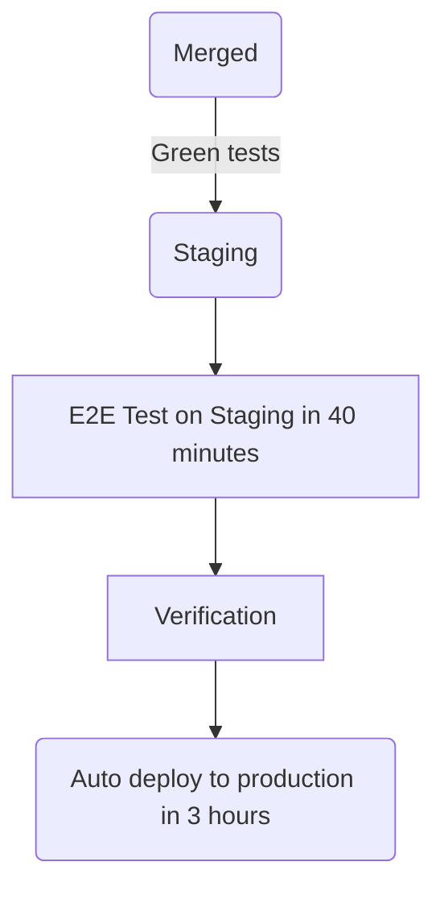

- [方針](/handbook/product/groups/fulfillment/direction/fulfillment_section/)
- [グループ](/handbook/product/categories/#fulfillment-section)
- [チーム](/handbook/engineering/development/fulfillment/#team-members)

## ビジョン

私たちが構築する製品を通じてお客様にワールドクラスの購入体験を提供する [ハイパフォーマンスなチーム](/handbook/leadership/#strategies-to-build-high-performing-teams)。私たちのチームは、楽しく、パフォーマンスが高く、信頼でき、安定した体験を構築することを目指しています。

## ミッション

Fulfillment は、以下のエリアでの私たちの能力とメトリクスの改善に焦点を当てています:

- [Platform](/handbook/product/categories/#fulfillment-platform-group): [チーム](/handbook/engineering/development/fulfillment/fulfillment-platform/#team-members)
- [Provision](/handbook/product/categories/#provision-group): [チーム](/handbook/engineering/development/fulfillment/provision/#team-members)
- [Seat Management](/handbook/product/categories/#seat-management-group): [チーム](/handbook/engineering/development/fulfillment/seat-management/#team-members)
- [Subscription Management](/handbook/product/categories/#subscription-management-group): [機能](/handbook/product/groups/fulfillment/direction/subscription_management/)
- [Utilization](/handbook/engineering/development/fulfillment/utilization/): [チーム](/handbook/engineering/development/fulfillment/utilization/#team-members)

## 方針

[Fulfillment 製品方針](/handbook/product/groups/fulfillment/direction/fulfillment_section/) に加えて、Fulfillment 開発サブ部門は以下を目指しています:

- Fulfillment インフラの信頼性と可用性を高める
- Fulfillment システムのアーキテクチャとデータモデルに基礎的な技術的改善を行う
- より良いツールとドキュメントを通じて Fulfillment エンジニアの開発者体験を改善する

## チームメンバー

Fulfillment セクションとサブグループのチームメンバー一覧については https://handbook.gitlab.com/handbook/product/categories/#fulfillment-section を参照してください。

## Stable counterparts

### Sales & Go-To-Market



### Finance & IT



### Support Engineering



### Office of the CEO



### Product Technical Program Management



## プロジェクト管理プロセス

- 私たちの [GitLab の価値観](/handbook/values/) に従って
- 透明に: ほぼすべてが公開されており、可能な限りミーティングを記録/ライブストリーミングします
- 取り組みたいことに取り組む機会がある
- 誰もが貢献でき、サイロは存在しない

### SAFE

GitLab において [SAFE な方法](/handbook/legal/safe-framework/) で作業することは、誰もの責任です。私たちは Sales および Billing の安定したカウンターパートとともに、機密または財務情報に遭遇する可能性があり、ビジネス全体に影響を与える可能性がある製品の領域に貢献しています。したがって、Fulfillment チームメンバーが、生み出す SAFE Epic、Issue、動画、MR、その他のアーティファクトが機密に保たれていることを確認することが重要です。

時には、潜在的に SAFE なディスカッションが行われている公開 Issue の説明に、以下のような文言を含めるのが賢明な場合があります。

> このページには、今後の製品、機能、機能性に関連する情報が含まれている場合があります。
> 提示されている情報は情報提供のみを目的としていることに注意することが重要です。
> したがって、購入や計画の目的でこの情報に依存しないでください。すべてのプロジェクトと同様に、
> ページに記載されている項目は変更または遅延される可能性があり、製品、機能、機能性の開発、
> リリース、タイミングは、GitLab Inc. の独自の裁量に委ねられます。

同様に、すべての情報を公開ハンドブックに含めるべきではありません。代わりに、この SAFE 情報には [プライベートな内部ハンドブック](https://internal.gitlab.com/) を使用してください。

詳細については、[将来のバージョンでの機能の約束](https://docs.gitlab.com/ee/development/documentation/styleguide/availability_details.html#promising-features-in-future-versions) に関するドキュメントを参照してください。

### プランニング

私たちは [製品開発タイムライン](/handbook/engineering/workflow/#product-development-timeline) に従って月次サイクルで計画します。
今後のリリースに対するリリーススコープは、`1 日` までに確定すべきです。

`26 日` 頃: プロダクトはエンジニアリングマネージャーと予備的な Issue レビューのために会います。Issue にはマイルストーンがタグ付けされ、初期に見積もりが行われます。

**プランニング Issue**

- [Subscription Management](https://gitlab.com/gitlab-org/fulfillment/meta/-/issues/?label_name%5B%5D=Planning%20Issue&label_name%5B%5D=group%3A%3Asubscription%20management&sort=created_date&state=opened)
- [Fulfillment Platform](https://gitlab.com/gitlab-org/fulfillment/meta/-/issues/?label_name%5B%5D=Planning%20Issue&label_name%5B%5D=group%3A%3Afulfillment%20platform&sort=created_date&state=opened)
- [Provision](https://gitlab.com/gitlab-org/fulfillment/meta/-/issues/?label_name%5B%5D=Planning%20Issue&label_name%5B%5D=group%3A%3Aprovision&sort=milestone_due_desc&state=opened)
- [Utilization](https://gitlab.com/gitlab-org/fulfillment/meta/-/issues/?label_name%5B%5D=Category%3AUtilization&label_name%5B%5D=Planning%20Issue&scope=all&state=opened)

### インテークリクエスト

Fulfillment ロードマップに作業を追加するよう要求するには、[このリンク](https://gitlab.com/gitlab-org/fulfillment/meta/-/work_items/new?type=ISSUE&description_template=intake) に従って Issue を開き、Fulfillment プロダクトマネージャーの 1 人をタグ付けしてください。

Fulfillment プロダクトマネージャーがリクエストをレビューし、スコープと影響を評価し始めるためにアサインされます。これは、チームのキャパシティによっては時間がかかる場合があります。評価後、PM は以下を行います:

1. インテーク Issue から関連する詳細を取り込んで、新しい Epic を作成する。
1. この新しい Epic を Fulfillment ロードマップに追加する。
1. インテーク Issue の説明を新しい Epic へのリンクで更新する。
1. インテーク Issue をクローズする。

私たちは、リクエストに着手する前にリクエストの完全な詳細を捉えるために、このインテークリクエストプロセスに厳密に従います。プロダクトマネージャーがこのリクエストを受け取ったら、問題と要件を完全に理解できるよう、リクエスト元と協力します。その後、リクエストを [優先度設定](/handbook/engineering/development/fulfillment/#prioritization) します。

### 優先度設定

私たちは、月次ベースでバックログを優先度設定するために、[クロスファンクショナル優先度設定ガイドライン](/handbook/product/product-processes/cross-functional-prioritization/) を含む [優先度設定フレームワーク](/handbook/product/product-processes/#prioritization) に従います。R&D チームは、SLA、OKR、[Fulfillment の L&R サポート優先度 Issue リスト](/handbook/support/license-and-renewals/workflows/managing_product_issues/#supports-issue-list-for-fulfillment)、技術的負債などを含むさまざまなインプットとセンシングメカニズムを使って優先度を設定します。

新しいイニシアチブと技術的負債にわたって短期、中期、長期投資のバランスを取ることで、ビジネス価値を最大化することを目指しています。GitLab では、新しい製品開発に 60%、技術的負債と保守に 40% の全社割り当てを目標としています。ただし、この 60/40 の分割は柔軟であり、時間の経過とともにグループとセクションによって異なる場合があります。

Fulfillment セクションでは、OKR 中心の作業へのバランスの取れたアプローチを確保し、信頼性と効率を向上させるための十分なエンジニアリングイニシアチブを優先することを確実にするために、ガイドラインとして 60/40 の比率を採用しています。私たちは計画と実行において適応性を保ち、これらのパーセンテージへの厳密な遵守を避けます。代わりに、OKR に反映される会社のニーズの包括的な評価に基づいて作業を優先します。各グループに OKR で適切なバランスを見つけることを委ねます。グループ内で合意に達することができない場合、セクションレベルにエスカレートして決定すべきです。

グループレベルでの月次マイルストーン計画では、活動を OKR に合致させるよう最適化し、柔軟性を保ち、60/40 の分割からの逸脱を許容します。また、[優先度設定フレームワーク](/handbook/product/product-processes/#prioritization-framework) に従って、必要に応じて強制的な優先度設定を SLA 内で完了することも確認します。

すべてのチームは毎月の [月次優先度設定テンプレート](https://gitlab.com/gitlab-org/fulfillment-meta/-/blob/master/.gitlab/issue_templates/monthly-prioritization.md) を使って [クロスファンクショナルダッシュボードレビュー](/handbook/engineering/development/#cross-functional-dashboard-reviews) を行います。

### 見積もり

Issue で作業を開始する前に、最初に予備的な調査の後に見積もる必要があります。これは通常、月次プランニングミーティングで行われます。

| Weight | 説明 (エンジニアリング) |
| ------ | ------ |
| 1 | 最も単純な変更。副作用がないと確信している。 |
| 2 | 簡単な変更 (最小限のコード変更)。すべての要件を理解している。 |
| 3 | 簡単な変更だが、コードのフットプリントが大きい (例: 多くの異なるファイル、または影響を受けるテスト)。要件は明確である。 |
| 5 | コードベースの複数のエリアに影響する、より複雑な変更。リファクタリングが含まれる可能性もある。要件は理解されているが、途中でいくつかのギャップがある可能性があると感じる。 |
| 8 | 複雑な変更で、コードベースの多くに関わるか、要件を決定するために他者からの多くのインプットを必要とする。 |
| 13| 依存関係 (他のチームまたはサードパーティ) があり、すべての要件をまだ理解していない可能性がある重要な変更。これをマイルストーンにコミットすることはまずなく、好ましくは要件をさらに明確化したり、より小さな Issue に分解したりすることが好ましい。 |

プランニングと見積もりでは、[予測可能性よりも速度](/handbook/engineering/development/principles/#velocity) を重視します。私たちのプランニングと見積もりの主な目標は、[MVC](/handbook/values/#minimal-valuable-change-mvc) に焦点を合わせ、盲点を発見し、過度に最適化することなくベースラインレベルの予測可能性を達成するのを助けることです。一般的に、GitLab の部門では [70% の予測可能性] を目指していますが、Fulfillment サブ部門では、私たちの作業が通常クロスファンクショナルであり、他の部門と歩調を合わせる必要があるため、80% の予測可能性を目指しています。

- Issue に多くの未知数があり、それが 1 か 5 かが不明な場合、慎重になり高く見積もります (5)。
- Issue に多くの未知数がある場合、2 つの Issue に分解できます。最初の Issue は調査用で、[Spike](https://en.wikipedia.org/wiki/Spike_(software_development)) とも呼ばれ、未知数のリスクを軽減し、潜在的なソリューションを探索します。2 つ目の Issue は実装用です。
- 初期見積もりが正しくなく、調整が必要な場合、見積もりをすぐに修正し、プロダクトマネージャーに知らせます。プロダクトマネージャーとチームは、マイルストーンのコミットメントを調整する必要があるかどうかを決定します。

**見積もりテンプレート**

以下は、エンジニアが Issue の見積もりに貢献する際に考慮すべきガイドメンタルフレームワークです。

```markdown
### Refinement / Weighting

<!--
Ready for development means replying yes to the following questions:

- Is this issue sufficiently small enough? If not, break it into smaller issues
- Is it assigned to the correct domain (e.g. frontend, backend)? If not, break it into two issues for the respective domains
– Is the issue clear and easy to understand? If not, try asking further clarification questions and update the description once they are received

If more than 2 MRs are needed, consider adding a table like the following to the description (e.g. under `Implementation plan`).

| Description | MR |
|-|-|
|||

It will help track the status.
-->

- [ ] Ready for development
- [ ] Weight is assigned
- [ ] Number of MRs listed
- [ ] Needs testing considerations
- [ ] Needs documentation updates

**Reasoning:**

<!--
Add some initial thoughts on how you might break down this issue. A bulleted list is fine.

This will likely require the code changes similar to the following:

- replace the hex driver with a sonic screwdriver
- rewrite backups to magnetic tape
- send up semaphore flags to warn others

Links to previous examples. Discussions on prior art. Notice examples of the simplicity/complexity in the proposed designs.
-->
```

### 取り組むものを選ぶ

エンジニアは [チームのプランニング Issue を開いてマイルストーンボードを確認](https://gitlab.com/gitlab-org/fulfillment/meta/-/work_items/?sort=priority_desc&state=opened&label_name%5B%5D=Planning%20Issue&first_page_size=100) し、まず `deliverable` ラベルのあるものに取り組み始めることができます。

エンジニアは、deliverable が完了したら、マイルストーンの残りの Issue のいずれかを選ぶこともできます。エンジニアに好みがない場合、上位から次に利用可能な Issue を選ぶことができます。

### ワークフロー

私たちは一般的に [製品開発フロー](/handbook/product-development/how-we-work/product-development-flow/#workflow-summary) に従い、そこで定義されているワークフローラベルを使用します。

一般的に言って、Issue は 2 つの状態のいずれかにあります:

- ディスカバリー/リファインメント: 開発を開始することを妨げる質問にまだ答えている、
- 実装: Issue がエンジニアの作業を待っているか、積極的に構築されている。

Basecamp はこれらの段階を [丘の登りと下り](https://basecamp.com/hill-charts) との関係で考えます。

個々のグループは [製品開発フロー](/handbook/product-development/how-we-work/product-development-flow/#workflow-summary) のワークフローにおいて、有用と感じる数のステージを自由に使用できますが、Issue がディスカバリー/リファインメントから実装にどう移行するかについては、ある程度規範的であるべきです。

### ユーザー体験

私たちは、ユーザーとビジネスのニーズのバランスを作りながら、すべてのワークフローで優れたユーザビリティを提供することに努めます。プロダクトデザイナーは、プロダクトマネージャーおよびエンジニアと密接に協力します。

#### 私たちの働き方

- ハンドブックの [プロダクトデザインセクション](/handbook/product/ux/) で説明されている [プロダクトデザイナーワークフロー](/handbook/product/ux/product-designer/) と [UX リサーチャーワークフロー](/handbook/product/ux/experience-research/) に従います。
- [UX スコアカード](/handbook/product/ux/ux-scorecards/) を使って進捗を測定します。
- 毎四半期に最も重要なプロジェクトを優先し、Fulfillment プロダクトデザイナーは [グループの代わりにプロジェクトをサポート](#product-designer-focus-areas) します。
- デザインの SSOT として [[UX] Issue](#ux-issue-management-and-weights) を使用します。実装 Issue は、SSOT を維持するためにデザインの詳細について [UX] Issue にリンクすべきです。
- Issue を追跡するためにラベルを使用します:
  - `UX`、`devops::fulfillment`、`section::fulfillment`、`group::`
  - [製品開発フロー](/handbook/product-development/how-we-work/product-development-flow/) の中で Issue がどこにあるかを示す `workflow::` ラベル
  - リサーチ取り組みのための `UX Problem Validation` と `UX Solution Validation`
  - UX Issue の weight のための `design weight::`

#### プロダクトデザイナーのフォーカスエリア

Fulfillment チームはプロジェクトに焦点を当てており、多くのプロジェクトがグループにまたがるため、ユーザー体験のギャップや頻繁なデザイナーの借り入れリクエストが発生します。これを避けるために、デザイナーをプロジェクトエリアに割り当て、四半期ごとに OKR プランニング中に再検討します。

- Fulfillment UX チームの優先事項は、[優先度設定 Issue](https://gitlab.com/gitlab-org/fulfillment/meta/-/issues/?label_name%5B%5D=Fulfillment%20UX%20Priorities) に文書化されています。
  - 優先事項は、四半期ごとに、または新しい優先プロジェクトが特定されたときに、チームによってレビューされるべきです。
- 誰でも Issue でデザインフォーカス向けに特定されたプロジェクトを提案できます。プロダクトマネージャーは、プロダクトデザイナーとプロダクトデザインマネージャーと協力して優先度をランク付けすべきです。複数の PM が 1 つのプロジェクトに貢献している場合、UX プランニングのために 1 人が指定されるべきです。
  - 優先度のコールをして、デザインサポートなしで進行するプロジェクトがある場合は、これらの決定を Issue にリストします。
- デザイナーは、割り当てられたプロジェクトの外で Issue を取り上げることができます。これらは、SUS に影響する Issue やバグなど、重要な UX Issue でなければなりません。必要に応じて、Issue の weight を使ってトレードオフを議論できます。
- 誰でも #s_fulfillment_ux Slack チャンネルを使って支援を求めることができます。

ベストプラクティス

- ワークロードを管理するために、デザイナーは一度に最大 1 つの大きなプロジェクトと 1 つの小さい/中程度のプロジェクト、または 3-4 つの小さい/中程度のプロジェクト (または Issue の weight の同等のもの) にアサインされるべきです。
- デザイナーは、最善の判断を使ってチームと協力し、どのミーティングに出席するかを決定すべきです。デザイナーは、同時に複数のチームのチーム同期ミーティングに出席することは期待されていません。
- プロダクトデザイナーは、サポートしているプロジェクトのために [UX MR レビュー](/handbook/product/ux/product-designer/mr-reviews/) にアサインされるべきです。
  - デザイナーがアサインされていないプロジェクトの一部である MR で UX レビューが必要な場合は、#s_fulfillment_ux Slack チャンネルでリクエストを投稿してください。Slack チャンネルでの UX MR レビューリクエストは、帯域幅に基づいて取り上げられます。

#### UX Issue 管理と weight

私たちは、複数の開発 Issue (例: エンドツーエンドフロー、複雑なロジック、エンジニアリングによっていくつかの実装 Issue に分解される複数のユースケース/状態) を実装するのに 1 つ以上の開発 Issue がかかる中程度または大規模なプロジェクトのために、別個の [UX] Issue を使用します。UX Issue には [UX] プレフィックスを付けるべきです。

実装が単一の Issue で行えるほど作業が小さい場合は、別個の [UX] Issue は必要なく、デザイナーは自分自身を Issue にアサインし、デザインフェーズにあることを示すワークフローラベルを使用するべきです。

- [UX] Issue は、デザイン目標、デザインドラフト、デザインの会話と批評、実装される選択されたデザイン方向の SSOT です。実装 Issue は、SSOT として [UX] Issue 内のデザインにリンクすべきです。
- 製品要件のディスカッションは、可能な限り main Issue または Epic で行われ続けるべきです。
- プロダクトデザイナーが、デザインが ~"workflow::planning breakdown" の準備ができていることを示したい場合、Issue にこのラベルを適用し、PM と EM に通知し、Issue をクローズすべきです。
- Issue の weight は、ラベルの定義に従い、~'design weight:" ラベルを使って適用されるべきです。

### 作業の承認とマージ

CustomersDot で承認ルールが有効になっているため、`main` をターゲットとするすべての MR は少なくとも 1 つの承認 (作者/コミッターとは異なる) が必要です。
MR は次の基準を満たす必要があります:

- メンテナーを含む **少なくとも 2 人の異なるレビュアー** が必要です。ただし、**ロジックに変更のない些細な MR では 1 人のレビュアーで十分** で、このような変更 (例: 軽微な依存関係の更新、テストの修正、単純なリバート) では初期レビューをスキップできます。
- 少なくとも 1 つの承認を受ける必要があります。
- メンテナーのレビューが必要です。

承認ルールに加えて、MR は [Danger bot](https://docs.gitlab.com/ee/development/dangerbot.html) が示唆するように、追加のレビューが必要になる場合があります:

1. DB の変更には、データベースレビュアーとメンテナーの承認が必要
1. セキュリティ関連の Issue (認証の変更など) には [Security レビュー](/handbook/security/product-security/security-platforms-architecture/application-security/appsec-reviews/#adding-features-to-the-queue--requesting-a-security-review) が必要
1. SFDC API への変更には [Sales チーム](/handbook/sales/field-operations/sales-systems/) のレビューが必要
1. Zuora API への変更には [EntApps チーム](/handbook/business-technology/enterprise-applications/) のレビューが必要
1. ユーザー体験への変更には [UX レビュー](/handbook/product/ux/product-designer/mr-reviews/) が必要

### 週次非同期 Issue アップデート

毎週、各エンジニアは以下のテンプレートを使ってアサインされた Issue にコメントすることで、簡単な非同期 Issue アップデートを提供することが期待されています:

```markdown
<!---
Please be sure to update the workflow labels of your issue to one of the following (that best describes the status)"
- ~"workflow::In dev"
- ~"workflow::In review"
- ~"workflow::verification"
- ~"workflow::blocked"
-->
### Async issue update

1. Please provide a quick summary of the current status (one sentence)
    -
1. How confident are you that this will make it to the current milestone?
    - [ ] Not confident
    - [ ] Slightly confident
    - [ ] Very confident
1. Are there any opportunities to further break the issue or merge request into smaller pieces (if applicable)?
    - [ ] Yes
    - [ ] No
1. Were expectations met from a previous update? If not, please explain why.
    - [ ] Yes
    - [ ] No, ___
1. Are the related issues up to date? Please link any missing issues in the epic that could be linked to this issue
    - [ ] Yes
    - [ ] No

/health_status [on_track, needs_attention, at_risk]
```

これは、私たちのチームがコラボレーションにおいてより非同期になることを促進し、コミュニティや他のチームメンバーが、私たちが現在積極的に取り組んでいる Issue の進捗を知ることができるようにするためです。

### 非同期プロジェクトアップデート

このテンプレートは、リーダーシップやクロスファンクショナルなパートナーと共有される、より大きなプロジェクトの進捗状況アップデートに使用されます。

リーダーシップは以下に関心があります

1. プロジェクトは進行しているか? --> 週ごとの完了率を見る
2. クリアする必要があるブロッカーはあるか? --> リスクとブロッカーを見る
3. 次のイベントはいつ期待できるか? --> 主要日付を見る

このテンプレートはガイドラインで、特定のプロジェクトのニーズに合わせて自由に変更してください。テンプレートから逸脱する前に、リーダーシップが複数のプロジェクトにわたるステータスアップデートを見ていることを念頭に置いてください。プロジェクト間で適合性が高いほど、リーダーシップがステータスを正確に理解しやすくなります。

```markdown
## Status update as of XXXX-XX-XX

### Summary

1. **Key Resources**
  * **_TBD_ this section is optional**

2. **% Complete**: `X%`

3. **Status**: `On Track or Behind` (this is determined based on your how your % complete is trending to your key dates -- are you far enough along to hit your key dates?)

4. **Key Dates**:

 * Design complete - Milestone XX.X
 * Development complete - Milestone XX.X
 * Rolled out in production - XXXX-XX-XX

### Risks & Blockers

| Risks & Blockers | Mitigation Approach |
|------------------|---------------------|
| **_New!_** |  |

### Results/Challenges/Learnings

_List any type of deliverable, e.g. merged MRs, alignment on solution, copy/designs were completed._


1.

**FYI** TAG FOLKS

```

### デモ

一部の作業は、完了するのに数マイルストーンかかることがあります。定期的な非同期 Issue アップデートとともに、デモを設定すると便利です。利点は以下のとおりです:

- フィードバックサイクルを短縮する
- 作業の可視性を高める
- 作業と進捗のコミュニケーションを改善する

MR でのレビュープロセスを容易にするために、デモと録画を提供することはすでに奨励されていることに注意してください。

この目的のために、YouTube の再生リストが作成されています: [Fulfillment Demos](https://www.youtube.com/playlist?list=PL05JrBw4t0KpOKxufy-slaR-6swIfkDLP) (一部のコンテンツは内部のみ)。デモをアップロードするには、[ここに記載されているプロセス](/handbook/engineering/workflow/demos/) に従うことができます。動画が作成されたら、[Fulfillment Demos](https://www.youtube.com/playlist?list=PL05JrBw4t0KpOKxufy-slaR-6swIfkDLP) 再生リストにリンクしてください。説明に以下の情報を追加することを検討してください:

- Epic/Issue へのリンク
- MR へのリンク (もしあれば)
- アップロードした人の名前とプロフィールへのリンク (オプション)

[例](https://www.youtube.com/playlist?list=PL05JrBw4t0KpOKxufy-slaR-6swIfkDLP) はこちら (内部のみ)

### 品質

GitLab の品質は誰もの責任です。

#### エンドツーエンドテスト - いつ、なぜ、どのように書くか

エンドツーエンドテスト (しばしば e2e テストと呼ばれる) は、エンドユーザーが通る完全または部分的なフローをカバーします。テストレベルに関する詳細な情報は [こちら](https://docs.gitlab.com/ee/development/testing_guide/testing_levels.html) で見つけることができます。

これらのフローの例:

- GitLab.com の名前空間用の SaaS サブスクリプションを購入する。
- セルフマネージド GitLab インスタンス用の新しいサブスクリプションを購入する。

これらのテストは速くなく、不安定になりやすいため、エンドツーエンドテストで何をカバーし、何を低レベルのテストに委任するかの優先順位付けを考慮する必要があります。

Fulfillment テストは [GitLab プロジェクト](https://gitlab.com/gitlab-org/gitlab/-/tree/master/qa/qa/specs/features/ee/browser_ui/11_fulfillment) と [CustomersDot プロジェクト](https://gitlab.com/gitlab-org/customers-gitlab-com/-/tree/main/qa) の両方に存在します。テストを書く際にどのプロジェクトを使用するかを決定するには、次のガイドを使用します:

- テストが CustomersDot ポータルを開いてアクションを実行する必要がある場合は CustomersDot を選択し、それ以外の場合は GitLab が正しいプロジェクトになります。
- 将来的には、CustomersDot は単なるバックエンドサービスになり、UI エンドツーエンドテストは GitLab にのみ存在することが計画されています。

#### GitLab

GitLab のエンドツーエンドテストガイドは [こちら](https://gitlab.com/gitlab-org/gitlab/-/blob/master/doc/development/testing_guide/end_to_end/beginners_guide) で見つけることができます。

GitLab プロジェクトで計画された/自動化された Fulfillment テストケースは [こちら](https://gitlab.com/gitlab-org/gitlab/-/quality/test_cases?state=opened&sort=created_desc&page=1&label_name%5B%5D=devops%3A%3Afulfillment) で見つけることができます。

#### CustomersDot

CustomersDot エンドツーエンド初心者ガイドは [こちら](https://gitlab.com/gitlab-org/customers-gitlab-com/-/blob/main/qa/doc/beginners_guide.md) で見つけることができます。

CustomersDot プロジェクトで計画された/自動化されたテストケースは [こちら](https://gitlab.com/gitlab-org/customers-gitlab-com/-/quality/test_cases) で見つけることができます。

### テスト

CustomersDot には異なる種類のテストが実行されています:

1. リンティングと [rubocop](https://github.com/rubocop/rubocop) ジョブ
1. ユニットテスト (spec、コントローラー spec などさまざまな種類がある)
1. 統合テスト (spec、外部呼び出しをモック)
1. フロントエンドテスト
1. [Watir 経由の E2E 統合テスト](https://github.com/watir/watir)

また、`VCR` フラグもあり、デフォルトで Zuora への外部呼び出しをモックします。フラグを設定して API 呼び出しが Zuora サンドボックスに当たり、(API の変更による) 失敗が通知されるよう、毎日 9AM UTC に実行される [日次パイプライン](https://gitlab.com/gitlab-org/customers-gitlab-com/pipeline_schedules) があります。

テスト失敗はパイプラインへのリンクとともに #s_fulfillment_status に通知されます。パイプラインの失敗はステージングと本番へのデプロイを防ぎます。

### セキュリティ

#### アクセスレビュー

Fulfillment エンジニアリングのエンジニアリングマネージャーとシニアリーダーシップは、四半期ベースで Fulfillment システム (例: CustomersDot) のアクセスレビューに責任があります。[アクセスレビュー](/handbook/security/security-assurance/security-compliance/access-reviews/) を実施するために以下のガイダンスを使用します: `システムのアクセスは、職務役割と部門に基づいてレビューされます`。そのため、レビュアーは、現在の役割と部門の関連性を評価しながら、現在アクセスを持つチームメンバーのリストを評価する際に最善の判断を使用します。

以下のリストには、アクセスを保持すべき標準的な部門とチームの一部が含まれています:

**読み取り専用アクセス**

- Sales チーム

**書き込みアクセス**

- AppSec チーム
- Billing チーム
- Fulfillment サブ部門 (エンジニアリング、プロダクト、品質、その他のカウンターパート)
- IT Helpdesk
- Support チーム

不確かな場合は、別の [アクセスリクエスト](/handbook/security/corporate/end-user-services/access-requests/access-requests/) を通じて簡単に復元できるため、アクセスを拒否する側に立ってください。

### デプロイメント

#### 売上に影響する変更

Fulfillment はエンジニアリングにおいてユニークな存在で、私たちの変更が直接売上に影響する可能性があります。売上に影響を与える変更や、その他の高リスクの変更には、Fulfillment 外のチームからのインプットを含む、より広範な精査が必要になる場合があります。これらの決定について PM が DRI であり、Sales、Enterprise Applications、Marketing、Finance、および Customer Support を含むステークホルダーからのインプットを取り入れます。

変更が高リスクをもたらす可能性がある場合でも、可能な限り反復的であることを目指します。

以下は、多くのチーム間の調整を必要とする可能性があるため、高リスクの可能性がある変更の例です:

- 価格変更
- 課金変更
- 新しい有料機能の立ち上げ
- 既存の有料機能の非推奨化
- 利用規約の変更と関連する契約変更
- リソース消費の計算または表示方法の変更 (ユーザー数、コンピュートミニッツなど)

以下は、しばしば低リスクの変更です:

- フロントエンドでまだ使用されていないバックエンドの強化
- フィーチャーフラグの背後にあるフロントエンドおよびバックエンドの強化
- フィーチャーフラグの背後にないが「beta」または「experimental」とラベル付けされたフロントエンドの強化

高リスクの変更については、以下のプロセスに従うべきです:

- 新しい/更新された動作の機能ドキュメントを更新し、関連するステークホルダーと共有する
- これらの変更には機密 Issue を使用する
- リリース日に有効にできるよう、フィーチャーフラグの下で変更をリリースする
- リリース日のロールアウト Issue を作成し、すべての関係者がプロセスについて通知されていることを確認する。[例](https://gitlab.com/gitlab-org/gitlab/-/issues/299068)
- 変更を反復的にテストできるよう、顧客のサブセットに対して有効にすることを検討する
- 機密 MR が改善される ([1](https://gitlab.com/groups/gitlab-org/-/epics/1175)、[2](https://gitlab.com/groups/gitlab-org/-/epics/264)) まで、Issue が機密であっても通常の MR プロセスを使用する

#### CustomersDot

[CustomersDot](https://gitlab.com/gitlab-org/customers-gitlab-com/) には CD (Continuous Deployment) を使用しており、MR は `staging` ブランチにマージされると次の段階を経ます:



`Verification` ステージで問題が発生した場合、`production::blocker` ラベル付きの Issue を作成でき、これは本番へのデプロイを防ぎます。Issue は機密にすることはできません。

production blocker が設定されており、それを削除するための修正を含む MR が必要な場合、MR の本番デプロイメントを早めることができます。本番にデプロイするジョブは、3 時間の遅延をスキップするためにスケジュール解除する必要があり、`production::blocker` ラベルの削除または Issue のクローズの直後に手動でトリガーしてデプロイされます。

大きな変更のある MR については、[フィーチャーフラグ](https://gitlab.com/gitlab-org/customers-gitlab-com/#feature-flags-unleash) の使用を検討するか、デプロイメントを一時停止しより長いテストを可能にするために `production::blocker` ラベル付きの Issue を作成すべきです。

#### Feature freeze

Fulfillment の feature freeze は、会社の残りと同時期、通常マイルストーンが終わる金曜日頃に発生します。

| App | Feature freeze (*) | マイルストーン終了 |
| ---      |  ------  |----------|
| GitLab.com   | マイルストーンが終わる金曜日からリリース日まで | freeze と同じ |
| Customers/Provision   | マイルストーンが終わる金曜日からリリース日まで | freeze と同じ |

(*) feature freeze は [auto-deploy ドキュメント](https://gitlab.com/gitlab-org/release/docs/-/blob/master/general/deploy/auto-deploy.md) に従って変動する場合があります。

現在のマイルストーンの feature freeze 後にマージされなかった Issue は、次のマイルストーンに移動する必要があります (優先度も変更される可能性があります)。

#### Production Change Lock (PCL)

GitLab が一時的に本番変更を停止する時間があります。主要な世界的な祝日や、GitLab チームメンバーの可用性が大幅に低下する他の時期などです。PCL に関する詳細は [このインフラハンドブックページ](/handbook/engineering/infrastructure-platforms/change-management/#production-change-lock-pcl) で見つけることができます。

これらの PCL の間、特に年末に、PCL は [PCL テンプレートを使用](https://gitlab.com/gitlab-org/customers-gitlab-com/-/tree/main/.gitlab/issue_templates/Pcl.md) して Issue を作成することで CustomersDot で管理されます。この Issue には、DRI と `production::blocker` ラベルの追加または削除のターゲット時間とともに指示のチェックリストを含めるべきです。PCL が終了したら、Issue をクローズできます。

##### Zuora ブロック期間

Zuora は [リリースカレンダー](/handbook/business-technology/enterprise-applications/pmo/#release-calendar) に従っており、Change Request が不可能であるか追加の承認が必要になるブロック期間があります。

### インシデント管理

進行中の [Fulfillment Platform](/handbook/engineering/development/fulfillment/fulfillment-platform/) の作業により、すべての Fulfillment システムに対するオブザーバビリティが向上します。それまでの間、しかし、Slack の [#s_fulfillment_status](https://gitlab.slack.com/archives/CL7SX4N86) に投稿する [CustomersDot health](https://customersdot.us.to/) などのツールがあります。時折、ライブネスプローブチェックの失敗、無効な SSL 証明書、その他のアプリケーションエラーなど、システム的な重大なトラブルの報告があります。エラー解決に貢献する方法については、以下のサブセクションを参照してください。

[GitLab モニタリング](/handbook/engineering/monitoring/) と [インシデント管理](/handbook/engineering/infrastructure-platforms/incident-management/) の詳細については、このハンドブックページを参照してください。

#### インシデントまたは停止のためのエスカレーションプロセス

**Tier 2 SME オンコールエスカレーション**

Fulfillment はインシデント対応のために [Tier 2 SME オンコールローテーション](https://gitlab.com/gitlab-com/gl-infra/production-engineering/-/issues/27741) を実装しています。このプロセスは、Fulfillment チーム内の専門家への構造化されたエスカレーションを提供します。

**Tier 2 がページされるとき:**

- インシデントまたは停止の間、Engineer on Call (EOC) は incident.io を通じて Fulfillment Tier 2 SME オンコールローテーションにエスカレートできます
- Tier 2 SME ローテーションは [定義されたエスカレーションパス](/handbook/engineering/infrastructure-platforms/incident-management/on-call/tier-2/) に従います:
  - **レベル 1**: スケジュールローテーションに基づく現在の SME オンコール (EMEA、AMER、または APAC)
  - **レベル 2**: レベル 1 が 15 分以内に確認応答しない場合、エスカレーションはラウンドロビンで全チームメンバーに進行
  - **レベル 3**: [James Lopez](https://gitlab.com/jameslopez) へのさらなるエスカレーション

**停止のための追加の自動通知:**

- 停止が発生すると、Slack の `#s_fulfillment_status` に通知され、[James Lopez](https://gitlab.com/jameslopez) と [Vitaly Slobodin](https://gitlab.com/vitallium) が自動電話ページを受け取ります

**一般的なインシデント報告:**

1. 停止が発生すると、[SRE オンコール](/handbook/engineering/on-call/) に自動的に通知されます。インシデントは [手動で報告](/handbook/engineering/infrastructure-platforms/incident-management/#reporting-an-incident) することもできます。
1. 必要に応じて、SRE オンコールまたはインシデントの報告者は、チームに通知し支援を得るために Slack で `@fulfillment-engineering` にメンションできます

#### 緊急の Issue のためのエスカレーションプロセス

ほとんどの場合、MR は上記で説明した通り、レビュー、メンテナーレビュー、マージ、デプロイメントの標準プロセスに従うべきです。本番が壊れているとき:

1. まず、[Rapid Engineering Response](/handbook/engineering/workflow/#rapid-engineering-response) プロセスに従うべきかどうかを判断します。これは可用性と状況の重要度によります。
1. ステージングと本番自動デプロイ間の 3 時間の待機は、メンテナーによる手動デプロイメントでバイパスできます。
1. プロジェクトメンテナー ([CustomersDot](/handbook/engineering/projects/#customers-app)) が利用できない場合、メンテナーアクセス権を持つ追加の GitLab チームメンバーに支援を求めることができます。

これらの場合、以下を確認してください:

1. エスカレーションの理由を説明する Issue があり、[Rapid Engineering Response](/handbook/engineering/workflow/#rapid-engineering-response) に従う。関連する [Growth/Fulfillment チーム](https://gitlab.com/gitlab-org/growth) に '@' メンションすることを検討する。
1. 変更が [#s_fulfillment](https://gitlab.slack.com/archives/CMJ8JR0RH) チャンネルでアナウンスされる。

#### 調査

- ヘルスチェックインスタンスを [こちら](https://customersdot.us.to/dashboard) で訪問できます。ログイン認証情報は [_Subscription portal_ 1Password vault](https://gitlab.1password.com/vaults/27nafqigafgxfjpjkl2wvzs26y/allitems/76izejxhnpqzu3ptrtg5x4hcpm) で見つけることができます。CustomersDot の本番とステージングの両方のサービスが表示されます。
- CustomersDot の例外は [Sentry](https://sentry.gitlab.net/gitlab/customersdot/) でキャプチャされます。
- [Kibana / Elasticsearch](https://log.gprd.gitlab.net/) でログをクエリできます。GitLab での [kibana の使用](/handbook/support/workflows/kibana/) について詳しく読むには、このリンクを使用してください)
- Grafana には GitLab に一般的に適用される [トリアージダッシュボード](https://dashboards.gitlab.net/d/RZmbBr7mk/gitlab-triage?orgId=1&refresh=5m) がいくつかありますが、InfraDev の作業が完了するまで Fulfillment システムの特定のオブザーバビリティメトリクスは含まれていません。
- 本番可用性アラートを報告する Blackbox プローブは [Slack の #production](https://app.slack.com/client/T02592416/C101F3796/) に報告されます

#### インシデントの宣言

[インシデントを発生させる](/handbook/engineering/infrastructure-platforms/incident-management/#report-an-incident-via-slack) ことは、ブロッキングの問題に即座に注意が必要な場合は常にオプションです。

ブロッキングの問題の例には以下が含まれます:

- ステージングまたはテスト環境でサービスが中断された期限切れの証明書

本番停止のような重要な問題は迅速に発生させるべきです。インシデントを発生させる前に [#incident_management](https://gitlab.slack.com/archives/CB7P5CJS1) を確認できます。

- CustomersDot 停止
- CustomersDot デプロイ失敗

#### Grafana ダッシュボード

これらのダッシュボードは、機能カテゴリで作業するすべての人に、私たちのコードが GitLab.com スケールでどのように動作するかについての洞察を提供するように設計されています。

- [Provision](https://dashboards.gitlab.net/d/stage-groups-provision/stage-groups-group-dashboard-fulfillment-provision)
- [Utilization](https://dashboards.gitlab.net/d/stage-groups-utilization/stage-groups-utilization-group-dashboard)

### 顧客エスカレーション

ライセンシング Issue (サポートまたはセールスから) でプロダクトマネジメントまたはエンジニアリングへのエスカレーションが必要な場合、[サポートハンドブックページ](/handbook/support/internal-support/#regarding-licensing-and-subscriptions) の `Assistance with License Issue` に文書化されたプロセスを通じて Issue を作成してください。Slack またはその他の方法でエスカレートする代わりに、これを行ってください。

プロダクトマネジメントとエンジニアリングの Fulfillment リーダーは、`License Issue High ARR` ラベルを購読して、作成されたときに認識できるようにします。これは、[ラベル検索](https://gitlab.com/gitlab-com/support/internal-requests/-/labels?subscribed=&search=license%20issue%20high%20arr) を介して行うことができ、次に `License Issue High ARR` ラベルの 'subscribe' をクリックします。

### レトロスペクティブ

#### 月次レトロスペクティブ

`8 日` 以降、Fulfillment チームは [非同期レトロスペクティブ](/handbook/engineering/careers/management/group-retrospectives/) を実施します。Fulfillment の現在および過去のレトロスペクティブは [https://gitlab.com/gl-retrospectives/fulfillment/issues/](https://gitlab.com/gl-retrospectives/fulfillment/issues/) で見つけることができます。

##### レトロスペクティブへの貢献

誰もが非同期レトロスペクティブ Issue に参加することが奨励されています。これは、チームメンバーフィードバックのための安全な場所です。しかし、コメントや懸念を同期レトロスペクティブディスカッションに持ち込んだり、マネージャーまたはその他の部門リーダーシップと共有することも歓迎します。私たちは、効率的かつ安全なレトロスペクティブを行うために [このガイダンス](engineering/management/group-retrospectives/) に従います。

念頭に置くべきいくつかの点:

- 共有される項目は、記念碑的な成功や失敗である必要はありません。レトロスペクティブ Issue の「うまくいったこと」と「あまりうまくいかなかったこと」のセクションに小さな項目さえも含めることを検討してください。
- 部門全体にあまり関連性がないと感じる項目を共有するために、チーム固有のスレッドを使用します。
- インスピレーションのために「勝利」または「課題」チーム同期アジェンダ項目から引用してください。
- コンピュータの限界を見つけ、マイルストーン全体で現在のレトロスペクティブ Issue を開いたままにしてください。

##### 非同期レトロスペクティブの同期ディスカッション

非同期レトロスペクティブのコメント期間が終了してから約 1 週間後 (翌月の 26 日)、次のステップ、アクションアイテム、プロセスへの改善について議論する同期ミーティングを開催します。このミーティングは EM および IC のいずれかが進行できます。私たちは、APAC、AMER、EMEA に優しい時間を交替してミーティングをスケジュールすることでタイムゾーンを包括的にすることを試みます。このミーティングは録画され、Fulfillment 全員の利益のために共有されます。

#### イテレーションレトロスペクティブ

GitLab には、私たちのイテレーション能力を改善するためのいくつかのリソースがあります:

- [エンジニアリングイテレーションのドキュメント](/handbook/engineering/workflow/iteration/)
- [プロダクトイテレーションのドキュメント](/handbook/product/product-principles/#iteration)
- [自己ガイドイテレーショントレーニング Issue](https://gitlab.com/gitlab-com/Product/-/issues/new?issuable_template=iteration-training)
- [イテレーションオフィスアワー](/handbook/ceo/#iteration-office-hours)
- [マイルストーンレトロスペクティブ](/handbook/engineering/development/fulfillment/#retrospectives)
- [イテレーションレトロスペクティブ](#iteration-retrospectives)

アジャイルソフトウェア開発プラクティスでは、`Iteration Retrospective` というフレーズを、私たちが [マイルストーンレトロスペクティブ](/handbook/engineering/development/fulfillment/#retrospectives) 中に行うことを説明するために使用します。マイルストーンレトロスペクティブが、改善方法を理解するために不可欠である一方、複数のチームにまたがる広範な焦点を持っています。これは、誰もが何を継続し、何を修正し、何を改善するかについて反映することで貢献できる安全な場所です。

GitLab の価値観の意味でイテレーションレトロスペクティブとは、ここで使用している通り、**成功または不成功なイテレーション** の試みの特定の例 (または少数の例) により焦点を当てたものです。つまり、より反復的かつ効率的にするために将来何を異なる方法で行うことができるかを理解するために深く調べることができる Issue、Epic、またはマージリクエストです。これらのレトロスペクティブは、反復的なマインドセットを開発する成長機会を提供します - それを構築し、その後、より良く構築する。

各グループは独自のイテレーションレトロスペクティブを実行すべきですが、仲間のチームメイトや他のチームがあなたの調査から学ぶのを助けるために、可能な限り透明に共有してください。

**頻度**

イテレーションレトロスペクティブは四半期ごとに実施されるべきです。

**準備**

エンジニアリングマネージャーまたはその他のチームメンバーは、現在または以前のマイルストーンをレビューして、イテレーションレトロスペクティブのための良い、挑戦的な候補 Issue を見つけるべきです。提案から 1 つ (または関連があれば 2 つ) を選び、レトロスペクティブ Issue を作成します。

効果的なレトロスペクティブのために [これらのルール](/handbook/engineering/careers/management/group-retrospectives/) をレビューします。

**参加**

誰もが非同期にディスカッションに貢献できますし、貢献すべきです。レビューのために選択された Issue で記述された問題を分解するための代替方法またはメカニズムに関するアイデアを提示してください。問題の分解が問題なかった場合、プロセスやその他の洗練に関する提案も歓迎します。

要点を長引かせないでください。参加は 1 週間にタイムボックスされるべきです。1 週間の期限のクイックアクションは以下のテンプレートで利用可能です。

このレトロスペクティブ後の結論からハンドブックの更新、プロセスの変更、情報のバブリングアップを検討してください。

**テンプレート (オプション)**

```markdown
Iteration is one of six GitLab Values, but also really difficult. By focusing how we have iterated well in the past and how we have not will help us iterate faster. Please contribute the following [Iteration Retrospective](#link-to-handbook-page).

## Summary

<!--
Include a brief summary of the issue. Consider including key outcomes, significant changes, and impact.
-->

`Summary of the Issue`

## Details

<!--
Complete the following details when creating the issue.
-->

- Did the team meet the iteration goals? Why or why not?
- How many MRs were created to complete the Iteration?
- What were the Days to Merge for the MRs related to the this issue?
- Are there successes or opportunities for improvement with respect to collaboration with peers or stable counterparts?
- Could the original issue have been broken down into smaller components?
- Could the MR(s) have been broken down into smaller components?

## Tasks

**Read**

- [Iteration Value](/handbook/values/#iteration)
- [Engineering Iteration](/handbook/engineering/workflow/iteration/)
- [Why iteration helps increase the merge request rate](https://about.gitlab.com/blog/2020/05/06/observations-on-how-to-iterate-faster/)

**Watch**

- [Interview about iteration in engineering with Christopher and Sid](https://www.youtube.com/watch?v=tPTweQlBS54)
- [Iteration Office Hours with CEO](https://www.youtube.com/watch?v=liI2RKqh-KA)


**Contribute**

In the threads below consider the following:

- Why was it (un)successful? If successful, how did it meet the definition of an [MVC](/handbook/product/product-principles/#the-minimal-valuable-change-mvc)?
- How did the example not meet the definition of an [MVC](/handbook/product/product-principles/#the-minimal-valuable-change-mvc)? In what ways could you have iterated differently? List specific examples.
- Identify areas of improvement for the team that can be incorporated into our processes and workflows.

Follow [these rules](/handbook/engineering/careers/management/group-retrospectives/) for an effective retrospective.

Check your name off the completed list when all tasks are complete.

**Completed**

<!--
When creating this issue replace the person placeholders with teamembers and select stable counterparts as you see fit.
-->

- [ ] Person
- [ ] Person
- [ ] Person
- [ ] Person

**Next Steps**

- [ ] Engineering Manager to update your team's handbook page with ideas and improvements you've incorporated to improve iteration.

## Thread Prompts

<!--
Use these prompts or similar to start conversation threads.
-->

1. What aspects of the Issue/Epic and resulting MR(s) were very good/bad examples of Iteration and why?
1. Does anyone have alternative ideas for how this work could have been broken down?
1. Is there anything that we can change in our processes or the way we work that could improve our iteration as a team?


/due in 1 week
/label ~"Iteration Retrospective"
```

### プロジェクトのケイデンス

この表は、プロジェクト管理プロセスの一部である定期的な活動をリストしています。明確に定義されたケイデンスを持つことで、チームがどの活動がいつ起こるかを理解するのが簡単になります。リストされている活動は、[会社のケイデンス](/handbook/company/cadence/) に密接に従います。この markdown テーブルを編集するには、[このスプレッドシート](https://docs.google.com/spreadsheets/d/16mPUmFe7g8VWC-b137mWiCcy6s3e_JbD6i4nE1igSOM/edit#gid=0) を使用してください。

| 活動                                                                                                                                                         | ケイデンス      | タイプ  | 関与するチーム                                                  |
|------------------------------------------------------------------------------------------------------------------------------------------------------------|--------------|-------|-----------------------------------------------------------------|
| [GitLab.com デプロイメント](/handbook/engineering/releases/#gitlabcom-deployments)                                                          | 継続的 | 非同期 | Delivery Engineering                                            |
| [CustomersDot デプロイメント](https://gitlab.com/gitlab-org/customers-gitlab-com#deployments)                                                                       | 継続的 | 非同期 | Fulfillment Engineering                                         |
| [Issue アップデート](/handbook/engineering/development/fulfillment/#weekly-async-issue-updates)                                               | 週次       | 非同期 | Fulfillment セクション                                             |
| [Fulfillment 週次アップデート](https://gitlab.com/gitlab-org/fulfillment-meta/-/issues?sort=created_date&state=all&label_name[]=weekly+update)                     | 週次       | 非同期 | Fulfillment PM、EM、QEM、UXM                                |
| [Fulfillment グループ同期](https://calendar.google.com/calendar/u/0/embed?src=gitlab.com_7199q584haas4tgeuk9qnd48nc@group.calendar.google.com&ctz=America/Bogota) | 週次       | 同期  | Fulfillment Utilization、Provision、InfraDev グループ |
| [Fulfillment PM 同期](https://docs.google.com/document/d/1t1KHlpjIEEzG02Gqth6uttQ0Vc3-pFo7yScTgvHWgeQ/edit)                                                     | 週次       | 同期  | Fulfillment PM                                                 |
| [Fulfillment、Growth、AI Assisted EM 同期](https://docs.google.com/document/d/1amVctQAmAVIXijxfyLxJNsdR2OqP6IXAK1sqD2pQMi4/edit)                                 | 週次       | 同期  | Fulfillment、Growth、AI Assisted EM                             |
| [Fulfillment PM / EM / QEM / UXM 同期](https://docs.google.com/document/d/1UBfHiGK6BgJY76sFJ1qqlsRbtYhbBZETpaA4ftX_BBc/edit)                                    | 週次       | 同期  | Fulfillment PM、EM、QEM、UXM                                |
| OKR チェックイン                                                                                            | 週次       | 非同期 | Fulfillment PM、EM、QEM、UXM                                |
| [月次セルフマネージドリリース](/handbook/engineering/releases/#self-managed-releases)                                                   | 月次      | 非同期 | Delivery Engineering                                            |
| [月次リリース投稿](/handbook/marketing/blog/release-posts/)                                                                         | 月次      | 非同期 | Product および Marketing 機能                                 |
| [マイルストーンプランニング](/handbook/engineering/development/fulfillment/#planning)                                                            | 月次      | 非同期 | Fulfillment Utilization,、Provision、InfraDev グループ |
| ロードマッププランニング                                                                                      | 月次      | 同期  | Fulfillment PM、EM、QEM、UXM                                |
| [レトロスペクティブ Issue](https://gitlab.com/gl-retrospectives/fulfillment/-/issues/)                                                                                | 月次      | 非同期 | Fulfillment セクション                                             |
| [レトロスペクティブディスカッション](https://docs.google.com/document/d/1eL1QLtIGGxqYfaVQXIWhxAUvqTMw1OQLVQ68ZYib40g/edit)                                                 | 月次      | 同期  | Fulfillment セクション                                             |
| [方針レビュー](/handbook/product/groups/fulfillment/direction/fulfillment_section/)                                                                                              | 四半期    | 非同期 | Fulfillment PM、Product リーダーシップ                             |
| OKR プランニング                                                                                             | 四半期    | 非同期 | Fulfillment PM、EM、QEM、UXM、スタッフエンジニア               |
| [取締役会](/handbook/board-meetings/#board-meeting-schedule)                                                                       | 四半期    | 非同期 | Fulfillment PM、E-Group、取締役会                                 |

## ワーキンググループとクロスファンクショナルイニシアチブ

この表は、[ワーキンググループとクロスファンクショナルイニシアチブ](/handbook/company/working-groups/) の一部である定期的な活動をリストしています。この markdown テーブルを編集するには、[このスプレッドシート](https://docs.google.com/spreadsheets/d/16mPUmFe7g8VWC-b137mWiCcy6s3e_JbD6i4nE1igSOM/edit#gid=463091797) を使用してください。

| 活動                                                                                                                           | ケイデンス       | タイプ | 関与するチーム                                                              |
|------------------------------------------------------------------------------------------------------------------------------------|---------------|------|-----------------------------------------------------------------------------|
| [Purchasing Reliability Working Group](https://docs.google.com/document/d/1m6sozlyvEIEKcEIPF2_nujrYTOV3IPpx_jaPXD1hPpU/edit)       | 週次        | 同期 | Fulfillment Engineering、Infrastructure、IT、CEO、Office of the CEO                      |
| [GTM Product Usage Data Working Group](https://docs.google.com/document/d/1riUXq1GdavnSWJklrebBeZnzcAl6XATyLod9tR6-AlQ/edit)       | 週次        | 同期 | Fulfillment PM、Analytics Instrumentation、Data、Customer Success、Sales        |
| [GitLab Order to Cash Technical Fusion Team](https://docs.google.com/document/d/17tJraRunjge5nI-qBEjWlhcKWYLXwGW4uhhu-Sf5464/edit) | 週次        | 同期 | Fulfillment PM、Fulfillment Engineering、EntApps、Sales Systems            |
| [Data & Analytics Program for R&D Teams](https://docs.google.com/document/d/1CRIGdNATvRAuBsYnhpEfOJ6C64B7j8hPAI0g5C8EdlU/edit)     | 隔週 | 同期 | Fulfillment PM、Analytics Instrumentation、Growth、Data                         |
| [Cloud Licensing Executive Status Update](https://docs.google.com/document/d/1bjjD36uayT9Zd29qnmT20HJMYLRvF1XIS6YqCWEFJB4/edit)    | 隔週 | 同期 | Cloud Licensing Program Manager、E-Group                                    |
| [Ramps / Orders Bi-Weekly](https://docs.google.com/document/d/17uClbaVWMJSFULYlw6-G5twWsF7FK0yO94g3fCANu08/edit)                   | 隔週 | 同期 | Provision、EntApps、Channel Ops、Field Ops、Support、Finance、Legal |
| [Product ARR Drivers Sync](https://docs.google.com/document/d/1TxcJqOPWo4pP1S48OSMBnb4rysky8dRrRWJFflQkmlM/edit)                   | 月次       | 同期 | Customer Success、Sales、Product リーダーシップ                                 |
| [Distributor E-Marketplace](https://docs.google.com/document/d/1uCMf9tYp5QlPwIrSkZdJ11HwpcbqsZayN8dk90pKGLI/edit)                  | 月次       | 同期 | Provision、EntApps、Channel Ops、Field Ops、Finance、Legal          |

## ダイバーシティ、インクルージョン、ビロンギング

Fulfillment ソーシャルイベントを含む DIB イニシアチブの詳細については、[Fulfillment セクション DIB ページ](/handbook/engineering/development/fulfillment/dib/) を参照してください。

## パフォーマンス指標

[Fulfillment セクションのパフォーマンス指標](https://internal.gitlab.com/handbook/company/performance-indicators/product/fulfillment-section/#regular-performance-indicators) と
[中央集権化されたエンジニアリングダッシュボード](/handbook/product/groups/product-analysis/engineering/dashboards/) を参照してください。

## 知識共有

- テストライセンスの生成、GitLab への追加、GitLab データベースからの検索および削除
  - [メモ付きドキュメント](https://docs.google.com/document/d/1AvGz5MaU0nYt-q_dC8IjXxnWFHyAQhPb8QgPkzS3eZI/edit)
  - [録画](https://drive.google.com/file/d/1cIkm2anBaN1ToPBjNYujJXGC4X4avnAj/view?usp=sharing)
- Sentry との新しい統合
  - [メモ付きドキュメント](https://docs.google.com/document/d/1rC1cOGCnVMBSHpc1BAgz10p62M1lACAB6Nk1bJnRcHc/edit#heading=h.y7egyzvjh7bg)
  - [録画](https://drive.google.com/file/d/1mN4Q776SxhNON8UIm55YrXXqPQl2VaDR/view?usp=sharing)
- Vue Apollo を使った GitLab での FE GraphQL 入門
  - [スライド](https://docs.google.com/presentation/d/1lOTisAIWn2u1pcZUgkXZkhCOr3kAVnoyNUyZ17T5GFI/edit#slide=id.g29a70c6c35_0_68)
  - [録画](https://drive.google.com/file/d/1jgyb02XE3sznojdx3RjRFn8QAfF90YIf/view?usp=sharing)
- [CustomersDot リソース動画ライブラリ](https://gitlab.com/gitlab-org/customers-gitlab-com/-/blob/staging/doc/resource_videos.md)
- [Zuora University Select Topics](https://university.zuora.com/series/courses-by-topic#filter-by-9-keys_integrations)
- [Confidential Issue Git Pre-push Hook](https://gitlab.com/gitlab-org/gitlab/-/issues/332471) - 開発者が _機密 Issue_ で作業するときに、GitLab Security 以外のリモートへの誤ったプッシュを防ぐ。参考: [Git Hooks をカスタマイズする方法](https://git-scm.com/book/en/v2/Customizing-Git-Git-Hooks)。
- [Fulfillment でのペアプログラミング](https://gitlab.com/gitlab-org/fulfillment/meta/-/tree/master/docs/pair_programming.md)
  - セクションのエンジニア間で知識を共有する素晴らしい方法は、特定の Issue で一緒に作業することです。利点とペアリングセッションのリクエスト方法についてはドキュメントを参照してください。

## マネージャーと直属の部下

この表は、マネージャーとその部下間の定期的な活動をリストしています。これらの活動のほとんどは、[リーダーシップ](/handbook/leadership/) および [People グループ](/handbook/people-group/) ページにもリストされています。この markdown テーブルを編集するには、[このスプレッドシート](https://docs.google.com/spreadsheets/d/16mPUmFe7g8VWC-b137mWiCcy6s3e_JbD6i4nE1igSOM/edit#gid=797662565) を使用してください。

| 活動                                                                                                                        | ケイデンス   | タイプ | 関与する人                                 |
|---------------------------------------------------------------------------------------------------------------------------------|-----------|------|-------------------------------------------------|
| [1-1 ミーティング](/handbook/leadership/1-1/)                                                               | 週次    | 同期 | マネージャー、部下                                 |
| [キャリア開発の会話](/handbook/people-group/learning-and-development/career-development/) | 四半期 | 同期 | マネージャー、部下                                 |
| [Skip-Levels ミーティング](/handbook/leadership/skip-levels/)                                               | 四半期 | 同期 | マネージャーのマネージャー、部下                       |
| [昇進計画](/handbook/engineering/careers/#promotion)                               | 年次  | 同期 | マネージャー、部下、機能リーダーシップ、PeopleOps |
| [タレントアセスメント](/handbook/people-group/talent-assessment/)                                          | 年次  | 同期 | マネージャー、部下、機能リーダーシップ、PeopleOps |
| [年次報酬レビュー](/handbook/total-rewards/compensation/compensation-review-cycle/)          | 年次  | 同期 | マネージャー、部下、機能リーダーシップ、PeopleOps |

## Google グループ

Google グループは、グループメンバーにカレンダーへの招待を簡単に送るために使用できます。

| グループ名 |
| --- |
| [fulfillment-engineering](https://groups.google.com/a/gitlab.com/g/fulfillment-engineering/) |

## Slack でのコミュニケーション

### チャンネルリスト

| チャンネル名 | 目的 |
| -------------|---------|
| [s_fulfillment](https://app.slack.com/client/T02592416/CMJ8JR0RH) | プロダクト、エンジニアリング、Fulfillment プロセスに関する質問のために使用される。 |
| [s_fulfillment_fyi](https://app.slack.com/client/T02592416/C042N0EET9N) | Fulfillment サブ部門に関するアナウンスのために使用される。 |
| [s_fulfillment_engineering](https://app.slack.com/client/T02592416/C029YFPUA6M) | Fulfillment サブ部門のエンジニアリングチームによる、内部コミュニケーションと内部エンジニアリング関連のクエリの解決のために使用される。他の Fulfillment エンジニアからのペアプログラミングセッションのリクエストはここでできる。 |
| [s_fulfillment_daily](https://app.slack.com/client/T02592416/C01BNLX4085) | 日次スタンドアップアップデートの共有に使用される。 |
| [s_fulfillment_status](https://app.slack.com/client/T02592416/CL7SX4N86) | [CustomersDot](https://gitlab.com/gitlab-org/customers-gitlab-com/) ヘルスモニタリングチャンネル。 |

### s_fulfillment Slack チャンネルで質問するためのガイドライン

1. [s_fulfillment](https://app.slack.com/client/T02592416/CMJ8JR0RH) Slack チャンネルは、すべてのプロダクト、エンジニアリング、Fulfillment プロセス関連の質問をするために使用できます。
1. 質問に回答されたら、元の質問に ✅ (`:white_check_mark:`) Slack 絵文字でリアクションして、チームメンバーがそれが回答されたことを知り、これ以上見る必要がないことがわかるようにしてください。
1. 緊急のサポート Issue については、[STAR エスカレーション](/handbook/support/internal-support/support-ticket-attention-requests/) 戦略に従ってください。
1. ライセンシング、サブスクリプション、トライアル、または顧客に関する任意のリクエストに関する [内部サポートリクエスト](/handbook/support/internal-support/#internal-requests) については、[内部リクエストフォーム](https://support-super-form-gitlab-com-support-support-op-651f22e90ce6d7.gitlab.io/) に記入してください。
1. 一般的なライセンシングとサブスクリプションの質問については、[#support_licensing-subscription](https://app.slack.com/client/T02592416/C018C623KBJ) Slack チャンネルをチェックしてください。

## 共通リンク

- [プロダクトビジョン](/handbook/product/groups/fulfillment/direction/fulfillment_section/)
- [Fulfillment セクション](/handbook/product/categories/#fulfillment-section)
- [すべてのオープンな Fulfillment Epic](https://gitlab.com/groups/gitlab-org/-/epics?scope=all&utf8=%E2%9C%93&state=opened&label_name[]=devops%3A%3Afulfillment)
- [Issue トラッカー](https://gitlab.com/gitlab-org/fulfillment-meta/issues)
- [Slack チャンネル #s_fulfillment](https://gitlab.slack.com/app_redirect?channel=s_fulfillment)
- [日次スタンドアップ Slack チャンネル #s_fulfillment_daily](https://gitlab.slack.com/app_redirect?channel=s_fulfillment_daily)
- [Fulfillment アナウンス Slack チャンネル #s_fulfillment_fyi](https://gitlab.slack.com/app_redirect?channel=s_fulfillment_fyi)
- [チームカレンダー](https://calendar.google.com/calendar/embed?src=gitlab.com_7199q584haas4tgeuk9qnd48nc%40group.calendar.google.com)
- [Fulfillment 技術的負債ステータス (Tableau に移行予定)](https://gitlab.com/gitlab-data/tableau/-/issues/685)
