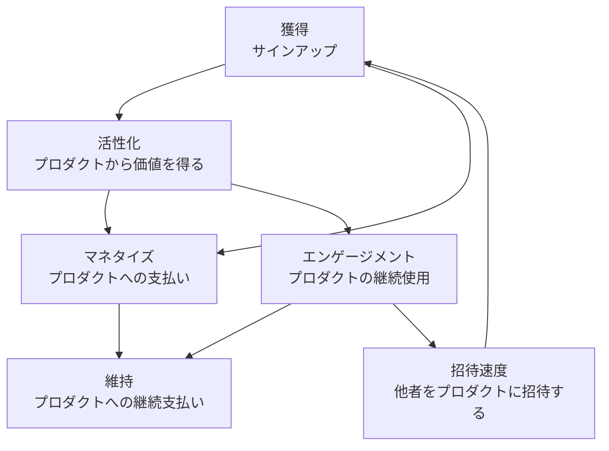

## ビジョン

私たちのビジョンは、獲得・活性化・維持・マネタイズを測定可能なセルフサービスループに結び付けるフルファネルの成長システムを実行することで、個人とチームが GitLab の持続的な価値を容易に発見・活性化・拡大できるようにすることです。

Growth のミッション、方向性、プロダクト戦略の詳細については、[Growth プロダクトハンドブック](/handbook/marketing/growth/) を参照してください。

## 作業方法

[バリュー](/handbook/values/) に沿って、[イテレーション](/handbook/values/#iteration) と [コラボレーション](/handbook/values/#collaboration) に焦点を当て、開発部門のカウンターパートが管理するプロダクトの領域と協力して取り組んでいます。

プロダクトチームが優先するIssueに取り組み、GitLab.com での [実験](/handbook/engineering/development/growth/experimentation/) も実行しています。Growth ステージのチームにはフルスタックエンジニアがいます。その理由は、Growth ステージはフロントエンドとバックエンドの両方のスキルセットを必要としますが、小規模なチームとして、チームメンバーの効率を最適化するためにフルスタックロールを採用しているからです。

## Growth リーダーシップとチーム

### リーダーシップ

| ロール | 人 |
|------|--------|
| プロダクトディレクター |  |
| エンジニアリングディレクター |  |
| エンジニアリングマネージャー |  |
| UX デザインマネージャー |  |

### プロダクトとデザイン

| ロール | 人 |
|------|--------|
| プロダクトマネージャー | , ,  |
| プロダクトデザイナー | ,  |

### チームとコミュニケーション

| チーム | Slack チャンネル | GitLab ハンドル |
|------|---------------|---------------|
| Growth（全体） | [#s_growth](https://gitlab.slack.com/channels/s_growth) | `@gitlab-org/growth` , `@gitlab-org/growth/engineers` |
| Acquisition | [#g_acquisition](https://gitlab.slack.com/channels/g_acquisition) | `@gitlab-org/growth/acquisition` |
| Activation | [#g_activation](https://gitlab.slack.com/channels/g_activation) | `@gitlab-org/growth/activation` |
| Engagement | [#g_engagement](https://gitlab.slack.com/channels/g_engagement) | `@gitlab-org/growth/engagement` |

### 全チームメンバー



## 共有プロセス

私たちのチームは共有プロセスとツールを使用してコラボレーションします:

- [オペレーティングモデル](operating_model_growth.md) - Growth のオペレーティングリズム
- [マイルストーン計画、精査、見積もり](initiative_refinement_estimation) - 継続的な精査プロセスと見積もりガイドライン
- [大規模イニシアチブのエンジニアリング DRI](engineering_dri) - 複雑なワークストリームとエピックの管理
- [モジュラーコードの指針](modular_code) - なぜ、どのようにデフォルトでモジュラーコードを書くのか
- [技術的探索ガイドライン](technical_spikes) - リサーチとスパイク作業のガイドライン
- [Growth 実験ガイドライン](experimentation) - Growth 実験のガイドライン

## 実験

Growth チームは GitLab [実験](/handbook/engineering/development/growth/experimentation/) に貢献し、GitLab.com で実験を実行してデータ主導のプロダクト意思決定を容易にしています。

## リソース

私たちがどのように、何を取り組んでいるかを確認するための有用なリンク:

- [Growth 方向性](/handbook/marketing/growth/)
- [Growth エピック Kanban ボード](https://gitlab.com/groups/gitlab-org/-/epic_boards/2079888)
- [開発用 Growth Issue Kanban ボード](https://gitlab.com/groups/gitlab-org/-/boards/1392106?&label_name%5B%5D=devops%3A%3Agrowth)
- [実験](experimentation/)
- [GLEX](https://gitlab.com/gitlab-org/ruby/gems/gitlab-experiment)
- [実験ロールアウト](https://gitlab.com/groups/gitlab-org/-/boards/1352542?label_name[]=experiment-rollout)

## チームデイ

時折、Growth のカウンターパートと楽しいソーシャルアクティビティに参加するためのバーチャルチームデイやミーティングを開催します。

- [FY23-Q2 2022](https://gitlab.com/gitlab-org/growth/team-tasks/-/issues/625)
- [2021 年 12 月](https://gitlab.com/gitlab-org/growth/team-tasks/-/issues/522)
- [2021 年 4 月](https://gitlab.com/gitlab-org/growth/product/-/issues/1675)
- [2020 年 9 月](https://gitlab.com/gitlab-org/growth/team-tasks/-/issues/175)
- [2020 年 5 月](https://gitlab.com/gitlab-org/growth/team-tasks/-/issues/119)

## 共通リンク

- [Growth ステージ](/handbook/engineering/development/growth/)
- [Growth ワークフローボード](https://gitlab.com/groups/gitlab-org/-/boards/4152639)
- [Slack](https://gitlab.slack.com/archives/s_growth) の `#s_growth`（GitLab 内部）
- [Growth の機会](https://gitlab.com/gitlab-org/growth/product/-/issues)
- [Growth ミーティングとアジェンダ](https://drive.google.com/drive/search?q=type:document%20title:%22Growth%20Weekly%22)（GitLab 内部）
- [GitLab バリュー](/handbook/values/)

## CustomersDot トライアルコラボレーション

CustomersDot トライアル作業における Fulfillment/Provision チームとのコラボレーションの詳細については、[CustomersDot トライアルコラボレーションフレームワーク](customersdot-collaboration.md) を参照してください。このフレームワークは、Growth が独立して貢献する場合と Provision チームを関与させる場合を定義し、優先度の競合に対するエスカレーションパスも定めています。
