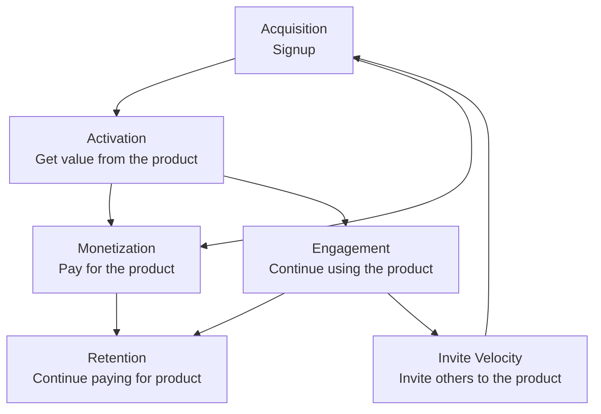

## ビジョン

私たちのビジョンは、獲得・活性化・維持・マネタイズを測定可能なセルフサービスのループに結び付けるフルファネルの成長システムを実行することで、個人とチームが GitLab の持続的な価値を容易に発見・活性化・拡大できるようにすることです。

Growth のミッション、方向性、プロダクト戦略の詳細については、[Growth プロダクトハンドブック](/handbook/marketing/growth/)を参照してください。

## 私たちの働き方

私たちは [バリュー](/handbook/values/) に沿って働き、[イテレーション](/handbook/values/#iteration) と [コラボレーション](/handbook/values/#collaboration) に重点を置き、開発部門のカウンターパートが保守するプロダクト領域と連携しながら、またそれらの領域をまたいで作業します。

私たちは、GitLab.com 上での [実験](/handbook/engineering/development/growth/experimentation/) の実施を含め、プロダクトチームが優先順位付けした Issue に取り組んでいます。Growth ステージのチームには Fullstack Engineer が在籍しています。その理由は、Growth ステージにはフロントエンドとバックエンドの両方のスキルセットが必要である一方、小規模なチームとしてチームメンバーの効率性を最適化するために Fullstack の役割を採用したことにあります。

## Growth のリーダーシップとチーム

### リーダーシップ

| Role | Person |
|------|--------|
| Product Director |  |
| Engineering Director |  |
| Engineering Manager |  |
| UX Design Manager |  |

### プロダクトとデザイン

| Role | Person |
|------|--------|
| Product Managers | , ,  |
| Product Designers | ,  |

### チームとコミュニケーション

| Team | Slack Channel | GitLab Handle |
|------|---------------|---------------|
| Growth (All) | [#s_growth](https://gitlab.slack.com/channels/s_growth) | `@gitlab-org/growth` , `@gitlab-org/growth/engineers` |
| Acquisition | [#g_acquisition](https://gitlab.slack.com/channels/g_acquisition) | `@gitlab-org/growth/acquisition` |
| Activation | [#g_activation](https://gitlab.slack.com/channels/g_activation) | `@gitlab-org/growth/activation` |
| Engagement | [#g_engagement](https://gitlab.slack.com/channels/g_engagement) | `@gitlab-org/growth/engagement` |

### すべてのチームメンバー



## 共有プロセス

私たちのチームは、共有のプロセスとツールを使って協働しています。

- [Operating Model](operating_model_growth.md) - Growth のオペレーティングリズム
- [Milestone Planning, Refinement and Estimation](initiative_refinement_estimation) - 継続的なリファインメントプロセスと見積もりのガイドライン
- [Engineering DRI for Large-Scale Initiatives](engineering_dri) - 複雑なワークストリームとエピックの管理
- [Modular Code Guiding Principle](modular_code) - 私たちがデフォルトでモジュラーなコードを書く理由と方法
- [Technical Exploration Guidelines](technical_spikes) - 調査とスパイク作業のためのガイドライン
- [Growth Experimentation Guidelines](experimentation) - Growth の実験のためのガイドライン

## 実験

Growth チームは、GitLab.com 上で実験をより簡単に実施し、データに基づくプロダクト判断を行えるようにするため、GitLab の [実験](/handbook/engineering/development/growth/experimentation/) に貢献しています。

## リソース

私たちがどのように、何に取り組んでいるかを確認するための便利なリンクをいくつか紹介します。

- [Growth direction](/handbook/marketing/growth/)
- [Growth Epic Kanban board](https://gitlab.com/groups/gitlab-org/-/epic_boards/2079888)
- [Growth Issue Kanban board for development](https://gitlab.com/groups/gitlab-org/-/boards/1392106?&label_name%5B%5D=devops%3A%3Agrowth)
- [Experimentation](experimentation/)
- [GLEX](https://gitlab.com/gitlab-org/ruby/gems/gitlab-experiment)
- [Experiment rollout](https://gitlab.com/groups/gitlab-org/-/boards/1352542?label_name[]=experiment-rollout)

## チームデー

私たちは時折、仮想チームデーやミーティングを開催し、休憩を取りながら Growth のカウンターパートと楽しく社交的なアクティビティに参加しています。

- [FY23-Q2 2022](https://gitlab.com/gitlab-org/growth/team-tasks/-/issues/625)
- [December 2021](https://gitlab.com/gitlab-org/growth/team-tasks/-/issues/522)
- [April 2021](https://gitlab.com/gitlab-org/growth/product/-/issues/1675)
- [September 2020](https://gitlab.com/gitlab-org/growth/team-tasks/-/issues/175)
- [May 2020](https://gitlab.com/gitlab-org/growth/team-tasks/-/issues/119)

## よく使うリンク

- [Growth stage](/handbook/engineering/development/growth/)
- [Growth workflow board](https://gitlab.com/groups/gitlab-org/-/boards/4152639)
- [Slack](https://gitlab.slack.com/archives/s_growth) の `#s_growth`（GitLab 社内）
- [Growth opportunities](https://gitlab.com/gitlab-org/growth/product/-/issues)
- [Growth meetings and agendas](https://drive.google.com/drive/search?q=type:document%20title:%22Growth%20Weekly%22)（GitLab 社内）
- [GitLab values](/handbook/values/)

## CustomersDot Trials のコラボレーション

CustomersDot トライアル作業における Fulfillment/Provision チームとのコラボレーションに関する情報は、[CustomersDot Trials Collaboration Framework](customersdot-collaboration.md) を参照してください。このフレームワークは、Growth が独立して貢献する場合と Provision チームを巻き込む場合の区別、および優先順位の対立時のエスカレーション経路を定義しています。
