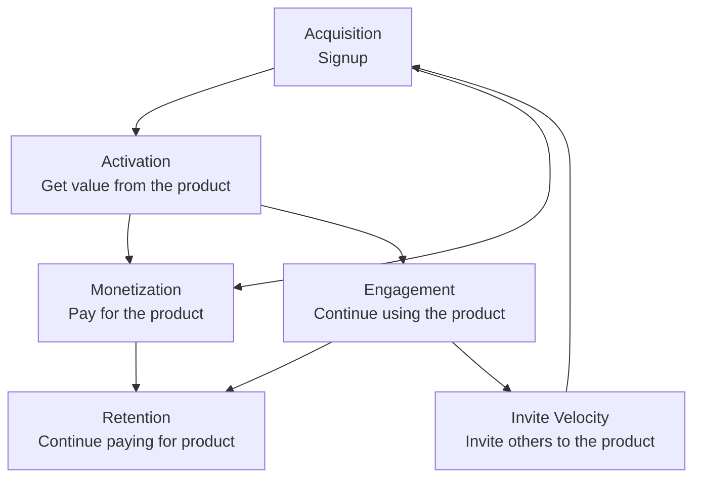

## ビジョン {#vision}

私たちのビジョンは、獲得・活性化・維持・マネタイズを測定可能なセルフサービスループに結び付けるフルファネルの成長システムを実行することで、個人とチームが GitLab の持続的な価値を容易に発見・活性化・拡大できるようにすることです。

```mermaid
flowchart TD
    ACQ["Acquisition\nSignup"]
    ACT["Activation\nGet value from the product"]
    MON["Monetization\nPay for the product"]
    ENG["Engagement\nContinue using the product"]
    RET["Retention\nContinue paying for product"]
    INV["Invite Velocity\nInvite others to the product"]

    ACQ --> ACT
    ACT --> MON
    ACT --> ENG
    ENG --> RET
    ENG --> INV
    MON --> RET
    INV --> ACQ
    ACQ --> MON
```

Growth のミッション、方向性、プロダクト戦略の詳細については、[Growth プロダクトハンドブック](/handbook/marketing/growth-marketing/) を参照してください。

## 作業方法 {#how-we-work}

[バリュー](/handbook/values/) に沿って、[イテレーション](/handbook/values/#iteration) と [コラボレーション](/handbook/values/#collaboration) に焦点を当て、開発部門のカウンターパートが管理するプロダクトの領域と協力して取り組んでいます。

プロダクトチームが優先する Issue に取り組み、GitLab.com での [実験](/handbook/engineering/development/growth/experimentation/) も実行しています。Growth ステージのチームにはフルスタックエンジニアがいます。その理由は、Growth ステージはフロントエンドとバックエンドの両方のスキルセットを必要としますが、小規模なチームとして、チームメンバーの効率を最適化するためにフルスタックロールを採用しているからです。

## Growth リーダーシップとチーム {#growth-leadership--teams}

### リーダーシップ {#leadership}

| ロール | 人 |
|------|--------|
| Product Director |  |
| Engineering Director |  |
| Engineering Manager |  |
| Senior Staff Fullstack Engineer |  |
| UX Design Manager |  |

### プロダクトとデザイン {#product--design}

| ロール | 人 |
|------|--------|
| Product Managers |  |
| Product Designers | ,  |

### チームとコミュニケーション {#teams--communication}

Growth のすべてのチームは、1 つの Slack チャンネル [#s_growth](https://gitlab.slack.com/channels/s_growth) を共有しています。

| チーム | GitLab ハンドル |
|------|---------------|
| Growth（全体） | `@gitlab-org/growth` , `@gitlab-org/growth/engineers` |
| Acquisition | `@gitlab-org/growth/acquisition` |
| Activation | `@gitlab-org/growth/activation` |
| Engagement | `@gitlab-org/growth/engagement` |

### 全チームメンバー {#all-team-members}



## 共有プロセス {#shared-processes}

私たちのチームは共有プロセスとツールを使用してコラボレーションします:

- [オペレーティングモデル](operating_model_growth.md) - Growth のオペレーティングリズム
- [マイルストーン計画、精査、見積もり](initiative_refinement_estimation) - 継続的な精査プロセスと見積もりガイドライン
- [大規模イニシアチブのエンジニアリング DRI](engineering_dri) - 複雑なワークストリームとエピックの管理
- [モジュラーコードの指針](modular_code) - なぜ、どのようにデフォルトでモジュラーコードを書くのか
- [技術的探索ガイドライン](technical_spikes) - リサーチとスパイク作業のガイドライン
- [Growth 実験ガイドライン](experimentation) - Growth 実験のガイドライン

## 実験 {#experimentation}

Growth チームは GitLab [実験](/handbook/engineering/development/growth/experimentation/) に貢献し、GitLab.com で実験を実行してデータ主導のプロダクト意思決定を容易にしています。

## リソース {#resources}

私たちがどのように、何を取り組んでいるかを確認するための有用なリンク:

- [Growth 方向性](/handbook/marketing/growth-marketing/)
- [Growth エピック Kanban ボード](https://gitlab.com/groups/gitlab-org/-/epic_boards/2079888)
- [開発用 Growth Issue Kanban ボード](https://gitlab.com/groups/gitlab-org/-/boards/1392106?&label_name%5B%5D=devops%3A%3Agrowth)
- [実験](experimentation/)
- [GLEX](https://gitlab.com/gitlab-org/ruby/gems/gitlab-experiment)
- [実験ロールアウト](https://gitlab.com/groups/gitlab-org/-/boards/1352542?label_name[]=experiment-rollout)

### チームのボード {#team-boards}

現在の作業は、以下のボードで追跡しています:

- [Driving First Orders エピックボード](https://gitlab.com/groups/gitlab-org/-/epic_boards/2079888?label_name[]=Growth%3A%20Driving%20First%20Orders&label_name[]=Next%20Up&label_name[]=section%3A%3Agrowth) - 次に取り組む Driving First Orders のエピック
- [機能開発ボード](https://gitlab.com/groups/gitlab-org/-/boards/11511990?not[label_name][]=Category%3AEngineering%20Excellence&not[label_name][]=type%3A%3Amaintenance&label_name[]=section%3A%3Agrowth&label_name[]=Growth%3A%20Driving%20First%20Orders&milestone_title=Started) - 現在のマイルストーンにおける Driving First Orders の機能開発
- [優先バグボード](https://gitlab.com/groups/gitlab-org/-/boards/11512116?milestone_title=Started&label_name[]=section%3A%3Agrowth&label_name[]=type%3A%3Abug) - 現在のマイルストーンのバグ
- [技術的負債ボード](https://gitlab.com/groups/gitlab-org/-/boards/11512114?not[label_name][]=Category%3AEngineering%20Excellence&not[label_name][]=Engineering%20Time&label_name[]=section%3A%3Agrowth&label_name[]=type%3A%3Amaintenance&milestone_title=Started) - 現在のマイルストーンのメンテナンス作業
- [Engineering Excellence ボード](https://gitlab.com/groups/gitlab-org/-/boards/11512115?milestone_title=Started&label_name[]=section%3A%3Agrowth&label_name[]=Engineering%20Time&label_name[]=Category%3AEngineering%20Excellence) - 現在のマイルストーンの Engineering Time と Engineering Excellence の作業

## チームデイ {#team-days}

時折、Growth のカウンターパートと楽しいソーシャルアクティビティに参加するためのバーチャルチームデイやミーティングを開催します。

- [FY23-Q2 2022](https://gitlab.com/gitlab-org/growth/team-tasks/-/issues/625)
- [2021 年 12 月](https://gitlab.com/gitlab-org/growth/team-tasks/-/issues/522)
- [2021 年 4 月](https://gitlab.com/gitlab-org/growth/product/-/issues/1675)
- [2020 年 9 月](https://gitlab.com/gitlab-org/growth/team-tasks/-/issues/175)
- [2020 年 5 月](https://gitlab.com/gitlab-org/growth/team-tasks/-/issues/119)

## 共通リンク {#common-links}

- [Growth ステージ](/handbook/engineering/development/growth/)
- [Growth ワークフローボード](https://gitlab.com/groups/gitlab-org/-/boards/4152639)
- [Slack](https://gitlab.slack.com/archives/s_growth) の `#s_growth`（GitLab 内部）
- [Growth の機会](https://gitlab.com/gitlab-org/growth/product/-/issues)
- [Growth ミーティングとアジェンダ](https://drive.google.com/drive/search?q=type:document%20title:%22Growth%20Weekly%22)（GitLab 内部）
- [GitLab バリュー](/handbook/values/)

## CustomersDot トライアルコラボレーション {#customersdot-trials-collaboration}

トライアルのオーナーシップ、およびトライアル作業における Fulfillment/Monetization チームとのコラボレーションの詳細については、[トライアルのオーナーシップとコラボレーションフレームワーク](trials-ownership.md)を参照してください。このフレームワークでは、Growth がトライアルのエントリーポイントを所有し、Fulfillment/Monetization がより深いトライアルコードベースと CustomersDot のすべてのサポートを所有するという概念的なオーナーシップモデルに加え、意思決定フレームワークと優先度の競合に対するエスカレーションパスを定めています。
