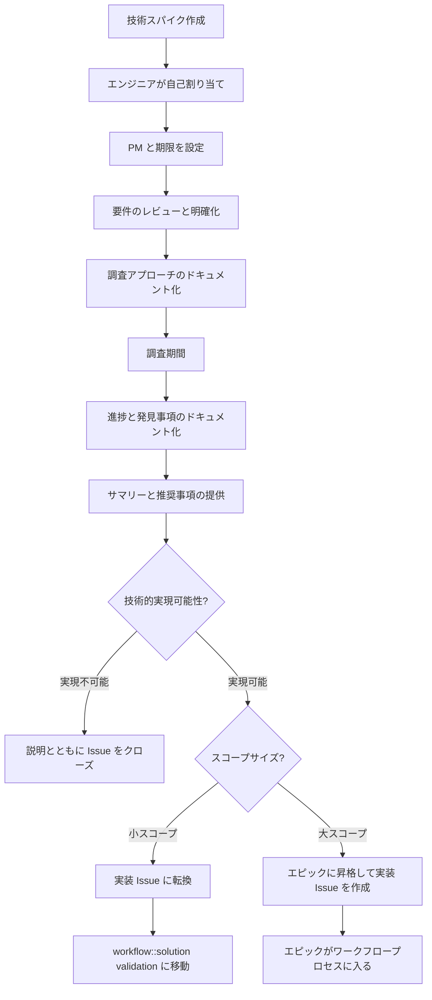

## 技術的探求（「スパイク」）ガイドライン

チームは時として、Growth PM が優先事項とみなす問題や機会領域に対する技術的ソリューションを探求（「スパイク」）することに時間を割くよう求められることがあります。技術スパイクは、結果がコードではなく技術的方向またはソリューションに関する推奨事項であることが多いため、通常の業務項目とは根本的に異なります。しかし、専任の開発者フォーカスが必要であり、開発ワークフローで考慮すべきです。そのため、Growth エンジニア個人がワークフローで技術スパイクに対処する際に従うべき以下のガイドラインと責任を定めています。

注意: 技術スパイクは実装の唯一の情報源として機能し、3 つの成果のうちの 1 つを持ちます: 開発実装 Issue への転換、追加の実装 Issue を含むエピックへの昇格、または技術的に実現不可能と判断された場合のクローズ。

**インプット**

技術スパイクが `~workflow::ready for development` で優先順位付けされて引き取り可能になったら、以下のステップを実行します:

- 自己割り当てし、~spike ラベルを適用し、マイルストーンを設定し、ワークフローラベルを `~workflow::in dev` に設定します
- 技術スパイクの合理的な期限について調整するために、担当 PM と連携し、それに応じて割り当てます。期間は対象となるテーマと Growth のそのトピックへの親しみによって異なります。
- 技術スパイク Issue 本文の内容をレビューします。担当 PM との未解決の質問を明確にするためのコメントを追加します。クロスチーム協業、対象領域の専門知識、または技術スパイクへのその他の重要なインプットの潜在的ニーズを特定します。
- 提案するアプローチと望まれる PM チェックポイントを追加します。

**技術スパイク調査期間中**

- 非同期コラボレーションモデルをサポートし、インクルーシブな環境を維持するために、詳細なメモで進捗をドキュメント化します。
- スパイクの期間またはスコープに影響する可能性のある発見を担当 PM と共有します。
- 期限が近づいてさらに時間が必要な場合は、担当 PM と積極的に次のステップをディスカッションします。

**アウトプット**

技術スパイクの業務が完了に近づいたら、スパイクプロセスを締めくくるために以下のステップを実行します:

- スパイク Issue で調査の詳細な学びと次のフェーズで作成される推奨される次のステップの Issue やエピックのアウトラインを含む、ソリューションの推奨パスを記載したサマリーコメントを提供します。
- 担当 PM、EM、Growth エンジニアリングチーム（`@gitlab-org/growth/engineering` チーム）にレビューのためタグ付けします。
- スパイクの要件が割り当てられた期間内に満たされたことを担当 PM と確認します。

発見事項に基づいて、3 つの成果のうちの 1 つに進みます:

1. **技術的に実現不可能なソリューションの場合:** 発見された技術的制限の明確な説明とともに Issue をクローズします。

2. **単一 Issue 実装の場合:** 現在の Issue の技術的詳細を改善し、PM のガイダンスのために `~workflow::solution validation` に戻します。

3. **複数 Issue 実装の場合:** スパイクをエピックに昇格させ、業務を分解するために必要な実装 Issue を作成します。スパイクを実施したエンジニアとして、これらの実装 Issue を作成する責任があります。

成果 2 と 3 については、後の `workflow` ステージに再入力した際に実装をサポートするのに十分な技術的詳細がドキュメント化されていることを確認します。
