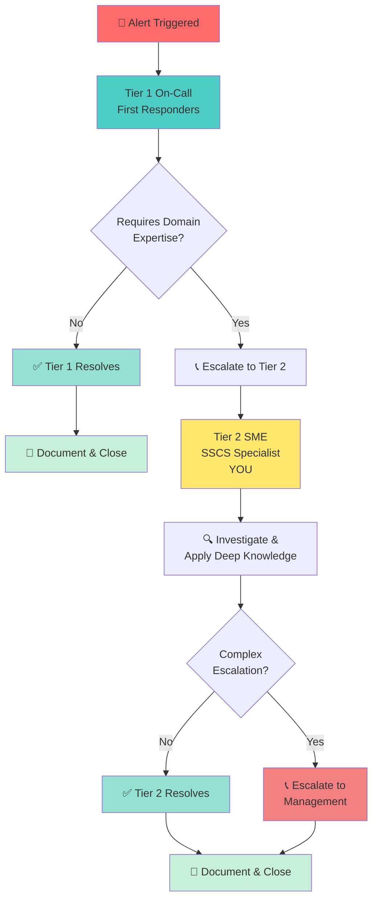

## Tier 2 オンコールとは何か？

インシデント対応を病院のトリアージシステムのように考えてみてください：

Tier 1 はファーストレスポンダーであり、すべてのシステムのすべてのアラートに対応します。実際に何が壊れているか、どの程度深刻かを判断します。

Tier 2（SME スペシャリスト）は、問題が特定のドメインやサービスの深い知識を必要とするときに呼び出される専門家です。あなたは特定のシステムのコード、アーキテクチャ、特性を内側から知っています。

Tier 1 があなたのドメイン（認証、認可、またはパイプラインセキュリティ）で複雑なものに遭遇したとき、Tier 1 はあなたにエスカレーションします。あなたは Tier 1 から信頼され、修正を任されるスペシャリストです。

## これは私たちの組織にどのように位置づけられますか？

私たちのインシデント対応には複数のレイヤーがあり、適切な問題を適切なタイミングで適切な人が対処できるようにします：

## Tier 2 オンコールは実際に何を伴いますか？

オンコール中、あなたはシフト中（タイムゾーンに合わせた 8 時間ブロック）に連絡可能でいること、重大な問題の呼び出し通知を受けたときに 15 分以内に応答すること、ドメイン（認証、認可、またはパイプラインセキュリティ）の問題を調査・解決すること、インシデント中の進捗と次のステップを伝えること、他の人が学べるよう何が起きたかを文書化すること、シフト終了時に次のオンコールエンジニアに引き継ぐことが求められます。

すべてを知ることや、すべての問題を即座に修正することは期待されていません。対応可能で、関与し、問題が発生したときに深く掘り下げる意欲を持つことが期待されています。認証のエンジニアがすべてのパイプラインセキュリティの問題を完全にデバッグ・調査できないことは十分ありえます。それは完全に許容されます。ベストを尽くし、そのチームの Slack に連絡するかセカンダリレイヤーにエスカレーションして、そのチームのメンバーを見つけてもらいます。

## なぜ Tier 2 オンコールがあるのか？

このプログラムは、ドメイン固有のセキュリティ問題に対応できる専門家を配備することでプラットフォームを安定させるために存在します。また、すべての問題で全員が呼び出されないよう負荷をバランスさせ、本番の問題の所有権と経験を与えることでエンジニアを育成し、何が壊れてどう修正するかを文書化することで組織の知識を構築するためのものでもあります。

## 誰が関与していますか？

Tier 2 オンコールプログラムには、認証、認可、パイプラインセキュリティをカバーする Tier 2 エンジニアとしてのあなたとチームメイト、スケジュールとエスカレーションパスを管理するローテーションリーダー、あなたを呼び出すファーストレスポンダーとしての Tier 1 オンコール、複雑なインシデント中に調整する IMOC、サポートを提供しエスカレーションを処理するマネジメントが関与しています。

### 関連ページ

- [初めてのシフト](/handbook/engineering/development/sec/oncall/your-first-shift) — 最初のオンコールローテーションの準備をする
- [コミュニケーションと文化](/handbook/engineering/development/sec/oncall/communication-and-culture) — インシデント中のコミュニケーション方法を学ぶ
- [オンコールのプロセスとポリシー](/handbook/engineering/infrastructure-platforms/incident-management/on-call/) — Tier 2 固有の責任について学ぶ
