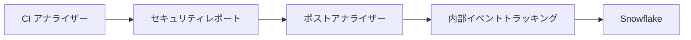

オブザーバビリティメトリクスは、CI ベースのセキュリティアナライザーが本番環境でどのように動作するかを把握するのに役立ちます。
スキャン時間、終了コード、検出件数などのメトリクスは、セキュリティレポートアーティファクトを通じて
GitLab の内部イベントトラッキングシステムに流れていきます。

実装例については、
[Secret Detection メトリクス](/handbook/engineering/development/sec/secure/secret-detection/metrics/#ci-based-analyzer-observability-metrics)を参照してください。

## アーキテクチャ

1. CI アナライザーはスキャン中にメトリクスを収集し、セキュリティレポートアーティファクトに書き込みます。
1. ポストアナライザーはレポートを処理し、オブザーバビリティイベントを抽出します。
1. 許可されたイベントは内部イベントトラッキングシステムに送信されます。
1. イベントは分析とダッシュボードのために Snowflake に保存されます。

## 設計の考慮事項

オブザーバビリティシステムは分散イベントパターンを使用しています。各アナライザーは共有レジストリを使用するのではなく、独自のイベント構造を定義します。

この設計は以下を提供します:

- **独立した開発**: リポジトリ間のリリース調整なしにメトリクスを追加または変更できます。
- **バージョン耐性**: 古いポストアナライザーは未知のイベントを失敗なく適切にスキップします。
- **高速なイテレーション**: インフラの更新なしにローカルで新しいメトリクスをテストできます。
- **分散所有権**: 各アナライザーチームが独自のイベント定義を所有します。

トレードオフとして:

- すべての可能なイベントをリストする単一の場所がありません。正しい情報源として、モノリスの
  [`config/events/`](https://gitlab.com/gitlab-org/gitlab/-/tree/v18.6.4-ee/config/events) または
  [`ee/config/events/`](https://gitlab.com/gitlab-org/gitlab/-/tree/v18.6.4-ee/ee/config/events)
  のイベント定義を使用してください。
- 新しいイベントはポストアナライザーとバックエンドが更新されるまで処理されません。

## 前提条件

オブザーバビリティ機能には以下が必要です:

- [Report](https://gitlab.com/gitlab-org/security-products/analyzers/report) パッケージ v7 以降
- [Command](https://gitlab.com/gitlab-org/security-products/analyzers/command) パッケージ v5 以降

## イベント設計のガイダンス

- 多くの追加プロパティを使用するのではなく、複数のイベントを作成します。追加プロパティを持つ JSON カラムはクエリが遅くなります。
- 関連イベントを結合するには、カラム値（例: `property`）に UUID を含めます。
- 可変フィールドを追加する前に、正しく処理されることを確認するために
  [integration-test](https://gitlab.com/gitlab-org/security-products/tests/integration-test)
  プロジェクトのメンテナーに確認してください。

## 内部イベントの登録

イベントには GitLab モノリスでの対応する定義が必要で、バックエンドの許可リストに追加する必要があります。許可されたイベントのみが処理されます。

1. `config/events/` または `ee/config/events/` にイベント定義を作成します。
1. [ProcessScanEventsService](https://gitlab.com/gitlab-org/gitlab/-/blob/master/ee/app/services/security/process_scan_events_service.rb#L9) の許可リストを更新します。
1. アナライザーからの実際のレポート出力を使用した rspec テストを追加します。

詳細については、
[内部イベントトラッキングのクイックスタート](https://docs.gitlab.com/ee/development/internal_analytics/internal_event_instrumentation/quick_start.html)を参照してください。

## バリデーション

デプロイ後:

1. Snowflake でクエリを実行してイベントが正しく収集されていることを確認します。
1. レポート処理中の例外を Sentry で確認します。
1. Analytics Instrumentation チームにダッシュボードの作成を依頼します。
