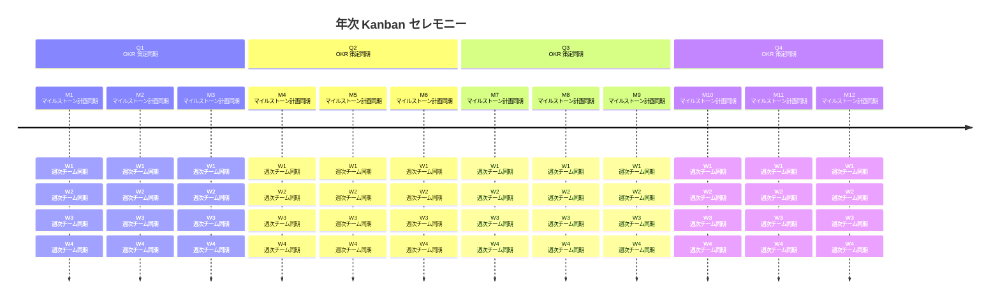
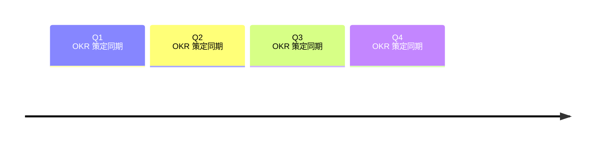
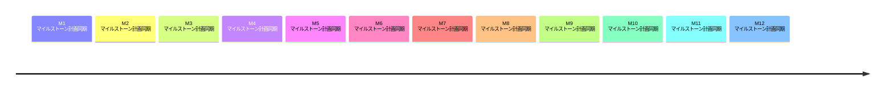

## Dynamic Analysis

GitLab の Dynamic Analysis グループは、[Dynamic Analysis Software Testing（DAST）](https://about.gitlab.com/direction/application_security_testing/dynamic-analysis/dast/)とファジングを行うソリューションの開発を担当しています。私たちの作業はオープンソースとクローズドソースのコードの組み合わせです。

### ミッション

高い使いやすさと高品質のツールを開発することで、より安全なソフトウェアを構築する顧客の成功を支援して GitLab の成功をサポートします。GitLab の Dynamic Analysis グループは、API Security テスト、Dynamic Analysis Software Testing（DAST）、ファジングを行うソリューションの開発を担当しています。

### トップ優先事項（FY25）

**テーマ: 採用の増加**

- **DAST の統合** - プロキシベースの DAST を削除し、アクティブチェックの追加とパフォーマンスの改善によってブラウザベースの DAST を成熟させることで、混乱を軽減します

- **API Discovery** - API Discovery はアプリケーションを分析して、Web API の期待される動作を記述した OpenAPI ドキュメントを生成します。このスキーマドキュメントは、API Security テスト（以前は DAST API と呼ばれていた）によってセキュリティスキャンを実行するために使用されます。これを自動化することで、ドキュメント化されておらず現在テストされていない Web API を含むアプリケーションを持つ顧客のギャップを埋めます。

- **API Security チェックのリフレッシュ** - API Security テストのチェック（ルール）を包括的にレビューおよび更新します。OWASP API Security Top 10:2023 と OWASP Top 10:2021（Web アプリケーション）の両方に対応することで、顧客は重要なリスクを検出する私たちの能力に自信を持てます。

- **DAST パフォーマンス** - セキュリティカバレッジを低下させることなく DAST スキャン時間を短縮するために、類似ページのスキャンを重複排除します。長いスキャン時間は、顧客が DAST スキャンを DevSecOps プロセスに組み込むことを思いとどまらせる大きな障壁です。

### 私たちが推進している顧客成果

Dynamic Analysis チームは API Security、DAST、ファジングカテゴリの機能を構築しています。これらの機能により、Ultimate 顧客は Web アプリケーションと API のセキュリティテストを開発ライフサイクルの早期に組み込むことができます。SDLC の早期に脆弱性を特定することで、顧客は Web アプリや API のセキュリティリスクをより効率的に削減できます。

私たちの機能は GitLab の他のセキュリティアナライザーとは異なる方法で脆弱性を特定するため、各ツールは SAST、SCA（依存関係スキャン）、Secret Detection などの他のセキュリティアナライザーと組み合わせて使用し、完全なカバレッジを提供する必要があります。

API Security、DAST、ファジングは Ultimate 機能です。これらの機能の採用を増やすことで、顧客の維持率の向上と GitLab Ultimate の収益増加に貢献します。

### 重要な DAST リポジトリ

| リポジトリ | 目的 |
| ---- | ------- |
| [DAST](https://gitlab.com/gitlab-org/security-products/dast) | Docker イメージとしてデプロイされる DAST アナライザー。 |
| [Browserker](https://gitlab.com/gitlab-org/security-products/analyzers/browserker) | プライベート - GitLab のブラウザベース DAST アナライザー。 |
| [DAST CWE チェック](https://gitlab.com/gitlab-org/security-products/dast-cwe-checks) | プライベート - DAST ブラウザベースアナライザーの脆弱性定義。 |
| [DAST Chromium](https://gitlab.com/gitlab-org/security-products/dast-chromium) | プライベート - DAST ブラウザベースアナライザーの依存関係（Chromium ブラウザなど）。 |

### 重要なファジングリポジトリ

| リポジトリ | 目的 |
| ---- | ------- |
| [API Security](https://gitlab.com/gitlab-org/security-products/analyzers/api-fuzzing-src) | プライベート - API Security ツールは API ファジングと API DAST スキャンを実行します。 |
| [GitLab Protocol Fuzzer（CE）](https://gitlab.com/gitlab-org/security-products/protocol-fuzzer-ce) | GitLab のプロトコルファザー（コミュニティエディション）、以前は Peach Protocol Fuzzer。 |
| [GitLab Protocol Fuzzer（EE）](https://gitlab.com/gitlab-org/security-products/protocol-fuzzer-ee) | プライベート - GitLab のプロトコルファザー（エンタープライズエディション）、以前は Peach Protocol Fuzzer、ライセンスコンポーネントを含む。 |
| [API Fuzzing E2E Tests](https://gitlab.com/gitlab-org/security-products/tests/api-fuzzing-e2e) | プライベート - API エンドツーエンドテスト。 |
| [GitLab Cov Fuzz](https://gitlab.com/gitlab-org/security-products/analyzers/gitlab-cov-fuzz-src) | プライベート - GitLab のカバレッジファジングオーケストレーション。ファジングエンジン/結果を GitLab CI と GitLab セキュリティダッシュボードと統合します。 |
| [HAR レコーダー](https://gitlab.com/gitlab-org/security-products/har-recorder) | Web トラフィックに基づいて HAR ファイルを記録するユーティリティ。 |

#### オープンソースファザー

| リポジトリ | 目的 |
| ---- | ------- |
| [JSfuzz](https://gitlab.com/gitlab-org/security-products/demos/coverage-fuzzing) | JavaScript ファザー。 |
| [Pythonfuzz](https://gitlab.com/gitlab-org/security-products/demos/coverage-fuzzing) | Python ファザー。 |
| [Javafuzz](https://gitlab.com/gitlab-org/security-products/demos/coverage-fuzzing) | Java ファザー。 |
| [Coverage Fuzzing サンプル](https://gitlab.com/gitlab-org/security-products/demos/coverage-fuzzing) | 7 以上の言語/ファザーでのカバレッジファジングサンプル。 |

## 連絡方法

- Slack チャンネル: #g_ast-dynamic-analysis, #f_ast-api-security, #f_ast-fuzz-testing
- Slack エイリアス: @secure_dynamic_analysis_be
- Google グループ: dynamic-analysis-be@gitlab.com
- GitLab メンション: @gitlab-org/secure/dynamic-analysis-be

### サポートリクエスト

Dynamic Analysis エンジニアリングチームは、[Sec Section サポートプロジェクトに概説されているプロセス](https://gitlab.com/gitlab-com/sec-sub-department/section-sec-request-for-help/)に従って GitLab サポートエンジニアにサポートを提供します。

### その他の連絡先

DAST チームは #s_application-security-testing と #sec-section も監視しています。これらのチャンネルはより広い AST トピック向けですが、AST のどのグループに連絡すべきかわからない場合の良い出発点です。

## 働き方



Dynamic Analysis グループは Kanban 原則に従って作業しており、OKR 策定のための四半期、リリース計画のための月次、エピックと Issue の対応・トリアージ・リファインメント・障害解決のための週次のセレモニーが追加されています。チームがこれらのケイデンスでそれぞれ運営・思考することで、高レベルの階層的目標を効果的に設定し、プロダクトの優先事項が計画され、エピックと Issue の作業が停滞したり見落とされたりすることを防ぐことができます。

### Hallway Monitor Bot

すべての四半期、月次、週次の Kanban セレモニーにおいて、[Hallway Monitor Bot](https://gitlab.com/gitlab-org/secure/tools/gitlab-bot-hall-monitor) が私たちの道しるべとなり、チームがすべてのケイデンスで熟考・計画できるようにし、将来の作業を事前に把握できるようにします。このボットは四半期の OKR レビューミーティングをスケジュールし、月次のリリース計画とレトロミーティングをスケジュールし、最新のチームメンバーが一時的なリアクションローテーションの役割に割り当てられると週次同期ガイドを更新します。ビジネスプロセスをできる限り自動化するよう努め、Hallway Monitor Bot の[設定](https://gitlab.com/gitlab-org/secure/tools/gitlab-bot-hall-monitor/-/blob/main/deploy/gitlab-bot-hall-monitor.yaml?ref_type=heads)と[テンプレート](https://gitlab.com/gitlab-org/secure/tools/gitlab-bot-hall-monitor/-/tree/main/deploy/templates?ref_type=heads)で多くの自動化アイデアを実現できます。チームをできる限り効率的に保つためにボットへの貢献をお願いします。

### 四半期 OKR 策定



会計四半期終了の 4 週間前に、ボットがグループの OKR 計画 Issue を自動的に作成してカレンダーイベントをスケジュールします。

グループは次の四半期の 2 週間前に集まり、[チームが最終的に責任を持つすべての OKR](https://gitlab.com/gitlab-com/gitlab-OKRs/-/issues/?sort=created_date&state=opened&label_name%5B%5D=group%3A%3Adynamic%20analysis&first_page_size=20)を作成・レビューします。これには、ステージ以上のすべての先行 OKR のレビュー、追加の詳細を含む新規または既存の OKR の作成・更新、各 OKR への DRI の割り当てが含まれます。

#### 重要なリンク

- [チームの目標とキーリザルト一覧](https://gitlab.com/gitlab-com/gitlab-OKRs/-/issues/?sort=created_date&state=opened&label_name%5B%5D=group%3A%3Adynamic%20analysis&first_page_size=20)
- ステージの目標とキーリザルト一覧（近日公開）
- CEO の目標とキーリザルト一覧（近日公開）

#### 四半期の成果物

- DRI が割り当てられたグループの洗練された OKR
  - 関連するエピックや Issue へのリンク

<span id="milestone-release-planning"></span>

### マイルストーンリリース計画



リリースマイルストーンが開始される 2 週間前に、[Hallway Monitor Bot](#hallway-monitor-bot) がグループの月次リリース計画 Issue を自動的に作成してカレンダーイベントをスケジュールします。この Issue はマイルストーンの Kanban バックログとして機能し、PM の優先事項を EM およびすべての IC と調整します。Issue は 3 つのセクションに分かれています:

- **リリースする作業** - このマイルストーン中にリリースすることをコミットしているすべての作業
- **開始/継続する作業** - 新しく持ち込まれる作業または前のマイルストーンから繰り越される既存の作業
- **ブループリントを作成する作業** - 次のマイルストーンの開発作業の前に、このマイルストーンで高レベルの計画と分解が必要な作業

リリースマイルストーンのキックオフ日に、プロダクトと一緒に [Dynamic Analysis グループの方向性の優先事項](https://about.gitlab.com/direction/application_security_testing/dynamic-analysis/#priorities)のリストをレビューし、現在のマイルストーンのすべての優先事項が月次リリース計画 Issue の「リリースする作業」と「開始/継続する作業」のセクションに反映されていることを確認します。PM が次のマイルストーンのために特定した中〜大規模の作業は、次のマイルストーンでピックアップするための「ブループリントを作成する作業」セクションに追加して、高レベルのブループリントと作業の分解を行います。

プロダクトはすべての高レベルの優先事項を設定し、上記に加えて、このキックオフミーティングからのもう一つの成果は、各優先事項をグループの Issue/エピックと/または目標とするマイルストーンにマッピングした更新された方向性ページへの MR になる場合があります。このプロセスにより、EM と IC は PM に対して作業の整理方法と将来のロードマップ項目に対応できると考えるマイルストーンについての直接的なフィードバックを与えることができます。

すべてのプロダクト優先度ベースの Issue は、[Dynamic Analysis グループの全 Issue の包括的なリスト](https://gitlab.com/groups/gitlab-org/-/issues/?sort=created_date&state=opened&label_name%5B%5D=group%3A%3Adynamic%20analysis&label_name%5B%5D=Category%3ADAST&first_page_size=20)とともに存在します。すべてのプロダクト優先度ベースのエピックは、[Dynamic Analysis グループの全エピックの包括的なリスト](https://gitlab.com/groups/gitlab-org/-/epics?state=opened&page=1&sort=start_date_desc&label_name%5B%5D=group::dynamic+analysis&label_name%5B%5D=Category:DAST)とともに存在します。

このマッピングを完了するために、プロダクト優先度ベースの Issue またはエピックは、優先度と同じタイトルで `gitlab-org/gitlab` または `gitlab-org`（それぞれ）に作成し、以下のラベルを付ける必要があります。`type::feature` ラベルが、プロダクト優先度を他のグループエピック作業から区別するものです。

```text
/label ~"section::sec"
/label ~"devops::application security testing"
/label ~"group::dynamic analysis"
/label ~"type::feature"
```

#### マイルストーンレトロスペクティブ

マイルストーンの完了後、そのマイルストーンの計画 Issue がコメント内のチームレトロをキャプチャするために使用されます。次のマイルストーン計画キックオフミーティングの前に、各チームメンバーはその Issue のコメントで以下の質問に答えるべきです:

- 👍 今回のリリースで何が上手くいきましたか？
- 👎 今回のリリースで何が上手くいきませんでしたか？
- 📈 今後何を改善できますか？
- 🌟 グループへの称賛はありますか？

#### 重要なリンク

- [Dynamic Analysis グループ方向性の優先事項](https://about.gitlab.com/direction/application_security_testing/dynamic-analysis/#priorities)
- [全 Dynamic Analysis マイルストーン計画 Issue とレトロのリスト](https://gitlab.com/gitlab-org/gitlab/-/issues/?sort=created_date&state=all&label_name%5B%5D=group%3A%3Adynamic%20analysis&label_name%5B%5D=type%3A%3Aignore&search=%20%F0%9F%93%90&first_page_size=20)

#### マイルストーンの成果物

- すべての優先事項と目標リリースが記載された方向性ページを更新する MR
  - 各プロダクト優先度に対する洗練されたエピックや Issue へのリンク
    - できるだけ多くの子エピックと Issue をマイルストーンにタグ付けして作成する（または単一のブループリント Issue）
- チームのレトロスペクティブコメントは前のマイルストーンの計画 Issue 内でレビューされます

### 週次ハドルとリアクション調整

#### 月曜日の開発者ハドル

毎週月曜日に、同期的な開発グループミーティングのカレンダーイベントと添付されたアジェンダが存在します。このミーティングは**エンジニアリング重視**で、チームのすべてのエンジニアとエンジニアリングマネージャーが参加します。このミーティングの目的は、開発の取り組み、戦略、ツール、アクティブな MR について議論し、お互いのコーディングとレビューの取り組みを導くことです。さらに、チームは現在の[マイルストーン計画 Issue](#milestone-release-planning)で定義されたすべてのアクティブなブループリント項目について議論し、実装計画、スパイク、アーキテクチャの決定について議論します。これにより、次のマイルストーンの作業のためのエピックと Issue の確立を目指します。

#### 火曜日の総合ハドル

毎週火曜日に、同期的な総合グループミーティングのカレンダーイベントと添付されたアジェンダが存在します。このミーティングは**プロダクト重視**で、チームのすべてのエンジニア、エンジニアリングマネージャー、プロダクトマネージャーが参加します。このミーティングの目的は、プロダクトの取り組みとタイムラインについて議論し、プロダクトとエンジニアリングチームの間の直接的な双方向フィードバック機構として機能することです。現在の[マイルストーン計画 Issue](#milestone-release-planning)をトランジェントバックログとしてレビューし、これらの優先事項に集中していることを確認します。グループは新しいリアクションコーディネーターにローテーションし、チームをブロックしている重大/プロダクトの障害を議論し、プロダクトマネージャーとの同期チームミーティングで価値ある一般的な議論を開催します。

## リアクションローテーション

開発ロードマップに加えて、エンジニアリングチームは脆弱性管理、サポート、メンテナンス、コミュニティコントリビューションに関連するタスクを実行する必要があります。

[ローテーションスケジュール](https://gitlab.com/groups/gitlab-org/secure/-/epics/7)は、GitLab [プロダクトマイルストーン](/handbook/product/product-processes/milestones/)の開始/終了日を使用した開発サイクルに従います。スケジュール作成時、エンジニアリングマネージャーはエンジニアが連続してローテーションを行う回数を最小限に抑えるよう努めるべきです。

### Request For Help（RFH）解決ガイド

このガイドは、Request For Help（RFH）Issue の処理と解決のための標準的な手順を概説しています。これらのガイドラインに従うことで、一貫したカスタマーサービスと適切な Issue 管理が確保されます。

リアクション調整に参加するエンジニアは、新しい RFH が開かれたときに通知されるよう、GitLab ハンドルが RFH テンプレートに含まれていることを確認する必要があります。

新しい RFH が開かれると、リアクションコーディネーターが割り当てられて調査を開始します。リアクション調整のロールアウト前にリアクションコーディネーターがロールオフした場合、RFH は入ってくるリアクションコーディネーターに引き継がれる必要があります。

**少なくとも各マイルストーンに 1 回**、リアクションコーディネーターは既存の RFH Issue をトリアージする責任があります。

1. エンジニアが RFH に関与していますか？関与していない場合は、作業するためにリアクション調整エンジニアの 1 人に RFH を割り当てます。
1. RFH はクローズの候補ですか？もしそうなら、必要なメモとともに RFH Issue をクローズします。
1. 最新の顧客応答について Zendesk を確認します。

#### RFH をクローズするタイミング

RFH Issue はエンジニアリング、サポート、顧客の間で多くの往復コミュニケーションで解決に長い時間がかかる場合があります。顧客が問題を解決した場合、回避策が機能した場合、またはサポートケースへの投資を停止することを決定した場合、応答を停止することがあります。必要な Issue メンテナンスの量を制限するために、RFH Issue は実行する手順がなくなったとき、または最後の手順が顧客からの確認である場合にクローズする必要があります。最後の手順が顧客からの確認である場合は、次のようなメッセージでクローズします:

`修正/回避策が提供されたため、この Issue をクローズします。提供されたソリューションが機能しない場合や、顧客が追加の質問/懸念がある場合は、この Issue を再オープンしてください。`

これにより、顧客が応答しない場合にエンジニアが振り返って Issue をクローズする必要がなくなります。
また、KPI を良好な状態に保つのに役立ちます（オープンな RFH の数、解決までの時間）。

RFH Issue は以下の状況でクローズできます:

1. 解決の確認
    - 顧客が Issue が解決されたことを確認した場合

1. 高い確信度の回避策または解決策
    - エンジニアが高い確信度の回避策または解決策を提供する
    - エンジニアが回避策または解決策が機能しない場合は再オープンするようにメモを付けてクローズする

1. 機能リクエストバックログ
    - RFH がすぐに優先できない機能に関するものである
    - バックログに Issue が作成された
    - バックログ Issue が元の RFH にリンクされた
    - リンクされた Issue を指すメモが RFH に追加された
    - エンジニアが Issue をクローズする

1. 即時実装
    - Issue がすぐに作業された
    - 変更がマージされ、顧客テストの準備ができている
    - エンジニアが回避策または解決策が機能しない場合は再オープンするようにメモを付けてクローズする

1. 顧客からの応答なし
    - RFH がサポートから応答を受けた
    - 長期間（15 日間）顧客からの返信がない
    - エンジニアが顧客が応答した場合は再オープンするようにメモを付けてクローズする

#### ベストプラクティス

- 新しい RFH Issue の受け取りを迅速に確認します
- 解決のタイムフレームについて明確な期待を設定します
- 該当する場合は関連する Issue やドキュメントをリンクします
- 知識移転を確保するために Issue をクローズする際に詳細な説明を提供します

#### Issue ステータスの監視

長期間対処されないまま残る Issue がないよう確保するために、オープンな RFH Issue の定期的なレビューを実施してください。

### 脆弱性管理

1. 私たちが管理するプロジェクトで報告された脆弱性をトリアージし、優先度に応じた解決を支援します。([セキュリティ脆弱性トリアージプロセス](#security-vulnerabilities-triaging-process)を参照)
1. `SLA::Breached` Issue を確認します。
1. セキュリティ[自動化の失敗](/handbook/engineering/development/sec/secure/#automation-failures)を確認します。
1. 依存関係の新しいセキュリティリリースを確認し、使用を確保します:
   1. アップストリームスキャナー（[アップストリームスキャナーの更新](/handbook/engineering/development/sec/secure/composition-analysis/#updating-an-upstream-scanner)を参照）
   1. コンテナベースイメージ
   1. アプリケーション依存関係
   1. プログラミング言語
1. スケジュールされたセキュリティ Issue をリファインします。
1. 自動化やツールの作成または更新を検討します（セキュリティ、メンテナーシップ、サポートに関連するもの！）

<span id="security-vulnerabilities-triaging-process"></span>

### セキュリティ脆弱性トリアージプロセス

私たちは 2 つのプロジェクトセットで報告された脆弱性のトリアージに責任を持ちます: GitLab が管理するプロジェクトと、依存する可能性があるアップストリームスキャナーソフトウェアです。ただし、状況に応じて異なるプロセスが適用されます。

[Application Security Testing サブ部門の脆弱性管理プロセス](/handbook/engineering/development/sec/secure/#vulnerability-management-process)を参照してください。

<span id="security-policy"></span>

#### セキュリティポリシー

CVSS の深刻度と [SLA](/handbook/security/product-security/vulnerability-management/sla/) によって検出結果に優先順位を付けます。`Critical` と `High` から始めますが、[脆弱性](https://gitlab.com/gitlab-org/gitlab/-/issues/?sort=created_date&state=opened&label_name%5B%5D=type%3A%3Abug&label_name%5B%5D=bug%3A%3Avulnerability&label_name%5B%5D=group%3A%3Adynamic%20analysis&label_name%5B%5D=SLA%3A%3ANear%20Breach&first_page_size=100)に接続されていて `SLA::Near Breach` ラベルが付いている Issue も探してください。これらの脆弱性は CVSS スコアが低い場合がありますが、SLA 違反に達すると「期限超過」のセキュリティ Issue としてカウントされ、FedRAMP コンプライアンスに影響します。

FedRAMP コンプライアンスまたはプラットフォームセキュリティのためのセキュリティ Issue が作成または更新されていることを確認してください（手動または自動化を通じて）。必要に応じて[逸脱リクエスト](/handbook/security/security-assurance/security-compliance/poam-deviation-request-procedure/)の作成をフォローアップしてください。

確保した時間をすべて活用してください。Critical と High をすべて完了した場合は、トリアージを続けてください - すべての検出結果に対処したいですが、リスクベースの順序で取り組んでいます。

#### SLA::Breached Issue

場合によっては、できるだけ早く対処する必要がある `SLA::Breached` Issue があるかもしれません。[Tableau ダッシュボード](https://10az.online.tableau.com/#/site/gitlab/views/TopEngineeringMetrics_16989570521080/TopEngineeringMetricsDashboard?:iid=1)でそれらの Issue の数を確認できます（注: これは SAFE アクセスを必要としません）。`SLA::Breached` Issue は多くの理由で現れる場合があります:

- 優先度が与えられなかったために対処されなかった中程度または低程度の脆弱性。低い脆弱性でも、異なるソースからスコアを得る可能性があるため、`severity::1` Issue につながる場合があることに注意してください。
- 関連する脆弱性が解決または却下されているにもかかわらず、クローズされない Issue。

SLA が違反されており、SLA 例外リクエストがまだ作成されていない場合は、[状況](/handbook/security/product-security/vulnerability-management/sla-exceptions/#when-is-an-sla-exception-request-appropriate)に基づいて [SLA 例外リクエスト](/handbook/security/product-security/vulnerability-management/sla-exceptions/)を作成してください。
Issue トラッカーで以下のラベルフィルターを使用して `SLA::Breached` Issue を検索できます:

- [Severity 1](https://gitlab.com/gitlab-org/gitlab/-/issues/?sort=created_date&state=opened&label_name%5B%5D=type%3A%3Abug&label_name%5B%5D=bug%3A%3Avulnerability&label_name%5B%5D=SLA%3A%3ABreached&label_name%5B%5D=group%3A%3Adynamicn%20analysis&label_name%5B%5D=severity%3A%3A1&not%5Blabel_name%5D%5B%5D=Vulnerability%3A%3AVendor%20Base%20Container%3A%3AWill%20Not%20Be%20Fixed&not%5Blabel_name%5D%5B%5D=Vulnerability%3A%3AVendor%20Package%3A%3AWill%20Not%20Be%20Fixed&not%5Blabel_name%5D%5B%5D=Vulnerability%3A%3AVendor%20Base%20Container%3A%3AFix%20Unavailable&not%5Blabel_name%5D%5B%5D=Vulnerability%3A%3AVendor%20Package%3A%3AFix%20Unavailable&not%5Blabel_name%5D%5B%5D=FedRAMP%3A%3ADR%20Status%3A%3AOpen&not%5Blabel_name%5D%5B%5D=FedRAMP%3A%3ADR%20Status%3A%3AVuln%20Remediated&first_page_size=100)
- [Severity 2](https://gitlab.com/gitlab-org/gitlab/-/issues/?sort=created_date&state=opened&label_name%5B%5D=type%3A%3Abug&label_name%5B%5D=bug%3A%3Avulnerability&label_name%5B%5D=SLA%3A%3ABreached&label_name%5B%5D=group%3A%3Adynamic%20analysis&label_name%5B%5D=severity%3A%3A2&not%5Blabel_name%5D%5B%5D=Vulnerability%3A%3AVendor%20Base%20Container%3A%3AWill%20Not%20Be%20Fixed&not%5Blabel_name%5D%5B%5D=Vulnerability%3A%3AVendor%20Package%3A%3AWill%20Not%20Be%20Fixed&not%5Blabel_name%5D%5B%5D=Vulnerability%3A%3AVendor%20Base%20Container%3A%3AFix%20Unavailable&not%5Blabel_name%5D%5B%5D=Vulnerability%3A%3AVendor%20Package%3A%3AFix%20Unavailable&not%5Blabel_name%5D%5B%5D=FedRAMP%3A%3ADR%20Status%3A%3AOpen&not%5Blabel_name%5D%5B%5D=FedRAMP%3A%3ADR%20Status%3A%3AVuln%20Remediated&first_page_size=100)
- [Severity 3](https://gitlab.com/gitlab-org/gitlab/-/issues/?sort=created_date&state=opened&label_name%5B%5D=type%3A%3Abug&label_name%5B%5D=bug%3A%3Avulnerability&label_name%5B%5D=SLA%3A%3ABreached&label_name%5B%5D=group%3A%3Adynamic%20analysis&label_name%5B%5D=severity%3A%3A3&not%5Blabel_name%5D%5B%5D=Vulnerability%3A%3AVendor%20Base%20Container%3A%3AWill%20Not%20Be%20Fixed&not%5Blabel_name%5D%5B%5D=Vulnerability%3A%3AVendor%20Package%3A%3AWill%20Not%20Be%20Fixed&not%5Blabel_name%5D%5B%5D=Vulnerability%3A%3AVendor%20Base%20Container%3A%3AFix%20Unavailable&not%5Blabel_name%5D%5B%5D=Vulnerability%3A%3AVendor%20Package%3A%3AFix%20Unavailable&not%5Blabel_name%5D%5B%5D=FedRAMP%3A%3ADR%20Status%3A%3AOpen&not%5Blabel_name%5D%5B%5D=FedRAMP%3A%3ADR%20Status%3A%3AVuln%20Remediated&first_page_size=100)
- [Severity 4](https://gitlab.com/gitlab-org/gitlab/-/issues/?sort=created_date&state=opened&label_name%5B%5D=type%3A%3Abug&label_name%5B%5D=bug%3A%3Avulnerability&label_name%5B%5D=SLA%3A%3ABreached&label_name%5B%5D=group%3A%3Adynamic%20analysis&label_name%5B%5D=severity%3A%3A4&not%5Blabel_name%5D%5B%5D=Vulnerability%3A%3AVendor%20Base%20Container%3A%3AWill%20Not%20Be%20Fixed&not%5Blabel_name%5D%5B%5D=Vulnerability%3A%3AVendor%20Package%3A%3AWill%20Not%20Be%20Fixed&not%5Blabel_name%5D%5B%5D=Vulnerability%3A%3AVendor%20Base%20Container%3A%3AFix%20Unavailable&not%5Blabel_name%5D%5B%5D=Vulnerability%3A%3AVendor%20Package%3A%3AFix%20Unavailable&not%5Blabel_name%5D%5B%5D=FedRAMP%3A%3ADR%20Status%3A%3AOpen&not%5Blabel_name%5D%5B%5D=FedRAMP%3A%3ADR%20Status%3A%3AVuln%20Remediated&first_page_size=100)

#### 脆弱性のトリアージ

[私たちのポリシー](#security-policy)に一致し、関連プロジェクトで報告された項目に集中するためにフィルターを使用した脆弱性レポートを使用します。

1. [Analyzers Vulnerability Report](https://gitlab.com/groups/gitlab-org/security-products/analyzers/-/security/vulnerabilities/?state=CONFIRMED,DETECTED&activity=ALL&severity=CRITICAL,HIGH&projectId=19617580,21351796,40229908,57788406,5964710)

各項目について調査し、[却下](#dismissing-a-vulnerability)または[確認](#confirming-a-vulnerability)します。
> 各ステータスが何を意味するかわからない場合は、[脆弱性ステータス定義](https://docs.gitlab.com/ee/user/application_security/vulnerabilities/#vulnerability-status-values)を参照してください。

##### 脆弱性のトリアージ

[私たちのポリシー](#security-policy)に一致し、関連プロジェクトで報告された項目に集中するためにフィルターを使用した脆弱性レポートを使用します。

<span id="dismissing-a-vulnerability"></span>

#### 脆弱性の却下

脆弱性が誤検知であることに疑いがない場合、FedRAMP イメージ（fips）に関連していない限り、「却下」できます。
脆弱性ステータスオプションから「却下」を選択します。
最後に、脆弱性ステータス変更通知にコメントして理由を説明してください。

<span id="confirming-a-vulnerability"></span>

#### 脆弱性の確認

脆弱性が依存関係に影響する場合:

1. 依存関係（ソフトウェアライブラリ、システムライブラリ、ベースイメージなど）をアップグレード*または*削除できるか評価します。
1. 脆弱性ステータスを「確認済み」に設定します。
1. 依存関係のアップグレード/削除を含む新しいバージョンのアナライザーをリリースし、[脆弱性の解決](#resolving-a-vulnerability)プロセスに従います。
1. 依存関係を更新または削除できない場合は、[状況](/handbook/security/product-security/vulnerability-management/sla-exceptions/#when-is-an-sla-exception-request-appropriate)に基づいて [SLA 例外](/handbook/security/product-security/vulnerability-management/sla-exceptions/#non-fedramp-risk-acceptance--sla-exception-procedure)を要求して SLA を延長することができます。

<span id="resolving-a-vulnerability"></span>

#### 脆弱性の解決

脆弱性を修正すると、次のスキャンで自動的に「解決済み」ステータスに[移行されます](https://gitlab.com/gitlab-org/security-products/analyzers/analyzers-security-policy-project/-/merge_requests/8)。

##### 責務 - サポート

1. 質問、サポートリクエスト、アラートについて Slack チャンネルを監視します。他のチームメンバーもこれらのリクエストに応答する場合がありますが、リアクションローテーションに割り当てられたエンジニアが主に処理することが期待されます。
サポートエンジニアが Slack 経由でサポートを求め、調査やデバッグが必要な場合、[専用プロジェクト](https://gitlab.com/gitlab-com/request-for-help)で Issue を起票するよう誘導してください。
    - [#g_ast-dynamic-analysis](https://gitlab.enterprise.slack.com/archives/CKWJP0ZS7)
1. サポートリクエストについて [Section Sec Request For Help](https://gitlab.com/gitlab-com/request-for-help/-/issues/?sort=created_date&state=opened&label_name%5B%5D=Help%20group%3A%3Adynamic%20analysis&first_page_size=20) プロジェクトを監視します。
1. できるだけ Issue を解決するよう試み、問題が複数の顧客に適用される場合は公開 Issue を開いてリンクします。EM/PM にタグを付けます。

これらの項目はマイルストーン全体を通じて継続的にトリアージされる必要があります。つまり、週に複数回確認する必要があります。

### 開発前の日々の左右確認

毎日、各チームメンバーは `workflow::ready for development` カラムから新しい作業を開始する前に、[Dynamic Analysis 配信ボード](https://gitlab.com/groups/gitlab-org/-/boards/5719921?label_name%5B%5D=group%3A%3Adynamic%20analysis)で左右を確認し、両方向から各 1 つの Issue を前進させる（合計 2 つ）ことで支援する必要があります。チームはチームメンバーの間でコードレビューとステージング/本番検証アクティビティを均等に分散させるために GitLab の[プロダクト開発フロー](/handbook/product-development/how-we-work/product-development-flow/)で明記されたワークフロー状態とアクティビティに従います。左を確認するとは、`workflow::refinement` または `workflow::ready for development` カラムのどちらかからより多くの項目があるカラムから Issue を取り上げて完了させることです。右を確認するとは、`workflow::in review` または `workflow::verification` カラムのどちらかからより多くの項目があるカラムから Issue を取り上げて完了させることです。両方の Issue が新しいカラムに移動した後、チームメンバーは `workflow::ready for development` から準備できた作業を開始できます。

`開発前の左右確認` 戦略は、作業項目がボード上で詰まらないようにし、すべてのチームメンバーが Issue を計画、分解、リファインする機会を得て、コードレビューとステージング/本番検証アクティビティがチーム全体に均等に分散されることを確保します。左に作業がない場合、現在の[マイルストーンリリース計画](#milestone-release-planning) Issue で定義されたマイルストーンバックログから新しい作業を持ち込むことができます。新しい作業は、セールスとサポートのリクエストフォーヘルプ Issue、高優先度のバグ、セキュリティ関連の Issue からいつでも最初の 2 つのカラムに追加することもできます。

#### ブループリントとデザインドキュメント

`workflow::refinement` または `workflow::ready for development` カラムに作業項目がほとんどないか全くない場合は、現在の[マイルストーンリリース計画](#milestone-release-planning) Issue の「ブループリントを作成する作業」を確認します。DRI として自分自身を割り当て、この作業を次のマイルストーンのためにブループリントする必要なミーティングをチームとスケジュールします。将来の計画、分解、リファインメントのためのプレースホルダーとして、できるだけ多くの子エピックと Issue を作成することを試みます。これはチームが次の月のこれらの優先事項を達成するための高レベルのアーキテクチャ方向性、実装計画、ニーズについて議論する絶好の機会です。作成されたすべてのブループリント Issue は以下のマイルストーンとラベルを受け取るべきです:

```text
/milestone {マッピングから}
/label ~"section::sec"
/label ~"devops::application security testing"
/label ~"group::dynamic analysis"
/label `~workflow::planning breakdown`
```

ブループリントの取り組みが Dynamic Analysis グループのスコープを超えて複数のチームに影響する場合は、[このプロセス](/handbook/engineering/architecture/workflow/#design-documents)を使用してデザインドキュメントとして追加することを検討してください。GitLab のすべてのアーキテクチャデザインドキュメントのリストは [Dynamic Analysis ドキュメント](https://docs.gitlab.com/ee/architecture/)で確認できます。

#### Issue の分解

チームメンバーは新しい Issue を作成し、関連するエピックに添付し、プロダクトマネジメントと協力して現在のスコープに含まれるかどうかを決定する権限が与えられています。

##### 分解の原則

Issue は [INVEST ニーモニック](https://en.wikipedia.org/wiki/INVEST_(mnemonic))に従って分解されます。

- **Independent（独立）**: Issue は他の Issue への依存が最小限またはゼロであり、他の Issue とは独立して処理できる必要があります。
- **Negotiable（交渉可能）**: Issue は PM が他の Issue への影響を最小限に抑えて優先度を上げ下げできるように構造化される必要があります。
- **Valuable（価値ある）**: Issue は本番環境でリリースされたときに価値を提供する必要があります。
- **Estimable（見積り可能）**: Issue はエンジニアが見積りを提供できるようにスコープ内と外のものを明確にする必要があります。
- **Small（小さい）**: Issue は 1 つのマイルストーン内に収まる必要があります。理想的には、設計から配信まで 2 週間以内で完了する必要があります。
- **Testable（テスト可能）**: Issue はテストできる必要があります。テストできない場合は、将来も機能することを保証できません。

##### 縦方向の分割

Issue は横方向ではなく縦方向に分割する必要があります。縦方向に分割するとは、システム全体が目立つ違いをするということです。横方向に分割すると、個々のコンポーネントで最大限の変更を実現しようとすることになります。

たとえば、サイトに CRUD 機能を追加するエピックがあるとします。Issue は以下の順序で分割して処理できます:

1. Read。これは独立していて、交渉可能で、見積り可能で、小さく、テスト可能です。また、エンジニアが本番環境でユーザーが読めるデータを手動で作成できるため価値もあります。
1. Create。これは独立していて、見積り可能で、小さいです。Read 機能がすでに構築されているのでテスト可能です。エンジニアがデータを手動で作成する必要がなくなるので価値があり、エンジニアが手動でデータを作成するだけで十分という PM の決定ができるので交渉可能です。
1. Delete。上記と同じで、エンジニアが本番環境でレコードを手動で削除する必要がなくなるので価値があります。
1. Update。上記と同じで、Create と Delete で十分なことが多いため PM によって頻繁に優先度を下げられます。

#### 繰り返しタスク

各マイルストーンで完了する必要があるいくつかのメンテナンスタスクがあります。各イテレーションで、Issue が開かれ、ローテーションベースでエンジニアに割り当てられます。それらのローテーションタスクは:

- アップストリームの変更をレビューし、アップストリームの変更が重要な改善を提供する場合は DAST をアップグレードするための Issue を開く
- DAST の[セキュリティダッシュボード](https://gitlab.com/gitlab-org/security-products/dast/-/security/vulnerability_report)をレビューし、すべての Critical および High Issue に対処する。アップストリームプロジェクト [ZAP](https://gitlab.com/gitlab-org/security-products/dependencies/zaproxy) と [ZAP Extensions](https://gitlab.com/gitlab-org/security-products/dependencies/zap-extensions) のダッシュボードをレビューする

## DAST 技術

私たちが構築する DAST アナライザーは OWASP の [ZAP](https://github.com/zaproxy/zaproxy) オープンソースソフトウェアと [ZAP Extensions](https://github.com/zaproxy/zap-extensions) に大きく依存しています。つまり、DAST アナライザーの精度と品質は、基礎となる OSS の品質に影響されます。

変更と脆弱性について[基礎ツールを監視](https://gitlab.com/gitlab-org/security-products/dependencies/zaproxy/-/security/dashboard)しています。

ZAProxy と ZAP Extensions には大きなテストカバレッジがなく、そのためこれらのツールの変更が DAST に予期しない影響を与える可能性があります。顧客が CI 環境で DAST を実行することを期待しており、安定性とセキュリティが最重要であるため、必ずしも最新の ZAP ビルドを出荷するわけではありません。私たちは ZAP の変更ログを積極的にレビューし、新しい更新が顧客とそのユースケースに価値を提供するかどうかを評価します。価値ある更新が含まれ、CI パイプラインに合格する場合は、[ZAP のプレリリースビルドまたはバージョン付きビルド](https://github.com/zaproxy/zaproxy/releases)を出荷することがあります。

割り当てられたバックエンドエンジニアは、新しいバグ修正や機能を特定するために少なくとも月次でアップストリームの更新をレビューします。
それらの変更は、DAST への優先順位付けのためにプロダクトマネージャーに提示されます。

### 新しい DAST 技術

DAST アナライザーは、GitLab が構築中のブラウザベースの DAST ツールのみを使用するように移行しています。このツールは内部的に Browserker と呼ばれていました。ブラウザベースの DAST は 15.7 で GA としてリリースされました。ブラウザベースの DAST はイテレーション的に提供されており、新しい各イテレーションが以前に ZAP によって行われていた分析の一部を引き継ぎ、最終的には ZAP を完全に廃止することを目標としています。

## ファジング技術

- API Security プロダクトは主に C# で構築されており、一部の Python が使われています。エンジニアは開発に Windows VM を使用しています。
- カバレッジ誘導ファジングチームは主に Go で作業していますが、JSFuzz、Pythonfuzz、Javafuzz のオープンソースファザーのメンテナンスにも責任を持ちます。また、チームはすべての主要なプログラミング言語をカバーすることを目指したファジングサンプルも管理しています。

### ファジングへのアプローチ

- ファジングは AST プロダクトの中で最大の採用ハードルの 1 つです。カバレッジファジングでは、顧客がテストハーネスを書き、特別な設定でアプリケーションをコンパイルし、高度に技術的な出力を生成する必要があります。

Web API ファジングでは、Web API ファジングツールがアプリケーションのどの部分をファジングするかを知るためのファイル生成が必要です。

顧客が開始するために必要なステップをできるだけ簡略化し削減することが目標です。ファジングのオンボーディングを簡素化するサンプル、デフォルト、インテリジェンスの作成に取り組みたいと考えています。

### コミュニティコントリビューション

Dynamic Analysis はコミュニティコントリビューションを歓迎しています。コミュニティコントリビューターは、Dynamic Analysis チームがコントリビューションを確認できるように、マージリクエストや Issue に「group::dynamic analysis」ラベルを追加してください。

コミュニティコントリビューションは、DAST エンジニアの 1 人から迅速なフィードバックを受けるべきです。DAST チームのすべてのエンジニアがコミュニティコントリビューションの対応に責任を持ちます。チームメンバーがコミュニティコントリビューションをレビューする時間がない場合は、エンジニアリングマネージャーにタグを付けて、そのコントリビューションを別のチームメンバーに割り当てることができます。

### ターゲット

マージリクエストタイプについては、[クロスファンクショナル優先順位付けプロセス](/handbook/engineering/workflow/cross-functional-prioritization/)に基づいて、機能 60%、メンテナンス 30%、バグ 10% の初期のソフトターゲット比率を設定しています。これはハードターゲットではなく、成熟するにつれてフォーカスが進化するにつれてこの比率に変動が生じることが予想されます。
