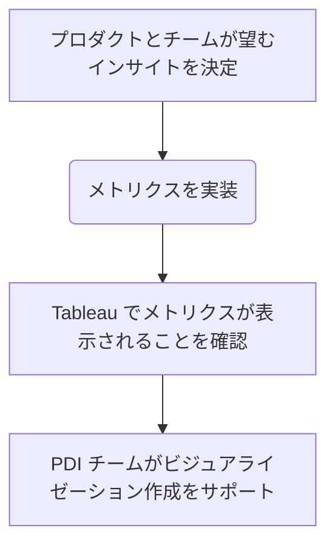

## 概要

このページでは、Secure: Secret Detection チームのメンバーが開発する機能に対するプロダクトインサイトを収集するためにメトリクスを追加する際に使用すべきプロセスを説明します。

このガイドを使用して、利用できるさまざまなタイプのメトリクス、それぞれをいつ使用するか、実装を始めるためのジャンプスタートを理解してください。

### メトリクスワークフロー

一般的に、メトリクスの開発と追加のワークフローは次のとおりです。



## メトリクスの作成

私たちのユースケースでは、状況に応じてインターナルトラッキングイベントまたはデータベースメトリクス（旧 Service Ping）を利用します。

- インターナルトラッキングイベントは、データベースに保存されていない _イベント_ を捉えるのに適しています。例えば、ユーザーが特定のボタンをクリックするなど。
- データベースメトリクスは、適切なクエリで抽出できる形でデータが _データベースに_ 保存されている場合に有用です。例えば、設定が有効になっているプロジェクトの数など。

Analytics Instrumentation チームには[こちら](https://docs.gitlab.com/ee/development/internal_analytics/internal_event_instrumentation/quick_start.html#quick-start-for-internal-event-tracking)に優れたドキュメントがありますが、ここでは私たちのユースケースにおけるメトリクス実装の学びを概説します。

### インターナルトラッキングイベント

インターナルトラッキングイベントは個別のイベントを捉え、7日間、28日間、または全期間にわたって収集できます。これらのイベントはイベントを明示的に発火させるためのコード変更が必要です。

以下は [Notes::BaseService](https://gitlab.com/gitlab-org/gitlab/-/blob/master/app/services/notes/base_service.rb?ref_type=heads) からの例です。

```ruby
...

include Gitlab::InternalEventsTracking

...

track_internal_event('create_commit_note', project: project, user: current_user)
...
```

各イベントには説明的な名前があり、可能な場合はコンテキストとして有用なデータを持っています。

- user
- project
- namespace（指定されない場合は `project` から取得）

`category` というもう1つのフィールドがあり、イベントが発火されたクラスのクラス名に自動的に設定されます。これはテスト時に知っておくことが重要です。

各イベントには最大3つの追加データを持つことができます。イベントは2つの文字列値と1つの数値をサポートします。
これらの追加プロパティはイベントの `additional_properties` マップに格納され、キーは次のとおりです。

- `label`（文字列）
- `property`（文字列）
- `value`（数値）

可能な限りこの順序で使用してください。つまり、`property` の前に `label` を使用します。

#### 追加プロセス

Analytics Instrumentation が[クイックスタートガイド](https://docs.gitlab.com/ee/development/internal_analytics/internal_event_instrumentation/quick_start.html#quick-start-for-internal-event-tracking)で定義したプロセスに従う必要があります。

`ruby scripts/internal_events/cli.rb` CLI ツールを実行してプロンプトに従います。イベント定義はコードがどのイベントを出力するかを知るために必要であり、メトリクス定義はイベントが与えられた際に Snowflake と Tableau が利用可能にするものです。

#### テスト

トラッキングイベントの発火テストに利用できる共有例があります。

```ruby
it_behaves_like 'internal event tracking' do
    let(:event) { "detect_secret_type_on_push" }
    let(:namespace) { project.namespace }
    let(:label) { "GitLab Personal Access Token" }
    let(:category) { described_class.name }

    ...
    subject
end
```

実装ファイルとは異なり、スペックで共有例を使用する際は、テスト対象のクラスになるように `:category` を定義する必要があります。

##### 共有例

インターナルイベントトラッキングテストを共有スペックに追加する場合、既にそうでなければイベント発火をトリガーするものに `subject` を再定義できる必要があります。

例えば、[Gitlab::Checks::SecretsCheck](https://gitlab.com/gitlab-org/gitlab/-/blob/master/ee/lib/gitlab/checks/secrets_check.rb?ref_type=heads) の[スペック](https://gitlab.com/gitlab-org/gitlab/-/blob/master/ee/spec/lib/gitlab/checks/secrets_check_spec.rb?ref_type=heads)では、[secrets_check_shared_example.rb](https://gitlab.com/gitlab-org/gitlab/-/blob/master/ee/spec/support/shared_examples/lib/gitlab/secrets_check_shared_examples.rb?ref_type=heads) の共有例を使用しています。

そのファイルでは、ほとんどのスペックが `subject.validate!` を呼び出してシークレットチェックを実行しますが、インターナルトラッキング共有例の場合は、ただ `subject` を呼び出せることを期待しています。

そのため、_私たちの_ 共有例からインターナルトラッキングイベントの共有例を使用するには、`subject` を `subject { super().validate! }` に再定義する必要があります。`subject{}` ブロック内の `super()` は、事前定義された `subject` オブジェクト、つまり `Gitlab::Checks::SecretsCheck` クラスを参照します。

このような特別なケースでは、`internal event tracking` 共有例を次のように追加します。

```ruby
it_behaves_like 'internal event tracking' do
    let(:event) { 'skip_secret_push_protection' }
    let(:namespace) { project.namespace }
    let(:label) { "commit message" }
    let(:category) { described_class.name }
    subject { super().validate! }
  end
```

### データベースメトリクス（Service Ping）

[データベースメトリクス](https://docs.gitlab.com/ee/development/internal_analytics/metrics/metrics_instrumentation.html#database-metrics)（Service Ping とも呼ばれる）は、データベースクエリで収集できるメトリクスです。これらのメトリクスは約7日ごとにバッチで更新されます。ただし、これは保証されておらず、4〜10日の間で生成される場合があります。

#### 追加プロセス

データベースメトリクスは `GitLab::Usage::Metrics::Instrumentation::DatabaseMetric` の Ruby サブクラスによって実装され、クエリを構築するために `ActiveRecord` リレーションを利用します。あるいは、クエリの SQL を直接提供することもできます。

クラスは `lib/gitlab/usage/metrics/instrumentation/` またはエンタープライズティアに限定されるメトリクスの場合は EE 相当のパスに配置する必要があります。

必要なクラスを作成するために使用できる Rails [ジェネレーター](https://docs.gitlab.com/ee/development/internal_analytics/metrics/metrics_instrumentation.html#create-a-new-metric-instrumentation-class)があります。

```ruby
rails generate gitlab:usage_metric CountIssues --type database --operation distinct_count
        create lib/gitlab/usage/metrics/instrumentations/count_issues_metric.rb
        create spec/lib/gitlab/usage/metrics/instrumentations/count_issues_metric_spec.rb
```

メトリクスを実装する最もシンプルな方法は、クラスレベルの `#operation` と `#relation` メソッドを呼び出すことです。

`operation` の引数は次のいずれかです。

- `:count`
- `:distinct_count`
- `:estimate_batch_distinct_count`
- `:sum`
- `:average`

`relation` はクエリ結果を返すブロックを受け取ります。

[`Gitlab::usage::Metrics::Instrumentation::CountProjectsWithSecretPushProtectionEnabledMetric`](https://gitlab.com/gitlab-org/gitlab/-/blob/master/ee/lib/gitlab/usage/metrics/instrumentations/count_projects_with_secret_push_protection_enabled_metric.rb?ref_type=heads) からの例:

```ruby
class CountProjectsWithSecretPushProtectionEnabledMetric < DatabaseMetric
  operation :count

  relation do
    ProjectSecuritySetting.where(pre_receive_secret_detection_enabled: true)
  end
end
```

各データベースメトリクスには、インターナルトラッキングイベントと同様にメトリクス辞書を添付する必要があります。残念ながら、データベースメトリクスはまだ `internal_events` CLI スクリプトでサポートされていないため、一部は手動で行う必要があります。

1. `config/metrics` または、エンタープライズティアに限定されるメトリクスの場合は `ee/config/metrics` の適切なサブディレクトリに YAML ファイルを作成します。
    1. メトリクスが全期間を捉えることを意図している場合は、`counts_all` サブディレクトリを使用します。
    1. それ以外の場合は、週次および月次メトリクスに対してそれぞれ適切な `counts_7d` または `counts_28d` サブディレクトリを使用します。
1. 既存の YAML ファイルをテンプレートとして使用します。
1. [こちら](https://docs.gitlab.com/ee/development/internal_analytics/metrics/metrics_dictionary.html)で定義されているスキーマを使用します。

注意: マイルストーンが文字列であることを確認してください。

#### テスト

インターナルトラッキングイベントと同様に、データベースメトリクスにもテストで利用できる共有例があります。

```ruby
it_behaves_like 'a correct instrumented metric value', { time_frame: 'all',
data_source: 'database' }
```

`time_frame` は定義されたメトリクスの辞書の値（つまり `7d`、`28d`、または `all`）と一致する必要があります。

## CI ベースのアナライザーオブザーバビリティメトリクス

このセクションでは、[Secret Detection アナライザー](https://gitlab.com/gitlab-org/security-products/analyzers/secrets)へのオブザーバビリティメトリクスの追加について説明します。

アーキテクチャとデザインの考慮事項については、[チュートリアル: CI ベースのアナライザーにオブザーバビリティメトリクスを追加する](/handbook/engineering/development/sec/secure/analyzer-observability-metrics/)を参照してください。

新しいイベントの追加に関する実装の詳細については、[アナライザーの README](https://gitlab.com/gitlab-org/security-products/analyzers/secrets#adding-observability-events) を参照してください。

### イベント命名規則

新しいイベントを追加する際は、以下のパターンに従ってください。

```plaintext
collect_<analyzer_name>_<type>_metrics_from_pipeline
```

`<type>` はメトリクスのカテゴリを説明します。例えば:

- `collect_secrets_analyzer_scan_metrics_from_pipeline`
- `collect_secrets_analyzer_ruleset_customization_metrics_from_pipeline`
- `collect_ds_analyzer_scan_duration_metrics_from_pipeline`

> [!note]
> 一部の既存の[イベント](https://gitlab.com/gitlab-org/gitlab/-/blob/master/ee/app/services/security/process_scan_events_service.rb#L9)は異なる命名パターン（例えば、アナライザー名の代わりに `sast_scan`）を使用しています。これらは既存の Snowflake クエリとダッシュボードを壊さないよう変更されていません。この規則は新しいイベントのみに適用されます。

### イベントの登録

イベントには GitLab モノリスに対応する定義が必要で、バックエンドの許可リストに追加される必要があります。許可されたイベントのみが処理されます。

1. [`config/events/`](https://gitlab.com/gitlab-org/gitlab/-/tree/v18.6.4-ee/config/events) または [`ee/config/events/`](https://gitlab.com/gitlab-org/gitlab/-/tree/v18.6.4-ee/ee/config/events) にイベント定義を作成します。
1. [Security::ProcessScanEventsService::EVENT_NAME_ALLOW_LIST](https://gitlab.com/gitlab-org/gitlab/-/blob/v18.6.4-ee/ee/app/services/security/process_scan_events_service.rb#L9-46) に新しいイベント名を追加します。
1. アナライザーからの実際のレポート出力を使用した rspec テストを追加します。

詳細については、[インターナルイベントトラッキングのクイックスタート](https://docs.gitlab.com/ee/development/internal_analytics/internal_event_instrumentation/quick_start.html)を参照してください。

### バリデーション

デプロイ後:

1. Snowflake にクエリを実行して、イベントが正しく収集されていることを確認します。
1. レポート処理中の例外が発生していないか Sentry を確認します。
1. Analytics Instrumentation チームにダッシュボードの作成を依頼します。

### 現在の実装

Secret Detection アナライザーは `collect_secret_detection_scan_metrics_from_pipeline` イベントを発行します。

| フィールド | 説明 |
|-------|-------------|
| `event` | イベント名。常に `collect_secret_detection_scan_metrics_from_pipeline`。 |
| `time_s` | スキャン期間（秒）。 |
| `exit_code` | Gitleaks の終了コード。`0` は成功、ゼロ以外はエラーまたは検出。 |
| `git_strategy` | Git フェッチ戦略: `FetchRange`、`FetchAll`、または `NoFetch`。 |
| `commit_count` | スキャンされたコミット数。ディレクトリスキャンの場合はゼロ。 |
| `bytes_scanned` | Gitleaks がスキャンした概算バイト数。 |
| `leaks_found` | 検出されたシークレットの数。 |
| `repo_size_kb` | リポジトリのサイズ（キロバイト）。 |
| `error_message` | スキャンが失敗した場合のエラーメッセージ。 |

### 関連するマージリクエスト

- [Add observability metrics to Secret Detection analyzer](https://gitlab.com/gitlab-org/security-products/analyzers/secrets/-/merge_requests/428)

## 表示と分析

### 作成とデプロイの確認

メトリクスは Snowflake に収集され、Tableau で確認できます。メトリクスが本番環境にあり、生成されていることを確認するには、2つの場所を確認します。

1. [メトリクス辞書](https://metrics.gitlab.com/)
1. [Tableau Service Ping Exploration](https://10az.online.tableau.com/#/site/gitlab/views/PDServicePingExplorationDashboard/MetricExplorationbyGroup?:iid=1)（Tableau への `Explorer` レベル以上のアクセスが必要）

`メトリクス辞書` はどのメトリクスが利用可能かを示すだけで、その値を取得するための Snowflake クエリをコピーする機能を提供します。

Tableau の Service Ping エクスプローラーは、基本的な値を表示し、最後に生成された5つの値を確認できます。さらなる分析は Tableau または Snowflake で行う必要があります。

Tableau の `Explorer` ロールでは、ダッシュボードを作成できますが、より高い権限を持つ人が作成したデータソースを使用することに制限されます。新しいインターナルトラッキングイベントまたはデータベースメトリクスは、既存のデータソースに含まれるべきです。

- `Mart Ping Instance Metric Monthly`
- `Mart Ping Instance Metric Weekly`

### ヘルプのお願い

Tableau に慣れていない場合、ワークシートやダッシュボードの作成について、また Tableau ホスト型のコースを受講していない場合は、いくつかのヘルプオプションがあります。

1. Tableau ダッシュボードとビジュアライゼーションの作成のヘルプについては、[Product Data Insights (PDI) チーム](/handbook/product/groups/product-analysis/)に[インテーク プロセス](/handbook/product/groups/product-analysis/#issue-intake)があり、サポートをリクエストできます。
1. Tableau ワークシートやダッシュボードに関する具体的な質問については、PDI チームの Slack チャンネルに連絡できます。
    - [#data-tableau](https://gitlab.enterprise.slack.com/archives/C03RMCEHVCP) - Tableau 固有のヘルプ
    - [#data](https://gitlab.enterprise.slack.com/archives/C8D1LGC23) - データ関連のあらゆる質問

### ローカルテスト

#### 前提条件

<details>
<summary>クリックして展開</summary>

インターナルイベントモニターをセットアップする際に、いくつかの YAML ファイル設定に問題が発生する可能性があります。
以下の変更は、インターナルイベントがモニターに表示されるために必要です。`reconfigure` を実行すると、これらの YAML ファイルはデフォルトにリセットされます。

#### GitLab の設定（`config/gitlab.yml`）

`prometheus` と `snowplow_micro` の `enabled` フィールドを false に変更し、`address` がエイリアス（例: `gdk.test`）ではなく localhost を使用していることを確認します。

#### GDK の設定（`gdk.yml`）

`snowplow_micro` の `enabled` フィールドを `false` に変更します。

</details>

#### イベントの監視

1. 特定のイベントでモニタリングスクリプトを実行します。

   `rails runner scripts/internal_events/monitor.rb EVENT_NAME`

1. イベントはターミナル出力に表示されます。
1. イベントをトリガーします。
1. ブラウザの **DevTools Network** タブを開き、`track_event` でフィルタリングしてイベントが発火することを確認します。

#### 追加リソース

一般的なインターナルイベントのデバッグについては、[ローカルセットアップとデバッグ](https://docs.gitlab.com/development/internal_analytics/internal_event_instrumentation/local_setup_and_debugging/)を参照してください。

### トラブルシューティング

メトリクスが Tableau または Snowplow に表示されない場合は、`#g_monitor_analytics_instrumention` または `#data_tableau` Slack チャンネルに連絡してください。

Tableau で上記の2つのデータソースが見つからない場合は、`New Data Source` ボタンを使用し、利用可能なデータソースのテーブルの右上にある `See All` リンクをクリックしてください。
