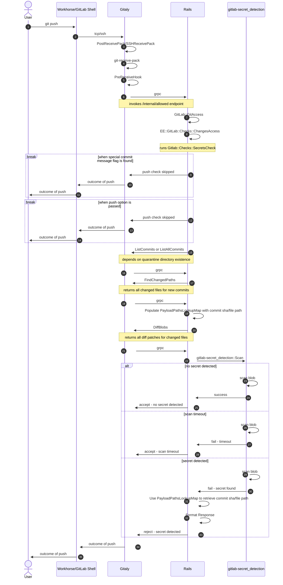

### このランブックをいつ使用しますか?

このランブックは、[シークレットプッシュ保護](https://docs.gitlab.com/user/application_security/secret_detection/secret_push_protection/#secret-push-protection-workflow) 機能を監視する際に使用します。GitLab.com で有効になっているときに発生する可能性のある信頼性の問題やパフォーマンスの低下を特定・緩和するために使用します。また、以下の関連ダッシュボードについて理解を深め、改善方法を検討するためにも使用できます:

* [シークレットプッシュ保護 – 概要ダッシュボード](https://dashboards.gitlab.net/d/fdk7i56zibv28d/secret-push-protection-e28093-overview?orgId=1)
* [シークレットプッシュ保護 – メモリと GC モニタリング](https://dashboards.gitlab.net/d/abe91e88-a9a4-4483-97f0-bc170c087cfb/spp-memory-and-gc-monitoring)

### 何を監視しますか?

機能は[現在の形](../../../../../architecture/design-documents/secret_detection/#high-level-architecture) では外部コンポーネントを持たず、[依存関係](https://gitlab.com/gitlab-org/security-products/secret-detection/secret-detection-service/-/blob/main/gitlab-secret_detection.gemspec) としてアプリケーションサーバー内に封じ込まれていますが、[プッシュイベントのシーケンス図](../../../../../architecture/design-documents/secret_detection/#push-event-detection-flow) に示されているように、多くのコンポーネントとやり取りします。それらのコンポーネントは以下の通りです:

* GitLab Shell (SSH 経由の Git):
  * `git-receive-pack`
* Workhorse (HTTP/S 経由の Git):
  * `git-receive-pack`
* Gitaly:
  * `SSHReceivePack`
  * `PostReceivePack`
  * `PreReceiveHook`
  * `ListAllCommits()` RPC（[検疫ディレクトリ](https://gitlab.com/gitlab-org/gitaly/-/blob/master/doc/object_quarantine.md) が存在しない場合は [`ListCommits()` RPC](https://gitlab.com/gitlab-org/gitlab/-/blob/a7c19f7ae8ed00f512bf7324879ae87d59bb088c/lib/gitlab/gitaly_client/commit_service.rb#L369-370)）
  * `FindChangedPaths()` RPC
  * `DiffBlobs()` RPC
* Rails:
  * `/internal/allowed` エンドポイント

以下は、HTTP または SSH で `git push` が行われる場合のワークフロー全体を示すシーケンス図です:



以下は、GitLab 18.7 以降で [`GetTreeEntries()` なし](https://gitlab.com/gitlab-org/gitlab/-/merge_requests/210708) でシークレットプッシュ保護がどのように機能するかを説明するワークフロー図です:


_注記: `PreReceiveHook` を git の [pre-receive フック](https://git-scm.com/docs/githooks#pre-receive) と混同しないでください。前者は実際の git フックのまわりの[バイナリラッパー](https://gitlab.com/gitlab-org/gitaly/-/tree/master/cmd/gitaly-hooks) です。[フックのセットアップ](https://gitlab.com/gitlab-org/gitaly/-/blob/master/doc/hooks.md#hook-setup) については Gitaly のドキュメントを参照してください。_

これらのコンポーネントが、機能を監視する際に焦点を当てる主要な要素です。

### 機能の監視方法

上述のとおり、機能は複数のコンポーネントにまたがっています。そのため、機能の監視には異なるツールを使用します:

* Kibana（ログ）
  * [ステージング](https://nonprod-log.gitlab.net)
    * `pubsub-rails-inf-gstg`
    * `pubsub-gitaly-inf-gstg`
    * `pubsub-workhorse-inf-gstg`
    * `pubsub-shell-inf-gstg`
  * [本番](https://log.gprd.gitlab.net)
    * `pubsub-rails-inf-gprd`
    * `pubsub-gitaly-inf-gprd`
    * `pubsub-workhorse-inf-gprd`
    * `pubsub-shell-inf-gprd`
* Kibana（ログビュー）
  * `gitlab-org/gitlab`:
    * [ログ / 全件](https://log.gprd.gitlab.net/app/r/s/AM4yh)
    * [ログ / ブロックされたプッシュ](https://log.gprd.gitlab.net/app/r/s/JjteP)
    * [ログ / ルックアップマップ](https://log.gprd.gitlab.net/app/r/s/qSr52)
    * [ログ / 完了したスキャン（>= 55 秒）](https://log.gprd.gitlab.net/app/r/s/CdWx2)
    * [ログ / 完了した全スキャン](https://log.gprd.gitlab.net/app/r/s/xaEdW)
  * 全プロジェクト:
    * [ログ / 全件](https://log.gprd.gitlab.net/app/r/s/cXSeX)
    * [ログ / ブロックされたプッシュ](https://log.gprd.gitlab.net/app/r/s/c5oYC)
    * [ログ / ルックアップマップ](https://log.gprd.gitlab.net/app/r/s/knonO)
    * [ログ / 完了したスキャン（>= 55 秒）](https://log.gprd.gitlab.net/app/r/s/VSpA9)
    * [ログ / 完了した全スキャン](https://log.gprd.gitlab.net/app/r/s/ax6qa)
* Kibana（ビジュアライゼーション）
  * [完了したスキャンの平均時間](https://log.gprd.gitlab.net/app/lens#/edit/a0b71153-c3a7-4b76-9cd5-c856dd2ef6e1?_g=(filters:!(),refreshInterval:(pause:!t,value:60000),time:(from:now-7d,to:now)))
  * [完了したスキャンの最大時間](https://log.gprd.gitlab.net/app/lens#/edit/01389e92-932a-4d1e-9d59-bc1656026800?_g=(filters:!(),refreshInterval:(pause:!t,value:60000),time:(from:now-7d,to:now)))
  * [10 秒刻みで見た完了したスキャンの時間](https://log.gprd.gitlab.net/app/lens#/edit/6d230ed7-61f0-4453-a4ca-7a8bf6d57b21?_g=(filters:!(),refreshInterval:(pause:!t,value:60000),time:(from:now-7d,to:now)))
  * [時間経過による変更パスの内訳](https://log.gprd.gitlab.net/app/lens#/edit/7f5a1b82-8b77-426f-8fe3-736f40da0b7e?_g=(filters:!(),refreshInterval:(pause:!t,value:60000),time:(from:now-7d,to:now)))
* Prometheus/Grafana（メトリクス）
  * [内部 API](https://dashboards.gitlab.net/dashboards/f/internal-api/internal-api)
  * [Gitaly](https://dashboards.gitlab.net/dashboards/f/gitaly/gitaly-service)
  * [GitLab Shell](https://dashboards.gitlab.net/d/git-main/git3a-overview)
* Sentry（エラートラッキング）
  * [Gitlab.com](https://new-sentry.gitlab.net/organizations/gitlab/projects/gitlabcom)
  * [Gitaly](https://new-sentry.gitlab.net/organizations/gitlab/projects/gitaly)
  * [Workhorse](https://new-sentry.gitlab.net/organizations/gitlab/projects/workhorse-gprd)

このランブックでは主に Grafana で利用可能な Prometheus メトリクスに焦点を当てていますが、他のツールとその使用方法についても簡潔に説明しています。今後のイテレーションでは、機能の成長と発展に伴い変更される可能性があります。

### 機能から出力されるログの確認方法

機能から出力されるログを確認するには、以下の Kibana ビューを参照してください:

* 📖 [Kibana: 全スキャンのログ](https://log.gprd.gitlab.net/app/discover#/view/31afcbb2-28e9-466f-a6c3-486e869e1ee3).
* 📖 [Kibana: ブロックされたプッシュのログ](https://log.gprd.gitlab.net/app/discover#/view/db7ba29d-d406-46df-8b43-e6d9c47fbed7).

>**注記:** Kibana は[7 日間のみログを保持します](/handbook/support/workflows/kibana/#using-kibana)。

### 機能の信頼性またはパフォーマンスの問題を特定・緩和する方法

[概要ダッシュボード](https://dashboards.gitlab.net/d/fdk7i56zibv28d/secret-push-protection-e28093-overview?orgId=1) は、機能を監視するために構築したメインダッシュボードです。信頼性やパフォーマンスの問題を特定しようとする際は、まずここを確認してください。

ダッシュボード自体は 4 つの行（またはセクション）に分かれており、それぞれに以下のようなパネルが含まれています。

#### GitLab Shell (SSH 経由の Git)

このセクションでは、`GitLab Shell` 内の機能に関連する特定の操作の安定性を監視します。GitLab Shell は Git SSH セッションを処理するために作成された実行ファイルのセットです。ツール自体は SSH を直接処理しませんが、SSH サーバー/デーモン [`gitlab-sshd`](https://docs.gitlab.com/ee/development/gitlab_shell/gitlab_sshd.html) がクライアントとのすべての接続を維持し、認可またはアクセスチェックを実行するために GitLab Shell 経由で Rails を呼び出します。動作の詳細については、[この図](https://docs.gitlab.com/ee/development/gitlab_shell/index.html#git-push-over-ssh) と[リクエストサイクルの説明](https://docs.gitlab.com/ee/development/architecture.html#ssh-request-22) を参照してください。

このセクションは、SSH で `git push` 操作を行う際の `git-receive-pack` 操作に関連するパフォーマンス低下がないことを確認するために使用できます。以下の 2 つの行/セクションに分けられています。

**注記**: `gitlab-shell` と `gitlab-sshd` の両方で利用可能なほとんどのメトリクスは、使用されたコマンドで集計されていません。`git-receive-pack` 操作のパフォーマンスをより詳細に把握するには、代わりにそれらのセクションにリンクされている Kibana ログを参照してください。

##### gitlab-shell

**[RPS (Requests Per Seconds)](https://dashboards.gitlab.net/d/fdk7i56zibv28d/secret-push-protection-e28093-overview?orgId=1&viewPanel=17)**

このパネルは、時間経過とともに gitlab-shell に対して行われた 1 秒あたりの平均リクエスト数 (RPS) を表示します。リクエストレートを監視し、パフォーマンスまたはスケーラビリティの問題があるかどうかを理解するために使用できます。より詳細な概要はリンクを参照してください。注意: これは `git-receive-pack` コマンドに固有ではありません。

_パネル情報_

* メトリクス: `gitlab_component_ops:rate_5m`
* ラベルフィルター:
  * `component` = `gitlab_shell`
  * `env` = `gprd`
  * `monitor` = `global`
  * `stage` = `main`
  * `type` = `git`
* 操作:
  * 平均値（時間経過）: `range | $__interval`
* 凡例:
  * RPS

**[確立された Gitaly 接続の合計](https://dashboards.gitlab.net/d/fdk7i56zibv28d/secret-push-protection-e28093-overview?orgId=1&viewPanel=15)**

このパネルは、特定の時点で gitlab-shell によって確立された Gitaly 接続の総数を表示します。このパネルは、両コンポーネント間の接続が突然減少したかどうかを確認するために使用でき、パフォーマンスまたは可用性の問題を示す可能性があります。注意: これは `git-receive-pack` コマンドに固有ではありません。

_パネル情報_

* メトリクス: `gitlab_shell_gitaly_connections_total`
* ラベルフィルター:
  * `env` = `gprd`
  * `stage` = `main`
* 操作:
  * カウント:
    * ラベル: `status`
* 凡例:
  * 自動

**[確立された SSH セッション](https://dashboards.gitlab.net/d/fdk7i56zibv28d/secret-push-protection-e28093-overview?orgId=1&viewPanel=22)**

このパネルは、特定の時点での確立された SSH セッションの最小数を表示します。このパネルは、隣接するパネル（特定の時点で確立に失敗した SSH セッションの最大数を表示）と組み合わせて、可用性の問題があるかどうかを理解するために使用できます。注意: これは `git-receive-pack` コマンドに固有ではありません。

_パネル情報_

* メトリクス: `gitlab_sli:shell_sshd_sessions:total`
* ラベルフィルター:
  * `env` = `gprd`
  * `stage` = `main`
  * `type` = `git`
* 操作:
  * 最小値
* 凡例:
  * 自動

**[失敗した SSH セッション](https://dashboards.gitlab.net/d/fdk7i56zibv28d/secret-push-protection-e28093-overview?orgId=1&viewPanel=19)**

このパネルは、特定の時点での失敗した SSH セッションの最大数を表示します。このパネルは、隣接するパネル（特定の時間範囲で確立された SSH セッションの最小数を表示）と組み合わせて、可用性の問題があるかどうかを理解するために使用できます。注意: これは `git-receive-pack` コマンドに固有ではありません。

_パネル情報_

* メトリクス: `gitlab_sli:shell_sshd_sessions:errors_total`
* ラベルフィルター:
  * `env` = `gprd`
  * `stage` = `main`
  * `type` = `git`
* 操作:
  * 最大値（ラベル別）:
    * ラベル: `app`
* 凡例:
  * 自動

**[確立されたセッションの平均時間](https://dashboards.gitlab.net/d/fdk7i56zibv28d/secret-push-protection-e28093-overview?orgId=1&viewPanel=27)**

このパネルは、24 時間の範囲で合計された確立された SSH セッションの平均時間を表示します。このパネルは、SSH 経由の git pull/push の時間が増加しているかどうかを確認するために使用でき、パフォーマンスまたは可用性の問題を示す可能性があります。注意: これは `git-receive-pack` コマンドに固有ではありません。

_パネル情報_

* メトリクス:
  * `gitlab_shell_sshd_session_established_duration_seconds_sum`
  * `gitlab_shell_sshd_session_established_duration_seconds_count`
* ラベルフィルター:
  * `env` = `gprd`
  * `stage` = `main`
  * `type` = `git`
* 操作:
  * 除算: `/`
  * レート: `range | 24h`
  * 合計
* 凡例:
  * `{{label_name}}`

**[全セッションの平均時間](https://dashboards.gitlab.net/d/fdk7i56zibv28d/secret-push-protection-e28093-overview?orgId=1&viewPanel=20)**

このパネルは、24 時間の範囲で合計された全 SSH セッション（確立済みおよび失敗を含む）の平均時間を表示します。このパネルは、SSH 経由の git pull/push の時間が増加しているかどうかを確認するために使用でき、パフォーマンスまたは可用性の問題を示す可能性があります。注意: これは `git-receive-pack` コマンドに固有ではありません。

_パネル情報_

* メトリクス:
  * `gitlab_shell_sshd_session_duration_seconds_sum`
  * `gitlab_shell_sshd_session_duration_seconds_count`
* ラベルフィルター:
  * `env` = `gprd`
  * `stage` = `main`
  * `type` = `git`
* 操作:
  * 除算: `/`
  * レート: `range | 24h`
  * 合計
* 凡例:
  * `{{label_name}}`

##### gitlab-sshd

**[SLI Apdex](https://dashboards.gitlab.net/d/fdk7i56zibv28d/secret-push-protection-e28093-overview?orgId=1&viewPanel=24)**

このパネルは、`gitlab-sshd` SSH デーモン/サーバーのアプリケーションパフォーマンスインデックス（Apdex）を表示します。このサービスレベル指標（SLI）は通常 99.9% 前後で推移しますが、指標の低下は障害または劣化を示す可能性があります。より詳細な概要はリンクを参照してください。注意: これは `git-receive-pack` コマンドに固有ではありません。

_パネル情報_

* メトリクス: `gitlab_component_apdex:ratio_5m`
* ラベルフィルター:
  * `component` = `gitlab_sshd`
  * `env` = `gprd`
  * `monitor` = `global`
  * `stage` = `main`
  * `type` = `git`
* 操作:
  * 最小値（時間経過）: `range | $__interval`
* 凡例:
  * Apdex

**[SLI エラー率](https://dashboards.gitlab.net/d/fdk7i56zibv28d/secret-push-protection-e28093-overview?orgId=1&viewPanel=25)**

このパネルは、`gitlab-sshd` SSH デーモン/サーバーの最大値にクランプされたエラー比率の最大値を表示します。このサービスレベル指標（SLI）は通常 0.01% 前後で推移しますが、指標の増加は障害または劣化を示す可能性があります。より詳細な概要はリンクを参照してください。注意: これは `git-receive-pack` コマンドに固有ではありません。

_パネル情報_

* メトリクス: `gitlab_component_errors:ratio_5m`
* ラベルフィルター:
  * `component` = `gitlab_sshd`
  * `env` = `gprd`
  * `monitor` = `global`
  * `stage` = `main`
  * `type` = `git`
* 操作:
  * 最大値にクランプ:
    * 最大スカラー: `1`
    * 最大値（時間経過）: `range | $__interval`
* 凡例:
  * Error %

**[SLI RPS (Requests Per Second)](https://dashboards.gitlab.net/d/fdk7i56zibv28d/secret-push-protection-e28093-overview?orgId=1&viewPanel=26)**

このパネルは、時間経過とともに `gitlab-sshd` SSH デーモン/サーバーに対して行われた 1 秒あたりの平均リクエスト数 (RPS) を表示します。リクエストレートを監視し、パフォーマンスまたはスケーラビリティの問題があるかどうかを理解するために使用できます。より詳細な概要はリンクを参照してください。注意: これは `git-receive-pack` コマンドに固有ではありません。

* メトリクス: `gitlab_component_ops:ratio_5m`
* ラベルフィルター:
  * `component` = `gitlab_sshd`
  * `env` = `gprd`
  * `monitor` = `global`
  * `stage` = `main`
  * `type` = `git`
* 操作:
  * 平均値（時間経過）: `range | $__interval`
* 凡例:
  * Error %

#### Workhorse (HTTP/S 経由の Git)

このセクションでは、`Workhorse` 内の機能に関連する特定の操作の安定性を監視します。Workhorse は、リソース集約型および長時間実行リクエストを処理するためのスマートリバースプロキシです。すべての HTTP リクエストをインターセプトし、変更せずに転送するか、追加のロジックを実行することで自らが処理します。動作の詳細については、[この図](https://docs.gitlab.com/ee/development/workhorse/handlers.html#git-push) と[リクエストサイクルの説明](https://docs.gitlab.com/ee/development/architecture.html#web-request-80443) を参照してください。

このセクションは、HTTP/S で `git push` 操作を行う際の `git-receive-pack` 操作に関連するパフォーマンス低下がないことを確認するために使用できます。

**[処理された `/.git/git-receive-pack` リクエスト](https://dashboards.gitlab.net/d/fdk7i56zibv28d/secret-push-protection-e28093-overview?orgId=1&viewPanel=2)**

このパネルは、時間経過とともに `workhorse` によって処理された HTTP リクエストの数を 24 時間の範囲で増加して表示します。HTTP verb/メソッドとレスポンスコードでリクエストを区分します。このパネルは、`200` 以外のレスポンスコードを持つ `git-receive-pack` リクエストの数が最近増加したかどうかを確認するために使用でき、そのようなリクエストの処理に問題があることを示します。

_パネル情報_

* メトリクス: `gitlab_workhorse_git_http_requests`
* ラベルフィルター:
  * `exported_service` = `git-receive-pack`
  * `env` = `gprd`
  * `stage` = `main`
  * `code` != `0`
* 操作:
  * 増加: `range | 24h`
  * 合計:
    * ラベル: `code`
    * ラベル: `method`
* 凡例:
  * `{{code}} | {{method}}`

**[確立された Gitaly 接続の合計](https://dashboards.gitlab.net/d/fdk7i56zibv28d/secret-push-protection-e28093-overview?orgId=1&viewPanel=6)**

このパネルは、特定の時点で `workhorse` によって確立された `Gitaly` 接続の総数を表示します。このパネルは、両コンポーネント間の接続が突然減少したかどうかを確認するために使用でき、パフォーマンスまたは可用性の問題を示す可能性があります。

_パネル情報_

* メトリクス: `gitlab_workhorse_gitaly_connections_total`
* ラベルフィルター:
  * `env` = `gprd`
  * `stage` = `main`
* 操作:
  * カウント:
    * ラベル: `status`
* 凡例:
  * `{{status}}`

**[`/.git/git-receive-pack` リクエストの平均レイテンシ [全ノード]](https://dashboards.gitlab.net/d/fdk7i56zibv28d/secret-push-protection-e28093-overview?orgId=1&viewPanel=7)**

このパネルは、`workhorse` を実行している全ノードの `/.git/git-receive-pack` リクエストの平均レイテンシ（時間）を秒単位で表示します。この特定のリクエストのレスポンスタイムが増加しているかどうかを確認するために使用でき、特定のしきい値を超えた場合にパフォーマンスの低下を示す可能性があります。

_パネル情報_

* メトリクス:
  * `gitlab_workhorse_http_request_duration_seconds_sum`
  * `gitlab_workhorse_http_request_duration_seconds_count`
* ラベルフィルター:
  * `env` = `gprd`
  * `stage` = `main`
  * `route` = `^/.+\\.git/git-receive-pack\\z`（バックスラッシュのダブルエスケープ）
* 操作:
  * 除算: `/`
  * レート: `range | 24h`
  * 合計:
    * ラベル: `node`
* 凡例:
  * 自動

**[SLI Apdex](https://dashboards.gitlab.net/d/fdk7i56zibv28d/secret-push-protection-e28093-overview?orgId=1&viewPanel=29)**

このパネルは、`workhorse` コンポーネントのアプリケーションパフォーマンスインデックス（Apdex）を表示します。このサービスレベル指標（SLI）は通常 99.9% 前後で推移しますが、指標の低下は障害または劣化を示す可能性があります。より詳細な概要はリンクを参照してください。注意: これは `/.git/git-receive-pack` ルートに固有ではありません。

_パネル情報_

* メトリクス: `gitlab_component_apdex:ratio_5m`
* ラベルフィルター:
  * `component` = `workhorse`
  * `env` = `gprd`
  * `monitor` = `global`
  * `stage` = `main`
  * `type` = `git`
* 操作:
  * 最小値（時間経過）: `range | $__interval`
* 凡例:
  * Apdex

**[SLI エラー率](https://dashboards.gitlab.net/d/fdk7i56zibv28d/secret-push-protection-e28093-overview?orgId=1&viewPanel=30)**

このパネルは、`workhorse` の最大値にクランプされたエラー比率の最大値を表示します。このサービスレベル指標（SLI）は通常 0.001% 前後で推移しますが、指標の増加は障害または劣化を示す可能性があります。より詳細な概要はリンクを参照してください。注意: これは `/.git/git-receive-pack` ルートに固有ではありません。

_パネル情報_

* メトリクス: `gitlab_component_errors:ratio_5m`
* ラベルフィルター:
  * `component` = `workhorse`
  * `env` = `gprd`
  * `monitor` = `global`
  * `stage` = `main`
  * `type` = `git`
* 操作:
  * 最大値にクランプ:
    * 最大スカラー: `1`
    * 最大値（時間経過）: `range | $__interval`
* 凡例:
  * Error %

**[SLI RPS (Requests Per Second)](https://dashboards.gitlab.net/d/fdk7i56zibv28d/secret-push-protection-e28093-overview?orgId=1&viewPanel=31)**

このパネルは、時間経過とともに `workhorse` に対して行われた 1 秒あたりの平均リクエスト数 (RPS) を表示します。リクエストレートを監視し、パフォーマンスまたはスケーラビリティの問題があるかどうかを理解するために使用できます。より詳細な概要はリンクを参照してください。注意: これは `/.git/git-receive-pack` ルートに固有ではありません。

* メトリクス: `gitlab_component_ops:ratio_5m`
* ラベルフィルター:
  * `component` = `workhorse`
  * `env` = `gprd`
  * `monitor` = `global`
  * `stage` = `main`
  * `type` = `git`
* 操作:
  * 平均値（時間経過）: `range | $__interval`
* 凡例:
  * Error %

#### Gitaly

このセクションでは、`git` リポジトリへの高レベルな RPC アクセスを提供するツールである `gitaly` の安定性を監視します。このセクションでは、機能が使用するフックと RPC に焦点を当てます。これを使用して、それらに関連するパフォーマンス低下がないことを確認できます。

セクションは以下の 4 つのサブセクションに分かれており、主にレイテンシに焦点を当てています。

1. GitLab Shell <=> Gitaly:
    * `SSHReceivePack`
1. Workhorse <=> Gitaly:
    * `PostReceivePack`.
1. Gitaly <=> Rails API:
    * Gitaly / `/internal/allowed` 前:
        * `PreReceiveHook`.
    * Gitaly / `/internal/allowed` 中:
        * `ListAllCommits()` RPC (または `ListCommits()` RPC)
        * `FindChangedPaths()` RPC
        * `DiffBlobs()` RPC

##### GitLab Shell <=> Gitaly

**[PostReceivePack – 平均レイテンシ [全ホスト]](https://dashboards.gitlab.net/d/fdk7i56zibv28d/secret-push-protection-e28093-overview?orgId=1&viewPanel=36)**

このパネルは、`PostReceivePack` RPC の呼び出しに対する全ホストの平均レイテンシをミリ秒単位で表示します。PostReceivePack RPC は `git-receive-pack` コマンドを呼び出す責任を持ち、その後 `PreReceiveHook` を実行します。後者は Rails 側でアクセスチェックを実行する `/internal/allowed` エンドポイントを呼び出します。

_パネル情報_

* メトリクス: `gitaly:grpc_server_handling_seconds:avg5m`
* ラベルフィルター:
  * `job` = `gitaly`
  * `grpc_method` = `PostReceivePack`
* 操作:
  * 平均: `1000 * avg`
* 凡例:
  * `{{method}}`

##### Workhorse <=> Gitaly

**[SSHReceivePack – 平均レイテンシ [全ホスト]](https://dashboards.gitlab.net/d/fdk7i56zibv28d/secret-push-protection-e28093-overview?orgId=1&viewPanel=37)**

このパネルは、`SSHReceivePack` RPC の呼び出しに対する全ホストの平均レイテンシをミリ秒単位で表示します。SSHReceivePack RPC は（SSH 経由の git push 向けに）`git-receive-pack` コマンドを呼び出す責任を持ち、その後 `PreReceiveHook` を実行します。後者は Rails 側でアクセスチェックを実行する `/internal/allowed` エンドポイントを呼び出します。

_パネル情報_

* メトリクス: `gitaly:grpc_server_handling_seconds:avg5m`
* ラベルフィルター:
  * `job` = `gitaly`
  * `grpc_method` = `SSHReceivePack`
* 操作:
  * 平均: `1000 * avg`
* 凡例:
  * `{{method}}`

##### Gitaly <=> Rails API

###### Gitaly / `/internal/allowed` 前

**[PreReceiveHook – 平均レイテンシ [全ホスト]](https://dashboards.gitlab.net/d/fdk7i56zibv28d/secret-push-protection-e28093-overview?orgId=1&viewPanel=38)**

このパネルは、`PreReceiveHook` フックの呼び出しに対する全ホストの平均レイテンシをミリ秒単位で表示します。PreReceiveHook は Rails 側でアクセスチェックを実行するために `/internal/allowed` エンドポイントを呼び出します。

_パネル情報_

* メトリクス: `gitaly:grpc_server_handling_seconds:avg5m`
* ラベルフィルター:
  * `job` = `gitaly`
  * `grpc_method` = `PreReceiveHook`
* 操作:
  * 平均: `1000 * avg`
* 凡例:
  * `{{method}}`

###### Gitaly / `/internal/allowed` 中

**[ListAllCommits – 平均レイテンシ [全ホスト]](https://dashboards.gitlab.net/d/fdk7i56zibv28d/secret-push-protection-e28093-overview?orgId=1&viewPanel=10)**

このパネルは、`ListAllCommits` RPC へのすべての呼び出しの平均レイテンシをミリ秒単位で表示します。ListAllCommits RPC は（機能のコンテキストにおいて）特定のサイズ制限（正確には 1MiB）以下のリポジトリの全新規コミットを列挙する責任を持ちます。

_パネル情報_

* メトリクス: `gitaly:grpc_server_handling_seconds:avg5m`
* ラベルフィルター:
  * `job` = `gitaly`
  * `grpc_method` = `ListAllCommits`
* 操作:
  * 平均: `1000 * avg`
* 凡例:
  * `{{method}}`

**[ListCommits – 平均レイテンシ [全ホスト]](https://dashboards.gitlab.net/d/fdk7i56zibv28d/secret-push-protection-e28093-overview?orgId=1&viewPanel=11)**

このパネルは、`ListCommits` RPC へのすべての呼び出しの平均レイテンシをミリ秒単位で表示します。ListCommits RPC は（機能のコンテキストにおいて）特定のサイズ制限（正確には 1MiB）以下のリポジトリの全 Blob を列挙する責任を持ちます。`ListAllCommits` と同様ですが、それらの Blob のファイルパスも読み込みます。この処理は `ListAllCommits` よりも遅い場合がよくあります。

_パネル情報_

* メトリクス: `gitaly:grpc_server_handling_seconds:avg5m`
* ラベルフィルター:
  * `job` = `gitaly`
  * `grpc_method` = `ListCommits`
* 操作:
  * 平均: `1000 * avg`
* 凡例:
  * `{{method}}`

**[FindChangedPaths – 平均レイテンシ [全ホスト]](https://dashboards.gitlab.net/d/fdk7i56zibv28d/secret-push-protection-e28093-overview?orgId=1&viewPanel=9)**

このパネルは、`FindChangedPaths` RPC へのすべての呼び出しの平均レイテンシをミリ秒単位で表示します。FindChangedPaths RPC は（機能のコンテキストにおいて）プッシュでスキャンされている全新規コミットの変更されたパス/ファイルとそのメタデータ（ファイルパスとコミット SHA）を取得する責任を持ちます。

_パネル情報_

* メトリクス: `gitaly:grpc_server_handling_seconds:avg5m`
* ラベルフィルター:
  * `job` = `gitaly`
  * `grpc_method` = `FindChangedPaths`
* 操作:
  * 平均: `1000 * avg`
* 凡例:
  * `{{method}}`

**[DiffBlobs – 平均レイテンシ [全ホスト]](https://dashboards.gitlab.net/d/fdk7i56zibv28d/secret-push-protection-e28093-overview?orgId=1&viewPanel=panel-43)**

このパネルは、`DiffBlobs` RPC へのすべての呼び出しの平均レイテンシをミリ秒単位で表示します。DiffBlobs RPC は（機能のコンテキストにおいて）プッシュでスキャンされた新規コミットの変更されたパス/ファイルの実際のペイロード（差分またはデルタ）を取得する責任を持ちます。

_パネル情報_

* メトリクス: `gitaly:grpc_server_handling_seconds:avg5m`
* ラベルフィルター:
  * `job` = `gitaly`
  * `grpc_method` = `DiffBlobs`
* 操作:
  * 平均: `1000 * avg`
* 凡例:
  * `{{method}}`

#### Rails

このセクションでは、[`/internal/allowed` エンドポイント](https://docs.gitlab.com/ee/development/internal_api/internal_api_allowed.html) の安定性を監視します。このエンドポイントは、`git` プッシュでのシークレット漏洩から保護する機能の要所です。エンドポイントは GitLab の [内部 API](https://docs.gitlab.com/ee/development/internal_api/) の一部であり、ユーザーがリポジトリで特定の操作を実行する権限を持っているかどうかを評価する責任を持ちます。

このセクションは、特定の `git` プッシュの変更がシークレットをスキャンされる際に、`/internal/allowed` エンドポイントに関連するパフォーマンス低下がないことを確認するために使用できます。

**[内部 API / リクエストレイテンシ](https://dashboards.gitlab.net/d/fdk7i56zibv28d/secret-push-protection-e28093-overview?orgId=1&viewPanel=40)**

このパネルは、時間経過とともに `/internal/allowed` エンドポイントへのリクエストの平均、p95、p99、および平均レイテンシを表示します。この特定のエンドポイントのリクエストレイテンシを監視し、パフォーマンスまたはスケーラビリティの問題があるかどうかを理解するために使用できます。より詳細な概要はリンクを参照してください。

_パネル情報_

* メトリクス:
  * `controller_action:gitlab_transaction_duration_seconds_sum:rate5m`
  * `controller_action:gitlab_transaction_duration_seconds:p95`
  * `controller_action:gitlab_transaction_duration_seconds:p99`
  * `controller_action:gitlab_transaction_duration_seconds_sum:rate1m`
  * `controller_action:gitlab_transaction_duration_seconds_count:rate1m`
* ラベルフィルター:
  * `action` = `POST /api/internal/allowed`
  * `controller` = `Grape`
  * `environment` = `gprd`
  * `stage` = `main`
  * `type` = `internal-api`
* 操作:
  * 平均値（時間経過）: `range | $__interval`
  * 平均:
    * ラベル: `controller`
    * ラベル: `action`
* 凡例:
  * `{{action}} – avg`
  * `{{action}} – p95`
  * `{{action}} – p99`
  * `{{action}} – mean`

**[内部 API / RPS (Requests Per Second)](https://dashboards.gitlab.net/d/fdk7i56zibv28d/secret-push-protection-e28093-overview?orgId=1&viewPanel=41)**

このパネルは、時間経過とともに `/internal/allowed` エンドポイントへの 1 秒あたりの平均リクエスト数 (RPS) を表示します。この特定のエンドポイントのリクエストレートを監視し、パフォーマンスまたはスケーラビリティの問題があるかどうかを理解するために使用できます。より詳細な概要はリンクを参照してください。

_パネル情報_

* メトリクス:
  * `controller_action:gitlab_transaction_duration_seconds_count:rate1m`
* ラベルフィルター:
  * `action` = `POST /api/internal/allowed`
  * `controller` = `Grape`
  * `environment` = `gprd`
  * `stage` = `main`
  * `type` = `internal-api`
* 操作:
  * 平均値（時間経過）: `range | $__interval`
  * 合計:
    * ラベル: `controller`
    * ラベル: `action`
* 凡例:
  * `{{action}}`

**[内部 API / メモリ飽和率](https://dashboards.gitlab.net/d/fdk7i56zibv28d/secret-push-protection-e28093-overview?orgId=1&viewPanel=42)**

このパネルは、内部 API の 2 つのコンポーネント（[Ruby VM](https://dashboards.gitlab.net/goto/ptHVRjsIR?orgId=1) と [Puma Workers](https://dashboards.gitlab.net/goto/dJXnRjyIR?orgId=1)）のメモリ飽和率を表示します。Rails のメモリ消費が飽和点まで増加しているかどうかを理解するのに役立ち、パフォーマンスとスケーラビリティの問題を示し、対応が必要です。注意: このパネルは `/internal/allowed` エンドポイントに固有ではありません。

_パネル情報_

* メトリクス:
  * `gitlab_component_saturation:ratio`
* ラベルフィルター:
  * `env` = `gprd`
  * `environment` = `gprd`
  * `stage` = `main`
  * `type` = `internal-api`
  * `component` = `ruby_thread_contention` | `puma_workers`
* 操作:
  * 最大値（時間経過）: `range | $__interval`
  * 最大:
    * ラベル: `component`
* 凡例:
  * 自動

### その他のサポートはどこで求めればよいですか?

不明な点がある場合は、`#g_secure-secret-detection` チャンネルでいつでもサポートを求めることができます。

### このランブックを改善するには?

このランブックは、機能の進化と進歩に合わせて更新する必要があります。以下のガイドラインに従って最新の状態に保ってください。

#### ダッシュボードのパネルが更新された場合

ダッシュボードのパネルが更新された場合は、必要に応じてパネル情報と説明を更新してください。

#### 新しいパネルが追加された場合

新しいパネルがダッシュボードに作成された場合は、以下に示すのと同じ形式を使用して名前、説明、および情報を追加してください。

```markdown
**太字のパネル名**

パネルが何をするか、パフォーマンスの低下や信頼性の問題を特定するためにどのように使用できるかを説明する数文。

_パネル情報_

* Metric: `NAME_OF_METRIC_USED`
* Label Filters:
  * `LIST_OF_LABELS_USED_TO_FILTER_BY_IN_KEY_AND_VALUE`
* Operations:
  * `LIST_OF_OPERATIONS_APPLIED_ON_DATA`
* Legend:
  * `LEGEND_USED_IF_NOT_AUTOMATIC`
```

#### パネルが削除された場合

ダッシュボードからパネルが削除された場合は、このランブックから対応するセクションを削除することを検討してください。

### 関連ダッシュボードへの貢献方法

このランブックで説明されているダッシュボードは以下のように改善できます。

#### 新しいコンポーネントが機能で使用される場合

新しいコンポーネントが機能で使用される場合は、以下の手順に従ってください。

* そのコンポーネント内で機能がやり取りするエンドポイントやサービスを特定します。
* エンドポイントまたはサービスで利用可能なメトリクスを調べます。
* メトリクスが利用できない場合は、エンドポイント/サービスのパフォーマンスを監視するために[メトリクスの作成](https://docs.gitlab.com/ee/administration/monitoring/prometheus/)を検討してください。
* 編集しているダッシュボードにコンポーネントの新しい行を作成します。
* 新しい行に利用可能なメトリクスを追加します。何を追加すべきか最善の判断をしてください。
* このランブックをパネル情報で更新するマージリクエストを作成します。上記のパネルをガイドとして使用してください。

#### コンポーネントが不要になった場合

コンポーネントが不要になった場合は、ダッシュボードから対応する行を削除してください。
