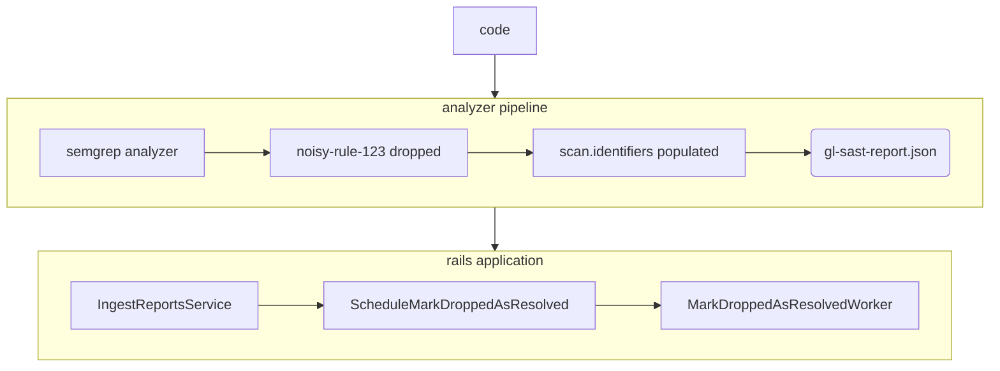

### このランブックをいつ使用するか？

このランブックは、SAST 自動脆弱性解決機能に関連するサービス低下が発生したときに使用します。このような低下は以下を監視することで確認できます:

* [Sidekiq エラーレート](https://dashboards.gitlab.net/goto/st2S69zIg?orgId=1)（[Static Analysis グループダッシュボード](https://dashboards.gitlab.net/d/stage-groups-static_analysis/stage-groups-static-analysis-group-dashboard?orgId=1) 内）で `Vulnerabilities::MarkDroppedAsResolvedWorker` を選択。
* [Static Analysis エラーバジェット](https://dashboards.gitlab.net/d/stage-groups-detail-static_analysis/stage-groups-static-analysis-group-error-budget-detail?orgId=1) の Sidekiq 実行 [Apdex](https://dashboards.gitlab.net/goto/MlCAe9kIg?orgId=1) および [エラー比率](https://dashboards.gitlab.net/goto/6VQT6rzIR?orgId=1) パネル。

### SAST 自動脆弱性解決

[SAST 自動脆弱性解決](https://docs.gitlab.com/ee/user/application_security/sast/#automatic-vulnerability-resolution) 機能は、その名の通り、無効化または削除された [SAST ルール](https://gitlab.com/gitlab-org/security-products/sast-rules) に関連する脆弱性を自動的に解決するために構築されています。

この機能は、いくつかの構成要素に依存しています:

* [security-report-schemas のスキーマ定義](#schema-definition-in-security-report-schemas)
* [`analyzers/report` パッケージの SARIF モジュール](#sarif-module-in-analyzersreport-package)
* [Rails アプリケーション内でのドロップされた識別子の処理](#dropped-identifier-processing-within-rails-application)

#### security-report-schemas のスキーマ定義

セキュリティアナライザースキャンで生成されたレポートは、[security-report-schemas](https://gitlab.com/gitlab-org/security-products/security-report-schemas) リポジトリで JSON スキーマが定義されています。自動脆弱性解決は、[`security-report-format`](https://gitlab.com/gitlab-org/security-products/security-report-schemas/-/blob/master/src/security-report-format.json?ref_type=heads) の一部である特定のスキーマフィールド（[`primary_identifiers`](https://gitlab.com/gitlab-org/security-products/security-report-schemas/-/blob/3b3b76e83722a97181f52f473a80f2f5713591e6/src/security-report-format.json#L134-140)）に依存しています。`security-report-format` は、[`sast-report-format`](https://gitlab.com/gitlab-org/security-products/security-report-schemas/-/blob/master/src/sast-report-format.json?ref_type=heads) を含む他のすべてのセキュリティレポートスキーマの親スキーマです。

#### `analyzers/report` パッケージの SARIF モジュール

`primary_identifiers` フィールドには、アナライザースキャンが対象とするすべての識別子（検出されたものではなく）の完全なリストが含まれています。そのため、レポートに脆弱性が 0 件でも `scan.primary_identifiers` には完全なリストが含まれる場合があります。このリストは、[`analyzers/report`](https://gitlab.com/gitlab-org/security-products/analyzers/report) パッケージの [`sarif.go` モジュール](https://gitlab.com/gitlab-org/security-products/analyzers/report/-/blob/ab86ee260f289d204e705ff1ed39c8c6f334b8d5/sarif.go#L170) で [SARIF](https://sarifweb.azurewebsites.net/) ファイルを SAST セキュリティレポートに変換する際に生成されます。

#### Rails アプリケーション内でのドロップされた識別子の処理

`gitlab-org/gitlab` アプリケーション内での[セキュリティレポートの取り込み](https://docs.gitlab.com/ee/development/sec/security_report_ingestion_overview.html)では、[`IngestReportsService`](https://gitlab.com/gitlab-org/gitlab/-/blob/master/ee/app/services/security/ingestion/ingest_reports_service.rb) が[スキャン主要識別子](https://docs.gitlab.com/ee/development/integrations/secure.html#scan-primary-identifiers)を反復処理し、各スキャンタイプに対して [`ScheduleMarkDroppedAsResolvedService`](https://gitlab.com/gitlab-org/gitlab/-/blob/master/ee/app/services/security/ingestion/schedule_mark_dropped_as_resolved_service.rb) を実行します。これにより [`MarkDroppedAsResolvedWorker`](https://gitlab.com/gitlab-org/gitlab/-/blob/master/ee/app/workers/vulnerabilities/mark_dropped_as_resolved_worker.rb) がスケジュールされます。このワーカーは、無効化またはドロップされた識別子（最新のスキャンに存在しない識別子）に一致する識別子を持つすべての脆弱性をループ処理します。

以下は、自動脆弱性解決機能の完全なフローを示す図です。

#### 監視

自動脆弱性解決を監視するための主な情報源が 2 つあります。[sentry.io](https://new-sentry.gitlab.net/organizations/gitlab/issues/?project=3&query=is%3Aunresolved+MarkDroppedAsResolvedWorker&referrer=issue-list&statsPeriod=24h) は過去 24 時間の [`MarkDroppedAsResolvedWorker`](https://gitlab.com/gitlab-org/gitlab/-/blob/master/ee/app/workers/vulnerabilities/mark_dropped_as_resolved_worker.rb) クラスで発生したエラーをリストアップします。Kibana の [SAST Engineering](https://log.gprd.gitlab.net/app/dashboards#/view/1eebd010-9a73-11ec-9dd2-93d354bef8e7) ダッシュボードには、特定のワークを監視し、アップロードされたレポートの量を表示するいくつかのパネルが含まれています。注目すべきパネルとその簡単な説明を以下に示します。

##### SAST レポートアップロード

アップロードされたセキュリティレポートのファイルサイズの 90 パーセンタイルを 30 分ごとに表示します。これは、一定期間にわたってアップロードされたセキュリティレポートのサイズ（大きいか小さいか）を確認するのに役立ちます。

##### SAST 失敗ワーカー分布

一定期間にわたって失敗した SAST 関連の `sidekiq` ワーカーの分布を表示します。

##### Vulnerabilities::MarkDroppedAsResolvedWorker 実行時間

ワーカーの実行時間の 75 パーセンタイルと 95 パーセンタイルを表示します。

##### Vulnerabilities::MarkDroppedAsResolvedWorker ジョブステータス

1 時間ごとにジョブステータス別に分けたジョブ実行回数を表示します。これは、一定期間にわたる失敗した実行、重複排除された実行、または成功した実行の量を測定するのに役立ちます。

##### MarkDroppedAsResolvedWorker 実行上位プロジェクト

ワーカー実行回数が多い上位プロジェクトを表示します。特定の顧客が問題を抱えているかどうかを確認するのに役立ちます。

##### ログ

さらに、[本番ログ](https://gitlab.com/gitlab-com/runbooks/-/blob/master/docs/logging/README.md#production-gitlabcom) で次の 2 つの保存済み検索を確認することをお勧めします:

* [Vulnerabilities::MarkDroppedAsResolvedWorker – 合計実行回数](https://log.gprd.gitlab.net/app/discover#/view/90af2000-3561-11ee-bd28-d5868e2560c1)
* [Vulnerabilities::MarkDroppedAsResolvedWorker – DB 書き込みを伴う実行](https://log.gprd.gitlab.net/app/discover#/view/8f08a680-3562-11ee-bfa6-bb3e7da18467)

#### 問題が発生した場合の対処法

1. 上記の監視セクションを確認します。`MarkDroppedAsResolvedWorker` に障害が発生していないか確認してください。
1. [ログ](#logs) を確認し、問題がデータベース書き込み操作（例: 大量のファインディングを解決しようとする場合）中に[タイムアウト](#possible-checks)する可能性があるかどうかを確認してください。
1. [自動脆弱性解決をオフにする](#how-to-turn-automatic-vulnerability-resolution-off) ことを検討してください。

#### 考えられるチェック

* 自動脆弱性解決に関連するエラーレートの増加がある場合、非常に多くの脆弱性ファインディングを解決しようとした際のこの[タイムアウト Issue](https://gitlab.com/gitlab-org/gitlab/-/issues/417046) が原因である可能性があります。

#### 自動脆弱性解決をオフにする方法

`primary_identifiers` の存在はレポートの取り込みと自動脆弱性解決に[必須](https://gitlab.com/gitlab-org/gitlab/-/blob/9d85d9449da19a26d073c5eab49e7b9f128e4650/ee/app/services/security/ingestion/schedule_mark_dropped_as_resolved_service.rb#L43) です。自動脆弱性解決が期待通りに機能しない場合は、スキャンが生成されたレポートに `primary_identifiers` を含めないようにすることで、自動解決を停止することを検討してください。そのためには、以下のいずれかのオプションを検討してください:

1. `sarif.go` モジュールを更新して、この[マージリクエスト](https://gitlab.com/gitlab-org/security-products/analyzers/report/-/merge_requests/39) で導入された変更を元に戻す。
2. `ScheduleMarkDroppedAsResolvedService#dropped_identifiers` メソッドを更新して、`primary_identifiers` の存在に関わらず[早期にリターン](https://gitlab.com/gitlab-org/gitlab/-/blob/9d85d9449da19a26d073c5eab49e7b9f128e4650/ee/app/services/security/ingestion/schedule_mark_dropped_as_resolved_service.rb#L43)するようにする。
