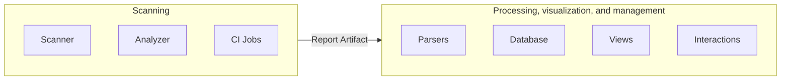

## アーキテクチャ

- [概要](#overview)
- [重大度レベル](https://docs.gitlab.com/ee/user/application_security/vulnerabilities/severities.html)
- [フィードバック](feedback/)（却下、Issue またはマージリクエストの作成）

## 概要

Secure 機能をサポートするアーキテクチャは、主に 2 つの部分に分かれています。

### スキャン

スキャン部分は、指定されたリソースの脆弱性を検出し、結果をエクスポートする役割を担います。
スキャンは、[アナライザーサブグループ](https://gitlab.com/gitlab-org/security-products/analyzers) にある [Analyzers](https://docs.gitlab.com/ee/user/application_security/terminology/#analyzer) と呼ばれるいくつかの小さなプロジェクトを通じて、CI ジョブで実行されます。
アナライザーは、GitLab に統合するために [Scanners](https://docs.gitlab.com/ee/user/application_security/terminology/#scanner) と呼ばれる社内または外部のセキュリティツールをラップする小さなラッパーです。
アナライザーは主に Go で書かれており、[共通 Go ライブラリ](https://gitlab.com/gitlab-org/security-products/analyzers/common) を利用しています。

一部のサードパーティインテグレーターは、同じアーキテクチャを活用した[インテグレーションドキュメント](https://docs.gitlab.com/ee/development/integrations/secure/)に従うことで、追加のスキャナーを利用可能にしています。

スキャン結果は [Secure レポートフォーマット](https://docs.gitlab.com/ee/user/application_security/terminology/#secure-report-format) に準拠した JSON レポートとしてエクスポートされ、パイプライン完了後に処理できるよう [CI ジョブレポートアーティファクト](https://docs.gitlab.com/ee/ci/jobs/job_artifacts.html#artifactsreports) としてアップロードされます。

この部分は主に以下のグループが担当しています:

- [Composition Analysis](/handbook/product/categories/#composition-analysis-group)
- [Dynamic Analysis](/handbook/product/categories/#dynamic-analysis-group)
- [Fuzz Testing](/handbook/product/categories/#fuzz-testing-group)
- [Static Analysis](/handbook/product/categories/#static-analysis-group)
- [Vulnerability Research](/handbook/product/categories/#vulnerability-research-group)

### 処理、可視化、および管理

データがレポートアーティファクトとして利用可能になると、[GitLab Rails アプリケーション](https://gitlab.com/gitlab-org/gitlab) によって処理され、セキュリティ機能が有効になります:

- [セキュリティダッシュボード](https://docs.gitlab.com/ee/user/application_security/security_dashboard/)、マージリクエストウィジェット、パイプラインビューなど
- [脆弱性との対話](https://docs.gitlab.com/ee/user/application_security/#interacting-with-the-vulnerabilities)
- [承認ルール](https://docs.gitlab.com/ee/user/application_security/#security-approvals-in-merge-requests)
- など

コンテキストに応じて、セキュリティレポートはデータベースに保存されるか、オンデマンドアクセスのためにレポートアーティファクトとして保持されます。

ただし、境界が曖昧になる場合もあるため、[できるだけ明確に線引きするよう努めています](/handbook/engineering/development/sec/delineate-sec/#technical-boundaries)。

## ClickHouse データストア

Secure 機能全体の主要なワークロードは、高速な書き込みレートと履歴データに対する集計分析に依存しています。これらのタイプの OLAP シナリオは PostgreSQL のようなトランザクション型データストアには適しておらず、バッチベースの挿入、高い読み取り比率、ワイドテーブルの恩恵を受けることができます。

このような場合、GitLab のテクノロジースタックへの [ClickHouse](https://clickhouse.com) の導入は、Secure 機能を将来に向けてスケールさせる重要な機会を提供します。

データストアとしての ClickHouse は、セクション内のいくつかの主要なワークフローを強化する可能性があります:

### セキュリティダッシュボード

セキュリティダッシュボードは、プロジェクトおよびネームスペース全体のアクティブな脆弱性を追跡するための履歴集計データを提供します。これらのリクエストは ClickHouse が大きく最適化されている読み取り専用データの分析集計クエリです。

既存の集計のパフォーマンス向上に加え、OLAP データストアの使用により、追加フィールド（重大度と並んだレポートタイプや分類など）によるオンデマンド集計をより柔軟に実現できます。

### 脆弱性リスト

脆弱性リストは、プロジェクトおよびネームスペース内の脆弱性をレビュー、評価、トリアージするための表形式のデータと対話性を提供します。これらのリクエストは高読み取り、ワイドカラムで（多くの場合）フィルタリングされます。クエリベースのビュー集計へのシフトにより、カラム型ストアは特定のテーブルの限られたカラムをフェッチする際に完全なレコードアクセスを必要とせず、大きな利点を提供します。

さらに、[脆弱性をオンザフライで作成する](https://gitlab.com/gitlab-org/gitlab/-/issues/324860) という作業など、ユーザーインタラクションへの永続化を削減することを目的とした継続的なアーキテクチャにより、脆弱性ファインディングのストレージを PostgreSQL から ClickHouse に移行することで、パフォーマンス向上の大きな可能性があります。

## 調査

- [依存関係情報のデータモデル](data-model-for-dependencies-information/)

## ブラウンバッグセッション

Secure チームメンバーは、さまざまなトピックについて [ブラウンバッグセッション](https://gitlab.com/gitlab-org/secure/brown-bag-sessions#brown-bag-sessions) を通じて知識を共有しています。
