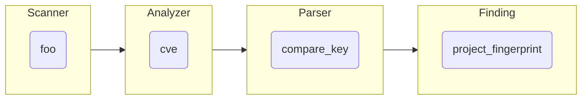
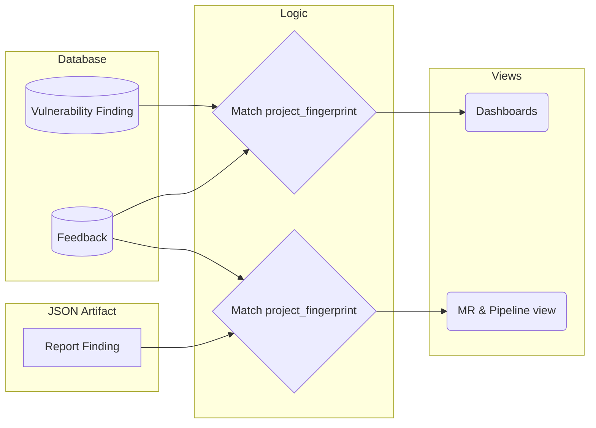

## 概要

ファインディングがプロジェクトに報告されると、ユーザーはさまざまな方法でそれを操作できます。その 1 つが[フィードバック](https://docs.gitlab.com/ee/user/application_security/terminology/#feedback)と呼ばれるもので、ユーザーは次のことができます:

- ファインディングを却下する
- ファインディングから Issue を作成する
- ファインディングから MR を作成する

これらの機能の詳細は[ユーザードキュメント](https://docs.gitlab.com/ee/user/application_security/#interacting-with-the-vulnerabilities)で説明されています。

当初の意図は報告されたファインディングに関するユーザーのフィードバックを収集し、シグナル対ノイズ比を向上させることだったため、フィードバックと呼ばれています。

## 課題

フィードバックの主な課題は、追跡の信頼性です。
ファインディングが却下された場合、その後のスキャンでファインディングが報告されても却下状態が維持されることを保証する必要があります。

もう 1 つの課題は、フィードバック機能がすべてのビュー、すべてのブランチで利用可能であることです。
つまり、[脆弱性ファインディング](https://docs.gitlab.com/ee/user/application_security/terminology/#vulnerability-finding)（データベースに保存される）と[レポートファインディング](https://docs.gitlab.com/ee/user/application_security/terminology/#report-finding)（データベースに保存されない）の両方で機能する必要があります。

## 実装

注意: 現在、[この実装を置き換える提案](https://gitlab.com/gitlab-org/gitlab/-/issues/205489)があります。

`Vulnerability::Feedback` AR モデルは、ファインディングと照合するために `project_fingerprint` 属性に依存しています。このアプローチにより次のことが可能になります:

1. スキャン間での安定した識別子を持ち、時間の経過とともに異なるブランチをまたいでフィードバックとファインディングを照合し続ける
1. データベースの外部キーのような DB 専用機能に依存しないため、任意のソース（データベースまたは JSON アーティファクト）からフィードバックを照合できる

ただし、このフィンガープリントの生成方法により、#1 は期待ほど安定しておらず、さまざまなアナライザー間で一貫した方法で生成されていません。

この `project_fingerprint` は、脆弱性ファインディングレコードのデータベースに保存され、
JSON アーティファクト（MR ウィジェットとパイプラインビュー用）からレポートファインディングを解析する際に動的に生成されます。

フィードバックレコードはすべてのブランチで共有されることを意図しているため、プロジェクトレベルにスコープされています。
そのため「プロジェクト」フィンガープリントと呼ばれています。

特定の `project_fingerprint` とレポートタイプに対して、特定のタイプ（`dismissal`、`issue`、`merge_request`）のフィードバックは 1 つのみ許可されます。

このフィンガープリントデータはスキャナーの出力から来ていますが、JSON アーティファクトでは最終的な形式では提供されません。

### `project_fingerprint` の生成方法

各ファインディングについて、アナライザーはスキャナーによって提供される独自のデータから `cve` プロパティを作成します。
これはスキャナーによって異なる場合があります。
そのため、名前とは異なり、このプロパティには CVE 値が含まれなくなりました。
このレガシープロパティは、当初はセキュリティ機能の初期段階でファインディングの比較と重複排除のために使用されており、
当時は CVE 番号のみに基づいていました。
その後、後方互換性を維持しながら一意性と時間の経過による安定性の両方を達成する値を提供しようとする試みとして、
プロパティが多重にオーバーロードされました。
`cve` プロパティは [Secure レポートフォーマット](https://docs.gitlab.com/ee/user/application_security/terminology/#secure-report-format)の一部です。

Rails アプリケーションでレポートを解析する際、この `cve` プロパティは
ファインディングオブジェクトの[`compare_key` 属性](https://gitlab.com/gitlab-org/gitlab/-/blob/0d013cc934887497874f2f1dc2411015e8575084/ee/lib/gitlab/ci/parsers/security/common.rb#L62)にアンマーシャルされます。

この `compare_key` は次に [SHA1 にハッシュ化](https://gitlab.com/gitlab-org/gitlab/-/blob/f2d2f348a3ee7a2621bfda6aabf27834fdc60706/ee/lib/gitlab/ci/reports/security/finding.rb#L70-72)され、
[`project_fingerprint` 属性に割り当てられます](https://gitlab.com/gitlab-org/gitlab/-/blob/f2d2f348a3ee7a2621bfda6aabf27834fdc60706/ee/lib/gitlab/ci/reports/security/finding.rb#L37)。

ファインディングがデータベースに保存される場合、`project_fingerprint` も
[対応するカラム](https://gitlab.com/gitlab-org/gitlab/-/blob/f2d2f348a3ee7a2621bfda6aabf27834fdc60706/db/structure.sql#L16365)に保存されます。

### `project_fingerprint` の使用方法

ファインディングを取得する際、データソースに関わらずファインディングを取得する際に、
対応する `project_fingerprint` を検索してフィードバックを関連付けることができます。

