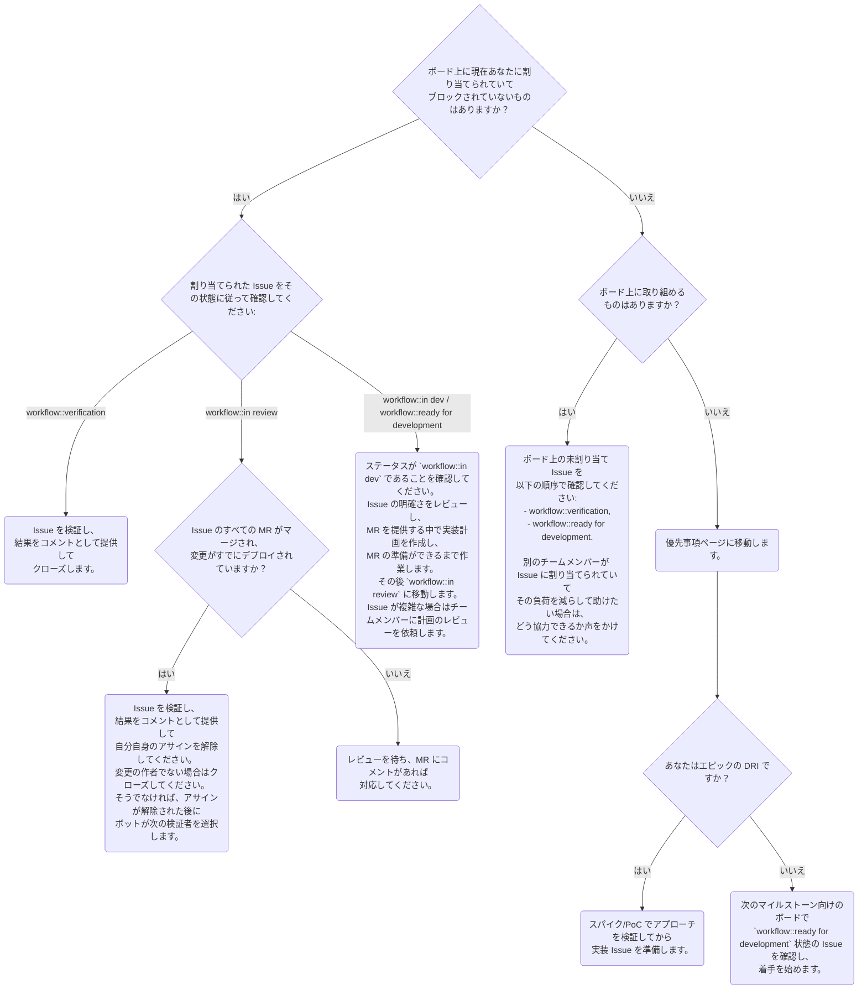

## 現在の作業をどのように優先しますか？

割り当てられたすべてのタスクを完了した後、次に取り組むタスクを決定する際に従うプロセスを理解するため、以下のフローチャートを参照してください。

```mermaid
flowchart TD
    AA{ボード上に現在あなたに割り当てられていて<br/>ブロックされていないものはありますか？} -->|はい| A{割り当てられた Issue をその状態に従って確認してください:}
    AA -->|いいえ| BA{ボード上に取り組める<br/>ものはありますか？}
    A -->|workflow::verification| B(Issue を検証し、<br/>結果をコメントとして提供して<br/>クローズします。)
    A -->|workflow::in review| C{Issue のすべての MR がマージされ、<br/>変更がすでにデプロイされていますか？}
    C -->|はい| D(Issue を検証し、<br/>結果をコメントとして提供して<br/>自分自身のアサインを解除してください。<br/>変更の作者でない場合はクローズしてください。<br/>そうでなければ、アサインが解除された後に<br/>ボットが次の検証者を選択します。)
    C -->|いいえ| E(レビューを待ち、MR にコメントがあれば<br/>対応してください。)
    A -->|workflow::in dev / workflow::ready for development| I(ステータスが `workflow::in dev` であることを確認してください。<br/>Issue の明確さをレビューし、<br/>MR を提供する中で実装計画を作成し、<br/>MR の準備ができるまで作業します。<br/>その後 `workflow::in review` に移動します。<br/>Issue が複雑な場合はチームメンバーに計画のレビューを依頼します。)
    BA -->|はい| BB(ボード上の未割り当て Issue を<br/>以下の順序で確認してください:<br/>- workflow::verification,<br/>- workflow::ready for development.<br/><br/>別のチームメンバーが Issue に割り当てられていて<br/>その負荷を減らして助けたい場合は、<br/>どう協力できるか声をかけてください。)
    BA -->|いいえ| BC(優先事項ページに移動します。)
    BC --> BD{あなたはエピックの DRI ですか？}
    BD -->|はい| BE(スパイク/PoC でアプローチを検証してから<br/>実装 Issue を準備します。)
    BD -->|いいえ| BF(次のマイルストーン向けのボードで<br/>`workflow::ready for development` 状態の Issue を確認し、<br/>着手を始めます。)
```

