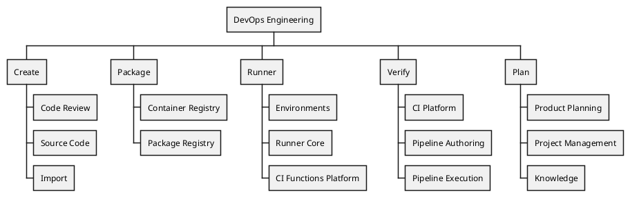

## ビジョン

 **私たちの目標は単に機能をリリースすることではなく、それらが成功裏に着地し、お客様に真の価値を提供することを保証することです。** 私たちは、信頼性を確保し、運用の容易さとスケーラビリティを維持して多様な顧客ニーズに応えながら、すべてのユーザーグループにわたって期待を超える高品質基準を満たす、業界最高の製品を開発するよう努めています。すべてのチームメンバーは、私たちが行うすべてにおいて、ターゲット顧客とサポートする複数のプラットフォームを念頭に置く必要があります。

特に大企業の主要な顧客[組織アーキタイプ](/handbook/product/personas/organization-archetype/)に対して、製品があらゆる面で優れていることを保証します。これには、スケーラビリティ、適応性、シームレスなアップグレードパスが含まれます。機能の設計と実装時には、常にすべてのデプロイメントオプション（セルフマネージド、Dedicated、Software as a Service (SaaS)）との互換性を念頭に置いてください。

[私たちの価値観](/handbook/values/)と[独自の働き方](/handbook/company/culture/all-remote/guide/)を維持しながら、製品と顧客の成長を支える結果を出すための、技術力があり多様でグローバルなチームを育成します。

## ミッション

GitLabの独自の非同期な働き方、ハンドブックファーストの方法、私たちが開発する製品の利用、価値観への明確な集中により、非常に高い生産性を実現できます。私たちは、顧客満足度を最大化するために、製品の品質、ユーザビリティ、信頼性の継続的な向上に集中しています。コミュニティコントリビューションと顧客とのインタラクションは、効率的で効果的なコミュニケーションに依存しています。私たちはデータ駆動、顧客体験ファーストのオープンコア組織であり、1つのセキュアで信頼性の高い、世界をリードするDevSecOpsプラットフォームを提供します。新しい標準を設定し、イノベーションを推進し、DevSecOpsの境界を押し広げ、顧客に対して一貫して優れた結果を提供することに、私たちと一緒に参加してください。

### 複雑なワークフローをシンプルで直感的にする

私たちは**プラットフォームアドバンテージそのものです** -- 私たちは、製品を適用することで20,000人の断片化された開発者を統合し、それを40,000人に成長させた[Siemens](https://about.gitlab.com/customers/siemens/)の例のように、比類のないDevOpsの加速と効率を提供します。私たちの製品は、シンプルなニーズを持つスタートアップから、高度なCI/CDワークフローと複雑なリポジトリ管理を持つエンタープライズまで、シームレスにスケールします。私たちのソリューションは、市場投入までの時間を短縮し、信頼性により、チームはメンテナンスではなくイノベーションに集中できます。

#### 主要な焦点領域

1. **盤石な基盤を持つこと**
   - リアクティブ（バグの消化）からプロアクティブ（スケーラビリティの境界を押し広げる）への移行
   - エンタープライズグレードの品質を提供するための品質基準の引き上げ
   - ゴールデンジャーニーの最適化

2. **競合的な置き換え**
   - 高価値領域でのターゲットを絞った競争での勝利
   - 統合されたワークフローと運用上の複雑さの軽減
   - 顧客ファーストのマインドセット

3. **イノベーションと創造性**: GitLabをAIネイティブソフトウェア開発のための最高のプラットフォームとして位置付ける:
   - エージェンティックAIの企業ビジョンへの貢献
   - 主要な差別化要因
   - プラットフォームインテリジェンス

私たちは、高パフォーマンスのチームが繁栄し、イノベーションし、効率的に実行できる環境を作り出し、最終的に市場でのGitLabの競争優位性を推進することを目指しています。

### 盤石な基盤を持つ

品質へのアプローチは3つのフェーズで進化し、最終的に使いやすさ、直感性、有用性をターゲットにしています。進化した顧客ベースをサポートするために、[深さと安定性](/handbook/engineering/#expand-customer-focus-through-depth-and-stability)が最優先となります。

#### 品質への3フェーズ

1. リアクティブからプロアクティブな品質管理への移行
    - インシデント対応の安定化
    - エラーバジェット管理の正常化
    - 重要なIssueバックログのクリア
2. 顧客の期待に応えるための品質基準の引き上げ
    - より高い品質基準の実装（99.9% → 年間8.76時間のダウンタイム）
    - 顧客が待ち望んでいた改善の提供
    - 「十分」から「信頼できる良さ」への移行
3. ゴールデンジャーニーとワークフローの最適化
    - 主要なユーザーパスの識別と完成
    - 重要なワークフローでのシームレスな体験の作成
    - 体験の卓越性に関する組織全体の整合性

## 組織



### オンボーディング

GitLabへようこそ！あなたが私たちに加わることを楽しみにしています。
始めるためのいくつかの厳選されたリソースは以下のとおりです:

- [エンジニアとして参加する](/handbook/engineering/workflow/developer-onboarding/)
- [エンジニアリングマネージャーとして参加する](/handbook/engineering/workflow/development-onboarding/manager/)
- [Core DevOps GitLabプロジェクト](https://gitlab.com/gitlab-org/core-devops)
- [Core DevOps Google Calendar](https://calendar.google.com/calendar/u/0?cid=Y19jYjBhZmU1Y2Y4MTZiYmI3Mzk4OTM0MTQ3MGIwMzFkZDY3NjNjYWQ3MTI3MGQ1MjllYTA3YjM3NzAyMGRjYzdkQGdyb3VwLmNhbGVuZGFyLmdvb2dsZS5jb20)

### ミーティング

| **ミーティング（社内のみ、アクセス制限あり）** | **頻度** | **DRI**  | **トピック**  |
|-------|--------|-------|----------|
| [SaaS可用性](/handbook/engineering/#saas-availability-weekly-standup)   | 週次        | Infrastructure  | インシデント是正措置、Feature Change Lockステータス、期限切れInfradev、エラーバジェット、またはセキュリティ更新    |
| DevOps Weekly     | 週次      | Michelle Gill   | 標準ディスカッション、質問、必要な助け、FYI、プロセス改善、エンジニアリング戦略のコラボレーション、イベント計画、リーダーシップコミュニケーションの伝播、より広いイニシアチブのブレインストーミング、OKR |
|[Product Quality Standup](https://docs.google.com/document/d/18N4_OmA4JLG5wxZfq2irYk6FUVNXP-Arkk691lm35vo/edit?tab=t.0#heading=h.yoksgpvi6fh)       | 週次        | Michelle Gill   | グループ間の共有された品質目標（バグの消化、計測）に関する調整   |
| Core DevOps All-Hands | 隔月 | Anand、Michelle、Marcel | 達成された進捗の振り返り、今後のビジョンの予測、アクションコール |

### Slackチャンネル

- [#core_devops](https://gitlab.enterprise.slack.com/archives/CG7FPF4KT)
- [#devops-principals](https://gitlab.enterprise.slack.com/archives/C09ADSQA22F)

### パフォーマンス指標

私たちの目標とビジョンをよりよく測定するために、[ここでパフォーマンス指標を追跡しています](https://internal.gitlab.com/handbook/engineering/devops/performance-indicators)。

### 人事プロセス

1. [昇進](/handbook/people-group/promotions-transfers)
   - [キャリブレーション準備](/handbook/people-group/promotions-transfers/#calibration)
1. [タレントアセスメント](/handbook/people-group/talent-assessment/)
1. [契約者の雇用](/handbook/engineering/workflow/development-processes/hiring-contractors)
1. [認識と賞](/handbook/engineering/recognition/)
1. [学習と開発](/handbook/people-group/learning-and-development/)
   - [GitLabでのメンタリング](/handbook/people-group/learning-and-development/mentor/)
   - [セキュリティ意識向上トレーニング](/handbook/security/security-assurance/governance/sec-awareness-training/#what-will-be-covered-in-the-training)
   - [GitLabパフォーマンステスト](/handbook/engineering/testing/performance-tools/)
   - [GraphQL APIを始める](https://docs.gitlab.com/ee/api/graphql/getting_started.html)
   - [データベースエンジニアリング](/handbook/engineering/development/database/)

## 私たちの働き方

### 計画と優先事項

私たちの目標とビジョンをよりよく達成するために、[R&Dインターロックプロセス](/handbook/product-development/how-we-work/r-and-d-interlock)に従っています。

Core DevOpsは、E-Groupおよび[Operating Model](https://internal.gitlab.com/handbook/company/gitlab-operating-model/)からカスケードされるGitLabの[トップ5の企業目標](https://gitlab.com/groups/gitlab-operating-model/-/epics?sort=created_date&state=opened&parent_id=None&label_name%5B%5D=Operating%20Model%3A%3A%201%20-%20Company%20Objective&first_page_size=20)と私たちの作業を整合させます。私たちの戦略的優先事項は、企業の優先事項とCore DevOpsの整合性の高レベルビューを提供する[Planning Overview](https://gitlab.com/gitlab-org/core-devops/planning/issues/-/work_items/1)を含む、[Core DevOps Planningプロジェクト](https://gitlab.com/gitlab-org/core-devops/planning/issues)で透明に追跡されます。

### インシデント管理

1. [エンジニアリングマネージャーとStaff+](/handbook/engineering/infrastructure-platforms/incident-management/incident-manager-onboarding/#incident-manager-participants)は、Tier 1（製品全体）インシデントリード（インシデントマネージャーとも呼ばれる）として直接的にインシデント管理に貢献します。
1. 適格性基準を満たすすべてのエンジニアは、Core DevOps [Tier 2オンコールプロセス](/handbook/engineering/devops/oncall/)を通じてインシデント管理に貢献します。
1. 一部のエンジニアリングマネージャーは、Core DevOps [Tier 2オンコールプロセス](/handbook/engineering/devops/oncall/)の[ローテーションリーダー](/handbook/engineering/devops/oncall/rotation-leader/)です。

私たちは、個人が[複数のローテーション](/handbook/engineering/devops/oncall/coverage-and-scheduling/#multiple-rotations)に参加することを期待**していません**。

### 可用性

[エラーバジェット](/handbook/engineering/error-budgets)は、[.com可用性](/handbook/engineering/error-budgets/#budget-allocation)に整合したサービスの信頼性を理解するために、週次および月次で追跡されます。特定のチームのエラーバジェットが2週間「赤」になると、安定するために十分な週がグリーンで経過するまで（最小限フル28日期間）、[FY26 Product Quality Standup](https://docs.google.com/document/d/18N4_OmA4JLG5wxZfq2irYk6FUVNXP-Arkk691lm35vo/edit?tab=t.0#heading=h.yoksgpvi6fh)で報告されます。

### 横断的なコラボレーション

別のチームの製品ステージのコードに影響を与えるIssueは、作業が開始される前に関連するProduct、UX、エンジニアリングマネージャーと協調的にアプローチし、そのステージを担当するエンジニアによってレビューされる必要があります。

これは、コードベースのその領域を担当するチームが、変更の影響を認識し、ステージのロードマップを満たす方法でアーキテクチャ、保守性、アプローチに影響を与えることができるようにするためです。

#### アーキテクチャコラボレーション

横断的、または部門横断的なアーキテクチャコラボレーションが必要なときは、[GitLabアーキテクチャ進化ワークフロー](/handbook/engineering/architecture/)に従う必要があります。

#### Follow the Sunカバレッジ

グローバルリージョンとタイムゾーン全体で横断的なコラボレーションが必要な場合、シームレスなグローバルコラボレーションを確保するために[Follow the Sunカバレッジ](/handbook/engineering/workflow/development-processes/follow-the-sun-coverage/)アプローチを採用することが推奨されます。

#### セキュリティ脆弱性の処理

1. 懸念のある依存関係（例: gems、libs、ベースイメージなど）を導入または消費する開発グループは、依存関係に対して検出された脆弱性を解決する責任があります。
2. ベースイメージを提供するビジネス選択のベンダー（例: RHELのUBI8）の場合、公式アップストリームリリースの一部になる前にパッチを待つか、実行可能な解決策として偏差リクエスト（DR）をログに記録する必要があります。Threat Managementチームが開発した自動化である[VulnMapper](https://gitlab.com/gitlab-com/gl-security/product-security/vulnerability-management/vulnerability-management-internal/vulnmapper/-/tree/main)は、大部分のベンダー依存関係DRを作成できますが、DRを手動でレポートする必要があるケースもあります。
3. 割り当てられた開発グループは、最初の割り当てが不正確だった場合に、[共有責任Issue](/handbook/product-development/how-we-work/issue-triage/#shared-responsibility-issues)および/または[共有責任機能](/handbook/product/categories/#shared-responsibility-functionality)のプロセスに従って、Issueをリダイレクトできます。

#### 共有サービスとコンポーネントの所有権

GitLabアプリケーションは、PostgreSQLデータベース、Redis、Sidekiq、Prometheusなど、多くの共有サービスとコンポーネントの上に構築されています。これらのサービスは、各機能のRailsコードベースに密接に織り込まれています。機能リクエスト、インシデントエスカレーション、技術的負債、バグ修正など、需要が発生したときにDRIを特定する必要が非常に頻繁にあります。以下は、その対象事項について最も支援できる関係者を素早く見つけるためのガイドです。

##### 所有権モデル

特定の共有サービスとコンポーネントに最適なものを合理化するために、柔軟性を最大化するためにいくつかの利用可能なモデルから選択できます。

1. 特定のチームでの集中型
    1. 単一のグループが、新機能リクエスト、バグ修正、技術的負債を含む特定の共有サービスのバックログを所有しています。対応するProduct Managerがいる場合といない場合があります。
    1. 単一のグループは特定のチームを意味し、つまりエンジニアリングマネージャーがおり、すべてのドメインオーナーの個人がこのチームに所属しています。DRIはエンジニアリングマネージャーです。
    1. この単一のグループは、バックログの整理と計画で密接かつ定期的にコラボレーションすることが期待されます。
    1. このモデルはProduct Managementの対応者からの合意が必要な場合があります。
    1. このモデルは、活発な開発を経験するサブジェクトドメインに適合する可能性があります。
1. バーチャルチームでの集中型
    1. 単一のグループが、新機能リクエスト、バグ修正、技術的負債を含む特定の共有サービスのバックログを所有しています。対応するProduct Managerがいる場合といない場合があります。
    1. 単一のグループはバーチャルチームを意味し、つまり、メンテナーまたは対象分野の専門家など、さまざまなエンジニアリングチームからのエンジニアで構成されています。通常、このバーチャルチームのエンジニアリングマネージャーはいません。DRIは必ずしもエンジニアリングマネージャーではない、グループの任命された人です。
    1. この単一のグループは、バックログの精緻化と計画で密接かつ定期的にコラボレーションすることが期待されます。
    1. このモデルは、メンテナンスモードのサブジェクトドメインに適合する可能性があります。
1. 集合体（Collectives）
    1. 集合体は、共有された関心または責任を中心に自発的に集まる既存のチームの個人で構成されますが、ワーキンググループとは異なり、永続的に存在することがあります。共有された関心は、特定のテクノロジーまたはシステムである可能性があります。集合体のメンバーは、彼らが統治するサブジェクトを弱く所有、改善、または別の方法で操縦するための集団的責任を感じます。
    1. これはバーチャルチームのより弱い形ですが、完全に分散化されたモデルよりも構造を導入します。サブジェクトが横断的な影響と広い範囲を持ち、特定のチームに明確に割り当てることができない場合に、何らかの形式の所有権が望ましい場合に適切である可能性があります。
    1. 集合体にはプロダクトマネージャーやエンジニアリングマネージャーがおらず、完全に自治されています。
    1. 集合体のメンバーは定期的に同期し、共有された関心について互いに情報を提供し合います。問題領域は集合体で特定され、形式化されますが、集合体のバックログにログインされません。代わりに、問題を解決する必要が最も大きいチームにタスクを提出するべきDRIが割り当てられます。これは、作業が公正に分配され、優先順位を競合する2つのバックログがないことを確認するためです。
    1. 集合体は、製品とエンジニアリングのさまざまな領域からの多様な個人で構成される場合に最適に機能します。情報が集合体のチームから最初に交換され、その後、個人によって特定のチームに戻される、知識共有ハブとして二重に機能します。
1. 分散化
    1. 共有サービスの特定の機能を実装するか、特定の機能を利用するチームは、ローカル開発環境から本番デプロイメント、デプロイメント後の継続的なメンテナンスまで、その変更について責任を負います。共有サービスの一部または全体を所有する開発全体の単一のDRIはいません。
    1. 特定のサブジェクトドメインのために専門チームが存在する可能性がありますが、その役割は、他のエンジニアリングチームのテストおよびトラブルシューティングのための強固な基盤と優れたツールを構築することによって、スケーラビリティ、可用性、パフォーマンスを可能にすることであり、サブジェクトドメイン内のすべての変更をゲーティングする責任はありません。

##### 共有サービスとコンポーネント

以下の共有サービスとコンポーネントは、GitLab [製品ドキュメント](https://docs.gitlab.com/ee/development/architecture.html)から抽出されています。

| サービスまたはコンポーネント | 所有モデル | DRIとグループ（集中型のみ） |  追加メモ |
| -------------------- | --------------- | ---------------------- |  ---------------- |
| Alertmanager | 特定のチームでの集中型 | @twk3<br />[Distribution](/handbook/engineering/infrastructure-platforms/gitlab-delivery/distribution/) | Distributionチームはバージョンのパッケージングとアップグレードに責任があります。機能の問題はベンダーに向けられる可能性があります。 |
| Certmanager |特定のチームでの集中型 | @twk3<br />[Distribution](/handbook/engineering/infrastructure-platforms/gitlab-delivery/distribution/) | Distributionチームはバージョンのパッケージングとアップグレードに責任があります。機能の問題はベンダーに向けられる可能性があります。 |
| Consul | |  | |
| Container Registry  | 特定のチームでの集中型 | Package |  |
| Email - Inbound | |  | |
| Email - Outbound | |  | |
| Elasticsearch  | 特定のチームでの集中型 | @changzhengliu<br />Global Search | |
| GitLab K8S Agent  | 特定のチームでの集中型 | @nicholasklick<br />Configure |  |
| GitLab Pages | 特定のチームでの集中型 | @vshushlin<br />[Knowledge](/handbook/engineering/devops/plan/knowledge/) |  |
| GitLab Rails  | 分散化 |  | 各コントローラーのDRIは、クラスで指定されたフィーチャーカテゴリーによって決定されます。[app/controllers](https://gitlab.com/gitlab-org/gitlab/-/tree/master/app/controllers)および[ee/app/controllers](https://gitlab.com/gitlab-org/gitlab/-/tree/master/ee/app/controllers) |
| GitLab Shell | 特定のチームでの集中型 | @andrevr<br />[Create:Source Code](/handbook/engineering/devops/create/source-code/backend/) | [参照](/handbook/product/categories/#source-code-group-1) |
| HAproxy  | 特定のチームでの集中型 |  [Infrastructure](/handbook/engineering/infrastructure-platforms/production-engineering/networking-and-incident-management/) |  |
| Jaeger  | 特定のチームでの集中型 | @dawsmith<br />Infrastructure:Observability | Observabilityチームが[最初の実装/デプロイ](https://gitlab.com/groups/gitlab-com/gl-infra/-/epics/210)を行いました。 |
| LFS  | 特定のチームでの集中型 | @andr3<br />[Create:Source Code](/handbook/engineering/devops/create/source-code/backend/) |  |
| Logrotate  | 特定のチームでの集中型 | @plu8<br />[Distribution](/handbook/engineering/infrastructure-platforms/gitlab-delivery/distribution/) | Distributionチームはバージョンのパッケージングとアップグレードに責任があります。機能の問題はベンダーに向けられる可能性があります。 |
| Mattermost  | 特定のチームでの集中型 | @plu8<br />[Distribution](/handbook/engineering/infrastructure-platforms/gitlab-delivery/distribution/) | Distributionチームはバージョンのパッケージングとアップグレードに責任があります。機能の問題はベンダーに向けられる可能性があります。 |
| MinIO  | 分散化 | | 一部のIssueは、グループ固有のIssueに分解できます。一部のIssueは、DRIを見つけるためにユーザーまたは開発者の影響を識別するためにより多くの作業が必要な場合があります。 |
| NGINX  | 特定のチームでの集中型 | @plu8<br />[Distribution](/handbook/engineering/infrastructure-platforms/gitlab-delivery/distribution/) |  |
| Object Storage  | 特定のチームでの集中型 |  @lmcandrew<br />[Production Engineering](/handbook/engineering/infrastructure-platforms/production-engineering/) |  |
| Patroni<br />Geoセカンダリクラスター以外の一般 | 特定のチームでの集中型 | @plu8<br />[Distribution](/handbook/engineering/infrastructure-platforms/gitlab-delivery/distribution/) |  |
| Patroni<br />Geoセカンダリスタンバイクラスター | 特定のチームでの集中型 | @luciezhao<br />[Geo](/handbook/engineering/infrastructure-platforms/tenant-scale/geo/) |  |
| PgBouncer  | 特定のチームでの集中型 | @plu8<br />[Distribution](/handbook/engineering/infrastructure-platforms/gitlab-delivery/distribution/) |  |
| PostgreSQL<br />フレームワークとツーリング | 特定のチームでの集中型 | @alexives<br />[Database](/handbook/engineering/data-engineering/database-excellence/database-frameworks/) | PostgreSQLの開発部分に固有（基本的なアーキテクチャ、テストユーティリティ、その他の生産性ツーリングなど） |
| PostgreSQL<br />GitLab製品機能 | 分散化 |   | フィーチャー固有のスキーマ変更および/またはパフォーマンスチューニングなどの例 |
| Prometheus  | 分散化 |    | 各グループは独自のメトリクスを維持します。  |
| Puma  | 特定のチームでの集中型 | @pjphillips |  |
| Redis  | 分散化 |   | DRIはSidekiqと類似しており、クラスで指定されたフィーチャーカテゴリーによって決定されます。[app/workers](https://gitlab.com/gitlab-org/gitlab/-/tree/master/app/workers)および[ee/app/workers](https://gitlab.com/gitlab-org/gitlab/-/tree/master/ee/app/workers) |
| Sentry  | 分散化 |   | DRIはGitLab Railsと類似しており、クラスで指定されたフィーチャーカテゴリーによって決定されます。[app/controllers](https://gitlab.com/gitlab-org/gitlab/-/tree/master/app/controllers)および[ee/app/controllers](https://gitlab.com/gitlab-org/gitlab/-/tree/master/ee/app/controllers) |
| Sidekiq  | 分散化 |   | 各ワーカーのDRIは、クラスで指定されたフィーチャーカテゴリーによって決定されます。[app/workers](https://gitlab.com/gitlab-org/gitlab/-/tree/master/app/workers)および[ee/app/workers](https://gitlab.com/gitlab-org/gitlab/-/tree/master/ee/app/workers) |
| Workhorse  | 特定のチームでの集中型 | @andrevr<br />[Create:Source Code](/handbook/engineering/devops/create/source-code/backend/) |  |

## 顧客のサポート

### サポートとの協働

DevOpsがサポートと協働する際、顧客が製品をどのように使用し、どのような課題に直面しているかについて貴重な洞察を提供します。プロセスを効率的にするためのいくつかのヒント:

- [Zendeskへのアクセス](/handbook/support/internal-support/#requesting-a-zendesk-light-agent-account)を取得し、顧客からの質問とコミュニケーションを表示できるようにします。
- 常に「コピー＆ペースト」されて顧客に送信できる方法で回答を書きます。
- 応答でドキュメントを参照し、必要に応じてGitLabドキュメントを更新します。
- 透明性の価値を繰り返し述べ、顧客からの参加を招待するために、既存のIssueとEpicを参照します。
- サポートと開発のコラボレーションプロセスまたはワークフローが不明な場合は、ハンドブックページ [GitLab開発チームから助けを求めるためにgitlab.comを使用する方法](/handbook/support/workflows/how-to-get-help#how-to-formally-request-help-from-the-gitlab-development-team) を参照してください

### 顧客アカウントエスカレーション調整

開発が[顧客アカウントエスカレーション](/handbook/customer-success/csm/escalations/)のDRIまたは積極的に参加している場合、次のことを考慮してください:

- 製品管理および開発リーダーと事前に話し合わずに顧客にコミットメントをしないように注意してください。そのコミットメントが他のコミットメントに与える影響を確認してください。
- 顧客は、変更の利益をいつ見ることができるかを知りたいと思うでしょう。彼らはGitLabの期日とマイルストーンの追跡と予測のプラクティスに精通していないかもしれません。また、ワークフローと関連するラベル、コードレビュータイムラインの予測可能性、GitLab.comへのリリースとセルフホスト顧客向けのリリースの異なるタイムライン、フィーチャーフラグの使用に精通していない可能性があります。

```markdown
* 顧客はGitLabが行うレベルでの非同期コミュニケーションに依存していないことがよくあります。私たちのプラクティスについて顧客を教育し、誰にとっても機能する非同期および同期コミュニケーション方法とケイデンスを組み合わせて見つけるように適応します。
* 顧客にエピック、Issue、関心のあるマージリクエストでコラボレーションすることを推奨します。彼らは機密のものへのアクセスがない場合があり、および/またはこの公共のフォーラムでコラボレーションすることに快適でないか能力がない場合があることを念頭に置いてください。
* エピック、Issue、マージリクエストを介したコラボレーションのバックアップとして、Googleドキュメントを使用して顧客とコラボレーションすることを検討します。
* 顧客を共有Slackチャンネル経由でslackに追加することで、コラボレーションのために共有Slackチャンネルを利用することを検討します。"one Slack channel access requests"を使用して。[例](https://gitlab.com/gitlab-com/team-member-epics/access-requests/-/issues/16192)
* ミーティングで、顧客に録画したい理由を伝え、それで問題ないか尋ねます。顧客とのミーティングの録画に関する法的要件に対処するために、録画のスケジュールに[Chorus](/handbook/sales/field-operations/sales-operations/go-to-market/chorus/)を使用することを検討してください。
* ミーティングで、ミーティングの前、最中、後にメモを取る理由を顧客に伝えます。これは彼らがこの方法でコラボレーションするのが自然ではないかもしれないからです。
* 顧客によって追跡されているすべてのIssueに適切な優先度ラベルが適用されていることを確認します。
* 定期的なミーティングのアジェンダで、顧客によって追跡されている項目を優先順位順にトップで追跡し、ステータス、次のステップ、顧客DRI、GitLab DRIをそれぞれについてレビューします。ミーティングで定期的に議論します。
GitLabチームメンバーに、定期的なミーティングの前にDRIである項目のステータスを更新するようSlackで思い出させます。
* 出席しなかった人がメモと録画がレビュー可能であることを知るように、顧客エスカレーションのためのSlackチャンネルにミーティングノートと録画へのリンクを投稿します。
* ミーティング内の誰かに（彼らが出席しているかどうかにかかわらず）アクションアイテムがある場合は、IssueまたはMRで（またはSlackで）彼らをタグ付けして、彼らが見ることができるようにします。
```

### 広範囲に及ぶ作業の影響の軽減

私たちのチームは単一のアプリケーション内の別々のグループで作業しているため、変更が他のグループまたはアプリケーション全体に影響を与える可能性が高いです。私たちは、システム全体の品質だけでなく、可用性、信頼性、パフォーマンス、セキュリティにも意図せず影響を与えないように注意する必要があります。

例えば、ユーザー認証またはログインへの変更は、プロジェクト管理またはIssueの表示などの一見無関係なサービスに影響を与える可能性があります。

広範囲に及ぶ作業とは、広範囲で拡散した影響を持つ作業であり、以下の領域への変更を含みます:

1. ユーザーの高い割合によって利用される
1. サービス全体に影響する
1. アプリケーションの複数の領域に触れる
1. 法律、セキュリティ、またはコンプライアンスの結果を引き起こす可能性がある
1. 収益に影響を与える可能性がある

あなたのグループ、製品領域、機能、またはマージリクエストが上記の説明のいずれかに該当する場合、影響を理解し、それを軽減する方法を求める必要があります。広範囲に及ぶ作業をリリースするときは、[ロールアウト計画](/handbook/engineering/workflow/development-processes/rollout-plans)を使用します。さらに、これらのタイプの変更に対する1回限りのプロセスを作成することを検討する必要があるかもしれません:

- [ロールアウト計画手順を作成する](/handbook/engineering/workflow/development-processes/rollout-plans)
  - ロールアウト計画でリスクを減らす方法を検討する
  - 進行中のロールアウトを監視する方法を文書化する
  - ロールアウトの成功を判断するために使用するメトリクスを記述する
  - ロールアウト中のデータの異なる状態（キャッシュデータまたは以前に有効な状態にあったデータなど）を考慮する
- フィーチャーフラグの使用を要求する（[例](https://gitlab.com/gitlab-com/www-gitlab-com/-/merge_requests/88298)）
- この変更について推奨プロセスを必須プロセスに変更する（ドメインエキスパートレビューなど）
- 承認前に作業の手動テストを要求する

#### 特定された領域

上記の定義を満たすいくつかの領域がすでに特定されており、作業で変更されたアプローチを検討する場合があります:

| 領域             | 理由                      | 特別なワークフロー（ある場合）                                                                                            |
| ---------------- | --------------------------- |-----------------------------------------------------------------------------------------------------------------------|
| データベースマイグレーション、ツーリング、複雑なクエリ、メトリクス | アプリケーション全体への影響<br/><br/>データベースは重要なコンポーネントであり、重大な劣化または停止はS1インシデントにつながります。 | [ドキュメント](https://docs.gitlab.com/ee/development/database_review.html#general-process)                          |
| Sidekiqの変更（ワーカーの追加または削除、キュー名の変更、引数の変更、必要な作業のプロファイルの変更）  | 複数のサービスへの影響<br/><br/>Sidekiqシャードは、メモリバウンドなどの作業のプロファイルに基づいてワーカーのグループを実行します。ワーカーが不適切に失敗した場合、そのシャードのすべての作業を停止する可能性があります。 | [ドキュメント](https://docs.gitlab.com/ee/development/sidekiq/compatibility_across_updates.html) |
| Redis変更    | 複数のサービスへの影響<br/><br/>Redisインスタンスは、フィーチャーカテゴリーでグループ化されていないデータセットを担当しています。1つのデータセットが誤って構成されている場合、そのRedisインスタンスは失敗する可能性があります。  |                                                                                                                       |
| Package製品領域            | トラフィックシェアの高い割合 |                                                                                                                       |
| Gitaly製品領域             | トラフィックシェアの高い割合 |                                                                                                                       |
| [Create: Source Code製品領域](/handbook/product/categories/features/#createsource-code-group) | トラフィックシェアの高い割合。Protected Branches、CODEOWNERS、MR Approvals、Git LFS、Workhorse、SSH経由のgit/gitlab-sshdインターフェイスに特別な注意を払う必要があります。不明な場合はEM (@sean_carroll) またはPM (@tlinz) にお問い合わせください。 | |
| Pipeline Execution製品領域 | トラフィックシェアの高い割合  | [ドキュメント](https://docs.gitlab.com/ee/development/contributing/verify/)                                          |
| 認証および認可製品領域    | アプリケーションの複数の領域に触れる    | [ドキュメント](/handbook/engineering/development/sec/software-supply-chain-security/authorization/#code-review)            |
| Compliance製品領域 | 法律、セキュリティ、またはコンプライアンスの結果を引き起こす可能性がある | [コードレビュードキュメント](/handbook/engineering/development/sec/software-supply-chain-security/compliance/#code-review)                     |
| Workspace製品領域    | アプリケーションの複数の領域に触れる    | [ドキュメント](/handbook/engineering/architecture/design-documents/workspaces/)                                   |
| [特定のフルフィルメント製品領域](/handbook/engineering/development/fulfillment/#revenue-impacting-changes) | 収益に影響を与える可能性がある |                                                                                                                       |
| ランタイム言語の更新 | 複数のサービスへの影響 | [Rubyアップグレードガイドライン](https://docs.gitlab.com/ee/development/ruby_upgrade.html#ruby-upgrade-guidelines)           |
| アプリケーションフレームワークの更新 | 複数のサービスへの影響 | [Railsアップグレードガイドライン](https://docs.gitlab.com/ee/development/rails_update.html)                                  |
| ナビゲーション | アプリケーション全体への影響 | [ナビゲーションに影響する変更を提案する](/handbook/product/ux/navigation)                  |
