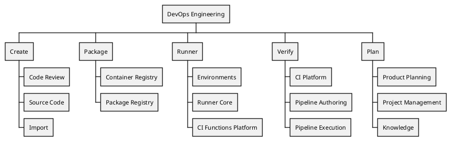

## ビジョン

**私たちの目標は単に機能をリリースすることではなく、それらが成功裏に定着して顧客に真の価値を提供することを確実にすることです。** 信頼性と運用の容易さを確保しながら、多様な顧客ニーズに対応するスケーラビリティを維持し、すべてのユーザーグループの期待を超える高品質な基準を満たす業界最高のプロダクトを開発することを目指しています。チームメンバー全員が、あらゆる活動においてターゲット顧客とサポートする複数のプラットフォームを念頭に置く必要があります。

大企業という主要顧客の[組織アーキタイプ](/handbook/product/personas/organization-archetype/)に対して、特にスケーラビリティ、適応性、シームレスなアップグレードパスにおいてプロダクトを優れたものにします。機能を設計・実装する際は、常にすべてのデプロイオプション（セルフマネージド、Dedicated、Software as a Service（SaaS））の互換性を念頭に置いてください。

[私たちの価値観](/handbook/values/)と[独自の働き方](/handbook/company/culture/all-remote/guide/)を維持しながら、プロダクトと顧客の成長をサポートする成果を推進するために、技術的で多様なグローバルチームを育成します。

## ミッション

GitLab の非同期での独自の働き方、ハンドブックファースト方式、開発するプロダクトの活用、価値観への明確な焦点により、非常に高い生産性が実現されます。顧客満足度を最大化するために、プロダクトの品質、ユーザビリティ、信頼性を継続的に向上させることに注力しています。コミュニティ貢献と顧客インタラクションは、効率的で効果的なコミュニケーションに依存しています。私たちはデータ駆動型で、顧客体験を最優先とし、1つのセキュアで信頼性の高い世界トップの DevSecOps プラットフォームを提供するオープンコア組織です。新しい基準を設定し、イノベーションを推進し、DevSecOps の限界を押し広げ、顧客に継続的に卓越した成果を提供することに参加してください。

### 複雑なワークフローをシンプルで直感的にする

私たちは**プラットフォームの優位性そのもの**です — [Siemens](https://about.gitlab.com/customers/siemens/)が20,000人の断片化した開発者をまとめ、私たちのプロダクトの適用によりそれを40,000人まで成長させた事例のように、比類のない DevOps 加速と効率性を提供します。私たちのプロダクトは、シンプルなニーズを持つスタートアップから高度な CI/CD ワークフローと複雑なリポジトリ管理を持つエンタープライズまでシームレスにスケールします。私たちのソリューションは市場投入までの時間を短縮し、信頼性によりチームがメンテナンスではなくイノベーションに集中できます。

#### 重点領域

1. **盤石な基盤を持つ**
   - リアクティブ（バグバーンダウン）からプロアクティブ（スケーラビリティの限界を押し広げる）への移行
   - エンタープライズグレードの品質を提供するための品質基準の引き上げ
   - ゴールデンジャーニーの最適化

2. **競合他社からの切り替え**
   - 高価値領域での的を絞った競合勝利
   - 統合されたワークフローと運用の複雑さの低減
   - 顧客ファーストの考え方

3. **イノベーションと創造性**: GitLab を AI ネイティブソフトウェア開発のプレミアプラットフォームとして位置付け:
   - エージェント型 AI のカンパニービジョンへの貢献
   - 主要な差別化要因
   - プラットフォームインテリジェンス

高パフォーマンスのチームが繁栄し、イノベーションを起こし、効率的に実行できる環境を作り、最終的に市場での GitLab の競争優位性を推進することを目指しています。

### 盤石な基盤を持つ

品質へのアプローチは3フェーズで進化し、最終的には使いやすさ、直感性、有用性を目標とします。進化した顧客基盤をサポートするために[深さと安定性](/handbook/engineering/#expand-customer-focus-through-depth-and-stability)を最優先に考えます。

#### 品質への3フェーズ

1. リアクティブからプロアクティブな品質管理への移行
    - インシデント対応の安定化
    - エラーバジェット管理の標準化
    - 重大な Issue バックログのクリア
2. 顧客の期待に応えるための品質基準の引き上げ
    - より高い品質基準の実装（99.9% → 年間8.76時間のダウンタイム）
    - 顧客が待ち望んでいた改善の提供
    - 「十分」から「信頼できる品質」への移行
3. ゴールデンジャーニーとワークフローの最適化
    - 主要なユーザーパスの特定と完成
    - 重要なワークフローでのシームレスなエクスペリエンスの作成
    - エクスペリエンス卓越性に関する組織全体の整合

## 組織



### オンボーディング

GitLab へようこそ！ご参加を楽しみにしています。
入門に役立つキュレートされたリソースをご紹介します:

- [エンジニアとして参加する](/handbook/engineering/workflow/developer-onboarding/)
- [エンジニアリングマネージャーとして参加する](/handbook/engineering/workflow/development-onboarding/manager/)
- [Core DevOps GitLab プロジェクト](https://gitlab.com/gitlab-org/core-devops)
- [Core DevOps Google カレンダー](https://calendar.google.com/calendar/u/0?cid=Y19jYjBhZmU1Y2Y4MTZiYmI3Mzk4OTM0MTQ3MGIwMzFkZDY3NjNjYWQ3MTI3MGQ1MjllYTA3YjM3NzAyMGRjYzdkQGdyb3VwLmNhbGVuZGFyLmdvb2dsZS5jb20)

### ミーティング

| **ミーティング（内部のみ、アクセス制限あり）** | **頻度** | **DRI** | **トピック** |
|-------|--------|-------|----------|
| [SaaS 可用性](/handbook/engineering/#saas-availability-weekly-standup) | 週次 | Infrastructure | インシデントの是正措置、フィーチャーチェンジロックのステータス、期限超過の Infradev、エラーバジェット、またはセキュリティ更新 |
| DevOps 週次 | 週次 | Michelle Gill | 標準の議論、質問、支援依頼、FYI、プロセス改善、エンジニアリング戦略でのコラボレーション、イベント計画、リーダーシップコミュニケーションの伝達、広範なイニシアチブのブレインストーミング、OKR |
| [プロダクト品質スタンドアップ](https://docs.google.com/document/d/18N4_OmA4JLG5wxZfq2irYk6FUVNXP-Arkk691lm35vo/edit?tab=t.0#heading=h.yoksgpvi6fh) | 週次 | Michelle Gill | グループ間での共有品質目標（バグバーンダウン、インストルメンテーション）の調整 |
| Core DevOps 全員参加 | 隔月 | Anand、Michelle、Marcel | 進捗の振り返り、今後のビジョンの予測、行動喚起 |

### Slack チャンネル

- [#core_devops](https://gitlab.enterprise.slack.com/archives/CG7FPF4KT)
- [#devops-principals](https://gitlab.enterprise.slack.com/archives/C09ADSQA22F)

### パフォーマンス指標

目標とビジョンをより適切に測定するために、[パフォーマンス指標をここで](https://internal.gitlab.com/handbook/engineering/devops/performance-indicators)追跡しています。

### 人事プロセス

1. [昇進](/handbook/people-group/promotions-transfers)
   - [キャリブレーション準備](/handbook/people-group/promotions-transfers/#calibration)
1. [タレント評価](/handbook/people-group/talent-assessment/)
1. [コントラクター採用](/handbook/engineering/workflow/development-processes/hiring-contractors)
1. [表彰と受賞](/handbook/engineering/recognition/)
1. [学習と開発](/handbook/people-group/learning-and-development/)
   - [GitLab でのメンタリング](/handbook/people-group/learning-and-development/mentor/)
   - [セキュリティ意識向上トレーニング](/handbook/security/security-assurance/governance/sec-awareness-training/#what-will-be-covered-in-the-training)
   - [GitLab パフォーマンステスト](/handbook/engineering/testing/performance-tools/)
   - [GraphQL API 入門](https://docs.gitlab.com/ee/api/graphql/getting_started.html)
   - [データベースエンジニアリング](/handbook/engineering/development/database/)

## 作業方法

### 計画と優先事項

目標とビジョンをより適切に達成するために、[R&D インターロックプロセス](/handbook/product-development/how-we-work/r-and-d-interlock)に従っています。

Core DevOps は作業を GitLab の[トップ5カンパニー目標](https://gitlab.com/groups/gitlab-operating-model/-/epics?sort=created_date&state=opened&parent_id=None&label_name%5B%5D=Operating%20Model%3A%3A%201%20-%20Company%20Objective&first_page_size=20)と整合させています。これは E-Group と[オペレーティングモデル](https://internal.gitlab.com/handbook/company/gitlab-operating-model/)からカスケードしています。私たちの戦略的優先事項は[Core DevOps 計画プロジェクト](https://gitlab.com/gitlab-org/core-devops/planning/issues)で透明性を持って追跡されており、カンパニー優先事項と Core DevOps の整合の概要を提供する[計画概要](https://gitlab.com/gitlab-org/core-devops/planning/issues/-/work_items/1)も含まれています。

### インシデント管理

1. [エンジニアリングマネージャーおよび Staff+](/handbook/engineering/infrastructure-platforms/incident-management/incident-manager-onboarding/#incident-manager-participants) は Tier 1（プロダクト全体）インシデントリード（インシデントマネージャーとも呼ばれる）として直接インシデント管理に貢献します。
1. 資格基準を満たすすべてのエンジニアは Core DevOps [Tier 2 オンコールプロセス](/handbook/engineering/devops/oncall/)を通じてインシデント管理に貢献します。
1. 一部のエンジニアリングマネージャーは Core DevOps [Tier 2 オンコールプロセス](/handbook/engineering/devops/oncall/)の[ローテーションリーダー](/handbook/engineering/devops/oncall/rotation-leader/)を務めます。

個人が[複数のローテーション](/handbook/engineering/devops/oncall/coverage-and-scheduling/#multiple-rotations)に参加することは期待していません。

### 可用性

[エラーバジェット](/handbook/engineering/error-budgets)は週次および月次で追跡され、[.com 可用性](/handbook/engineering/error-budgets/#budget-allocation)に合わせたサービスの信頼性を把握します。特定のチームのエラーバジェットが2週間「赤」になった場合、緑で安定するのに十分な週数が経過する（最低で完全な28日間）まで、[FY26 プロダクト品質スタンドアップ](https://docs.google.com/document/d/18N4_OmA4JLG5wxZfq2irYk6FUVNXP-Arkk691lm35vo/edit?tab=t.0#heading=h.yoksgpvi6fh)で報告されます。

### クロスファンクショナルコラボレーション

他チームのプロダクトステージのコードに影響する Issue は、作業開始前に関連するプロダクト、UX、エンジニアリングマネージャーと協力的にアプローチし、そのステージを担当するエンジニアによってレビューされる必要があります。

これは、そのコードベースエリアを担当するチームが加えられる変更の影響を認識し、ステージのロードマップに合う方法でアーキテクチャ、保守性、アプローチに影響を与えられるようにするために行います。

#### アーキテクチャコラボレーション

クロスファンクショナルまたは部門横断的なアーキテクチャコラボレーションが必要な場合、[GitLab アーキテクチャ進化ワークフロー](/handbook/engineering/architecture/)に従う必要があります。

#### フォローザサンカバレッジ

グローバルリージョンとタイムゾーンにわたるクロスファンクショナルコラボレーションが必要な場合、シームレスなグローバルコラボレーションを確保するために[フォローザサンカバレッジ](/handbook/engineering/workflow/development-processes/follow-the-sun-coverage/)アプローチの採用が推奨されます。

#### セキュリティ脆弱性の処理

1. 依存関係（例: gems、libs、ベースイメージなど）を導入または使用している開発グループが、その依存関係に対して検出された脆弱性の解決に責任を持ちます。
2. ベースイメージを提供するビジネス選択ベンダー（例: RHEL の UBI8）については、そのパッチを待つか、実行可能な解決策として逸脱要求（DR）をログに記録する必要があります。Threat Management チームが開発した自動化ツール [VulnMapper](https://gitlab.com/gitlab-com/gl-security/product-security/vulnerability-management/vulnerability-management-internal/vulnmapper/-/tree/main) はベンダー依存関係の DR を大規模に作成できますが、DR を手動で報告する必要があるケースはまだあります。
3. 割り当てられた開発グループは、初期の割り当てが不正確であった場合、[共有責任 Issue](/handbook/product-development/how-we-work/issue-triage/#shared-responsibility-issues) および/または[共有責任機能](/handbook/product/categories/#shared-responsibility-functionality)のプロセスに従って Issue をリダイレクトできます。

#### 共有サービスとコンポーネントの所有権

GitLab アプリケーションは PostgreSQL データベース、Redis、Sidekiq、Prometheus などの多くの共有サービスとコンポーネントの上に構築されています。これらのサービスは各機能の Rails コードベースに密接に組み込まれています。機能リクエスト、インシデントエスカレーション、技術的負債、バグ修正など、需要が生じた際に DRI を特定する必要が頻繁にあります。以下は、件名に最も精通した関係者をすぐに見つけるためのガイドです。

##### 所有権モデル

柔軟性を最大化するために、特定の共有サービスとコンポーネントに最適なものを選択できるいくつかのモデルがあります。

1. 特定チームによる集中型
    1. 単一グループが新機能リクエスト、バグ修正、技術的負債を含む特定の共有サービスのバックログを所有します。プロダクトマネージャーの対応者がいる場合とない場合があります。
    1. 単一グループは特定のチームであり、エンジニアリングマネージャーがいて、すべてのドメインオーナー個人がこのチームに在籍しています。DRI はエンジニアリングマネージャーです。
    1. この単一グループは、バックログのグルーミングと計画において密接かつ定期的にコラボレーションすることが期待されます。
    1. このモデルはプロダクト管理の対応者からの合意が必要な場合があります。
    1. このモデルは活発な開発が行われている専門ドメインに適している場合があります。
1. 仮想チームによる集中型
    1. 単一グループが新機能リクエスト、バグ修正、技術的負債を含む特定の共有サービスのバックログを所有します。プロダクトマネージャーの対応者がいる場合とない場合があります。
    1. 単一グループは仮想チームであり、様々なエンジニアリングチームのエンジニアで構成されています（例: メンテナーや専門家）。この仮想チームには通常エンジニアリングマネージャーがいません。DRI は、エンジニアリングマネージャーでない可能性のあるグループ内の任命された人です。
    1. この単一グループは、バックログのリファインメントと計画において密接かつ定期的にコラボレーションすることが期待されます。
    1. このモデルはメンテナンスモードの専門ドメインに適している場合があります。
1. コレクティブ
    1. コレクティブは既存チームの個人で構成され、共通の関心や責任を中心に自発的に集まりますが、ワーキンググループとは異なり永続的に存在する場合があります。共通の関心は特定の技術やシステムである場合があります。コレクティブメンバーは、自分たちが統治する対象を弱くオーナー、改善、または方向づけするための集団的な責任感を感じています。
    1. これは仮想チームの弱い形式ですが、完全に分散化されたモデルよりも多くの構造を導入します。対象が横断的な影響と広いリーチを持ち、どの特定のチームにも明確に割り当てられない場合に、何らかの所有権が望ましい場合に適切です。
    1. コレクティブにはプロダクトマネージャーやエンジニアリングマネージャーがおらず、完全に自己管理されています。
    1. コレクティブのメンバーは定期的に同期し、共通の関心についてお互いに情報を共有します。問題領域はコレクティブ内で特定され形式化されますが、コレクティブのバックログに記録されません。代わりに、解決が最も必要なチームに向けてタスクを前進させるべき DRI が割り当てられます。これにより、作業が公平に分散され、互いに優先事項を争う2つのバックログが存在しないことを確保します。
    1. コレクティブは、プロダクトとエンジニアリングの異なる領域からの多様な個人で構成される場合に最もよく機能します。情報がコレクティブ内でまず交換され、その後コレクティブ内の個人によって各チームに持ち帰られる知識共有ハブとしても機能します。
1. 分散型
    1. 特定の機能を実装したり、共有サービスの特定の機能を活用したりするチームが、ローカル開発環境から本番環境へのデプロイ、デプロイ後の継続的メンテナンスまで、変更に責任を持ちます。共有サービスの一部または全体を所有する、開発全体にわたる単一の DRI はいません。
    1. 特定の専門ドメイン向けに専門チームが存在する場合がありますが、彼らの役割はそのドメインのすべての変更をゲートするのではなく、他のエンジニアリングチームのためにテストとトラブルシューティングのための堅固な基盤と優れたツールを構築することで、スケーラビリティ、可用性、パフォーマンスを可能にすることです。

##### 共有サービスとコンポーネント

以下の共有サービスとコンポーネントは GitLab の[プロダクトドキュメント](https://docs.gitlab.com/ee/development/architecture.html)から抽出されています。

| サービスまたはコンポーネント | 所有権モデル | DRI とグループ（集中型のみ） | 追加メモ |
| -------------------- | --------------- | ---------------------- | ---------------- |
| Alertmanager | 特定チームによる集中型 | @twk3<br />[Distribution](/handbook/engineering/infrastructure-platforms/gitlab-delivery/distribution/) | Distribution チームはパッケージングとバージョンアップグレードに責任を持ちます。機能的な問題はベンダーに送ることができます。 |
| Certmanager | 特定チームによる集中型 | @twk3<br />[Distribution](/handbook/engineering/infrastructure-platforms/gitlab-delivery/distribution/) | Distribution チームはパッケージングとバージョンアップグレードに責任を持ちます。機能的な問題はベンダーに送ることができます。 |
| Consul | | | |
| Container Registry | 特定チームによる集中型 | Package | |
| Email - インバウンド | | | |
| Email - アウトバウンド | | | |
| Elasticsearch | 特定チームによる集中型 | @changzhengliu<br />Global Search | |
| GitLab K8S Agent | 特定チームによる集中型 | @nicholasklick<br />Configure | |
| GitLab Pages | 特定チームによる集中型 | @vshushlin<br />[Knowledge](/handbook/engineering/devops/plan/knowledge/) | |
| GitLab Rails | 分散型 | | 各コントローラーの DRI はクラスで指定されたフィーチャーカテゴリによって決定されます。[app/controllers](https://gitlab.com/gitlab-org/gitlab/-/tree/master/app/controllers) と [ee/app/controllers](https://gitlab.com/gitlab-org/gitlab/-/tree/master/ee/app/controllers) |
| GitLab Shell | 特定チームによる集中型 | @andrevr<br />[Create:Source Code](/handbook/engineering/devops/create/source-code/backend/) | [参考](/handbook/product/categories/#source-code-group-1) |
| HAproxy | 特定チームによる集中型 | [Infrastructure](/handbook/engineering/infrastructure-platforms/production-engineering/networking-and-incident-management/) | |
| Jaeger | 特定チームによる集中型 | @dawsmith<br />Infrastructure:Observability | Observability チームが[初期実装/デプロイ](https://gitlab.com/groups/gitlab-com/gl-infra/-/epics/210)を行いました。 |
| LFS | 特定チームによる集中型 | @andr3<br />[Create:Source Code](/handbook/engineering/devops/create/source-code/backend/) | |
| Logrotate | 特定チームによる集中型 | @plu8<br />[Distribution](/handbook/engineering/infrastructure-platforms/gitlab-delivery/distribution/) | Distribution チームはパッケージングとバージョンアップグレードに責任を持ちます。機能的な問題はベンダーに送ることができます。 |
| Mattermost | 特定チームによる集中型 | @plu8<br />[Distribution](/handbook/engineering/infrastructure-platforms/gitlab-delivery/distribution/) | Distribution チームはパッケージングとバージョンアップグレードに責任を持ちます。機能的な問題はベンダーに送ることができます。 |
| MinIO | 分散型 | | 一部の Issue はグループ固有の Issue に分解できます。一部の Issue は DRI を見つけるためにユーザーまたは開発者への影響を特定する追加作業が必要な場合があります。 |
| NGINX | 特定チームによる集中型 | @plu8<br />[Distribution](/handbook/engineering/infrastructure-platforms/gitlab-delivery/distribution/) | |
| Object Storage | 特定チームによる集中型 | @lmcandrew<br />[Production Engineering](/handbook/engineering/infrastructure-platforms/production-engineering/) | |
| Patroni<br />Geo セカンダリクラスター以外 | 特定チームによる集中型 | @plu8<br />[Distribution](/handbook/engineering/infrastructure-platforms/gitlab-delivery/distribution/) | |
| Patroni<br />Geo セカンダリスタンバイクラスター | 特定チームによる集中型 | @luciezhao<br />[Geo](/handbook/engineering/infrastructure-platforms/tenant-scale/geo/) | |
| PgBouncer | 特定チームによる集中型 | @plu8<br />[Distribution](/handbook/engineering/infrastructure-platforms/gitlab-delivery/distribution/) | |
| PostgreSQL<br />フレームワークとツール | 特定チームによる集中型 | @alexives<br />[Database](/handbook/engineering/data-engineering/database-excellence/database-frameworks/) | 基本的なアーキテクチャ、テストユーティリティ、その他の生産性ツールなど、PostgreSQL の開発部分に特有です。 |
| PostgreSQL<br />GitLab プロダクト機能 | 分散型 | | 機能固有のスキーマ変更やパフォーマンスチューニングなどの例 |
| Prometheus | 分散型 | | 各グループが独自のメトリクスを維持します。 |
| Puma | 特定チームによる集中型 | @pjphillips<br />[Cloud Connector](/handbook/engineering/infrastructure/team/cloud-connector/) | |
| Redis | 分散型 | | DRI は Sidekiq と同様で、クラスで指定されたフィーチャーカテゴリによって決定されます。[app/workers](https://gitlab.com/gitlab-org/gitlab/-/tree/master/app/workers) と [ee/app/workers](https://gitlab.com/gitlab-org/gitlab/-/tree/master/ee/app/workers) |
| Sentry | 分散型 | | DRI は GitLab Rails と同様で、クラスで指定されたフィーチャーカテゴリによって決定されます。[app/controllers](https://gitlab.com/gitlab-org/gitlab/-/tree/master/app/controllers) と [ee/app/controllers](https://gitlab.com/gitlab-org/gitlab/-/tree/master/ee/app/controllers) |
| Sidekiq | 分散型 | | 各ワーカーの DRI はクラスで指定されたフィーチャーカテゴリによって決定されます。[app/workers](https://gitlab.com/gitlab-org/gitlab/-/tree/master/app/workers) と [ee/app/workers](https://gitlab.com/gitlab-org/gitlab/-/tree/master/ee/app/workers) |
| Workhorse | 特定チームによる集中型 | @andrevr<br />[Create:Source Code](/handbook/engineering/devops/create/source-code/backend/) | |

## 顧客サポート

### サポートとの協力

DevOps がサポートと協力することで、顧客がプロダクトをどのように使用しているか、および直面している課題について非常に貴重な洞察が得られます。プロセスを効率化するためのヒント:

- [Zendesk へのアクセスを取得](/handbook/support/internal-support/#requesting-a-zendesk-light-agent-account)して、顧客からの質問とコミュニケーションを確認できるようにします。
- 常に顧客に「コピー＆ペーストして送れる」形式で回答を書きます。
- 回答にドキュメントを参照し、必要に応じて GitLab ドキュメントを更新します。
- 既存の Issue やエピックを参照して、透明性の価値を強調し、顧客からの参加を促します。
- サポートと開発のコラボレーションプロセスやワークフローが不明な場合は、ハンドブックページ[GitLab 開発チームに正式な支援を依頼する方法](/handbook/support/workflows/how-to-get-help#how-to-formally-request-help-from-the-gitlab-development-team)を参照してください。

### 顧客アカウントエスカレーションの調整

開発が DRI として、または[顧客アカウントエスカレーション](/handbook/customer-success/csm/escalations/)に積極的に参加している場合は、以下を考慮してください:

- プロダクト管理と開発リーダーに確認して、その約束が他のコミットメントに与える可能性のある影響を確認せずに顧客にコミットしないよう注意してください。
- 顧客は変更のメリットをいつ確認できるかを知りたがります。GitLab の期日とマイルストーンを追跡・予測するプラクティス、ワークフローと関連ラベル、コードレビュータイムラインの予測可能性、GitLab.com へのリリースとセルフホスト顧客向けリリースの異なるタイムライン、フィーチャーフラグの使用方法に精通していない場合があります。

```markdown
* 顧客はしばしば GitLab と同じレベルで非同期コミュニケーションを使用していません。私たちのプラクティスを顧客に教育し、全員に合った非同期と同期のコミュニケーション方法とケイデンスを見つけるために適応してください。
* 顧客が関心のあるエピック、Issue、マージリクエストで私たちと協力することを奨励します。機密のものへのアクセス権がない場合や、この公開フォーラムでの協力に快適でない、またはできない場合があることを念頭に置いてください。
* エピック、Issue、マージリクエストによる協力のバックアップとして、顧客との協力に Google ドキュメントを活用することを検討してください。
* 協力のために、「1つの Slack チャンネルアクセスリクエスト」を介して顧客を Slack に追加する共有 Slack チャンネルを活用することを検討してください。[例](https://gitlab.com/gitlab-com/team-member-epics/access-requests/-/issues/16192)
* ミーティングでは、なぜ録音したいかを顧客に伝え、録音してよいか確認してください。法的要件に対応するため、顧客とのミーティングの録音スケジュールに [Chorus](/handbook/sales/field-operations/sales-operations/go-to-market/chorus/) の使用を検討してください。
* ミーティングでは、ミーティングの前後と最中にメモを取る理由を顧客に伝えてください。この方法でのコラボレーションが自然でない場合があります。
* 顧客が追跡しているすべての Issue に適切な優先度ラベルが適用されていることを確認してください。
* 定期的なミーティングのアジェンダでは、顧客が追跡しているアイテムを優先度順にトップに置き、各アイテムのステータス、次のステップ、顧客の DRI、GitLab の DRI を確認します。定期的にミーティングで話し合ってください。
定期的なミーティングの前に、DRI であるアイテムのステータスを更新するよう Slack でチームメンバーに促してください。
* ミーティングノートと録音へのリンクを顧客エスカレーションの Slack チャンネルに投稿し、参加しなかった人がノートと録音が確認可能であることを知れるようにしてください。
* ミーティングでアクションアイテムがある場合（出席しているかどうかにかかわらず）、Issue や MR（または Slack）でその人にタグ付けして確認できるようにしてください。
```

### 影響範囲の大きい作業の影響を最小化する

私たちのチームは単一のアプリケーション内の別々のグループで作業しているため、変更が他のグループやアプリケーション全体に影響を与える可能性が高くなっています。全体的なシステム品質だけでなく、可用性、信頼性、パフォーマンス、セキュリティにも影響を与えないよう注意する必要があります。

例えば、ユーザー認証やログインへの変更は、プロジェクト管理や Issue の表示など、一見無関係なサービスに影響を与える可能性があります。

影響範囲の大きい作業とは、広範囲にわたる拡散的な影響を持つ作業であり、以下の領域への変更を含みます:

1. ユーザーの高い割合が利用する
1. サービス全体に影響する
1. アプリケーションの複数の領域に触れる
1. 法律、セキュリティ、コンプライアンスの結果を引き起こす可能性がある
1. 収益に影響を与える可能性がある

グループ、プロダクト領域、機能、またはマージリクエストが上記の説明のいずれかに当てはまる場合、影響を理解し最小化するための努力をしてください。影響範囲の大きい作業をリリースする場合は、[ロールアウト計画](/handbook/engineering/workflow/development-processes/rollout-plans)を使用してください。その変更の種類に対してワンオフのプロセスを作成することも検討する必要がある場合があります:

- [ロールアウト計画手順の作成](/handbook/engineering/workflow/development-processes/rollout-plans)
  - ロールアウト計画のリスクを軽減する方法を検討する
  - 進行中のロールアウトを監視する方法を文書化する
  - ロールアウトの成功を判断するために使用するメトリクスを説明する
  - キャッシュされたデータや以前は有効な状態だったデータなど、ロールアウト中の異なるデータ状態を考慮する
- フィーチャーフラグの使用を要求する（[例](https://gitlab.com/gitlab-com/www-gitlab-com/-/merge_requests/88298)）
- 推奨プロセスをこの変更に必要なプロセスに変更する（ドメイン専門家レビューなど）
- 承認前に作業の手動テストを要求する

#### 特定されたエリア

上記の定義を満たすエリアがすでに特定されており、作業でのアプローチを変更することを検討する場合があります:

| エリア | 理由 | 特別なワークフロー（ある場合） |
| ---------------- | --------------------------- |-----------------------------------------------------------------------------------------------------------------------|
| データベースマイグレーション、ツール、複雑なクエリ、メトリクス | アプリケーション全体への影響<br/><br/>データベースは重大なコンポーネントであり、重篤な劣化やサービス停止は S1 インシデントにつながります。 | [ドキュメント](https://docs.gitlab.com/ee/development/database_review.html#general-process) |
| Sidekiq の変更（ワーカーの追加または削除、キューの名前変更、引数の変更、必要な作業プロファイルの変更） | 複数のサービスへの影響<br/><br/>Sidekiq シャードは作業プロファイル（例: メモリバウンド）に基づいてワーカーのグループを実行します。ワーカーが不適切に失敗すると、そのシャード上のすべての作業が止まる可能性があります。 | [ドキュメント](https://docs.gitlab.com/ee/development/sidekiq/compatibility_across_updates.html) |
| Redis の変更 | 複数のサービスへの影響<br/><br/>Redis インスタンスはフィーチャーカテゴリによってグループ化されていないデータセットを担当します。あるデータセットが誤設定された場合、その Redis インスタンスが失敗する可能性があります。 | |
| Package プロダクト領域 | トラフィックシェアの高い割合 | |
| Gitaly プロダクト領域 | トラフィックシェアの高い割合 | |
| [Create: Source Code プロダクト領域](/handbook/product/categories/features/#createsource-code-group) | トラフィックシェアの高い割合。Protected Branches、CODEOWNERS、MR Approvals、Git LFS、Workhorse、git over SSH / gitlab-sshd インターフェースに特別な注意が必要です。不明な場合は EM（@sean_carroll）または PM（@tlinz）に連絡してください。 | |
| Pipeline Execution プロダクト領域 | トラフィックシェアの高い割合 | [ドキュメント](https://docs.gitlab.com/ee/development/contributing/verify/) |
| Authentication and Authorization プロダクト領域 | アプリケーションの複数の領域に触れる | [ドキュメント](/handbook/engineering/development/sec/software-supply-chain-security/authorization/#code-review) |
| Compliance プロダクト領域 | 法律、セキュリティ、コンプライアンスの結果を引き起こす可能性がある | [コードレビュードキュメント](/handbook/engineering/development/sec/software-supply-chain-security/compliance/#code-review) |
| Workspace プロダクト領域 | アプリケーションの複数の領域に触れる | [ドキュメント](/handbook/engineering/architecture/design-documents/workspaces/) |
| [特定の Fulfillment プロダクト領域](/handbook/engineering/development/fulfillment/#revenue-impacting-changes) | 収益に影響を与える可能性がある | |
| ランタイム言語のアップデート | 複数のサービスへの影響 | [Ruby アップグレードガイドライン](https://docs.gitlab.com/ee/development/ruby_upgrade.html#ruby-upgrade-guidelines) |
| アプリケーションフレームワークのアップデート | 複数のサービスへの影響 | [Rails アップグレードガイドライン](https://docs.gitlab.com/ee/development/rails_update.html) |
| ナビゲーション | アプリケーション全体への影響 | [ナビゲーションに影響する変更の提案](/handbook/product/ux/navigation) |
