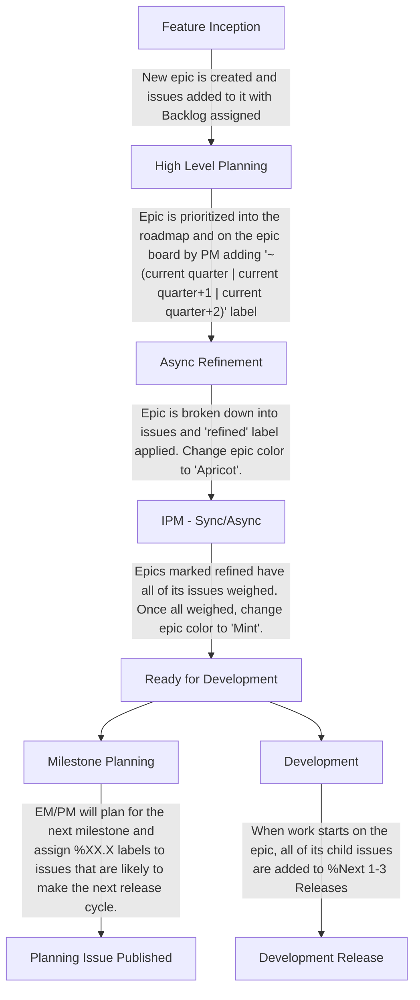

## 概要

このグループは [Dev サブ部門](/handbook/engineering/devops/)の [Create ステージ](/handbook/engineering/devops/create/)の一部です。私たちは 2 つの[カテゴリー](https://about.gitlab.com/direction/create/#categories-in-create)に注力しています: `Workspace` と `Web IDE` です。

### 🤴 グループの原則

<span id="-team-principles" data-message="alias anchor for old links"></span>

[Create:Remote Development の原則](principles/): Create:Remote Development グループの原則とは何か?

### 🚀 チームメンバー

以下の人々が Remote Development エンジニアリンググループの常任メンバーです:

**Engineering Manager & Engineers**



**Product, Design, Technical Writing, Security & Quality**



### ☕ カテゴリーの DRI

<span id="-team-category-dris" data-message="alias anchor for old links"></span>

| カテゴリー                 | DRI                                     |
|--------------------------|-----------------------------------------|
| Workspaces                |      |
| Web IDE                  |  |

### 📚 アーキテクチャ設計ドキュメント

設計ドキュメントは、アーキテクチャ設計ワークフローの中心となる主要な成果物です。設計ドキュメントは、前進する中で機能実装の指針となる技術的ビジョンと一連の原則を記述します。チームの足並みを揃えるためのガードレールとして機能します。

- [Workspaces](../../../architecture/design-documents/workspaces/_index.md)

### 🎓 新入社員

**Remote Development チームとそのテックスタックが成熟し続けるにつれて、新入社員のためのチーム固有のオンボーディングプロセスを持つことが不可欠です。** このチェックリストは、会社のオンボーディングから 2 週間後に始まり、私たちのチーム固有の主要な領域とプロセスを通じて新しいチームメンバーをガイドするように設計されています。私たちのミッション、不可欠なツール、Web IDE と Workspaces に関連するワークフローを扱います。既存のチームメンバーには、新入社員にとって正確で有用であり続けるよう、チェックリストを定期的にレビューし、不足している情報や更新された情報を貢献することを奨励しています。テンプレートは https://gitlab.com/gitlab-com/create-stage/remote-development/-/blob/main/.gitlab/issue_templates/remote-development-onboarding.md にあります。

### ☎️ 私たちへの連絡方法

状況に応じて、Remote Development グループに連絡する最も適切な方法は以下のとおりです:

- Slack チャンネル: [`#g_create_remote_development`](https://gitlab.slack.com/archives/CJS40SLJE)
- Slack グループ: `@create-remote-development-team`（チーム全体）と `@create-remote-development-engs`（エンジニアのみ）

### 🗣️ 顧客エンゲージメントの記録

顧客のニーズに対する理解とトレーサビリティを向上させ、フォローアップのアクションアイテムが体系的に実行されるようにするため、私たちは顧客エンゲージメントのメモを SSoT に記録したいと考えています。
以下の機密 Issue を使って、機能カテゴリーのすべての顧客エンゲージメントを記録してください:

- [Web IDE Customer Engagements](https://gitlab.com/gitlab-org/gitlab/-/issues/474518)
- [Workspaces Customer Engagements](https://gitlab.com/gitlab-org/gitlab/-/issues/473627)

これらのエピックは社内のチームメンバーのみを対象としています。フィードバックを提供したいユーザーの方は、Capturing User Feedback を参照してください。

### ユーザーフィードバックの記録

私たちはユーザーフィードバックを非常に重視しています! 2 つの機能カテゴリーのフィードバックと知見を記録するには、以下のエピックを使ってください:

- [Web IDE User Feedback & Insights](https://gitlab.com/groups/gitlab-org/-/epics/10543)
- [Workspaces User Feedback & Insights](https://gitlab.com/groups/gitlab-org/-/epics/12601)

チーム外のメンバーの方は、一般的なフィードバックや提案がある場合、これらのエピックに自由に Issue を作成してください。既存または進行中の機能に関連するフィードバックがある場合は、適切なエピックまたは Issue にコメントを残してください。

### 🤝 顧客コラボレーション Issue ダッシュボード

顧客のニーズについて顧客と協働するために、https://gitlab.com/gitlab-com/account-management の下にプライベートなコラボレーションプロジェクトを作成する必要がある場合があります。そのような Issue には、以下に記載されたダッシュボードに表示されるよう、適切なラベルを追加してください。

コメントテンプレートを使って、機能カテゴリーの適切なラベルを適用します:

- Workspaces - `/label ~"Category:Workspaces" ~"customer-collaboration"`

機能カテゴリーの顧客コラボレーション Issue ダッシュボードは以下で見つけられます:

- [Workspaces](https://gitlab.com/gitlab-org/gitlab/-/issues/517442)

### グループ指標ダッシュボード

[Create::Remote Development Group Metrics Tableau Workbook](https://10az.online.tableau.com/#/site/gitlab/workbooks/2067787/views)

### 📆 グループミーティング

<span id="-team-meetings" data-message="alias anchor for old links"></span>

**❗️重要**: 独自のドキュメントを持つ High Level Planning を除くすべてのミーティングでは、[Remote Development グループのミーティングドキュメント](https://docs.google.com/document/d/1b-dgL0ElBf_I3pbBUFISTYBG9VN02F1b3TERkAJwJ20/edit#)を使用し、ミーティングのメモとともに、最近行われた他の sync ミーティングのアジェンダ/メモ/録画への参照を記入する必要があります。これにより、人々がミーティングのメモを見つけやすくなります。

sync ミーティングのスケジュールは柔軟であり、必要な参加者に合わせて移動できることに注意してください。すべてのチームミーティングの最新スケジュールについては、[グループのカレンダー](https://calendar.google.com/calendar/u/0?cid=Z2l0bGFiLmNvbV92ZGc3bW04NDRuczVrN3JxZGlyMzM0N2YwOEBncm91cC5jYWxlbmRhci5nb29nbGUuY29t)を参照してください。

以下の表は、定例チームミーティングの目的と主要な詳細を簡潔に示しています:

| ミーティングタイトル                       | 内容                                                                                                       |
|-------------------------------------|------------------------------------------------------------------------------------------------------------|
| High Level Planning                 | 全体的な方向性を設定し、今後のリリースで取り組むべき優先度の高い Issue/エピックを検証します。  |
| Iteration Planning Meeting (IPM)    | スケジュールされた Issue をレビューし、次のマイルストーンの作業を見積もります。                                                |
| Remote Development Retro Call       | 非同期レトロからのフィードバックをレビューし、効率を改善するためのアクションアイテムと次のステップを特定します。              |
| Engineering Sync                    | エンジニアリングのトピックとブレインストーミングについて議論します。トピックがなければキャンセル。APAC/AMER に適した時間帯を交互に行います。 |
| Remote Development Pairing          | エンジニア向けのペアリングセッション。トピックがなければキャンセル。                                                    |

## 📦 グループのプロセス

<span id="-team-processes" data-message="alias anchor for old links"></span>

### 🖖 週次 EM アップデート

毎週、グループの EM は、チームが認識すべき最も重要な項目をキャプチャーすることを目的とした週次ステータスアップデートの Issue を提供します。これらは[こちら](https://gitlab.com/gitlab-com/create-stage/remote-development/-/issues/?sort=created_date&state=all&label_name%5B%5D=Weekly%20Team%20Announcements&first_page_size=20)で見つけられます。

### 😷 Issue ワークフローの衛生

Create:Remote Development グループでは、[triage bot](https://gitlab.com/gitlab-org/quality/triage-ops/-/tree/master/policies/groups/gitlab-org/remote-development) を介した自動 Issue 衛生システムを活用しています。これは Issue とラベルの衛生が守られるようにするのに役立ちます。

### 📝 調査と大きな Issue の分解

タスクが大きすぎる、未知の要素が多すぎる、または概念実証（POC）が必要な場合は、より小さな調査タスクや POC Issue に分解する必要があります。これらのタスクはスコープを明確にし、リスクを減らし、実装を進めるために必要なステップを特定するのに役立ち、理想的には単一のマイルストーンに収まるべきです。

1. **調査 Issue を作成する:**
   - **目的:** 必要な作業を調査・研究し、ドキュメント化または分解します。調査している **中心的な問いや問題を必ず定義** してください。
   - **重み:** 調査、POC、または分解タスクはデフォルトで 3 にします。異なる重みが必要な場合は、PM/EM/チームのステークホルダーと議論してください。
   - **ラベル:** Issue に ~spike ラベルを割り当てます。
   - **アップデート:** 調査は **集中して取り組む 3 営業日** に制限されます。
     - 3 日目またはそれより早く、調査者は調査結果と提案する次のステップを共有します。主要なステークホルダーと足並みを揃えて意思決定するために sync ミーティングの利用を検討してください。ミーティングが実現できない場合は、調査結果をまとめた短い録画動画でも構いません。
   - アップデートからのフィードバックに応じて、これらの調査にさらに時間を割り当てるか、手元の情報に基づいてうまくいくもので決着させるかを決められます。

1. **分解してクローズする:**
   - 調査が完了したら、調査結果をまとめ、与えられたエピック内で作業を実行可能で洗練された Issue に分解します。
   - 成果には以下を含めるべきです:
     - **アーキテクチャプラン**: 高レベルの技術的方向性、品質目標（パフォーマンス、セキュリティなど）、支援するアプローチ。
     - **イテレーションプラン**: 明確にスコープ化され洗練された Issue への作業の分解。
   - これらのプランをエピックの説明に追加し、調査 Issue をクローズします。

### 📝 Issue のガイドライン

これらのガイドラインは、グループ内で作業を計画・スケジュールするために使用するすべての Issue に適用されます。エンジニアは必要に応じて具体的な実装 Issue を定義できますが、Issue の全体的な目標は以下のとおりです:

- 広範なコミュニティを主要なオーディエンスとして扱います（[根拠については関連する要約](community-contributions/#treat-wider-community-as-primary-audience)を参照）。
- 成果物の結果を説明する意味のある **タイトル** を提供します。
  - ✅ `Add a cancel button to the edit workspace form page`
  - ✅ `Automatically save Devfile changes after 2 seconds of inactivity`
  - ❌ `Make WebIDE better`
- Issue の目標を明確に説明する意味のある説明を提供し、必要に応じて技術的な詳細を提供します。
- 重要な実装ステップや、Issue の一部として小さなタスクを作成する他の有用な方法がある場合は、Issue の説明の一部としてチェックリストを使ってください。
- Issue には重みが割り当てられているべきです。[Iteration Planning](#4-iteration-planning-meeting)を参照してください。

## 🤖 計画プロセス

<span id="-remote-development-planning-process" data-message="alias anchor for old links"></span>
<span id="remote-development-planning-process-overview" data-message="alias anchor for old links"></span>

計画と提供の見積もりの精度を向上させるため、私たちは GitLab Product Development Flow の [Plan](/handbook/product-development/how-we-work/product-development-flow/#build-phase-1-plan) と [Build & Test](/handbook/product-development/how-we-work/product-development-flow/#build-phase-2-develop--test) フェーズの一部を取り入れました。私たちのチームは、[XP](https://www.amazon.com/Extreme-Programming-Explained-Embrace-Change/dp/0321278658) と [Scrum](https://www.scrum.org/resources/blog/agile-metrics-velocity) にインスパイアされた、軽量でベロシティベースのアプローチを使用しています。これにより、明確で現実的な予測を提供しつつ、柔軟性を保てます。

目標は XP や Scrum を完全に採用することではなく、主にイテレーション計画と過去のベロシティ追跡を中心に、私たちにとってうまくいく部分を取り入れることです。見積もりを ["Yesterday's Weather"](https://gitlab.com/gitlab-com/www-gitlab-com/uploads/283f165896e2851bdc324f790d9c90e4/Screen_Shot_2023-03-27_at_6.16.51_PM.png)（チームの最近の提供履歴）に基づかせることで、スコープを capacity により適切に合わせ、何をいつ出荷できるかについて情報に基づいた意思決定ができます。

このプロセスは、進化する優先順位をナビゲートし、計画のオーバーヘッドを減らし、私たちが取り組んでいることについて透明性を保つのに役立ちます。

### プロセスのフェーズ



#### 1. Feature Inception

アイデアはどこからでも、誰からでも生まれます。アイデアがある場合:

1. [Workspaces](https://gitlab.com/groups/gitlab-org/-/epics/12601) または [Web IDE](https://gitlab.com/groups/gitlab-org/-/epics/10543) の User Feedback & Insights エピックの下の Issue に記録します。
1. Issue タイトルの先頭に「Feedback:...」または「Idea:...」を付けます。
1. Issue を %"Backlog" マイルストーンに追加します
1. これを [Workspaces](https://docs.google.com/document/d/1Xfr5YHdStC7_3kVAognj0SxbXlcavj2ofgp1mH2zH4U/) または [Web IDE](https://docs.google.com/document/d/18l9wI2tRcFgvX8nJfmO3qVG9-smEQL0VwDh5aOOZj0s/) の High Level Planning アジェンダにディスカッションのトピックとして追加します。

#### 2. High Level Planning

**High Level Planning** ミーティングは、新規および進行中の作業を特定し、議論し、優先順位を付けるオープンなフォーラムです。チームメンバーは、事前にアジェンダに追加することでトピックを提案できます。これは [GitLab Product Flow の Validation Track](/handbook/product-development/how-we-work/product-development-flow/#validation-track)に類似しています。Issue を洗練・優先順位付けし始める前に、同じ [Validation Goals & Outcomes](/handbook/product-development/how-we-work/product-development-flow/#validation-goals--outcomes)を達成する必要があるためです。このミーティングは通常以下を扱います:

- **新機能のアイデア**: ロードマップで検討するための新しい作業の提案。
- **ロードマップの調整**: 進行中の作業の並べ替え、移動、再優先順位付け。
- **バグ/技術的負債のエスカレーション**: 緊急の対応やタイムラインの調整が必要な Issue。

このミーティングは、最も重要な作業を明確にし、何を優先すべきかについて意思決定をするのに役立ちます。

**ミーティング後のアクション:**

- **ロードマップの評価:** ミーティング後、Product Manager は提案された変更を評価し、作業の優先順位付けの信頼できる情報源として機能するエピックボードを更新します。

- **エピックの作成と優先順位付け:** 機能はエピックに変換され、Product Manager は機能作業の順序を決定し、作業を開始すべき四半期に応じて `~"(current quarter | current quarter+1 | current quarter+2)"` ラベルで今後の作業をマークします。四半期の日付については [Fiscal Year](/handbook/finance/#fiscal-year)を参照してください。

- **ボード順序のガイドライン:** Engineering Manager または Product Manager に最初に相談せずにエピックボードの項目の順序を変更しないでください。

#### 3. Async Refinement

**Async Refinement** プロセスは、Issue の分解と実装における未知の要素の特定に焦点を当てることで、今後の作業を効率的に準備するように設計されています。これは標準の GitLab 製品開発フローにおける ["backlog refinement"](/handbook/product-development/how-we-work/product-development-flow/#outcomes-and-activities-4)に類似しています。目標は、今後のマイルストーンを対象としたすべての Issue が、チームが次の IPM で簡単にレビューして見積もれるほど明確であることを確保することです。

**主要な原則:**

- **エピックボード:** エピックボードは今後の作業を整理・優先順位付けし、各エピックのステータスを反映するカラースキームに従います。
  - <span style="color:#1068bf">Blue（青）</span>: 洗練が必要な新しいエピックのデフォルト色。
  - <span style="color:#f3ad5d">Apricot（杏色）</span>: エピックが完全に洗練され、次の計画段階で重み付けの準備ができていることを示します。
  - <span style="color:#4dd787">Mint（ミント）</span>: **Iterative Planning Meeting** の後、エピック内のすべての Issue が重み付けされ、実行のために確定された後に使用されます。

- **Just-in-Time Planning:** 私たちは過剰な準備を避けるために次の 1 〜 2 個のエピックのみを洗練します。これにより、作業が始まるときにエピックが関連性を保てます。これらが洗練されていれば、それ以上の洗練は不要です。

**Refinement プロセス:**

1. **洗練が必要なエピックを特定する:**
   - これらはエピックボード上で<span style="color:#1068bf">青</span>でマークされ、通常 Engineering Manager によってエンジニアに割り当てられます。
1. **エピックを分解する:**
   - エピックをより小さく実行可能な Issue に分割します。
   - エピックの受け入れ基準を満たすために必要な作業を定義します。
   - 洗練された Issue に ~refined ラベルを割り当てます。
1. **Refined としてマークする:**
   - 洗練されたら、重み付けの準備ができていることを示すためにエピックの色を<span style="color:#f3ad5d">apricot</span>に変更します。
   - 準備完了を示すために、エピックに **"refined"** ラベルを追加します。
1. **次のステップ - Iterative Planning Meeting:**
   - 洗練後、エピックは **Iteration Planning Meeting** に入り、エピック内のすべての Issue が重み付けされます。
   - この段階の後、エピックは完全に重み付けされ実行の準備ができていることを示すために<span style="color:#4dd787">mint</span>でマークされます。

#### 4. Iteration Planning Meeting

**Iteration Planning Meeting** は、チームがエピックボード上で<span style="color:#f3ad5d">apricot</span>とマークされたエピック内の Issue をレビューして重み付けする協働セッションです。これは [XP の "Weekly Cycle"](https://www.amazon.com/Extreme-Programming-Explained-Embrace-Change/dp/0321278658)または [Scrum の "Sprint Planning"](https://www.scrum.org/resources/what-is-sprint-planning)に類似しています。このプロセスにより、洗練された各エピックが完全に理解され、スコープ内にあり、チームの目標と整合していることが確保されます。

**ミーティングの目的:**

- **Issue のレビューと重み付け:**
  - 各 Issue について、ファシリテーターが説明を読み、チームは **_簡単に_** Issue について議論し、不確実性を明確にします。ブロックとなる懸念/リスクが提起されなければ、チームはじゃんけんフィボナッチスケールで集団的に Issue を見積もり、集団的に合意した重みが割り当てられます。重みの詳細については[どの重みを使うか](#-what-weights-to-use)を参照してください。
  - まだ重み付けされていない他の優先順位付けされた Issue がある場合、それらもミーティング中にレビューおよび重み付けされます。

**Async プロセス:**
**TL;DR: 時には正式な IPM ミーティングの前に Issue を素早く重み付けする必要があります。これがそれらの Issue を重み付けする方法です。**

**前提条件:** まだの場合は Slack に Polly アプリを追加してください。

1. Slack の Apps セクションの下の Polly アプリケーションに移動します。
1. Create a Polly を選択します。
1. Create New を選択します。
1. Multiple Choice を選択します
1. 作成オプションを入力します:
    1. Create Question: Weight for: **_ここに Issue へのリンクを追加します。_**
    1. Question Type: Multiple Choice。
    1. 以下の選択肢を入力します: **0 1 2 3 5 8**（各数字を別々の行に）
    1. オーディエンスを選択します: **_remote_development_async_ipm_** チャンネルを選択します。
    1. 「Send polly as direct message」が **_チェックされていない_** ことを確認します。
    1. Settings ボタンを選択します。
    1. Responses: **_Non-anonymous_** を選択します。
    1. Results: **_Show after close_** を選択します。
    1. Submit を選択して変更を保存します。
1. Polly を送信します。

**任意のステップ: テンプレートの作成**

これにより、設定を標準化することで、その後の Async IPM をより速くできます。作成後、ユーザーは「My Templates」セクションからテンプレートを選択し、Use Template を選択して、「Create Question」フィールドの Issue リンクを更新するだけで済みます。

1. Slack の Apps セクションの下の Polly アプリケーションに移動します。
1. Go to Polly Dashboard を選択します。
1. 作成したばかりの Polly を選択します。
1. Controls ボタンを選択します。
1. Save as Template を選択します。
1. Title Template: **_Remote development async ipm_**。
1. 「Save audience with template」が **_チェックされている_** ことを確認します。
1. Save を選択します。

**Async での重み付けオプション:**

- 重み付けは `#remote_development_async_ipm` Slack チャンネルを通じて非同期で行うこともできます。
- 非同期の重み付けを開始するには、重み付けが必要な Issue を [Polly poll](https://www.polly.ai/help/slack/creating-polls) とともに投稿してインプットを集めます。

この構造により、同期と非同期の両方の参加が可能になり、今後の作業について徹底的な準備と足並み揃えができます。

#### 5. Milestone Planning & Starting Development

**Milestone Planning & Starting Development** プロセスは、今後のリリースで開発する Issue を計画し、チームの取り組みをマイルストーンと整合させるために使用されます。

**エピックと Issue のセットアップ:** 新しいエピックの作業を開始する際、すべての子 Issue には、近い将来の開発に優先順位付けされていることを示すために、マイルストーン **`%"Next 1-3 Releases"`** または具体的なマイルストーン（例: **`%16.9`**）が割り当てられます。

Issue は、チームのベロシティ、並行作業の可能性、全体的な availability などの要因に基づいて、特定のマイルストーンに割り当てられます。**アクティブなマイルストーンに計画外の作業を追加する必要がある場合**、提供の見通しやコミットメントに影響する可能性があるため、まず EM と議論してください。

時折、バグや顧客エスカレーションのような洗練されていない、または計画外の Issue が、マイルストーンの開始後に持ち込まれることがあります。このような場合、含める前に完全に準備されていなかったため、デフォルトで ~Stretch とラベル付けされます。

Issue は通常 `%"Backlog"` から `%"Next 1-3 Releases"` へ、そして具体的なマイルストーン（例: `%16.x`）へと移行します。EM と別途議論しない限り、エンジニアは、そのマイルストーンの他の Issue を検討する前に、アクティブなマイルストーンにスケジュールされた ~Deliverable 項目を優先して取り上げるべきです。現在のマイルストーンのすべての ~Deliverable と ~Stretch の Issue がすでに割り当てられて進行中の場合、次に見るべき場所は次のマイルストーンまたは `%"Next 1-3 Releases"` です。

**Milestone Planning と Planning Issue の作成**:

1. 各マイルストーンが始まる前に、Engineering Manager は Product Manager とともに、チームのベロシティに基づいて今後のリリースの Issue をレビューして割り当てます。具体的なマイルストーン番号 `%XX.X` で、計画されたリリースの一部であると指定します。

1. **Planning Issue** は、新しいリリースサイクルの開始 2 週間前に自動的に作成されます。この Issue には、マイルストーンを通じてチームをガイドするための関連詳細が投入されます。すべてのアクティブな Planning Issue は[こちら](https://gitlab.com/gitlab-com/create-stage/remote-development/-/issues/?sort=updated_desc&state=opened&search=planning%20issue&first_page_size=50)で閲覧・アクセスできます。

この構造により、各マイルストーン内での開発作業のスムーズな計画、追跡、足並み揃えが可能になり、作業が計画どおりにスコープ内で進むことが確保されます。

### 機能のライフサイクルの例

1. Product と Design が機能を特定し、エピックを作成します。
   この時点では Issue の説明は不完全/未洗練で高レベルである場合があることに注意してください。
1. 優先順位付けされると、Product Manager が `~"(current quarter | current quarter+1 | current quarter+2)"` ラベルを追加し、エピックは Engineering Manager によって洗練のために割り当てられます。
1. async IPM プロセスの一環として、担当者は機能作業を Issue に分解し Issue テンプレートを記入することでエピックを洗練し、Issue に `~refined` ラベルを適用し、エピック内のすべての Issue が洗練されていればエピックにも適用します。
   1. 洗練プロセス中に、機能のドキュメントを検討します。必要であれば、要件と `~documentation` および `~Technical writing` ラベルを Issue に追加します。
      質問や支援については、割り当てられた Technical Writer をタグ付けしてください。
1. sync IPM ミーティングで、より広いチームがエピック内の Issue について議論し見積もります。
1. 優先順位と重みが決まると、EM はベロシティに基づいてエピックの Issue に特定のリリースマイルストーンを割り当てます。
1. 担当者は Issue の MR を開き、Issue と MR がそれぞれの説明の最初の行で相互参照されていることを確認します。
1. 機能の実装が進行中の間、担当者は適切な[トピックタイプ](https://docs.gitlab.com/development/documentation/topic_types/)形式と[スタイルガイド](https://docs.gitlab.com/development/documentation/styleguide/)に従ったドキュメント MR を作成します。
1. ドキュメント MR は Technical Writer によってレビューされ、機能実装 MR とともに、またはその直後にマージされます。
1. 機能 MR がマージされ、ドキュメントが公開され、機能が本番環境で検証されると、エピックはクローズされます。

### 📝 アドホックな作業

チームメンバーが、次の計画サイクルの前に速やかに解決する必要がある Issue を特定することは普通のことです。これは、他の優先順位付けされた Issue をブロックしているためかもしれませんし、単にチームメンバーが未解決のバグや小さな技術的負債に取り組みたいと思ったためかもしれません。

このような状況では、_他の優先順位付けされた Issue の提供に悪影響を与えない限り_、チームメンバーが率先して Issue を作成し、適切なラベルを割り当て、見積もり、現在のマイルストーンに割り当てて作業することは許容されます。ただし、それが大きくなったり、マイルストーン内にあった他の Issue に影響を与えるリスクがある場合は、次の IPM でより広いチームとの議論のために持ち出すべきです。

### 🏋 どの重みを使うか

Issue に効果的に重みを割り当てるには、Issue の重みを時間に結び付けるべきではないことを覚えておくことが重要です。代わりに、Issue の重要性の純粋に抽象的な尺度であるべきです。これを達成するために、チームは重み 0 から始まるフィボナッチ数列を使用します:

- **重み 0:** タイポや軽微な書式変更、テストが不要なごく小さなコード変更など、最も小さく簡単な Issue のために予約されています。
- **重み 1:** 不確実性、リスク、複雑さがほとんどない、またはまったくないシンプルな Issue。これらの Issue には「good for new contributors」や「Hackathon - Candidate」のようなラベルが付くことがあります。例:
  - コピーテキストの変更。シンプルかもしれないが時間がかかる場合がある。
  - CSS または UI の調整。
  - 1 つか 2 つのファイルへの軽微なコード変更で、テストの作成または更新が必要なもの。
- **重み 2:** リスクや複雑さはあまりないが、依然として単純であり、コードの複数の領域に触れ、複数のテストを更新することを伴う可能性のある、より関与の大きい Issue。
- **重み 3:** いくつかの予期しない複雑さやリスクがある可能性がある、またはより広範な変更が必要だが、それでも[より小さな別々の Issue に分解する](#-investigations-and-breaking-down-large-issues)ほど大きくはない、より大きな Issue。
- **重み 5:** 通常、この重みは避けるべきで、Issue が理想的には[より小さな別々の Issue に分解されるべき](#-investigations-and-breaking-down-large-issues)であることを示します。ただし、場合によっては重み 5 の Issue が依然として優先順位付けされることがあります。たとえば、大量の労力を必要とする大量の手動更新があるが、必ずしも重大なリスクや不確実性を伴わない場合などです。
- **重み 8/13+:** 5 を超える重みは、まだ実装のために割り当てる準備ができておらず、スコープが大きすぎて実装を開始できない、および/または未知の要素/リスクが多すぎるため、_必ず_ 分解しなければならない作業を明確に示すために使用されます。この重みは、ベロシティベースの capacity 計画の計算で取り組みのスコープをキャプチャーするために、「プレースホルダー」Issue に一時的に割り当てられます。詳細については、["大きな Issue の分解"](#-investigations-and-breaking-down-large-issues)を参照してください。

### バグは見積もるべきか?

これについてはアジャイル哲学の中で異なる意見があります（[1](https://www.reddit.com/r/scrum/comments/n4uhl5/estimating_bugsdoes_it_matter/)、[2](https://medium.com/agilelab/estimating-bugs-yes-or-no-cbfe1bc25db1)）。

私たちのチームでは、バグは見積もるべきではないと決めました。その理由は以下のとおりです:

- ベロシティベースのプロセスで重みを見積もる目的は、チームがユーザー価値を提供できると期待できるレートを予測するのに役立つことです。
- その観点から、バグは見積もるべきではありません。なぜなら「ユーザー価値」は元の機能によって提供されたものであり、それには重みが _あった_ からです。
- しかし、バグを修正することは新しいユーザー価値を追加しているのではなく、元の機能ですでに計上されたユーザー価値の提供を「完了する」だけです。したがって、重みを付けるべきではありません。
- さて、もしそれが「この機能を完全に間違えてしまい、大幅に書き直す必要があり、多大な労力がかかる」というカテゴリーの巨大な「バグ」であれば、それは「バグ」ではなく新しい機能作業と見なすべきです。そしてそれは、すべての機能作業と同じように、洗練され、重み付けされた Issue に分解されるべきです。

### 🧹 複数のリリースにまたがるフォローアップ Issue

GitLab の標準では、複数のリリースにまたがる一連の特定のステップで解決する必要がある Issue を分解することがしばしば求められます。通常、これらはデータベースマイグレーション（[Dropping Columns](https://docs.gitlab.com/ee/development/database/avoiding_downtime_in_migrations.html#dropping-columns)）や、GraphQL における ["Deprecation and Removal"](https://docs.gitlab.com/ee/api/graphql/index.html#deprecation-and-removal-process)のような破壊的変更に関連する Issue です。

ignore ルールの削除、GraphQL からの非推奨フィールドの削除、background migration の最終化など、将来のリリースのために保留中またはフォローアップのタスクがあるそのような場合、将来作業を完了するのを忘れないよう、フォローアップ Issue を作成する必要があります。従うべきプロセスは以下のとおりです:

**フォローアップ Issue を作成する:**

1. **References:** Issue を、それを生み出した元の Issue にリンクします。
1. **Label:** 以下のラベルを割り当てます:
    - `~due-date-followup`
    - `~refined`
1. **Milestone:** 具体的なマイルストーンを割り当てます - 例: Drop column (17.5) -> Followup remove ignore rule (17.6)。
1. **Due Date:** 割り当てられたマイルストーンの 1 週間後の締め切り日を割り当てます。マイルストーンの日付を確認するには、マイルストーンを追加した後に「Preview」をクリックし、新しいタブでマイルストーンのリンクを開いて、ページ上部の日付範囲を見つけます。
1. **Epic:** [WebIDE | Technical Debt/Friction](https://gitlab.com/groups/gitlab-org/-/epics/14656) または [Workspaces Technical Debt Work](https://gitlab.com/groups/gitlab-org/-/epics/11041) エピックに割り当てます。

このメタデータを簡単に適用できるラベルコマンドのショートカットは以下のとおりです。

Workspaces:

```text
/relate #<original issue number or link>
/milestone %"<target milestone>"
/due date <one week into milestone's date, obtained from clicking on milestone link>
/label ~due-date-followup ~refined
/epic &11041
```

Web IDE:

```text
/relate #<original issue number or link>
/milestone %"<target milestone>"
/due date <one week into milestone's date, obtained from clicking on milestone link>
/label ~due-date-followup ~refined
/epic &14656
```

将来のリリースまで延期することが _必須_ であるこの種の Issue は、私たちが延期することを _選択_ している「技術的負債」作業と混同すべきではないことに注意してください。だからこそ、これらは、フォローアップして完了するのを忘れないよう、マイルストーン、カスタムラベル、締め切り日のリマインダーを含む以下のプロセスを使用します。

### Issue と MR の関係

<span id="1-to-1-relationship-of-issues-to-mrs" data-message="alias anchor for old links"></span>

私たちは以下を強制したいと考えています:

1. すべての MR は重み付けされた Issue によって所有される

これは、このプロセスの下で正確できめ細かいベロシティ計算と Issue の優先順位付けを促進するためです。
マージリクエストは、ほとんどの場合、成果物となる作業のアトミックな単位であるため、ただ 1 つの Issue によって所有されることで、優先順位付けと計算において表現されなければなりません。

これを triage-ops の自動化
（/handbook/engineering/devops/create/remote-development/#automations-for-remote-development-workflow）
を介して強制するため、Issue の最初の行は `MR: <...>` の形式であるべきです:

1. 新しい Issue の場合、説明の最初の行は次のようにします: `MR: Pending`
1. Issue の MR が作成され作業が開始されたら、Issue の説明の最初の行は次のようにします: `MR: <末尾に + を付けた MR リンク>`、
   そして MR の説明の最初の行は `Issue: <末尾に + を付けた Issue リンク>` にします。
1. Issue の作業が反復的に複数の MR に分割された場合、Issue の説明の最初の行は次のようにします:

   ```markdown
   MR:
     - <末尾に + を付けた MR リンク>
     - <末尾に + を付けた MR リンク>
   ```

   このリスト内の MR の各説明の行は `Issue: <末尾に + を付けた Issue リンク>` であるべきです。**注意してください:** Issue の実装を複数の MR に分割することで予期せず作業のスコープが増加する場合は、追加のスコープをキャプチャーするために、重み付けされ優先順位付けされた新しい Issue を作成することを検討してください。これは、スコープの増加と、それがレポーティングとベロシティに与える影響を正確に反映するために重要です。
1. この Issue に関連する MR が _ない_ 場合、最初の行は次のようにします: `MR: No MR`。
   ただし、ほとんどの Issue は、ドキュメントの追加や更新だけであっても、何らかのコミットされた成果物を持つべきなので、これはまれであるべきです。より小さな Issue にまたがる大きな作業を表す Issue である場合は、エピックに昇格させるべきです。

**質問: なぜすべての MR にバックとなる Issue が必要なのか?**

- ボードとエピックが Issue と同様に MR を追加・見積もりできるなら、これは必要ありませんでした。MR を伴う機能/メンテナンスについては、MR がディスカッションと実装の完全なライフサイクルを直接表現でき、Issue がまったくない状態にできたでしょう。
- また、Crosslinking Issues 機能（https://docs.gitlab.com/ee/user/project/issues/crosslinking_issues.html）に頼ることもできません。なぜなら、これはどこかで Issue に言及したすべてのリンクされた MR を表示し、この 1 対 1 の関係を強制できないからです。

### 🍨 プロセス外の Issue の処理

<span id="-handling-remote-development-issues-outside-the-process" data-message="alias anchor for old links"></span>

特定の `group::remote development` Issue は `(workspaces|webide)-workflow::ignored` ラベルの下に分類される場合があります。これらのカテゴリーには以下が含まれます:

1. **QA 所有の Issue:**
   - 標準の Workspaces プロセスを必要としない可能性がある、QA が所有する Issue。
1. **`type::ignore` 付きの PM 所有 Issue:**
   - レポーティング、ブログ、OKR など、`type::ignore` でマークされた Product Manager 所有の Issue。
1. **長期にわたるセキュリティ Issue:**
   - 典型的な Workspaces ワークフローと整合しない、延長されたタイムラインを持つセキュリティ所有の Issue。

このアプローチにより、これらのタイプの Issue が私たちのベロシティに望ましくない影響を与えないこと、そして標準のワークフローに合わない可能性がある異なる Issue カテゴリーに対応しながら、Workspaces プロセスが合理化されたままであることが確保されます。

### より広いボードの列

ボード上のリストのデフォルト幅は、表示される項目が少なくスクロールが増えるため、ボードを使いにくくすることがあります。

[これに対処するためのオープンな Issue](https://gitlab.com/gitlab-org/gitlab/-/issues/15927)があります。ただし、その間、[この Issue のコメント](https://gitlab.com/gitlab-org/gitlab/-/issues/15927#note_214871708)で提案されている以下の JavaScript ブックマークレットを使うと、リストがボードの全幅を占めるようになります。「Wider board lists」という名前のブックマークを作成し、リンクとして以下を指定するだけです:

```text
javascript:(function(){var el=document.getElementsByClassName('boards-list');for(i=0;i<el.length;++i){el[i].style.padding=0;el[i].style.display='table';}el=document.getElementsByClassName('board');for(i=0;i<el.length;++i){el[i].style.padding=0;el[i].style.border='0';el[i].style.display='table-cell';}el=document.getElementsByClassName('board-inner');for(i=0;i<el.length;++i){el[i].style.padding=0;el[i].style.border='0';}})();
```

## 👏 コミュニケーション

Remote Development チームは以下のガイドラインに基づいてコミュニケーションを取ります:

1. 常に sync ミーティングより非同期コミュニケーションを優先します。
1. 非同期が非効率であることが判明した場合は、[sync コール](#-ad-hoc-sync-calls)の手配をためらわないでください。ただし、チームメンバーと共有するために常に録画してください。
1. デフォルトで公開でコミュニケーションを取ります。
1. Slack でのすべての仕事関連のコミュニケーションは [#g_create_ide](https://gitlab.slack.com/archives/CJS40SLJE) チャンネルで行います。

### ⏲ 休暇

チームメンバーは、Engineering Manager が capacity 計画中に適切な休暇日数を使用できるよう、[予定された休暇](/handbook/people-group/time-off-and-absence/time-off-types/)を Workday に追加すべきです。

### 🤙 アドホックな sync コール

私たちはデフォルトで非同期コミュニケーションを使って運営しています。sync でのディスカッションが有益な場合があり、チームメンバーには必要に応じて必要なチームメンバーとの sync コールをスケジュールすることを奨励しています。

## 🔗 その他の有用なリンク

### 🏁 デベロッパーチートシート

[Developer Cheatsheet](developer-cheatsheet/): これはチーム（およびチーム外）のエンジニアに役立つかもしれない、さまざまなヒント、コツ、リマインダーのコレクションです。

### 🤗 より広いコミュニティ貢献者の育成

私たちは、Create:Remote Development チームのすべての分野が外部の貢献者にとって親しみやすいものであることを確認したいと考えています。
この場合、Issue がどんな貢献にも適しているべきなら、特に丁寧に扱うべきです。したがって、私たち自身の Paul Slaughter が書いたこの優れたガイドをご覧ください!

[Cultivating Contributions from the Wider Community](community-contributions/): これは、私たちがより広いコミュニティからの貢献を育む理由と方法の要約です。

### 📹 GitLab Unfiltered プレイリスト

Remote Development グループは、グループとそのチームメンバーに関連するすべての動画録画を、[GitLab Unfiltered](https://www.youtube.com/channel/UCMtZ0sc1HHNtGGWZFDRTh5A) YouTube チャンネルの[プレイリスト](https://www.youtube.com/playlist?list=PL05JrBw4t0KrRQhnSYRNh1s1mEUypx67-)にまとめています。

### Operational Health ガイド

#### 中心的な原則

エラーバジェットと availability の指標は、Workspaces に対する実際の顧客体験を正確に反映する必要があります。
ここでの焦点は、顧客に影響を与える挙動であるべきです。

#### これまでの学び

私たちのエラーバジェットは、モニタリングを整備していたにもかかわらず、過去にさまざまな時点で赤になりました。
私たちは固定スケジュールで毎週ダッシュボードをレビューしていましたが、レビューの間にエラーが蓄積されることがありました。
ノイズを避けたかったため Sentry アラートの設定を延期していましたが、この「プル」アプローチは、影響を防げたかもしれない早期警告のサインを見逃すことを意味しました。

**重要な教訓:** 問題を即座にあなたにプッシュするノイズの多いアラートから始め、時間をかけてそれらを洗練する方が良いということです。リアクティブな毎週のレビューから、プロアクティブでリアルタイムのアラートへのこの転換により、私たちのダッシュボードはもう長い間一貫してグリーンを保っています。

#### 顧客への影響の検証

ユーザーの以下の能力に影響を与えるアラートとエラーを優先します:

- 新しいワークスペースの作成
- 既存のワークスペースへの接続
- 妥当なパフォーマンスでのワークスペースの使用
- 開発フローの維持
- データの永続性への信頼

#### Availability Champion

各マイルストーンで、約 4 週間 operational health を所有する Availability Champion を指名します。

**これはオンコール業務ではありません** - チームのシステムヘルスの目となり、何も見落とされないようにすることです。

**責任:**

- #f_workspaces_alerts チャンネルを監視する
- 毎週月曜日に週次 operational health レビューを実施する
- エラーバジェットの消費があれば Issue を作成する
- 「このエラーは重要か?」という質問の頼れる担当者になる

#### #f_workspaces_alerts の Sentry アラート

アラートがチャンネルに表示されたら、Availability Champion は以下を行うべきです:

1. 顧客への影響を評価する（勤務時間中）
    - 確認: これはワークスペースの作成、アクセス、またはコア機能に影響するか?
    - YES の場合、P1 Issue を作成する
    - NO だが、バジェットを使い果たすほど頻繁な場合、P2 Issue を作成する
1. テンプレートを使って Issue を作成する - https://gitlab.com/gitlab-com/create-stage/remote-development/-/blob/main/.gitlab/issue_templates/workspace-availability.md
1. P1 の調査を開始する
    - #f_worksapces_alerts のアラートスレッドに調査中であることの返信を投稿する
    - 根本原因分析を開始する
    - 調査結果で Issue を更新する
    - 注:
      - P2 については、通常のマイルストーン計画中のスケジューリングのために EM をタグ付けする
      - Issue でないものについては、見たことを全員が分かるよう、単にアラートに ✅ を付ける

#### 週次レビュー

**原則:** 消費されたエラーバジェットの 1 分 1 秒を理解するよう努めます。

- 毎週月曜日に #g_remote_development の週次エラーバジェット通知を確認し、消費を調査する。
- レビューが完了したことを示すために通知に ✅ でリアクションする。

##### 参照

- **Grafana:** https://dashboards.gitlab.net/d/stage-groups-detail-remote_development/1270664?orgId=1&from=now-7d&to=now&timezone=utc&var-PROMETHEUS_DS=mimir-gitlab-gprd&var-environment=gprd&var-stage=main
- **Sentry:** https://new-sentry.gitlab.net/organizations/gitlab/alerts/rules/gitlabcom/50/details/
- **Tableau (Workspace Reliability):** https://10az.online.tableau.com/#/site/gitlab/views/WorkspaceUsage/WorkspaceReliability?:iid=1

## 自動化

可能な場合、自動化は [triage-ops](https://gitlab.com/gitlab-org/quality/triage-ops/) を介してセットアップすべきです。

その他のより複雑な自動化は、
[Remote Development Team Automation プロジェクト](https://gitlab.com/gitlab-org/remote-development/remote-development-team-automation)でセットアップできます。

### グループワークフローの自動化

理想的には、[計画プロセス](#-planning-process)のワークフローをできるだけ自動化すべきです。

私たちはこのワークフローについて以下の自動化目標を持っています。特に記載がない限り、これらのルールはすべて [triage-ops の `policies/groups/gitlab-org/ide/remote-development-workflow.yml` config ファイル](https://gitlab.com/gitlab-org/quality/triage-ops/-/tree/master/policies/groups/gitlab-org/remote-development)で定義されています。

| ID | 目標 | 自動化 | 実装へのリンク |
| --- | --- | --- | --- |
| <a id="automation-01">01</a> | エピックが割り当てられていないときに警告する | `~"Category:(Web IDE \| Workspace)"` にあるがエピックが割り当てられていない Issue に警告コメントを付ける | TODO: 実装 |
| <a id="automation-02">02</a> | 不足しているマイルストーンを Issue に割り当てる | `~"Category:(Web IDE \| Workspace)"` にある Issue で、マイルストーンが割り当てられていない場合は `%"Backlog"` に割り当てる | TODO: 実装 |
| <a id="automation-03">03</a> | マイルストーン内のストレッチ Issue にフラグを立てる | アクティブなマイルストーン（例: 16.x、17.x）が割り当てられ、~refined ラベルと重みがない Issue は ~Stretch とマークする | TODO: 実装 |
| <a id="automation-04">04</a> | Workspace ワークフローと GitLab ワークフローのラベルを同期する | `~"refined"` が割り当てられた未開始の Issue は `~"workflow::ready for development"` を割り当てる。 | TODO: 実装 |
| <a id="automation-05">05</a> | 担当者がいるすべての Issue に重みが割り当てられていることを確認する | バグではなく担当者がいるが重みがないすべての洗練された Issue に、重みの見積もりを追加するようリマインダーノートを付ける。 | TODO: 実装 |
