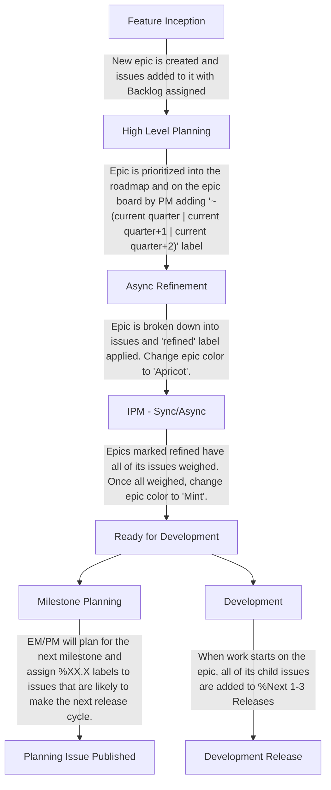

## 概要

このグループは [Dev サブ部門](/handbook/engineering/devops/) の [Create ステージ](/handbook/engineering/devops/create/) の一部です。2 つの[カテゴリー](https://about.gitlab.com/direction/create/#categories-in-create)に注力しています: `Workspace` と `Web IDE`。

### 🤴 グループの原則

<span id="-team-principles" data-message="alias anchor for old links"></span>

[Create:Remote Development の原則](principles/): Create:Remote Development グループの原則とは何ですか？

### 🚀 チームメンバー

以下の人物が Remote Development エンジニアリンググループの恒久的なメンバーです:

**エンジニアリングマネージャー & エンジニア**



**プロダクト、デザイン、テクニカルライティング、セキュリティ & 品質**



### ☕ カテゴリー DRI

<span id="-team-category-dris" data-message="alias anchor for old links"></span>

| カテゴリー               | DRI                                     |
|--------------------------|-----------------------------------------|
| Workspaces                |      |
| Web IDE                  |  |

### 📚 アーキテクチャ設計ドキュメント

設計ドキュメントは、アーキテクチャ設計ワークフローの中心となる主要なアーティファクトです。設計ドキュメントは、機能実装を進める際の指針となる技術ビジョンと一連の原則を記述します。チームの方向性をそろえるためのガードレールとして機能します。

- [Workspaces](../../../architecture/design-documents/workspaces/_index.md)

### 🎓 新入社員

**Remote Development チームと技術スタックが成熟し続ける中で、新入社員向けにチーム固有のオンボーディングプロセスを持つことが不可欠です。** このチェックリストは、会社オンボーディングの 2 週間後から、新メンバーがチーム特有の主要な領域とプロセスを進められるよう設計されています。私たちのミッション、必須ツール、Web IDE および Workspaces に関するワークフローをカバーしています。既存のチームメンバーは、このチェックリストを定期的に見直し、不足している情報や更新を貢献して、新参者にとって正確で有用な状態を保つよう促されています。テンプレートは https://gitlab.com/gitlab-com/create-stage/remote-development/-/blob/main/.gitlab/issue_templates/remote-development-onboarding.md にあります。

### ☎️ 連絡方法

文脈に応じて、Remote Development グループへの最適な連絡方法は以下のとおりです:

- Slack チャンネル: [`#g_create_remote_development`](https://gitlab.slack.com/archives/CJS40SLJE)
- Slack グループ: `@create-remote-development-team`（チーム全体）および `@create-remote-development-engs`（エンジニアのみ）

### 🗣️ お客様とのエンゲージメントの記録

お客様のニーズに対する理解とトレーサビリティを向上させ、フォローアップアクションが体系的に行われるようにするため、お客様とのエンゲージメントノートを SSoT に記録したいと考えています。
以下の機密 Issue を使用して、各機能カテゴリーに関するすべてのお客様エンゲージメントを記録してください:

- [Web IDE Customer Engagements](https://gitlab.com/gitlab-org/gitlab/-/issues/474518)
- [Workspaces Customer Engagements](https://gitlab.com/gitlab-org/gitlab/-/issues/473627)

これらの epic は社内チームメンバー専用です。フィードバックを提供したいユーザーは、「ユーザーフィードバックの記録」を参照してください。

### ユーザーフィードバックの記録

私たちはユーザーフィードバックを非常に重視しています! 2 つの機能カテゴリーに対するフィードバックや洞察を記録するために、以下の epic を使用してください:

- [Web IDE User Feedback & Insights](https://gitlab.com/groups/gitlab-org/-/epics/10543)
- [Workspaces User Feedback & Insights](https://gitlab.com/groups/gitlab-org/-/epics/12601)

チームメンバーでない場合でも、一般的なフィードバックや提案があればこれらの epic に Issue を作成して構いません。既存または進行中の機能に関連するフィードバックがある場合は、該当する epic または Issue にコメントを残してください。

### 🤝 お客様コラボレーション Issue ダッシュボード

お客様のニーズに対応するために、https://gitlab.com/gitlab-com/account-management 配下にプライベートなコラボレーションプロジェクトを作成する必要が出ることがあります。そのような Issue には適切なラベルを付け、以下のダッシュボードに表示されるようにします。

機能カテゴリーごとのラベルを適用するためのコメントテンプレートを使用してください:

- Workspaces - `/label ~"Category:Workspaces" ~"customer-collaboration"`

機能カテゴリー別のお客様コラボレーション Issue ダッシュボードは以下にあります:

- [Workspaces](https://gitlab.com/gitlab-org/gitlab/-/issues/517442)

### グループメトリクスダッシュボード

[Create::Remote Development グループメトリクス Tableau ワークブック](https://10az.online.tableau.com/#/site/gitlab/workbooks/2067787/views)

### 📆 グループミーティング

<span id="-team-meetings" data-message="alias anchor for old links"></span>

**❗️重要**: すべてのミーティングで、独自のドキュメントを持つ High Level Planning を除き、[Remote Development グループのミーティングドキュメント](https://docs.google.com/document/d/1b-dgL0ElBf_I3pbBUFISTYBG9VN02F1b3TERkAJwJ20/edit#) を使用し、最近行われた他の同期ミーティングのアジェンダ／メモ／録画への参照とともに、ミーティングメモを記入してください。これにより、後からミーティングメモを探しやすくなります。

同期ミーティングのスケジュールは柔軟で、必要な参加者の都合に合わせて移動できます。すべてのチームミーティングの最新スケジュールについては、[グループのカレンダー](https://calendar.google.com/calendar/u/0?cid=Z2l0bGFiLmNvbV92ZGc3bW04NDRuczVrN3JxZGlyMzM0N2YwOEBncm91cC5jYWxlbmRhci5nb29nbGUuY29t) を参照してください。

以下の表は、定期チームミーティングの目的と主な詳細を簡潔にまとめたものです:

| ミーティング名                       | 内容                                                                                                       |
|-------------------------------------|------------------------------------------------------------------------------------------------------------|
| High Level Planning                 | 全体方針を決め、今後のリリースで取り組む優先度の高い Issue/epic を検証する。  |
| Iteration Planning Meeting (IPM)    | スケジュールされた Issue をレビューし、次のマイルストーンに向けて見積もる。                                                |
| Remote Development Retro Call       | 非同期レトロからのフィードバックをレビューし、効率改善のためのアクション項目と次のステップを特定する。              |
| Engineering Sync                    | エンジニアリングのトピックを議論しブレインストーミングを行う。トピックがなければ中止。APAC/AMER に優しい時間で交互に開催。 |
| Remote Development Pairing          | エンジニア向けのペアリングセッション。トピックがなければ中止。                                                    |

## 📦 グループのプロセス

<span id="-team-processes" data-message="alias anchor for old links"></span>

### 🖖 週次 EM アップデート

毎週、グループの EM は、チームが把握しておくべき最重要項目を捉えた週次ステータスアップデート Issue を提供します。これらは [こちら](https://gitlab.com/gitlab-com/create-stage/remote-development/-/issues/?sort=created_date&state=all&label_name%5B%5D=Weekly%20Team%20Announcements&first_page_size=20) で確認できます。

### 😷 Issue ワークフロー衛生

Create:Remote Development グループでは、[triage bot](https://gitlab.com/gitlab-org/quality/triage-ops/-/tree/master/policies/groups/gitlab-org/remote-development) を介した自動 Issue 衛生システムを活用しています。これにより、Issue とラベルの衛生が守られます。

### 📝 調査と大きな Issue の分割

タスクが大きすぎる、未知の要素が多すぎる、概念実証 (POC) が必要な場合は、より小さな調査タスクや POC Issue に分割すべきです。これらのタスクは、スコープを明確にし、リスクを軽減し、実装に進むために必要なステップを特定するのに役立ち、理想的には 1 つのマイルストーンに収まるべきです。

1. **調査 Issue の作成:**
   - **目的:** 必要な作業を調査し、ドキュメント化または分解する。**調査している中心的な質問または問題を必ず定義してください**。
   - **ウェイト:** 調査、POC、分解タスクのデフォルトは 3 です。異なるウェイトが必要な場合は、PM/EM/チームステークホルダーと議論してください。
   - **ラベル:** 該当 Issue に ~spike ラベルを付与します。
   - **アップデート:** 調査は **集中して 3 営業日** に上限を設けます。
     - 3 日目またはそれ以前に、調査担当者は調査結果と提案する次のステップを共有します。主要なステークホルダーと方向性をそろえて意思決定を行うために、同期ミーティングの利用を検討してください。ミーティングが難しい場合は、調査結果をまとめた短い録画ビデオで構いません。
   - アップデートからのフィードバックに応じて、これらの調査により多くの時間を割り当てるか、得られた情報に基づき機能するもので落ち着くかを判断できます。

1. **分解とクローズ:**
   - 調査が完了したら、調査結果をまとめ、与えられた epic 内で実行可能で洗練された Issue に作業を分解します。
   - 成果物には次が含まれるべきです:
     - **アーキテクチャプラン**: ハイレベルな技術的方向性、品質目標 (パフォーマンス、セキュリティなど)、サポートするアプローチ。
     - **イテレーションプラン**: 明確にスコープされ、洗練された Issue への作業分解。
   - プランを epic の説明に追加し、調査 Issue をクローズします。

### 📝 Issue ガイドライン

これらのガイドラインは、グループ内で計画とスケジューリングに使用するすべての Issue に適用されます。エンジニアは必要に応じて具体的な実装 Issue を定義できますが、Issue 全体の目標は以下のとおりです:

- ワイダーコミュニティをプライマリオーディエンスとして扱います ([関連サマリーで根拠を確認](community-contributions/#treat-wider-community-as-primary-audience))。
- 成果物となる結果を表す意味のある **タイトル** を付けます。
  - ✅ `Add a cancel button to the edit workspace form page`
  - ✅ `Automatically save Devfile changes after 2 seconds of inactivity`
  - ❌ `Make WebIDE better`
- Issue の目的を明確に説明する意味のある説明を提供し、必要なら技術的な詳細も加えます。
- Issue の一部として小さなタスクを作る重要な実装ステップやその他有用な方法がある場合は、Issue の説明にチェックリストとして含めてください。
- Issue にはウェイトが割り当てられている必要があります。[イテレーションプランニング](#4-iteration-planning-meeting) を参照してください。

## 🤖 計画プロセス

<span id="-remote-development-planning-process" data-message="alias anchor for old links"></span>
<span id="remote-development-planning-process-overview" data-message="alias anchor for old links"></span>

計画とデリバリー見積もりの精度を向上させるため、私たちは GitLab プロダクト開発フローの [Plan](/handbook/product-development/how-we-work/product-development-flow/#build-phase-1-plan) と [Build & Test](/handbook/product-development/how-we-work/product-development-flow/#build-phase-2-develop--test) フェーズの一部を取り入れています。私たちのチームは [XP](https://www.amazon.com/Extreme-Programming-Explained-Embrace-Change/dp/0321278658) と [Scrum](https://www.scrum.org/resources/blog/agile-metrics-velocity) にインスパイアされた軽量でベロシティベースのアプローチを採用しています。これにより、明確で現実的な予測を提供しつつ、柔軟性を保つことができます。

目標は XP や Scrum を完全に採用することではなく、私たちにとって機能する部分、特にイテレーションプランニングと過去のベロシティ追跡を取り入れることです。私たちのチームの最近のデリバリー履歴である ["Yesterday's Weather"](https://gitlab.com/gitlab-com/www-gitlab-com/uploads/283f165896e2851bdc324f790d9c90e4/Screen_Shot_2023-03-27_at_6.16.51_PM.png) に見積もりを基づけることで、スコープをキャパシティに合わせて整え、何をいつ出荷できるかについて情報に基づいた意思決定ができます。

このプロセスは、進化する優先順位をナビゲートし、計画のオーバーヘッドを削減し、取り組んでいる内容について透明性を保つのに役立ちます。

### プロセスのフェーズ



#### 1. Feature Inception

アイデアはどこからでも、誰からでも生まれる可能性があります。アイデアがある場合は次のようにしてください:

1. [Workspaces](https://gitlab.com/groups/gitlab-org/-/epics/12601) または [Web IDE](https://gitlab.com/groups/gitlab-org/-/epics/10543) User Feedback & Insights epic 配下で Issue として記録します。
1. Issue タイトルの先頭に「Feedback:...」または「Idea:...」を付けます。
1. その Issue を %"Backlog" マイルストーンに追加します。
1. [Workspaces](https://docs.google.com/document/d/1Xfr5YHdStC7_3kVAognj0SxbXlcavj2ofgp1mH2zH4U/) または [Web IDE](https://docs.google.com/document/d/18l9wI2tRcFgvX8nJfmO3qVG9-smEQL0VwDh5aOOZj0s/) High Level Planning のアジェンダに議論トピックとして追加します。

#### 2. High Level Planning

**High Level Planning** ミーティングは、新規および進行中の作業を特定・議論・優先順位付けするためのオープンな場です。チームメンバーは事前にアジェンダにトピックを追加して提案できます。これは [GitLab Product Flow の Validation Track](/handbook/product-development/how-we-work/product-development-flow/#validation-track) と類似しており、Issue の精緻化と優先順位付けに進む前に同じ [Validation Goals & Outcomes](/handbook/product-development/how-we-work/product-development-flow/#validation-goals--outcomes) を達成する必要があります。ミーティングでは通常以下を扱います:

- **新機能アイデア**: ロードマップに含めるかを検討する新規作業の提案。
- **ロードマップ調整**: 進行中の作業の並べ替え、移動、または優先順位の変更。
- **バグ／技術的負債のエスカレーション**: 緊急の対応またはタイムラインの調整が必要な Issue。

このミーティングは、最も重要な作業を明確にし、何を優先すべきかを決定するために役立ちます。

**ミーティング後のアクション:**

- **ロードマップアセスメント:** ミーティング後、プロダクトマネージャーは提案された変更を評価し、作業の優先順位の単一の真実の情報源として機能する epic ボードを更新します。

- **Epic 作成と優先順位付け:** 機能は epic に変換され、プロダクトマネージャーが機能作業の順序を決定し、作業を開始すべき四半期に応じて `~"(current quarter | current quarter+1 | current quarter+2)"` ラベルでマークします。四半期の日付については、[会計年度](/handbook/finance/#fiscal-year) を参照してください。

- **ボード順序のガイドライン:** エンジニアリングマネージャーまたはプロダクトマネージャーに先に相談せずに、epic ボード上の項目の順序を変更することは避けてください。

#### 3. Async Refinement

**Async Refinement** プロセスは、Issue の分解と実装における未知数の特定に焦点を当てて、今後の作業を効率的に準備するために設計されています。これは標準の GitLab プロダクト開発フローにおける ["バックログリファインメント"](/handbook/product-development/how-we-work/product-development-flow/#outcomes-and-activities-4) に類似しています。目標は、今後のマイルストーン向けにターゲット設定されたすべての Issue が、次の IPM でチームが簡単にレビューし見積もるのに十分なほど明確であることを保証することです。

**主要な原則:**

- **Epic ボード:** epic ボードは、各 epic のステータスを反映するカラースキームに従って、今後の作業を整理し優先順位付けします。
  - <span style="color:#1068bf">青</span>: 精緻化が必要な新規 epic のデフォルト色。
  - <span style="color:#f3ad5d">アプリコット</span>: epic が完全に精緻化され、次の計画段階で見積もりの準備ができていることを示します。
  - <span style="color:#4dd787">ミント</span>: **Iterative Planning Meeting** の後、epic 内のすべての Issue が見積もられ、実行のために最終化された後に使用されます。

- **ジャストインタイム計画:** 過剰準備を避けるため、次の 1〜2 個の epic だけを精緻化します。これにより、作業を開始するときに epic が引き続き関連性を持つようにします。これらが精緻化されていれば、それ以上の精緻化は不要です。

**精緻化プロセス:**

1. **精緻化が必要な epic を特定する:**
   - これらは epic ボードで <span style="color:#1068bf">青</span> でマークされ、通常はエンジニアリングマネージャーがエンジニアにアサインします。
1. **Epic を分解する:**
   - epic を小さな実行可能な Issue に分割します。
   - epic の受け入れ基準を満たすために必要な作業を定義します。
   - 精緻化された Issue に ~refined ラベルを付与します。
1. **精緻化済みとしてマークする:**
   - 精緻化されたら、epic の色を <span style="color:#f3ad5d">アプリコット</span> に変更し、見積もりの準備ができていることを示します。
   - 準備完了を示すために epic に **"refined"** ラベルを付加します。
1. **次のステップ - Iterative Planning Meeting:**
   - 精緻化の後、epic は **Iteration Planning Meeting** に入り、epic 内のすべての Issue が見積もられます。
   - このステージの後、epic は <span style="color:#4dd787">ミント</span> でマークされ、完全に見積もられて実行の準備ができていることを示します。

#### 4. Iteration Planning Meeting

**Iteration Planning Meeting** は、epic ボード上で <span style="color:#f3ad5d">アプリコット</span> としてマークされた epic 内の Issue をチームがレビューし見積もる協働セッションです。これは [XP の "Weekly Cycle"](https://www.amazon.com/Extreme-Programming-Explained-Embrace-Change/dp/0321278658) や [Scrum の "Sprint Planning"](https://www.scrum.org/resources/what-is-sprint-planning) に類似しています。このプロセスは、精緻化された各 epic が完全に理解され、スコープ内にあり、チームの目標と整合していることを保証します。

**ミーティングの目的:**

- **Issue のレビューと見積もり:**
  - 各 Issue について、ファシリテーターが説明を読み、チームは **_簡潔に_** Issue を議論し、不確実な点を明確にします。ブロックする懸念やリスクが提起されない場合、チームは協力してじゃんけんフィボナッチスケールで見積もり、合意されたウェイトが割り当てられます。ウェイトの詳細は [どのウェイトを使うか](#-what-weights-to-use) を参照してください。
  - まだ見積もられていない他の優先順位付けされた Issue がある場合、ミーティング中にそれらもレビューして見積もります。

**非同期プロセス:**
**TL;DR: 公式の IPM ミーティング前に Issue を素早く見積もる必要が時々あります。これがそういった Issue の見積もり方です。**

**前提条件:** Slack に Polly アプリを未追加の場合は追加してください。

1. Slack の Apps セクションから Polly アプリケーションに移動します。
1. Create a Polly を選択します。
1. Create New を選択します。
1. Multiple Choice を選択します。
1. 作成オプションを記入します:
    1. Create Question: Weight for: **_Add link to issue here._**
    1. Question Type: Multiple Choice。
    1. 以下の選択肢を入力: **0 1 2 3 5 8** (各数字を別の行に)
    1. オーディエンスを選択: **_remote_development_async_ipm_** チャンネルを選択。
    1. 「Send polly as direct message」が **_未チェック_** であることを確認します。
    1. Settings ボタンを選択します。
    1. Responses: **_Non-anonymous_** を選択。
    1. Results: **_Show after close_** を選択。
    1. Submit を選択して変更を保存します。
1. Polly を送信します。

**オプションのステップ: テンプレート作成**

これにより、設定を標準化することで以降の Async IPM を高速化できます。作成後は、ユーザーは「My Templates」セクションからテンプレートを選択し、Use Template を選択して、「Create Question」フィールドの Issue リンクだけを更新するだけで済みます。

1. Slack の Apps セクションから Polly アプリケーションに移動します。
1. Go to Polly Dashboard を選択します。
1. 先ほど作成した Polly を選択します。
1. Controls ボタンを選択します。
1. Save as Template を選択します。
1. タイトルテンプレート: **_Remote development async ipm_**。
1. 「Save audience with template」が **_チェック_** されていることを確認します。
1. Save を選択します。

**非同期見積もりオプション:**

- 見積もりは `#remote_development_async_ipm` Slack チャンネルでも非同期に行えます。
- 非同期見積もりを開始するには、見積もりが必要な Issue と入力を集めるための [Polly poll](https://www.polly.ai/help/slack/creating-polls) を投稿します。

この構造により、同期と非同期の両方の参加を可能にし、今後の作業に向けた徹底した準備と整合を実現します。

#### 5. マイルストーン計画と開発開始

**マイルストーン計画と開発開始** プロセスは、今後のリリースで開発する Issue を計画し、チームの努力をマイルストーンと整合させるために使用されます。

**Epic と Issue のセットアップ:** 新しい epic で作業を開始するとき、すべての子 Issue にマイルストーン **`%"Next 1-3 Releases"`** または例えば **`%16.9`** のような具体的なマイルストーンが割り当てられ、近期の開発で優先順位付けされたことを示します。

Issue は、チームのベロシティ、並行作業の可能性、全体的な可用性などの要因に基づいて特定のマイルストーンにアサインされます。**計画外の作業をアクティブなマイルストーンに追加する必要がある場合は、デリバリー予測とコミットメントに影響する可能性があるため、まず EM と相談してください。**

時折、バグやお客様からのエスカレーションのような未精緻または計画外の Issue が、マイルストーン開始後に持ち込まれることがあります。これらの場合は、含める前に十分に準備されていなかったため、デフォルトで ~Stretch ラベルが付けられます。

Issue は通常 `%"Backlog"` から `%"Next 1-3 Releases"` に移動し、その後具体的なマイルストーン (例: `%16.x`) に入ります。EM と別の話し合いがない限り、エンジニアはアクティブマイルストーンでスケジュールされた ~Deliverable 項目を、そのマイルストーン内の他の Issue を考慮する前に取り上げることを優先すべきです。現在のマイルストーン内のすべての ~Deliverable と ~Stretch Issue がすでにアサインされ、進行中の場合、次に見るべき場所は次のマイルストーンまたは `%"Next 1-3 Releases"` です。

**マイルストーン計画と計画 Issue の作成**:

1. 各マイルストーン開始前に、エンジニアリングマネージャーはプロダクトマネージャーとともに、チームのベロシティに基づいて今後のリリースの Issue をレビューしてアサインします。具体的なマイルストーン番号 `%XX.X` を割り当てて、計画されたリリースの一部として指定します。

1. **計画 Issue** は、新しいリリースサイクル開始の 2 週間前に自動作成されます。この Issue には、マイルストーンを通じてチームをガイドするための関連詳細が記入されます。すべてのアクティブな計画 Issue は [こちら](https://gitlab.com/gitlab-com/create-stage/remote-development/-/issues/?sort=updated_desc&state=opened&search=planning%20issue&first_page_size=50) で確認・アクセスできます。

この構造により、各マイルストーン内での開発作業のスムーズな計画、追跡、整合が可能になり、作業が計画どおりにスコープ内で進むようにします。

### 機能のライフサイクル例

1. プロダクトとデザインが機能を特定し、epic を作成します。
   この時点では Issue 説明が不完全／未精緻でハイレベルな状態かもしれません。
1. 優先度がついたら、プロダクトマネージャーが `~"(current quarter | current quarter+1 | current quarter+2)"` ラベルを追加し、エンジニアリングマネージャーが epic を精緻化のためにアサインします。
1. async IPM プロセスの一部として、アサインされた人は機能作業を Issue に分解し、Issue テンプレートを記入し、Issue に `~refined` ラベルを付与し、epic 内のすべての Issue が精緻化されている場合は epic にも付与して、epic を精緻化します。
   1. 精緻化プロセスの中で、機能のドキュメントについても考慮してください。必要であれば、要件と `~documentation` および `~Technical writing` ラベルを Issue に追加します。
      質問やアシスタンスが必要な場合は、アサインされたテクニカルライターをタグ付けしてください。
1. 同期 IPM ミーティングで、より広いチームが epic 内の Issue について議論し見積もります。
1. 優先度とウェイトが決定したら、EM はベロシティに基づいて epic の Issue に具体的なリリースマイルストーンを割り当てます。
1. アサインされた人は Issue 用に MR を開き、Issue と MR が説明の最初の行で相互参照されていることを確認します。
1. 機能実装が進行中、アサインされた人は適切な [トピックタイプ](https://docs.gitlab.com/development/documentation/topic_types/) のフォーマットと [スタイルガイド](https://docs.gitlab.com/development/documentation/styleguide/) に従ったドキュメンテーション MR を作成します。
1. ドキュメンテーション MR はテクニカルライターにレビューされ、機能実装 MR と同時または直後にマージされます。
1. 機能 MR がマージされ、ドキュメンテーションが公開され、機能が本番環境で検証されたら、epic はクローズされます。

### 📝 アドホックワーク

チームメンバーが、次の計画サイクル前に解決すべき Issue を特定することは普通のことです。これは、他の優先 Issue をブロックしているため、または単にチームメンバーが未解決のバグや小さな技術的負債に取り組みたいためかもしれません。

このような状況では、チームメンバーが自発的に Issue を作成し、適切なラベルを付与し、見積もり、現在のマイルストーンにアサインして取り組むことは、_他の優先 Issue のデリバリーに悪影響を与えない限り_ 受け入れられます。ただし、それが大きくなったり、マイルストーン内の他の Issue に影響するリスクがある場合は、次の IPM でより広いチームと議論すべきです。

### 🏋 どのウェイトを使うか

Issue にウェイトを効果的に割り当てるためには、Issue ウェイトを時間に紐付けるべきではないと覚えておくことが重要です。代わりに、Issue の重要度の純粋に抽象的な尺度であるべきです。これを達成するために、チームはウェイト 0 から始まるフィボナッチ数列を使用します:

- **ウェイト 0:** タイポや軽微なフォーマット変更、テスト不要のごく小さなコード変更などの最小かつ最も簡単な Issue 専用。
- **ウェイト 1:** 不確実性、リスク、複雑性がほとんどまたはまったくないシンプルな Issue。これらの Issue には「good for new contributors」や「Hackathon - Candidate」のようなラベルが付くことがあります。例えば:
  - シンプルだが時間がかかるコピー文の変更。
  - CSS や UI の調整を行う。
  - 1 つまたは 2 つのファイルへの軽微なコード変更で、テストを書くか更新する必要があるもの。
- **ウェイト 2:** リスクや複雑性は多くないが、コードの複数領域に触れたり、複数のテストを更新したりする可能性がある、それでもまだ単純な Issue。
- **ウェイト 3:** 予期せぬ複雑性やリスクがあるかもしれない、またはより広範な変更を必要とする大きな Issue ですが、まだ [小さな別々の Issue に分解する](#-investigations-and-breaking-down-large-issues) ほど大きくないもの。
- **ウェイト 5:** 通常、このウェイトは避けるべきで、Issue は理想的には [小さな別々の Issue に分解されるべき](#-investigations-and-breaking-down-large-issues) であることを示します。ただし、場合によってはウェイト 5 の Issue が依然として優先順位付けされることがあります。例えば、大量の手作業更新が必要で大きな労力を要するが、必ずしも大きなリスクや不確実性を伴わない場合などです。
- **ウェイト 8/13+:** 5 を超えるウェイトは、まだ実装にアサインする準備ができていない作業を明確に示すために使用され、_必ず_ 分解されなければなりません。これは、実装を開始するには範囲が大きすぎ、未知数／リスクが多すぎる場合に該当します。このウェイトは、ベロシティベースのキャパシティプランニング計算で労力の範囲を捉えるために、「プレースホルダー」Issue に一時的に割り当てられます。詳細は [「大きな Issue の分解」](#-investigations-and-breaking-down-large-issues) を参照してください。

### バグは見積もるべきか？

これについてはアジャイル哲学の中でも意見が分かれます ([1](https://www.reddit.com/r/scrum/comments/n4uhl5/estimating_bugsdoes_it_matter/), [2](https://medium.com/agilelab/estimating-bugs-yes-or-no-cbfe1bc25db1))。

私たちのチームでは、バグは見積もるべきではないと決定しました。理由は次のとおりです:

- ベロシティベースのプロセスでウェイトを見積もる目的は、チームがユーザー価値を提供する速度を予測するのを助けることです。
- その観点から、バグは見積もるべきではありません。なぜなら、「ユーザー価値」は元の機能によって提供されており、その機能はウェイトを_持っていた_からです。
- しかし、バグの修正は新しいユーザー価値を追加していません。それは元の機能で既に考慮されていたユーザー価値の提供を「完了」させるだけです。なので、ウェイトを付けるべきではありません。
- ただし、それが「この機能は完全に間違っており、大幅に書き直す必要があり、多くの労力を要する」というカテゴリーの巨大な「バグ」である場合は、それは「バグ」ではなく新機能の作業と見なすべきです。そして、すべての機能作業と同じように、精緻化されウェイト付きの Issue に分解されるべきです。

### 🧹 複数のリリースにまたがるフォローアップ Issue

GitLab の標準では、複数のリリースにわたる特定のステップで解決される必要がある Issue を分解することがしばしば求められます。一般的にはデータベースマイグレーションに関連する Issue ([カラムを削除する](https://docs.gitlab.com/ee/development/database/avoiding_downtime_in_migrations.html#dropping-columns)) や、["非推奨化と削除"](https://docs.gitlab.com/ee/api/graphql/index.html#deprecation-and-removal-process) のような GraphQL の破壊的変更などです。

このような場合、無視ルールの削除、GraphQL から非推奨化されたフィールドの削除、バックグラウンドマイグレーションのファイナライズなど、将来のリリースに保留中またはフォローアップタスクがある場合、将来作業を完了させるのを忘れないようにフォローアップ Issue を作成しなければなりません。以下のプロセスに従ってください:

**フォローアップ Issue を作成する:**

1. **参照:** その Issue を生み出した元の Issue にリンクします。
1. **ラベル:** 以下のラベルを付与します:
    - `~due-date-followup`
    - `~refined`
1. **マイルストーン:** 具体的なマイルストーンを割り当てます。例: カラム削除 (17.5) -> フォローアップで無視ルール削除 (17.6)。
1. **期日:** 割り当てたマイルストーンの 1 週間目を期日に設定します。マイルストーンの日付を確認するには、マイルストーンを追加した後 "Preview" をクリックし、新しいタブでマイルストーンリンクを開いてページ上部にある日付範囲を確認してください。
1. **Epic:** [WebIDE | Technical Debt/Friction](https://gitlab.com/groups/gitlab-org/-/epics/14656) または [Workspaces Technical Debt Work](https://gitlab.com/groups/gitlab-org/-/epics/11041) epic にアサインします。

このメタデータを簡単に適用できるラベルコマンドのショートカットを以下に示します。

Workspaces:

```text
/relate #<original issue number or link>
/milestone %"<target milestone>"
/due date <one week into milestone's date, obtained from clicking on milestone link>
/label ~due-date-followup ~refined
/epic &11041
```

Web IDE:

```text
/relate #<original issue number or link>
/milestone %"<target milestone>"
/due date <one week into milestone's date, obtained from clicking on milestone link>
/label ~due-date-followup ~refined
/epic &14656
```

将来のリリースまで延期することが_必須_であるこの種の Issue を、私たちが_選んで_延期している「技術的負債」の作業と混同しないでください。これが、フォローアップを忘れずに完了させるために、マイルストーン、カスタムラベル、期日リマインダーを使った以下のプロセスを採用している理由です。

### Issue と MR の関係

<span id="1-to-1-relationship-of-issues-to-mrs" data-message="alias anchor for old links"></span>

私たちは以下を強制したいと考えています:

1. すべての MR はウェイト付きの Issue に所有されている

これは、このプロセスのもとで正確で粒度の高いベロシティ計算と Issue の優先順位付けを促進するためです。マージリクエストはほとんどの場合、デリバリー可能な作業の原子単位なので、優先順位付けと計算において 1 つの Issue にしか所有されないことで表現される必要があります。

triage-ops の自動化 (/handbook/engineering/devops/create/remote-development/#automations-for-remote-development-workflow) を介してこれを強制するため、Issue の最初の行は `MR: <...>` というフォーマットを持つべきです:

1. 新しい Issue の場合、説明の最初の行は: `MR: Pending` であるべきです。
1. その Issue 用に MR が作成され作業が開始したら、Issue の説明の最初の行は: `MR: <MR link with trailing +>` で、MR の説明の最初の行は `Issue: <Issue link with trailing +>` であるべきです。
1. Issue の作業が反復的に複数の MR に分割された場合、Issue の説明の最初の行は次のようになります:

   ```markdown
   MR:
     - <MR link with trailing +>
     - <MR link with trailing +>
   ```

   このリスト内の MR の各説明行は `Issue: <Issue link with trailing +>` であるべきです。**注意:** Issue の実装を複数の MR に分割することで予期せず作業範囲が広がった場合は、追加範囲を捉えるために新しいウェイト付きで優先順位付けされた Issue の作成を検討してください。これは、範囲増加とそれがレポートおよびベロシティに与える影響を正確に反映するために重要です。
1. Issue に関連する _MR がない_ 場合、最初の行は: `MR: No MR` であるべきです。
   ただし、ほとんどの Issue にはドキュメンテーションの追加や更新のような何らかのコミットされた成果物があるべきなので、これは稀なはずです。Issue が小さな Issue に分割された大きな作業を表す場合は、epic に昇格させるべきです。

**質問: なぜすべての MR にバッキング Issue が必要なのか？**

- ボードと epic で MR も Issue と同様に追加して見積もれるなら、これは必要ありません。MR を伴う機能／メンテナンスでは、MR が議論と実装の完全なライフサイクルを直接表現でき、Issue を持たないこともできます。
- また、Crosslinking Issues 機能 (https://docs.gitlab.com/ee/user/project/issues/crosslinking_issues.html) にも頼ることはできません。これは Issue にどこかで言及したすべてのリンクされた MR を表示するため、この 1 対 1 の関係を強制できないからです。

### 🍨 プロセス外の Issue の取り扱い

<span id="-handling-remote-development-issues-outside-the-process" data-message="alias anchor for old links"></span>

特定の `group::remote development` Issue は、`(workspaces|webide)-workflow::ignored` ラベルの下にカテゴライズされることがあります。これらのカテゴリーには次が含まれます:

1. **QA 所有の Issue:**
   - QA が所有する Issue で、標準 Workspaces プロセスを必要としない場合があります。
1. **`type::ignore` を持つ PM 所有の Issue:**
   - レポーティング、ブログ、OKR など、`type::ignore` でマークされたプロダクトマネージャー所有の Issue。
1. **長期セキュリティ Issue:**
   - 一般的な Workspaces ワークフローに合わない長期間のセキュリティ所有 Issue。

このアプローチにより、これらの種類の Issue が私たちのベロシティに望まれない影響を与えないようにし、Workspaces プロセスを合理化したまま、標準ワークフローに合わない異なる Issue カテゴリーに対応できるようにします。

### より広いボードカラム

ボード上のリストのデフォルト幅は、ボードを使いにくくすることがあります。表示できる項目が少なくなり、スクロールがより必要になるためです。

[これに対処するためのオープン Issue](https://gitlab.com/gitlab-org/gitlab/-/issues/15927) があります。それまでの間、[Issue のこのコメント](https://gitlab.com/gitlab-org/gitlab/-/issues/15927#note_214871708) で提案されている以下の JavaScript ブックマークレットを使うことで、リストがボード幅全体を取るようにできます。「Wider board lists」という名前のブックマークを作成し、リンクとして以下を設定するだけです:

```text
javascript:(function(){var el=document.getElementsByClassName('boards-list');for(i=0;i<el.length;++i){el[i].style.padding=0;el[i].style.display='table';}el=document.getElementsByClassName('board');for(i=0;i<el.length;++i){el[i].style.padding=0;el[i].style.border='0';el[i].style.display='table-cell';}el=document.getElementsByClassName('board-inner');for(i=0;i<el.length;++i){el[i].style.padding=0;el[i].style.border='0';}})();
```

## 👏 コミュニケーション

Remote Development チームは以下のガイドラインに基づいてコミュニケーションを取ります:

1. 同期ミーティングよりも常に非同期コミュニケーションを優先する。
1. 非同期が非効率的になっている場合は、[同期コール](#-ad-hoc-sync-calls) のセットアップをためらわず、ただし常に録画してチームメンバーと共有する。
1. デフォルトでオープンにコミュニケーションを取る。
1. Slack 上の業務関連コミュニケーションはすべて [#g_create_ide](https://gitlab.slack.com/archives/CJS40SLJE) チャンネルで行う。

### ⏲ 休暇

チームメンバーは、エンジニアリングマネージャーがキャパシティプランニング中に正しい休暇日数を使えるよう、[計画された休暇](/handbook/people-group/time-off-and-absence/time-off-types/) を Workday に追加してください。

### 🤙 アドホック同期コール

私たちはデフォルトで非同期コミュニケーションを利用します。同期での議論が有益な場合もあるため、必要に応じて関係するチームメンバーと同期コールをスケジュールすることを推奨します。

## 🔗 その他の有用なリンク

### 🏁 開発者チートシート

[開発者チートシート](developer-cheatsheet/): チーム内外のエンジニアに役立つ可能性のあるさまざまなヒント、コツ、リマインダーをまとめたものです。

### 🤗 ワイダーコミュニティのコントリビューターを育てる

私たちは、Create:Remote Development チームのすべての分野が、外部のコントリビューターにとって近づきやすいものであるようにしたいと考えています。
そのため、Issue が任意のコントリビューションに適している場合は、特別な配慮で扱われるべきです。Paul Slaughter が書いた優れたガイドを見てみましょう！

[Cultivating Contributions from the Wider Community](community-contributions/): なぜ、どのようにしてワイダーコミュニティからのコントリビューションを育てるかをまとめたものです。

### 📹 GitLab Unfiltered プレイリスト

Remote Development グループは、グループおよびそのチームメンバーに関連するすべての動画を [GitLab Unfiltered](https://www.youtube.com/channel/UCMtZ0sc1HHNtGGWZFDRTh5A) YouTube チャンネルの [プレイリスト](https://www.youtube.com/playlist?list=PL05JrBw4t0KrRQhnSYRNh1s1mEUypx67-) にまとめています。

### 運用ヘルスガイド

#### 中核となる原則

エラーバジェットと可用性メトリクスは、Workspaces に対するお客様の実際の体験を正確に反映する必要があります。
ここでの焦点は、お客様に影響を与える行動に置かれるべきです。

#### これまでの学び

私たちのエラーバジェットは、モニタリングが導入されているにもかかわらず、過去にさまざまな時点で赤になりました。
私たちは固定スケジュールで毎週ダッシュボードをレビューしていましたが、レビューの間にエラーが蓄積することがありました。
ノイズを避けたかったため Sentry アラートのセットアップを延期していましたが、この「pull」アプローチは、影響を防げたかもしれない早期警告サインを見逃すことを意味していました。

**重要な教訓:** 騒がしいアラートで Issue をすぐにあなたへ push し、時間とともに精緻化していく方が良いということです。受動的な週次レビューから、能動的でリアルタイムなアラートへのシフトにより、私たちのダッシュボードは長い間一貫してグリーンに保たれています。

#### お客様への影響の検証

ユーザーが以下のことができる能力に影響するアラートとエラーを優先します:

- 新しい Workspace を作成すること
- 既存の Workspace に接続すること
- 妥当なパフォーマンスで Workspace を使用すること
- 開発フローを維持すること
- データ永続性を信頼すること

#### 可用性チャンピオン

各マイルストーンで、運用ヘルスを所有する可用性チャンピオン (約 4 週間) を指名します。

**これはオンコール業務ではありません** - チームの目としてシステムヘルスを見守り、何も漏れないようにすることです。

**責任:**

- #f_workspaces_alerts チャンネルを監視する
- 毎週月曜日に運用ヘルスの週次レビューを実施する
- エラーバジェット消費があれば Issue を作成する
- 「このエラーは重要か？」という質問の窓口になる

#### #f_workspaces_alerts での Sentry アラート

アラートがチャンネルに表示されたら、可用性チャンピオンは以下を行います:

1. お客様への影響を評価 (営業時間内)
    - 確認: これは Workspace の作成、アクセス、またはコア機能に影響しますか？
    - YES なら、P1 Issue を作成
    - NO だが、バジェットを使い切るほど頻繁な場合は、P2 Issue を作成
1. テンプレートを使用して Issue を作成 - https://gitlab.com/gitlab-com/create-stage/remote-development/-/blob/main/.gitlab/issue_templates/workspace-availability.md
1. P1 の調査を開始
    - #f_worksapces_alerts のアラートスレッドに調査中である旨を返信投稿
    - 根本原因分析を開始
    - 調査結果で Issue を更新
    - 注意:
      - P2 については、通常のマイルストーン計画でスケジュールするために EM をタグ付け
      - 問題ではない場合は、単にアラートに ✅ を付け、見たことを全員が知れるようにする

#### 週次レビュー

**原則:** 消費されたエラーバジェットの 1 分 1 秒を理解しようと努めます。

- 毎週月曜日に #g_remote_development の週次エラーバジェット通知を確認し、消費を調査します。
- 通知に ✅ を付けてレビューが完了したことを示します。

##### 参考資料

- **Grafana:** https://dashboards.gitlab.net/d/stage-groups-detail-remote_development/1270664?orgId=1&from=now-7d&to=now&timezone=utc&var-PROMETHEUS_DS=mimir-gitlab-gprd&var-environment=gprd&var-stage=main
- **Sentry:** https://new-sentry.gitlab.net/organizations/gitlab/alerts/rules/gitlabcom/50/details/
- **Tableau (Workspace Reliability):** https://10az.online.tableau.com/#/site/gitlab/views/WorkspaceUsage/WorkspaceReliability?:iid=1

## 自動化

可能な限り、自動化は [triage-ops](https://gitlab.com/gitlab-org/quality/triage-ops/) を介してセットアップすべきです。

より複雑な自動化は、[Remote Development Team Automation プロジェクト](https://gitlab.com/gitlab-org/remote-development/remote-development-team-automation) でセットアップできます。

### グループワークフローの自動化

理想的には、[計画プロセス](#-planning-process) ワークフローのできるだけ多くを自動化すべきです。

このワークフローには以下の自動化目標があります。特に明記がない限り、これらのルールはすべて [triage-ops の `policies/groups/gitlab-org/ide/remote-development-workflow.yml` 設定ファイル](https://gitlab.com/gitlab-org/quality/triage-ops/-/tree/master/policies/groups/gitlab-org/remote-development) で定義されています。

| ID | 目標 | 自動化 | 実装へのリンク |
| --- | --- | --- | --- |
| <a id="automation-01">01</a> | epic がアサインされていない場合に警告 | `~"Category:(Web IDE \| Workspace)"` の Issue で epic がアサインされていない場合に警告コメントを付ける | TODO: 実装 |
| <a id="automation-02">02</a> | 不足しているマイルストーンを Issue にアサイン | `~"Category:(Web IDE \| Workspace)"` の Issue でマイルストーンがアサインされていない場合は `%"Backlog"` をアサインする | TODO: 実装 |
| <a id="automation-03">03</a> | マイルストーン内のストレッチ Issue にフラグ付け | アクティブマイルストーン (例: 16.x、17.x) にアサインされたが ~refined ラベルとウェイトを持たない Issue を ~Stretch としてマークする | TODO: 実装 |
| <a id="automation-04">04</a> | Workspace ワークフローと GitLab ワークフローのラベルを同期 | `~"refined"` がアサインされた未開始の Issue に `~"workflow::ready for development"` をアサインする | TODO: 実装 |
| <a id="automation-05">05</a> | 担当者がいるすべての Issue にウェイトがアサインされていることを保証 | 担当者がいるがウェイトがない、バグでないすべての精緻化された Issue にウェイト見積もり追加のリマインドノートを付ける | TODO: 実装 |
