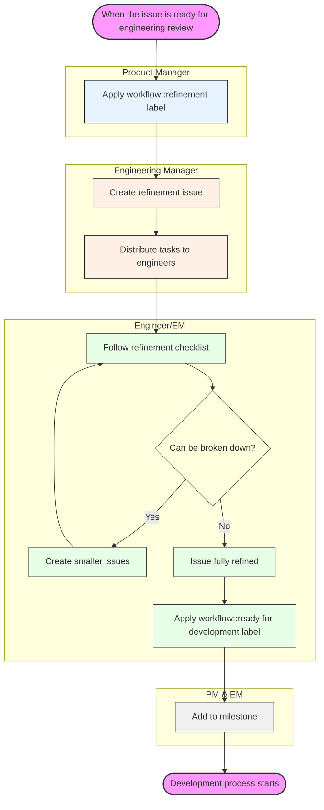

Create:Source Code BE チームは GitLab の Source Code Management（SCM）ツールに焦点を当て、[DevOps ライフサイクル](/handbook/product/categories/#devops-stages)の [Create ステージ](/handbook/product/categories/#create-stage)における [Source Code グループ](/handbook/product/categories/#source-code-group)のプロダクトカテゴリのすべてのバックエンド側面を担当します。プロダクトの方向性については、[カテゴリ方向 - Source Code Management](https://about.gitlab.com/direction/create/source_code_management/) ページをご覧ください。

私たちは Gitaly チームおよび Code Review チームと連携し、[Create:Source Code Frontend チーム](/handbook/engineering/devops/create/source-code/frontend/)と密接に協働しています。私たちが扱う機能は [グループ別機能ページ](/handbook/product/categories/features/#code-creation)に記載されており、技術ドキュメントは [Create: Source Code Backend](https://docs.gitlab.com/ee/development/backend/create_source_code_be/index.html) ページにあります。

## 私たちのチームハンドブックページについて

これは、私たちのチームにとって重要なすべてを見つけるための中心的なドキュメントです。誰がチームにいるか、プロセス、プラクティス、ミーティング、リンク、チャンネル、メトリクスなどに関する私たちの唯一の信頼できる情報源（SSOT）です。このページで、チームメンバーはこのチームに完全に関与するために必要なすべてを見つけられるはずです。

### このページの更新

私たちのチームハンドブックページを更新する DRI になるには、次の手順に従うことを検討してください。

- 私たちの[ハンドブック更新エピック](https://gitlab.com/groups/gitlab-org/-/epics/14740)に移動します。
- このページへの変更が必要な理由を説明するサブイシューを作成します。
- 簡単でコンテキストがある場合は、重みを 1 として変更を加える MR を作成します。
- より多くの労力を要する場合は、より高い重みを付け、変更を成功させるために必要なものを説明します。次のマイルストーン計画中に検討できます。
- MR の準備ができたら、コメントで `@gitlab-com/create-team/source-code/backend` にメンションしてフィードバックを求めます。チーム全体にメンションすることで、チームの全員がチームの運営方法に貢献できるようになります。
- これがドキュメントを横断的に共有する機会かもしれないと思う場合は、フロントエンドチームにメンションしてフィードバックを得ることを検討してください。
- EM をレビュアーにアサインします。
- チームが議論する 2 営業日を経て、懸念事項が解決されたら、フォローアップして EM にマージできるか尋ねます。

## チームメンバー

以下の人々は Create:Source Code BE チームの常任メンバーです。



## 安定したカウンターパート

他の機能横断チームの以下の人々は、私たちの安定したカウンターパートです。



## 共通リンク

- GitLab チームハンドル: `@gitlab-com/create-team/source-code/backend`
- Slack チャンネル: `#g_create_source-code-be`、`#g_create_source-code_stand-up`、`#g_create_source-code`、`#s_create`
- [チームエラーバジェット - グループダッシュボード](https://dashboards.gitlab.net/goto/2YoyikIHR?orgId=1)
- [チームエラーバジェット - 詳細ダッシュボード](https://dashboards.gitlab.net/goto/O6YJZodNR?orgId=1)

## AI プロンプト

より効率的に作業するために使用する[共通の AI プロンプト](/handbook/engineering/devops/create/source-code/ai-prompts/)のリストを維持しています。

## ワークフロー

標準の GitLab [エンジニアリングワークフロー](/handbook/engineering/workflow/)を使用しています。Create:Source Code BE チームのイシューを作成するには、これらのラベルを追加します。

- ~backend
- ~"devops::create"
- ~"Category:Source Code Management"
- ~"group::source code"

より緊急性の高い案件については、`#g_create_source_code` Slack チャンネルを使用してください。

[カテゴリーごとにサポートする機能はこちらをご覧ください。](/handbook/product/categories/features/#code-creation)

### プロダクトチームとの連携

プロダクトマネージャーとエンジニアリングマネージャー（フロントエンドとバックエンド）の週次通話は、「Source Code Group」カレンダーに記載されています。誰でも参加でき、これらの通話は、グループに影響を与えるブロッカー、懸念事項、ステータス更新、成果物、その他の考えを議論するために使用されます。

#### イシューのリファインメント

1. 問題を検証したら、プロダクト、UX、エンジニアリングが協力して解決策を提案し、技術的に実現可能なものを決定します。提案された解決策は、問題を解決することを検証するためにユーザーと共有される場合があります。
    1. デザイン作業が必要なイシューには `UX` と `workflow::ready for design` がマークされます。
    1. デザインプロセス中のイシューには `workflow::design` がマークされます。
    1. デザインの準備ができ、提案された解決策が実行可能になったら、`workflow::planning breakdown` ラベルが付けられます。
1. 提案された解決策が実行可能であることを確認したら、できるだけ細かく分解する作業に移ります。イシューがこの段階に達したら、PM が次のステップを示すためにイシューに `workflow::refinement` ラベルを付けます。
1. EM がリファインメントイシュー（[例](https://gitlab.com/gitlab-com/create-stage/source-code-be/-/issues/249)）を作成し、`workflow::refinement` のタスクをエンジニアに配分します。
1. エンジニアまたは EM がアサインされたイシューのチェックリストに従い、必要に応じて PM、UX、その他のエンジニアリングカウンターパートと協力して質問や懸念に対処します。
1. イシューの計画された実装をさらに分解できる場合、エンジニア／EM が PM と協力してスコープを縮小し、そうできるようになるまで新しいイシューを作成します（PM またはエンジニア／EM のいずれかが新しいワークアイテムを作成できます）。
1. イシューが完全にリファインメントされたら、エンジニアまたは EM が適切な[重み](/handbook/engineering/devops/create/source-code/backend/#weight-categories)を追加し、`workflow::ready for development` としてラベル付けします。これらのイシューはその後マイルストーンに追加できます。
1. 他のチームが現在のマイルストーンで計画された Source Code Backend のイシューに依存している場合、それらのイシューには `SCM::AwaitingBackend` がラベル付けされます。

**注**: このプロセスの後にイシューが 3 を超える重みを受け取った場合、IC が必要なものを完全に把握しておらず、さらなる調査が必要であることを示している可能性があります。

#### 図



### イシューリファインメントチェックリスト

リファインメントが必要なイシューについては、エンジニア／EM がこのテンプレートを使ってコメントを追加し、すべてのチェックリスト項目を完了すべきです。

これらのステップのいずれかを完了できない場合は、EM／PM にメンションしてください。

```plaintext
# Issue Refinement Checklist

## Problem verification
- [ ] Issue label is ~"workflow::refinement"
- [ ] Issue title clearly describes the feature or change
- [ ] Issue description defines requirements and expectations
- [ ] Required permissions and access levels defined

## Implementation plan

- [ ] A comment with an implementation plan is created
- [ ] Issue is small and doesn't need to be broken down

## Final steps
- [ ] This issue has a weight
- [ ] There are no blockers
- [ ] Issue has ~"workflow::ready for development" label
```

### バグリファインメントチェックリスト

リファインメントが必要なバグレポートについては、エンジニア／EM がこのテンプレートを使ってコメントを追加し、すべてのチェックリスト項目を完了すべきです。

```plaintext
# Bug Refinement Checklist

## Bug verification
- [ ] Issue label is ~"workflow::refinement"
- [ ] Issue label is ~"type::bug"
- [ ] Issue title clearly describes the bug
- [ ] Steps to reproduce are documented
- [ ] Issue is still reproducible
- [ ] Severity labels are defined
- [ ] Related logs or error messages are attached

## Technical analysis
- [ ] Root cause has been identified or hypothesized
- [ ] Affected components/services are identified
- [ ] Potential side effects of the fix are considered

## Implementation plan
- [ ] A comment with an implementation plan is created
- [ ] Fix scope is contained and doesn't require larger refactoring
- [ ] Test cases to verify the fix are defined

## Final steps
- [ ] This issue has a weight
- [ ] There are no blockers
- [ ] Issue has ~"workflow::ready for development" label
```

### 実装計画

提供されたテンプレートを使用して、リファインメント中のイシューにコメントを追加します。

```plaintext
### Implementation Plan

**1. Approach**

<!-- Provide a high-level description of the implementation idea -->

**2. Dependencies**

- [ ] Requires ~backend
- [ ] Requires ~frontend
- [ ] Requires ~database
- [ ] Requires ~documentation
- [ ] Requires ~UX work
- [ ] External service dependencies identified
- [ ] Requires ~API changes

**3. Implementation Steps**

<!-- Provide step by step description of what needs to be done -->

- Task 1
- Task 2
- Task 3

**4. Edge Cases**

<!-- Does the implementation cover all scenarios (success, failure) -->

- Success scenarios:
  - Case 1
  - Case 2

- Error scenarios:
  - Case 1
  - Case 2

- Edge conditions:
  - Case 1
  - Case 2


@engineer_username please review this implementation plan.
<!--
Pick a peer engineer following this criteria:
1. is a subject matter expert.
2. might have some familiarity with the topic. or
3. ask on slack who'd be available to review this plan before the due date of the issue
-->
```

#### エピック、イシュー、タスク

Source Code チームは作業を整理するために、以下の計画オブジェクトの構造を使用します。

1. **エピック:** 複数のイシューを配信し、複数のマイルストーン分の作業にまたがる、特定のカテゴリ／テーマ（最も広範）または機能（最も具体的）に沿った、より大きな作業のまとまりを特定するために使用します。
1. **イシュー:** 計画され、単一のマイルストーンで配信できる個別のアイテムに使用します。
1. **タスク:** イシューの DRI が、イシューの完了の一部として配信する必要のある部分をさらに定義するために、イシュー内に作成できます。例: ペアプログラミング用、進捗の詳細な記録用など。

### 設定よりも規約

私たちの方向性で述べているとおり、私たちは[設定よりも規約](https://about.gitlab.com/direction/create/source_code_management/#critical-product-principles)の原則を特に重視しなければなりません。Create:Source Code 内の機能セットが増えるにつれ、設定で問題を解決するのが自然に感じられるかもしれません。そうならないようにするため、私たちは意図的に MVC と新機能イシューに対してこの点をチェックすべきです。最良の結果を得るために、次の手順を検討しましょう。

1. イシューに `workflow::needs issue review` がラベル付けされたら、PM が提案をピアまたはマネージャー、ならびにエンジニアリング（EM または IC）とプロダクトデザイナーと共有します。

1. イシューをレビューするプロダクトおよびエンジニアリングのピアは、可能な限り設定を排除する機会を探すべきです。機会が特定された場合、イシューは `workflow::refinement` に戻されます。

1. PM とピアが提案に満足し、それが設定よりも規約の原則に可能な限り従っている場合、イシューをレビューした人々が提案への同意を示します（👍 またはイシューへのコメントのいずれかで）。最後に、PM または EM がイシューに `workflow:: ready for development` をラベル付けします。

### カウンターパートとの協働

PM 以外の安定したカウンターパートと必要なだけ密接に協働することが推奨されます。私たちは特に、リリース Kickoff の前と、コードレビュー中やイシューの懸念事項に応じて必要に応じて、品質エンジニアリングとアプリケーションセキュリティのカウンターパートを含めます。

品質エンジニアリングは、[Quad 計画プロセス](https://gitlab.com/gitlab-com/www-gitlab-com/issues/6318)を通じて私たちのワークフローに含まれます。

アプリケーションセキュリティは、Kickoff メールがチームに送信されるのと同時に私たちのワークフローに関与し、今後のマイルストーンの作業をレビューし、私たちが認識すべき懸念事項や潜在的リスクを記録できるようにします。

### コミュニケーション

チームとして、私たちはコミュニケーションする際に応答が早く、柔軟であるよう努めています。情報を消費する際、私たちは略式の用語集として、以下の絵文字と定義の表を使用します。

| 絵文字 | 定義                                                                                                          |
|-------|---------------------------------------------------------------------------------------------------------------------|
| 👀    | 今これを見ています                                                                                             |
| 🤔    | 返信する前にこれについて考える必要があります                                                                        |
| 📍    | 時間がないので、後で戻ってきます                                                                             |
| 🤷🏼    | わかりません                                                                                                        |
| 👌    | 理解しました                                                                                                        |
| 👍    | 同意（多くの場合、追加のコメントは付けません）                                                                     |
| ✅    | タスク完了                                                                                                    |
| ⏭    | これを見ましたが、私がこの仕事に最適な人物だとは思いません。他に誰も応答せず、ヘルプが必要な場合はメンションしてください |

### マージリクエストのレビュー

<!-- include omitted: includes/engineering/create/conventional-comments.md (no localized version under content/ja/) -->

#### レビューの依頼

最初のレビューには、Source Code チームからレビュアーを選ぶことが推奨されます。

メンテナーレビューについては、レビュアールーレットの推奨に従うことができます。時間的制約がある場合や複雑なレビューについては、Source Code チームからレビュアーを選ぶことが望ましいです。

### トリアージプロセス

週次トリアージレポートは [GitLab ボット](https://gitlab.com/gitlab-bot)によって自動生成され、このレポートは EM によってレビューされます。以前のレポートの[例](https://gitlab.com/gitlab-org/quality/triage-reports/-/issues/2700)はこちらです。

トリアージレポートはかなり長くなることがあり、効率的に処理することが重要です。効果的なアプローチは次のとおりです。

- すべてのイシューを別々のブラウザータブで開き、レビュー後に「edit issue」を使ってチェック済みとマークし、タブを閉じます。
- イシューが ~"group::source code" に属するか確認し、必要に応じてグループラベルを変更します。この評価には[グループ別機能](/handbook/product/categories/features/#code-creation)ページが良い出発点です。
- フロントエンドのイシューの場合は ~frontend を適用します。
- 重複かどうかを評価するために簡単に検索し、重複の場合は ~Duplicate ラベルでクローズします。
- ~"support request" ですか？ ~"needs investigation" ですか？ そうであればラベルを適用します。
- リグレッションであれば ~regression ラベルを適用し、最近のものであれば重大度の数値を上げることを検討します。
- 大きな影響のない小さなイシューであれば ~"severity::4"、~"priority::4"、%Backlog を適用します。
- 明確な解決策がある議論の余地のない問題であれば、~"Seeking community contributions" を適用することを検討します。
- 新しいコミュニティコントリビューターが興味を持ちそうな、より簡単なイシューであれば、~"quick win" を適用することを検討します。
- 回避策のあるバグであれば ~"priority::3" ~"severity::3" を適用します。
- データ損失、深刻なパフォーマンスへの影響、またはセキュリティを引き起こすものは ~"severity::1" と ~"priority::1" または ~"priority::2" を適用し、チームメンバーにアサインします。
- トリアージレポートから自分のアサインを外します。

### エンジニアリングサイクル

エンジニアリングサイクルは、[毎月の GitLab リリース日](/handbook/engineering/releases/monthly-releases#timelines)を中心に展開します。これが月内で唯一の固定日であり、以下の表は、特定の月で他の日付をどのように決定できるかを示しています。

#### イテレーションドキュメント

これらのドキュメントは、リリース計画と実行中に文書化されるすべてを構成します。

##### イシューボード

Create Source Code BE の計画は、以下のソースから入力を受け取ります。

- [パフォーマンスボード](https://gitlab.com/gitlab-org/gitlab/-/boards/706619?scope=all&utf8=%E2%9C%93&state=opened&label_name[]=group%3A%3Asource%20code&label_name[]=performance-refinement)
- [Infradev ボード](https://gitlab.com/gitlab-org/gitlab/-/boards/706619?scope=all&utf8=%E2%9C%93&state=opened&label_name[]=group%3A%3Asource%20code&label_name[]=infradev)
- [アプリケーション制限ボード](https://gitlab.com/gitlab-org/gitlab/-/boards/706619?scope=all&utf8=%E2%9C%93&state=opened&label_name[]=group%3A%3Asource%20code&label_name[]=Application%20Limits)
- [セキュリティボード](https://gitlab.com/gitlab-org/gitlab/-/boards/2716576?label_name[]=group%3A%3Asource%20code&label_name[]=security)
- [SLO 未達成ボード](https://gitlab.com/gitlab-org/gitlab/-/issues?scope=all&utf8=%E2%9C%93&state=opened&label_name[]=group%3A%3Asource%20code&label_name[]=missed-SLO&label_name[]=backend)
- バグ
- 新機能

Create Source Code UX の計画は、以下のソースから入力を受け取ります。

- [SCM UX 計画ボード](https://gitlab.com/groups/gitlab-org/-/boards/5092292?label_name[]=UX&label_name[]=group%3A%3Asource%20code)
- [SCM UX ビルドボード](https://gitlab.com/groups/gitlab-org/-/boards/5092276?label_name[]=UX&label_name[]=group%3A%3Asource%20code)

##### 計画イシュー

毎月、いずれかの EM が [Source Code イシューテンプレート](https://gitlab.com/gitlab-org/create-stage/-/blob/master/.gitlab/issue_templates/source-code-planning.md)に基づき[自動化ツール](https://gitlab.com/gitlab-com/create-stage/source-code-be/-/blob/main/doc/planning/index.md)を使用して計画イシューを作成します。

##### 計画ボード

[計画ボード](https://gitlab.com/groups/gitlab-org/-/boards/2822491?milestone_title=14.1&label_name%5B%5D=group%3A%3Asource%20code)は各リリースごとに PM によって作成され、カテゴリ別に厳選されたイシューのリストです。EM はエンジニアにイシューのリファインメントを支援するよう依頼し、[リファインメント](/handbook/engineering/devops/create/source-code/backend/#issue-refinement)プロセスを通じて重みを割り当てます。

##### キャパシティ計画スプレッドシート

EM はチームのキャパシティを計算するために [Google Sheet](https://docs.google.com/spreadsheets/d/1A7Xgz4IrksKYbTbSVgvRPEV8CQgUe9hQC2A9tS-SEa8/edit#gid=1568889265) を維持しており、同じスプレッドシートは重みと優先度に基づいてイシューをリリースに割り当てるプロセスの実行にも使用されます。

##### ビルドボード

EM は以下に基づいて[計画ボード](#planning-board)からイシューを選択します。

- スリップしたイシュー
- 重み
- 優先度
- PM の希望

その後、EM はリリース内の各イシューに ~Deliverable ラベルを適用し、エンジニアにアサインします。イシューはビルドボードを通じてリリースの間追跡されます。

#### 候補イシュー

緊急のイシューは、他のチームが可視性を得られるよう、暫定的にリリースにアサインされます。

この時点では、イシューは*候補*イシューであり、マイルストーンは確実にスケジュールされることを確定しません。イシューは[イシュー選定](#issue-selection)プロセス中に*候補*ステータスから確定に移行します。

#### 重要な日付

| 日付 | イベント |
| ------ | ------ | ------ |
| マイルストーンが終了する週の月曜日 |**PM** が計画ボードを作成し、計画イシューでレビューと重み付けのために EM にメンションします。<br><br> **EM** がキャパシティを計算し、計画イシューに追加します。<br><br>**PM** がレビューのために RPI を提出します。|
| マイルストーンが終了する週の月曜から金曜 |**EM** と **IC** が計画ボードのイシューに重みを追加します|
| マイルストーンが終了する金曜 | **EM** がイシューに ~Deliverable ラベルを追加し、ビルドボードに*ドラフトとして*表示されるようにします<br><br>リリースポスト: **EM**、**PM**、**PD** がユーザビリティ、パフォーマンス改善、バグ修正の MR に貢献します|
| マイルストーンが終了する金曜 | **EM** がスリップに対応して ~Deliverable ラベルを調整し、最終的なアサインを行います<br><br>**PM** がビルドボードでマイルストーンの最終計画をレビューします<br><br>**EM** がマージされた機能の RPI MR をマージします。|
| 月の第 3 木曜日 | リリース |

#### イシューの重み付け

各イシューの完了に必要なキャパシティを予測するのを助けるために、重みのシステムを使用します。

これらは EM またはエンジニアによってアドホックに、あるいは[リファインメント](/handbook/engineering/devops/create/source-code/backend/#issue-refinement)プロセスに従って割り当てられます。

##### 重みのカテゴリ

私たちが使用する重みは次のとおりです。

<!-- include omitted: includes/engineering/create/weight_table.md (no localized version under content/ja/) -->

重み 5 は通常、問題が明確でないか、解決策が代わりにサブイシューを持つエピックに変換されるべきであることを示します。

###### イシューを分解すべき場合

問題が明確に定義されているが大きすぎる（重み 5 以上）場合は、いずれかを行います。

- イシューをエピックに昇格させ、作業をサブイシューに分解します。可能であれば個々のイシューに重みを付けます。
- EM と PM にメンションし、イシューをエピックに昇格させる必要があった理由を概説します。

###### イシューの SSOT が明確でない場合

- 重みを割り当てず、代わりに明確化が必要なものを示すコメントを追加して EM と PM にメンションします。

###### イシューにスパイクが必要な場合

- 重みを割り当てず、代わりにスパイクの必要性（および調査される可能性のあるもの）についてコメントを追加して EM または PM にメンションします。
- スパイクは重み 2 でスケジュールされます。
- スパイクは重み 2（タイムボックス付き）でスケジュールされます。

これらのイシューの詳細については、[スパイクイシュー](#spike-issues)セクションを参照してください。

##### セキュリティイシュー

セキュリティイシューは通常、上記の表で通常表示されるよりも 1 レベル高い重みが付けられます。これは、[パッチリリースプロセス](https://gitlab.com/gitlab-org/release/docs/blob/master/general/security/engineer.md)における追加作業とバックポートを考慮するためです。

#### 計画イシューレビュー

Source Code の安定したカウンターパート（BE、FE、PM、UX）が集まり、次のリリースで取り組むイシューを提案します。[Mural](https://www.mural.co/) ビジュアルコラボレーションツールを使用して、候補イシューがグループによって投票されます。

#### キャパシティ計画

キャパシティ計画は、すべての Source Code チームメンバーとフロントエンド、UX、プロダクトの安定したカウンターパートが関与する共同作業です。毎月の Source Code Group 計画イシュー（[例](https://gitlab.com/gitlab-org/create-stage/-/issues/12783)）でイシューの初期リストが追跡されます。

##### チームの稼働可能性

新しいリレースが始まる約 5〜10 営業日前に、EM はチームがどれだけ「稼働可能」かを判断し始めます。稼働可能性を判断する際に考慮されることには次のようなものがあります。

- 今後のトレーニング
- 今後の休暇／祝日
- 今後のオンコールスロット
- 他のチームの成果物に費やす可能性のある時間

稼働可能性は *(稼働可能な勤務日数 / リリース内の勤務日数) * 100* で計算されるパーセンテージです。

すべての個人コントリビューターは「重みバジェット」10 から始まります。つまり、（過去のデータに基づいて）合計 10 重みポイント分のイシューを最大限完了できる能力があることを意味します（例: 5 と 5 で重み付けされた 2 イシュー、または各 1 で重み付けされた 10 イシューなど）。その後、稼働可能性のパーセンテージに基づいて、重みバジェットが個別に削減されます。例えば、80% 稼働可能な場合、重みバジェットは 8 になります。

プロダクトは、チームの合計重みバジェットに基づいてイシューに優先順位を付けます。私たちの[計画ローテーション](#capacity-planning)は、プロダクトが優先順位付けする予定のイシューに重みを割り当てるのを助け、Kickoff 前に優先順位付けされた作業量と処理可能な作業量を測るのに役立ちます。

##### Source Code イシューパイプライン

Source Code イシューパイプラインは幅広く、PM と EM は計画プロセス全体を通じて協働し、最終リストはイシュー選定ミーティング中に選択されます。イシューパイプラインには以下が含まれます。

- 機能
- バグ
- セキュリティイシュー
- [Infradev ボードのイシュー](https://gitlab.com/gitlab-org/gitlab/-/boards/706619?scope=all&utf8=%E2%9C%93&state=opened&label_name[]=group%3A%3Asource%20code&label_name[]=infradev)
- [パフォーマンスボードのイシュー](https://gitlab.com/gitlab-org/gitlab/-/boards/706619?scope=all&utf8=%E2%9C%93&state=opened&label_name[]=group%3A%3Asource%20code&label_name[]=performance-refinement)
- [アプリケーション制限ボードのイシュー](https://gitlab.com/gitlab-org/gitlab/-/boards/706619?scope=all&utf8=%E2%9C%93&state=opened&label_name[]=group%3A%3Asource%20code&label_name[]=Application%20Limits)

#### イシュー選定

16 日頃に、PM と EM がもう一度会合し、リリースのイシューリストを確定します。そのリリースのイシューボードが更新され、選択されなかった候補マイルストーンのイシューはバックログに移動されるか、将来のリリースの候補として追加されます。

リリースにスケジュールされたイシューには ~"workflow::ready for development" がマークされます。

#### イシューのアサイン

イシューのアサインは、毎月のバックログリファインメントミーティングとマイルストーン計画ミーティング中に共同で行われます。
これらのミーティングの後に優先度の高いイシューが発生した場合、またはこれらのミーティング中にアサインができない場合、EM はマイルストーン開始前にイシューを直接アサインします。

#### フォローアップイシュー

リリースで何かに取り組んだが、技術的負債、フィーチャーフラグのロールアウトや削除、イシューのブロッキングではない作業などのタスクが残っている場合、フォローアップイシューを収集し始めます。これらについては、少なくとも 2 つの方法で対処できます。

- フォローアップイシューに、重みとこのイシューに取り組むことの重要性に関する良い説明を付けて、適切な将来のマイルストーンを追加します
- 親イシューが修正されたがフィーチャーフラグによる有効化が保留中の場合、親イシューの説明を次のように更新します。「この変更はマージされました。ロールアウトはこのロールアウトイシューで管理されます。ロールアウトイシューがクローズされると、この変更はライブになります。」。また、関連するフィーチャーフラグイシューを親イシューにリンクします。
- イシューを関連する[計画イシュー](https://gitlab.com/gitlab-org/create-stage/-/issues?scope=all&utf8=%E2%9C%93&state=opened&search=source+code+group+planning)に追加します

一般に、[完了の定義](https://docs.gitlab.com/ee/development/contributing/merge_request_workflow.html#definition-of-done)の一部であるフォローアップ作業は、できれば元の作業と同じマイルストーン、またはその直後のマイルストーンで引き受けるべきです。これがかなりの量の作業を表す場合は、スケジューリングの決定に影響する可能性があるため、マネージャーの注意を促してください。

フォローアップイシューが多い場合は、エピックの作成を検討してください。

#### スパイクイシュー

<!-- include omitted: includes/engineering/create/spike-issues.md (no localized version under content/ja/) -->

##### 過度に複雑または時間的制約のあるイシューのダブルアサイン

[以前のレトロスペクティブ](https://gitlab.com/gl-retrospectives/create-stage/source-code/-/issues/74#note_1914857307)で議論したとおり、イシューを分解することに加え、過度に複雑または時間的制約のあるイシューには、1 人ではなく 2 人のエンジニアを各タスクにアサインすべきです。この共同所有は、複数 MR のタスクで作業を並列化し、即時のコードレビューを高速化し、最終的により速い結果の配信につながります。

#### バックエンドとフロントエンドのイシュー

多くのイシューはバックエンドとフロントエンドの両方の作業を必要としますが、その作業の重みは同じでない場合があります。1 つのイシューには 1 つの重みしか設定できないため、この場合は代わりにスコープ付きラベルを使用します: `~backend-weight::<number>` と `~frontend-weight::<number>`。

### ワークフローラベル

{}

### レトロスペクティブ

定期的にスケジュールされた「マイルストーンごと」のレトロスペクティブが 1 回あり、アドホックな「プロジェクトごと」のレトロスペクティブを行うこともできます。

#### マイルストーンごと

{}

#### プロジェクトごと

特定のイシュー、機能、またはその他の種類のプロジェクトが特に有用な学びの経験になった場合、それから学ぶために同期または非同期のレトロスペクティブを行うことがあります。取り組んでいる何かがレトロスペクティブに値すると感じた場合は、

1. レトロスペクティブを行いたい理由を説明する[イシューを作成](https://gitlab.com/gl-retrospectives/create-stage/source-code/issues)し、これが同期か非同期かを示します
1. EM および関与すべきその他の人（PM、カウンターパートなど）を含めます
1. 該当する場合は同期ミーティングを調整します

レトロスペクティブからのすべてのフィードバックは、参照目的で最終的にイシューに集約されるべきです。

### ディープダイブ

<!-- include omitted: includes/engineering/create/deep-dives.md (no localized version under content/ja/) -->

### キャリア開発

{}

### パフォーマンスモニタリング

Create:Source Code BE チームは、いくつかの API エンドポイントとコントローラーアクションのパフォーマンスを維持する（例: 目標速度インデックス以下に保つ）責任があります。

それらがどのようにパフォーマンスを発揮しているかを素早く概観できる Kibana のビジュアライゼーションを以下に示します。

- [Create::Source Code: コントローラーアクション](https://log.gprd.gitlab.net/app/kibana#/visualize/edit/32698f60-b145-11ea-bfe2-25f984e253f8?_g=(filters%3A!()%2CrefreshInterval%3A(pause%3A!t%2Cvalue%3A0)%2Ctime%3A(from%3Anow-7d%2Cto%3Anow)))
- [Create::Source Code: エンドポイント](https://log.gprd.gitlab.net/app/kibana#/visualize/edit/104d4bf0-a0d9-11ea-8cfd-8dcd98a55a1d?_g=(filters%3A!()%2CrefreshInterval%3A(pause%3A!t%2Cvalue%3A0)%2Ctime%3A(from%3Anow-7d%2Cto%3Anow)))

これらの表は、グループが処理するエンドポイントとコントローラーアクションでフィルタリングされ、デフォルトで過去 7 日間の P90（最も遅いものから）でソートされています。

### ランブック

私たちが所有するサービスと機能について、Tier 1 サポートを支援するために設計されたランブックを維持しています。これらのランブックには、インシデントの初期の特定と分類のための診断手順、トリアージ情報、モニタリングの詳細が含まれています。また、一般的な問題やルーチン操作のための基本的な手順とトラブルシューティング手順も含まれています。

現在、以下のサービスと機能について公開されたランブックがあります。

- [リポジトリミラーリング](https://gitlab.com/gitlab-com/runbooks/-/tree/master/docs/repository-mirroring)
- [Workhorse](https://gitlab.com/gitlab-com/runbooks/-/tree/master/docs/workhorse)
- [Blob の削除](https://gitlab.com/gitlab-com/runbooks/-/blob/master/docs/uncategorized/remove-blobs.md)

### プレイブック

プレイブックは [Tier 2](https://internal.gitlab.com/handbook/engineering/tier2-oncall/) オンコールエンジニアを支援するために設計されています。プレイブックはランブックよりも高いレベルの技術的・ドメイン的知識を必要とし、標準的な Tier 1 ランブック手順では解決できなかった複雑な問題のトラブルシューティングのための詳細な技術ガイダンスを提供します。

現在、以下のサービス固有のプレイブックを公開しています。

- [リポジトリミラーリング](https://internal.gitlab.com/handbook/engineering/tier2-oncall/playbooks/create/repository-mirroring/)
- [Workhorse](https://internal.gitlab.com/handbook/engineering/tier2-oncall/playbooks/create/workhorse/)

また、現在サービス固有のプレイブックに属していない、チームが所有する機能とコードをカバーする一般的な Source Code Management プレイブックも維持しています。

- [Source Code Management](https://internal.gitlab.com/handbook/engineering/tier2-oncall/playbooks/create/source-code-management/)
