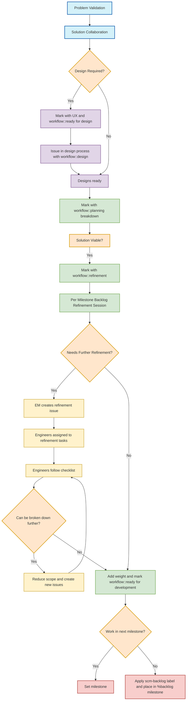

## 共通リンク

| **カテゴリ**            | **ハンドル** |
|-------------------------|-------------|
| **GitLab チームハンドル**  | なし |
| **Slack チャンネル**               | [`#g_create_source-code-review-fe`](https://gitlab.enterprise.slack.com/archives/CS5NHHBJ7) |
| **Slack ハンドル**               | なし |
| **チームボード**         | [`現在のマイルストーン`](https://gitlab.com/groups/gitlab-org/-/boards/1149629) |
| **Issue トラッカー**       | [`gitlab-org/gitlab` の `group::source code` + `frontend`](https://gitlab.com/groups/gitlab-org/-/issues/?sort=created_date&state=opened&label_name%5B%5D=frontend&label_name%5B%5D=group%3A%3Asource%20code&first_page_size=20) |
| **Sentry ダッシュボード**       | [`過去 7 日間のエラー`](https://new-sentry.gitlab.net/organizations/gitlab/dashboard/22/?project=4&statsPeriod=7d) |

## チームのビジョン

GitLab ユーザーのエクスペリエンスの中心的な部分として、[DevOps ライフサイクル](/handbook/product/categories/#devops-stages)の [Create ステージ](/handbook/product/categories/#create-stage)の [Source Code グループ](/handbook/product/categories/#source-code-group)に属するすべてのプロダクトカテゴリに対して、革新的で喜ばれるエクスペリエンスを維持します。プロダクトの方向性については、[カテゴリ方向 - Source Code Management](https://about.gitlab.com/direction/create/source_code_management/) ページをご覧ください。

## チームのミッション

実装、技術的負債の管理、ディスカバリーフェーズでのタイムリーなフロントエンドの知見提供など、フロントエンドエンジニアリングの専門知識ですべてのカウンターパートをサポートします。

## 一般的に監視している Issue リスト

* [Source Code + フロントエンドの Issue](https://gitlab.com/groups/gitlab-org/-/issues/?sort=created_date&state=opened&label_name%5B%5D=frontend&label_name%5B%5D=group%3A%3Asource%20code&first_page_size=20)
* [マイルストーン計画 Issue](https://gitlab.com/gitlab-org/create-stage/-/issues/?sort=created_date&state=opened&label_name%5B%5D=group::source%20code&first_page_size=20)
* [トリアージレポート](https://gitlab.com/gitlab-org/quality/triage-reports/-/issues/?sort=created_date&state=opened&label_name%5B%5D=type%3A%3Aignore&label_name%5B%5D=group%3A%3Asource%20code&first_page_size=20)
* [フィーチャーフラグレポート](https://gitlab.com/gitlab-org/quality/triage-reports/-/issues/?sort=created_date&state=opened&label_name%5B%5D=triage%20report&label_name%5B%5D=feature%20flag&label_name%5B%5D=group%3A%3Asource%20code&first_page_size=20)
* [OKR（機密）](https://gitlab.com/gitlab-com/gitlab-OKRs/-/issues/?sort=created_date&state=opened&assignee_username%5B%5D=andr3&label_name%5B%5D=group%3A%3Asource%20code&first_page_size=20)

## チームメンバー

以下の人々は Create:Source Code FE チームの恒久メンバーです:


<p class="my-3 text-sm text-gray-600 italic">チームメンバー情報は <a href="https://handbook.gitlab.com/handbook/engineering/devops/create/source-code/frontend/#team-members" rel="external noopener">原文 (英語)</a> を参照してください。</p>


## 安定したカウンターパート

以下のメンバーは他の機能チームのメンバーで、私たちの安定したカウンターパートです:


<p class="my-3 text-sm text-gray-600 italic">チームメンバー情報は <a href="https://handbook.gitlab.com/handbook/engineering/devops/create/source-code/frontend/#team-members" rel="external noopener">原文 (英語)</a> を参照してください。</p>


## 主な責任

* プロダクトと UX とのコラボレーションによるアイデア出し、リファインメント、関連作業のスケジューリング
* [Source Code Management プロダクトカテゴリ](https://about.gitlab.com/direction/create/source_code_management/)での機能開発、バグ修正のためのフロントエンドサポートの提供
* バグレポートとリグレッションへの対応
* 開発者エクスペリエンスを改善するためのメンテナンス作業の特定と準備
* フロントエンド部門全体にわたる取り組みへの協力

## AI プロンプト

私たちは効率化のために使用する[共通 AI プロンプト](/handbook/engineering/devops/create/source-code/ai-prompts/)のリストを管理しています。

## プロジェクト

### アクティブプロジェクトテーブル

| 開始日 | プロジェクト  | 説明 | テックリード |
| ------ | ------ | ------ |  ------ |
| 2023-09 | [新しい Diffs](/handbook/engineering/architecture/design-documents/rapid_diffs/)（[エピック](https://gitlab.com/groups/gitlab-org/-/epics/11559)）| GitLab 全体で差分を再利用可能かつパフォーマンス良くレンダリングする方法を提供するプロジェクト | — |
| 2023 | [Blob ページでの Blame 情報](https://gitlab.com/groups/gitlab-org/-/epics/11471) | Blob ページで blame 情報をレンダリングしてリポジトリの使いやすさを向上 | — |
| 2025 | [コミットリストのリファクタリング](https://gitlab.com/groups/gitlab-org/-/work_items/17482) | コミットリストを Vue.js アプリにリファクタリングし検索エクスペリエンスを改善 | — |

### アーカイブプロジェクトテーブル

| 開始日 | 終了日 |プロジェクト  | 説明 | テックリード |
| ------ | ------ | ------ |  ------ | ------ |
| 2024-10 | 2026-01 | [ファイルツリーブラウザ](https://gitlab.com/groups/gitlab-org/-/work_items/17781) | リポジトリと Blob ページにツリービューを実装してファイルの閲覧と読みやすさを向上 | — |
| 2024-10 | 2025-02 | [ディレクトリとファイルページの改善](https://gitlab.com/groups/gitlab-org/-/epics/12557) | ディレクトリとファイルページのヘッダーエリアのユーザーエクスペリエンスを改善するプロジェクト | — |
| 2023 | 2024 | [ブランチルール - 編集](https://gitlab.com/groups/gitlab-org/-/epics/8075) | 1 か所でブランチルールの詳細を編集できるようにする | — |
| 2022-09 | 2023-04 | ブランチルール - 概要 | ブランチルールに関連するすべての設定を 1 か所に集約 - 概要のみ | — |
|  2021      | 2022        | [リポジトリブラウザを 1 つの Vue アプリにリファクタリング](https://gitlab.com/groups/gitlab-org/-/epics/5531) | よりスムーズなエクスペリエンスのためにリポジトリフロントエンドアプリ内で Blob ページをレンダリング | — |

## エンジニアリングオンボーディング

### 作業

一般的に、私たちは標準的な GitLab [エンジニアリングワークフロー](/handbook/engineering/workflow/)を使用します。Create:Source Code FE チームと連絡を取るには、関連するプロジェクト（通常は [GitLab](https://gitlab.com/gitlab-org/gitlab)）に Issue を作成し、`~"group::source code"` と `~frontend` ラベル、および他の適切なラベル（`~devops::create`、`~section::dev`）を追加することが最善です。その後、上記にリストされた関連プロダクトマネージャーおよび/またはエンジニアリングマネージャーに自由にピンしてください。

より緊急な事項については、Slack の [#g_create_source_code](https://gitlab.slack.com/archives/g_create_source-code) または [#g_create_source_code_fe](https://gitlab.slack.com/archives/g_create_source-code-review-fe) を利用してください。

[サポートするカテゴリ別機能についてはこちらをご覧ください。](/handbook/product/categories/features/#source-code)

### コードレビュー

知識のサイロ化を防ぎ、チーム外からの意見を受け取るために、以下の原則に従います:

* すべてのマージリクエストがチームを通じる必要はありません
* ただし、チームが認識すべき重要なマージリクエストについては、レビューの少なくとも 1 つがチームメンバーを通じるようにします

**チームにとって重要な MR:** これらはアプリのロジックへの変更や意味のあるコンポーネント変更です。大きなエピックでの継続的な作業もチーム内のピアからの監視が有益です。しかし、最終的には自分の判断で行ってください。


<!-- include omitted: includes/engineering/create/conventional-comments.md (no localized version under content/ja/) -->


### Issue のリファインメント

1. 問題を検証したら、プロダクト、UX、エンジニアリングが協力してソリューションを提案し、技術的に実現可能なものを決定します。提案されたソリューションは、問題を解決するかどうかを検証するためにユーザーと共有される場合があります。
    1. デザイン作業が必要な Issue は `UX` と `workflow::ready for design` でマークされます。
    1. デザインプロセス中の Issue は `workflow::design` でマークされます。
    1. デザインが準備でき、提案されたソリューションが実現可能と判断されたら、`workflow::planning breakdown` ラベルが適用されます。
1. 提案されたソリューションが実現可能であることを確認したら、できる限り分解する段階に移ります。Issue がこの段階に準備できたら、PM は `workflow::refinement` ラベルを Issue にマークして次のステップを示します。
1. 「マイルストーンごと」の定期バックログリファインメントセッションが 1 回あります。その際、バックログの Issue を一緒にレビューします。各エンジニアも、配信候補としてチームが取り組む価値があると考える Issue を提案します。
    1. Issue にさらなるリファインメントが必要な場合、`workflow::refinement` ラベルのついたタスクをエンジニアに配分します。
    1. Issue にさらなるリファインメントが必要ない場合、`workflow::ready for development` ラベルが適用されます。
    1. チームが次のマイルストーンで Issue に取り組むべきと考える場合は、マイルストーンを設定します。そうでない場合は `scm-backlog` ラベルを適用して `%backlog` マイルストーンに配置します。
1. EM はリファインメント Issue を作成し（[例](https://gitlab.com/gitlab-com/create-stage/source-code-be/-/issues/249)）、`workflow::refinement` ラベルのついたタスクをエンジニアに配分します。
1. エンジニアまたは EM は割り当てられた Issue のチェックリストに従い、必要に応じて PM、UX、その他のエンジニアリングカウンターパートと協力して質問や懸念事項に対処します。
1. Issue の計画された実装をさらに分解できる場合、エンジニア/EM は PM と協力してスコープを縮小し、そうなるまで新しい Issue を作成します（PM またはエンジニア/EM のどちらも新しい作業アイテムを作成できます）。
1. Issue が完全にリファインされたら、エンジニアまたは EM は適切な[重み](/handbook/engineering/devops/create/source-code/backend/#weight-categories)を追加し、`workflow::ready for development` としてラベルを付けます。これらの Issue はマイルストーンに追加できます。

#### 図



### Issue リファインメントチェックリスト

リファインメントが必要な Issue に対して、エンジニア/EM はこのテンプレートを使用してコメントを追加し、すべてのチェックリストアイテムを完了させる必要があります。

これらのステップのいずれかを完了できない場合は、EM/PM にピンしてください。

```plaintext
# Issue Refinement Checklist

## Problem verification
- [ ] Issue label is ~"workflow::refinement"
- [ ] Issue title clearly describes the feature or change
- [ ] Issue description defines requirements and expectations
- [ ] Required permissions and access levels defined
- [ ] Desktop design is defined (if needed)
- [ ] Mobile design is defined (if needed)

## Implementation plan

- [ ] A comment with an implementation plan is created
- [ ] Implementation plan includes accessibility specification (if needed)
- [ ] Implementation plan includes proposal for ~"analytics instrumentation" (if needed)
- [ ] A separate issue is opened for adding ~"analytics instrumentation" and linked to this issue (if needed)
- [ ] Implementation plan includes ~documentation changes (if needed)
- [ ] Implementation plan includes proposal for adding feature tests (if needed)
- [ ] Implementation plan includes feature tests (if needed)
- [ ] Issue is small and doesn't need to be broken down

## Final steps
- [ ] This issue has a weight
- [ ] There are no blockers
- [ ] Issue has ~"workflow::ready for development" label
```

### バグリファインメントチェックリスト

リファインメントが必要なバグレポートに対して、エンジニア/EM はこのテンプレートを使用してコメントを追加し、すべてのチェックリストアイテムを完了させる必要があります。

```plaintext
# Bug Refinement Checklist

## Bug verification
- [ ] Issue label is ~"workflow::refinement"
- [ ] Issue label is ~"type::bug"
- [ ] Issue title clearly describes the bug
- [ ] Steps to reproduce are documented
- [ ] Issue is still reproducible
- [ ] Severity labels are defined
- [ ] Related logs or error messages are attached

## Technical analysis
- [ ] Root cause has been identified or hypothesized
- [ ] Affected components/services are identified
- [ ] Potential side effects of the fix are considered

## Implementation plan
- [ ] A comment with an implementation plan is created
- [ ] Fix scope is contained and doesn't require larger refactoring
- [ ] Test cases to verify the fix are defined

## Final steps
- [ ] This issue has a weight
- [ ] There are no blockers
- [ ] Issue has ~"workflow::ready for development" label
```

### 実装計画

リファインメント中の Issue に対して、提供されたテンプレートを使用してコメントを追加してください。

```plaintext
### Implementation Plan

**1. Approach**

<!-- Provide a high-level description of the implementation idea -->

**2. Dependencies**

- [ ] Requires ~backend
- [ ] Requires ~frontend
- [ ] Requires ~database
- [ ] Requires ~documentation
- [ ] Requires ~UX work
- [ ] External service dependencies identified
- [ ] Requires ~API changes

**3. Implementation Steps**

<!-- Provide step by step description of what needs to be done -->

- Task 1
- Task 2
- Task 3

**4. Edge Cases**

<!-- Does the implementation cover all scenarios (success, failure) -->

- Success scenarios:
  - Case 1
  - Case 2

- Error scenarios:
  - Case 1
  - Case 2

- Edge conditions:
  - Case 1
  - Case 2


@engineer_username please review this implementation plan.
<!--
Pick a peer engineer following this criteria:
1. is a subject matter expert.
2. might have some familiarity with the topic. or
3. ask on slack who'd be available to review this plan before the due date of the issue
-->
```

### キャパシティ計画


<!-- include omitted: includes/engineering/create/capacity-planning-fe.md (no localized version under content/ja/) -->


#### 重み


<!-- include omitted: includes/engineering/create/weights-fe.md (no localized version under content/ja/) -->


#### 重みの例

w1: [Blame ビュー - 「authored」行が次の行にリーク](https://gitlab.com/gitlab-org/gitlab/-/issues/435124)

w2: [大きなファイルの CSV レンダリングがビューアをハング](https://gitlab.com/gitlab-org/gitlab/-/issues/340779)

w3: [ブランチルールの編集: Deploy Keys の検索をサポートするようにセレクターを更新](https://gitlab.com/gitlab-org/gitlab/-/issues/431769)

#### Source Code のコンテキスト

Blob ビューに関連する Issue に重みを付ける際は、Blob の二重性を考慮してください。Blob ビューのレンダリングには HAML と Vue の両方を使用しています。変更を両方に実装することになる可能性が高いです。ほとんどのファイルタイプは Vue アーキテクチャを使用します。ただし、[バックエンドの構文ハイライターが必要なファイルタイプ](https://gitlab.com/gitlab-org/gitlab/-/blob/9fe882b3d1597a75a366755c8d894f2a52439d93/app/assets/javascripts/repository/constants.js#L91)があり、それらは HAML でレンダリングされます。[エラーが発生した場合](https://gitlab.com/gitlab-org/gitlab/-/blob/9fe882b3d1597a75a366755c8d894f2a52439d93/app/assets/javascripts/repository/components/blob_content_viewer.vue#L210)も同様です。

この二重性は [highlight.js で依存ファイルを表示する際にパッケージマネージャーへのリンク](https://gitlab.com/groups/gitlab-org/-/epics/7888)で解決される予定です。

#### スパイク Issue


<!-- include omitted: includes/engineering/create/spike-issues.md (no localized version under content/ja/) -->


### ワークフローラベル


<p class="my-3 text-sm text-gray-600 italic">ワークフローラベルは <a href="https://handbook.gitlab.com/handbook/engineering/devops/create/source-code/frontend/#workflow" rel="external noopener">原文 (英語)</a> を参照してください。</p>


### 非同期スタンドアップ

Source Code グループのグループは、毎月曜日に [#g_create_source_code_standup](https://gitlab.slack.com/archives/g_create_standup) チャンネルで非同期スタンドアップを行います。

目標は、これらのグループのメンバーが個人レベルでつながることをサポートすることであり、人々の進捗を確認したり、状況を伝えたり助けを求めるための既存のプロセスを置き換えるものではありません。質問はその点を念頭に置いて書かれています:

* 前回話してから仕事以外では何をしましたか？
* 今日は何をする予定ですか？
* 進捗や生産性を妨げているものはありますか？

詳細については、Create ステージの Issue トラッカーの[非同期スタンドアップフィードバック Issue](https://gitlab.com/gitlab-org/create-stage/issues/4) を参照してください。

### レトロスペクティブ

「マイルストーンごと」の定期レトロスペクティブが 1 回あり、特定のケースを分析する、通常はイテレーションアプローチに焦点を当てた「機能ごと」のアドホックなレトロスペクティブを行う場合もあります。

#### マイルストーンごと


<p class="my-3 text-sm text-gray-600 italic">レトロスペクティブは <a href="https://handbook.gitlab.com/handbook/engineering/devops/create/source-code/frontend/#retrospectives" rel="external noopener">原文 (英語)</a> を参照してください。</p>


### マイルストーンキックオフとレトロスペクティブレビュー

各マイルストーンの開始時に、すべての IC が新しいマイルストーンの成果物の計画を発表する同期型の**キックオフ**セッションがあります。

これは、すべての成果物が割り当てられてから少なくとも 2 営業日後に行われ、マイルストーンの初日に割り当てが行われます。

デザインから追加の情報が必要な場合は、ミーティング後にデザイナーへのリクエストリストが発行されます。

このコール中に、非同期の Issue で議論されたハイライトを振り返る簡単な**レトロスペクティブレビュー**も行います。

## 関連ページ

### Issue

* 2020 年 4 月: [フロントエンド: イテレーションレトロスペクティブ (Source Code)](https://gitlab.com/gl-retrospectives/create-stage/source-code/-/issues/22)
