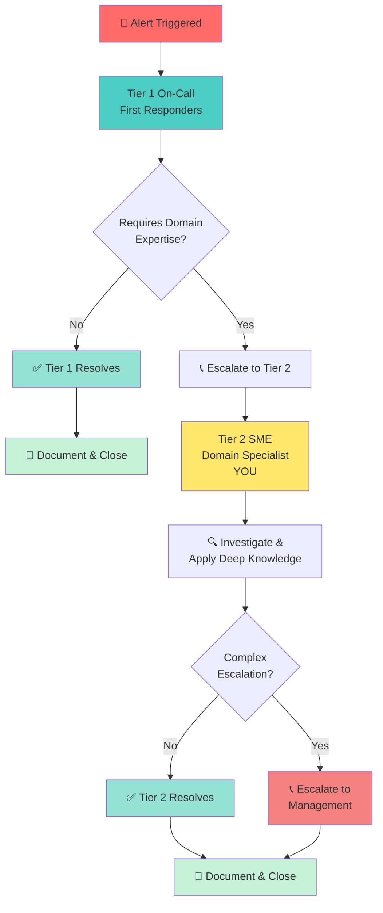

## Tier 2 オンコールとは何ですか？

インシデント対応を病院のトリアージシステムに例えて考えてみましょう：

Tier 1 は最初の対応者で、全システムのすべてのアラートに対応します。実際に何が壊れているか、どの程度深刻かを判断します。

Tier 2（SME スペシャリスト）は、特定のドメインやサービスに深い知識が必要な問題が発生したときに呼ばれる専門家です。あなたは自分の特定のシステムのコード・アーキテクチャ・特性を熟知しています。

Tier 1 があなたのドメインで複雑な問題に遭遇すると、あなたにエスカレーションします。あなたは彼らが問題解決を信頼するスペシャリストです。

## これは私たちの組織にどのように位置づけられますか？

私たちのインシデント対応には複数の層があり、適切な人が適切な問題を適切なタイミングで処理できるようになっています：

## Tier 2 オンコールは実際にどんなことをしますか？

オンコール中は、シフト中（具体的な時間はローテーションで定義されます）に連絡が取れる状態を保ち、重大な問題でページを受けたら15分以内に対応し、自分のドメインの問題を調査・解決し、インシデント中の進捗と次のステップを伝え、他の人が学べるように起きたことをドキュメント化し、シフトが終わったら次のオンコールエンジニアに引き継ぐ責任があります。

何でも知っていることや、すべての問題を即座に修正することは求められません。対応できること、関与すること、そして問題が発生したときに掘り下げる意欲があることが求められます。

## なぜ Tier 2 オンコールがあるのですか？

このプログラムは、ドメイン固有の問題に対応できる専門家を配置することでプラットフォームを安定させ、全員があらゆる問題のページを受けなくてすむよう負荷を分散し、本番の問題の所有権と経験を持つことでエンジニアを育成し、何が壊れてどう修正したかをドキュメント化することで組織の知識を構築するために存在します。

## 誰が関わっていますか？

Tier 2 オンコールプログラムには、あなたとチームメートが Tier 2 エンジニアとして、スケジュールとエスカレーションパスを管理するローテーションリーダーが、あなたをページする最初の対応者として Tier 1 オンコールが、複雑なインシデント中に調整する IMOC が、そしてサポートとエスカレーションを提供するマネジメントが関わっています。

### 関連ページ

- [最初のシフト](/handbook/engineering/devops/oncall/your-first-shift) — 最初のオンコールローテーションの準備をする
- [コミュニケーションとカルチャー](/handbook/engineering/devops/oncall/communication-and-culture) — インシデント中のコミュニケーション方法を学ぶ
- [オンコールプロセスとポリシー](/handbook/engineering/infrastructure-platforms/incident-management/on-call/) — Tier 2 固有の責任について学ぶ
