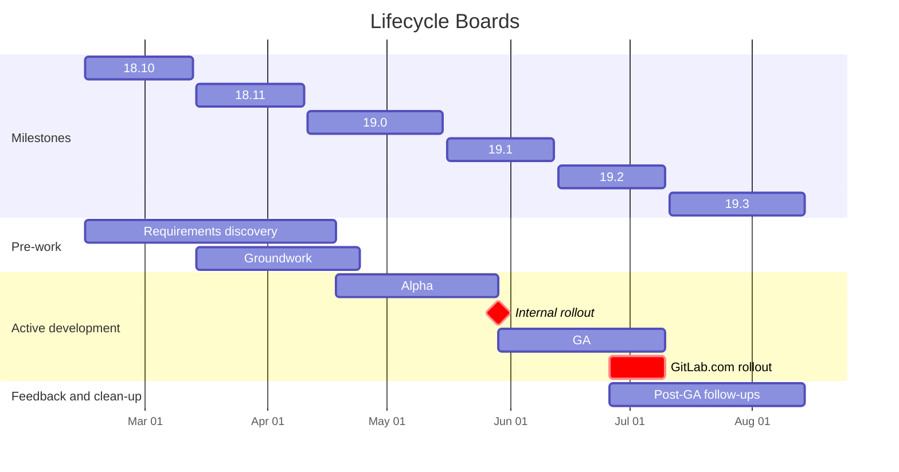

## タイムライン



## ステージ

認知的負荷を減らし、[最小限の価値ある変更](/handbook/values/#minimal-valuable-change-mvc)にスコープを絞り込むために、プロジェクトを時間制限のあるステージに分割します。これにより:

- 認知的負荷が減少します — エンジニアはより小さな変更、より小さな要件のセット、そしてより少ない Issue に取り組みます。
- プロジェクト管理が簡単になり、遅延を早期に発見できます — 小さなステージの方が追跡しやすく、遅れに気づきやすいです。
- バグやフィードバックをより早く表面化できます。

| ステージ | 成果 |
|-------|---------|
| **要件発見** | 後続のステージのスコープに関する意思決定。作業が Issue に分解される。プロジェクトの大まかな見積もり。スコープ外のことの明確な定義。 |
| **基盤作業** | 残りの開発を容易にするリファクタリングと適応。 |
| **アルファ版** | コアワークフローがドッグフーディングと内部テストに使用できるが、エッジが粗い場合がある。内部テストフィードバックへの対応を含む。 |
| **GA** | ユーザーへのリリースに満足できる最小限のまとまった体験。アルファ版のユーザーフィードバックへの対応、粗いエッジの修正、フィーチャーフラグのロールアウト期間（マイルストーンカットオフの約 2 週間前）を含む。 |
| **GA 後のフォローアップ** | 初回リリース後に延期された機能、ユーザーフィードバック、コードとテストのクリーンアップ。GA から 1 〜 2 マイルストーン以内に完了する必要があります。判断に迷う場合はスコープ外に入れてください。 |
| **スコープ外** | コミットなし。後で行われるか、再優先化されるか、クローズされる可能性があります。 |

## エピックの構成

```plain
Lifecycle Boards (top-level epic)
├── Lifecycle Boards — Requirements discovery
│   ├── UX discussions (issue)
│   ├── Lifecycle Boards — Card (epic)
│   ├── Lifecycle Boards — Columns (epic)
│   └── ...
├── Lifecycle Boards — Groundwork
│   ├── Refactor work item listing page (epic)
│   ├── Load work items via REST API instead of GraphQL on listing pages (epic)
│   └── ...
├── Lifecycle Boards — Alpha
│   ├── Status columns (epic)
│   │   ├── Load available statuses (issue)
│   │   └── Load work items by column (issue)
│   ├── Card (epic)
│   ├── API changes (epic)
│   ├── Transform view preferences dropdown into drawer (epic)
│   ├── Card drag and drop (epic)
│   │   ├── Persist changes (issue)
│   │   └── Basic animation (issue)
│   └── ...
├── Lifecycle Boards — GA
│   ├── Internal testing feedback (issue)
│   ├── Card enhancements (epic)
│   ├── Feature flag rollout (epic)
│   ├── Card drag and drop (epic)
│   │   ├── Improved animation (issue)
│   │   └── Highlight available and unavailable columns (issue)
│   └── ...
├── Lifecycle Boards — Post-GA follow-ups
│   ├── User feedback (issue)
│   ├── Feature flag removal (epic)
│   ├── Old code cleanup (epic)
│   ├── Tests cleanup (epic)
│   └── ...
└── Lifecycle Boards — Out of scope
```
