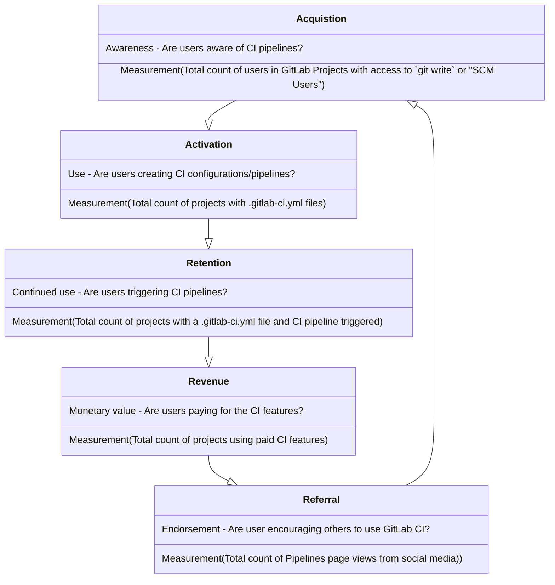

このチームは [Verify](/handbook/product/categories/#verify-stage) DevOps ステージにマッピングされており、Continuous Integration [ユースケース](/handbook/marketing/brand-and-product-marketing/product-and-solution-marketing/usecase-gtm/ci/) をサポートしています。

## ビジョン

このチームが何に取り組む予定かを理解するには、[プロダクトビジョン](https://about.gitlab.com/direction/verify/) をご覧ください。このチームは以下の方向性の実現に責任を持ちます：

- [Continuous Integration](https://about.gitlab.com/direction/verify/continuous_integration/)
- [マージトレイン](https://about.gitlab.com/direction/verify/merge_trains/)

## ミッション

パフォーマンスが高く、スケーラブルで、使いやすい Continuous Integration プロダクトを作成・サポートすることにより、ソフトウェア開発をより簡単に、より速く、より信頼できるものにします。

Verify:Pipeline Execution グループは、[Continuous Integration](https://about.gitlab.com/solutions/continuous-integration/) に関する機能のサポートに重点を置いています。PE グループにとって重要な取り組みは、パフォーマンス指標で追跡している成果を達成する機能を提供することです。

## 推進要因

### パフォーマンス

- 顧客視点での体感パフォーマンスの向上（例：レスポンシブな UI、結果表示時間の短縮）。
- Pipeline Execution が所有するコードの処理時間の短縮。
- 結果の信頼性の確保（例：ウェブリクエストに対してタイムリーに結果を返す（スケーラビリティと重複））。

### スケーラビリティ

- 多数の顧客のサポート。
- 大規模かつ複雑な構成を持つ単一顧客のサポート。

### 開発者効率

- コードベースの複雑さの軽減。
- チームが所有するコードの幅広さへの対処。
- MR がレビュープロセスを通過するのにかかる時間の短縮。
- コミュニティコントリビューションに関連した効率の確保：
  - Issue をコミュニティがアプローチしやすくすること。
  - コミュニティコントリビューションのレビュープロセスの効率改善。

### カスタマーエクスペリエンス

- 顧客の Issue をタイムリーに解決すること。
- SUS に影響する Issue をタイムリーに対処すること。
- 信頼性が高く正確なドキュメントを提供すること。

## パフォーマンス指標

私たちが貢献している価値は、パフォーマンス指標（PI）を使用して測定しています。PI を定義し、進捗の追跡に活用しています。現在の [Pipeline Execution グループの PI](https://internal.gitlab.com/handbook/company/performance-indicators/product/#verify-ci-verify-runner-count-of-pipelines-triggered-by-unique-users) は `ci_pipelines をトリガーしたユニークユーザー数` です。詳細については [プロダクトチームパフォーマンス指標](https://internal.gitlab.com/handbook/company/performance-indicators/product/#regular-performance-indicators) をご確認ください。最新の Verify ステージ ci_pipeline データは [Tableau ダッシュボード](https://10az.online.tableau.com/t/gitlab/views/VerifyPerformanceIndicatorDashboard/VerifyPerformanceIndicatorHub) でご確認いただけます。

### 利用ファネル

AARRR フレームワーク（Acquisition、Activation、Retention、Revenue、Referral）に基づき、このファネルは GitLab CI を利用する顧客のジャーニーを表しています。ファネルの各ステートは行動を測定するメトリクスで定義されています。プロダクトマネージャーは、望ましいアクションを促す機能を優先させるため、ファネルのさまざまなステートに注目することができます。

### コアドメイン

| ドメイン | Issue |
| ------ | ------ |
| パイプライン処理：パイプライン、ステージ、ジョブの状態遷移を担うプロセス | [~pipeline processing](https://gitlab.com/gitlab-org/gitlab/-/issues/?sort=milestone_due_desc&state=opened&label_name%5B%5D=pipeline%20processing&label_name%5B%5D=group%3A%3Apipeline%20execution&first_page_size=20) |
| Rails-Runner 間通信：ジョブのキューイング、API エンドポイント、および Runner によって・Runner のために実行される操作に関連する基盤機能 |  |

#### Continuous Integration ドメイン

| ドメイン | Issue |
| ------ | ------ |
| Continuous Integration および Deployment 管理エリア設定 | [~CI/CD Settings](https://gitlab.com/gitlab-org/gitlab/-/issues/?sort=milestone_due_desc&state=opened&label_name%5B%5D=CI%2FCD%20Settings&label_name%5B%5D=group%3A%3Apipeline%20execution&first_page_size=20) |
| グループのリポジトリ分析 | [~CI reports](https://gitlab.com/gitlab-org/gitlab/-/issues/?sort=milestone_due_desc&state=opened&label_name%5B%5D=CI%20reports&label_name%5B%5D=group%3A%3Apipeline%20execution&first_page_size=20) |
| GitLab CI/CD アーティファクトレポートタイプ | [~CI reports](https://gitlab.com/gitlab-org/gitlab/-/issues/?sort=milestone_due_desc&state=opened&label_name%5B%5D=CI%20reports&label_name%5B%5D=group%3A%3Apipeline%20execution&first_page_size=20) |
| ユニットテストレポート | [~testing::code testing](https://gitlab.com/gitlab-org/gitlab/-/issues/?sort=milestone_due_desc&state=opened&label_name%5B%5D=testing%3A%3Acode%20testing&label_name%5B%5D=group%3A%3Apipeline%20execution&first_page_size=20) |
| GitLab CI/CD でテストし、マージリクエストでレポートを生成 |  |
| 負荷パフォーマンステスト | [~testing::load performance](https://gitlab.com/gitlab-org/gitlab/-/issues/?sort=milestone_due_desc&state=opened&label_name%5B%5D=testing%3A%3Aload%20performance&label_name%5B%5D=group%3A%3Apipeline%20execution&first_page_size=20) |
| メトリクスレポート |   |
| テストカバレッジの可視化 | [~testing::coverage](https://gitlab.com/gitlab-org/gitlab/-/issues/?sort=milestone_due_desc&state=opened&label_name%5B%5D=testing%3A%3Acoverage&label_name%5B%5D=group%3A%3Apipeline%20execution&first_page_size=20) |
| ブラウザパフォーマンステスト | [~testing::browser performance](https://gitlab.com/gitlab-org/gitlab/-/issues/?sort=milestone_due_desc&state=opened&label_name%5B%5D=testing%3A%3Abrowser%20performance&first_page_size=20) |
| フェイルファストテスト |   |
| アクセシビリティテスト | [~testing::accessibility](https://gitlab.com/gitlab-org/gitlab/-/issues/?sort=milestone_due_desc&state=opened&label_name%5B%5D=testing%3A%3Aaccessibility&label_name%5B%5D=group%3A%3Apipeline%20execution&first_page_size=20) |
| ユーザビリティテスト | [~testing::usability](https://gitlab.com/gitlab-org/gitlab/-/issues/?sort=milestone_due_desc&state=opened&label_name%5B%5D=testing%3A%3Ausability&label_name%5B%5D=group%3A%3Apipeline%20execution&first_page_size=20) |
| レビューアプリ（廃止予定） | [~testing::review apps](https://gitlab.com/gitlab-org/gitlab/-/issues/?sort=milestone_due_desc&state=opened&label_name%5B%5D=testing%3A%3Areview%20apps&label_name%5B%5D=group%3A%3Apipeline%20execution&first_page_size=20) |
| ビジュアルレビューツール（廃止予定） | [~testing::visual review tool](https://gitlab.com/gitlab-org/gitlab/-/issues/?label_name%5B%5D=testing%3A%3Avisual%20review%20tool) |
| スケジュールパイプライン | [~pipeline schedules](https://gitlab.com/gitlab-org/gitlab/-/issues/?sort=milestone_due_desc&state=opened&label_name%5B%5D=pipeline%20schedules&label_name%5B%5D=group%3A%3Apipeline%20execution&first_page_size=20)  |
| パイプライン効率 | [~ci::scaling](https://gitlab.com/gitlab-org/gitlab/-/issues/?sort=milestone_due_desc&state=opened&label_name%5B%5D=ci%3A%3Ascaling&label_name%5B%5D=group%3A%3Apipeline%20execution&first_page_size=20)  |
| Docker を使ったイメージビルド |   |
| 外部 SCM および CI インテグレーション |   |
| 外部パイプライン検証 |   |
| パイプライン作成のレートリミット | [~Category:Continuous Integration + ~Eng-Inter-Dept::Rate Limits](https://gitlab.com/gitlab-org/gitlab/-/issues/?sort=milestone_due_desc&state=opened&label_name%5B%5D=Category%3AContinuous%20Integration&label_name%5B%5D=group%3A%3Apipeline%20execution&label_name%5B%5D=Eng-Inter-Dept%3A%3ARate%20Limits&first_page_size=20)  |
| ジョブログ |   |
| ジョブログアーティファクト |   |
| マージトレイン | [~Category:Merge Trains](https://gitlab.com/gitlab-org/gitlab/-/issues/?sort=milestone_due_desc&state=opened&label_name%5B%5D=group%3A%3Apipeline%20execution&label_name%5B%5D=Category%3AMerge%20Trains&first_page_size=20)  |

Pipeline Execution グループのドメインに含まれないもの：

- シークレット管理（[方向性ページ](https://about.gitlab.com/direction/software_supply_chain_security/pipeline_security/secrets_management/)を参照）
- Pipeline Authoring（[方向性ページ](https://about.gitlab.com/direction/verify/pipeline_composition/)を参照）
- パイプラインのコンプライアンス（[方向性ページ](https://about.gitlab.com/direction/software_supply_chain_security/compliance/compliance-management/)を参照）
- [ジョブアーティファクト：アーティファクトのストレージと管理は多くの CI/CD 機能のゲートウェイ](https://about.gitlab.com/direction/verify/)

---

## テクニカルロードマップ

### FY25

これらは年間のハイレベルなエンジニアリング主導の目標です。私たちのすべての目標と同様に、野心的であり変更される可能性があります。

#### パフォーマンス

##### パイプライン速度

**目標：**

- パイプライン速度を改善するために何ができるかを理解する
- 少なくとも 1 つの大きな改善をプロトタイプ化する

##### 長期に渡るパイプラインステータス Issue の修正

**目標：**

- 既存のパイプラインステータス Issue とコードを深く調査する
  - 多数の Issue に対処するための体系的な変更の有無を判断し、実施する

#### スケーラビリティ

##### Sidekiq

**目標：**

- バックグラウンドワーカーのパフォーマンスを改善し、信頼性とスケーラビリティを向上させる

##### ジョブ検索機能の改善サポート

**目標：**

- ジョブの追加検索とフィルタリング機能をサポートする能力を強化する

##### 運用コストの削減

**目標：**

- データ保持計画への貢献
- ジョブログの圧縮によるコスト削減の可能性を特定する - [スパイク](https://gitlab.com/gitlab-org/gitlab/-/issues/390114)
  - 結果に応じて、圧縮を実装する作業をスケジュールする

#### 開発者効率

##### 技術的負債の削減

**目標：**

- コードベース内の技術的負債全体を削減する
- フォローアップ Issue を迅速にスケジュールして長期的な負債の蓄積を回避する

##### フロントエンドの Vue へのリファクタリング

**目標：**

- パイプラインサブスクリプションページの Vue へのリファクタリングを完了する
- リファクタリングすべき追加エリアを特定する [Epic](https://gitlab.com/groups/gitlab-org/-/epics/12836)

##### パイプラインレンダリング

**目標：**

- パイプラインページのレンダリングのパフォーマンス改善を完了する。この機能は開発者が頻繁に使用しており、パフォーマンスが低いと生産性に影響します。

##### マージトレイン

**目標：**

- マージトレインを GitLab プロジェクトで効果的に使用できる程度にスケーラブルな状態にする。

---

## チームメンバー

チームメンバー情報は <a href="https://handbook.gitlab.com/handbook/engineering/devops/verify/pipeline-execution/#team-members" rel="external noopener">原文 (英語)</a> を参照してください。

### チームの追加責任

これらの役割・責任は、チームメンバーに持ち回りで割り当てられます。これにより、チーム全体に負荷を分散し、特定の個人がこれらのタスクの唯一の担当者になることで過度な負担を抱えないようにします。

#### フロントラインレスポンダー

このチームメンバーは、マイルストーン期間中に以下の責任を持ちます（優先順位順）。~Deliverable の割り当てはありません：

1. Pipeline Execution の broken-master アラートへの対応。
1. サポートからの受信ヘルプリクエストの DRI。
    1. 既存のヘルプリクエストは、現在の DRI の判断によって引き継がれる場合があります。
    1. リクエストの対応には必要に応じて他のメンバーを引き込めますが、リクエストが確実に対処されるよう DRI として残ります。
1. 別のチームメンバーを選ぶ明確な理由がない限り、顧客エスカレーションに最初に引き込まれる開発者。
1. 【任意】追加チームメンバーとヘルプリクエストに取り組むための週次スウォームミーティングの企画・ホスト。
1. `#pipeline-execution` および `#s-verify`（Pipeline Execution に関連する場合）の Slack で受信した質問への対応。
    1. 必要に応じて他のチームメンバーに転送できます。重要なのは私たちが応答力を持つことを確保することです。
1. エラーバジェットの超過に関する調査。
1. 追加メンテナンスタスク（推奨優先順位順）：
    1. 時間の許す範囲でフレーキーなテストに対処する。
    1. 時間の許す範囲で長期的なメンテナンス Issue に取り組む。
        1. 例：対処が必要な非常に古いフィーチャーフラグのリストがあります。
    1. ~"cicd::planning" の ~"type::maintenance" Issue の精査（時間の許す範囲で）。
    1. ~"cicd::active" のその他の ~"type::maintenance" Issue（時間の許す範囲で）。

上記のタスクのいずれかについて、チームメンバーの勤務時間外に緊急事態が発生した場合、他のチームメンバーが最初に対応する必要があります。そのマイルストーンのフロントラインレスポンダーは、自分の勤務時間中にそのような Issue をフォローアップする責任があります。マイルストーン期間中に 24 時間 365 日オンコールであることは期待されません。マイルストーンの終わりに、まだ進行中の Issue は次のファーストレスポンダーに引き継ぐ場合があります。元のチームメンバーが引き続き DRI であり続けることが理にかなっている場合は、そのようにすることもできます。

#### コミュニティコーディネーター

このチームメンバーは、~Deliverable タスクに加えてマイルストーン期間中に以下の責任を持ちます：

1. 週次の [`Verify Pipeline teams: Community contributions report`](https://gitlab.com/gitlab-org/quality/triage-reports/-/issues/?sort=updated_desc&state=opened&label_name%5B%5D=Community%20contribution&label_name%5B%5D=devops%3A%3Averify&first_page_size=20) で特定された新しいコミュニティコントリビューションを一次確認し、正しい方向に進んでいるかを確認します。

#### ローテーションスケジュール

**プログラム一時停止中**

| マイルストーン | フロントラインレスポンダー | コミュニティコーディネーター |
| --------- | -------------------- | --------------------- |

## 安定したカウンターパート

安定したカウンターパートは、Pipeline Execution [プロダクトカテゴリリスト](/handbook/product/categories/#pipeline-execution-group) をご確認ください。

## テクノロジー

ほとんどの GitLab バックエンドチームと同様に、メインの [GitLab CE アプリ](https://gitlab.com/gitlab-org/gitlab-ce) の Rails で多くの時間を費やしますが、[GitLab Runner](https://gitlab.com/gitlab-org/gitlab-runner) が書かれている言語である Go でも多くの作業を行います。Docker と Kubernetes の知識もチームで役立ちます。

## 便利なリンク

- [Issue トラッカー：`~group::pipeline execution`](https://gitlab.com/groups/gitlab-org/-/issues?label_name%5B%5D=group%3A%3Apipeline+execution&scope=all)
- [Slack チャンネル：`#g_pipeline-execution`](https://gitlab.slack.com/archives/CPCJ8CCCX)
- [GitLab unfiltered：Pipeline Execution グループ](https://www.youtube.com/playlist?list=PL05JrBw4t0KpsVi6PG4PvDaVM8lKmB6lV)
- [Grafana ダッシュボード](https://dashboards.gitlab.net/d/stage-groups-pipeline_execution/stage-groups-group-dashboard-verify-pipeline-execution?orgId=1)
- [Tableau ダッシュボード（移行予定）](https://gitlab.com/gitlab-data/tableau/-/issues/208)
- [次回プランニング Issue](https://gitlab.com/gitlab-org/ci-cd/pipeline-execution/-/issues/?sort=popularity&state=opened&label_name%5B%5D=Planning%20Issue&first_page_size=20)
- [Pipeline Execution へのヘルプリクエスト](https://gitlab.com/gitlab-com/ops-sub-department/section-ops-request-for-help/-/issues/?state=opened&label_name%5B%5D=Help%20group%3A%3Apipeline%20execution)
- [現マイルストーンのレトロ](https://gitlab.com/gl-retrospectives/verify-stage/pipeline-execution/-/issues?search=Pipeline+Execution+retrospective&sort=popularity&state=opened)
- [重み付け必要なボード](https://gitlab.com/groups/gitlab-org/-/boards/4178322)
- [現マイルストーンボード](https://gitlab.com/groups/gitlab-org/-/boards/1372896)

### 開発ドキュメント

チームに新しく参加した方にとって、プロダクトやテクノロジーについて詳しく学ぶのに役立つリンクです。

- [CI/CD 開発ドキュメント](https://docs.gitlab.com/ee/development/cicd/index.html)

### エンジニアリングの概要

- [CI バックエンドアーキテクチャウォークスルー - 2020年5月](https://www.youtube.com/watch?v=ew4BwohS5OY)
- [フロントエンド CI プロダクト / コードベースの概要 - 2020年6月](https://www.youtube.com/watch?v=7CUd7aAUiWo)

## ダッシュボード

[内部ハンドブックページ](https://internal.gitlab.com/handbook/engineering/core-development/ci/verify/pipeline-execution)をご覧ください。

### クロスファンクショナルな優先順位付け

チームは [`#g_pipeline_execution_quad`](https://gitlab.slack.com/archives/C03KK284L23) Slack チャンネルを使用して、クロスファンクショナルな優先順位付けや、クォッドが協力する必要があるその他のトピックについて議論しています。

## 作業の進め方

[Pipeline Execution ワークフローボード](https://gitlab.com/groups/gitlab-org/-/boards/1372896) は、現在および今後の作業の唯一の情報源です。

### プランニング

プランニングタイムラインは [GitLab プロダクト開発タイムライン](/handbook/engineering/workflow/#product-development-timeline) に従います。

`Engineering Time` に関する情報は [エンジニアリングイニシアティブ](/handbook/engineering/#engineering-initiatives) をご覧ください。

**PM**（必要に応じて **EM** の助けを借りて）は、[`Candidate::x.x` かつ `Engineering Time` でない Issue のリスト](https://gitlab.com/gitlab-org/gitlab/-/issues/?sort=updated_desc&state=opened&label_name%5B%5D=candidate%3A%3A17.x&label_name%5B%5D=group%3A%3Apipeline%20execution&not%5Blabel_name%5D%5B%5D=Engineering%20Time&first_page_size=20) をキュレーションし、いつでも適切な数の高優先度 Issue から選択できるようにします。探しているマイルストーンの Issue がない場合は、将来のマイルストーンから選択できます。

**EM**（必要に応じて **PM** の助けを借りて）は、[`Engineering Time` かつ `Candidate::x.x` の Issue のリスト](https://gitlab.com/gitlab-org/gitlab/-/issues/?sort=updated_desc&state=opened&label_name%5B%5D=candidate%3A%3A17.x&label_name%5B%5D=group%3A%3Apipeline%20execution&label_name%5B%5D=Engineering%20Time&first_page_size=20) を管理し、いつでも適切な数の高優先度 Issue から選択できるようにします。

現在のマイルストーン終了の 2 週間前の金曜日までに、各**エンジニア**は：

- 現在の Issue のマイルストーンが、最新の知識に基づいて完了すると思われるマイルストーンを反映していることを確認する
  - **注：** 完了しない現在のマイルストーンの進行中の Issue は、条件に合致する限り、新しい Issue を選択する代わりに使用できます
    - 進行中の Issue がまだ優先事項かどうか不確かな場合は、EM と PM に確認してください
    - 必要に応じて ~Deliverable または ~Stretch ラベルを更新してください
- 次のマイルストーンで取り組む [`Candidate::x.x` かつ `Engineering Time` でない Issue](https://gitlab.com/gitlab-org/gitlab/-/issues/?sort=updated_desc&state=opened&not%5Blabel_name%5D%5B%5D=Engineering%20Time&label_name%5B%5D=group%3A%3Apipeline%20execution&label_name%5B%5D=candidate%3A%3A17.x&first_page_size=20) を 1 件選択する。~priority::1 の Issue から始め、次に ~priority::2、~priority::3
  - 自分をアサインする
  - ウェイトが設定されていることを確認する
  - 作業が完了すると予想するマイルストーンにマイルストーンを設定する
    - 次のマイルストーンでない場合、できれば次のマイルストーンで完了できるものを含む複数の Issue に分割する
      - 元の Issue のコメントで EM/PM に通知し、残りの Issue が適切に計画されていることを確認する
  - `Deliverable` ラベルを追加する
- 修正する [`flaky-test` Issue](https://gitlab.com/gitlab-org/gitlab/-/issues/?sort=updated_desc&state=opened&label_name%5B%5D=group%3A%3Apipeline%20execution&label_name%5B%5D=failure%3A%3Aflaky-test&first_page_size=20) を 1 件選択する
  - 同じ Issue が原因と明らかに見られる複数の Issue があるかどうかを確認し、これらを関連リンクするかつ/または自分にアサインする
  - テストがいつ修正されるかを示す適切なマイルストーンを設定する
    - タイムラインが不確かな場合、マイルストーンへのコミットが快適になるまで設定を遅らせることができます
- [今後の作業](https://gitlab.com/groups/gitlab-org/-/boards/4178322) について重み付けと精査を行うアイテムを 1 件選択する
  - このアイテムを自分にアサインする。精査プロセスが完了したらアサインを外せます
    - 精査目的のみのアサインであることを示すコメントを追加することで混乱を避けることもできます（完全に任意）
  - Issue にマイルストーンを設定しないでください
  - 精査にかなりの労力が必要な場合は、[精査「~spike」Issue](https://gitlab.com/gitlab-org/gitlab/-/issues/new?issuable_template=Pipeline%20Execution%20Refinement%20Spike) を作成します（[スパイク](#spikes) および [Issue の精査と重み付けのステップ](#steps-for-refining-and-weighting-issues) も参照）
    - スパイクを作成したことを EM にコメントで通知してください
    - これをマイルストーンの `Engineering Time` アイテムとして使用してください
- [コミュニティコントリビューション](https://gitlab.com/groups/gitlab-org/-/boards/4178322) の重み付けと精査を行うアイテムを 1 件選択する
  - このアイテムを自分にアサインする。精査プロセスが完了したらアサインを外せます
    - 精査目的のみのアサインであることを示すコメントを追加することで混乱を避けることもできます（完全に任意）
  - Issue にマイルストーンを設定しないでください
  - 精査にかなりの労力が必要な場合は、[精査「~spike」Issue](https://gitlab.com/gitlab-org/gitlab/-/issues/new?issuable_template=Pipeline%20Execution%20Refinement%20Spike) を作成します（[スパイク](#spikes) および [Issue の精査と重み付けのステップ](#steps-for-refining-and-weighting-issues) も参照）
    - スパイクを作成したことを EM にコメントで通知してください
    - これをマイルストーンの `Engineering Time` アイテムとして使用してください
- 修正する [`Engineering Time` かつ `Candidate::x.x` の Issue](https://gitlab.com/gitlab-org/gitlab/-/issues/?sort=updated_desc&state=opened&label_name%5B%5D=candidate%3A%3A17.x&label_name%5B%5D=group%3A%3Apipeline%20execution&label_name%5B%5D=Engineering%20Time&first_page_size=20) を 1 件選択する
- 自分をアサインする
  - ウェイトが設定されていることを確認する
  - 作業が完了すると予想するマイルストーンにマイルストーンを設定する
    - 次のマイルストーンでない場合、できれば次のマイルストーンで完了できるものを含む複数の Issue に分割する
      - 元の Issue のコメントで EM/PM に通知し、残りの Issue が適切に計画されていることを確認する
  - `Deliverable` または `Stretch` ラベルを追加する
- マイルストーンプランニング Issue にコメントを追加して、このプランニング作業が完了したことと選択した Issue を示す

マイルストーン全体を通じて、**エンジニア**がタスクを完了して余裕がある場合：

- [次に何を取り組むか](#what-do-i-work-on-next) を確認する

- マイルストーン終了週の月曜日までに：
  - プランニング Issue が確定し、**PM** はマネージャー、SET/QEM、プロダクトデザイン、エンジニア、EM にレビューとフィードバックのためにタグ付けします

- マイルストーン終了の金曜日までに：
  - **エンジニア**は計画された作業の変更についてプランニング Issue にコメントします
  - **PM** は `~direction` および `Deliverable` Issue をフィーチャーした月次キックオフビデオを完成させます

- リリース週の月曜日までに：
  - **EM** はマイルストーン Issue のラベルが正しく設定されていることを確認します

**注：** **EM** と **PM** は [カスタマーリザルト](/handbook/values/#results) を計画よりも優先させるため、チームのコミットメントを変更し、次のマイルストーンの作業をスケジュールする必要があるかもしれません。

#### エンジニアによる Issue の精査方法

*補足：[Grooming より Refining（精査）の使用を推奨しています](/handbook/communication/top-misused-terms)*

エンジニアは各マイルストーンで [`~needs weight` ボード](https://gitlab.com/groups/gitlab-org/-/boards/4178322) の Issue を精査・重み付けするために約 6 時間を割り当てることが期待されています。

Issue を精査する目的は、問題文が大まかな作業量の見積もりを提供するのに十分明確かを確認することです。精査中に**解決策の検証**を提供することは意図されていません。Issue の精査において、エンジニアは 1 Issue あたり最大 2 時間に活動をタイムボックスする必要があります。Issue が複雑でより多くの調査が必要な場合は、マイルストーン計画に確実に反映するため、精査「~spike」での努力を追跡する必要があります。「~spike」は元の Issue のブロッカーとしてリンクされ、期待される成果と取り組みのタイムボックスが指定される必要があります。元の Issue には「~workflow::blocked」のラベルを付けます。

エンジニアリングは[重みを決定するための以下のハンドブックガイダンス](#weighting-issues) を使用します。Issue に `~frontend ~backend ~Quality ~UX ~documentation` の追加レビューが必要な場合は、それぞれの個人にアサインされます。

##### Issue 精査のチェックリスト

1. Issue の説明に問題文があるか？
1. Issue には、誰でも理解できるほど明確に期待される動作が説明されているか？
1. Issue には、ステークホルダー（例：BE、FE、PM、UX、テクニカルライター）が明示されているか？
1. Issue の説明に提案はあるか？ *ある場合：*
    1. 提案は問題文に対応しているか？
    1. 実装に意図しない副作用はあるか？
1. Issue には実施すべき作業に一致する適切なラベリングがあるか？（例：バグ、機能、パフォーマンス）

チームの誰でもこのチェックリストの質問に回答に貢献できますが、最終的な決定は PM と EM に委ねられます。

##### Issue の精査と重み付けのステップ

エンジニアは：

1. アサインされた Issue について上記のチェックリストを確認する。
1. バックエンドの作業がフロントエンドの作業が開始できる前に完了する必要がある場合、バックエンド Issue をメイン Issue から分割する。
1. [定義に基づいてウェイトを追加する](#weighting-issues)。
1. `~workflow::` ラベルを適切なステータスに更新する。例：
   - さらなるデザイン精査が必要な場合は ~"workflow::design" とし、デザイナーに通知する。
   - 精査が完了してウェイトが適用された場合は ~"workflow::ready for development" とし、実装の準備ができて Issue の優先順位付けができることを示す
   - より多くの調査・研究が必要な場合は ~"workflow::blocked" として、[精査「~spike」Issue](https://gitlab.com/gitlab-org/gitlab/-/issues/new?issuable_template=Pipeline%20Execution%20Refinement%20Spike) を作成し、PM と EM に連絡する
1. 重み付けが完了した場合は「~needs weight」ラベルを削除する。
1. Issue の精査と重み付けが完了したら、Issue からアサインを外す。

##### Issue 精査のタイムボックス

Issue 1 件あたり 2 時間以上費やすべきでないため、以下に基づいてより多くの時間が必要かスパイクが必要かを再評価します：

1. Issue が GitLab.com でまだ再現可能かどうか。原因が明らかでない場合、まず良い第一歩は著者に明確化を求めることです。
1. Issue に Support の関与があるかどうか。GitLab チームメンバーが作成した Issue かどうか、または ~customer ラベルがあるかどうかで判断できます。
1. Issue が GitLab.com に関するものか、セルフマネージドインスタンスに関するものか。セルフマネージドインスタンスのみに影響する場合、代わりにヘルプリクエスト Issue を求めることができます。
1. Issue のスコープと影響。1 人の顧客にのみ影響するか、複数の顧客に影響するか。

一般的な良い規則として、P* レベルを確認します。P1 Issue は次のマイルストーンで即座に取り組まれるため、精査が必要です。P2 と P3 は、より多くの時間が必要な場合にスパイク Issue を分割できます。

#### Issue の重み付け

チームは [`~needs weight` ボード](https://gitlab.com/groups/gitlab-org/-/boards/4178322) を使用します。このボードには、今後のマイルストーンのために重み付けが必要な Issue が表示されます。条件は `~needs weight` と `~cicd::planning` が適用されていることです。月を通じて、チームメンバーは [`~needs weight` ボード](https://gitlab.com/groups/gitlab-org/-/boards/4178322) を確認し、自分自身に Issue をアサインします。優先順位は列で決まります：`Verify::P1`、`Verify::P2`、`Verify::P3`、次に「Open」。重み付けの緊急性が高い Issue がある場合は、優先レビューのためにチームメンバーが直接 Issue にアサインされることもあります。

Issue に `Weight` を追加することで、Issue を完了するために必要な作業量を見積もります。複雑さと作業に必要な追加の調整を考慮に入れます。フィボナッチ数列に従って複雑さに基づいて Issue に重み付けします：

| ウェイト | 説明  |
| --- | --- | --- |
| 1: 些細 | 問題はよく理解されており、追加の調査は必要なく、正確な解決策はすでに知られていて実装するだけでよく、予想外のことは期待されず、他のチームや人との調整も必要ない。  例：ドキュメントの更新、すでに調査・議論されて数行のコードで修正できるシンプルなリグレッションや他のバグ、または対処方法はわかっているがまだ時間を見つけていない技術的負債。約 1 MR で対処 |
| 2: 小 | 問題はよく理解されており、解決策の概要が示されているが、解決策を実現するためにはまだ少し追加調査が必要。予想外のことはほとんどなく、他のチームや人との調整も必要ない。  例：既存のデータや機能を公開する新しい API エンドポイントなどのシンプルな機能、またはすでにある程度調査が行われた通常のバグやパフォーマンス Issue。2 MR 以内で対処 |
| 3: 中 | よく理解されており比較的シンプルな機能。解決策の概要が示され、いくつかのエッジケースが考慮されるが、アプローチを確認するために追加調査が必要な場合もある。いくつかの予想外のことが期待され、他のチームメンバーとの調整が必要な場合もある。  比較的よく理解されているが、追加調査が必要な場合もあるバグ。問題が確認され、主要なエッジケースが特定されれば、解決策は比較的シンプルであることが期待される。  例：バックエンドまたはフロントエンドの依存関係やパフォーマンス Issue を持つ通常の機能。3 MR 以上で対処|
| 5: 大 | よく理解されているが、より多くの曖昧さと複雑さを持つ機能。解決策の概要が示され、主要なエッジケースが考慮されるが、アプローチを検証するために追加調査がおそらく必要。特定のエッジケースでの予想外のことが期待され、複数のエンジニアやチームからのフィードバックが必要な場合もある。  バグは複雑で、理解できる場合とできない場合があり、Issue 精査中に詳細な解決策が定義されていない場合もある。追加調査がおそらく必要で、問題が特定されると、複数の解決策のイテレーションが検討される場合もある。  例：バックエンドとフロントエンドの依存関係を持つ大きな機能、または解決策の概要が示されているが、より詳細な解決策の検証が必要なパフォーマンス Issue。対処する MR の数は不明、分解が必要。|

Issue の最大重み付け値は `5` であり、追加の依存関係や複雑さによって 1 マイルストーンを超えることがあります。`5` の重み付けの Issue がどのように小さなイテレーションに分割できるかを検討し、[分割してください](#splitting-issues)。

精査・重み付けで想定される場合は、[フィーチャーフラグロールアウト Issue](#release-plans) を作成してください。これはウェイト `1` です。

### リリース計画

チーム内のより多くの透明性とコラボレーションを促進し、各マイルストーンの終わりに公開する [リリースポスト](/handbook/marketing/blog/release-posts/) に合わせるために、13.2 から開始し、[フィーチャーフラグロールアウトの Issue テンプレート](https://gitlab.com/gitlab-org/gitlab/-/blob/master/.gitlab/issue_templates/Feature%20Flag%20Roll%20Out.md) に基づいて、リリースされる各機能の**フィーチャーフラグロールアウト計画**を強調する別の Issue を作成します。機能を実装したエンジニアは、フィーチャーフラグをいつどのように切り替えるかの詳細を強調するためにこの別の Issue を作成し、その後 Issue を機能 Issue にリンクする責任があります。プロダクトマネージャーはこの Issue をリリースポストのブロッカーとしてタグ付けし、全員が機能のリリース計画を確認できるようにします。

#### Issue の優先順位付け

チームは `Verify::P*` ラベルを使用して Issue の優先順位を示します。マイルストーンの計画とレビューの一部として、Issue の新しい優先度を反映するためにラベルを変更または削除することがあります。現在、これらのラベルは以下のように適用されます：

| 優先度ラベル | 適用理由 |
| ---- | ---- |
| `Verify::P1` | これらの Issue は、`priority::x` グループ内で最高優先度です。 |
| `Verify::P2` | これらの Issue は、`priority::x` グループ内で 2 番目の高優先度です。 |
| `Verify::P3` | これらの Issue は、`priority::x` グループ内で 3 番目の高優先度です。 |

### ワークフロー

現在のマイルストーンで取り組む内容を追跡するために [Pipeline Execution ワークフロー Issue ボード](https://gitlab.com/groups/gitlab-org/-/boards/1372896) を使用します。

開発は以下の順でワークフローステートを移動します：

1. `workflow::design`（該当する場合）
1. `workflow::planning breakdown`
1. `workflow::ready for development`
1. `workflow::in dev`
1. `workflow::blocked`（必要に応じて）
1. `workflow::in review`
1. `workflow::verification`
1. `workflow::awaiting security release`（該当する場合）
1. `workflow::feature-flagged`（該当する場合）
1. `workflow::complete` `Closed`

`workflow::planning breakdown` はプロダクトが主導しますが、プロダクトとエンジニアリングの共同作業です。**計画の分解**のステップは通常以下のとおりです：

- プロダクトが問題文を定義または明確化する。プロダクトは必要に応じて `problem validation` でコラボレーションします。
- エンジニアリングが記載されている Issue の説明を明確化する。そして Issue の精査と重み付けを行う。十分な情報がない場合は PM を Issue でタグ付けし、ワークフローステートを `workflow::problem validation` に設定します。

いつでも Issue がブロックされた場合、`workflow::blocked` ステータスになります。ブロッキング Issue がある場合は、Issue の説明に追加するか、「blocked by」の関係で Issue にリンクする必要があります。ブロッキング Issue がない場合、ブロックされている理由は Issue のコメントで明確に伝えます。

`workflow::ready for development` は、エンジニアリングによって Issue が[十分に精査され、重み付けされた](#how-engineering-refines-issues)ことを意味します。`cicd::active` のラベルが付いているこのステートの Issue は、マイルストーンで取り組むべきものです。開発者が Issue の作業を開始するとき、[マイルストーンを設定し](#setting-the-milestone)、開始したマイルストーンではなく、Issue が最も完了しそうなマイルストーンに設定します。

`workflow::awaiting security release` は、セキュリティ Issue が検証を通過した後にエンジニアによって適用され、このラベルはプロダクション向けの準備ができているが次の[月次セキュリティリリース](https://gitlab.com/gitlab-com/gl-infra/readiness/-/tree/master/library/security-releases-development)を待っていることを示します。このラベルが適用されたとき、Issue のマイルストーンも次のセキュリティリリースが行われる時期に合わせて次のマイルストーンに更新します。

`workflow::feature-flagged` は、別のフィーチャーフラグロールアウト Issue を通じて有効化されている Issue に適用されます。機能が検証されると、ステータスは `workflow::complete` に移動し、Issue はクローズされます。

`Closed` は、Issue に関連するすべてのコード変更が gitlab.com で完全に有効化されたことを意味します。フィーチャーフラグの後ろでロールアウトされている場合、gitlab.com のすべてのユーザーにフィーチャーフラグが有効化されていることを意味します。

ワークフローの詳細は [プロダクト開発フロー](/handbook/product-development/how-we-work/product-development-flow/) ページで確認できます。

### 「次に何を取り組むか？」

- チームメンバーと確認して、コミットされた作業を完了するためにサポートが必要かどうかを確認する。[WIP を減らすために右から左へ作業する](#working-right-to-left-to-reduce-wip)を参照
- EM または PM に確認して、サポートできる顧客サポートリクエストがあるかどうかを確認する
- [プランニング](#planning) で使用するリストを参照して、取り組める追加の未割り当てアイテムを見つける

#### このマイルストーンの優先事項は何か？

マイルストーンの最高優先事項の Issue を示すために一連のラベルを使用します。

1. 特定のマイルストーンでの最高優先事項は、`Verify::P1`、`Deliverable`、`group::pipeline execution` のラベルが付いた Issue です。これにより、マイルストーンのテーマと目標に合わせます。
1. 各マイルストーンは、`Deliverable` および `group::pipeline execution` のラベルが付いたエンジニアごとに 1 Issue から始まります。これにより、平均マイルストーン合計重みの約 30% を占めます。
1. すべての `Verify::P1` Issue が着手されて `workflow:in dev` 以降になったら、後のマイルストーンで `Verify::P1` Issue になる可能性のある重要な Issue を示す `Verify::P2` と `Verify::P3` があります。

優先順位に従い、[プランニング](#planning) で使用するリストがキュレーションされ、各チームメンバーが容量に応じてこれらのリストからアイテムを選択できます。

##### マイルストーンの設定

DRI が Issue を選択するとき、自分自身を Issue にアサインし、Issue が最も出荷されると予想するマイルストーンを追加します（現在のマイルストーンではない場合もある）。DRI は将来のマイルストーンにある Issue に取り組むことがあります。マイルストーンが将来のマイルストーンに設定されているか設定されていない場合、かつ現在のマイルストーンで確実に出荷されると確信している場合は、マイルストーンを現在のものにリセットします。これはまた、ウェイトと提案を再評価する良い機会です。特に Issue を選択した DRI が元々重み付けし精査した個人と異なる場合です。理想的には、イテレーションを行ってユーザーにできるだけ多くの価値をマイルストーン内で提供したいと考えています。つまり、新しい Issue の作業を開始するときにより効率的な方法が見えた場合、コメントを追加してより反復的な価値を提供するための提案を更新できます。

#### WIP を減らすために右から左へ作業する

チームの各メンバーは、Issue にアサインすることでマイルストーン中に取り組む Issue を選択できます。マイルストーンが進んで作業を探している場合、デフォルトで **[Issue ボード](https://gitlab.com/groups/gitlab-org/-/boards/1372896)** の最も右側の列の Issue を引き出すことで**右から左へ**作業します。チームメンバーがボード上でサポートできる Issue があれば、新しい作業を始める代わりにそれを行います。これには、チームメンバーがアサインされていない Issue のコードレビューを行うことも含まれます（価値を追加して Issue の完了を助けられると判断した場合）。また、`workflow::ready for development` 列のトップから次の Issue を選ぶ前に、チームメンバーは [`~needs weight` ボード](https://gitlab.com/groups/gitlab-org/-/boards/4178322) を確認し、今後のマイルストーンの候補に重み付けがされていることを確認します。

具体的には、私たちの作業は以下の順序で優先されます：

- `workflow::verification` または `workflow::production` にあるコードの検証
- `workflow::in review` にある Issue のコードレビュー
- 該当する場合、`workflow::blocked` または `workflow::in dev` にある人のブロック解除
- 現在のマイルストーンで重み付けが必要な Issue の [`~needs weight` ボード](https://gitlab.com/groups/gitlab-org/-/boards/4178322) 確認
- 次に、`workflow::ready for development` 列のトップから選択

このプロセスの目標は、任意の時点での進行中の作業（WIP）量を削減することです。WIP を減らすことで「始める量を減らし、完了する量を増やす」ことを強制し、サイクルタイムも短縮されます。エンジニアは MR の DRI は **著者** であることを念頭に置いてください。これはチームワークの重要性を反映するためであり、[DRI を持つことが私たちの価値観によって奨励されている](/handbook/people-group/directly-responsible-individuals/#dris-and-our-values)という概念を薄めるためではありません。

#### Issue の分割

Issue に複数のコンポーネント（例：~frontend、~backend、~documentation）がある場合、別個の実装 Issue に分割すると便利なことがあります。元の Issue には機能に関するすべての議論を保持し、実装 Issue は完了した作業を追跡するために使用します。実装が 1 マイルストーン以上かかる場合や、元の Issue に対して実装が行われない場合は、Epic に昇格させます。これにより次のようなメリットがあります：

1. 1 つの Issue に 1 人の DRI がいる。
1. ワークフローラベルとヘルスステータスがより適切になる。
1. より精度高く Issue に重み付けできる。
1. 1 つの実装を別のブロッカーとしてマークできる。
1. 各機能グループが着手できる作業を確認しやすくなる。
1. 複数のマイルストーンにわたって機能作業をスケジュールできる。

`workflow::design` から `workflow::planning breakdown` を経て実装に Issue を移動する際は、次のプロセスのいずれかを使用してください：

| フロントエンド？ | バックエンド？ | アクション |
| --------- | -------- | ------ |
| あり       | あり      | 元の Issue はフロントエンド実装 Issue にリネームされ、別の バックエンド実装 Issue が作成される。 |
| なし        | あり      | 元の Issue はバックエンド実装 Issue にリネームされる。 |
| あり       | なし       | 元の Issue はフロントエンド実装 Issue にリネームされる。 |

`workflow::design` の Issue が効果的に 1 つの Issue で実装するには大きすぎる場合、または Issue が古くなってディスカッションで溢れている場合、Issue をより小さな Issue に分割できます。プロダクトデザイナーは `workflow::design` 中にエンジニアとプロダクトマネージャーと協力して、可能な反復計画を理解し、大きなデザイン提案をできる限り小さな部分に分割します。

新しい実装 Issue が作成されたとき、それらは常に提案と関連するディスカッションを含む初期の Issue にリンクされるべきです。

実装 Issue は責任を持って使用してください。大きな Issue には意味がありますが、小さな機能には煩雑になることがあります。

#### 週次 Issue 進捗アップデート

ステークホルダーに進行中の作業について情報を提供するために、Issue の**ヘルスステータス**を更新するか、**非同期の Issue アップデート**を追加することで Issue のアップデートを提供します。

##### Issue ヘルスステータス

現在のマイルストーンの Issue については、[Issue ヘルスステータス機能](https://docs.gitlab.com/ee/user/project/issues/#health-status) を使用して、Issue が現在のマイルストーンで出荷される確率を示します。このステータスは、DRI（[直接責任者](/handbook/people-group/directly-responsible-individuals/)）が確率が変化したと認識したらすぐに更新されます。ステータスに変更がない場合、Issue のステータスが*評価済み*であることを示すコメントが役立ちます。

ヘルスステータスオプションの定義：

- `On Track` - Issue に現在のブロッカーはなく、現在のマイルストーンで完了する可能性が高い。
- `Needs Attention` - Issue はまだ現在のマイルストーンで完了する可能性があるが、リリース期日を逃す可能性のある後退またはタイム制約がある。
- `At Risk` - Issue は現在のマイルストーンで完了するのが非常に**難しく**、おそらくリリース期日を逃す。

ステータスアップデートの追加方法の例：

1. ヘルスステータスが `On Track` から `Needs attention` または `At Risk` に変わった場合、DRI が [Issue ステータスアップデート](#issue-status-updates) で変更の理由を述べた短いコメントを追加することを推奨します。
1. Issue が引き続き `On Track` の場合、DRI は解決策（何であれ）の実装が続いており、同じマイルストーンで提供される予定であることを示すコメントを提供できます。

##### Issue ステータスアップデート

DRI が Issue を積極的に取り組んでいる場合（ワークフローステータスが `workflow::in dev`、~`workflow::in review`、または現在のマイルストーンの `workflow::verification`）、ステータスアップデートを記載したコメントを Issue に追加します。内容：

- 更新された Issue ヘルスステータス
- 更新された Issue ヘルスステータスに基づいて何が行われたかのメモ（特に `On Track` でない場合）
- DRI が進捗を反映するために有益と感じるその他のこと

このアプローチには次のようなメリットがあります：

- チームメンバーが Issue をボード上で進めるためにできることをより良く特定できる
- アイデアがある場合、他のチームメンバーが関与・協力するきっかけになる
- ステータスアップデートを残すことは、質問して議論を始める良いきっかけになる
- より広い GitLab コミュニティがプロダクト開発をより簡単に追えるようになる
- Issue が遭遇した障害の履歴は、振り返りのためにすぐに利用できる
- プロダクトとエンジニアリングのマネージャーが作業の進捗をより簡単に把握できる

進行中の作業のアップデートを提供する DRI への期待：

- ステータスアップデートは週 1 回提供されます（特別な状況を除き、例：PTO）
- 理想的には、アップデートは DRI のワークフローの論理的な部分で行われ、中断を最小化します。毎週同じ時間/曜日である必要はありません
  - 一般的に、*Issue ヘルスステータスの変化*など、アップデートを残すのに論理的な時間がある場合がベストタイミングです
  - 他のステークホルダーに関連する技術的な調査結果や情報を提示するために使用できます

##### 非アクティブ Issue の追跡

一般的な規則として、積極的に取り組まれている Issue はすべて次のワークフローラベルの 1 つを持ちます：

- `workflow::in dev`
- `workflow::in review`
- `workflow::verification`
- `workflow::complete`（Issue の**クローズ**時）

これらの Issue のヘルスステータスは以下のように更新されます：

1. `Needs Attention` - 月の `1日` に。
1. `At Risk` - 月の `8日` に。

EM は [マイルストーン内の非アクティブ Issue](https://gitlab.com/groups/gitlab-org/-/issues?label_name%5B%5D=group%3A%3Acontinuous%20integration&milestone_title=%23upcoming&amp;not%5Blabel_name%5D%5B%5D=workflow%3A%3Acanary&amp;not%5Blabel_name%5D%5B%5D=workflow%3A%3Ain+dev&amp;not%5Blabel_name%5D%5B%5D=workflow%3A%3Ain+review&amp;not%5Blabel_name%5D%5B%5D=workflow%3A%3Aproduction&amp;not%5Blabel_name%5D%5B%5D=workflow%3A%3Astaging&amp;not%5Blabel_name%5D%5B%5D=workflow%3A%3Averification&page=2&scope=all&state=opened) のヘルスステータスを手動で更新する責任があります。

### スパイク

スパイクはアジャイルソフトウェア開発で一般的に実施されるタイムボックス調査です。機能の技術的な観点からどのように進めるかについて不確実性がある場合、機能を開発する前に Spike Issue を作成します。

#### ガイドライン

- スパイクは通常、エンジニアからの明確な所有権を確保するため deliverable としてマークされます
- スパイクは通常、短い期間（時に 1 週間、決して 1 マイルストーンを超えない）にタイムボックスされます
- 調査が次のイテレーションの計画の前に完了するよう、イテレーションの開始時にスパイクをスケジュールするよう心がけます
- グループあたり 1 マイルストーンで最大 2 件のスパイクに制限します
- 通常、複数のチームメンバーがスパイクで協力します。複数の異なる視点を確保し、調査に焦点を当て効率的に行います
- スパイクは、両方の視点から Issue を検討するため、フロントエンドとバックエンドのエンジニア各 1 名にアサインされます

#### カテゴリラベル

Pipeline Execution グループは以下のプロダクトマーケティングカテゴリをサポートします：

| ラベル                 | |  | | |
| ----------------------| -------| ----|------------| ---|
| `Category:Continuous Integration` | [Issue](https://gitlab.com/gitlab-org/gitlab/-/issues?scope=all&utf8=%E2%9C%93&state=opened&label_name[]=Category%3AContinuous%20Integration) | [MR](https://gitlab.com/gitlab-org/gitlab/-/merge_requests?label_name%5B%5D=Category%3AContinuous%20Integration) | [方向性](https://about.gitlab.com/direction/verify/continuous_integration/) | [ドキュメント](https://docs.gitlab.com/ee/ci/) |
| `Category:Merge Trains` | [Issue](https://gitlab.com/gitlab-org/gitlab/-/issues?scope=all&utf8=%E2%9C%93&state=opened&label_name[]=Category%3AMerge%20Trains) | [MR](https://gitlab.com/gitlab-org/gitlab/-/merge_requests?label_name%5B%5D=Category%3AMerge%20Trains) | [方向性](https://about.gitlab.com/direction/verify/merge_trains/) | [ドキュメント](https://docs.gitlab.com/ee/ci/pipelines/merge_trains.html) |

#### 機能ラベル

| ラベル                 | |  | 説明 |
| ----------------------| -------| ----|------------|
| `api` | [Issue](https://gitlab.com/gitlab-org/gitlab/-/issues?label_name%5B%5D=api&label_name[]=group%3A%3Acontinuous%20integration) | [MR](https://gitlab.com/gitlab-org/gitlab/-/merge_requests?label_name%5B%5D=api&label_name[]=group%3A%3Acontinuous%20integration) | CI 機能の API エンドポイントに関連する Issue。 |
| `CI permissions` | [Issue](https://gitlab.com/gitlab-org/gitlab/-/issues?label_name%5B%5D=CI+permissions&label_name[]=group%3A%3Acontinuous%20integration) | [MR](https://gitlab.com/gitlab-org/gitlab/-/merge_requests?label_name%5B%5D=CI+permissions&label_name[]=group%3A%3Acontinuous%20integration) | `CI_JOB_TOKEN` と CI 認証に関連する Issue |
| `Compute minutes` | [Issue](https://gitlab.com/gitlab-org/gitlab/-/issues?label_name%5B%5D=CI+minutes&label_name[]=group%3A%3Acontinuous%20integration) | [MR](https://gitlab.com/gitlab-org/gitlab/-/merge_requests?label_name%5B%5D=CI+minutes&label_name[]=group%3A%3Acontinuous%20integration) | CI 分の計算方法と使用量の算出に関連するすべての Issue と MR。旧名 `~ci minutes` |
| `merge requests` | [Issue](https://gitlab.com/gitlab-org/gitlab/-/issues?label_name%5B%5D=merge+requests&label_name[]=group%3A%3Acontinuous%20integration) | [MR](https://gitlab.com/gitlab-org/gitlab/-/merge_requests?label_name%5B%5D=merge+requests&label_name[]=group%3A%3Acontinuous%20integration) | マージリクエスト内の CI 機能に関連する Issue。 |
| `notifications` | [Issue](https://gitlab.com/groups/gitlab-org/-/issues?label_name%5B%5D=notifications&label_name[]=group%3A%3Acontinuous%20integration) | [MR](https://gitlab.com/groups/gitlab-org/-/merge_requests?label_name%5B%5D=notifications&label_name[]=group%3A%3Acontinuous%20integration) | CI 機能に関連するさまざまな形式の通知に関連する Issue。 |
| `pipeline analytics` | [Issue](https://gitlab.com/gitlab-org/gitlab/-/issues?label_name%5B%5D=pipeline+analytics&label_name[]=group%3A%3Acontinuous%20integration) | [MR](https://gitlab.com/gitlab-org/gitlab/-/merge_requests?label_name%5B%5D=pipeline+analytics&label_name[]=group%3A%3Acontinuous%20integration) | CI パイプラインの統計とダッシュボードに関連する Issue。 |
| `pipeline processing` | [Issue](https://gitlab.com/gitlab-org/gitlab/-/issues?label_name%5B%5D=pipeline+processing&label_name[]=group%3A%3Acontinuous%20integration) | [MR](https://gitlab.com/gitlab-org/gitlab/-/merge_requests?label_name%5B%5D=pipeline+processing&label_name[]=group%3A%3Acontinuous%20integration) | DAG、子パイプライン、マトリックスビルドジョブを含むパイプラインジョブの実行に関連する Issue |

#### その他の主要ラベル

| ラベル                 | |  | 説明 |
| ----------------------| -------| ----|------------|
| `CI/CD core platform` | [Issue](https://gitlab.com/gitlab-org/gitlab/-/issues?scope=all&utf8=%E2%9C%93&state=opened&label_name[]=CI%2FCD%20Core%20Platform) | [MR](https://gitlab.com/gitlab-org/gitlab/-/merge_requests?label_name%5B%5D=CI%2FCD+Core+Platform) | [CI/CD コアドメイン](#core-domain) に関連するすべての Issue とマージリクエスト（変更や観察可能な副作用として）。 |
| `onboarding` | [Issue](https://gitlab.com/groups/gitlab-org/-/issues?scope=all&utf8=%E2%9C%93&state=opened&label_name[]=group%3A%3Apipeline%20authoring&label_name[]=onboarding) | | 新しいチームメンバーのオンボーディングに役立つ Issue。 |
| `Good for 1st time contributors` | [Issue](https://gitlab.com/groups/gitlab-org/-/issues?scope=all&utf8=%E2%9C%93&state=opened&label_name[]=group%3A%3Apipeline%20authoring&label_name[]=Good%20for%201st%20time%20contributors) | | 初めてのコミュニティコントリビューターに適した Issue。同様に `onboarding` のラベルが付けられる場合もある |
| `Seeking community contributions` | [Issue](https://gitlab.com/groups/gitlab-org/-/issues?sort=created_date&state=opened&label_name[]=group::pipeline+execution&label_name[]=Seeking+community+contributions) | | より広いコミュニティに貢献してほしい Issue。`Seeking community contributions` ラベルも付いている場合がある |

### フィーチャーフラグを使った開発

高い影響が見込まれる機能を構築する際、チームは [GitLab のフィーチャーフラグに関するガイドライン](/handbook/product-development/how-we-work/product-development-flow/feature-flag-lifecycle/) を使用します。

また、機能が有効化される前に[ロールアウト Issue を通じてアラートを送信](https://docs.gitlab.com/ee/development/feature_flags/controls.html#communicate-the-change)することで、顧客サポートと顧客サクセスのチームメイトとのコラボレーションも確保しています。

チームがコードに導入したフィーチャーフラグは[この表](https://10az.online.tableau.com/t/gitlab/views/Engineering-Featureflags/Engineering-FeatureFlags/6ecdfc19-ff4b-4a81-b7b6-25948fe8816f/c486cf97-81c5-4d83-9533-bf259ead2885)で確認できます。

Sam の素晴らしい[ツール](https://samdbeckham.gitlab.io/feature-flags/#%5B%7B%22type%22:%22group%22,%22value%22:%7B%22data%22:%22group::pipeline%C2%A0execution%22,%22operator%22:%22=%22%7D%7D,%7B%22type%22:%22filtered-search-term%22,%22value%22:%7B%22data%22:%22%22%7D%7D%5D)（pipeline execution 用にフィルタリング済み）からすべてのフィーチャーフラグを検索することもできます。

### UX とエンジニアリングとのコラボレーション

機能的で使いやすい高品質なプロダクトを作るために、エンジニアリング、PM、プロダクトデザイナーは緊密に協力し、手法を組み合わせ、プロダクト開発プロセス全体を通じてよく連携します。彼らは `workflow::design` を使用して、提案された解決策に関する複雑さ、課題、ブロッカーを議論します。

プロダクトデザイナーは、ユーザー向け Issue のプロダクト開発において重要な役割を果たします。エンジニアリングとプロダクトマネージャーと協力して、機能のユーザーエクスペリエンスをデザインします。デザインソリューションが提案・合意・検証されたら、エンジニアリング [DRI](/handbook/people-group/directly-responsible-individuals/) が Issue が計画されているマイルストーン中にそのデザインと機能を実装するためにアサインされます。

[コードレビューガイドライン](https://docs.gitlab.com/ee/development/code_review.html#approval-guidelines) に従うことは、ユーザー向けの変更があるすべての MR がプロダクトデザイナーにレビューされることを保証するべきです。UX レビューは、品質を維持しながらベロシティへの影響を軽減するため、[デザイナーレビューガイドライン](/handbook/product/ux/product-designer/mr-reviews/) にできるだけ沿って行われます。

#### インクルーシブな開発

私たちの計画と開発プロセスは、承認ゲートや自動通知メカニズムよりも、過剰なコミュニケーションに大きく依存しています。私たちは、プロセスのあらゆるステップが可能な限り透明になることを確保するために、全員が積極的な姿勢と責任を持ちます。計画と構築の両方において、直接的な、クロスファンクショナルな、その他の関連するステークホルダーをプロセスに早い段階から含めます。これにより、全員が自分の能力を最大限に発揮し、適切なタイミングで貢献できます。これには GitLab のオブジェクト、Slack、ミーティング、デイリースタンドアップが含まれますが、これに限定されません。

その実践的な例：

- Epic、Issue、マージリクエストをオープンまたは作業を開始するとき、すべてのステークホルダーがこれを認識しているか、または更新される必要があるかを検討する。不明な場合は、沈黙するよりも更新する方向でエラーを犯す。
- 重要な進捗があった場合、自動メール通知に頼るのではなく、直接フィードバックを必要としない場合でも関連するステークホルダーにメンションすることで、彼らの関与を明示的にする。

注：マージリクエストエクスペリエンスに関連する Issue については、技術的または Deferred UX が発生しないように、常に [コードレビューグループ](/handbook/product/categories/#code-review-group) を必ずループに入れてください。コラボレーションフレームワークの詳細については、[マージリクエストエクスペリエンスに関するコラボレーション](/handbook/product/cross-stage-features/merge-requests/) ページを参照してください。

注：直接アクションを要求するのではなく、情報提供のみを目的としてステークホルダーをメンションする際の良い慣行として、@メンションハンドルの直後に `FYI` を入れることです。

#### UX スコアカード

私たちにとってトップ優先事項はユーザビリティであり、[JTBD](/handbook/engineering/devops/verify/pipeline-execution/jtbd/) を効果的に評価する 1 つの方法は、定期的な [UX スコアカード](/handbook/product/ux/ux-scorecards/) です。機能的なクラスターやプロビジョニングされた環境と `.gitlab-ci.yml` ファイルなど、インフラサポートが必要な技術的タスクについては、プロダクトデザイナーとプロダクトマネージャーはエンジニアリングマネージャーと Quality の安定したカウンターパートと協力して、JTBD のテストシナリオに基づいたプロジェクトを作成できます。この場合に一緒に作業するためのガイドライン：

- 安定したカウンターパートに十分なリードタイムを確保するため、*少なくとも* 1 マイルストーン前にスケジュールすること
- 全体的な Epic を作成し、インフラ作成のタスク追跡のための Issue を追加する
- 評価される JTBD について全員が共通理解を持てるよう、シナリオのキックオフを開催するかウォークスルーを録画する

また、エンジニアリングチームからのコントリビューションのために [CI サンプルプロジェクトグループ](https://gitlab.com/ci-sample-projects) で事前作成されたタスクのライブラリを維持するための取り組みも行っています。これにより、将来の UX スコアカードのオーバーヘッドを減らすことができます。

#### イテレーションのための Issue の分解

最短時間で最良の結果を達成するために、次のステップに従います：

1. ユーザーリサーチや顧客フィードバックがユーザーニーズを特定し、そのニーズを満たすためのアイデアが生まれた後、プロダクトデザイナーが PM とエンジニアリングチームを早期かつ頻繁に巻き込みながら、それらのアイデアをデザイン提案に移動するプロセスを主導します。[UX Definition of Done](https://docs.gitlab.com/development/contributing/merge_request_workflow/#definition-of-done) は、MVC が開発フェーズに移行する前に設計ワークフローのどのステップを完了する必要があるか、カウンターパートにより良い洞察を提供するために参照できます。
1. 提案された解決策への確信度に応じて、それらのプロトタイプをユーザーテストを通じて、元の問題を解決できるかどうかを検証する場合があります。
1. エンジニア、プロダクトデザイナー、EM、PM は、解決策のスコープとチームの経験に基づいて、どれを最初に取り組むかを決定するために複数の可能なエンジニアリングアプローチを比較・対照します。
1. 解決策が検証され、チームが必要な工数を明確に理解したら、大きな解決策をより小さな Issue に分解する時期です。これは通常 `workflow::planning breakdown` フェーズで行われ、チーム全体（PM、エンジニア、プロダクトデザイナー、QA、テクニカルライター）がプロセスに関与します。彼らは緊密に協力して、初期の顧客に価値を提供し、将来のプロダクト開発のフィードバックを得るための最も技術的に実現可能で最小限の機能セットを見つけます。反復戦略についてはヘルプを参照してください。

Epic または完全な機能について少なくとも 1 マイルストーン前に広くデザインし、その後大きな解決策をより小さな Issue に分割して次のマイルストーンで取り組む目標を目指します。大きな解決策をデザインするために 1 マイルストーン前に作業することが不可能な場合、エンジニアリングとプロダクトデザイナーは、同じマイルストーンで実装される初期の顧客を満足させる最も技術的に実現可能で最小限の機能セット（[MVC](/handbook/values/#minimal-valuable-change-mvc)）を定義します。

#### UX、プロダクト、エンジニアリング間のクランチタイムの回避

- 理想的には、プロダクトマネジメントとプロダクトデザイナーは、構築前に問題の定義と解決策が十分に検証されることを確保するために、エンジニアリングの提案より 3 ヶ月前に作業を進めます。詳細は [バリデーショントラック](/handbook/product-development/how-we-work/product-development-flow/#validation-track) を参照してください。これにより、事前に大きなアイデアを考え、エンジニアリングとさらに協力してより小さなイテレーションに分解できます。これは実装マイルストーンが開始する前に完了していることが理想的です。
- プロダクトデザイナー、PM、エンジニアリングは、バリデーショントラックの[デザインフェーズ](/handbook/product-development/how-we-work/product-development-flow/#validation-phase-4-design)を使用して、複雑さについて話し、課題を議論し、ブロッカーを明らかにします。全員が合意したら、[ソリューションバリデーションフェーズ](/handbook/product-development/how-we-work/product-development-flow/#validation-phase-5-solution-validation)に移行できます。
- デザインソリューションの技術的実現可能性を理解・調査するのに 1 週間以上かかる場合は、ワークフローラベルを `~workflow::blocked` に更新し、技術的ディスカッションが解決するまでエンジニアリング DRI にアサインを変更します。ディスカッションが長引き、目的とするマイルストーンでデザインソリューションが提供される可能性が低くなる場合は、現在の Issue をブロックするディスカッションのために[スパイク Issue を作成することを検討します](/handbook/engineering/devops/verify/pipeline-execution/#spikes)。
- エンジニアとプロダクトデザイナーは連絡を取り合い、[ビルドトラック](/handbook/product-development/how-we-work/product-development-flow/#build-track) 全体で頻繁に連携して、計画外の変更を避けます。

### コミュニティマージリクエストへのより広いコミュニティとのコラボレーション

GitLab への一般的なコントリビューション方法の詳細については、[ドキュメント](https://docs.gitlab.com/ee/development/contributing/)をご覧ください。

#### 機能開発の連携

エンジニアリング DRI は `workflow:in dev` フェーズ全体でプロダクトデザイナーと協力して、元々合意された内容とは異なる予期しない動作を示す解決策の問題を早期に発見します。最初の Issue で合意されていない変更を追加する必要がある場合は、フォローアップ Issue を作成し、エンジニアリング DRI はプロダクトマネージャーと協力してその Issue を次のマイルストーンにスケジュールします。これにより、[サインオフよりもクリーンアップ](/handbook/values/#cleanup-over-sign-off)に焦点を当て、[低レベルの恥](/handbook/values/#low-level-of-shame-when-dogfooding) で Issue を迅速にイテレーションし、合意したことを達成できます。これらのフォローアップ Issue の完了を遅らせて、大量の Deferred UX Issue が蓄積されないよう注意が必要です。

解決策が合意されたデザインと一致しないことが続く場合、DRI、デザイナー、プロダクトマネージャーとのレトロスペクティブを開催して、コミュニケーションのギャップを議論し、改善します。エンジニアリング DRI が要件を満たすために、特定の Issue のマージリクエストに UX 承認を必要とし始めることが必要になる場合があります。

### GitLab の他のプロダクトグループとのコラボレーション

私たちのプロダクトエリアのスコープが Create:Source Code や Verify:Runner を含む他の多くのグループに影響することから、私たちはできる限り協力的に作業するよう努めています。コラボレーションを可能にするために、機能やドキュメントを更新または作成するための単一の MR で内部ステークホルダーと協力することがあります。https://gitlab.com/gitlab-org/gitlab/-/merge_requests/76253 は、これがうまく機能する例です。

### E2E テスト

可能な限り、エンジニアは新しい機能やバグ修正に関連するすべてのテストを追加します。エンジニアは新しい機能やバグ修正に関連するすべてのテスト（ユニット、コンポーネント、インテグレーション、または E2E）を追加することが常に求められます。ただし、E2E テストの作成については複数の理由から体系的に適用できない場合があることを認識しています。このセクションでは、テストを手間なく効率的に提供するためのいくつかの方法を挙げます。

#### 事前に計画する

クワッドプランニングで必要なテストを早期に定義することを目指します。すべてのテストは実装が始まる前に定義され、すべての関係者が以下について合意する必要があります：

- どのタイプのテストカバレッジが必要か。
- どのテストの DRI が誰か。
- 何が提供されるか。
- いつ提供されるか。
  - フィーチャーフラグが必要な場合は、[エンドツーエンドテストでのフィーチャーフラグのテスト戦略](https://gitlab.com/gitlab-org/quality/team-tasks/-/issues/782)を考慮する

#### E2E テストは並行して書かれる

新しい機能を書くとき、新しい E2E スペックを書く必要があるかもしれません。Pipeline Execution では、フロントエンドとバックエンドの MR を別々にするのと同様に、E2E テストを別の MR に追加することを推奨します。クワッドプランニング中に、その別の MR が機能の出荷に必要かどうかを決定することが重要です。すべての新機能にフィーチャーフラグを使用しているため、別の MR で作業し、チームが機能が本番に使用するのに十分なカバレッジがあると感じたときにフラグを有効にすることは比較的容易です。したがって、典型的なフルスタック機能は複数のバックエンド MR、次にフロントエンド MR、最後に E2E テスト MR を含む場合があります。

#### ジョブに最適な人

テストの作成はチームの取り組みであり、単一のグループに委任されるべきではありません。私たちは全員が品質に責任があります。とはいえ、Software Engineers in Tests（SET）が E2E テストを書くのに最も多くの知識を持っていることは認めています。E2E スペックを別の MR に分割することの利点は、機能の DRI 以外の人がアサインできることです。これにより、SET、バックエンド、またはフロントエンド（状況に応じて）などのより適切な人がスペックを書けます。

E2E テストを書くのに必要な Ruby の専門知識を考えると、SET とバックエンドエンジニアが主にテストを書くべきです。フロントエンドエンジニアは自信がある場合、SET のサポートのもとで書くことを申し出ることができますが、それは**期待されていません**。

可能な限り、バックエンドエンジニアは新しい機能やバグ修正の E2E テストを書く手助けをします。必要に応じてチームの SET に連絡（例：MR のレビューのため）することに快適に感じるべきです。これにより SET の作業負荷が軽減され、E2E テストの責任が SET のみにならないようにします。ただし、必要な E2E テストを書くのに快適でない場合は、SET が取り組みを主導する計画を立てます。SET はコンテキストを最も持ち、毎日スペックを扱っているため、より速く書けます。さらに重要なことに、**より良い**スペックを書けます。DRI のエンジニアは SET が必要なテストを理解するのを積極的に手助けすべきです。

#### 容量の考慮

SET が書くべき E2E テストが多すぎる場合、チームのバックエンドエンジニアがいくつかの取り組みを主導できるか確認する必要があります。テストは必要な作業の一部であるため、Issue をマイルストーンにアサインする際に E2E テストを考慮に入れる必要があります。

#### 追加のテストカバレッジを必要とするバグ修正

バグを修正するとき、このバグが将来再び起きることを防ぐためのテストを理想的には書きたいです。ただし、書く必要があるスペック（ユニット、インテグレーション、または E2E テスト）が、できるだけ早くマージする必要があるコード変更（例：タイムセンシティブな解決策が必要）の一部である場合、修正を先にマージし、その後スペックを書く Issue を作成することが好ましいです。これにより MR のマージがブロックされません。この例外であるべきです。

#### スペックのフォローアップ Issue の作成

テストのフォローアップ Issue を作成する際、バックログに積まれないことを確保する必要があります。テストは不可欠であり、そのように優先されるべきです。必要なテストのフォローアップ Issue を作成するとき：

- 次のマイルストーンに Issue をアサインし、取り組むための余地を作る。
- 説明に機能のテストに必要なすべてのコンテキストを追加する（例：どこにあるか、どのように機能するか、どのように設定するか）。
- すぐに DRI をアサインし、Issue と必要な作業を認識できるようプロダクトマネージャーに cc する。

### バグ

グループとして、バグの [Severity Service Level Objective](/handbook/product-development/how-we-work/issue-triage/#severity-slos) を満たすよう努めています。すべてのバグを定期的にレビューし、`~missed-SLO` ラベルと週次の [トリアージレポート](/handbook/engineering/infrastructure-platforms/developer-experience/triage-operations/#group-level-bugs-features-and-deferred-ux) を通じて SLO に近づいている Issue を優先します。グループの目標の 1 つは、Quality 部門が [KPI](/handbook/engineering/infrastructure/performance-indicators/#s2-oba) として追跡しているオープンな S2 バグの平均経過時間を削減することです。これを達成するために、毎マイルストーンで古いバグをトリアージし、可能なものはクローズし、誤ってラベル付けされたバグの重大度を下げ、再現できない Issue の詳細を依頼し、特定された [JTBD](/handbook/engineering/devops/verify/pipeline-execution/jtbd/) のバグに焦点を当てて再現可能なものを優先します。

### 機能

新しい機能を構築する際、イテレーション価値観に沿って、機能のコアな側面をカバーする MVC を目指します。その後、残りの機能をイテレーションするために `~feature::enhancement` ラベルの Issue を作成します。新しい機能が多く使用されるほど、ユーザーには欠けている機能がバグのように見えるようになります。

`~feature::enhancement` に `severity::1`、`severity::2`、`severity::3`、`severity::4` ラベルを使用して、それらが `~type::bug` にならないようにするためのこれらの Issue の影響を分類します。影響の評価ガイドライン：

| ラベル         | 定義           | 説明 |
|---------------|----------------------|-------------|
| `severity::1` | ブロッキングまたはクリティカル | 機能のコアに対してエンハンスメントが不可欠。機能が現在不完全か、追加のアクションが必要。 |
| `severity::2` | 高                 | 機能の一部の重要な側面が欠けているが、機能は価値を提供。ただし、欠けている動作により機能がバグのように見える場合がある。 |
| `severity::3` | 中程度               | 機能は動作しているが、あまり一般的でないシナリオではエンハンスメントが必要。 |
| `severity::4` | 低                  | 機能は正常に動作しており、改善は顧客満足度の向上を目的としている。 |

### 技術的負債

[Pipeline Execution 技術的負債 Issue ボード](https://gitlab.com/groups/gitlab-org/-/boards/1438885) を使用して技術的負債を追跡しています。このボードでは計画段階の Issue を追跡します。

このボードには 2 つの主なセクションがあります：

1. Issue の準備状況
    - `workflow::planning breakdown` には現在精査中の Issue があります。
    - `workflow::ready for development` には明確に定義されウェイトが割り当てられた Issue があります。

1. 影響の内訳。`severity::1`、`severity::2`、`severity::3`、`severity::4` ラベルを使用して特定の技術的負債項目の影響を分類します。以下のリストを影響の評価ガイドラインとして使用します：
    - `severity::1` ブロッキングまたはクリティカル
      - そのエリアでのさらなる変更を妨げるブロッキング負債
      - 毎回同じ複雑なコードにつまずき、開発に深刻な遅延を引き起こす
      - 問題は多くの機能の依存関係であるドメインのコアな部分に存在する
      - 問題はいくつかのドメインにわたって広く存在する
      - 問題は多くの報告された `severity::1` バグに関連している
    - `severity::2` 高
      - エリアの多くの変更をブロックするか、回避が難しくする
      - 問題は頻繁に変更されるエリアに存在し、簡単に広がる原因や回避策になる
      - 問題は重要な機能（例：マルチプロジェクトパイプライン）に関連している
      - 問題は特定のドメインで非常に一般的で、他のドメインにも漏れ出している
      - 問題は多くの報告された `severity::2` バグに関連している
    - `severity::3` 中程度
      - 問題はドメインで支援的な役割を持つ機能に存在する
      - 問題は頻繁に変更されないエリアに存在する
      - 問題は特定のドメインで非常に一般的だが、そのドメインの境界内に限られる
      - 回避策により開発が遅くなる
      - 問題は多くの報告された `severity::3` バグに関連している
    - `severity::4` 低
      - 問題は非常に孤立しており、開発への影響が低いか全くない
      - 影響を受けるエリアは頻繁に変更されない
      - 問題は多くの報告された `severity::4` バグに関連している

1. Issue のスケジューリング。エンジニアリングマネージャーは [PE 技術的負債 Issue ボード](https://gitlab.com/groups/gitlab-org/-/boards/3567075?scope=all&label_name[]=group%3A%3Apipeline%20execution&label_name[]=technical%20debt&assignee_id=None) をレビューし、今後のマイルストーンにスケジュールする Issue を推薦します。マイルストーンの [プランニング Issue](#planning) に追加するか、次のマイルストーンに Issue をスケジュールする必要性についてプロダクトと連絡を取ります。チームはスプリント容量の 20% を技術的負債 Issue で満たすよう努めています。

複数の要因が同時に存在する場合があります。その場合は判断を使って影響スコアを上げるか下げるかを決めます。例えば：

- 問題はドメインで支援的な役割を持つ機能に存在するが、多くの `severity::2` バグに関連している。
  この場合は `severity::2` を選択します。
- 問題は重要な機能に関連しているが、回避策は許容可能で、その周りのコードはあまり変更されない。この場合は `severity::3` を選択します。

### リスクマッピング

リスク環境とリスクの原因・結果をより良く理解するために、Pipeline Execution チームは [リスクマップ](/handbook/engineering/devops/verify/pipeline-execution/risk-map/) をリスク管理ツールとして使用し、軽減戦略を優先して品質を向上させます。

### レトロスペクティブ

<!-- include omitted: includes/engineering/verify-retrospectives.md (no localized version under content/ja/) -->

### チームコミュニケーション

## 開発者オンボーディング

[Verify の開発者オンボーディング](/handbook/engineering/devops/verify/#developer-onboarding-in-verify) セクションをご参照ください。
