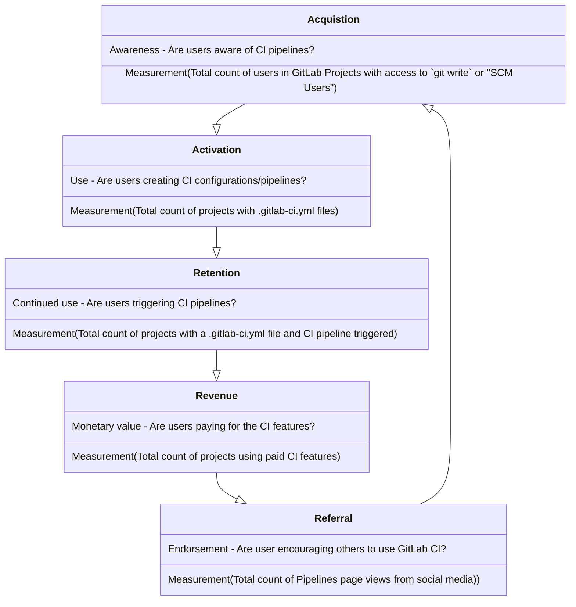

このチームは [Verify](/handbook/product/categories/#verify-stage) DevOps ステージにマッピングされており、Continuous Integration [ユースケース](/handbook/marketing/brand-and-product-marketing/product-and-solution-marketing/usecase-gtm/ci/) をサポートしています。

## ビジョン

このチームが何に取り組んでいくかを理解するには、[プロダクトの方向性](https://about.gitlab.com/direction/verify/) をご覧ください。このチームは以下の方向性の実現に責任を持ちます。

- [Continuous Integration](https://about.gitlab.com/direction/verify/continuous_integration/)
- [Merge Trains](https://about.gitlab.com/direction/verify/merge_trains/)

## ミッション

パフォーマンスが高く、スケーラブルで、愛される Continuous Integration 製品を作成・サポートすることで、ソフトウェア開発をより簡単に、より速く、より信頼できるものにします。

Verify:Pipeline Execution グループは、[Continuous Integration](https://about.gitlab.com/solutions/continuous-integration/) に関する機能のサポートに焦点を当てています。PE グループの主要な焦点は、Performance Indicator で追跡している成果を達成する機能を提供することです。

## 駆動要因

### パフォーマンス

- お客様の視点から見た体感パフォーマンスの向上。例: レスポンシブな UI、結果が出るまでの時間の短縮。
- Pipeline Execution が所有するコードでの処理時間の削減。
- 結果の信頼性の確保。例: Web リクエストへの結果のタイムリーな返却 (スケーラビリティと重複)。

#### Sitespeed

フロントエンドパフォーマンスは、社内の [sitespeed-measurement-setup](https://gitlab.com/gitlab-org/frontend/sitespeed-measurement-setup) プロジェクトを使って追跡されています。

各 sitespeed 実行の結果は、[fe-perf: Sitespeed - Page summary (Runway)](https://dashboards.gitlab.net/d/fe-perf-sitespeed-page-summary-general/fe-perf3a-sitespeed-page-summary-runway?from=now-7d&orgId=1&timezone=utc&to=now&var-browser=chrome&var-connectivity=cable&var-function=median&var-group=gitlab_com&var-page=Verify_Pipeline_List&var-path=desktop&var-testname=gitlab) Grafana ダッシュボードで確認できます。Pipeline Execution に関連するページは `verify_*` プレフィックスを使って一覧化されています。

注: メトリクスが古い場合、sitespeed 実行を行うサーバーにメンテナンスが必要な可能性があります。サービスを再起動してフロントエンドパフォーマンスメトリクスの収集を継続するには、[sitespeed-measurement-setup](https://gitlab.com/gitlab-org/frontend/sitespeed-measurement-setup) リポジトリの手順に従ってください。

### スケーラビリティ

- 多くのお客様をサポート。
- 大規模で複雑なセットアップを持つ単一のお客様をサポート。

### 開発者の効率

- コードベースの複雑さの軽減。
- チームが所有するコードの幅広さへの対処。
- レビュープロセスを通じて MR が承認されるまでの時間の短縮。
- コミュニティコントリビューションに関連する効率の確保
  - Issue がコミュニティにとって取り組みやすいことを確保。
  - コミュニティコントリビューションに対するレビュープロセスの効率向上。

### お客様の体験

- お客様の Issue がタイムリーに解決されることを確保。
- SUSImpacting Issue へのタイムリーな対処。
- 信頼性が高く正確なドキュメントの提供。

## Performance Indicator

Performance Indicator (PI) を使って提供する価値を測定し、進捗を追跡します。
[Pipeline Execution グループの現在の PI](https://internal.gitlab.com/handbook/company/performance-indicators/product/#verify-ci-verify-runner-count-of-pipelines-triggered-by-unique-users) は `ci_pipelines をトリガーするユニークユーザー数` です。詳細については、[プロダクトチームの Performance Indicator](https://internal.gitlab.com/handbook/company/performance-indicators/product/#regular-performance-indicators) をご覧ください。最新の Verify ステージの ci_pipeline データを確認するには、[Tableau ダッシュボード](https://10az.online.tableau.com/t/gitlab/views/VerifyPerformanceIndicatorDashboard/VerifyPerformanceIndicatorHub) をご覧ください。

### 利用ファネル

AARRR フレームワーク (Acquisition、Activation、Retention、Revenue、Referral) に基づき、このファネルは GitLab CI の利用におけるカスタマージャーニーを表しています。ファネルの各状態には、行動を測定するためのメトリクスが定義されています。プロダクトマネージャーは、望ましいアクションを促進する機能の優先順位を付けるため、ファネル内のさまざまな状態のいずれかに焦点を当てることができます。

### コアドメイン {#core-domain}

| ドメイン | Issue |
| ------ | ------ |
| Pipeline 処理: パイプライン、ステージ、ジョブの遷移を担当するプロセス。 | [~pipeline processing](https://gitlab.com/gitlab-org/gitlab/-/issues/?sort=milestone_due_desc&state=opened&label_name%5B%5D=pipeline%20processing&label_name%5B%5D=group%3A%3Apipeline%20execution&first_page_size=20) |
| Rails-Runner 通信: ジョブのキューイング、API エンドポイント、および Runner によって実行される、または Runner のために実行される操作に関連する基盤機能。 |  |

#### Continuous Integration ドメイン

| ドメイン | Issue |
| ------ | ------ |
| Continuous Integration および Deployment 管理エリア設定 | [~CI/CD Settings](https://gitlab.com/gitlab-org/gitlab/-/issues/?sort=milestone_due_desc&state=opened&label_name%5B%5D=CI%2FCD%20Settings&label_name%5B%5D=group%3A%3Apipeline%20execution&first_page_size=20) |
| グループのリポジトリ分析 | [~CI reports](https://gitlab.com/gitlab-org/gitlab/-/issues/?sort=milestone_due_desc&state=opened&label_name%5B%5D=CI%20reports&label_name%5B%5D=group%3A%3Apipeline%20execution&first_page_size=20) |
| GitLab CI/CD アーティファクトレポートタイプ | [~CI reports](https://gitlab.com/gitlab-org/gitlab/-/issues/?sort=milestone_due_desc&state=opened&label_name%5B%5D=CI%20reports&label_name%5B%5D=group%3A%3Apipeline%20execution&first_page_size=20) |
| 単体テストレポート | [~testing::code testing](https://gitlab.com/gitlab-org/gitlab/-/issues/?sort=milestone_due_desc&state=opened&label_name%5B%5D=testing%3A%3Acode%20testing&label_name%5B%5D=group%3A%3Apipeline%20execution&first_page_size=20) |
| GitLab CI/CD でテストし、マージリクエストでレポートを生成する |  |
| 負荷パフォーマンステスト | [~testing::load performance](https://gitlab.com/gitlab-org/gitlab/-/issues/?sort=milestone_due_desc&state=opened&label_name%5B%5D=testing%3A%3Aload%20performance&label_name%5B%5D=group%3A%3Apipeline%20execution&first_page_size=20) |
| メトリクスレポート |   |
| テストカバレッジ可視化 | [~testing::coverage](https://gitlab.com/gitlab-org/gitlab/-/issues/?sort=milestone_due_desc&state=opened&label_name%5B%5D=testing%3A%3Acoverage&label_name%5B%5D=group%3A%3Apipeline%20execution&first_page_size=20) |
| ブラウザパフォーマンステスト | [~testing::browser performance](https://gitlab.com/gitlab-org/gitlab/-/issues/?sort=milestone_due_desc&state=opened&label_name%5B%5D=testing%3A%3Abrowser%20performance&first_page_size=20) |
| Fail Fast テスト |   |
| アクセシビリティテスト | [~testing::accessibility](https://gitlab.com/gitlab-org/gitlab/-/issues/?sort=milestone_due_desc&state=opened&label_name%5B%5D=testing%3A%3Aaccessibility&label_name%5B%5D=group%3A%3Apipeline%20execution&first_page_size=20) |
| ユーザビリティテスト | [~testing::usability](https://gitlab.com/gitlab-org/gitlab/-/issues/?sort=milestone_due_desc&state=opened&label_name%5B%5D=testing%3A%3Ausability&label_name%5B%5D=group%3A%3Apipeline%20execution&first_page_size=20) |
| Review apps (非推奨) | [~testing::review apps](https://gitlab.com/gitlab-org/gitlab/-/issues/?sort=milestone_due_desc&state=opened&label_name%5B%5D=testing%3A%3Areview%20apps&label_name%5B%5D=group%3A%3Apipeline%20execution&first_page_size=20) |
| ビジュアルレビューツール (非推奨) | [~testing::visual review tool](https://gitlab.com/gitlab-org/gitlab/-/issues/?label_name%5B%5D=testing%3A%3Avisual%20review%20tool) |
| スケジュールパイプライン | [~pipeline schedules](https://gitlab.com/gitlab-org/gitlab/-/issues/?sort=milestone_due_desc&state=opened&label_name%5B%5D=pipeline%20schedules&label_name%5B%5D=group%3A%3Apipeline%20execution&first_page_size=20)  |
| パイプラインの効率性 | [~ci::scaling](https://gitlab.com/gitlab-org/gitlab/-/issues/?sort=milestone_due_desc&state=opened&label_name%5B%5D=ci%3A%3Ascaling&label_name%5B%5D=group%3A%3Apipeline%20execution&first_page_size=20)  |
| Docker を使ったイメージのビルド |   |
| 外部 SCM および CI 連携 |   |
| 外部パイプラインバリデーション |   |
| パイプライン作成のレート制限 | [~Category:Continuous Integration + ~Eng-Inter-Dept::Rate Limits](https://gitlab.com/gitlab-org/gitlab/-/issues/?sort=milestone_due_desc&state=opened&label_name%5B%5D=Category%3AContinuous%20Integration&label_name%5B%5D=group%3A%3Apipeline%20execution&label_name%5B%5D=Eng-Inter-Dept%3A%3ARate%20Limits&first_page_size=20)  |
| ジョブログ |   |
| ジョブログアーティファクト |   |
| Merge Trains | [~Category:Merge Trains](https://gitlab.com/gitlab-org/gitlab/-/issues/?sort=milestone_due_desc&state=opened&label_name%5B%5D=group%3A%3Apipeline%20execution&label_name%5B%5D=Category%3AMerge%20Trains&first_page_size=20)  |

Pipeline Execution グループのドメインに含まれないもの:

- シークレット管理。[direction page](https://about.gitlab.com/direction/software_supply_chain_security/pipeline_security/secrets_management/) を参照。
- Pipeline オーサリング。[direction page](https://about.gitlab.com/direction/verify/pipeline_composition/) を参照。
- パイプラインにおけるコンプライアンス。[direction page](https://about.gitlab.com/direction/software_supply_chain_security/compliance/compliance-management/) を参照。
- [ジョブアーティファクト: アーティファクトのストレージと管理は多くの CI/CD 機能のゲートウェイです](https://about.gitlab.com/direction/verify/)

---

## 技術ロードマップ

### FY25

これらは、私たちの 1 年間の高レベルなエンジニアリング主導の目標です。私たちのどの目標とも同様、これらは野心的であり変更される可能性があります。

#### パフォーマンス

##### パイプライン速度

**目標:**

- パイプライン速度を向上させるために何ができるかを理解する
- 大きな改善のための少なくとも 1 つのプロトタイプを作成する

##### 長年の Pipeline ステータス Issue の修正

**目標:**

- 既存のパイプラインステータスの Issue とコードに深く踏み込む
  - 多くの Issue に対処するための体系的変更があるか判断し、変更を行う

#### スケーラビリティ

##### Sidekiq

**目標:**

- 信頼性とスケーラビリティを高めるため、バックグラウンドワーカーのパフォーマンスを向上させる

##### ジョブ検索機能の強化サポート

**目標:**

- ジョブに対する追加の検索とフィルタリング機能をサポートする能力を向上させる

##### 運用コストの削減

**目標:**

- データ保持計画への貢献
- ジョブログの圧縮による潜在的なコスト削減を特定する - [Spike](https://gitlab.com/gitlab-org/gitlab/-/issues/390114)
  - 結果に応じて、圧縮を実装する作業をスケジュールする

#### 開発者の効率

##### 技術的負債の削減

**目標:**

- コードベース内に存在する全体的な技術的負債を削減する
- フォローアップ Issue を迅速にスケジュールすることで、長期的な負債のさらなる蓄積を回避する

##### Vue へのフロントエンドリファクタリング

**目標:**

- パイプラインサブスクリプションページの Vue へのリファクタリングを完了する
- リファクタリングすべき追加の領域を特定する [Epic](https://gitlab.com/groups/gitlab-org/-/epics/12836)

##### パイプラインレンダリング

**目標:**

- パイプラインページレンダリングのパフォーマンス改善を完了する。この機能は開発者によって頻繁に使用されており、パフォーマンスが悪いと生産性に影響します。

##### Merge Trains

**目標:**

- Merge Trains を、GitLab プロジェクトで効果的に利用するのに十分なほどスケーラブルな状態にする。

---

## チームメンバー



### 追加のチームの責務

これらのロール／責務は、負荷をチーム全体に分散し、これらのいずれかのタスクの「頼られる」人がたった 1 人となって過度の負担を負うことのないように、ローテーションでチームメンバーにアサインされます。

#### フロントラインレスポンダー

このチームメンバーは、マイルストーンに対して以下の責任を (優先順位順に) 持ち、~Deliverable のアイテムをアサインされません。

1. Pipeline Execution の broken-master アラートに対応する。
1. サポートからの受信ヘルプリクエストの DRI。
    1. 既存のヘルプリクエストは、既存の DRI の裁量により彼らに移管される場合があります。
    1. リクエストに対処するために必要に応じて他のメンバーを呼び込むのは自由ですが、リクエストが対処されることを確実にする DRI のままです。
1. お客様のエスカレーションに最初に投入される開発者。明らかに別のチームメンバーを選ぶ理由がない限り。
1. [オプション] 追加のチームメンバーとともにヘルプリクエストに取り組む週次スウォームミーティングを企画・主催する。
1. Slack の `#pipeline-execution` および `#s-verify` (Pipeline Execution に関連する場合) で寄せられる質問に対応する。
    1. 必要に応じて他のチームメンバーにリダイレクトすることができます。重要なのは、私たちが応答していることを確保することです。
1. エラーバジェットの超過を調査する。
1. 追加のメンテナンスタスク (推奨される優先順位順):
    1. 時間が許す範囲で flaky テストに対処する。
    1. 時間が許す範囲で長期的なメンテナンス Issue に取り組む。
        1. 例: 対処が必要な非常に古い機能フラグの長いリスト。
    1. 時間が許す範囲で ~"cicd::planning" 内の ~"type::maintenance" Issue のリファインメント。
    1. 時間が許す範囲で ~"cicd::active" 内のその他の ~"type::maintenance" Issue。

上記のいずれかのタスクについて、緊急の Issue がチームメンバーの労働時間外に発生した場合、他のチームメンバーが最初の対応者になる必要があります。
マイルストーンのフロントラインレスポンダーは、自分の労働時間中にそうした Issue をフォローアップする責任を持ちます。
彼らはマイルストーン中に 24 時間 365 日オンコールであることが期待されているわけではありません。
マイルストーンの終わりに、まだ進行中の Issue は、次回のフロントラインレスポンダーに移管される場合があります。元のチームメンバーが引き続き DRI のままであることが理にかなっている場合、それも可能です。

#### コミュニティコーディネーター

このチームメンバーは、~Deliverable タスクに加えて、マイルストーンに対して以下の責任を持ちます。

1. 週次の [`Verify Pipeline teams: Community contributions report`](https://gitlab.com/gitlab-org/quality/triage-reports/-/issues/?sort=updated_desc&state=opened&label_name%5B%5D=Community%20contribution&label_name%5B%5D=devops%3A%3Averify&first_page_size=20) で特定された新しいコミュニティコントリビューションをファーストパスで確認し、正しい方向に進んでいるように見えるかを確認する。

#### ローテーションスケジュール

**プログラム一時停止中**

| マイルストーン | フロントラインレスポンダー | コミュニティコーディネーター |
| --------- | -------------------- | --------------------- |

## 安定したカウンターパート

私たちの安定したカウンターパートを見つけるには、Pipeline Execution の [プロダクトカテゴリ一覧](/handbook/product/categories/#pipeline-execution-group) を参照してください。

## テクノロジー

ほとんどの GitLab バックエンドチームと同様、私たちは Rails のメイン [GitLab CE アプリ](https://gitlab.com/gitlab-org/gitlab-ce) で多くの時間を過ごしますが、[GitLab Runner](https://gitlab.com/gitlab-org/gitlab-runner) が書かれている言語である Go でも多くの作業を行います。Docker と Kubernetes に親しんでいることも、私たちのチームでは有用です。

## 役立つリンク

- [Issue トラッカー: `~group::pipeline execution`](https://gitlab.com/groups/gitlab-org/-/issues?label_name%5B%5D=group%3A%3Apipeline+execution&scope=all)
- [Slack チャンネル: `#g_pipeline-execution`](https://gitlab.slack.com/archives/CPCJ8CCCX)
- [GitLab unfiltered: Pipeline Execution グループ](https://www.youtube.com/playlist?list=PL05JrBw4t0KpsVi6PG4PvDaVM8lKmB6lV)
- [Grafana ダッシュボード](https://dashboards.gitlab.net/d/stage-groups-pipeline_execution/stage-groups-group-dashboard-verify-pipeline-execution?orgId=1)
- [Tableau ダッシュボード (移行予定)](https://gitlab.com/gitlab-data/tableau/-/issues/208)
- [次回の計画 Issue](https://gitlab.com/gitlab-org/ci-cd/pipeline-execution/-/issues/?sort=popularity&state=opened&label_name%5B%5D=Planning%20Issue&first_page_size=20)
- [Pipeline execution のヘルプリクエスト](https://gitlab.com/gitlab-com/ops-sub-department/section-ops-request-for-help/-/issues/?state=opened&label_name%5B%5D=Help%20group%3A%3Apipeline%20execution)
- [現在のマイルストーン振り返り](https://gitlab.com/gl-retrospectives/verify-stage/pipeline-execution/-/issues?search=Pipeline+Execution+retrospective&sort=popularity&state=opened)
- [Needs weight ボード](https://gitlab.com/groups/gitlab-org/-/boards/4178322)
- [現在のマイルストーンボード](https://gitlab.com/groups/gitlab-org/-/boards/1372896)

### 開発ドキュメント

チームに新しく加わった人にとって、これらのリンクは製品とテクノロジーについて学ぶのに役立つかもしれません。

- [CI/CD 開発ドキュメント](https://docs.gitlab.com/ee/development/cicd/index.html)

### エンジニアリング概要

- [CI バックエンドアーキテクチャウォークスルー - 2020 年 5 月](https://www.youtube.com/watch?v=ew4BwohS5OY)
- [Frontend CI 製品 / コードベース概要 - 2020 年 6 月](https://www.youtube.com/watch?v=7CUd7aAUiWo)

## ダッシュボード

[内部ハンドブックページ](https://internal.gitlab.com/handbook/engineering/core-development/ci/verify/pipeline-execution) を参照してください。

### 部門横断的な優先順位付け

チームは [`#g_pipeline_execution_quad`](https://gitlab.slack.com/archives/C03KK284L23) Slack チャンネルを使って、quad で協力する必要のあるその他のトピックに加えて、部門横断的な優先順位付けを議論します。

## 私たちの働き方

[Pipeline Execution Workflow ボード](https://gitlab.com/groups/gitlab-org/-/boards/1372896) は、現在および今後の作業の信頼できる情報源です。

### 計画 {#planning}

私たちの計画タイムラインは [GitLab プロダクト開発タイムライン](/handbook/engineering/workflow/#product-development-timeline) に従います。

`Engineering Time` についての情報は、[Engineering Initiatives](/handbook/engineering/#engineering-initiatives) を参照してください。

**PM** (必要に応じて **EM** の助けを得て) は、[`Candidate::x.x` + not `Engineering Time` のリスト](https://gitlab.com/gitlab-org/gitlab/-/issues/?sort=updated_desc&state=opened&label_name%5B%5D=candidate%3A%3A17.x&label_name%5B%5D=group%3A%3Apipeline%20execution&not%5Blabel_name%5D%5B%5D=Engineering%20Time&first_page_size=20) をキュレーションし、いつでも合理的な数の優先度の高い Issue が選択肢として存在するようにします。探しているマイルストーンに Issue がない場合は、将来のマイルストーンから選択できます。

**EM** (必要に応じて **PM** の助けを得て) は、[`Engineering Time` + `Candidate::x.x` のリスト](https://gitlab.com/gitlab-org/gitlab/-/issues/?sort=updated_desc&state=opened&label_name%5B%5D=candidate%3A%3A17.x&label_name%5B%5D=group%3A%3Apipeline%20execution&label_name%5B%5D=Engineering%20Time&first_page_size=20) Issue を維持し、いつでも合理的な数の優先度の高い Issue が選択肢として存在するようにします。探しているマイルストーンに Issue がない場合は、将来のマイルストーンから選択できます。

現在のマイルストーン終了の 2 週間前の金曜日までに、各 **エンジニア** は次のことを行います。

- 現在の Issue のマイルストーンが、最新の知識に基づいて完了すると思われるマイルストーンを反映していることを確認する
  - **注:** 現在のマイルストーンで完了しない進行中の Issue は、基準が一致する限り、新しい Issue を選択する代わりに使用できます
    - 進行中の Issue が依然として優先事項かどうかわからない場合は、EM と PM に確認してください。
    - 必要に応じて ~Deliverable または ~Stretch ラベルを更新する
- 次のマイルストーンで取り組む 1 つの [`Candidate::x.x` + not `Engineering Time` Issue](https://gitlab.com/gitlab-org/gitlab/-/issues/?sort=updated_desc&state=opened&not%5Blabel_name%5D%5B%5D=Engineering%20Time&label_name%5B%5D=group%3A%3Apipeline%20execution&label_name%5B%5D=candidate%3A%3A17.x&first_page_size=20) を選択する。最初に ~priority::1 Issue から始め、次に ~priority::2 と ~priority::3 と続ける
  - 自分自身をアサインする
  - 重みが設定されていることを確認する
  - 作業が完了すると予想されるマイルストーンに従ってマイルストーンを設定する
    - 次のマイルストーンでない場合、Issue を複数の Issue に分割し、可能であればそのうちの 1 つを次のマイルストーンで完了できるようにする。
      - 元の Issue にコメントで EM/PM にこのことを知らせ、残りの Issue が適切に計画されることを確実にしてください。
  - `Deliverable` ラベルを追加する。
- 修正する 1 つの [`flaky-test` Issue](https://gitlab.com/gitlab-org/gitlab/-/issues/?sort=updated_desc&state=opened&label_name%5B%5D=group%3A%3Apipeline%20execution&label_name%5B%5D=failure%3A%3Aflaky-test&first_page_size=20) を選択する。
  - 同じ問題によって明らかに引き起こされている複数の Issue があるかをすばやく確認し、それらを関連としてリンクし、もしくは自分にアサインします。
  - テストが修正されるタイミングを示すために、マイルストーンを適切に設定する。
    - タイムラインがわからない場合、マイルストーンへのコミットに納得できるようになるまでマイルストーンの設定を遅らせることができます。
- [今後の作業](https://gitlab.com/groups/gitlab-org/-/boards/4178322) のために重み付けとリファインメントを行う 1 つのアイテムを選択する
  - このアイテムを自分自身にアサインします。リファインメントプロセスが完了したら、アサインを外してかまいません。
    - 混乱を避けるために、リファインメント目的のみで自分にアサインしていることを示すコメントを追加することを推奨します。これは完全に任意です。
  - Issue にマイルストーンを設定しない。
  - リファインメントにかなりの労力が必要になりそうな場合は、リファインメント "~spike" Issue を作成する ([Spikes](#spikes) と [Issue のリファインメントと重み付けの手順](#steps-for-refining-and-weighting-issues) も参照)
    - スパイクのコメントで **EM** にタグを付けて、このスパイクを作成したことを知らせます。
    - これをマイルストーンの `Engineering Time` アイテムとして使用する。
- [コミュニティコントリビューション](https://gitlab.com/groups/gitlab-org/-/boards/4178322) のために重み付けとリファインメントを行う 1 つのアイテムを選択する
  - このアイテムを自分自身にアサインします。リファインメントプロセスが完了したら、アサインを外してかまいません。
    - 混乱を避けるために、リファインメント目的のみで自分にアサインしていることを示すコメントを追加することを推奨します。これは完全に任意です。
  - Issue にマイルストーンを設定しない。
  - リファインメントにかなりの労力が必要になりそうな場合は、リファインメント "~spike" Issue を作成する ([Spikes](#spikes) と [Issue のリファインメントと重み付けの手順](#steps-for-refining-and-weighting-issues) も参照)
    - スパイクのコメントで **EM** にタグを付けて、このスパイクを作成したことを知らせます。
    - これをマイルストーンの `Engineering Time` アイテムとして使用する。
- 修正する 1 つの [`Engineering Time` + `Candidate::x.x` Issue](https://gitlab.com/gitlab-org/gitlab/-/issues/?sort=updated_desc&state=opened&label_name%5B%5D=candidate%3A%3A17.x&label_name%5B%5D=group%3A%3Apipeline%20execution&label_name%5B%5D=Engineering%20Time&first_page_size=20) を選択する。
- 自分にアサインする
  - 重みが設定されていることを確認する
  - 作業が完了すると予想されるマイルストーンに従ってマイルストーンを設定する
    - 次のマイルストーンでない場合、Issue を複数の Issue に分割し、可能であればそのうちの 1 つを次のマイルストーンで完了できるようにする。
      - 元の Issue にコメントで EM/PM にこのことを知らせ、残りの Issue が適切に計画されることを確実にしてください。
  - `Deliverable` ラベルまたは `Stretch` ラベルを追加する。
- マイルストーン計画 Issue にコメントを追加し、この計画作業を完了したことと選択した Issue を示す。

マイルストーン全体を通じて、**エンジニア** がタスクを完了し、追加のキャパシティがある場合:

- [What do I work on next](#what-do-i-work-on-next) を確認する

- マイルストーン終了の週の月曜日までに:
  - 計画 Issue が確定し、**PM** がレビューとフィードバックのためにマネージャー、Product Designer、エンジニア、EM をタグ付けする。

- マイルストーン終了の金曜日までに:
  - **エンジニア** は、計画した作業の変更について計画 Issue にコメントする。
  - **PM** は、`~direction` および `Deliverable` Issue を取り上げた月次キックオフビデオを完成させる

- リリース週の月曜日までに:
  - **EM** は、すべてのマイルストーン Issue に対してラベルが正しく設定されていることを確認する

**注:** [Customer Results](/handbook/values/#results) を計画していたものより重視するため、**EM** と **PM** はチームのコミットメントを修正し、次回のマイルストーンに向けた作業をスケジュールし直す必要がある場合があります。

#### エンジニアリングが Issue をリファインする方法 {#how-engineering-refines-issues}

_余談: 私たちは [Grooming より Refining](/handbook/communication/top-misused-terms) を使用することを好みます_

エンジニアは、各マイルストーンで [`~needs weight` ボード](https://gitlab.com/groups/gitlab-org/-/boards/4178322) 上の Issue のリファインメントと重み付けに約 6 時間を割り当てることが期待されています。

Issue のリファインメントの目的は、問題ステートメントが大まかな労力サイズの見積もりを提供できる程度に十分に明確であることを確保することです。意図はリファインメント中に **ソリューション検証** を提供することではありません。Issue をリファインする際、エンジニアは Issue ごとに 2 時間以下にタイムボックスする必要があります。Issue が複雑で、より多くの調査が必要な場合は、その労力をマイルストーン計画で考慮するために、リファインメント "~spike" でその労力を追跡する必要があります。"~spike" は元の Issue をブロックするとリンクし、期待される成果と労力に対するタイムボックスを指定する必要があります。元の Issue は "~workflow::blocked" としてラベル付けされる必要があります。

エンジニアリングは、[重み決定のためのハンドブックガイダンス](#weighting-issues) を使用します。Issue が追加の `~frontend ~backend ~Quality ~UX ~documentation` レビューを必要とする場合、それぞれの個人にアサインされます。

##### Issue リファインメントのチェックリスト

1. Issue の説明に問題ステートメントがありますか？
1. Issue は、誰でも理解できるほど十分に説明された期待される動作を持っていますか？
1. Issue はステークホルダー (BE、FE、PM、UX または Tech Writer など) を明示的に定義していますか？
1. Issue の説明に提案がありますか？_もしあれば:_
    1. 提案は問題ステートメントに対処していますか？
    1. 実装に意図しない副作用はありますか？
1. Issue には、実行すべきジョブに合わせた適切なラベル付けがされていますか？(例: バグ、機能、パフォーマンス)

このチェックリスト内の質問に答えることにチームの誰もが貢献できますが、最終決定は PM と EM 次第です。

##### Issue のリファインメントと重み付けの手順 {#steps-for-refining-and-weighting-issues}

エンジニアは:

1. 自分にアサインされた Issue について、上記のリファインメントチェックリストを実行する。
1. フロントエンド作業を開始する前にバックエンド作業を完了する必要がある場合、メイン Issue からバックエンド Issue を分離する。
1. [定義に基づく重み](#weighting-issues) を追加する。
1. `~workflow::` ラベルを適切なステータスに更新する。例:
   - ~"workflow::design" : さらなる設計のリファインメントが必要な場合。デザイナーに知らせる。
   - ~"workflow::ready for development" : リファインメントが完了し重みが適用されたとき。実装の準備ができ、Issue の優先順位を付けられるようになったことを示す
   - ~"workflow::blocked" : さらなる調査と研究が必要な場合。リファインメント "~spike" Issue を作成し、PM と EM にメンションする。
1. 重み付けが完了したら "~needs weight" ラベルを削除する。
1. Issue のリファインメントと重み付けが完了したら、Issue から自分のアサインを外す。

##### Issue リファインメントのタイムボックス

Issue ごとに 2 時間を超えてはならないため、以下に基づき、より多くの時間が必要か、スパイクが必要かを再評価する必要があります。

1. Issue が GitLab.com でまだ再現可能か。原因が明らかでない場合、最初の良いステップは作成者に明確化を求めることです。
1. Issue にサポートエンゲージメントが存在するか。Issue が GitLab チームメンバーによって作成されたか、~customer ラベルがあるかでわかります。
1. Issue が GitLab.com 上にあるか、self-managed インスタンス上にあるか。これが self-managed インスタンスのみに影響する場合、代わりにヘルプリクエスト Issue を依頼できます。
1. Issue のスコープと影響。1 人のお客様にのみ影響しているか、複数のお客様に存在しているか。

良い一般ルールは P* レベルを見ることです。P1 Issue は、次のマイルストーンですぐに作業されるためリファインされるべきです。P2 と P3 は、より多くの時間が必要な場合、スパイク Issue をスピンオフすることができます。

#### Issue の重み付け {#weighting-issues}

このチームは、今後のマイルストーンに向けて重み付けが必要な Issue を表示する [`~needs weight` ボード](https://gitlab.com/groups/gitlab-org/-/boards/4178322) を活用しています。基準は `~needs weight` と `~cicd::planning` が適用されていることで示されます。月を通して、チームメンバーは [`~needs weight` ボード](https://gitlab.com/groups/gitlab-org/-/boards/4178322) を確認し、Issue を自分にアサインします。優先順位はカラムによって決定されます: `Verify::P1`、`Verify::P2`、`Verify::P3`、その後に「Open」。重み付けの緊急度がより高い Issue がある場合、優先的なレビューのためにチームメンバーが Issue に直接アサインされる場合があります。

私たちは、Issue を完了するために必要な労力を見積もる方法として、Issue に `Weight` を追加します。複雑さや、Issue で作業するために必要な追加の調整を考慮します。フィボナッチ数列に従って、複雑さに基づいて Issue を重み付けします。

| 重み | 説明  |
| --- | --- | --- |
| 1: Trivial | 問題は非常によく理解されており、追加の調査は必要なく、正確なソリューションがすでにわかっており、実装が必要なだけで、サプライズは予想されず、他のチームや人との調整は不要。  例としては、ドキュメントの更新、簡単なリグレッション、すでに調査・議論されており数行のコードで修正できるその他のバグ、または対処方法はわかっているがまだ時間が見つかっていない技術的負債など。対処に約 1 MR |
| 2: Small | 問題はよく理解されており、ソリューションは概要が示されているが、ソリューションを実現するためには少し追加の調査がおそらくまだ必要。サプライズはほとんど予想されず、他のチームや人との調整は不要。  例としては、既存のデータや機能を公開する新しい API エンドポイントのようなシンプルな機能、または既に調査が行われている通常のバグやパフォーマンス Issue。対処に 2 MR 未満 |
| 3: Medium | よく理解されており比較的簡単な機能。ソリューションが概要として示され、いくつかのエッジケースが考慮されますが、アプローチを確認するために追加の調査が必要な場合があります。一部のサプライズが予想され、他のチームメンバーとの調整が必要な場合があります。  比較的よく理解されているバグですが、追加の調査が必要な場合があります。問題が確認され、主要なエッジケースが特定されれば、ソリューションは比較的簡単であることが期待されます。  例としては、バックエンドやフロントエンドの依存関係を持つ可能性のある通常の機能や、パフォーマンス Issue。対処に 3 つ以上の MR|
| 5: Large | よく理解されているがより多くの曖昧さと複雑さを持つ機能。ソリューションが概要として示され、主要なエッジケースが考慮されますが、アプローチを検証するために追加の調査がおそらく必要になります。特定のエッジケースに関するサプライズが予想され、複数のエンジニアやチームからのフィードバックが必要な場合があります。  バグは複雑で、理解されている場合もあれば、Issue リファインメント中に詳細なソリューションが定義されていない場合もあります。追加の調査がおそらく必要で、問題が特定されたら、ソリューションの複数のイテレーションが検討される場合があります。  例としては、バックエンドとフロントエンドの依存関係を持つ大きな機能、ソリューションは概要として示されているがより詳細なソリューションの検証が必要なパフォーマンス Issue。対処の MR の数が不明であり、分割が必要。|

Issue の最大重み付け値は `5` であり、追加の依存関係や複雑さによって、完了に 1 つ以上のマイルストーンを超える場合があります。`5` で重み付けされた Issue がより小さなイテレーションにどう分解できるかを検討し、[そうしてください](#splitting-issues)。

[機能フラグロールアウト Issue](#release-plans) は、リファインメント／重み付け中に予期される場合に作成する必要があります。これらは重み `1` です。

### リリース計画 {#release-plans}

チーム間の透明性とコラボレーションを高め、各マイルストーンの最後に公開する [リリースポスト](/handbook/marketing/blog/release-posts/) と整合させるため、13.2 から、[機能フラグロールアウトの Issue テンプレート](https://gitlab.com/gitlab-org/gitlab/-/blob/master/.gitlab/issue_templates/Feature%20Flag%20Roll%20Out.md) に基づいて、リリースされる各機能の **機能フラグロールアウト計画** をハイライトする別の Issue を作成しています。機能を実装するエンジニアは、機能フラグの切り替え時期と方法の詳細を強調するためにこの別の Issue を作成し、続いてこの Issue を機能 Issue にリンクする責任があります。プロダクトマネージャーは、機能のリリース計画について全員の認識が揃うように、この Issue をリリースポストのブロッカーとしてタグ付けします。

#### Issue の優先順位付け

このチームは、Issue の優先順位を示すために `Verify::P*` ラベルを活用します。マイルストーン計画とレビューの一環として、Issue の新しい優先順位を反映するためにラベルを変更または削除することを決定する場合があります。現在、これらのラベルは以下のように適用されます。

| 優先度ラベル | 適用理由 |
| ---- | ---- |
| `Verify::P1` | これらの Issue は、それぞれの `priority::x` グループ内で最高の優先度の Issue です。 |
| `Verify::P2` | これらの Issue は、それぞれの `priority::x` グループ内で 2 番目に高い優先度の Issue です。 |
| `Verify::P3` | これらの Issue は、それぞれの `priority::x` グループ内で 3 番目に高い優先度の Issue です。 |

### ワークフロー

私たちは [Pipeline Execution Workflow Issue ボード](https://gitlab.com/groups/gitlab-org/-/boards/1372896) を使って、現在のマイルストーンで取り組んでいる作業を追跡します。

開発は、以下の順序でワークフロー状態を進みます。

1. `workflow::design` (該当する場合)
1. `workflow::planning breakdown`
1. `workflow::ready for development`
1. `workflow::in dev`
1. `workflow::blocked` (必要に応じて)
1. `workflow::in review`
1. `workflow::verification`
1. `workflow::awaiting security release` (該当する場合)
1. `workflow::feature-flagged` (該当する場合)
1. `workflow::complete` `Closed`

`workflow::planning breakdown` は Product 主導ですが、Product と Engineering の協力的な取り組みです。**planning breakdown** のステップは通常、以下で構成されます。

- Product が問題ステートメントを定義または明確化する。Product は必要に応じて `problem validation` で協力します。
- Engineering が記載された Issue 説明を明確化する。その後、Issue をリファインして重み付けする。十分な情報がない場合、Issue で PM をタグ付けし、ワークフロー状態を `workflow::problem validation` に設定する必要があります。

任意の時点で、Issue がブロックされた場合、`workflow::blocked` ステータスになります。ブロッカー Issue がある場合、Issue 説明に追加するか、'blocked by' 関係で Issue にリンクする必要があります。ブロッカー Issue がない場合、ブロックされている理由を Issue のコメントで明確に伝える必要があります。

`workflow::ready for development` は、Issue が [エンジニアリングによって十分にリファインされ重み付けされた](#how-engineering-refines-issues) ことを意味します。`cicd::active` とラベル付けされたこの状態の Issue は、マイルストーンで作業すべき Issue です。開発者が Issue で作業を開始するときには、開始したマイルストーンではなく、Issue がもっとも完了する可能性が高いマイルストーンに [マイルストーンを設定](#setting-the-milestone) する必要があります。

`workflow::awaiting security release` は、セキュリティ Issue が検証を通過した後にエンジニアによって適用され、このラベルは本番準備ができているが次の [月次セキュリティリリース](https://gitlab.com/gitlab-com/gl-infra/readiness/-/tree/master/library/security-releases-development) を待っていることを示します。このラベルが適用されると、Issue のマイルストーンも次のセキュリティリリースが行われるタイミングと整合させるために、次のマイルストーンに更新する必要があります。

`workflow::feature-flagged` は、別の機能フラグロールアウト Issue を通じて有効化されている Issue に適用されます。機能が検証されると、ステータスは `workflow::complete` に移動し、Issue はクローズされます。

`Closed` は、Issue に関連するすべてのコード変更が gitlab.com で完全に有効化されていることを意味します。機能フラグの背後にロールアウトされている場合、それは機能フラグが gitlab.com 上のすべてのユーザーに対して有効化されていることを意味します。

ワークフローの詳細は [Product-Development Flow](/handbook/product-development/how-we-work/product-development-flow/) ページで確認できます。

### "次に何に取り組むか?" {#what-do-i-work-on-next}

- チームメンバーがコミットした作業を完了するために助けが必要かどうか確認する。[WIP を減らすために右から左へ作業する](#working-right-to-left-to-reduce-wip) を参照
- EM や PM に、助けられるカスタマーサポートのリクエストがあるかを確認する。
- 取り組む追加のクレームされていないアイテムを見つけるために、[計画](#planning) で使用されるリストを参照する。

#### このマイルストーンの優先事項は？

私たちは、マイルストーン内の最高優先度の Issue を示すために一連のラベルを使用します。

1. 特定のマイルストーンの最高優先度は、マイルストーンのテーマと目標に整合する `Verify::P1`、`Deliverable`、`group::pipeline execution` のラベルが付いた Issue になります。
1. 各マイルストーンは、エンジニア 1 人につき 1 件の Issue から始まり、これらは `Deliverable` および `group::pipeline execution` としてラベル付けされます。これは、平均的なマイルストーン全体重みの約 30% に相当する必要があります。
1. すべての `Verify::P1` Issue がピックアップされ、`workflow:in dev` 以降になったら、私たちは `Verify::P2` と `Verify::P3` を使って、重要で、後のマイルストーンで `Verify::P1` Issue になる可能性が高い Issue を示します。

優先事項に従って、[計画](#planning) で使用されるリストがキュレーションされ、各チームメンバーがキャパシティに応じて、これらのリストからアイテムを引き出すことができます。

##### マイルストーンの設定 {#setting-the-milestone}

DRI が Issue を選択する際、Issue に自分自身をアサインし、Issue がもっとも出荷される可能性が高いと考えるマイルストーンを追加します。これは現在のマイルストーンでない場合があります。DRI は将来のマイルストーンにある Issue で作業することがあります。マイルストーンが将来のマイルストーンに設定されているか設定されていない場合で、現在のマイルストーンで出荷されることが確実な場合は、マイルストーンを現在のものにリセットします。これは、特に Issue をピックアップする DRI が元々 Issue を重み付け・リファインした個人と異なる場合、重みと提案を再評価する良いタイミングでもあります。理想的には、私たちはイテレートし、ユーザーに対してマイルストーンでできる限り多くの価値を出荷するよう取り組みを分割しようと努めます。これは、新しい Issue で作業を開始するときに、より効率的な前進方法が見えた場合、コメントを上げて提案を更新することで、よりイテレーティブな価値を提供する自由があることを意味します。

#### WIP を減らすために右から左へ作業する {#working-right-to-left-to-reduce-wip}

チームの各メンバーは、Issue を自分自身にアサインすることでマイルストーン中に取り組む Issue を選択できます。マイルストーンが順調に進行し、私たちが作業を探している場合、デフォルトでは **[Issue ボード](https://gitlab.com/groups/gitlab-org/-/boards/1372896)** で **右から左** に作業し、もっとも右のカラムから Issue をプルします。チームメンバーがボード上の Issue で助けられる Issue があれば、新しい作業を開始する代わりにそれを行うべきです。これには、チームメンバーがアサインされていない Issue に対するコードレビューも含まれ、価値を加え、Issue が完了に向かって進むのを助けられると感じる場合に行います。さらに、`workflow::ready for development` カラムの先頭から次の Issue を選ぶ前に、チームメンバーは [`~needs weight` ボード](https://gitlab.com/groups/gitlab-org/-/boards/4178322) を確認し、今後のマイルストーンの候補が重み付けされていることを確認する必要があります。

具体的には、これは私たちの作業が以下の順序で優先順位付けされることを意味します。

- `workflow::verification` または `workflow::production` のコードに対する検証
- `workflow::in review` の Issue でのコードレビューの実施
- 該当する場合、`workflow::blocked` または `workflow::in dev` のメンバーのブロック解除
- 現在のマイルストーンで重み付けが必要な Issue について [`~needs weight` ボード](https://gitlab.com/groups/gitlab-org/-/boards/4178322) を確認
- その後、`workflow::ready for development` カラムの上から選ぶ

このプロセスの目標は、いつでも進行中の作業 (WIP) の量を減らすことです。WIP を減らすことで、私たちは「より少なく開始し、より多く完了する」ことを強制され、サイクルタイムも短縮されます。エンジニアは、マージリクエストの DRI が **作成者** であることを念頭に置く必要があります。これにより、[DRI が私たちの価値で奨励されている](/handbook/people-group/directly-responsible-individuals/#dris-and-our-values) という概念を希薄にせずにチームワークの重要性を反映します。

#### Issue の分割 {#splitting-issues}

Issue にいくつかのコンポーネント (例: ~frontend、~backend、または ~documentation) がある場合、別々の実装 Issue に分割するのが有用な場合があります。
元の Issue は機能に関するすべての議論を保持し、実装 Issue は完了した作業を追跡するために使用されます。実装に 1 マイルストーン以上かかる場合や、元の Issue に対して実装が行われない場合、エピックに昇格させる必要があります。
これを行うことには、いくつかの利点があります。

1. Issue ごとに DRI が 1 人だけ。
1. ワークフローラベルとヘルスステータスがより関連性を持つ。
1. Issue をより正確に重み付けできる。
1. 1 つの実装を別の実装のブロッカーとしてマークできる。
1. 各機能グループによってどの作業がピックアップできるかが見やすくなる。
1. 複数のマイルストーンにまたがって機能作業をスケジュールできる。

`workflow::design` から `workflow::planning breakdown` および実装に Issue を移動する場合、以下のプロセスのいずれかを使用します。

| Frontend? | Backend? | アクション |
| --------- | -------- | ------ |
| Yes       | Yes      | 元の Issue は `Frontend` 実装 Issue に名前が変更され、別の `Backend` 実装 Issue が作成されます。 |
| No        | Yes      | 元の Issue は `Backend` 実装 Issue に名前が変更されます。 |
| Yes       | No       | 元の Issue は `Frontend` 実装 Issue に名前が変更されます。 |

`workflow::design` の Issue が 1 つの Issue で効果的に実装するにはスコープが大きすぎる場合や、Issue が古く議論で散らかりすぎている場合、Issue をより小さな Issue に分解できます。Product Designer は `workflow::design` 中にエンジニアおよびプロダクトマネージャーと協力して、可能なイテレーション計画を理解し、可能な限り大きな設計提案を小さな部分に分解します。

新しい実装 Issue が作成されたとき、それらは常に提案と関連する議論を含む最初の Issue にリンクされる必要があります。

実装 Issue は責任を持って使用してください。
それらはより大きな Issue に意味がありますが、より小さな機能には面倒な場合があります。

#### 週次 Issue 進捗更新

私たちは、ステークホルダーが進行中の作業について常に把握できるよう、Issue の **ヘルスステータス** を更新するか **非同期 Issue 更新** を追加することで Issue の更新を提供します。

##### Issue ヘルスステータス

現在のマイルストーンの Issue については、現在のマイルストーンで Issue が出荷される確率を示すために [Issue Health Status 機能](https://docs.gitlab.com/ee/user/project/issues/#health-status) を使用します。このステータスは DRI ([directly responsible individual](/handbook/people-group/directly-responsible-individuals/)) によって、確率が変わったと認識した時点で更新されます。ステータスに変化がない場合、Issue のステータスが _評価された_ ことを示すコメントが役立ちます。

以下はヘルスステータスオプションの定義です。

- `On Track` - Issue には現在ブロッカーがなく、現在のマイルストーンで完了する可能性が高い。
- `Needs Attention` - Issue は依然として現在のマイルストーンで完了する可能性が高いが、Issue がリリース期限に間に合わない原因となる可能性のある後退や時間の制約がある。
- `At Risk` - Issue は現在のマイルストーンで完了する可能性が **きわめて低く**、おそらくリリース期限に間に合わない。

ステータス更新が追加される方法の例:

1. ヘルスステータスが `On Track` から `Needs attention` または `At Risk` に変わった場合、DRI が変更の理由を述べる短いコメントを [Issue ステータス更新](#issue-status-updates) で追加することを推奨します。
1. Issue が `On Track` のままである場合、DRI はソリューション (それが何であれ) が引き続き実装されており、同じマイルストーンで提供されるよう _予定どおり_ であることを示すコメントを提供できます。

##### Issue ステータス更新 {#issue-status-updates}

DRI が積極的に Issue に取り組んでいる場合 (現在のマイルストーンでワークフローステータスが `workflow::in dev`、`~workflow::in review`、または `workflow::verification`)、ステータス更新を含むコメントを Issue に追加し、以下の詳細を記載します。

- 更新された Issue ヘルスステータス
- 更新された Issue ヘルスステータスに基づいて行われたことに関するメモ (特に `On Track` でない場合)
- 進捗を反映するために DRI が有益と感じるその他の事項

このアプローチにはいくつかの利点があります。

- チームメンバーが、Issue をボードで動かすために何ができるかをより良く特定できる
- 他のチームメンバーがアイデアがあれば関与・協力する開放的な機会を作る
- ステータス更新を残すことは質問をし議論を始める良いきっかけになる
- より広い GitLab コミュニティが、製品開発をより簡単に追えるようになる
- 振り返りの場合に、Issue が遭遇した障害の履歴がすぐに利用できる
- プロダクトとエンジニアリングのマネージャーが、作業の進捗をより簡単に把握できる

進行中の作業に対する更新を提供する DRI に対する期待:

- ステータス更新は週に 1 回提供されます (例: PTO のような特別な状況を除く)
- 理想的には、更新は混乱を最小限に抑えるために DRI のワークフローの論理的な部分で行われ、必ずしも毎週同じ時間／日である必要はありません
  - 一般的に、_Issue ヘルスステータスの変更_ など、更新を残す論理的なタイミングがあるとき、それがそうするのに最適なタイミングです
  - 他のステークホルダーに関連する技術的発見や情報を提示するために使用できます

##### 非アクティブ Issue の追跡

一般的なルールとして、積極的に取り組まれているすべての Issue には次のいずれかのワークフローラベルがあります。

- `workflow::in dev`
- `workflow::in review`
- `workflow::verification`
- `workflow::complete` (Issue を **クローズ** すると)

これらの Issue のヘルスステータスは以下のように更新する必要があります。

1. `Needs Attention` - 月の `1 日`。
1. `At Risk` - 月の `8 日`。

EM は、それに応じて [マイルストーン内の任意の非アクティブ Issue](https://gitlab.com/groups/gitlab-org/-/issues?label_name%5B%5D=group%3A%3Acontinuous%20integration&milestone_title=%23upcoming&amp;not%5Blabel_name%5D%5B%5D=workflow%3A%3Acanary&amp;not%5Blabel_name%5D%5B%5D=workflow%3A%3Ain+dev&amp;not%5Blabel_name%5D%5B%5D=workflow%3A%3Ain+review&amp;not%5Blabel_name%5D%5B%5D=workflow%3A%3Aproduction&amp;not%5Blabel_name%5D%5B%5D=workflow%3A%3Astaging&amp;not%5Blabel_name%5D%5B%5D=workflow%3A%3Averification&page=2&scope=all&state=opened) のヘルスステータスを手動で更新する責任があります。

### スパイク {#spikes}

スパイクは、アジャイルソフトウェア開発で通常実行される時間制限のある調査です。機能が開発される前に、技術的な観点からどのように進むかについて不確実性がある場合、スパイク Issue を作成します。

#### ガイドライン

- スパイクは通常、エンジニアからの明確なオーナーシップを確保するためにデリバラブルとしてマークされます
- スパイクは通常、短い期間 (時には 1 週間) にタイムボックス化され、1 マイルストーンを超えることはありません。
- 私たちは、調査が次のイテレーションの計画前に終結するように、イテレーションの開始時にスパイクをスケジュールするよう試みるべきです。
- グループあたりのマイルストーンあたりのスパイクは 2 つを超えないように制限してください。
- 通常、複数のチームメンバーがスパイクで協力します。私たちは複数の異なる視点を得つつ、研究を集中させ効率的に保つようにしたいと考えています。
- 両方の観点から Issue を考慮するために、スパイクは少なくとも 1 人のフロントエンドと 1 人のバックエンドのエンジニアにアサインされる必要があります。

#### カテゴリラベル

Pipeline Execution グループは以下に説明されるプロダクトマーケティングカテゴリをサポートします。

| ラベル                 | |  | | |
| ----------------------| -------| ----|------------| ---|
| `Category:Continuous Integration` | [Issues](https://gitlab.com/gitlab-org/gitlab/-/issues?scope=all&utf8=%E2%9C%93&state=opened&label_name[]=Category%3AContinuous%20Integration) | [MRs](https://gitlab.com/gitlab-org/gitlab/-/merge_requests?label_name%5B%5D=Category%3AContinuous%20Integration) | [Direction](https://about.gitlab.com/direction/verify/continuous_integration/) | [Documentation](https://docs.gitlab.com/ee/ci/) |
| `Category:Merge Trains` | [Issues](https://gitlab.com/gitlab-org/gitlab/-/issues?scope=all&utf8=%E2%9C%93&state=opened&label_name[]=Category%3AMerge%20Trains) | [MRs](https://gitlab.com/gitlab-org/gitlab/-/merge_requests?label_name%5B%5D=Category%3AMerge%20Trains) | [Direction](https://about.gitlab.com/direction/verify/merge_trains/) | [Documentation](https://docs.gitlab.com/ee/ci/pipelines/merge_trains.html) |

#### 機能ラベル

| ラベル                 | |  | 説明 |
| ----------------------| -------| ----|------------|
| `api` | [Issues](https://gitlab.com/gitlab-org/gitlab/-/issues?label_name%5B%5D=api&label_name[]=group%3A%3Acontinuous%20integration) | [MRs](https://gitlab.com/gitlab-org/gitlab/-/merge_requests?label_name%5B%5D=api&label_name[]=group%3A%3Acontinuous%20integration) | CI 機能の API エンドポイントに関連する Issue。 |
| `CI permissions` | [Issues](https://gitlab.com/gitlab-org/gitlab/-/issues?label_name%5B%5D=CI+permissions&label_name[]=group%3A%3Acontinuous%20integration) | [MRs](https://gitlab.com/gitlab-org/gitlab/-/merge_requests?label_name%5B%5D=CI+permissions&label_name[]=group%3A%3Acontinuous%20integration) | `CI_JOB_TOKEN` と CI 認証に関連する Issue |
| `Compute minutes` | [Issues](https://gitlab.com/gitlab-org/gitlab/-/issues?label_name%5B%5D=CI+minutes&label_name[]=group%3A%3Acontinuous%20integration) | [MRs](https://gitlab.com/gitlab-org/gitlab/-/merge_requests?label_name%5B%5D=CI+minutes&label_name[]=group%3A%3Acontinuous%20integration) | Continuous Integration の分数を数え、利用量を計算する方法に関連するすべての Issue と MR。以前の `~ci minutes` |
| `merge requests` | [Issues](https://gitlab.com/gitlab-org/gitlab/-/issues?label_name%5B%5D=merge+requests&label_name[]=group%3A%3Acontinuous%20integration) | [MRs](https://gitlab.com/gitlab-org/gitlab/-/merge_requests?label_name%5B%5D=merge+requests&label_name[]=group%3A%3Acontinuous%20integration) | マージリクエスト内の CI 機能に関連する Issue。 |
| `notifications` | [Issues](https://gitlab.com/groups/gitlab-org/-/issues?label_name%5B%5D=notifications&label_name[]=group%3A%3Acontinuous%20integration) | [MRs](https://gitlab.com/groups/gitlab-org/-/merge_requests?label_name%5B%5D=notifications&label_name[]=group%3A%3Acontinuous%20integration) | CI 機能に関連するさまざまな形式の通知に関連する Issue。 |
| `pipeline analytics` | [Issues](https://gitlab.com/gitlab-org/gitlab/-/issues?label_name%5B%5D=pipeline+analytics&label_name[]=group%3A%3Acontinuous%20integration) | [MRs](https://gitlab.com/gitlab-org/gitlab/-/merge_requests?label_name%5B%5D=pipeline+analytics&label_name[]=group%3A%3Acontinuous%20integration) | CI パイプラインの統計とダッシュボードに関連する Issue。 |
| `pipeline processing` | [Issues](https://gitlab.com/gitlab-org/gitlab/-/issues?label_name%5B%5D=pipeline+processing&label_name[]=group%3A%3Acontinuous%20integration) | [MRs](https://gitlab.com/gitlab-org/gitlab/-/merge_requests?label_name%5B%5D=pipeline+processing&label_name[]=group%3A%3Acontinuous%20integration) | DAG、子パイプライン、マトリックスビルドジョブを含む、パイプラインジョブの実行に関連する Issue |

#### その他の注目すべきラベル

| ラベル                 | |  | 説明 |
| ----------------------| -------| ----|------------|
| `CI/CD core platform` | [Issues](https://gitlab.com/gitlab-org/gitlab/-/issues?scope=all&utf8=%E2%9C%93&state=opened&label_name[]=CI%2FCD%20Core%20Platform) | [MRs](https://gitlab.com/gitlab-org/gitlab/-/merge_requests?label_name%5B%5D=CI%2FCD+Core+Platform) | [CI/CD コアドメイン](#core-domain) に関連する変更または観察可能な副作用としてのすべての Issue とマージリクエスト。 |
| `onboarding` | [Issues](https://gitlab.com/groups/gitlab-org/-/issues?scope=all&utf8=%E2%9C%93&state=opened&label_name[]=group%3A%3Apipeline%20authoring&label_name[]=onboarding) | | 新しいチームメンバーとしてオンボーディングする人にとって役立つ Issue。 |
| `Good for 1st time contributors` | [Issues](https://gitlab.com/groups/gitlab-org/-/issues?scope=all&utf8=%E2%9C%93&state=opened&label_name[]=group%3A%3Apipeline%20authoring&label_name[]=Good%20for%201st%20time%20contributors) | | 初回のコミュニティコントリビューターに適しており、`onboarding` のラベルを付けることもできる Issue。 |
| `Seeking community contributions` | [Issues](https://gitlab.com/groups/gitlab-org/-/issues?sort=created_date&state=opened&label_name[]=group::pipeline+execution&label_name[]=Seeking+community+contributions) | | 私たちが、より広いコミュニティにコントリビュートしてもらいたい Issue で、`Seeking community contributions` のラベルが付いている場合もある。 |

### 機能フラグを使った開発

影響が大きい可能性のある機能を構築する場合、チームは機能フラグの確立された [GitLab ガイドライン](/handbook/product-development/how-we-work/product-development-flow/feature-flag-lifecycle/) を使用します。

私たちはまた、機能が有効化される前に [ロールアウト Issue について彼らに警告する](https://docs.gitlab.com/ee/development/feature_flags/controls.html#communicate-the-change) ことで、カスタマーサポートとカスタマーサクセスのチームメイトと協力していることを確実にします。

チームによって導入されたコード内に残っている機能フラグは、[このテーブル](https://10az.online.tableau.com/t/gitlab/views/Engineering-Featureflags/Engineering-FeatureFlags/6ecdfc19-ff4b-4a81-b7b6-25948fe8816f/c486cf97-81c5-4d83-9533-bf259ead2885) で確認できます。

すべての機能フラグは、Sam の素晴らしい [ツール](https://samdbeckham.gitlab.io/feature-flags/#%5B%7B%22type%22:%22group%22,%22value%22:%7B%22data%22:%22group::pipeline%C2%A0execution%22,%22operator%22:%22=%22%7D%7D,%7B%22type%22:%22filtered-search-term%22,%22value%22:%7B%22data%22:%22%22%7D%7D%5D) でも検索できます (pipeline execution 用にプリフィルター済み)。

### UX とエンジニアリングとのコラボレーション

機能的で有用な高品質な製品を作成するため、エンジニアリング、PM、Product Designer は緊密に協力し、方法論を組み合わせ、製品開発プロセス全体を通じて頻繁につながります。彼らは `workflow::design` を使って、提案されたソリューションをめぐる可能な複雑さ、課題、ブロッカーを議論します。

Product Designer は、ユーザー向け Issue の製品開発で重要な役割を果たします。彼らはエンジニアリングとプロダクトマネージャーと協力して、機能のためのユーザー体験を設計します。設計ソリューションが提案され、合意され、検証されたら、エンジニアリングの [DRI](/handbook/people-group/directly-responsible-individuals/) が、Issue が計画されたマイルストーン中にその設計と機能を実装することにアサインされます。

[コードレビューガイドライン](https://docs.gitlab.com/ee/development/code_review.html#approval-guidelines) に従うことは、ユーザー向けの変更を伴うすべての MR が Product Designer によってレビューされることを確実にすることを意味します。UX レビューは、品質を維持しながら速度への影響を減らすため、可能な限り [デザイナーレビューガイドライン](/handbook/product/ux/product-designer/mr-reviews/) に近い形で従う必要があります。

#### インクルーシブ開発

私たちの計画と開発のプロセスは、承認ゲートや自動通知メカニズムよりも、過剰なコミュニケーションに大きく依存しています。私たちは、プロセスのあらゆるステップが可能な限り透明であることを確実にするための、関係者全員のプロアクティブな考え方と責任を堅持しています。これは、計画と構築の両方で、直接的、機能横断的、その他の関連するステークホルダーがプロセスの早い段階で含まれることを意味します。これにより、誰もが自分のキャパシティを最大限に発揮し、プロセスの正しい時点で貢献できます。これには、GitLab オブジェクト、Slack、ミーティング、毎日のスタンドアップなどを含めることができますが、これらに限定されません。

これのいくつかの実用的な例:

- エピック、Issue、またはマージリクエストをオープンするか、それで作業を開始するときに、すべてのステークホルダーがこれを認識しているか、または更新する必要があるかを検討してください。確信が持てない場合は、黙っているよりも更新することを誤りとしてください。
- 重要な進捗を遂げるときには、自動メール通知に依存するのではなく、それらをメンションすることで、即座のフィードバックが必要なくても、関連するステークホルダーに見られていることを確認してください。彼らの関与を明示してください。

注: マージリクエスト体験に関連する Issue については、技術的または Deferred UX が発生するのを避けるために、常に [Code Review グループ](/handbook/product/categories/#code-review-group) に情報を共有してください。コラボレーションフレームワークについて詳しく学ぶには、[マージリクエスト体験のコラボレーション](/handbook/product/cross-stage-features/merge-requests/) ページを参照してください。

注: メンションされたステークホルダーから直接的なアクションを要求するのではなく、情報提供のみを目的とする場合の良いプラクティスは、@mention ハンドルの直後に `FYI` を配置することです。

#### UX スコアカード

私たちにとっての最優先事項はユーザビリティであり、[JTBD](/handbook/engineering/devops/verify/pipeline-execution/jtbd/) を効果的に評価する 1 つの方法は、定期的な [UX スコアカード](/handbook/product/ux/ux-scorecards/) です。機能的なクラスタや `.gitlab-ci.yml` ファイルを持つプロビジョニングされた環境などのインフラストラクチャサポートを必要とする技術的なタスクについては、Product Designer とプロダクトマネージャーが、エンジニアリングマネージャーおよび Quality 安定したカウンターパートと協力して、JTBD のテストシナリオに基づいたプロジェクトを作成できます。この場合に協力するためのいくつかのガイドライン:

- 安定したカウンターパートに十分なリードタイムがあるよう、_少なくとも_ 1 マイルストーン前にスケジュールしてください
- 全体的なエピックを作成し、インフラストラクチャ作成のためのタスク追跡用 Issue を追加してください
- キックオフをスケジュールするか、評価される JTBD についての全員の共通理解を持てるよう、シナリオのウォークスルーを記録してください

私たちはまた、エンジニアリングチームからのコントリビューションのために、[CI Sample Projects グループ](https://gitlab.com/ci-sample-projects) で事前に作成されたタスクのライブラリを維持することにも取り組んでいます。これらは、将来 UX スコアカードからのオーバーヘッドが大きすぎることを避けるのに役立つでしょう。

#### イテレーションのために Issue を分解する

最短時間で最良の結果を達成するため、以下の手順に従います。

1. ユーザーリサーチやお客様のフィードバックがユーザーニーズを特定し、そのニーズを満たすためのいくつかのアイデアを生成した後、Product Designer は、これらのアイデアを設計提案に移動するプロセスを推進し、PM とエンジニアリングチームを早く頻繁に巻き込みます。MVC が開発フェーズに移動できるようになる前に、設計ワークフローのどのステップを完了する必要があるかについての洞察をカウンターパートに提供するために、[UX Definition of Done](https://docs.gitlab.com/development/contributing/merge_request_workflow/#definition-of-done) を参照できます。
1. 提案されたソリューションへの私たちの自信に応じて、これらのプロトタイプをユーザーテストにかけて、元の問題を解決するかどうか検証する場合があります。
1. エンジニア、Product Designer、EM、PM は、ソリューションのスコープとチームの経験に基づいて、最初に取り組むかを決定するために、複数の可能なエンジニアリングアプローチを比較対照できます。
1. ソリューションが検証され、チームが必要な労力を明確に理解したら、大きなソリューションをより小さな Issue に分解する時間です。これは通常、`workflow::planning breakdown` フェーズで行われ、チーム全体 (PM、エンジニア、Product Designer、QA、テクニカルライター) がプロセスに関わります。彼らは緊密に協力して、もっとも技術的に実現可能で最小の機能セットを見つけ、初期のお客様に価値を提供し、将来の製品開発のためのフィードバックを提供します。助けが必要な場合はイテレーション戦略を確認してください。

私たちは、エピックや完全な機能のために少なくとも 1 マイルストーン前に広範に設計し、その後、次のマイルストーンでピックアップする小さな Issue に大きなソリューションを分解することを目指します。
大きなソリューションを設計するために 1 マイルストーン前に作業することが不可能だと仮定します。その場合、エンジニアリングと Product Designer は、同じマイルストーンで実装される、初期のお客様を満足させる最初のもっとも技術的に実現可能で最小の機能セット ([MVC](/handbook/values/#minimal-valuable-change-mvc)) を定義します。

#### UX、Product、Engineering の間でのクランチタイムを避ける

- 理想的には、プロダクトマネジメントと Product Designer は、構築前に問題定義とソリューションが十分に検証されていることを確認するために、エンジニアリング提案より 3 か月先に作業することを目指します。詳細は [検証トラック](/handbook/product-development/how-we-work/product-development-flow/#validation-track) を参照してください。これにより、より大きなアイデアを事前に思いつき、エンジニアリングとさらに協力してそれをより小さなイテレーションに分解できます。理想的には、これは実装マイルストーンが始まる前に完了する必要があります。
- Product Designer、PM、エンジニアリングは、検証トラックの [設計フェーズ](/handbook/product-development/how-we-work/product-development-flow/#validation-phase-4-design) を使って複雑さについて話し、課題を議論し、ブロッカーを発見します。私たち全員が合意したら、それを [ソリューション検証フェーズ](/handbook/product-development/how-we-work/product-development-flow/#validation-phase-5-solution-validation) に移動できます。
- 設計ソリューションの技術的実現可能性を理解・調査するのに 1 週間以上かかっている場合、ワークフローラベルを `~workflow::blocked` に更新し、技術的議論が解決されるまでアサインをエンジニアリング DRI に変更します。議論がより長く続くことが予想され、設計ソリューションが意図したマイルストーンで提供される可能性が低くなる場合は、現在の Issue をブロックする議論のための [スパイク Issue](/handbook/engineering/devops/verify/pipeline-execution/#spikes) の作成を検討してください。
- エンジニアと Product Designer は、計画外の変更を避けるために、[Build トラック](/handbook/product-development/how-we-work/product-development-flow/#build-track) を通じて連絡を取り合い、頻繁にアラインする必要があります。

### コミュニティマージリクエストでの広範なコミュニティとのコラボレーション

GitLab に一般的にコントリビュートする方法の詳細については、[ドキュメント](https://docs.gitlab.com/ee/development/contributing/) を参照してください。

#### 機能開発のアラインメント

エンジニアリング DRI は、当初合意された内容と異なる予期しない動作を示すソリューションに関する潜在的な問題を、`workflow:in dev` フェーズを通じて十分早期に明らかにするため、Product Designer と協力します。最初の Issue で合意されていなかった追加すべき変更がある場合 - フォローアップ Issue を作成し、エンジニアリング DRI はプロダクトマネージャーと協力して、その Issue を続くマイルストーンでスケジュールする必要があります。これにより、[サインオフではなくクリーンアップ](/handbook/values/#cleanup-over-sign-off) に焦点を当て、[低レベルの恥ずかしさで](/handbook/values/#low-level-of-shame-when-dogfooding) Issue で素早くイテレートし、それでも私たちが合意したことを成し遂げることができます。延期された UX Issue を大量に積み上げないように、これらのフォローアップ Issue の完了を後回しにしないように注意する必要があります。

ソリューションが合意された設計と一貫して一致しないことがわかった場合、私たちは DRI、デザイナー、プロダクトマネージャーと一緒に振り返りを行い、ギャップがどこにあるかを議論し改善できるようにします。エンジニアリング DRI が要件を満たすのを助けるために、特定の Issue のマージリクエストに UX 承認を要求し始める必要があるかもしれません。

### GitLab の他のプロダクトグループとのコラボレーション

私たちの製品領域のスコープが Create:Source Code や Verify:Runner を含む他の多くのグループに触れるため、私たちは作業において可能な限り協力的であろうとします。コラボレーションを可能にするために、機能とドキュメントを更新または作成するために、単一の MR で他の社内ステークホルダーと一緒に働くことがあります。https://gitlab.com/gitlab-org/gitlab/-/merge_requests/76253 は、これがどのように非常にうまく機能するかの一例です。

### E2E テスト

可能な場合は常に、エンジニアは新しい機能やバグ修正と一緒にすべての関連テストを追加する必要があります。
新しい機能やバグ修正と一緒に、エンジニアがすべての関連テスト (単体、コンポーネント、統合、または E2E) を追加することは常に必要です。
ただし、E2E テストの作成では、複数の理由でこれを体系的に適用できないことを認識しています。このセクションでは、私たちが痛みなく効率的にテストを提供するために働く方法のいくつかをリストします。

#### 事前に計画する

私たちは、Quad プランニングで必要なテストを早期に定義することを目指します。
すべてのテストは実装が始まる前に定義され、すべての関係者が以下に同意する必要があります。

- どのタイプのテストカバレッジが必要か。
- どのテストの DRI が誰か。
- 何が提供されるか。
- いつ提供されるか。
  - 機能フラグが必要な場合、[End to End テストでの機能フラグのテスト戦略](https://gitlab.com/gitlab-org/quality/team-tasks/-/issues/782) を検討してください

#### E2E テストは並行して書かれる

新しい機能を書くとき、新しい E2E スペックを書く必要がある場合があります。Pipeline Execution では、フロントエンドとバックエンドの MR を分けるのを好むのと同じように、別々の MR で E2E テストを追加することを好みます。Quad プランニング中、その別々の MR が機能を出荷するために必要かどうかを判断することが不可欠です。私たちはすべての新機能に機能フラグを使うため、別々の MR で作業し、チームが機能が本番使用に十分なカバレッジを持っていると感じたときにフラグをオンにすることはとても簡単です。したがって、典型的なフルスタック機能には、複数のバックエンド MR、その後フロントエンド MR、最後に E2E テスト MR が含まれる可能性があります。

#### 仕事のための最適な人

テストの作成はチームの努力であり、決して 1 つのグループに委任されるべきではありません。私たちは皆、品質に責任があります。
エンジニアは、設計からデプロイメント・監視に至るまで、自分のコードの品質にエンドツーエンドで責任があります。

E2E スペックを別の MR に分割すると、機能の DRI 以外の誰かにアサインでき、状況に応じてより適切な人がスペックを書けるようになります。

E2E テストを書くために必要な Ruby の専門知識を考えると、バックエンドエンジニアがそれらを書くプライマリチームメンバーです。フロントエンドエンジニアは自信があればそれらを書くために自発的に取り組むことができますが、それは彼らに **期待されていません**。

可能な場合は常に、バックエンドエンジニアは自分が構築する機能や修正するバグの E2E テストを書く必要があります。
E2E テストのカバレッジやテスト戦略に関するガイダンスについては、[Developer Experience](/handbook/engineering/infrastructure-platforms/developer-experience/) チームに連絡してください。

#### キャパシティの考慮

テストは必要な作業の一部であるため、Issue をマイルストーンにアサインするときに E2E テストを考慮する必要があります。
チームのどのエンジニアにも必要な E2E テストを書くキャパシティがない場合は、[Developer Experience](/handbook/engineering/infrastructure-platforms/developer-experience/) チームと協力してガイダンスを得てください。

#### 追加のテストカバレッジが必要なバグ修正

バグを修正するとき、私たちは理想的には、将来このバグが再発するのをキャッチして防ぐテストを書きたいと考えています。
ただし、書く必要のあるスペック (単体、統合、または E2E テスト) が、できるだけ早くマージする必要のあるコード変更の一部である場合 (例: 時間に敏感な解決が必要)、修正を最初にマージし、その後にスペックを書く Issue を作成して、MR のマージをブロックしないようにする方が好ましいです。この例は、ルールではなく例外と見なされる必要があります。

#### スペック用のフォローアップ Issue の作成

テスト用のフォローアップ Issue を作成するとき、それらがバックログの山の上に座らないことを確実にする必要があります。
テストは必須であり、そのように優先順位付けされる必要があります。
必要なテスト用のフォローアップ Issue を作成するとき:

- 次のマイルストーンに Issue をアサインし、取り組むためのスペースを作ることを確認してください。
- 機能をテストするために必要なすべてのコンテキストを説明に追加してください。例: それがどこにあるか、どのように機能するか、どのように設定するかなど。
- すぐに DRI をアサインし、プロダクトマネージャーが Issue と必要な作業を認識できるよう cc してください。

### バグ

グループとして、私たちはバグの [Severity Service Level Objective](/handbook/product-development/how-we-work/issue-triage/#severity-slos) を満たすよう努めます。私たちは定期的にすべてのバグをレビューし、毎週の [Triage Report](/handbook/engineering/infrastructure-platforms/developer-experience/triage-operations/#group-level-bugs-features-and-deferred-ux) を通じて、`~missed-SLO` ラベルが付いた Issue と SLO (Service Level Objective) に近づいている Issue を優先順位付けします。グループの目標の 1 つは、[KPI](/handbook/engineering/infrastructure/performance-indicators/#s2-oba) として追跡されているオープンな S2 バグの中央値の年齢を減らすことです。これを行うために、私たちは各マイルストーンで古いバグをトリアージし、できるものをクローズし、ミスラベルされたバグの重大度を下げ、再現できない Issue について詳細を求め、特定された [JTBD](/handbook/engineering/devops/verify/pipeline-execution/jtbd/) のバグに焦点を当てて再現できるものを優先順位付けします。

### 機能

私たちが新しい機能を構築するとき、Iteration の価値に沿って、機能の中核的な側面をカバーする MVC を目指します。
その後、残りの機能をイテレートするために `~feature::enhancement` ラベル付きの Issue を作成します。新しい機能が使われれば使われるほど、最終的にはユーザーによって不足している機能がバグとして認識される可能性があります。

私たちは、これらの Issue が `~type::bug` になるのを防ぐために、`severity::1`、`severity::2`、`severity::3`、`severity::4` ラベルを `~feature::enhancement` と一緒に使って、これらの Issue の影響を分類します。
影響の評価のためのガイドラインとして以下のリストを使用します。

| ラベル         | 定義           | 説明 |
|---------------|----------------------|-------------|
| `severity::1` | ブロッキングまたはクリティカル | 機能の中核に対して拡張は重要です。機能は現在不完全か、追加のアクションが必要です。 |
| `severity::2` | 高                 | 機能のいくつかの重要な側面が欠けていますが、機能は価値を提供します。ただし、欠けている動作により、機能がバグがあるように見える可能性があります。 |
| `severity::3` | 中               | 機能はうまく動作しますが、より一般的でないシナリオでは拡張が必要です。 |
| `severity::4` | 低                  | 機能は問題なく動作し、改善はお客様の満足度を向上させることを目指しています。 |

### 技術的負債

私たちは、計画フェーズの Issue を追跡する [Pipeline Execution Technical Debt issue board](https://gitlab.com/groups/gitlab-org/-/boards/1438885) を使って、技術的負債を追跡します。

このボードには 2 つの主要セクションがあります。

1. Issue の準備状況
    - `workflow::planning breakdown` には、現在リファイン中の Issue があります。
    - `workflow::ready for development` には、明確に定義され、重みがアサインされた Issue があります。

1. 影響の内訳。`severity::1`、`severity::2`、`severity::3`、`severity::4` ラベルを使って、特定の技術的負債項目の影響を分類します。
   影響の評価のためのガイドラインとして以下のリストを使用します。
    - `severity::1` ブロッキングまたはクリティカル
      - その領域でのさらなる変更を妨げるブロッキング負債
      - 私たちは毎回同じ複雑なコードに遭遇し、開発に深刻な遅延を引き起こす
      - 問題は、多数の機能の依存関係を表す私たちのドメインの中核部分に存在する
      - 問題は複数のドメインに広く広がっている
      - 問題は、報告された `severity::1` バグの数に関連している
    - `severity::2` 高
      - その領域での多くの変更をブロックするか、それらを回避するのを困難にする
      - 問題は頻繁に変更される領域に存在し、それまたは回避策が簡単に広がる
      - 問題は重要な機能 (例: マルチプロジェクトパイプライン) に関連している
      - 問題は特定のドメインで非常に一般的で、他のドメインにも漏れ出す
      - 問題は、報告された `severity::2` バグの数に関連している
    - `severity::3` 中
      - 問題は、私たちのドメインでサポート的な役割を持つ機能に存在する
      - 問題は頻繁に変更されない領域に存在する
      - 問題は特定のドメインで非常に一般的だが、そのドメイン境界に限定されている
      - 回避策が開発を遅らせる
      - 問題は、報告された `severity::3` バグの数に関連している
    - `severity::4` 低
      - 問題は非常に孤立しており、開発への影響は低いか、ない
      - 影響を受ける領域は頻繁に変更されない
      - 問題は、報告された `severity::4` バグの数に関連している

1. Issue のスケジューリング。エンジニアリングマネージャーは [PE Technical Debt issue board](https://gitlab.com/groups/gitlab-org/-/boards/3567075?scope=all&label_name[]=group%3A%3Apipeline%20execution&label_name[]=technical%20debt&assignee_id=None) をレビューし、Issue をマイルストーンの [計画 Issue](#planning) に追加するか、Product と来るべきマイルストーンで Issue をスケジュールする必要性についてコミュニケートすることで、今後のマイルストーンにスケジュールする Issue を推奨します。チームは、スプリントのキャパシティの 20% を技術的負債 Issue で埋めるよう努めます。

複数の要因が同時に存在する可能性があることに注意してください。その場合、影響度スコアを上げるか下げるかは判断に基づいて決定してください。例えば:

- 問題は、私たちのドメインでサポート的な役割を持つ機能に存在しますが、それは多数の `severity::2` バグに関連しています。
  その場合、`severity::2` を選択してください。
- 問題は重要な機能に関連していますが、その周辺のコードは頻繁に変更されないため、回避策は受け入れ可能です。その場合、`severity::3` を選択してください。

### リスクマッピング

リスク環境とそれぞれのリスクの原因と結果をよりよく理解するため、Pipeline Execution チームは [リスクマップ](/handbook/engineering/devops/verify/pipeline-execution/risk-map/) をリスク管理ツールとして使い、緩和戦略を優先順位付けし、品質を向上させます。

### 振り返り

{}

### チームコミュニケーション

{{% engineering/verify-team-communication slack-channel="g_pipeline-execution" slack-url="https://gitlab.slack.com/archives/CPCJ8CCCX" group-label="group:pipeline execution" group-issues-url="https://gitlab.com/groups/gitlab-org/-/issues?label_name%5B%5D=group%3A%3Apipeline+execution&scope=all" gitlab-subgroup="pipeline-execution-group" %}}

## 開発者オンボーディング

[Verify における開発者オンボーディング](/handbook/engineering/devops/verify/#developer-onboarding-in-verify) セクションを参照してください。
