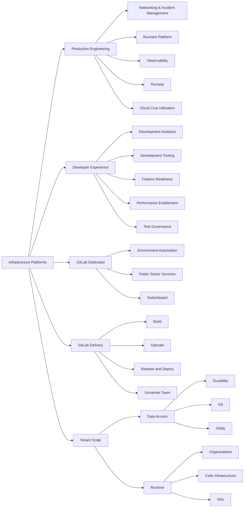

## ミッション

Infrastructure Platforms として、私たちのミッションは、高可用性・信頼性・高性能・スケーラブルなインフラソリューションを構築し、総所有コストを最低限に抑えながら、GitLab が SaaS およびセルフマネージドプラットフォーム全体で単一の DevSecOps プラットフォームを提供できるようにすることです。

## ビジョン

業界をリードする SaaS ソリューションを提供し、世界中の組織に最も革新的で効率的な DevSecOps プラットフォームを提供します。

## 支援の受け方

GitLab チームメンバーで GitLab.com の可用性の問題について Infrastructure Platforms チームに通知したい場合は、インシデント報告の簡単な手順をこちらでご確認ください: [インシデントの報告](/handbook/engineering/infrastructure-platforms/incident-management/#reporting-an-incident)。

その他のお問い合わせについては、[支援を受ける方法](/handbook/engineering/infrastructure-platforms/getting-assistance/)ページをご覧ください。

## 方向性

複数のクォーターにまたがることが多い Platforms セクション内で推進されているイニシアティブは、[SaaS Platforms セクション Epic](https://gitlab.com/groups/gitlab-com/-/epics/2115)（GitLab チームメンバー向け）に表示されています。

<!-- include omitted: includes/engineering/we-are-also-product-development.md (no localized version under content/ja/) -->

## 組織構造

（ボックスをクリックすると詳細が表示されます）

## ドッグフーディング

Infrastructure Platforms 部門は GitLab と GitLab の機能を主要ツールとして幅広く使用し、GitLab.com を含む多くの[環境](/handbook/engineering/infrastructure-platforms/environments/)を運用しています。

私たちは Engineering 機能の一部として同じ[ドッグフーディングプロセス](/handbook/engineering/development/principles/#dogfooding)に従いながら、[部門のミッションステートメント](#mission)を主要な優先順位決定の基準としています。優先順位付けプロセスは[Engineering 機能レベルの優先順位付けプロセス](/handbook/engineering/#prioritizing-technical-decisions)に沿っており、Infrastructure Platforms 部門が行う他の技術的な意思決定に対してドッグフーディングの優先度がどこに位置するかを定義しています。

GitLab.com を運用するためのツールを構築することを検討する際は、[`5x ルール`](/handbook/product/product-processes/dogfooding-for-r-d/)に従って、そのツールを GitLab の機能として構築するか GitLab 外で構築するかを判断します。Infrastructure が GitLab 製品へ貢献したものを追跡するために、それらの Issue に適切な [Dogfooding](https://gitlab.com/groups/gitlab-org/-/labels?utf8=%E2%9C%93&subscribed=&search=dogfooding) ラベルを付けています。

## Infrastructure Platforms 部門でのハンドブック活用

GitLab では[ハンドブックファースト方針](/handbook/about/handbook-usage/#why-handbook-first)を採用しています。これはプロセス変更を伝達し、日々提供されている作業の唯一の情報源を構築する方法です。

[ハンドブック使用ガイド](/handbook/about/handbook-usage/)には多くの一般的なヒントが記載されています。Infrastructure Platforms 部門で最も頻繁に遭遇するものをハイライトします:

1. より広いコミュニティはトレーニング資料、アーキテクチャ図、技術ドキュメント、ハウツードキュメントから恩恵を受けることができます。これらの詳細な情報の適切な場所は関連プロジェクトのドキュメントです。ハンドブックページには高レベルの概要を掲載し、プロジェクトドキュメントに配置された詳細情報へのリンクを含めることができます。
1. ハンドブックの内容を消費するオーディエンスについて考えてください。ハンドブックに GitLab.com の運用ランブックを詳細に記載すると、セルフマネージドユーザーには適用されない情報が含まれ、混乱を招く可能性があります。さらに、ハンドブックは運用情報のメインの場所ではないため、運用情報を一箇所にまとめて参照としてリンクを含めた一般的なコンテキストを説明することで可視性が向上します。
1. ハンドブックページが簡単に利用できるようにしてください。チェックリスト、オンボーディング、繰り返しタスクは自動化するか、ハンドブックからリンクできるテンプレートの形式で作成してください。
1. ハンドブックはプロセスそのものです。ハンドブックは私たちの原則を説明し、Epic と Issue は原則を実践に移したものです。

## プロジェクト

Infrastructure Platforms 部門のプロジェクト分類は[インフラ部門プロジェクトページ](/handbook/engineering/infrastructure-platforms/projects)に記載されています。

[インフラ Issue トラッカー](https://gitlab.com/gitlab-com/gl-infra/production-engineering/-/issues)はインフラチームのバックログおよびキャッチオールプロジェクトであり、チームが行う継続的な変更やインシデントとは無関係の作業を追跡します。

バックログの追跡に加えて、Infrastructure Platforms 部門のプロジェクトは[Infrastructure Platforms 部門 Epic](https://gitlab.com/groups/gitlab-com/-/epics/1049) および[四半期ごとの目標と主要成果](https://gitlab.com/groups/gitlab-com/-/epics/1420)でも管理されています。

## デザイン

[**Infrastructure Library**](https://gitlab.com/gitlab-com/gl-infra/readiness/-/tree/master/library) には、私たちが解決している問題についての考え方を概説し、私たちが直面する課題に対処するための技術的ソリューションの生産において重要な役割を果たす、あらゆるトピックの***現在の状態***を表すドキュメントが含まれています。

## テクニカルロードマップ

Infrastructure は短期（1年）、中期（2年）、長期（3年）のプロジェクト計画のための[テクニカルロードマップ](/handbook/engineering/#technical-roadmaps)を維持しています。
これは私たちの戦略的な羅針盤として機能し、
即時のニーズと長期的な持続可能性のバランスを取るのに役立ちます。

テクニカルロードマップは[プロダクトロードマップ](https://about.gitlab.com/direction/)に基づいており、
プロダクトが「何を」（顧客ニーズ）と「なぜ」（ビジネス戦略）を提供します。
その後、エンジニアが「どのように」（技術的実装）を決定し、
Engineering Manager が「いつ」（スケジューリング）を計画します。
この包括的なロードマップは、持続可能な方法で高品質で
完全な機能を構築することを重視しています。

テクニカルロードマップは 3 つの主要な目的を果たします:

1. 技術的負債、パフォーマンス改善、プラットフォーム改善、システムのスケーラビリティなど、プロダクトバックログに現れない可能性のある重要な領域に対処することで、エンジニアリングの卓越性を構築するのに役立ちます。

1. 部門が反応的ではなく積極的であることを可能にします。
   「システムのどこに最大の不安定性があるか？」や
   「最も多くのトイルを生み出しているのは何か？」などの重要な質問を定期的に行うことで、問題が深刻化する前に対処できます。
   これにより SLO を維持し、お客様の満足度を高めます。

1. エンジニアリングの取り組みをビジネス目標と整合させ、技術的改善が GitLab の成功を促進することを確保します。
   各テクニカルロードマップアイテムは、ビジネス価値と戦略的整合性に基づいて優先順位付けされます。

### 現在の状態

Infrastructure ロードマップは静的サイトとして管理されています。
GitLab チームメンバーは現在のテクニカルロードマップを
[infra-roadmap.gitlab.com](https://infra-roadmap.gitlab.com/) で確認できます。

**注意**:
Infrastructure ロードマップはプロジェクトや
イニシアティブの一部が[unSAFE](/handbook/legal/safe-framework/)と見なされる可能性があるため、公開されていません。

サイトはロードマップを視覚的に表示し、以下を示します:

- 計画されたイニシアティブ間の依存関係
- 信頼度、ステージ、またはタグによるフィルタリングオプション
- 部門内の各ステージの個別ロードマップ
- 依存関係の可視化による影響分析

### ロードマップの更新

ロードマップへの変更は [`infra-roadmap`](https://gitlab.com/gitlab-com/gl-infra/infra-roadmap/-/tree/main/data) プロジェクトへのマージリクエストを通じて行われます。
データは YAML 形式で保存されており、YAML を編集することで変更できます。
これによりバージョン管理とマージリクエストプロセスを通じた協調的な議論が可能になります。

Infrastructure ロードマップへの変更に関する完全な手順は
[プロジェクトの README.md](https://gitlab.com/gitlab-com/gl-infra/infra-roadmap/-/blob/main/README.md#updating-the-roadmap) に記載されています。

新しいイニシアティブの提案や説明の更新・関連 Issue へのリンク追加などの小さな変更など、
ロードマップへの貢献が奨励されています。

## プロダクト機能のサポート

プロダクト機能をサポートするために使用するモデルがあります。[このモデル](/handbook/engineering/infrastructure-platforms/feature-support/)は、新機能を本番環境にリリースするための協力方法の詳細を提供します。

## 作業方法

私たちは GitLab の[バリュー](/handbook/values/)、[プロジェクト管理](/handbook/engineering/infrastructure-platforms/project-management/)プロセス、および[AI 使用原則](/handbook/engineering/infrastructure-platforms/ai_usage_principles/)に従っています。

### コミュニケーション

#### Slack

主要なコミュニケーション手段は Slack です。

本番の問題やインシデントについて支援が必要な場合は、[支援を受ける方法](/handbook/engineering/infrastructure-platforms/getting-assistance/)のセクションをご覧ください。

**SaaS Platforms**

| **チャンネル** | **目的** |
|-----------|-----------|
| [#infrastructure_-_platforms](https://gitlab.slack.com/archives/C02D1HQRTKQ) | 部門レベルのアイテムについて協力します。このチャンネルはより広いチームと重要な情報を共有するために使用されますが、Platforms の全チームを共通のトピックに整合させる役割も果たします。 |
| [#g_infrastructure_platforms_leads](https://gitlab.slack.com/archives/C010QV6RRB3) | マネージャー向けのコミュニケーション。トピックが興味深いと感じる方は誰でも参加できます。 |
| [confidential managers channel](https://gitlab.enterprise.slack.com/archives/C0808MLEXL1) | 追加調整が必要な全チームに影響するスタッフィングの問題を議論するために使用されます。できる限り公開チャンネルを使用することを基本としています。|
| [#infrastructure_platforms_social](https://gitlab.enterprise.slack.com/archives/C062T669RFD) | ソーシャルチャンネル。 |

**Dedicated**

| **チャンネル** | **目的** |
|-----------|-----------|
| [#g_dedicated-team](https://gitlab.enterprise.slack.com/archives/C025LECQY0M)| Dedicated グループディスカッションチャンネル。Dedicated グループのエンジニア全体に関連する議論にこのチャンネルをご使用ください |
| [#f_gitlab_dedicated](https://gitlab.enterprise.slack.com/archives/C01S0QNSYJ2)| Dedicated 機能チャンネル。Dedicated 製品の機能や使い方についての質問にこのチャンネルをご使用ください。Dedicated グループはより広いグループに関連するアナウンスにこのチャンネルを使用します |
| [#g_dedicated-us-pubsec](https://gitlab.enterprise.slack.com/archives/C03R5837WCV)| Dedicated USPubSec チームチャンネル。PubSec チームのみに影響するトピックの議論に使用されます。より広いエンジニアリング討議については [#g_dedicated-team](https://gitlab.enterprise.slack.com/archives/C025LECQY0M) をご使用ください |
| [#g_dedicated-switchboard-team](https://gitlab.enterprise.slack.com/archives/C04DG7DR1LG)| Dedicated Switchboard チームチャンネル。Switchboard チームのみに影響するトピックの議論に使用されます。より広いエンジニアリング討議については [#g_dedicated-team](https://gitlab.enterprise.slack.com/archives/C025LECQY0M) をご使用ください|
| [#g_dedicated-environment-automation-team](https://gitlab.enterprise.slack.com/archives/C074L0W77V0)|Dedicated Environment Automation チームチャンネル。Switchboard チームのみに影響するトピックの議論に使用されます。より広いエンジニアリング討議については [#g_dedicated-team](https://gitlab.enterprise.slack.com/archives/C025LECQY0M) をご使用ください|
| [#g_dedicated-team-social](https://gitlab.enterprise.slack.com/archives/C03QBGQ3K5W)| Dedicated ソーシャルチャンネル|
| [#dedicated-mr-review-stream](https://gitlab.enterprise.slack.com/archives/C065DDKPL21)| Dedicated リポジトリの新しいマージリクエストの可視化 |

**Delivery**

| **チャンネル** | **目的** |
|-----------|-----------|
|[#g_release_and_deploy](https://gitlab.enterprise.slack.com/archives/g_release_and_deploy)| Release and Deploy グループチャンネル|
|[#g_release_and_deploy_social](https://gitlab.enterprise.slack.com/archives/C01QX84J6UR)| グループのソーシャルチャンネル。 |
|[#releases](https://gitlab.enterprise.slack.com/archives/C0XM5UU6B)| 現在のリリース/パッチに関する一般的なコミュニケーション|
|[#f_upcoming_release](https://gitlab.enterprise.slack.com/archives/C0139MAV672)| 詳細なリリースステータス / リリースマネージャーチャンネル |
|[#announcements](https://gitlab.enterprise.slack.com/archives/C8PKBH3M5)|Release-Tools がデプロイアクティビティに関連する投稿を自動的に行う|

**Production Engineering**

| **チャンネル** | **目的** |
|-----------|-----------|
| [#s_production_engineering](https://gitlab.enterprise.slack.com/archives/C07U6SAKS4D)| Production Engineering チームとの一般的な会話および他のチームメンバーからのリクエスト。 |
| [#g_production_engineering_leads](https://gitlab.enterprise.slack.com/archives/C06LDGA7Z9S)| Production Engineering リード（スタッフ+およびマネジメント）向けチャンネル |
| [#g_networking_and_incident_management](https://gitlab.enterprise.slack.com/archives/C09BM5XCPBP)| Networking & Incident Management チームチャンネル |
| [#g_observability](https://gitlab.enterprise.slack.com/archives/C065RLJB8HK)| Observability チームチャンネル |
| [#g_runners_platform](https://gitlab.enterprise.slack.com/archives/C08TJEKF0JZ)| Runners Platform チームチャンネル |
| [#g_runway](https://gitlab.enterprise.slack.com/archives/C07UED5CGR2)| Runway チームチャンネル |

**Tenant Scale**

| **チャンネル** | **目的** |
| ----------- | ----------- |
|[#s_tenant_scale](https://gitlab.enterprise.slack.com/archives/C07TWC3QX47) | Tenant Scale との一般的な会話および他のチームからのリクエスト。 |
|[#g_organizations](https://gitlab.enterprise.slack.com/archives/C01TQ838Y3T) | Organizations チームに特有の議論とリクエスト。 |
|[#g_geo](https://gitlab.enterprise.slack.com/archives/C32LCGC1H) | Geo チームに特有の議論とリクエスト。 |
|[#g_cells_infrastructure](https://gitlab.enterprise.slack.com/archives/C07URAK4J59) | Cells Infrastructure チームに特有の議論とリクエスト。 |
|[#f_cells_and_organizations](https://gitlab.enterprise.slack.com/archives/C0609EXHX6F) | Cells と Organizations に関するクロスファンクショナルな議論と調整のチャンネル。 |

SaaS Platforms グループは、[#saas-platforms-help](https://gitlab.enterprise.slack.com/archives/C07DU5Z7V6V) Slack チャンネルへのヘルプリクエストを段階的に誘導しています。
どの Infrastructure チームに質問すべきか不明な場合にこのチャンネルをご使用ください。
詳細は[支援を受ける方法のランディングページ](/handbook/engineering/infrastructure-platforms/getting-assistance/)をご参照ください。

[#saas-platforms-help](https://gitlab.enterprise.slack.com/archives/C07DU5Z7V6V) チャンネルは SaaS Platforms Engineering Manager と Staff+ エンジニアによって監視され、受信リクエストのトリアージを行います。このチャンネルをトリアージする際は、この質問に最も適切に回答できるチームを見つけ、リクエスターにそのチームの優先連絡方法で連絡するよう案内してください。リクエスターが適切なチームに繋がったら、メッセージに緑のチェックマーク絵文字を追加してください。最後に、必要に応じて変更点を[支援を受ける方法](/handbook/engineering/infrastructure-platforms/getting-assistance/)ページに更新してください。

#### ミーティング

週1回、`Platforms leads call` を開催し、キャリア開発、全体的な方向性に関するアクションアイテムについて整合を図り、非同期で対応されていない進行中の質問に回答します。通話当日の午前中にトピックが追加されていない場合はキャンセルされます。

`Platforms leads call` に加えて、[SaaS Platforms Leadership Calendar](https://calendar.google.com/calendar/embed?src=c_8a81f7acc76d72b8e4189a61f7a259b9d722e3fe1e05693236f592e7dd52e83b%40group.calendar.google.com) で確認できる定期的なイベントとリマインダーがあります。さまざまなイベントの最新情報を得るためにカレンダーに追加してください。

Infrastructure の Sr. Director である Marin Jankovski は、組織に加わった新しいチームメンバーとミーティングを好みます。Marin は月に数回、新しいチームメンバーとのインフォーマルな 1:1 コーヒーチャットを設定し、互いを知り、様子を確認します。このプロセスは彼の EBA が担当し、ミーティングの可用性ができたらチームメンバーに連絡します。チームが大きいため、全員とのミーティングに時間がかかる場合があります。
コーヒーチャットが予定される前に Marin と話す必要がある場合は、彼の EBA である Liki Simonot に連絡して設定してください。

##### Grand Review

各ステージのエンジニアリングリードはプロダクトマネージャーと共に週次の進捗レビューを実施し、グループの進捗を評価し、プロジェクトの更新を共有し、ブロッカーを解決し、成果を称えます。また、プロダクトディレクターと Infrastructure Platforms の Sr. Director が高レベルのリーダーシップレビューを実施し、これらのグループレベルのミーティングのサマリーを確認します。

**週次スケジュール**

- 水曜日（またはチームに設定された曜日によって異なる）: 各 Epic DRI は[進捗の更新についての状態更新のメンション](/handbook/engineering/infrastructure-platforms/project-management/#status-updates-on-project-epics)を受け取ります。更新は簡潔に、以下を含めてください:
  - ビジネス指向の高レベルな視点からの新しい成果。グラフ、デモ、視覚化も歓迎。
  - リスク、ブロッカー、タイムライン、スコープへの変更、および支援が必要かどうかや FYI の浮上
  - 行われた新しい重要な決定
- 完了したプロジェクトには、[Epic 説明のクロージングサマリーハイライト](/handbook/engineering/infrastructure-platforms/project-management/#when-a-project-is-finished)を含めます。Epic はオープンのまま、「In Progress」ラベルで残します。これらの Epic は Grand Review 中にクローズされます。
- 木曜日: グループレベルのレビューが実施され、[Infrastructure Platforms トップレベル Epic](https://gitlab.com/groups/gitlab-com/-/epics/2115) のスレッドとして追加されます（[例](https://gitlab.com/groups/gitlab-com/-/epics/2115#note_2197983622)参照）
  - Data Access: Data Access の代理 Sr. EM とグループ PM が進行
  - Tenant Scale: Tenant Scale の Sr. EM とグループ PM が進行
  - Production Engineering: Production Engineering の Sr. EM とグループ PM が進行
  - Software Delivery: Software Delivery の代理 Sr. EM とグループ PM が進行
  - Developer Experience: Developer Experience ディレクターと PM のローテーションが進行
  - Dedicated: Dedicated ディレクターとグループ PM が進行
- 金曜日: リーダーシップレビュー（Infrastructure Platforms の Sr. Director と プロダクト Infrastructure Platforms のディレクターが進行）。[Infrastructure Platforms トップレベル Epic](https://gitlab.com/groups/gitlab-com/-/epics/2115) のスレッドとして追加されたグループレベルのサマリーをレビューし、包括的なプロジェクトカバレッジを確保するために特定のグループを深く掘り下げます。
- 金曜日: グループレベルとリーダーシップレベルのレビューが #infrastructure_platforms で一緒にリリースされます

レビューは機密性の高い Issue を扱うため、GitLab Unfiltered チャンネルにプライベートストリーミングされます。すべての録画は [Platforms Grand Review YouTube Playlist](https://www.youtube.com/playlist?list=PL05JrBw4t0KqDXSHdlUvPWHOj_Hw8JdQ1) で利用可能です

##### Infrastructure Platforms Leads Demo

Infrastructure Platforms Leads Demo は、Infrastructure Platforms グループ全体の Staff+ IC 間での同期ディスカッションの機会であり、支援しているチームで進行中の取り組みをハイライトします。
すべてのチームメンバーが通話に参加できますが、Staff+ IC が取り組んでいる作業、経験している問題、検討している解決策を発表・議論することに重点が置かれています。

通話は [Infrastructure Platforms Leads Demo Unfiltered Playlist](https://www.youtube.com/playlist?list=PL05JrBw4t0KpI98ZtrhYrA_gJgYJjnOgl) に録画されます。アジェンダは [Google Docs](https://docs.google.com/document/d/1MX__hMUcxEUv2JlRiXySNvFnOPHv7-Uul1_VbzImbKw/edit) で確認できます。

通話を GitLab Unfiltered で公開することを意図していますが、デフォルトはプライベートとして公開されます。
通話の最後に参加者間で簡単な投票が行われ、全員がコンテンツが #SAFE であることに同意した場合、公開として公開できます。

##### SaaS Health Review

Infrastructure Platforms の Engineering Manager が SaaS ヘルスに関する定期的な通話をリードします。詳細は [SaaS Health Review ページ](./saas-health-review.md)をご覧ください。

### ヘルプリクエスト

[支援を受ける方法のランディングページ](/handbook/engineering/infrastructure-platforms/getting-assistance/)では、支援が必要なチームメンバーに標準テンプレートを使用してヘルプリクエストを提出するようお願いしています。

これらの Issue は[ヘルプリクエスト Issue トラッカー](https://gitlab.com/gitlab-com/saas-platforms/saas-platforms-request-for-help/-/issues)に作成され、関連する SaaS Platforms チームの Engineering Manager に自動的に割り当てられます。

Engineering Manager は以下を行うことが期待されます:

1. 質問が重複していないか、またその質問への回答がハンドブックやトラッカー自体に既に存在しないかを確認する。
2. リクエストの緊急度を確認する。
3. ヘルプリクエストに回答するか、リクエストを支援するエンジニアに割り当てる。

### Slack から GitLab Issue トラッカーへの統合

Infrastructure チームへのリクエストの追跡と解決を強化するために、[#infrastructure_lounge](https://gitlab.slack.com/archives/CB3LSMEJV) チャンネルの Slack メッセージを GitLab Issue に変換するボットを評価しています。

#### ワークフロー概要

- **確認**: エージェントが `acknowledged_emoji`（私たちの場合は 👀）で Infrastructure Lounge チャンネルの Slack メッセージを確認します。
- **Issue 作成**: Slack ボットが確認したエージェントを担当者として Issue を作成します。
- **スレッド添付**: メッセージに対応する Slack スレッドも作成された GitLab Issue に投稿されます。
- **ラベル割り当て**: エージェントは Slack メッセージにラベル絵文字（`ops`、`foundations`、`observability`）を追加することで Issue をさらに分類できます。このアクションにより、Issue が自動的に対応するチーム（Ops、Foundations、Observability）に割り当てられます。
- **プロジェクト追跡**: これらの変換された Issue は [Infrastructure Lounge Slack Issue Tracker](https://gitlab.com/gitlab-com/gl-infra/infrastructure-lounge-slack-issue-tracker) にホストされた専用プロジェクトで追跡されます。
- **Issue クローズ**: エージェント/リクエスターは `resolved_emojis`（私たちの場合は `green-circle-check`、`white_check_mark`、または `checked`）のいずれかを追加することで解決時に Issue をクローズできます

#### 設定

これらの Issue を処理するエージェントは JSON ファイルで定義され、[CI/CD 変数](https://ops.gitlab.net/gitlab-com/gl-infra/infrastructure-lounge-slack-issue-creator/-/settings/ci_cd)として機能します。現在、このファイルにはインフラ部門のすべてのメンバーの静的リストが含まれています。

### プロジェクトとバックログ管理

私たちは Epic と Issue を使用して作業を管理しています。[私たちのプロジェクト管理プロセス](/handbook/engineering/infrastructure-platforms/project-management/)は SaaS Platforms のすべてのチーム間で共有されています。

### ツール

Platforms セクションは SaaS プラットフォームのデプロイ、運用、監視を支援するためのさまざまなツールを構築・維持しています。これらのツールのリストは [Platforms Tools Index](/handbook/engineering/infrastructure-platforms/tools/) でご確認いただけます。

### OKR

私たちは [GitLab の OKR](/handbook/company/okrs/) と整合した目標設定に OKR を使用しています。
[私たちの OKR プロセス](/handbook/engineering/infrastructure-platforms/okrs/)は SaaS Platforms のすべてのチーム間で共有されています。

### 採用と面接

[私たちの採用プロセス](/handbook/engineering/infrastructure-platforms/hiring/)は Infrastructure Platforms のすべてのチーム間で共有されています。

この [Infrastructure Platforms インタビューガイド](/handbook/hiring/interviewing/infrastructure-interview/)では、定期的な求人、面接プロセス、私たちへの応募に関するその他の有用な情報の詳細を提供しています。現在の求人については[採用ページ](https://about.gitlab.com/jobs/)をご覧ください。

## Platforms ラーニングパス

すべてのチームメンバーが個人開発のための時間を確保することが奨励されています。以下のリンクは Platforms 関連の学習を始めるのに役立ちます。他のメンバーの個人開発を支援するために、このリストに独自の貢献を追加してください。

### Infrastructure Platforms とそのグループについて学ぶ

| グループ | トピック |
|-------|-------|
| SaaS Platforms | [プロダクト方向性](https://about.gitlab.com/direction/saas-platforms/) |
| Delivery Group | [Delivery Group](/handbook/engineering/infrastructure-platforms/gitlab-delivery/delivery/) |
| Production Engineering Group| [Production Engineering](/handbook/engineering/infrastructure-platforms/production-engineering/) |
| Dedicated Group | [Dedicated Group](/handbook/engineering/infrastructure-platforms/gitlab-dedicated/) |
| Tenant Scale | [グループページ](/handbook/engineering/infrastructure-platforms/tenant-scale/) |

### Platforms で使用されるツールと技術について学ぶ

1. [Jsonnet チュートリアル](https://jsonnet.org/learning/tutorial.html)

## 共通リンク

- [GitLab.com のインシデント管理方法](/handbook/engineering/infrastructure-platforms/incident-management/)
- [GitLab.com ステータス情報](https://status.gitlab.com)

### その他の Slack チャンネル

- [#production](https://gitlab.slack.com/archives/production)
- [#infrastructure-lounge](https://gitlab.slack.com/archives/infrastructure-lounge)
- [#incidents](https://gitlab.slack.com/archives/incidents)
- [#announcements](https://gitlab.slack.com/archives/announcements)
- [#feed_alerts-general](https://gitlab.slack.com/archives/feed_alerts-general)

### 一般的な Issue トラッカー

- [Production Engineering Issue キュー](https://gitlab.com/gitlab-com/gl-infra/production-engineering/-/issues)
- [本番インシデントおよび変更](https://gitlab.com/gitlab-com/gl-infra/production/issues/)
- [Release and Deploy](https://gitlab.com/gitlab-com/gl-infra/delivery/issues/)
- [Observability](https://gitlab.com/gitlab-com/gl-infra/observability/team/-/issues/)
- [Tenant Scale](https://gitlab.com/gitlab-com/gl-infra/tenant-scale/)
- [Runway](https://gitlab.com/groups/gitlab-com/gl-infra/platform/runway/-/issues)

### リソース

- [本番アーキテクチャ](/handbook/engineering/infrastructure-platforms/production/architecture/)
- [運用ランブック](https://gitlab.com/gitlab-com/runbooks)
- [環境](/handbook/engineering/infrastructure-platforms/environments/)
- [モニタリング](/handbook/engineering/monitoring/)
- [レディネスレビュー](/handbook/engineering/infrastructure-platforms/production/readiness.md)
- [Infrastructure Platforms 標準](/handbook/company/infrastructure-standards/)
- [Infrastructure Platforms でのキャリア開発とインターンシップ](/handbook/engineering/infrastructure-platforms/careers)

## その他のページ

- [オンコールハンドオーバー](/handbook/engineering/infrastructure-platforms/production-engineering/networking-and-incident-management/on-call-handover/)
- [オンコールシャドウイング](/handbook/engineering/infrastructure-platforms/production-engineering/networking-and-incident-management/on-call-shadowing/)
- [SRE オンボーディング](/handbook/engineering/infrastructure-platforms/production-engineering/networking-and-incident-management/sre-onboarding/)
- [SRE オンコールオンボーディングバディ](/handbook/engineering/infrastructure-platforms/production-engineering/networking-and-incident-management/sre-oncall-onboarding-buddy/)
- [GitLab.com データ侵害通知ポリシー](https://about.gitlab.com/security/#data-breach-notification-policy)
- [スケールでのコーディング](/handbook/engineering/infrastructure-platforms/production-engineering/)
