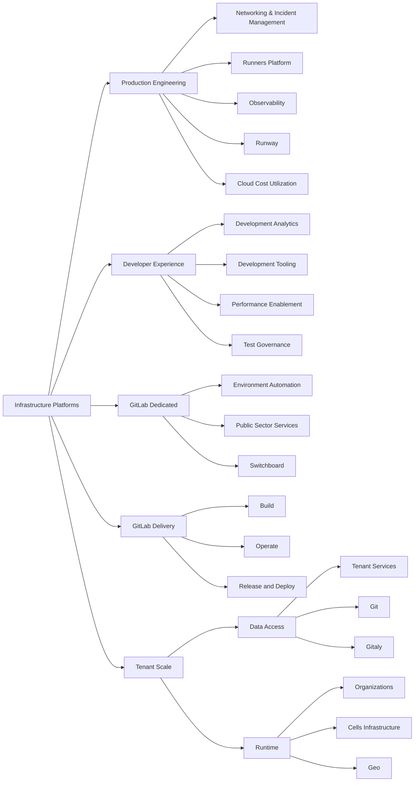

## ミッション

Infrastructure Platforms として、私たちのミッションは、高可用性・信頼性・高性能・スケーラブルなインフラソリューションを構築し、総所有コストを最低限に抑えながら、GitLab が SaaS およびセルフマネージドプラットフォーム全体で単一の DevSecOps プラットフォームを提供できるようにすることです。

## ビジョン

業界をリードする SaaS ソリューションを提供し、最も革新的で効率的な DevSecOps プラットフォームで世界中の組織を支援します。

## サポートの取得

GitLab.com の可用性問題について Infrastructure Platforms チームにアラートを出したい GitLab チームメンバーは、インシデントの報告方法に関する簡単な手順をこちらで確認してください: [インシデントの報告](/handbook/engineering/infrastructure-platforms/incident-management/#reporting-an-incident)。

その他のすべての問い合わせについては、[getting assistance](/handbook/engineering/infrastructure-platforms/getting-assistance/) ページを参照してください。

## 方向性

Platforms セクション内で推進されるイニシアチブは、複数四半期にまたがることが多く、[SaaS Platforms セクションエピック](https://gitlab.com/groups/gitlab-com/-/epics/2115) (GitLab チームメンバー) に表現されています。

{}

## 組織構造

(詳細はボックスをクリックしてください)

## ドッグフーディング

Infrastructure Platforms 部門は、GitLab.com を含む多くの [環境](/handbook/engineering/infrastructure-platforms/environments/) を運用するためのメインツールとして、GitLab および GitLab のフィーチャーを広範に使用しています。

私たちはエンジニアリングファンクションの一部として、同じ [ドッグフーディングプロセス](/handbook/engineering/development/principles/#dogfooding) に従いつつ、[部門のミッションステートメント](#mission) を主要な優先順位ドライバーとして維持しています。優先順位付けのプロセスは [エンジニアリングファンクションレベルの優先順位付けプロセス](/handbook/engineering/#prioritizing-technical-decisions) と整合しており、Infrastructure Platforms 部門が行う他の技術的決定に対してドッグフーディングの優先度がどこにあるかを定義しています。

GitLab.com を運用するためのツールを構築することを検討する際、[`5x ルール`](/handbook/product/product-processes/dogfooding-for-r-d/) に従って、GitLab のフィーチャーとしてツールを構築するか、GitLab の外で構築するかを決定します。GitLab 製品への Infrastructure のコントリビューションを追跡するために、それらの Issue に適切な [ドッグフーディング](https://gitlab.com/groups/gitlab-org/-/labels?utf8=%E2%9C%93&subscribed=&search=dogfooding) ラベルを付けます。

## Infrastructure Platforms 部門でのハンドブック使用

GitLab では、[ハンドブックファーストのポリシー](/handbook/about/handbook-usage/#why-handbook-first) を掲げています。これは、プロセス変更を伝達する方法であり、毎日提供される作業の信頼できる単一の情報源を構築する方法です。

[ハンドブック使用ページガイド](/handbook/about/handbook-usage/) には多くの一般的なヒントが掲載されています。Infrastructure Platforms 部門で最も頻繁に遭遇するものをハイライトします。

1. より広いコミュニティは、トレーニング資料、アーキテクチャ図、技術ドキュメント、ハウツーのドキュメントから恩恵を受けることができます。この詳細情報には、関連するプロジェクトドキュメントが良い場所です。ハンドブックページは高レベルの概要を含み、プロジェクトドキュメント内に置かれたより詳細な情報にリンクします。
1. ハンドブック内の資料を消費するオーディエンスについて考えてください。ハンドブック内の GitLab.com 運用ランブックの詳細なウォークスルーは、セルフマネージドユーザーには適用されない情報を提供する可能性があり、混乱を引き起こす可能性があります。さらに、ハンドブックは運用情報の頼りになる場所ではなく、運用情報を一箇所にまとめて、参照としてリンクを使って一般的なコンテキストを説明することで、可視性が向上します。
1. ハンドブックページが消費しやすいものになるようにしてください。チェックリスト、オンボーディング、繰り返し可能なタスクは、自動化されるか、ハンドブックからリンクできるテンプレートの形で作成されるべきです。
1. ハンドブックがプロセスです。ハンドブックは私たちの原則を記述し、エピックや Issue は私たちの原則を実践に移したものです。

## プロジェクト

Infrastructure Platforms 部門のプロジェクトの分類は、[インフラストラクチャ部門プロジェクトページ](/handbook/engineering/infrastructure-platforms/projects) に記載されています。

[インフラストラクチャ Issue トラッカー](https://gitlab.com/gitlab-com/gl-infra/production-engineering/-/issues) は、インフラストラクチャチームのバックログおよびキャッチオールプロジェクトであり、進行中の変更やインシデントとは無関係に、私たちのチームが行っている作業を追跡しています。

バックログの追跡に加えて、Infrastructure Platforms 部門のプロジェクトは [Infrastructure Platforms 部門エピック](https://gitlab.com/groups/gitlab-com/-/epics/1049) および [四半期の目標と主要結果](https://gitlab.com/groups/gitlab-com/-/epics/1420) に取り込まれています。

## 設計

[**Infrastructure Library**](https://gitlab.com/gitlab-com/gl-infra/readiness/-/tree/master/library) には、私たちが解決している問題に関する考えをまとめたドキュメントが含まれており、あらゆるトピックの ***現在の状態*** を表現し、私たちが直面する課題に対応するための技術的ソリューションを生み出す上で重要な役割を果たします。

## テクニカルロードマップ

Infrastructure は、短期 (1年)、中期 (2年)、長期 (3年) のプロジェクト計画のための [テクニカルロードマップ](/handbook/engineering/#technical-roadmaps) を維持しています。
これは私たちの戦略的な羅針盤として機能し、
即時のニーズと長期的な持続可能性のバランスを取るのに役立ちます。

テクニカルロードマップは [プロダクトロードマップ](https://about.gitlab.com/direction/) に基づいており、
プロダクトが「何を」(顧客のニーズ) および「なぜ」(ビジネス戦略) を提供します。
そしてエンジニアが「どのように」(技術的実装) を決定し、
エンジニアリングマネージャーは「いつ」(スケジューリング) を計画します。
この包括的なロードマップは、持続可能な方法で高品質で完全なフィーチャーを構築することを重視しています。

テクニカルロードマップには3つの重要な目的があります。

1. プロダクトバックログに表れない可能性のある重要な領域に対処することで、エンジニアリングの卓越性を構築するのに役立ちます。
   例えば技術的負債、パフォーマンス改善、プラットフォーム改善、システムのスケーラビリティなどです。

1. 部門がリアクティブではなくプロアクティブであることを可能にします。
   「システム内で最も大きな不安定性がどこにあるか?」や
   「最も多くの労役を生み出しているのは何か?」といった重要な質問を定期的に問うことで、
   問題が深刻になる前に対処できます。
   これにより SLO を維持し、お客様の満足度を保つのに役立ちます。

1. エンジニアリングの取り組みをビジネス目標と整合させ、技術的改善が GitLab の成功を推進するようにします。
   各テクニカルロードマップ項目は、ビジネス価値と戦略的整合性に基づいて優先順位付けされます。

### 現在の状態

Infrastructure ロードマップは静的サイトとして維持されています。
GitLab チームメンバーは、現在のテクニカルロードマップを
[infra-roadmap.gitlab.com](https://infra-roadmap.gitlab.com/) で確認できます。

**注意**:
Infrastructure ロードマップは公開されていません。一部のプロジェクトと
イニシアチブが [unSAFE](/handbook/legal/safe-framework/) と見なされる場合があるためです。

このサイトはロードマップを視覚的に提示し、以下を表示します。

- 計画されたイニシアチブ間の依存関係
- 確信度、ステージ、タグによるフィルタリングオプション
- 部門内の各ステージの個別ロードマップ
- 依存関係の可視化を通じたインパクト分析

### ロードマップの更新

ロードマップへの変更は、[`infra-roadmap`](https://gitlab.com/gitlab-com/gl-infra/infra-roadmap/-/tree/main/data) プロジェクトへのマージリクエストを通じて行います。
データは YAML 形式で保存されており、YAML を編集することで変更できます。
これにより、マージリクエストプロセスを通じてバージョン管理と協力的な議論が可能になります。

Infrastructure ロードマップの変更方法の完全な手順は、
[プロジェクトの README.md](https://gitlab.com/gitlab-com/gl-infra/infra-roadmap/-/blob/main/README.md#updating-the-roadmap) で利用可能です。

新しいイニシアチブの提案や、説明の更新や関連 Issue へのリンクの追加といった
小さな変更まで、すべての人にロードマップへのコントリビューションを推奨しています。

## プロダクトフィーチャーのサポート

私たちはプロダクトフィーチャーのサポートに役立つモデルを持っています。[このモデル](/handbook/engineering/infrastructure-platforms/feature-support/) は、本番環境に新しいフィーチャーを出荷するためにどう協力するかの詳細を提供します。

## 私たちの働き方

私たちは GitLab [バリュー](/handbook/values/)、[プロジェクト管理](/handbook/engineering/infrastructure-platforms/project-management/) プロセス、および [AI 利用原則](/handbook/engineering/infrastructure-platforms/ai_usage_principles/) に従います。

### コミュニケーション

#### Slack

私たちのコミュニケーションの主な方法は Slack です。

本番環境の問題またはインシデントについて支援が必要な場合は、[サポートの取得](/handbook/engineering/infrastructure-platforms/getting-assistance/) のセクションを参照してください。

**SaaS Platforms**

| **チャンネル** | **目的** |
|-----------|-----------|
| [#infrastructure_-_platforms](https://gitlab.slack.com/archives/C02D1HQRTKQ) | 部門レベルのアイテムでここで協力します。このチャンネルは、より広いチームと重要な情報を共有するために使用されますが、Platforms 内のすべてのチームを共通のトピックで整合させる役割も果たします。 |
| [#g_infrastructure_platforms_leads](https://gitlab.slack.com/archives/C010QV6RRB3) | マネージャー向けのコミュニケーション。トピックに興味がある方なら誰でもこのチャンネルに参加できます。 |
| [confidential managers channel](https://gitlab.enterprise.slack.com/archives/C0808MLEXL1) | 追加の調整が必要なすべてのチームに影響する人員配置の問題を議論するために使用されます。可能な限りパブリックチャンネルを使うことをデフォルトとします。|
| [#infrastructure_platforms_social](https://gitlab.enterprise.slack.com/archives/C062T669RFD) | 私たちの社交チャンネル。 |

**Dedicated**

| **チャンネル** | **目的** |
|-----------|-----------|
| [#g_dedicated-team](https://gitlab.enterprise.slack.com/archives/C025LECQY0M)| Dedicated グループのディスカッションチャンネル。Dedicated グループ全体のエンジニアに関連するディスカッションにこのチャンネルを使用してください |
| [#f_gitlab_dedicated](https://gitlab.enterprise.slack.com/archives/C01S0QNSYJ2)| Dedicated ファンクションチャンネル。Dedicated 製品のフィーチャーや使用方法に関する質問をするためにこのチャンネルを使用してください。Dedicated グループは、より広いグループに関連するアナウンスをこのチャンネルで行います |
| [#g_dedicated-us-pubsec](https://gitlab.enterprise.slack.com/archives/C03R5837WCV)| Dedicated USPubSec チームチャンネル。PubSec チームのみに影響するトピックを議論するために使用されます。より広範なエンジニアリングの議論については [#g_dedicated-team](https://gitlab.enterprise.slack.com/archives/C025LECQY0M) を使用してください |
| [#g_dedicated-switchboard-team](https://gitlab.enterprise.slack.com/archives/C04DG7DR1LG)| Dedicated Switchboard チームチャンネル。Switchboard チームのみに影響するトピックを議論するために使用されます。より広範なエンジニアリングの議論については [#g_dedicated-team](https://gitlab.enterprise.slack.com/archives/C025LECQY0M) を使用してください|
| [#g_dedicated-environment-automation-team](https://gitlab.enterprise.slack.com/archives/C074L0W77V0)|Dedicated Environment Automation チームチャンネル。Switchboard チームのみに影響するトピックを議論するために使用されます。より広範なエンジニアリングの議論については [#g_dedicated-team](https://gitlab.enterprise.slack.com/archives/C025LECQY0M) を使用してください|
| [#g_dedicated-team-social](https://gitlab.enterprise.slack.com/archives/C03QBGQ3K5W)| Dedicated 社交チャンネル|
| [#dedicated-mr-review-stream](https://gitlab.enterprise.slack.com/archives/C065DDKPL21)| Dedicated リポジトリの新しいマージリクエストの可視性 |

**Delivery**

| **チャンネル** | **目的** |
|-----------|-----------|
|[#g_release_and_deploy](https://gitlab.enterprise.slack.com/archives/g_release_and_deploy)| Release and Deploy グループチャンネル|
|[#g_release_and_deploy_social](https://gitlab.enterprise.slack.com/archives/C01QX84J6UR)| グループ用の社交チャンネル。 |
|[#releases](https://gitlab.enterprise.slack.com/archives/C0XM5UU6B)| 現在のリリース／パッチに関する一般的なコミュニケーション|
|[#f_upcoming_release](https://gitlab.enterprise.slack.com/archives/C0139MAV672)| 詳細なリリースステータス／リリースマネージャーチャンネル |
|[#announcements](https://gitlab.enterprise.slack.com/archives/C8PKBH3M5)|デプロイ活動に関連する Release-Tools 自動投稿|

**Production Engineering**

| **チャンネル** | **目的** |
|-----------|-----------|
| [#s_production_engineering](https://gitlab.enterprise.slack.com/archives/C07U6SAKS4D)| Production Engineering チームの一般的な会話と、他のチームメンバーから来るリクエスト。 |
| [#g_production_engineering_leads](https://gitlab.enterprise.slack.com/archives/C06LDGA7Z9S)| Production Engineering リード (staff+ およびマネジメント) のチャンネル |
| [#g_networking_and_incident_management](https://gitlab.enterprise.slack.com/archives/C09BM5XCPBP)| Networking & Incident Management チームチャンネル |
| [#g_observability](https://gitlab.enterprise.slack.com/archives/C065RLJB8HK)| Observability チームチャンネル |
| [#g_runners_platform](https://gitlab.enterprise.slack.com/archives/C08TJEKF0JZ)| Runners Platform チームチャンネル |
| [#g_runway](https://gitlab.enterprise.slack.com/archives/C07UED5CGR2)| Runway チームチャンネル |

**Tenant Scale**

| **チャンネル** | **目的** |
| ----------- | ----------- |
|[#s_tenant_scale](https://gitlab.enterprise.slack.com/archives/C07TWC3QX47) | Tenant Scale の一般的な会話と、他のチームから来るリクエスト。 |
|[#g_organizations](https://gitlab.enterprise.slack.com/archives/C01TQ838Y3T) | Organizations チーム特有のディスカッションとリクエスト。 |
|[#g_geo](https://gitlab.enterprise.slack.com/archives/C32LCGC1H) | Geo チーム特有のディスカッションとリクエスト。 |
|[#g_cells_infrastructure](https://gitlab.enterprise.slack.com/archives/C07URAK4J59) | Cells Infrastructure チーム特有のディスカッションとリクエスト。 |
|[#f_cells_and_organizations](https://gitlab.enterprise.slack.com/archives/C0609EXHX6F) | Cells と Organizations のクロスファンクショナルなディスカッションと調整のためのチャンネル。 |

SaaS Platforms グループは、ヘルプリクエストを徐々に [#infrastructure-platforms](https://gitlab.enterprise.slack.com/archives/C02D1HQRTKQ) Slack チャンネルに振り向けています。
このチャンネルは、質問をどの Infrastructure チームに向けるべきかが不明確な場合に使用できます。
詳細については、[サポート取得のランディングページ](/handbook/engineering/infrastructure-platforms/getting-assistance/) を参照してください。

[#infrastructure-platforms](https://gitlab.enterprise.slack.com/archives/C02D1HQRTKQ) チャンネルは、SaaS Platforms のエンジニアリングマネージャーと Staff+ エンジニアによって監視されており、彼らはあらゆる受信リクエストをトリアージします。このチャンネルをトリアージする際、その質問に最も答えられるチームを見つけ、リクエスター（要求者）にそのチームの優先連絡方法でそのチームに連絡するよう指示する必要があります。リクエスターが適切なチームにつながったら、メッセージに緑のチェック絵文字を追加します。最後に、必要に応じて [サポートの取得](/handbook/engineering/infrastructure-platforms/getting-assistance/) ページを変更点で更新します。

#### ミーティング

週に1度、`Platforms leads call` を開催し、キャリア開発に関するアクションアイテムを整合させ、一般的な方向性、または非同期で対応されていない進行中の質問に答えます。当日朝にトピックが追加されていない場合、コールはキャンセルされます。

`Platforms leads call` に加えて、[SaaS Platforms リーダーシップカレンダー](https://calendar.google.com/calendar/embed?src=c_8a81f7acc76d72b8e4189a61f7a259b9d722e3fe1e05693236f592e7dd52e83b%40group.calendar.google.com) で見られる定期的なイベントとリマインダーがあります。これをカレンダーに追加して、さまざまなイベントの最新情報を入手してください。

インフラストラクチャのシニアディレクター、Marin Jankovski は、組織に参加した新しいチームメンバーと会うのを好みます。Marin はお互いを知り、彼らがどのようにしているかを確認するために、毎月数回、新しいチームメンバーと非公式な 1:1 のコーヒーチャットをセットアップします。このプロセスは彼の EBA によって組織され、彼が会う余裕がある場合にチームメンバーに連絡します。チームが大きいため、全員回るには時間がかかる可能性があります。
コーヒーチャットがスケジュールされている時より早く Marin に会う必要がある場合は、彼の EBA Liki Simonot に連絡してセットアップしてください。

##### Grand Review

各ステージのエンジニアリングリードと彼らのプロダクトマネージャーは、グループの進捗状況を評価し、プロジェクトの最新情報を共有し、ブロッカーを解決し、勝利を祝うために、毎週進捗レビューを開催します。さらに、プロダクトのディレクターと Infrastructure Platforms のシニアディレクターは、これらのグループレベルのミーティングのサマリーを確認する、より高いレベルのリーダーシップレビューを実施します。

**週次スケジュール**

- 水曜日 (またはチームに設定されている日に応じて): 各エピック DRI が [進捗の更新についてメンションするノート](/handbook/engineering/infrastructure-platforms/project-management/#status-updates-on-project-epics) を受け取ります。更新は短くし、以下を含めます:
  - 高レベルでビジネス指向の観点からの新しい達成事項。グラフ、デモ、可視化も歓迎です。
  - リスク、ブロッカー、タイムライン、スコープの変更、および助けが必要かどうかまたは FYI として表面化することなど
  - 行われた新しい重要な決定
- 完了したプロジェクトは、[エピックの説明にクロージングサマリーのハイライト](/handbook/engineering/infrastructure-platforms/project-management/#when-a-project-is-finished) を含めます。エピックはオープンのままにし、In Progress ラベルを付けます。これらのエピックは Grand Review でクローズされます。
- 木曜日: グループレベルのレビューが実施され、[Infrastructure Platforms トップレベルエピック](https://gitlab.com/groups/gitlab-com/-/epics/2115) にスレッドとして追加されます ([例](https://gitlab.com/groups/gitlab-com/-/epics/2115#note_2197983622) を参照)
  - Data Access: Data Access の代行シニア EM とグループ PM が運営
  - Tenant Scale: Tenant Scale のシニア EM とグループ PM が運営
  - Production Engineering: Production Engineering のシニア EM とグループ PM が運営
  - Software Delivery: Software Delivery の代行シニア EM とグループ PM が運営
  - Developer Experience: Developer Experience のディレクターとプロダクトマネージャーのローテーションが運営
  - Dedicated: Dedicated ディレクターとグループ PM が運営
- 金曜日: リーダーシップレビュー。Infrastructure Platforms のシニアディレクターと Infrastructure Platforms プロダクトのディレクターが運営。[Infrastructure Platforms トップレベルエピック](https://gitlab.com/groups/gitlab-com/-/epics/2115) にスレッドとして追加されたグループレベルのサマリーをレビューし、その後、包括的なプロジェクトカバレッジを確保するために特定のグループの深掘りを実施。
- 金曜日: グループレベルとリーダーシップレベルのレビューが一緒に #infrastructure_platforms にリリースされます

レビューは機密の問題をカバーするため、GitLab Unfiltered チャンネルへプライベートでストリーミングされます。すべての録画は [Platforms Grand Review YouTube プレイリスト](https://www.youtube.com/playlist?list=PL05JrBw4t0KqDXSHdlUvPWHOj_Hw8JdQ1) で利用可能です。

##### Infrastructure Platforms Leads Demo

Infrastructure Platforms Leads Demo は、Infrastructure Platforms グループ全体の Staff+ IC が、サポートするチームで進行中の現在の取り組みをハイライトする同期ディスカッションの機会です。
すべてのチームメンバーがコールに参加できますが、強調は Staff+ IC が彼らが集中している作業、経験している問題、検討している解決策を発表し議論することにあります。

コールは [Infrastructure Platforms Leads Demo Unfiltered プレイリスト](https://www.youtube.com/playlist?list=PL05JrBw4t0KpI98ZtrhYrA_gJgYJjnOgl) に録画されます。アジェンダは [Google Docs](https://docs.google.com/document/d/1MX__hMUcxEUv2JlRiXySNvFnOPHv7-Uul1_VbzImbKw/edit) にあります。

GitLab Unfiltered でコールをパブリックにする意図はありますが、デフォルトではプライベートとして公開されます。
コールの終わりに、出席者間で迅速な投票が行われ、コンテンツが #SAFE であるとすべて合意した場合、パブリックとして公開できます。

##### SaaS Health Review

Infrastructure Platforms のエンジニアリングマネージャーは、SaaS Health に関する定期的なコールをリードします。詳細については、[SaaS Health Review ページ](./saas-health-review.md) をご覧ください。

### ヘルプリクエスト

[サポート取得のランディングページ](/handbook/engineering/infrastructure-platforms/getting-assistance/) では、支援が必要なチームメンバーに、標準テンプレートを使用してヘルプリクエストを上げるよう依頼します。

これらの Issue は [ヘルプリクエスト Issue トラッカー](https://gitlab.com/gitlab-com/saas-platforms/saas-platforms-request-for-help/-/issues) に上げられ、関連する SaaS Platforms チームのエンジニアリングマネージャーに自動的に割り当てられます。

エンジニアリングマネージャーは以下を期待されます:

1. 質問が重複でないことを確認し、質問への回答がハンドブックまたはトラッカー自体にまだ発見できないことを確認します。
2. リクエストの緊急性を確認します。
3. ヘルプリクエストに応答するか、エンジニアにリクエストの対応を割り当てます。

### Slack と GitLab Issue トラッカーの統合

インフラストラクチャチームに向けられたリクエストの追跡と解決を強化する取り組みとして、[#infrastructure_lounge](https://gitlab.enterprise.slack.com/archives/C02D1HQRTKQ) チャンネル内の Slack メッセージを GitLab Issue に変換するボットを評価しています。

#### ワークフロー概要

- **確認応答**: エージェントが Infrastructure Lounge チャンネルの Slack メッセージを確認応答するために `acknowledged_emoji` (私たちのケースでは 👀) で応答します。
- **Issue 作成**: Slack ボットは、確認応答するエージェントが割り当てられた Issue を作成します。
- **スレッドアタッチ**: メッセージに対応する Slack スレッドも、作成された GitLab Issue に投稿されます。
- **ラベル割り当て**: エージェントは Slack メッセージにラベル絵文字 (`ops`、`foundations`、`observability`) を追加することで Issue をさらに分類できます。このアクションは、Issue をそれぞれのチーム: Ops、Foundations、Observability に自動的に割り当てます。
- **プロジェクト追跡**: これらの変換された Issue は、[Infrastructure Lounge Slack Issue Tracker](https://gitlab.com/gitlab-com/gl-infra/infrastructure_platforms-slack-issue-tracker) でホストされる専用プロジェクトの下で追跡されます。
- **Issue クロージャ**: エージェント／要求者は、`resolved_emojis` (私たちのケースでは `green-circle-check`、`white_check_mark` または `checked`) のいずれかを追加することで解決時に Issue をクローズできます。

#### 設定

これらの Issue の処理を担当するエージェントは JSON ファイルで定義されており、これは [CI/CD 変数](https://ops.gitlab.net/gitlab-com/gl-infra/infrastructure_platforms-slack-issue-creator/-/settings/ci_cd) として機能します。現在、このファイルにはインフラストラクチャ部門のすべてのメンバーの静的リストが含まれています。

### プロジェクトとバックログ管理

私たちは作業を管理するためにエピックと Issue を使用します。[私たちのプロジェクト管理プロセス](/handbook/engineering/infrastructure-platforms/project-management/) は SaaS Platforms のすべてのチームで共有されています。

### ツール

Platforms セクションは、SaaS プラットフォームのデプロイ、運用、モニタリングを支援するさまざまなツールを構築および保守しています。これらのツールのリストは [Platforms ツールインデックス](/handbook/engineering/infrastructure-platforms/tools/) で確認できます。

### OKR

私たちは [GitLab の OKR](/handbook/company/okrs/) に整合する目標を設定するために、目標と主要結果を使用します。
[私たちの OKR プロセス](/handbook/engineering/infrastructure-platforms/okrs/) は SaaS Platforms のすべてのチームで共有されています。

### 採用と面接

[私たちの採用プロセス](/handbook/engineering/infrastructure-platforms/hiring/) は Infrastructure Platforms のすべてのチームで共有されています。

この [Infrastructure Platforms 面接ガイド](/handbook/hiring/interviewing/infrastructure-interview/) は、定期的に開いているポジションのいくつか、面接プロセス、当社の仕事への応募に関連するその他の有用な情報の詳細を提供します。現在の求人に関する詳細情報は、[キャリアページ](https://about.gitlab.com/jobs/) で確認できます。

## Platforms 学習パス

すべてのチームメンバーが、個人開発のための時間をスケジュールすることを推奨されます。次のリンクは、Platforms 関連の学習を開始するのに役立つかもしれません。他者の個人開発に役立つよう、このリストに独自のコントリビューションを追加してください。

### Infrastructure Platforms とそのグループについて学ぶ

| グループ | トピック |
|-------|-------|
| SaaS Platforms | [プロダクトの方向性](https://about.gitlab.com/direction/saas-platforms/) |
| Delivery グループ | [Delivery グループ](/handbook/engineering/infrastructure-platforms/gitlab-delivery/delivery/) |
| Production Engineering グループ| [Production Engineering](/handbook/engineering/infrastructure-platforms/production-engineering/) |
| Dedicated グループ | [Dedicated グループ](/handbook/engineering/infrastructure-platforms/gitlab-dedicated/) |
| Tenant Scale | [グループページ](/handbook/engineering/infrastructure-platforms/tenant-scale/) |

### Platforms 内で使用されているツールとテクノロジーについて学ぶ

1. [Jsonnet チュートリアル](https://jsonnet.org/learning/tutorial.html)

## 共通リンク

- [GitLab.com のインシデント管理の方法](/handbook/engineering/infrastructure-platforms/incident-management/)
- [GitLab.com ステータス情報](https://status.gitlab.com)

### その他の Slack チャンネル

- [#production](https://gitlab.slack.com/archives/production)
- [#infrastructure_platforms](https://gitlab.slack.com/archives/infrastructure_platforms)
- [#incidents](https://gitlab.slack.com/archives/incidents)
- [#announcements](https://gitlab.slack.com/archives/announcements)
- [#feed_alerts-general](https://gitlab.slack.com/archives/feed_alerts-general)

### 一般的な Issue トラッカー

- [Production Engineering Issue キュー](https://gitlab.com/gitlab-com/gl-infra/production-engineering/-/issues)
- [本番インシデントと変更](https://gitlab.com/gitlab-com/gl-infra/production/issues/)
- [Release and Deploy](https://gitlab.com/gitlab-com/gl-infra/delivery/issues/)
- [Observability](https://gitlab.com/gitlab-com/gl-infra/observability/team/-/issues/)
- [Tenant Scale](https://gitlab.com/gitlab-com/gl-infra/tenant-scale/)
- [Runway](https://gitlab.com/groups/gitlab-com/gl-infra/platform/runway/-/issues)

### リソース

- [本番アーキテクチャ](/handbook/engineering/infrastructure-platforms/production/architecture/)
- [運用ランブック](https://gitlab.com/gitlab-com/runbooks)
- [環境](/handbook/engineering/infrastructure-platforms/environments/)
- [モニタリング](/handbook/engineering/monitoring/)
- [Readiness レビュー](/handbook/engineering/infrastructure-platforms/production/readiness.md)
- [Infrastructure Platforms 標準](/handbook/company/infrastructure-standards/)
- [Infrastructure Platforms のキャリア開発とインターンシップ](/handbook/engineering/infrastructure-platforms/careers)

## その他のページ

- [オンコール引継ぎ](/handbook/engineering/infrastructure-platforms/production-engineering/networking-and-incident-management/on-call-handover/)
- [オンコールシャドウイング](/handbook/engineering/infrastructure-platforms/production-engineering/networking-and-incident-management/on-call-shadowing/)
- [SRE オンボーディング](/handbook/engineering/infrastructure-platforms/production-engineering/networking-and-incident-management/sre-onboarding/)
- [SRE オンコールオンボーディングバディ](/handbook/engineering/infrastructure-platforms/production-engineering/networking-and-incident-management/sre-oncall-onboarding-buddy/)
- [GitLab.com データ侵害通知ポリシー](https://about.gitlab.com/security/#data-breach-notification-policy)
- [スケールでのコーディング](/handbook/engineering/infrastructure-platforms/production-engineering/)
