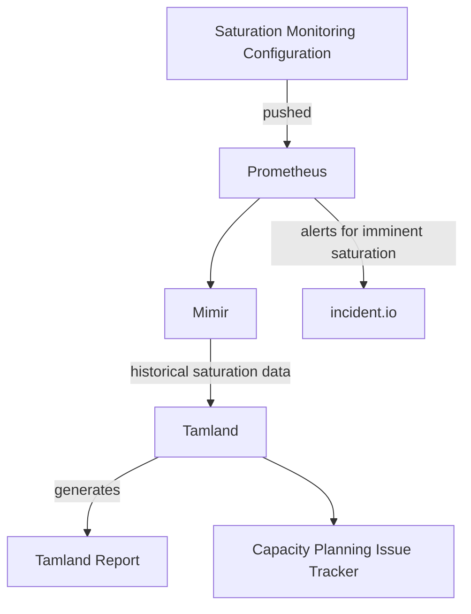

## はじめに

GitLab インフラストラクチャを適切なタイミングでスケールし、インシデントを防ぐために、たとえば GitLab.com や GitLab Dedicated に対してキャパシティプランニングプロセスを導入しています。

このプロセスの一部は予測的であり、将来のニーズを予測するために予測ツールからの入力を受け取ります。これにより、コンポーネントが個々の飽和レベルに達する前に、インフラストラクチャチームへの早期かつ非侵襲的な警告を提供することを目指しています。予測ツールはキャパシティ警告を生成し、それが Issue に変換され、さまざまなステータスミーティングで報告されます。

GitLab.com のキャパシティプランニングについては、[レポートが公開されており](https://gitlab-com.gitlab.io/gl-infra/capacity-planning-trackers/gitlab-com/)、予測される飽和イベントは [キャパシティプランニング Issue トラッカー](https://gitlab.com/gitlab-com/gl-infra/capacity-planning-trackers/gitlab-com/-/boards/2816983)で Issue として管理されます。

キャパシティプランニングは、[モニタリングポリシーページ](/handbook/engineering/gitlab-com/policies/monitoring/)に掲載されているキャパシティ管理ポリシーの一部です。

## ツール

私たちは、キャパシティ予測ツールである [Tamland](https://gitlab.com/gitlab-com/gl-infra/tamland) を使用・開発しています。時系列データの予測には [Facebook の Prophet ライブラリ](https://facebook.github.io/prophet/)を利用し、毎日予測を生成します。

Tamland の技術ドキュメントは <https://gitlab-com.gitlab.io/gl-infra/tamland> にあります。

GitLab のキャパシティプランニング戦略は以下の技術に基づいています。

1. **[飽和モニタリング Jsonnet 設定](https://gitlab.com/gitlab-com/runbooks/-/tree/master/metrics-catalog/saturation)** - 飽和モニタリングの定義、レコーディングルールの生成、短期アラート設定の生成に使用。
1. **Prometheus** - 短期的な利用率と飽和メトリクスの収集と処理。
1. **[Mimir](https://dashboards.gitlab.net/explore)** - 利用率と飽和メトリクスの長期保存。
1. **[Tamland](https://gitlab.com/gitlab-com/gl-infra/tamland)** - 予測ツール。
1. **GitLab CI** - 毎日の予測プロセスの実行。
1. **[Facebook Prophet](https://facebook.github.io/prophet/)** - 予測。
1. **[GitLab Pages Tamland レポートサイト](https://gitlab-com.gitlab.io/gl-infra/capacity-planning-trackers/gitlab-com/)** - 生成された予測の静的サイトホスティング。
1. **[GitLab キャパシティプランニング Issue トラッカー](https://gitlab.com/gitlab-com/gl-infra/capacity-planning/-/issues)** - キャパシティプランニング予測警告を追跡するための GitLab プロジェクト。Issue は Tamland によって直接作成されます。
1. **GitLab Slack インテグレーション** - キャパシティプランニングプロジェクトの新規 Issue の Slack 通知（[#infra_capacity-planning](https://gitlab.slack.com/archives/C01AHAD2H8W) チャンネルへ）。

### ソースデータ

予測モデルは、GitLab.com を短期的にモニタリングするために使用しているのと同じ飽和・利用率データモデルを使用しています。これにより、潜在的な飽和点として監視する価値があると判断したものはすべて自動的に予測モデルに含まれます。

このため、GitLab.com で使用されているすべてのサービスが自動的にモデルに含まれます。

GitLab.com で使用される短期飽和メトリクスモデルは、各リソースを 0% から 100% のパーセンテージとしてモデル化します。100% は完全に飽和した状態です。各リソースにはアラートのしきい値（SLO）があります。このしきい値が超えると、アラートが発動し、オンコールのエンジニアにページが届きます。

しきい値はケースバイケースで決定され、リソースによって異なります。一部はほぼ 100% に近い場合もありますが、リソースの性質、飽和時の障害モード、必要な対応時間によって、それよりもはるかに低い場合もあります。リソースは水平スケーラブルかどうかに分類されます。水平スケーラブルなリソースは一般的にキャパシティプランニングの観点から優先度が低いとみなされる一方、（たとえばプライマリ PostgreSQL インスタンスの CPU のような）水平スケーラブルでないリソースは、対処のためにより長期的な戦略が必要なため、キャパシティプランニングプロセスでより高い優先度とみなされます。

### Tamland による予測

Tamland は予測モデルの生成に [Facebook Prophet](https://facebook.github.io/prophet/) を利用しています。Prophet は日次、週次、月次、年次のトレンドを分析してデータの将来のトレンドを予測します。

最も熟練したエンジニアでも将来の飽和を予測することは難しいので、モデルも完全に正確であるとは期待できません。私たちも完全な精度を期待していません。代わりに、GitLab.com には飽和する可能性のある数百のリソースがあるため、Tamland の予測はトレンドの変化、特に上昇傾向の変化の先行指標として機能し、データをレビューするエンジニアの注意を特定の問題に向けます。

Tamland は幅広い予測範囲を提示しようとします。飽和については、中央値予測（50パーセンタイル）と上位 80 パーセンタイル予測のみに注目します。下位 80 パーセンタイルは飽和目的にはそれほど重要ではありません。

予測プロセス（Tamland）は GitLab CI ジョブとして実行されます。たとえば GitLab.com 用の [`gitlab-com` プロジェクト](https://gitlab.com/gitlab-com/gl-infra/capacity-planning-trackers/gitlab-com)で実行されます。このジョブは[スケジュールされたパイプライン](https://ops.gitlab.net/gitlab-com/gl-infra/tamland/-/pipeline_schedules)（毎日実行に設定）に従って実行されます。プロセスは、Mimir から過去 1 年以上のデータを時間ごとの解像度で短期飽和メトリクスの歴史データを読み込むことから始まります。

## データ分類

[データ分類標準](/handbook/security/policies_and_standards/data-classification-standard/#orange)に従い、Tamland の出力データはオレンジデータとみなされ、機密性を保持しなければなりません。これには予測プロットと SLO 違反に関する情報が含まれます。

したがって、Tamland データを含める際の推奨方法は以下のとおりです。

1. 公開プロジェクトでは、Issue またはコメントの機密性を有効にする
1. GitLab Unfiltered に公開する録画には *プライベート* のラベルを付ける

## GitLab.com キャパシティプランニング

### ワークフロー

#### ステークホルダー: Scalability チームとサービスオーナー

キャパシティプランニングは共同作業であり、多くのステークホルダーからのインプットに依存します。

1. [Observability チーム](/handbook/engineering/infrastructure-platforms/production-engineering/observability/)はキャパシティプランニングプロセス全体のオーナーです。チームはプロセス全体を監督し、予測能力を向上させるための技術的改善を実施し、関連するキャパシティ警告に対してチームが行動できるよう導きます。
2. モニタリングする各サービスは**サービスオーナー**と関連付けられており、キャパシティ警告に対応し、ドメイン知識の観点からインプットを提供する [DRI](/handbook/people-group/directly-responsible-individuals/) として特定されています。

#### Observability

1. Tamland は毎日メトリクスデータを分析し、リソースが予測期間内に SLO を超えると予測された場合にキャパシティ警告 Issue を作成します。

1. 週次で、チームのエンジニアが [Observability チームページに記載されたプロセス](/handbook/engineering/infrastructure-platforms/production-engineering/observability/)に従い、[キャパシティプランニング](https://gitlab.com/gitlab-com/gl-infra/capacity-planning/-/issues)トラッカーのすべてのオープン Issue をレビューします。
   1. 正当な予測を該当するサービスオーナーに割り当てて、レビューと対応を依頼する（以下参照）。
   2. [GitLab SaaS 可用性](/handbook/engineering/#saas-availability-weekly-standup)ミーティングで報告するための最も重要な飽和点を、完全に飽和した場合の影響とその対処の難しさに基づいて選択する。このような Issue を示すために、週次トリアージ時に `~"SaaS Weekly"` ラベルを適用する。
   3. モデルのフィットが不正確または予測が不明瞭な予測をレビューし、品質改善に取り組む。これらの Issue には `~capacity-planning::tune model` ラベルを付け、サービスオーナーに直接割り当てない。モデルの調整はドメインの洞察から大きな恩恵を受けるため、Scalability エンジニアはサービスオーナーを巻き込んで詳細情報を収集する。
   4. 品質評価のためのフィードバックコメントを残す。詳細は以下の[品質評価とユーザーフィードバック](#品質評価とユーザーフィードバック)を参照。

#### サービスオーナー

サービスオーナーとは、個々のサービスのキャパシティプランニングの DRI として特定された個人です。この情報は [サービスカタログ](https://gitlab.com/gitlab-com/runbooks/-/blob/master/services/service-catalog.yml)に記載されています。

サービスオーナーは理想的に、そのサービス、最近の変更とイベント、および可用性とパフォーマンス特性全体に関して最も深い洞察を持っています。キャパシティプランニングは、リソース使用のトレンドと予測されるリソース飽和イベントについてサービスオーナーに情報を提供し、早期に行動して優先順位付けプロセスに情報を提供するのに役立てることを目的としています。

キャパシティプランニングにおけるサービスオーナーの責任は以下のとおりです。

1. 各サービスに対して自動生成されたキャパシティ警告をレビューし対応する、
2. キャパシティ警告の定期的なステータス更新を提供し、進行中の関連作業をリンクする、
3. 外部のドメイン知識を予測モデルにフィードバックする: 予測品質は特別なイベント、私たちが行った変更、その他のサービス固有の情報について知ることに依存しています。

多くの予測は明確で信頼性の高い見通しを提供しますが、すべての予測が正確とは限りません。たとえば、リソース飽和メトリクスの急激な上昇トレンドは、一時的なものとして知られている要因によって引き起こされる場合があります（たとえば、長期実行の移行など）。サービスオーナーはこれらの外部要因について最もよく知る立場にあり、手元のすべての情報に基づいて予測が正確かどうか、Issue に調査が必要かどうかを評価します。

サービスオーナーは Issue に調査結果を記録し、飽和イベントを緩和・防止するための適切なアクションを開始します。サービスオーナーはキャパシティ警告の DRI ですが、[Infradev プロセス](/handbook/engineering/workflow/#infradev)と [SaaS 可用性週次スタンドアップ](/handbook/engineering/#saas-availability-weekly-standup)がこれらのキャパシティアラートの優先順位付けを支援します。

サービスオーナーは、キャパシティ警告の生成に使用されるサービスレベル目標、メトリクス定義、またはその他の予測パラメーターを変更することもできます。詳細については関連する[ドキュメント](https://gitlab.com/gitlab-com/runbooks/-/blob/master/libsonnet/saturation-monitoring/README.md)を参照してください。[Observability チーム](/handbook/engineering/infrastructure-platforms/production-engineering/observability/)は支援できますが、作業は [DRI](/handbook/people-group/directly-responsible-individuals/) とそのチームが所有すべきです。

Issue に調査が必要ない場合は、予測の品質またはプロセスを改善してキャパシティプランニングのシグナル対ノイズ比を向上させることが重要です。これには外部知識を予測モデルにフィードバックすることや、このキャパシティ警告が早すぎるタイミングで発生しないよう自動化の変更を検討することが含まれます。サービスオーナーは Observability チームに連絡して、潜在的な改善策を検討・取り組むことが求められます。

Observability チームはいつでも相談に応じており、予測に関する質問や、キャパシティ警告の根本的な原因を特定するのに役立てる準備ができています。

#### 期日

次のアクションがいつ期限を迎えるかを追跡するために `due date` フィールドを使用しています。たとえば、Issue がレポートから外れると予想される日付や、予測を再確認する必要がある日付などです。[キャパシティプランニング Issue ボード](https://gitlab.com/gitlab-com/gl-infra/capacity-planning/-/boards)を唯一の情報源として使用したいためです。期日はこのボードに表示され、どの Issue に注意が必要かを簡単に確認できます。

Issue の DRI は期日の維持と、期日を調整するたびにステータス情報を追加する責任があります。

#### ワークフローステータスラベル

キャパシティプランニング Issue は状態なしで作成されます。初期評価後、以下のいずれかのラベルを適用します。

1. `capacity-planning::investigate` - このアラートは、行動方針を決定する前にさらなる積極的な評価が必要です
1. `capacity-planning::monitor` - この Issue についてどのように進めるかの判断を下すために、さらなるデータを収集する時間が必要です
1. `capacity-planning::tune model` - この時点では Issue は関係ないと判断し、引き続き監視しながら予測モデルを調整する予定です
1. `capacity-planning::in-progress` - このアラートに対する緩和策が進行中です
1. `capacity-planning::verification` - この Issue に関する作業を完了し、結果を検証中です

#### 飽和ラベル

各 Issue には飽和ラベルがあり、超えているしきい値とその方法を示します。Issue は複数の飽和ラベルを持つことができます。たとえば `saturation` を持つ Issue は、定義上、他の 3 つもすべて持ちます。

1. `saturation` - この Issue は次の 90 日以内に（中央線によって）100% 飽和に達すると予測されています。
1. `violation` - この Issue は次の 90 日以内に（中央線によって）飽和しきい値（コンポーネントによって異なる）に達すると予測されています。
1. `saturation-80%-confidence` - この Issue は次の 90 日以内に（80% 信頼区間の上端によって）100% 飽和に達すると予測されています。
1. `violation-80%-confidence` - この Issue は次の 90 日以内に（80% 信頼区間の上端によって）飽和しきい値（コンポーネントによって異なる）に達すると予測されています。

#### その他のラベル

1. `tamland:keep-open` - Tamland が Issue を自動的にクローズするのを防ぐために使用します。変更の効果を長期間検証し、その効果に確信が持てるまで確認したい場合に便利です。
1. リソース飽和やキャパシティプランニングに関する Issue は、どのトラッカーでも `~"GitLab.com Resource Saturation"` ラベルを適用する必要があります。

#### 優先順位付けフレームワーク

Scalability:Frameworks チームはキャパシティプランニング Issue を優先順位付けの指標として使用しています。飽和データを計画プロセスへのインプットとして取り込むことで、Frameworks チームは積極的・反応的な作業ストリームのバランスをとる潜在的なプロジェクトを特定できます。

優先順位付けフレームワークは、*緊急性* と *重要性* に基づく 2x2 マトリックスである[アイゼンハワーマトリックス](https://todoist.com/productivity-methods/eisenhower-matrix)を使用します。

|                                                                                                                                         |                                                                                                                                                 |
|-----------------------------------------------------------------------------------------------------------------------------------------|-------------------------------------------------------------------------------------------------------------------------------------------------|
| **第1象限: 実行** *緊急かつ重要* 反応的: 90 日以内に 100% 飽和すると予測される非水平スケーラブルリソース。      | **第2象限: 決定** *緊急でないが重要* 積極的: 90 日以内にハード SLO に違反すると予測される非水平スケーラブルリソース。 |
| **第3象限: 委任** *緊急だが重要でない* 反応的: 90 日以内に 100% 飽和すると予測される水平スケーラブルリソース。 | **第4象限: 保留** *緊急でなく重要でない* 積極的: 90 日以内にハード SLO に違反すると予測される水平スケーラブルリソース。  |

**緊急性** は予測しきい値（たとえば `100% 飽和` 対 `ハード SLO 違反`）に基づき、**重要性** はスケーラブルなリソース（たとえば `非水平` 対 `水平`）に基づきます。優先順位付けに使用できるリソースは以下のとおりです。

* [象限ボード](https://gitlab.com/gitlab-com/gl-infra/capacity-planning/-/boards/5273449)
* [優先度順の Issue](https://gitlab.com/gitlab-com/gl-infra/capacity-planning/-/issues/?sort=label_priority&state=opened)
* [スコープ付き優先度ラベル](https://gitlab.com/gitlab-com/gl-infra/capacity-planning/-/labels?subscribed=&search=capacity-planning%3A%3Apriority)

#### 品質評価とユーザーフィードバック

生成する予測の品質を判断するために、予測とキャパシティ警告を使用するすべての人からのフィードバックを収集・活用しています。

このデータは予測品質全体の改善に役立ち、さらに改善が必要なコンポーネントや、そもそも予測に適していないコンポーネントを特定することもできます。以下では、どのようなフィードバックを求めているか、またその提供方法について説明します。

対象者はキャパシティ警告を扱うすべての人です。サービスオーナーとトリアージを行う Scalability グループが含まれており、何らかの形でキャパシティ警告を使用するすべての人にフィードバックをお願いしています。

キャパシティ警告を提示された際に答えるべき重要な質問は: これは私および/または私のより広いコンテキストにとって有用ですか？

キャパシティ警告が*有用*か*有用でない*かは、これらの警告を扱う個人とその各コンテキストに大きく依存することを認識しています。そのため、できれば各キャパシティ警告に対して複数のデータポイントが得られるよう、各個人からフィードバックを収集しています。

フィードバックはいつでも提供できますが、理想的にはキャパシティ警告が作成されたときを振り返るものであるべきです。結局のところ、それは意味があったでしょうか？

プロセスは次のようになります。

1. キャパシティ警告が生成されると、Tamland は該当するキャパシティ警告トラッカーに Issue を作成します。
2. チームメンバーのフィードバックは **Issue へのコメントを通じて** 提供できます。
3. コメントには、キャパシティ警告がチームメンバーにとって有用だったかどうかを示すために `~tamland-feedback:useful` または `~tamland-feedback:not-useful` ラベルのいずれかを含めます。
   1. 必須: `~tamland-feedback:not-useful` ラベルを使用する場合は、あなた自身にとって有用でなかった理由の簡単な説明も含めることをお願いします（同じコメント内）。
   1. 任意: 有用だったキャパシティ警告に対する追加フィードバックも自由に残してください。

トリアージを実施するチームメンバーは、オープンなすべての新規作成キャパシティ警告に対してフィードバックを残すことが求められます。

たとえば、以下のような場合に予測は `有用` とみなせます。

1. 予測がインシデントを防ぐために非常に重要な差し迫った飽和を示している。
2. 予測がキャパシティの制限について会話を始めるのに「十分に奇妙に見えた」場合で、作業の優先順位付けに役立った。この場合、予測は技術的に不正確であっても、依然として有用である可能性があります。

キャパシティ警告を `有用でない` とラベル付けする場合の例を以下に示します。

1. 基礎となる時系列が非常に不安定で、予測が明らかに意味をなさない。
2. 最近のトレンドが早すぎるタイミングで検出され、予測が明らかに過度に悲観的で、誰かが緩和または調査する必要があるアクションが不要な場合。

#### 主要業績評価指標: 精度

コメントで収集されたフィードバックデータに基づいて、主要業績評価指標 *精度* を導出し、次のように定義します。

1. キャパシティ警告は、少なくとも 1 つの `useful` 投票がある場合に有用とみなされます。
2. *評価済み* Issue の集合 `i` について、*精度* を `i` 内の有用な Issue の `i` 内の総 Issue に対する比率として計算します。
3. *KPI としての精度を時系列で参照する場合*、キャパシティ警告の作成タイムスタンプを使用します。

精度に加えて、特定の期間における評価済み Issue の総 Issue に対する比率を示す KPI *評価済み* も定義します。

## GitLab Dedicated キャパシティプランニング

以下は、GitLab Dedicated のキャパシティプランニングに関するチームレベルの合意と責任の詳細です。GitLab.com のキャパシティプランニングは共同作業ですが、GitLab Dedicated のキャパシティプランニングはより差別化された責任モデルを実装しています。

### ステークホルダー: Observability チームと Dedicated チーム

1. Dedicated チームは、Tamland がモニタリングする飽和メトリクスを定義し、キャパシティプランニング用のテナントを設定する責任があります。
1. Dedicated チームはテナント環境内で Tamland を実行し、飽和予測データを生成します。
1. [Observability チーム](/handbook/engineering/infrastructure-platforms/production-engineering/observability)はキャパシティプランニングのレポート面を担当し、レポートと警告を利用可能な状態に保ちます。
1. Dedicated チームは生成された予測と警告のトリアージおよび対応、そして得られた知見を Dedicated テナント環境に適用する責任があります。
1. [Observability チーム](/handbook/engineering/infrastructure-platforms/production-engineering/observability)は GitLab Dedicated のキャパシティプランニングプロセスを支援するための Tamland の新機能とバグ修正を実装します。

### 飽和メトリクスとテナントの定義

飽和点とサービスは、[Tamland マニフェスト](https://gitlab.com/gitlab-com/gl-infra/gitlab-dedicated/instrumentor/-/blob/dc6ab53445c2754e00301951b99380013f831f4d/metrics-catalog/get-hybrid/config/tamland/manifest.json#L1)を通じて Tamland モニタリング用に設定できます。マニフェストは [jsonnet ジェネレーター](https://gitlab.com/gitlab-com/runbooks/-/blob/master/reference-architectures/get-hybrid/src/tamland/tamland.jsonnet)を使用して GET メトリクスカタログから生成されます。

### Tamland の実行

Tamland はテナント環境内で毎日のスケジュールで実行され、予測データを S3 バケットに出力します。詳細については、[ドキュメント](https://gitlab-com.gitlab.io/gl-infra/observability/docs-hub/capacity-planning/introduction/)とこの[プロジェクト](https://gitlab.com/gitlab-com/gl-infra/capacity-planning-trackers/gitlab-dedicated)を参照してください。

### レポートとキャパシティ警告

GitLab Dedicated のキャパシティプランニングを実装する運用プロジェクトは [`gitlab-dedicated`](https://gitlab.com/gitlab-com/gl-infra/capacity-planning-trackers/gitlab-dedicated) です。このプロジェクトはスケジュールされたパイプラインを実行し、Tamland レポートを生成して[設定されたテナント環境](https://gitlab.com/gitlab-com/gl-infra/capacity-planning-trackers/gitlab-dedicated/-/blob/4acdaae0ac24311bfdf3b5e24852b2dad64c0a57/tenants.yaml)のキャパシティ警告を管理します。

### トリアージと対応

Tamland は [`gitlab-dedicated Issue トラッカー`](https://gitlab.com/gitlab-com/gl-infra/capacity-planning-trackers/gitlab-dedicated/-/issues)でキャパシティ警告を管理します。

使用するラベルについては、GitLab.com と同じメカニズムが適用されます（上記参照）。

#### キャパシティ増強の戦略

GitLab Dedicated の潜在的なキャパシティプランニング Issue への対処戦略は、GitLab.com とはいくつかの点で異なります。

1. GitLab Dedicated では、特に同じリファレンスアーキテクチャを使用するテナントについて、テナント環境の均一性を目指しています。これは、潜在的なキャパシティ Issue への対処方針を決定する際に考慮する必要があります。
1. キャパシティを増加させる変更は、テナントレベルで適用するか、リファレンスアーキテクチャに適用するか、[リファレンスアーキテクチャへのオーバーレイ](https://gitlab.com/gitlab-com/gl-infra/gitlab-dedicated/team/-/blob/main/engineering/tenant-model.md#reference-architecture-overlays)として適用するか、またはグローバルに適用するかを検討する必要があります。
1. テナントごとの追加コストは、トリアージと対応プロセスの一部として検討する必要があり、増加は Dedicated プロダクトマネージャーの承認が必要です（この [Issue テンプレート](https://gitlab.com/gitlab-com/gl-infra/gitlab-dedicated/team/-/blob/main/.gitlab/issue_templates/approve_scaling_overlay.md)を参照）。
1. キャパシティが増加する場所（ローカルからグローバルのスペクトラム）によって、変更はコスト対複雑さのトレードオフの観点からも検討する必要があります。状況によって異なるトレードオフが必要になる場合があります。

Dedicated キャパシティプランニングは初期段階にあり、この分野での経験が増えるにつれてプロセスが急速にイテレーションされることが予想されます。

### 機能開発

私たちのニーズに合わせたレポートとキャパシティ警告を提供するよう努めています。特に GitLab Dedicated については、プレゼンテーションとワークフローの観点からより特化したレポートとキャパシティ警告を提供する必要があると予想しています。この作業は [Scalability Issue トラッカー](https://gitlab.com/gitlab-com/gl-infra/scalability/-/issues)を通じて管理されます。

より一般的な Tamland の開発は [Tamland の Issue トラッカー](https://gitlab.com/gitlab-com/gl-infra/tamland/-/issues)を通じて管理されます。

## キャパシティ Issue の例

このセクションでは、いくつかのキャパシティプランニング Issue について説明し、上記のプロセスを適用して対処した方法を説明します。

### redis-cache / redis_primary_cpu の潜在的な飽和

[gitlab-com/gl-infra/capacity-planning#364](https://gitlab.com/gitlab-com/gl-infra/capacity-planning/-/issues/364)

redis-cache の CPU 利用率を削減するために、一部の操作を redis-cache から新しい redis-repository-cache インスタンスに分割しました。キャパシティプランニングの警告により数週間前から計画しており、redis-cache の CPU 飽和に関する本番ページが発生した翌日にロールアウトすることができました。

もしキャパシティプランニングのステップがなければ、この問題をはるかに遅れて気付き、高プレッシャーな環境で緩和策を急いで実装しなければならなかったかもしれません。代わりに、既存のタイムラインをわずかに前倒しし、クリーンなソリューションで解決できました。

#### タイムライン

1. 2022-09-21: キャパシティプランニングプロセスが [redis-cache / redis_primary_cpu potential saturation](https://gitlab.com/gitlab-com/gl-infra/capacity-planning/-/issues/364) を作成して将来の潜在的な飽和について警告。この時点ではリスクがあるが、3か月以内に飽和することは保証されていないと記録。
1. 2022-10-20: [Introduce Redis Cluster for redis-ratelimiting](https://gitlab.com/groups/gitlab-com/gl-infra/-/epics/823)（[Horizontally Scale redis-cache using Redis Cluster](https://gitlab.com/groups/gitlab-com/gl-infra/-/epics/878) につながる）を作成し、長期的なソリューションを示す。
1. 2022-12-05: [Redis Cache のワークロードを分析した](https://gitlab.com/groups/gitlab-com/gl-infra/-/epics/857#note_1197165845)後、[Functional Partitioning for Repository Cache to mitigate Redis saturation forecasts](https://gitlab.com/groups/gitlab-com/gl-infra/-/epics/857) に取り組むことを決定。[Introduce Redis Cluster for redis-ratelimiting](https://gitlab.com/groups/gitlab-com/gl-infra/-/epics/823) は提供に時間がかかり、予測飽和日までに間に合わない可能性があるため。
1. 2022-12-06: データを一つの Redis インスタンスから別のインスタンスに移動する中核的な作業を記録するために [Migrate repository cache from redis-cache to new shard on VMs](https://gitlab.com/groups/gitlab-com/gl-infra/-/epics/860) を作成。
1. 2022-12-14: 新しいインスタンスが[プリプロダクション環境でのテストで利用可能](https://gitlab.com/groups/gitlab-com/gl-infra/-/epics/860#note_1209608054)になる。
1. 2023-01-11: [現在のキャパシティ予測](https://gitlab.com/groups/gitlab-com/gl-infra/-/epics/857#note_1236188131)では飽和は予測されないことを確認するが、これは年末年始の休暇によるものと予想。
1. 2023-01-27: [gitlab-com/gl-infra/scalability#2050](https://gitlab.com/gitlab-com/gl-infra/scalability/-/issues/2050) と [gitlab-com/gl-infra/scalability#2052](https://gitlab.com/gitlab-com/gl-infra/scalability/-/issues/2052) で新しい redis-repository-cache を `pre` および `gstg` 環境にロールアウト。
1. 2023-01-31: [gitlab-com/gl-infra/production#8335](https://gitlab.com/gitlab-com/gl-infra/production/-/issues/8335) で差し迫った redis-cache CPU 飽和を警告する本番インシデント発生。
1. 2023-01-31: その結果、[gitlab-com/gl-infra/production#8309](https://gitlab.com/gitlab-com/gl-infra/production/-/issues/8309) から `gprd` へのロールアウト作業を前倒しする。これは[スタッフの稼働状況のため](https://gitlab.com/gitlab-com/gl-infra/production/-/issues/8309#note_1258218604)翌週に予定されていた。
1. 2023-02-10: CPU 利用率が 90% 以上から 70% 未満に低下し、データがこのパーティショニングで更新されるとキャパシティプランニング Issue（[redis-cache / redis_primary_cpu potential saturation](https://gitlab.com/gitlab-com/gl-infra/capacity-planning/-/issues/364)）は自動的にクローズされる。

### monitoring / go_memory の潜在的な飽和

[gitlab-com/gl-infra/capacity-planning#42](https://gitlab.com/gitlab-com/gl-infra/capacity-planning/-/issues/42)

* Tamland レポートで、このコンポーネントが次の 30 日以内に飽和する可能性が高いことが示された。
* Issue をレビューしたエンジニアがトレンドラインが問題を示していることを確認した。
* エンジニアがこのコンポーネントを担当するチームのエンジニアリングマネージャーに連絡した。
* 担当チームが問題を修正するために作業した。
* チームが変更に満足した後、このコンポーネントがレポートに表示されなくなったことを確認した。
* ソースメトリクスを通じて、このコンポーネントが飽和する可能性がなくなったことも確認した。

### redis-cache / redis_memory の潜在的な飽和

[gitlab-com/gl-infra/capacity-planning#45](https://gitlab.com/gitlab-com/gl-infra/capacity-planning/-/issues/45)

* Tamland レポートで、このコンポーネントが数か月以内に飽和する可能性があることが示された。
* Issue をレビューしたエンジニアが、この飽和点は人工的な制限であると判断した。このコンポーネントはその最大値付近で推移することが想定されており、問題を引き起こさない。
* チームが [Tamland プロセスからこれらのコンポーネントを除外する](https://gitlab.com/gitlab-com/gl-infra/scalability/-/issues/1746)ために作業した。
* Issue が解決した。

### redis-cache / node_schedstat_waiting の潜在的な飽和

[gitlab-com/gl-infra/capacity-planning#144](https://gitlab.com/gitlab-com/gl-infra/capacity-planning/-/issues/144)

* Tamland レポートで潜在的な飽和が示された。
* この問題をレビューしたエンジニアが、データの外れ値（インシデントによる）が予測に影響していることを確認した。
* エンジニアがアラートを無効化し、この Issue をクローズできる理由を説明した。

### git / kube_pool_max_nodes の潜在的な飽和

[gitlab-com/gl-infra/capacity-planning#31](https://gitlab.com/gitlab-com/gl-infra/capacity-planning/-/issues/31) と [gitlab-com/gl-infra/capacity-planning#108](https://gitlab.com/gitlab-com/gl-infra/capacity-planning/-/issues/108)

* Tamland レポートで潜在的な飽和が示された。
* 担当チームに連絡し、問題に対処するための変更を行った。
* 飽和を防ぐのに十分だと判断して Issue をクローズした。
* Tamland が次のレポートを生成したとき、[アイテムはまだ含まれていた](https://gitlab.com/gitlab-com/gl-infra/capacity-planning/-/issues/108)。
* 担当チームが Issue を再開し、前の変更でこの問題を報告していたメトリクスが壊れていることを発見した。
* チームが飽和問題が確実に修正されたことを確認し、変更を反映するようメトリクスを修正した。
* この例は、メトリクスが解決を示すまで Tamland がキャパシティ Issue について通知し続けることを示しています。
