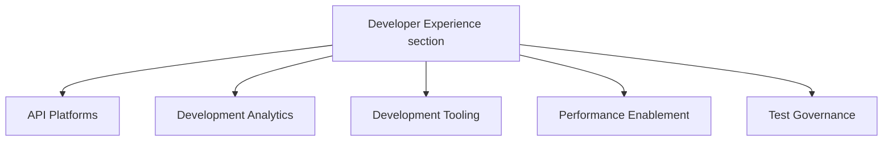

## ミッション

エンジニアリングのツール、プラクティス、データを単一の見つけやすい場所に統合する一貫性のある開発エコシステムへとチームをつなげることで、すべての人にとって機能する形で、GitLab のエンジニアリング速度を加速させ、品質基準を引き上げます。

## ビジョン

GitLab のエンジニアリングチーム向けに、エンジニアリングのツール、プラクティス、データを 1 つの見つけやすい場所につなげる DevEx プラットフォームを確立します。可能な限り GitLab アプリケーション上で構築されたこの社内プラットフォームは、私たち自身のプロダクトを活用してエンジニアリング組織にサービスを提供します。

### 何を実現するか

すべての GitLab エンジニアは、以下を通じて自信を持って高品質な機能をリリースできるようになります。

- バグ、脆弱性、インシデント、本番プラットフォームのニーズに関するツール、テスト、データ、インサイトへのアクセス
- 本番準備状況、機能品質、セキュリティコンプライアンスに関する迅速なフィードバック

### 主なメリット

- ツールの発見性向上
- 部門横断のアラインメント強化
- エンジニアリングチーム全体での開発プラクティスの標準化
- より一貫性があり効率的な機能デリバリー
- 私たち自身のプロダクト機能のドッグフーディング

## 戦略目標

GitLab の成長を SDLC のボトルネックになることなく支えるため、DevEx は以下の 3 つの領域に焦点を当てます。

### 1. DevEx ツールプラットフォームの構築

開発プロセスに直接統合された、よく設計され見つけやすいツールへの単一エントリーポイントを提供します。これによりツールチェーンのオーバーヘッドとセットアップ時間が排除され、チームは目標を自分のものとし、ビジネス価値に集中できます。

### 2. メトリクスのキャプチャとダッシュボードの提供

チームの意思決定をサポートするメトリクスを提供し、ロールアップレポートを通じて開発者体験と品質に関する VP+ 向けの可視性を提供します。

### 3. 完全で高品質なユーザー体験のデリバリー

以下を通じて、リアクティブなサポートからプロアクティブな品質基準へと移行します。

- 念入りに設計されたプロセス
- 統合されたツールプラットフォーム
- 戦略的なテストフレームワーク

GitLab の進化するニーズ (AI 開発ワークフローなど) を予測し、直接的な DevEx サポート作業ではなく、戦略的なコンサルテーションと包括的なプラットフォームツールを通じてチームを支援します。このプラットフォームファーストのアプローチは、GitLab アプリケーション自体を活用し、私たち自身のプロダクトをドッグフーディングしながらエンジニアリング組織にサービスを提供することを可能にします。

DevEx は四半期ごとに DX サーベイを実施して進捗を追跡し、新たなロードマップ項目を特定します。

## DevEx における AI

DevEx チームは、自分たちの作業を加速し、また内側から GitLab の AI 機能を検証するために、AI ツールを積極的に活用しています。

- [DevEx で AI をどう使っているか](ai/) — ツール、ガイドライン、ワークフロー、ドッグフーディングのプラクティス
- [トップヒント](ai/top-tips/) — 日常のエンジニアリングタスクに使える実践的な AI ワークフロー

## 私たちと一緒に働く

各 [DevEx チーム](#team-structure) は、自分たちのハンドブックページにロードマップを保持し、トップレベルチームエピックにリンクされたエピックに取り組みます。

アドホックまたはサポートのリクエストについては、[ヘルプリクエストプロセス](#request-for-help-process) をご利用ください。

### ヘルプリクエストプロセス {#request-for-help-process}

以下の RFH プロセスを通じてサポートをリクエストするための Issue を作成してください。これにより、計画されたプロジェクトロードマップに対してリクエストの優先順位を付けることができます。

- [Request for Help](https://gitlab.com/gitlab-org/quality/request-for-help) プロジェクトの指示に従ってください。Developer Experience の一部のチームは独自のヘルプリクエストプロセスを持っています。リクエストの送付先がわからない場合は、Developer Experience の RFH プロジェクトを使用してください。私たちが適切に振り分けます。
- リクエストを迅速にトリアージできるよう、テンプレートのすべてのセクションを記入してください。
- Developer Experience は 1 週間以内にリクエストをトリアージし、適切なラベルを追加し、リクエストの種類と優先度に基づいてチームメンバーをアサインします。
- より緊急のリクエストの場合は、上記のマネジメントチームにタグ付けしていただいて構いません。

## プロジェクト管理

すべての作業はエピックと Issue で追跡されます。私たちは [Infrastructure Platforms プロジェクト管理プロセス](/handbook/engineering/infrastructure-platforms/project-management/) に従います。

### 新しいプロジェクトの開始

すべてのプロジェクトはエピックから始まります。[Infrastructure Platforms エピックガイド](/handbook/engineering/infrastructure-platforms/project-management/#epics) に従って、必要な情報を含む新しいエピックを作成します。エピックの説明には、コンテキスト、プロジェクトのスコープ、意図された成果が記載されている必要があります。多くの場合、エピックは大きなプロジェクトのイテレーションになります。

- すべてのプロジェクトには DRI がアサインされている必要があります。DRI は意思決定、エピックと Issue のメンテナンス、週次のエピックステータス更新の提供に責任を持ちます。
- ナレッジ共有を可能にするため、各プロジェクトに 1 人以上のメンバーが取り組むことを目指します。シングルスレッドの作業では、タイムゾーンをまたいで働くことでナレッジ共有ができます。チームでの最適なコラボレーション方法について EM と話してください。

Grand Reviews で使用される週次のエピックステータス自動化を有効化するには、https://gitlab.com/gitlab-com/gl-infra/epic-issue-summaries#child-epics の手順に従ってください。

### プロジェクトの完了

計画された作業が完了したら、[Infrastructure Platforms のプロジェクト完了ガイド](/handbook/engineering/infrastructure-platforms/project-management/#when-a-project-is-finished) に従ってください。

## DevEx Grand Review

毎週木曜日、DevEx シニア EM と DevEx EM の 1 名 (または彼らのデリゲート) が、進行中のプロジェクトを通して説明する DevEx Grand Review を録画します。目標はセクション全体でのプロジェクトの可視性を向上させることです。これらのプロジェクトを特定するために [トップレベルエピック](https://gitlab.com/groups/gitlab-org/quality/-/epics/113) が使われます。

木曜日の 17:00 UTC までに、DevEx EM はエピックステータス更新を使って [金曜日の Platforms Grand Review 用ドラフト更新 - 社内リンク](https://docs.google.com/document/d/1gnoXNSpMXPfDqOyKRfIUHfNHUmSu88x8vjIeDOv73dE/edit?usp=sharing) を作成します。DevEx の更新は [金曜日の Grand Review 録画前の社内 Issue](https://gitlab.com/groups/gitlab-com/-/epics/2115) で確定されます。

部門アプローチに関する詳細は [Platforms Grand Review ハンドブックセクション](/handbook/engineering/infrastructure-platforms/project-management/#projects-are-reviewed-weekly-in-the-grand-review) を参照してください。

## Developer Experience デモ

DevEx セクションでは、隔週で社内同期デモコールがスケジュールされています。デモコールの目標は、DevEx グループ全体でつながりを構築し、知識を共有することです。

何かをデモしたい人は、デモアジェンダシートに名前を追加してください。デモは事前に磨き上げられたものや準備されたものである必要はありません。

招待に追加してほしい場合は、[DevEx Slack チャンネル](https://gitlab.enterprise.slack.com/archives/C07TWBRER7H) でメンションしてください。

## チーム構造 {#team-structure}

[Infrastructure Platforms 部門の構造](/handbook/engineering/infrastructure-platforms/#organization-structure) は私たちのハンドブックに記載されています。                                                                                                                   |

### Developer Experience セクション

## チームメンバー

### マネジメントチーム



### チーム

#### API

以下のメンバーは [API グループ](api) のメンバーです。



#### Development Analytics

以下のメンバーは [Development Analytics グループ](development-analytics) のメンバーです。



#### Development Tooling

以下のメンバーは [Development Tooling グループ](development-tooling) のメンバーです。



#### Performance Enablement

以下のメンバーは [Performance Enablement グループ](performance-enablement) のメンバーです。



#### Test Governance

以下のメンバーは [Test Governance グループ](test-governance) のメンバーです。


