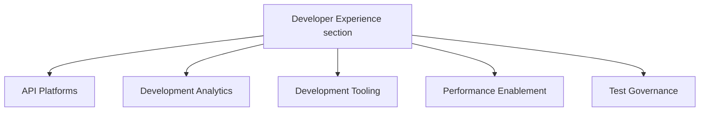

## ミッション

エンジニアリングのツール、プラクティス、データを単一の見つけやすい場所に統合する一貫性のある開発エコシステムへとチームをつなげることで、すべての人にとって機能する形で、GitLab のエンジニアリング速度を加速させ、品質基準を引き上げます。

## ビジョン

GitLab エンジニアリングチームのための DevEx プラットフォームを構築し、エンジニアリングのツール、プラクティス、データを単一の見つけやすい場所に統合します。可能な限り GitLab アプリケーション上に構築されるこの社内プラットフォームは、私たち自身の製品をエンジニアリング組織のために活用します。

### それが実現するもの

GitLab のすべてのエンジニアが、以下を通じて自信を持って高品質な機能をリリースできるようになります:

- バグ、脆弱性、インシデント、本番プラットフォームのニーズに関するツール、テスト、データ、洞察へのアクセス
- 本番リリース可否、機能品質、セキュリティコンプライアンスに関する迅速なフィードバック

### 主要なメリット

- ツール発見性の向上
- 部門横断的な連携の強化
- エンジニアリングチーム全体での開発プラクティスの標準化
- より一貫性のある効率的な機能デリバリー
- 私たち自身の製品機能のドッグフーディング

## 戦略目標

GitLab の成長を SDLC のボトルネックにならずに支援するため、DevEx は 3 つの領域に注力します:

### 1. DevEx ツールプラットフォームの構築

開発プロセスに直接統合された、適切に設計され見つけやすいツールへの単一のエントリポイントを提供します。これによりツールチェーンのオーバーヘッドとセットアップ時間を排除し、チームが自分たちの目標を所有し、ビジネス価値に集中できるようにします。

### 2. メトリクスの収集とダッシュボードの提供

チームの意思決定を支援するメトリクスを提供し、ロールアップレポートを通じて開発者体験と品質に対する VP+ の可視性を提供します

### 3. 完全で高品質なユーザーエクスペリエンスを提供

以下を通じて、リアクティブなサポートからプロアクティブな品質基準へと移行します:

- 思慮深く設計されたプロセス
- 統合されたツールプラットフォーム
- 戦略的なテストフレームワーク

私たちは GitLab の進化するニーズ (AI 開発ワークフローなど) を予測し、直接的な DevEx サポート作業ではなく、戦略的なコンサルテーションと包括的なプラットフォームツールを通じてチームを強化します。このプラットフォーム重視のアプローチは GitLab アプリケーション自体を活用し、エンジニアリング組織にサービスを提供しつつ、私たち自身の製品をドッグフーディングできるようにします

DevEx は四半期ごとに DX サーベイを実施し、進捗を追跡し新しいロードマップ項目を特定します。

## DevEx における AI

DevEx チームは、自分たちの作業を加速させ、GitLab の AI 機能を内側から検証するために AI ツールを積極的に使用しています。

- [DevEx での AI の使い方](ai/) — ツール、ガイドライン、ワークフロー、ドッグフーディングプラクティス
- [トップヒント](ai/top-tips/) — 日々のエンジニアリングタスクのための実践的な AI ワークフロー

## 私たちとの協働方法

各 [DevEx チーム](#team-structure)はハンドブックページにロードマップを保持しており、トップレベルのチームエピックにリンクされたエピックに取り組んでいます。

アドホックなリクエストやサポートリクエストには、[Request for Help プロセス](#request-for-help-process)を使ってください

### Request for Help プロセス {#request-for-help-process}

以下の RFH プロセスを通じて、サポートを依頼する Issue を作成してください。これにより、計画されているプロジェクトロードマップに対してリクエストの優先順位付けが可能になります。

- [Request for Help](https://gitlab.com/gitlab-org/quality/request-for-help) プロジェクトの手順に従ってください。Developer Experience の一部のチームには独自の Request for Help プロセスがあります。リクエストの送り先が不明な場合は、Developer Experience RFH プロジェクトを使ってください。適切にルーティングします。
- 迅速にリクエストをトリアージできるよう、テンプレートのすべてのセクションを記入してください
- Developer Experience は 1 週間以内にリクエストをトリアージし、適切なラベルを追加し、リクエストの種類と優先度に基づいてチームメンバーを割り当てます。
- より緊急のリクエストについては、上記のマネジメントチームにタグ付けしていただいて構いません。

## プロジェクトマネジメント

すべての作業はエピックと Issue で追跡されます。私たちは [Infrastructure Platforms のプロジェクトマネジメントプロセス](/handbook/engineering/infrastructure-platforms/project-management/)に従います

### 新しいプロジェクトの開始

すべてのプロジェクトはエピックから始まります。[Infrastructure Platforms のエピックガイド](/handbook/engineering/infrastructure-platforms/project-management/#epics)に従って、必要な情報を備えた新しいエピックを作成してください。エピックの説明は、コンテキスト、プロジェクトスコープ、意図された成果を示すべきです。多くの場合、エピックはより大きなプロジェクトのイテレーションになります。

- すべてのプロジェクトには DRI を割り当てるべきです。DRI は意思決定、エピックと Issue の維持、週次エピックステータスアップデートの提供に責任を負います。
- ナレッジ共有を可能にするため、各プロジェクトに 2 人以上のメンバーが取り組むことを目指します。単一スレッドの作業を伴うプロジェクトでは、タイムゾーンをまたいで作業することでナレッジ共有を行えます。チームが作業で協働する最良の方法について、EM と話し合ってください。

Grand Reviews 用の週次エピックステータスオートメーションを有効にするため、 https://gitlab.com/gitlab-com/gl-infra/epic-issue-summaries#child-epics の手順に従ってください。

### プロジェクトの完了

計画された作業が完了した後、[Infrastructure Platforms のプロジェクト完了ガイド](/handbook/engineering/infrastructure-platforms/project-management/#when-a-project-is-finished)に従ってください

## DevEx Grand Reviews

毎週木曜日、DevEx Senior EM と DevEx EM の 1 人 (またはその代理) が DevEx Grand Review を録画し、進行中のプロジェクトを通して説明します。目標はセクション全体でのプロジェクトの可視性を向上させることです。これらのプロジェクトを特定するために[トップレベルのエピック](https://gitlab.com/groups/gitlab-org/quality/-/epics/113)が使われます。

木曜日 17:00 UTC 前に、DevEx EM はエピックステータスアップデートを使って[金曜 Platforms Grand Review のアップデートを下書きします - 内部リンク](https://docs.google.com/document/d/1gnoXNSpMXPfDqOyKRfIUHfNHUmSu88x8vjIeDOv73dE/edit?usp=sharing)。DevEx のアップデートは、金曜 Grand Review の録画の前に[内部 Issue](https://gitlab.com/groups/gitlab-com/-/epics/2115) 上で最終化されます。

部門のアプローチに関する詳細は、[Platforms Grand Review ハンドブックセクション](/handbook/engineering/infrastructure-platforms/project-management/#projects-are-reviewed-weekly-in-the-grand-review)を参照してください

## Developer Experience デモ

DevEx セクションは隔週で社内同期デモコールを予定しています。デモコールの目標は、DevEx グループ全体でつながりを築き、ナレッジを共有することです。

何かをデモしたい人は、デモのアジェンダシートに自分の名前を追加してください。デモは事前に磨き上げたり準備したりする必要はありません。

招待に追加してほしい場合は、[DevEx Slack チャンネル](https://gitlab.enterprise.slack.com/archives/C07TWBRER7H)で連絡してください。

## チーム構造 {#team-structure}

[Infrastructure Platforms 部門の構造](/handbook/engineering/infrastructure-platforms/#organization-structure)は私たちのハンドブックに記載されています。                                                                                                                   |

### Developer Experience セクション

## チームメンバー

### マネジメントチーム



### チーム

#### API

次のメンバーが [API グループ](api)に所属しています:



#### Development Analytics

次のメンバーが [Development Analytics グループ](development-analytics)に所属しています:



#### Development Tooling

次のメンバーが [Development Tooling グループ](development-tooling)に所属しています:



#### Performance Enablement

次のメンバーが [Performance Enablement グループ](performance-enablement)に所属しています:



#### Test Governance

次のメンバーが [Test Governance グループ](test-governance)に所属しています:


